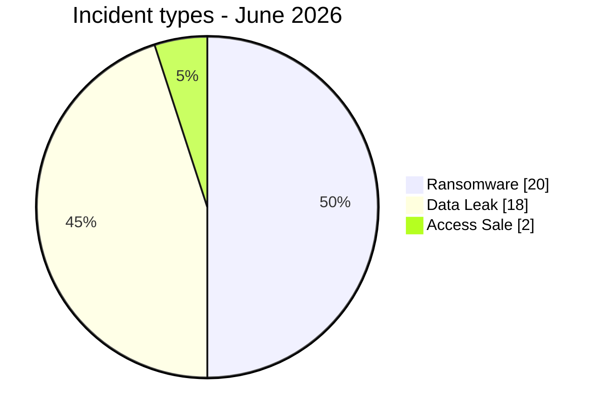
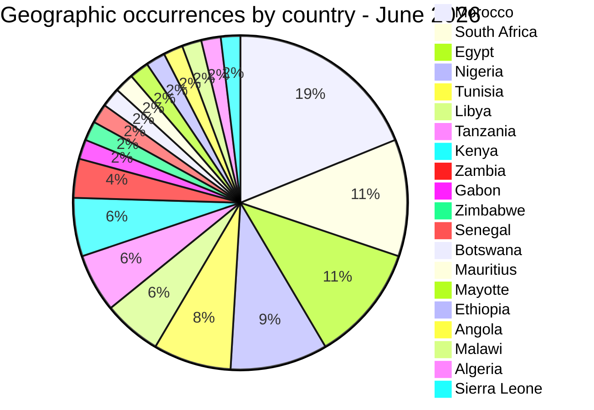
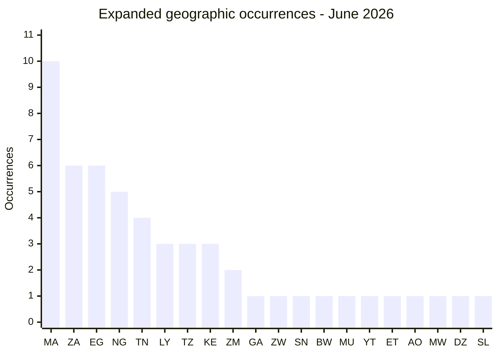
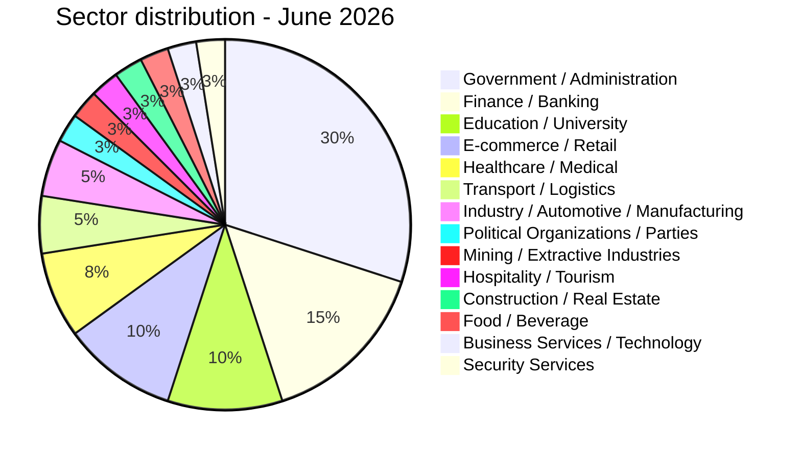
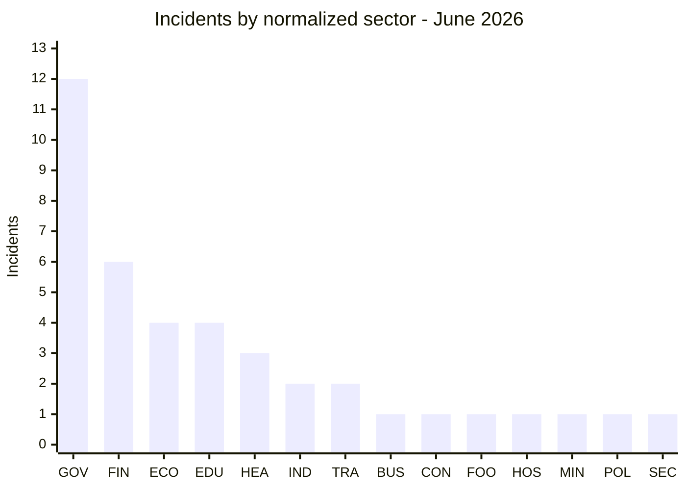
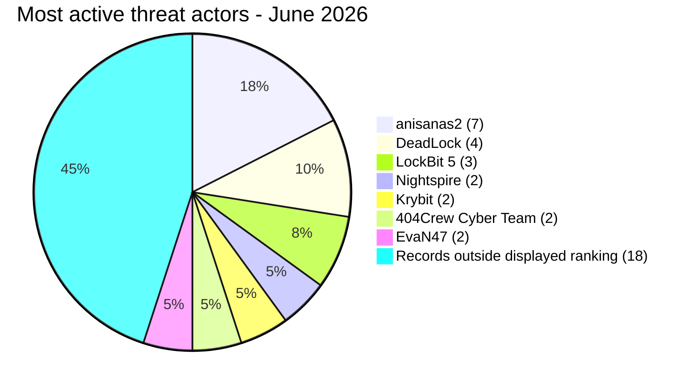
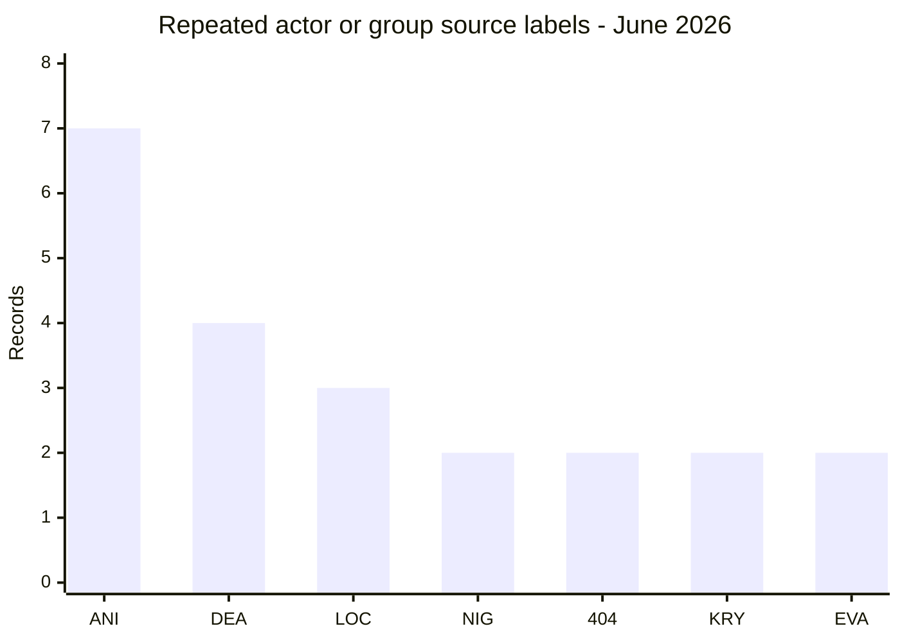
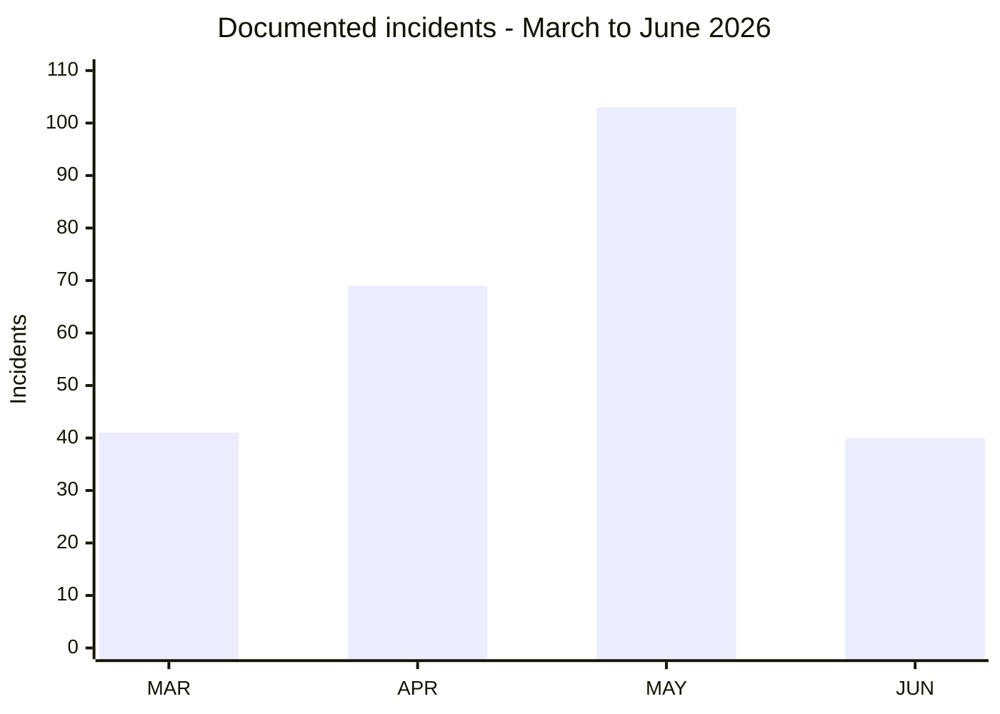

# CTI report - cyberattacks in Africa (June 2026)

👉🏾 [**French version available here**](./README_FR.md)

## 1. Executive summary

June 2026 contains **40 publicly reported or claimed cyber incidents** across Africa: **20 ransomware listings or disclosures (50.0%)**, **18 data leaks (45.0%)** and **2 access sales (5.0%)**.

Compared with the validated May corpus of **103 incidents**, June contains **63 fewer documented records (-61.2%)**. The ransomware count itself moves from **17 to 20 (+17.6%)**, while its share rises from **16.5% to 50.0%** because the June corpus is much smaller and contains no DDoS records. This change in share should not be interpreted by itself as evidence of a structural shift in attacker behaviour.

Key findings:
- **40 unique incidents**: 20 Ransomware, 18 Data Leak and 2 Access Sale.
- **14 countries** are directly affected, plus **6 additional African countries** exposed through two multi-country Access Sale records, for **20 African countries** represented overall.
- **Morocco has 9 direct incidents**, the highest direct-country count in June. Seven data-leak publications are associated with **anisanas2**.
- **Jeroid.co (Nigeria)** is associated with a claim involving KYC and biometric material. The reviewed material suggests access to KYC data through an unauthenticated S3 bucket, but the complete claimed volume and initial access vector are not independently confirmed.
- Material attributed to the **Nigerian Army** reportedly included plaintext webmail credentials for more than 20 military accounts and credentials associated with a satellite-imagery portal.
- **BRELA (Tanzania)** is associated with a claim of 10.2 million records covering approximately 8 million people. The complete scope is not independently confirmed.
- **Two Libyan ministries** were published on consecutive days under the EvaN47 source label. The timing and attribution support continued monitoring but do not establish a coordinated campaign.

### Victim list

👉🏾 [View full victim list](./victims.md)
---

### 1.1 Month-over-month comparison

> Comparison based on validated AFRINTEL monthly corpora. A change in documented records does not, by itself, prove a change in the real number of compromises.

| Indicator | May 2026 | June 2026 | Observed change |
|---|---:|---:|---:|
| Total incidents | 103 | 40 | **-63 (-61.2%)** |
| Ransomware | 17 | 20 | **+3 (+17.6%)** |
| Data Leak | 41 | 18 | **-23 (-56.1%)** |
| Access Sale | 2 | 2 | **0 (+0.0%)** |
| DDoS | 43 | 0 | **-43 (-100.0%)** |
| Defacement | 0 | 0 | **0 (stable)** |
| Operational Fraud | 0 | 0 | **0 (stable)** |

> Reading rule: when the previous month is `0` and the current month is greater than `0`, the change is marked `new` instead of using an artificial percentage. Categories that are absent remain displayed as `0`.

## 2. Methodology

- **Scope**: 54 African countries.
- **Period**: 1-30 June 2026 (incidents disclosed or claimed during this month; actual attack dates may be earlier).
- **Sources**: Dark web, DLS (leak sites), OSINT, Telegram channels, underground forums.
- **Inclusion**: Incidents first identified and assessed by AFRINTEL during June 2026. The original claim or attack date may be earlier and is retained in the victim card when known.
- **Typology**:
  - *Ransomware*: claim or disclosure attributed to a ransomware group. Encryption is not assumed unless supporting evidence is available.
  - *Data Leak*: published or sold data outside a ransomware classification.
  - *Access Sale*: advertised access or credential sale to compromised systems.

---

## 3. Global overview

| Indicator | Value |
|---|---|
| Total victims | 40 unique incidents |
| Countries affected | 20 (14 direct + 6 via multi-country incidents) |
| Country occurrences | 53 (38 direct + 15 exposures from 2 multi-country incidents) |
| Distinct actors | 25 |
| Ransomware incidents | 20 (50.0%) |
| Data leaks | 18 (45.0%) |
| Access sales | 2 (5.0%) |

### Incident type distribution

**Visual convention:** 🟧 Ransomware | 🟦 Data Leak / Access Sale.

### Country ranking

**Expanded geographic ranking (53 country occurrences from 40 unique incidents):**

| Rank | Country | Direct incidents | Multi-country exposures | Geographic total | Chart |
| :---: | :--- | :---: | :---: | :---: | :--- |
| **1** | 🇲🇦 Morocco | 9 | 1 | **10** | ██████████ |
| **2** | 🇿🇦 South Africa | 6 | 0 | **6** | ██████ |
| **2** | 🇪🇬 Egypt | 4 | 2 | **6** | ██████ |
| **4** | 🇳🇬 Nigeria | 4 | 1 | **5** | █████ |
| **5** | 🇹🇳 Tunisia | 4 | 0 | **4** | ████ |
| **6** | 🇱🇾 Libya | 3 | 0 | **3** | ███ |
| **6** | 🇹🇿 Tanzania | 1 | 2 | **3** | ███ |
| **6** | 🇰🇪 Kenya | 1 | 2 | **3** | ███ |
| **9** | 🇿🇲 Zambia | 0 | 2 | **2** | ██ |
| **10** | 🇬🇦 Gabon | 1 | 0 | **1** | █ |
| **10** | 🇿🇼 Zimbabwe | 1 | 0 | **1** | █ |
| **10** | 🇸🇳 Senegal | 1 | 0 | **1** | █ |
| **10** | 🇧🇼 Botswana | 1 | 0 | **1** | █ |
| **10** | 🇲🇺 Mauritius | 1 | 0 | **1** | █ |
| **10** | 🇾🇹 Mayotte | 1 | 0 | **1** | █ |
| **10** | 🇪🇹 Ethiopia | 0 | 1 | **1** | █ |
| **10** | 🇦🇴 Angola | 0 | 1 | **1** | █ |
| **10** | 🇲🇼 Malawi | 0 | 1 | **1** | █ |
| **10** | 🇩🇿 Algeria | 0 | 1 | **1** | █ |
| **10** | 🇸🇱 Sierra Leone | 0 | 1 | **1** | █ |

> The report records 40 unique incidents. The geographic ranking totals 53 country occurrences because the Convince and Governor offers are allocated to every explicitly named African country. This allocation does not change the global total. Palestine and Yemen are excluded because they fall outside the African scope.

**Country code legend:** `MA` = Morocco | `ZA` = South Africa | `EG` = Egypt | `NG` = Nigeria | `TN` = Tunisia | `LY` = Libya | `TZ` = Tanzania | `KE` = Kenya | `ZM` = Zambia | `GA` = Gabon | `ZW` = Zimbabwe | `SN` = Senegal | `BW` = Botswana | `MU` = Mauritius | `YT` = Mayotte | `ET` = Ethiopia | `AO` = Angola | `MW` = Malawi | `DZ` = Algeria | `SL` = Sierra Leone

### Ransomware distribution (Total: 20)

| Rank | Country | Incidents | Chart |
| :---: | :--- | :---: | :--- |
| **1** | 🇿🇦 South Africa | **4** | ████ |
| **2** | 🇪🇬 Egypt | **3** | ███ |
| **2** | 🇹🇳 Tunisia | **3** | ███ |
| **4** | 🇲🇦 Morocco | **1** | █ |
| **4** | 🇳🇬 Nigeria | **1** | █ |
| **4** | 🇱🇾 Libya | **1** | █ |
| **4** | 🇬🇦 Gabon | **1** | █ |
| **4** | 🇿🇼 Zimbabwe | **1** | █ |
| **4** | 🇸🇳 Senegal | **1** | █ |
| **4** | 🇧🇼 Botswana | **1** | █ |
| **4** | 🇲🇺 Mauritius | **1** | █ |
| **4** | 🇾🇹 Mayotte | **1** | █ |
| **4** | 🇰🇪 Kenya | **1** | █ |

### Geographic distribution of data leaks / access sales

**20 unique incidents, representing 33 country occurrences after allocating the two multi-country offers.**

| Rank | Country | Occurrences | Chart |
| :---: | :--- | :---: | :--- |
| **1** | 🇲🇦 Morocco | **9** | █████████ |
| **2** | 🇳🇬 Nigeria | **4** | ████ |
| **3** | 🇪🇬 Egypt | **3** | ███ |
| **3** | 🇹🇿 Tanzania | **3** | ███ |
| **5** | 🇿🇦 South Africa | **2** | ██ |
| **5** | 🇱🇾 Libya | **2** | ██ |
| **5** | 🇰🇪 Kenya | **2** | ██ |
| **5** | 🇿🇲 Zambia | **2** | ██ |
| **9** | 🇹🇳 Tunisia | **1** | █ |
| **9** | 🇪🇹 Ethiopia | **1** | █ |
| **9** | 🇦🇴 Angola | **1** | █ |
| **9** | 🇲🇼 Malawi | **1** | █ |
| **9** | 🇩🇿 Algeria | **1** | █ |
| **9** | 🇸🇱 Sierra Leone | **1** | █ |

### Ransomware vs Data Leak / Access Sale by country and scope

This comparison uses the **40 unique incidents**, not the expanded 53 geographic occurrences. It compares **20 ransomware incidents** with **20 Data Leak / Access Sale incidents**. The blue series contains **18 Data Leak records and 2 Access Sale records**.

The two Access Sale records are represented under `MULTI` because both concern multiple countries.

**Visual legend:** 🟧 Ransomware | 🟦 Data Leak / Access Sale

| Code | Country / scope | Ransomware | Bar | Data Leak / Access Sale | Bar |
|---|---|---:|---|---:|---|
| `MA` | Morocco | **1** | 🟧 | **8** | 🟦🟦🟦🟦🟦🟦🟦🟦 |
| `ZA` | South Africa | **4** | 🟧🟧🟧🟧 | **2** | 🟦🟦 |
| `EG` | Egypt | **3** | 🟧🟧🟧 | **1** | 🟦 |
| `NG` | Nigeria | **1** | 🟧 | **3** | 🟦🟦🟦 |
| `TN` | Tunisia | **3** | 🟧🟧🟧 | **1** | 🟦 |
| `LY` | Libya | **1** | 🟧 | **2** | 🟦🟦 |
| `TZ` | Tanzania | **0** | - | **1** | 🟦 |
| `KE` | Kenya | **1** | 🟧 | **0** | - |
| `GA` | Gabon | **1** | 🟧 | **0** | - |
| `ZW` | Zimbabwe | **1** | 🟧 | **0** | - |
| `SN` | Senegal | **1** | 🟧 | **0** | - |
| `BW` | Botswana | **1** | 🟧 | **0** | - |
| `MU` | Mauritius | **1** | 🟧 | **0** | - |
| `YT` | Mayotte | **1** | 🟧 | **0** | - |
| `MULTI` | Multi-country records | **0** | - | **2** | 🟦🟦 |
|  | **Compared total** | **20** |  | **20** |  |

```mermaid
xychart-beta
    title "Ransomware vs Data Leak / Access Sale - June 2026"
    x-axis ["MA", "ZA", "EG", "NG", "TN", "LY", "TZ", "KE", "GA", "ZW", "SN", "BW", "MU", "YT", "MULTI"]
    y-axis "Incidents" 0 --> 9
    bar [1, 4, 3, 1, 3, 1, 0, 1, 1, 1, 1, 1, 1, 1, 0]
    bar [8, 2, 1, 3, 1, 2, 1, 0, 0, 0, 0, 0, 0, 0, 2]
```

**Series legend:** first bar series = 🟧 Ransomware | second bar series = 🟦 Data Leak / Access Sale.

**Country legend:** `MA` = Morocco | `ZA` = South Africa | `EG` = Egypt | `NG` = Nigeria | `TN` = Tunisia | `LY` = Libya | `TZ` = Tanzania | `KE` = Kenya | `GA` = Gabon | `ZW` = Zimbabwe | `SN` = Senegal | `BW` = Botswana | `MU` = Mauritius | `YT` = Mayotte | `MULTI` = Multi-country records

> The expanded geographic view remains 53 country occurrences because the two multi-country Access Sale records are allocated to every explicitly named African country. This does not change the analytical total of 40 unique incidents.

### Geographic breakdown by region

| Region | Country occurrences | Ransomware | Leaks | Side-by-side |
| :--- | :---: | :---: | :---: | :--- |
| **North Africa** | **24** (45.3%) | 8 | 16 | 🟧🟧🟧🟧🟧🟧🟧🟧 🟦🟦🟦🟦🟦🟦🟦🟦🟦🟦🟦🟦🟦🟦🟦🟦 |
| **Southern Africa** | **11** (20.8%) | 6 | 5 | 🟧🟧🟧🟧🟧🟧 🟦🟦🟦🟦🟦 |
| **West Africa** | **7** (13.2%) | 2 | 5 | 🟧🟧 🟦🟦🟦🟦🟦 |
| **Central Africa** | **2** (3.8%) | 1 | 1 | 🟧 🟦 |
| **East Africa** | **7** (13.2%) | 1 | 6 | 🟧 🟦🟦🟦🟦🟦🟦 |
| **Indian Ocean** | **2** (3.8%) | 2 | 0 | 🟧🟧 |
| **Total** | **53** | **20** | **33** | |

*Legend: 🟧 Ransomware | 🟦 Data Leaks. North Africa: Morocco, Egypt, Tunisia, Libya, Algeria. Southern Africa: South Africa, Botswana, Zimbabwe, Zambia, Malawi. West Africa: Nigeria, Senegal, Sierra Leone. Central Africa: Gabon, Angola. East Africa: Kenya, Tanzania, Ethiopia. Indian Ocean: Mauritius, Mayotte. Angola is classified here as Central Africa.*

### Sector distribution

| Activity sector | Incidents | Share (%) | Chart |
| :--- | :---: | :---: | :--- |
| **Government / Administration** | **12** | 30.0% | ████████████ |
| **Finance / Banking** | **6** | 15.0% | ██████ |
| **Education / University** | **4** | 10.0% | ████ |
| **E-commerce / Retail** | **4** | 10.0% | ████ |
| **Healthcare / Medical** | **3** | 7.5% | ███ |
| **Transport / Logistics** | **2** | 5.0% | ██ |
| **Industry / Automotive / Manufacturing** | **2** | 5.0% | ██ |
| **Political Organizations / Parties** | **1** | 2.5% | █ |
| **Mining / Extractive Industries** | **1** | 2.5% | █ |
| **Hospitality / Tourism** | **1** | 2.5% | █ |
| **Construction / Real Estate** | **1** | 2.5% | █ |
| **Food / Beverage** | **1** | 2.5% | █ |
| **Business Services / Technology** | **1** | 2.5% | █ |
| **Security Services** | **1** | 2.5% | █ |
| **Total** | **40** | **100%** | |

**Sector code legend:** `GOV` = Government / Administration | `FIN` = Finance / Banking | `ECO` = E-commerce / Retail | `EDU` = Education / University | `HEA` = Healthcare / Medical | `IND` = Industry / Automotive / Manufacturing | `TRA` = Transport / Logistics | `BUS` = Business Services / Technology | `CON` = Construction / Real Estate | `FOO` = Food / Beverage | `HOS` = Hospitality / Tourism | `MIN` = Mining / Extractive Industries | `POL` = Political Organizations / Parties | `SEC` = Security Services

### Most prolific threat actors and groups

| Threat actor / Group | Incidents | Primary activity | Chart |
| :--- | :---: | :--- | :--- |
| **anisanas2** | **7** | Data leaks / sales (Morocco, publications observed across 3 months) | 🟦🟦🟦🟦🟦🟦🟦 |
| **DeadLock** | **4** | Ransomware (multi-country: Gabon, Nigeria, Mayotte, Kenya) | 🟧🟧🟧🟧 |
| **LockBit 5** | **3** | Ransomware (Botswana, South Africa, Mauritius) | 🟧🟧🟧 |
| **Nightspire** | **2** | Ransomware (Zimbabwe, Egypt) | 🟧🟧 |
| **Krybit** | **2** | Ransomware / data published (Senegal, Morocco) | 🟧🟧 |
| **404Crew Cyber Team** | **2** | Data leak (Nigeria coalition, Morocco) | 🟦🟦 |
| **EvaN47** | **2** | Data leak (Libya, two ministries in two days) | 🟦🟦 |

*Legend: 🟧 Ransomware \| 🟦 Data Leaks*

---

### Geographic summary

> **For details of each incident, see the complete victim list:** [`victims.md`](./victims.md)

- **Concentration:** Morocco (9 direct incidents) and South Africa (6) account for 37.5% of the month's 40 unique incidents. The expanded geographic ranking reaches 53 country occurrences when exposures from the two multi-country incidents are included.
- **Campaign targeting Morocco:** anisanas2 is associated with 7 of the 9 direct incidents recorded in the country in June. Claims and publications analysed since April show a persistent cluster affecting several sectors, including education, logistics, mining, e-commerce, startups and automotive.
- **Ransomware distribution:** South Africa recorded 4 incidents, while Egypt and Tunisia recorded 3 each. DeadLock had the widest geographic spread, with victims published in Gabon, Nigeria, Mayotte and Kenya.
- **High-impact exposures:** the most sensitive cases involve fintech and biometric data associated with Jeroid.co, email credentials attributed to the Nigerian Army, the 10.2 million records claimed for BRELA in Tanzania and two consecutive publications targeting Libyan education ministries.
- **Multi-country risk:** two sales of credentials or access to government and law-enforcement portals account for 15 occurrences across 11 African countries. They create a risk of institutional impersonation targeting major platforms.
- **Overall picture:** the 40 unique incidents affect 20 African countries, either directly or through multi-country exposure. Ransomware and data leaks or access sales reached parity, with 20 incidents in each category.

---

## 4. Detailed analysis by incident type

### 4.1 Ransomware (20 incidents)

| Rank | Country | Attacks | Main threat actors |
| :---: | :--- | :---: | :--- |
| **1** | 🇿🇦 South Africa | **4** | Black X, WorldLeaks, LockBit 5, CMD Organization |
| **2** | 🇪🇬 Egypt | **3** | TheGentlemen, Nightspire, Lamashtu |
| **2** | 🇹🇳 Tunisia | **3** | Aurora, SETTRA, Stormous |
| **4** | 🇲🇦 Morocco | **1** | Krybit |
| **4** | 🇳🇬 Nigeria | **1** | DeadLock |
| **4** | 🇱🇾 Libya | **1** | Qilin |
| **4** | 🇬🇦 Gabon | **1** | DeadLock |
| **4** | 🇿🇼 Zimbabwe | **1** | Nightspire |
| **4** | 🇸🇳 Senegal | **1** | Krybit |
| **4** | 🇧🇼 Botswana | **1** | LockBit 5 |
| **4** | 🇲🇺 Mauritius | **1** | LockBit 5 |
| **4** | 🇾🇹 Mayotte | **1** | DeadLock |
| **4** | 🇰🇪 Kenya | **1** | DeadLock |

**Observations:** ransomware's share of monthly incidents doubled compared to May, 28% to 50%. **DeadLock** spread widest geographically, four countries across the continent (Gabon, Nigeria, Mayotte, Kenya), and stuck to a consistent pattern: claim, threaten disclosure, and in Mayotte's case, actually follow through. **LockBit 5** published three victim listings across three countries in a single week, on June 18, none of which had an accessible sample during AFRINTEL's collection. The two exceptions where data actually got published: **Mayotte's Municipality of Ouangani**, where DeadLock delivered a 138 MB dump of payroll and civil-registry data, and the **ANC**, where Black X published 2.3 million membership records outright.

### 4.2 Data leaks and access sales - 18 Data Leak + 2 Access Sale

| Rank | Country | Occurrences | Main actors |
| :---: | :--- | :---: | :--- |
| **1** | 🇲🇦 Morocco | **9** | anisanas2 (7), 404Crew Cyber Team, Convince |
| **2** | 🇳🇬 Nigeria | **4** | burti, 404Crew CT x NullSec Nigeria, NullSec Nigeria, Convince |
| **3** | 🇪🇬 Egypt | **3** | Xyphorix, Convince, Governor |
| **3** | 🇹🇿 Tanzania | **3** | hammer, Convince, Governor |
| **5** | 🇿🇦 South Africa | **2** | mosad, GOD User |
| **5** | 🇱🇾 Libya | **2** | EvaN47 |
| **5** | 🇰🇪 Kenya | **2** | Convince, Governor |
| **5** | 🇿🇲 Zambia | **2** | Convince, Governor |
| **9** | 🇹🇳 Tunisia | **1** | AshleyWood2022 |
| **9** | 🇪🇹 Ethiopia | **1** | Convince |
| **9** | 🇦🇴 Angola | **1** | Convince |
| **9** | 🇲🇼 Malawi | **1** | Governor |
| **9** | 🇩🇿 Algeria | **1** | Governor |
| **9** | 🇸🇱 Sierra Leone | **1** | Governor |

**Key observations:**
- **anisanas2** alone accounts for 35% of all data leaks/sales this month (7 of 20), all in Morocco. No other actor comes close to that concentration.
- Nigeria's three leaks span three completely different threat models in one month: a fintech biometric exposure (Jeroid.co), a hacktivist parliamentary leak (NILDS), and a plaintext military credential dump (army.mil.ng). That range, in a single country in four weeks, says more about the breadth of Nigeria's exposed attack surface than any single incident does.
- Two consecutive publications attributed to **EvaN47** concerned Libyan education ministries on June 29-30. This is a monitoring lead; the available material does not establish coordination beyond the shared actor attribution and timing.
- The **Convince** and **Governor** listings together expose government or police credentials representing 15 country mentions across 11 African countries. Neither incident is a "leak" in the traditional sense, both are commercial products built specifically to defraud Meta, Google, TikTok and X into handing over user data under false legal pretenses.

---

## 5. Sectoral impact

| Activity sector | Incidents | Share (%) | Visual impact |
| :--- | :---: | :---: | :--- |
| **Government / Administration** | **12** | 30.0% | ████████████ |
| **Finance / Banking** | **6** | 15.0% | ██████ |
| **Education / University** | **4** | 10.0% | ████ |
| **E-commerce / Retail** | **4** | 10.0% | ████ |
| **Healthcare / Medical** | **3** | 7.5% | ███ |
| **Transport / Logistics** | **2** | 5.0% | ██ |
| **Industry / Automotive / Manufacturing** | **2** | 5.0% | ██ |
| **Political Organizations / Parties** | **1** | 2.5% | █ |
| **Mining / Extractive Industries** | **1** | 2.5% | █ |
| **Hospitality / Tourism** | **1** | 2.5% | █ |
| **Construction / Real Estate** | **1** | 2.5% | █ |
| **Food / Beverage** | **1** | 2.5% | █ |
| **Business Services / Technology** | **1** | 2.5% | █ |
| **Security Services** | **1** | 2.5% | █ |
| **Total** | **40** | **100%** | |

**Key observations:**
- **Government / Administration remains the largest category:** 12 incidents, or 30.0%, compared with 20 of 57 in May (35.1%).
- **Finance / Banking doubled:** six incidents, compared with three in May, covering fintech, pension, banking, central-bank and mutual-insurance organizations.
- **Two national-security-grade incidents this month:** the SANDF classified document leak and the Nigerian Army credential dump both fall under Government/Defense and both involve direct exposure of military personnel and operational data, an unusually severe pairing for a single month.
- **Education and healthcare account for seven records:** four in Education / University and three in Healthcare / Medical. The monthly counts alone do not establish a broader trend.

---

## 6. Threat actor profile

| Threat actor | Type | Incidents | Primary targets |
| :--- | :--- | :---: | :--- |
| **anisanas2** | Data leak / sale cluster | **7** | Moroccan organizations across education, logistics, mining, e-commerce, automotive (3rd consecutive month active) |
| **DeadLock** | Ransomware | **4** | Multi-country: Gabon, Nigeria, Mayotte, Kenya |
| **LockBit 5** | Ransomware | **3** | Botswana, South Africa, Mauritius (single-week listing spree) |
| **Nightspire** | Ransomware | **2** | Zimbabwe, Egypt |
| **Krybit** | Ransomware / data leak | **2** | Senegal (audit institution), Morocco (health mutual) |
| **404Crew Cyber Team** | Data leak (coalition and solo) | **2** | Nigerian legislature (with NullSec Nigeria), Moroccan medical association |
| **EvaN47** | Data leak | **2** | Libyan government education ministries (2 in 2 days) |

**Emerging actors:**
- **burti** (Jeroid.co, Nigeria): first AFRINTEL appearance, high-severity fintech data broker.
- **NullSec Nigeria** (Nigerian Army credential leak): politically-motivated, first documented appearance.
- **Convince** and **Governor**: two separate actors running parallel law-enforcement impersonation businesses; possibly connected, both first appeared in AFRINTEL records in May-June 2026.
- **mosad** (SANDF classified document leak): single appearance, high-sensitivity military source.

**Actor/group code legend:** `ANI` = anisanas2 | `DEA` = DeadLock | `LOC` = LockBit 5 | `NIG` = Nightspire | `404` = 404Crew Cyber Team | `KRY` = Krybit | `EVA` = EvaN47

> The chart shows source labels appearing at least twice. Provenance tags are removed for counting only.

### 6.1 Risk assessment

| Country | Risk level |
|---|---|
| Morocco | 🔴 Critical/High |
| South Africa | 🔴 Critical/High |
| Nigeria | 🔴 Critical/High (fintech biometric leak + military credential exposure in the same month) |
| Egypt | 🟠 Medium |
| Tunisia | 🟠 Medium |
| Libya | 🟠 Medium (watch: two ministries hit in two days, potential campaign into July) |
| Tanzania | 🟠 Medium (single incident, but 10.2M records is a national-scale exposure) |
| Remaining countries | 🟡 Low-Medium |

---

## 7. Key trends and intelligence gaps

### Trends

1. **Ransomware represents 50.0% of June, compared with 16.5% in May.** The absolute ransomware count rises only from 17 to 20. The larger share mainly reflects the smaller June corpus and the absence of DDoS records, so it should not be treated by itself as evidence of a lasting actor shift.
2. **Morocco keeps coming up.** Publications tied to anisanas2 span April, May and June. The continuity is real; whether it's one standing operation is still just a hypothesis.
3. **A fintech exposure looks genuinely serious.** The Jeroid.co material points to a real cloud-storage control failure involving KYC data. Full volume and initial access vector are both still unconfirmed.
4. **Military credential hygiene is a live concern.** Both the Nigerian Army credential publication and the SANDF document publication show sensitive material getting out. How the compromises happened and where the document-lifecycle controls failed remain unknown.
5. **Law-enforcement impersonation is going cross-border.** Convince and Governor's publications together mention 15 countries across 11 African nations. Nothing ties the two sellers together, though.
6. **Two Libyan ministries, back to back.** Same actor, June 29 and 30. Worth continued monitoring, not yet a sustained campaign.

### Intelligence gaps

- The actual operator behind the "unidentified startup management platform" and "unidentified Moroccan delivery company" leaks (both attributed to anisanas2) has not been established; without a named platform, affected individuals cannot be meaningfully notified.
- For the Bouri Group, Access Dental, Sheraton Miramar, Great Foods, Central Bank of Libya, KeNHA, monoprix.tn and Fidelity Security Group listings, no data sample was accessible during collection. The victim cards record the observed listings and the material available at that time.
- The reason why Finam Gabon's announced data publication was not accessible remains unknown.
- The true reach of the Convince and Governor credential catalogs may extend beyond what was publicly listed; both may represent partial inventories.

---

### Factual comparison with May 2026

This comparison uses the validated May corpus of **103 incidents** and the June corpus of **40 incidents**. It describes AFRINTEL's documented public record and does not infer a change in the true number of compromises.

| Indicator | May 2026 | June 2026 | Observed change |
| :--- | ---: | ---: | :--- |
| Documented incidents | 103 | 40 | **-63 (-61.2%)** |
| Ransomware | 17 | 20 | **+3 (+17.6%)** |
| Data Leak | 41 | 18 | **-23 (-56.1%)** |
| Access Sale | 2 | 2 | **0 (0.0%)** |
| DDoS claims | 43 | 0 | **-43 (-100.0%)** |

The May total includes a large retrospective DDoS corpus. The month-on-month variation may also reflect publication timing, monitoring coverage and multi-country counting rules. It should not be read as a confirmed change in the true number of compromises.

**Time legend:** `MAR` = March | `APR` = April | `MAY` = May | `JUN` = June 2026.

## 8. MITRE ATT&CK mapping (contextual)

The following techniques are defensive hypotheses derived from the exposed material. They do not establish the intrusion path unless the source explicitly described the collection method.

| Phase | Technique ID | Technique name | Context |
| :--- | :---: | :--- | :--- |
| **Initial Access** | **T1078** | Valid Accounts | Defensive hypothesis for the government and police portal credentials offered by Convince and Governor; use of the credentials was not observed |
| **Credential Access** | **T1552.001** | Unsecured Credentials: Credentials In Files | Contextually relevant to the plaintext credentials reported in the UNISA and Nigerian Army material |
| **Credential Access** | **T1555.003** | Credentials from Password Stores: Credentials from Web Browsers | The Nigerian Army card states that credentials were captured from Chrome and Edge browser stores |
| **Collection** | **T1213** | Data from Information Repositories | Possible collection context for the NILDS database and startup-platform documents; the acquisition path is unknown |
| **Collection** | **T1530** | Data from Cloud Storage Object | The Jeroid.co material suggests access to KYC objects in an unauthenticated S3 bucket; full scope remains unconfirmed |
| **Reconnaissance** | **T1593** | Search Open Websites/Domains | Context for the Avito.ma listing scrape; no evidence of access to internal systems |

> Common cross-campaign techniques:
> - **T1078** - Valid Accounts (credential theft, portal-access sales, satellite imagery portal access)
> - **T1530** - Data from Cloud Storage Object (defensive hypothesis for exposed cloud objects)
> - **T1552 / T1555** - Unsecured or browser-stored credentials (government and university systems)

---

## 9. Recommendations

- **Fintech and crypto platforms:** audit every cloud storage bucket holding KYC or biometric data today, not after the next incident. Jeroid.co's reported exposure is a control-failure scenario every African fintech should test itself against immediately.
- **Governments and defense ministries:** rotate all credentials tied to .gov, .mil and .ac domains as a standing policy, not a reactive one. The Nigerian Army webmail leak, with satellite imagery portal access attached, should have triggered emergency rotation the day it was found.
- **Platform trust & safety teams (Meta, Google, TikTok, X):** treat the Convince and Governor listings as an active abuse campaign against your own EDR/subpoena process, not just an African CERT problem. Out-of-band verification for law-enforcement data requests is overdue.
- **Moroccan organizations across all sectors:** AFRINTEL recorded at least ten claims or analysed publications attributed to anisanas2 over three months. A sector-wide advisory and coordinated notification process are warranted.
- **Education platforms:** harden CMS and WordPress deployments (Examens.tn's 717 MB dump is a familiar failure pattern); enforce session invalidation and credential rotation after any suspected compromise.
- **Ransomware-targeted organizations generally:** assume double extortion by default. Krybit and DeadLock both followed through on data publication in this dataset after their deadlines passed.

---

## 10. SOC tactical recommendations

- **[T1530] Cloud storage exposure:** continuously scan for public S3/Blob buckets tied to organizational domains, with priority on fintech and KYC pipelines; this control class is relevant to the high-sensitivity reported exposure.
- **[T1552 / T1555] Credential hygiene:** monitor infostealer logs and browser-credential dumps for entries tied to .gov, .mil and .ac domains; the Nigerian Army leak was pulled directly from Chrome/Edge credential stores.
- **[T1078] Portal-access abuse:** any organization with legal authority to file EDR or subpoena requests with major platforms should require out-of-band verification for every such request, not rely on the requester's email domain alone.
- **[T1486] Ransomware tracking:** monitor DeadLock, LockBit 5, Krybit, Nightspire and Qilin leak sites for early listing of new African targets; deploy honeytoken files on shared drives in high-risk sectors (government, finance).
- **[Actor tracking]:** maintain dedicated monitoring of anisanas2 because Morocco-related publications appear across three consecutive months; compare future publications by source account, pricing and sample structure.

---

## 11. Strategic recommendations

- **Morocco-specific response:** given three consecutive months of activity from a single actor cluster across unrelated sectors, Moroccan national cybersecurity authorities (DGSSI) should consider a coordinated notification and takedown effort rather than treating each incident in isolation.
- **Continental fintech data-storage standards:** African financial regulators (starting with the CBN model already recommended in May) should mandate that biometric KYC data is never stored on publicly accessible cloud infrastructure, with binding audit requirements, not guidance.
- **Cross-platform law-enforcement credential monitoring:** Meta, Google, TikTok and X should build a shared notification channel with African national CERTs and AFRIPOL for anomalous law-enforcement portal activity; the Convince/Governor model will keep recurring until platforms close the verification gap.
- **Military and defense credential policy:** African defense ministries should adopt binding minimum standards for personal-account and document lifecycle management; both this month's national-security incidents (SANDF, Nigerian Army) trace back to old material that was never properly retired or secured.
- **Libya monitoring priority:** given the back-to-back ministry incidents at month's end, AFRINTEL will treat Libyan government education infrastructure as an elevated watch priority into July.

---

## 12. Conclusion

June 2026 closes with **40 documented or claimed incidents**: **20 ransomware records, 18 data leaks and 2 access sales**.

The corpus is substantially smaller than May's **103 incidents**, but ransomware itself moves from 17 to 20 records. **Morocco leads the direct-country count with 9 incidents**, while the two multi-country Access Sale records expand the geographic view to 20 African countries and 53 country occurrences.

The month also contains several high-sensitivity cases involving biometric KYC data, military credentials and government records. These cases reinforce the need to keep **actor claims, observed evidence, incident classification and confidence level separate** in AFRINTEL reporting.

**AFRINTEL** - African Cyber Threat Intelligence
🔗 [GitHub AFRINTEL Repository](https://github.com/Hatchepsoute/AFRINTEL)
