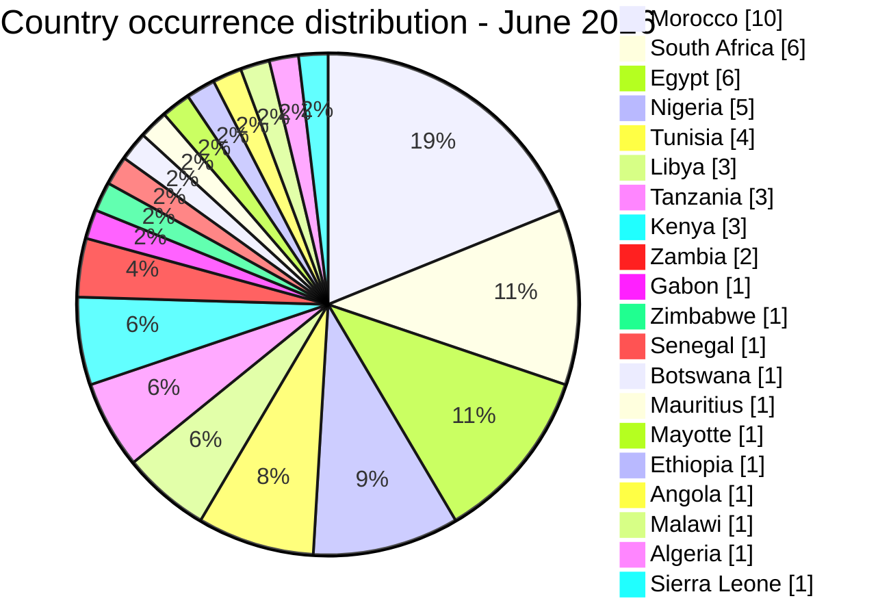
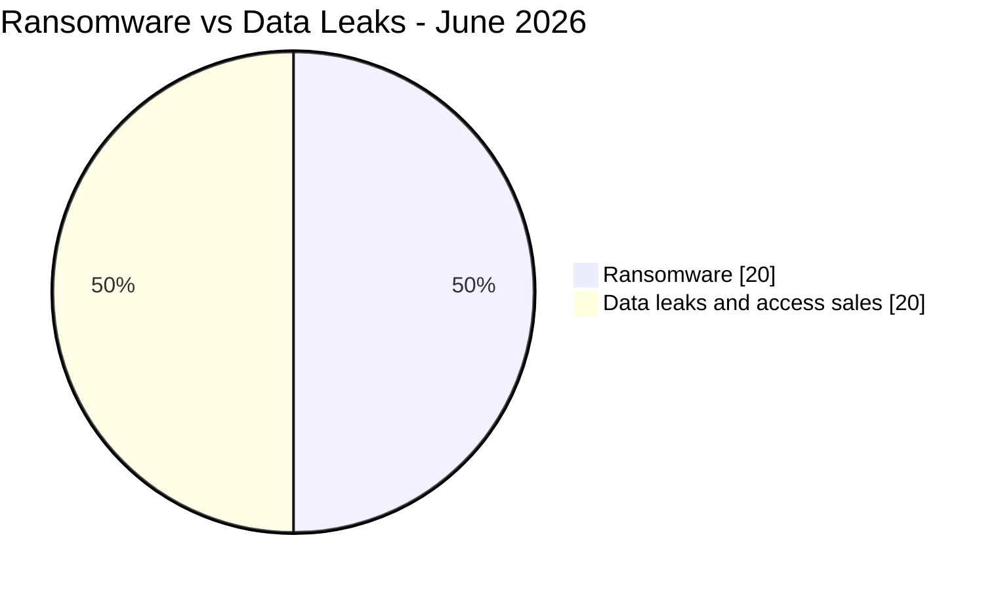
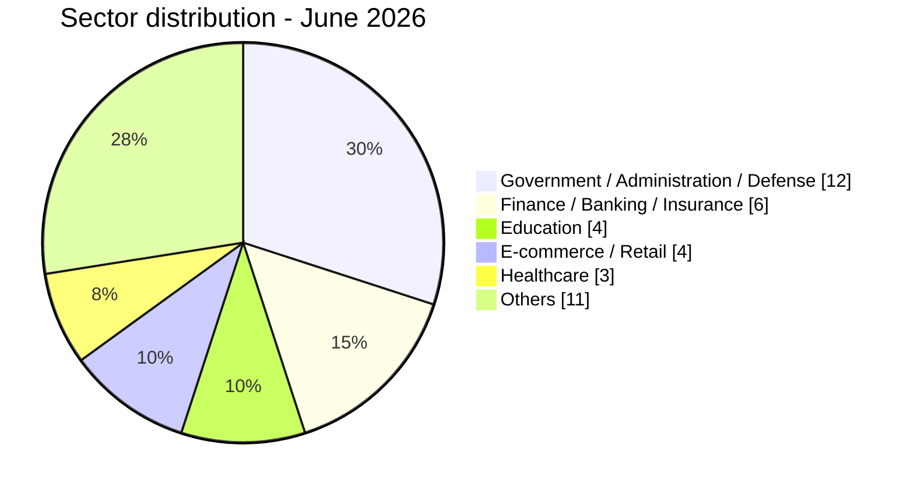
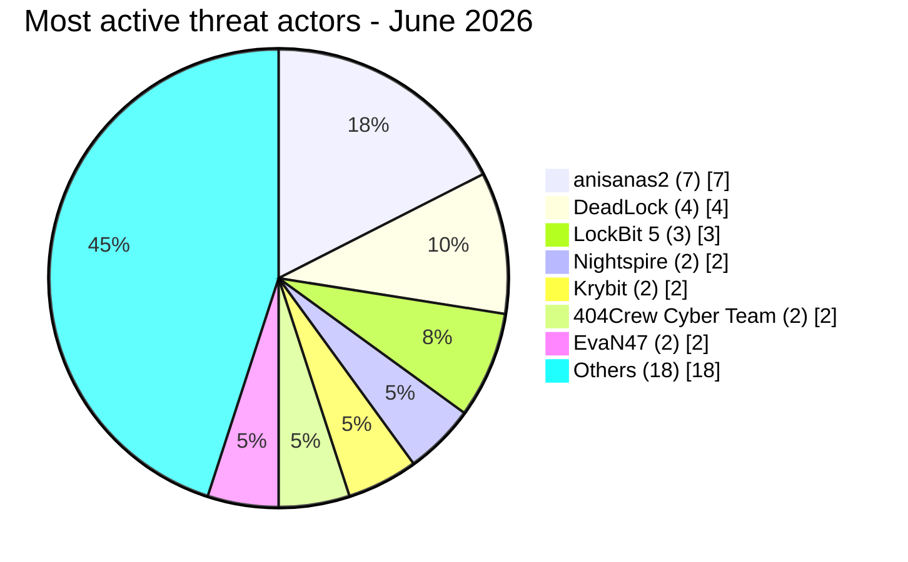

# CTI report - cyberattacks in Africa (June 2026)

👉🏾 [**French version available here**](./README_FR.md)

## 1. Executive summary

June 2026 recorded **40 publicly claimed cyber incidents** across Africa: **20 ransomware attacks (50%)** and **20 data leaks / access sales (50%)**. This is a sharp shift from May 2026, when ransomware accounted for only 28% of incidents. Volume dropped from 57 to 40 incidents, but the risk profile did not soften: this month includes one of the worst fintech biometric exposures documented on the continent, a plaintext credential leak from a national army's webmail domain, and a sustained single-actor campaign against Morocco that has now run for three consecutive months without any visible law enforcement disruption.

Key findings:
- **20 ransomware attacks (50%)** and **20 data leaks / access sales (50%)**, an unusually even split and a real escalation of ransomware activity compared to May.
- **14 countries** directly affected, plus **6 additional countries** exposed only through two multi-country credential-sale schemes (Ethiopia, Angola, Zambia, Malawi, Algeria, Sierra Leone), for **20 African countries** touched overall.
- **Morocco (9 incidents)** is the most targeted country of the month, almost entirely driven by a single actor cluster, **anisanas2**, which hit 7 different Moroccan organizations across education, logistics, mining, e-commerce and automotive. This is the same cluster flagged in the May 2026 report; three months in, there is still no sign the campaign has been contained.
- **Jeroid.co (Nigeria), threat actor burti:** 312,433 users, 110,282 BVN, 64,300 NIN and 70,956 biometric face-verification photos exposed on an unauthenticated public S3 bucket, sold for $2,000. The analysed material indicates a severe KYC data exposure; the initial access vector remains unknown.
- **Nigerian Army (army.mil.ng):** plaintext webmail credentials for 20+ military accounts, including access to a satellite imagery portal (DigitalGlobe). This is the single most serious national-security incident of the month and deserves to be treated as one, not filed as "another leak."
- **BRELA (Tanzania):** 10.2 million records covering 8 million people, the largest single dataset recorded this month, exposing the country's entire business registration and taxpayer ecosystem.
- **Two ministries in Libya** (Technical and Vocational Education, then Education) were hit by the same actor, EvaN47, in the final two days of the month, a pattern worth watching into July.

### Victim list

👉🏾 [View full victim list](./victims.md)

---

## 2. Methodology

- **Scope**: 54 African countries.
- **Period**: 1-30 June 2026 (incidents disclosed or claimed during this month; actual attack dates may be earlier).
- **Sources**: Dark web, DLS (leak sites), OSINT, Telegram channels, underground forums.
- **Inclusion**: Incidents first identified and assessed by AFRINTEL during June 2026. The original claim or attack date may be earlier and is retained in the victim card when known.
- **Typology**:
  - *Ransomware*: claim or disclosure attributed to a ransomware group. Encryption is not assumed unless supporting evidence is available.
  - *Data leak / access sale*: exfiltration without encryption, database sold/published, or access/credential sale.

---

## 3. Global overview

| Indicator | Value |
|---|---|
| Total victims | 40 unique incidents |
| Countries affected | 20 (14 direct + 6 via multi-country incidents) |
| Country occurrences | 53 (38 direct + 15 exposures from 2 multi-country incidents) |
| Distinct actors | 25 |
| Ransomware incidents | 20 (50.0%) |
| Data leaks / access sales | 20 (50.0%) |

### Country ranking

**Expanded geographic ranking (53 country occurrences from 40 unique incidents):**

| Rank | Country | Direct incidents | Multi-country exposures | Geographic total | Chart |
| :---: | :--- | :---: | :---: | :---: | :--- |
| **1** | 🇲🇦 Morocco | 9 | 1 | **10** | ██████████ |
| **2** | 🇿🇦 South Africa | 6 | 0 | **6** | ██████ |
| **2** | 🇪🇬 Egypt | 4 | 2 | **6** | ██████ |
| **4** | 🇳🇬 Nigeria | 4 | 1 | **5** | █████ |
| **5** | 🇹🇳 Tunisia | 4 | 0 | **4** | ████ |
| **6** | 🇱🇾 Libya | 3 | 0 | **3** | ███ |
| **6** | 🇹🇿 Tanzania | 1 | 2 | **3** | ███ |
| **6** | 🇰🇪 Kenya | 1 | 2 | **3** | ███ |
| **9** | 🇿🇲 Zambia | 0 | 2 | **2** | ██ |
| **10** | 🇬🇦 Gabon | 1 | 0 | **1** | █ |
| **10** | 🇿🇼 Zimbabwe | 1 | 0 | **1** | █ |
| **10** | 🇸🇳 Senegal | 1 | 0 | **1** | █ |
| **10** | 🇧🇼 Botswana | 1 | 0 | **1** | █ |
| **10** | 🇲🇺 Mauritius | 1 | 0 | **1** | █ |
| **10** | 🇾🇹 Mayotte | 1 | 0 | **1** | █ |
| **10** | 🇪🇹 Ethiopia | 0 | 1 | **1** | █ |
| **10** | 🇦🇴 Angola | 0 | 1 | **1** | █ |
| **10** | 🇲🇼 Malawi | 0 | 1 | **1** | █ |
| **10** | 🇩🇿 Algeria | 0 | 1 | **1** | █ |
| **10** | 🇸🇱 Sierra Leone | 0 | 1 | **1** | █ |

> The report records 40 unique incidents. The geographic ranking totals 53 country occurrences because the Convince and Governor offers are allocated to every explicitly named African country. This allocation does not change the global total. Palestine and Yemen are excluded because they fall outside the African scope.

### Ransomware distribution (Total: 20)

| Rank | Country | Incidents | Chart |
| :---: | :--- | :---: | :--- |
| **1** | 🇿🇦 South Africa | **4** | ████ |
| **2** | 🇪🇬 Egypt | **3** | ███ |
| **2** | 🇹🇳 Tunisia | **3** | ███ |
| **4** | 🇲🇦 Morocco | **1** | █ |
| **4** | 🇳🇬 Nigeria | **1** | █ |
| **4** | 🇱🇾 Libya | **1** | █ |
| **4** | 🇬🇦 Gabon | **1** | █ |
| **4** | 🇿🇼 Zimbabwe | **1** | █ |
| **4** | 🇸🇳 Senegal | **1** | █ |
| **4** | 🇧🇼 Botswana | **1** | █ |
| **4** | 🇲🇺 Mauritius | **1** | █ |
| **4** | 🇾🇹 Mayotte | **1** | █ |
| **4** | 🇰🇪 Kenya | **1** | █ |

### Geographic distribution of data leaks / access sales

**20 unique incidents, representing 33 country occurrences after allocating the two multi-country offers.**

| Rank | Country | Occurrences | Chart |
| :---: | :--- | :---: | :--- |
| **1** | 🇲🇦 Morocco | **9** | █████████ |
| **2** | 🇳🇬 Nigeria | **4** | ████ |
| **3** | 🇪🇬 Egypt | **3** | ███ |
| **3** | 🇹🇿 Tanzania | **3** | ███ |
| **5** | 🇿🇦 South Africa | **2** | ██ |
| **5** | 🇱🇾 Libya | **2** | ██ |
| **5** | 🇰🇪 Kenya | **2** | ██ |
| **5** | 🇿🇲 Zambia | **2** | ██ |
| **9** | 🇹🇳 Tunisia | **1** | █ |
| **9** | 🇪🇹 Ethiopia | **1** | █ |
| **9** | 🇦🇴 Angola | **1** | █ |
| **9** | 🇲🇼 Malawi | **1** | █ |
| **9** | 🇩🇿 Algeria | **1** | █ |
| **9** | 🇸🇱 Sierra Leone | **1** | █ |

### Ransomware vs. data leaks comparison by country

| Country | Ransomware | Data leaks | Side-by-side distribution |
| :--- | :---: | :---: | :--- |
| 🇲🇦 Morocco | **1** | **9** | 🟧 🟦🟦🟦🟦🟦🟦🟦🟦🟦 |
| 🇿🇦 South Africa | **4** | **2** | 🟧🟧🟧🟧 🟦🟦 |
| 🇪🇬 Egypt | **3** | **3** | 🟧🟧🟧 🟦🟦🟦 |
| 🇳🇬 Nigeria | **1** | **4** | 🟧 🟦🟦🟦🟦 |
| 🇹🇳 Tunisia | **3** | **1** | 🟧🟧🟧 🟦 |
| 🇱🇾 Libya | **1** | **2** | 🟧 🟦🟦 |
| 🇹🇿 Tanzania | **0** | **3** | 🟦🟦🟦 |
| 🇰🇪 Kenya | **1** | **2** | 🟧 🟦🟦 |
| 🇿🇲 Zambia | **0** | **2** | 🟦🟦 |
| 🇬🇦 Gabon | **1** | **0** | 🟧 |
| 🇿🇼 Zimbabwe | **1** | **0** | 🟧 |
| 🇸🇳 Senegal | **1** | **0** | 🟧 |
| 🇧🇼 Botswana | **1** | **0** | 🟧 |
| 🇲🇺 Mauritius | **1** | **0** | 🟧 |
| 🇾🇹 Mayotte | **1** | **0** | 🟧 |
| 🇪🇹 Ethiopia | **0** | **1** | 🟦 |
| 🇦🇴 Angola | **0** | **1** | 🟦 |
| 🇲🇼 Malawi | **0** | **1** | 🟦 |
| 🇩🇿 Algeria | **0** | **1** | 🟦 |
| 🇸🇱 Sierra Leone | **0** | **1** | 🟦 |
| **Country occurrences (53)** | **20** | **33** | *Legend: 🟧 Ransomware \| 🟦 Data Leaks* |

> The analytical total remains 40 unique incidents, comprising 20 ransomware incidents and 20 data leaks or access sales. The 33 leak-related country occurrences include the geographic allocation of the two multi-country incidents.

### Geographic breakdown by region

| Region | Country occurrences | Ransomware | Leaks | Side-by-side |
| :--- | :---: | :---: | :---: | :--- |
| **North Africa** | **24** (45.3%) | 8 | 16 | 🟧🟧🟧🟧🟧🟧🟧🟧 🟦🟦🟦🟦🟦🟦🟦🟦🟦🟦🟦🟦🟦🟦🟦🟦 |
| **Southern Africa** | **11** (20.8%) | 6 | 5 | 🟧🟧🟧🟧🟧🟧 🟦🟦🟦🟦🟦 |
| **West & Central Africa** | **9** (17.0%) | 2 | 7 | 🟧🟧 🟦🟦🟦🟦🟦🟦🟦 |
| **East Africa** | **7** (13.2%) | 1 | 6 | 🟧 🟦🟦🟦🟦🟦🟦 |
| **Indian Ocean** | **2** (3.8%) | 2 | 0 | 🟧🟧 |
| **Total** | **53** | **20** | **33** | |

*Legend: 🟧 Ransomware | 🟦 Data Leaks. North Africa: Morocco, Egypt, Tunisia, Libya, Algeria. Southern Africa: South Africa, Botswana, Zimbabwe, Zambia, Malawi. West & Central Africa: Nigeria, Gabon, Senegal, Sierra Leone, Angola. East Africa: Kenya, Tanzania, Ethiopia. Indian Ocean: Mauritius, Mayotte. Angola is classified here as Central Africa.*

### Sector distribution

| Activity sector | Incidents | Share (%) | Chart |
| :--- | :---: | :---: | :--- |
| **Government / Administration / Defense** | **12** | 30.0% | ████████████ |
| **Finance / Banking / Insurance** | **6** | 15.0% | ██████ |
| **Education** | **4** | 10.0% | ████ |
| **E-commerce / Retail** | **4** | 10.0% | ████ |
| **Healthcare** | **3** | 7.5% | ███ |
| **Others** | **11** | 27.5% | ███████████ |
| **Total** | **40** | **100%** | |

### Most prolific threat actors and groups

| Threat actor / Group | Incidents | Primary activity | Chart |
| :--- | :---: | :--- | :--- |
| **anisanas2** | **7** | Data leaks / sales (Morocco, sustained 3-month campaign) | 🟦🟦🟦🟦🟦🟦🟦 |
| **DeadLock** | **4** | Ransomware (multi-country: Gabon, Nigeria, Mayotte, Kenya) | 🟧🟧🟧🟧 |
| **LockBit 5** | **3** | Ransomware (Botswana, South Africa, Mauritius) | 🟧🟧🟧 |
| **Nightspire** | **2** | Ransomware (Zimbabwe, Egypt) | 🟧🟧 |
| **Krybit** | **2** | Ransomware / data published (Senegal, Morocco) | 🟧🟧 |
| **404Crew Cyber Team** | **2** | Data leak (Nigeria coalition, Morocco) | 🟦🟦 |
| **EvaN47** | **2** | Data leak (Libya, two ministries in two days) | 🟦🟦 |

*Legend: 🟧 Ransomware \| 🟦 Data Leaks*

---

### Country-by-country overview

> **For full details on each incident (data volumes, sample analysis, actor tactics, etc.), please refer to the complete victim list:** [`victims.md`](./victims.md)

---

### 🇲🇦 Morocco (9 incidents: 1 ransomware, 8 leaks)

**Ransomware (1):**
- **The ransomware group Krybit** (June 19, MUPRAS RAM): mutual insurance body for Royal Air Maroc employees; leaked material covers member contributions, medical reimbursements, banking flows and IT contracts, a high-criticality exposure by any measure.

**The anisanas2 campaign (7 incidents, June 6-27):** the same actor cluster already flagged in AFRINTEL's May 2026 report for the RADEM Meknès and Ministry of Justice bundle is still active, now in its third consecutive month against Morocco.
- **IMT (Institut des Mines de Touissit)** (June 6): 100+ student and 37+ teacher records with national IDs.
- **Tlog.ma** (June 6): 700,000 logistics client records; $500 ransom demand for the full database.
- **Mines d'Aouli** (June 6): 2001-2025 fiscal and liquidation documents from a mining company under liquidation.
- **Unidentified startup management platform** (June 26): identity documents and financials for four downstream Moroccan companies (ARSYS INFO, AUDD, Black Service Solution, Media Triangle); the operator itself is still unidentified.
- **Unidentified Moroccan delivery company** (June 26): 486,024 delivery records covering seven years of nationwide operations.
- **Avito.ma** (June 26): 200,000-listing sample, $800 asking price for the full archive; the same platform was already sampled by a different actor in May 2026.
- **Stellantis Morocco** (June 27): 992-record automotive sales-lead sample; the file's brand mix suggests a CRM source rather than a confirmed direct compromise.

**Other leak (1):**
- **The threat actor 404Crew Cyber Team** (June 25, MG Maroc): 2025-2026 payroll and social security declaration sample from a medical professionals' association.

**Assessment:** this is not a series of isolated incidents. One actor cluster has now hit at least ten Moroccan targets recorded from claims or analysed publications since April across education, logistics, mining, e-commerce, startups and automotive, with no publicly documented coordinated response observed by AFRINTEL. That pattern, not any single breach, is the real Moroccan story of Q2 2026.

---

### 🇿🇦 South Africa (6 incidents: 4 ransomware, 2 leaks)

**Ransomware (4):**
- **Black X** (June 2, African National Congress): 2,310,865 membership records with South African ID numbers, addresses and languages published directly, one of the largest political-party data exposures on record for the continent.
- **WorldLeaks** (June 5, Access Dental): victim listing observed on the ransomware group's site.
- **LockBit 5** (June 18, Grey High School): victim listing observed on the ransomware group's site.
- **CMD Organization** (June 28, Fidelity Security Group): victim listing observed on the ransomware group's site.

**Leaks (2):**
- **The threat actor mosad** (June 8, South African Army / SANDF): a classified 2022 "Warning Instruction" document detailing crowd-control deployment, including named senior officers' phone numbers, emails and national ID-linked identifiers. A restricted military document circulating on Telegram four years after being written points to a persistent internal leak vector that has not been closed.
- **The threat actor GOD User** (June 10, UNISA): full SQL dump of a technical-support system with plaintext passwords across customer, technician and administrator accounts.

---

### 🇳🇬 Nigeria (4 incidents: 1 ransomware, 3 leaks)

**Ransomware (1):**
- **DeadLock** (June 1, Fidelity Pension Managers): victim listing observed on the ransomware group's site.

**Leaks (3):**
- **The threat actor burti** (June 10, Jeroid.co): 312,433 users, 110,282 BVN, 64,300 NIN, and 70,956 biometric face-verification photos left on an unauthenticated public S3 bucket, sold for $2,000. This is the most severe fintech exposure AFRINTEL has recorded in Nigeria this year while the initial access vector remains unknown.
- **The coalition 404Crew Cyber Team x NullSec Nigeria** (June 13, NILDS / National Assembly): parliamentary database sample, hacktivist-motivated (#OpNigeria), medium confidence.
- **The threat actor NulleSecNg** (June 21, Nigerian Army, army.mil.ng): 20+ plaintext webmail credentials for military personnel, including access to a DigitalGlobe satellite imagery portal. Plaintext passwords for a national army's webmail, sitting next to satellite reconnaissance access, is the kind of incident that should trigger an emergency credential rotation the same day it is found, not a routine ticket.

---

### 🇪🇬 Egypt (4 incidents: 3 ransomware, 1 leak)

**Ransomware (3):**
- **The ransomware group TheGentlemen** (June 4, Bouri Group): victim listing observed on the ransomware group's site.
- **The ransomware group Nightspire** (June 15, Sheraton Miramar Resort El Gouna): victim listing observed on the ransomware group's site.
- **The ransomware group Lamashtu** (June 17, Great Foods): victim listing observed on the ransomware group's site.

**Leak (1):**
- **The threat actor Xyphorix** (June 6, Egyptian Pilots Database): personal data of military, commercial and civilian pilots from Egypt Air, Qatar Airways, Fly Emirates, Suez Canal Authority and the Ministry of Civil Aviation, sold with no price disclosed. Military-affiliated pilot data for sale on a criminal forum is a national-security exposure, not a routine personal-data leak.

---

### 🇹🇳 Tunisia (4 incidents: 3 ransomware, 1 leak)

**Ransomware (3):**
- **The ransomware group Aurora** (June 16, Sumitomo Electric Bordnetze, SEBN Tunisia): victim listing observed on the ransomware group's site for the Fejja location.
- **The ransomware group SETTRA** (June 26, Centrale Laitière du Cap-Bon): victim listing observed on the ransomware group's site.
- **The ransomware group Stormous** (June 28, monoprix.tn): victim listing observed on the ransomware group's site.

**Leak (1):**
- **The threat actor AshleyWood2022** (June 23, Examens.tn): complete 717 MB `examens.sql` database dump, 3,697 user accounts and 74,891 metadata records, including session tokens, password-reset tokens and OAuth data. The initial access vector is unknown. An exposed backup or a vulnerable WordPress component should be investigated as detection hypotheses, without treating either as established.

---

### 🇱🇾 Libya (3 incidents: 1 ransomware, 2 leaks)

**Ransomware (1):**
- **The ransomware group Qilin** (June 22, Central Bank of Libya): victim listing observed on the ransomware group's site.

**Leaks (2), same actor, back-to-back government ministries:**
- **The threat actor EvaN47** (June 29, Ministry of Technical and Vocational Education): claimed 900,000 student records, including a separate user-account table with @tve.gov.ly emails and password-related fields.
- **The threat actor EvaN47** (June 30, Ministry of Education): claimed 287 GB of certificates, national ID numbers, photos and passport scans for students nationwide.

Two Libyan ministries hit by the same actor on consecutive days at the end of June is a pattern, not a coincidence; it should be treated as an active campaign against Libyan government education infrastructure going into July.

---

### Single-incident countries (8)

| Country | Actor | Date | Victim | Notes |
| :--- | :--- | :--- | :--- | :--- |
| 🇬🇦 Gabon | DeadLock | June 1 | Finam Gabon | Disclosure deadline announced for May 15; no data was publicly accessible during AFRINTEL monitoring, and the reason for non-publication remains unknown. |
| 🇿🇼 Zimbabwe | Nightspire | June 5 | First Mutual Holdings | Victim listing observed on the ransomware group's site. |
| 🇸🇳 Senegal | Krybit | June 17 | Cour des Comptes du Sénégal | 19.73 GB; audit, budgetary and HR documents from the country's supreme audit institution. |
| 🇧🇼 Botswana | LockBit 5 | June 18 | Botswana Vaccine Institute | Victim listing observed on the ransomware group's site. |
| 🇲🇺 Mauritius | LockBit 5 | June 18 | Nundun Gopee & Co | Victim listing observed on the ransomware group's site. |
| 🇹🇿 Tanzania | hammer | June 20 | BRELA | 10.2 million records covering 8 million people; TINs, National IDs and full company registration data. The single largest dataset of the month. |
| 🇾🇹 Mayotte | DeadLock | June 21 | Municipality of Ouangani | 138 MB fully published: payroll, civil registry, banking details and municipal financing agreements. |
| 🇰🇪 Kenya | DeadLock | June 23 | Kenya National Highways Authority | Victim listing observed on the ransomware group's site. |

---

### Multi-country credential and portal-access sales (2 incidents)

- **The threat actor Convince** (June 17): government email addresses for sale across 8 countries (Ethiopia, Tanzania, Angola, Kenya, Zambia, Nigeria, Egypt, Morocco), marketed explicitly for filing fraudulent Emergency Disclosure Requests (EDR) to Meta, Google and Telegram. This is not a passive breach, it is a for-sale tool for impersonating African governments to platform providers.
- **The threat actor [Citizen] Governor** (June 20): fully authenticated government and police accounts with direct law-enforcement portal access to Meta, TikTok and X, listed for 9 jurisdictions (Egypt, Malawi, Tanzania, Algeria, Kenya, Zambia, Sierra Leone, plus Palestine and Yemen, which fall outside AFRINTEL's African scope). This is a more severe variant of the same abuse model: the buyer does not even need to forge a request, they log in as a real official.

**Global summary (40 incidents, 20 countries):** Morocco (9) and South Africa (6) account for 37.5% of all incidents. Ransomware reached parity with data leaks for the first time in 2026 (20/20), driven by a wide geographic spread of DeadLock, LockBit 5 and Nightspire rather than concentration in one country. The most critical single incidents are the Jeroid.co fintech/biometric exposure, the Nigerian Army plaintext credential leak, and the BRELA Tanzania breach.

> **For complete technical details, sample analysis, and full victim descriptions, see:** [`victims.md`](./victims.md)

---

## 4. Detailed analysis by incident type

### 4.1 Ransomware (20 incidents)

| Rank | Country | Attacks | Main threat actors |
| :---: | :--- | :---: | :--- |
| **1** | 🇿🇦 South Africa | **4** | Black X, WorldLeaks, LockBit 5, CMD Organization |
| **2** | 🇪🇬 Egypt | **3** | TheGentlemen, Nightspire, Lamashtu |
| **2** | 🇹🇳 Tunisia | **3** | Aurora, SETTRA, Stormous |
| **4** | 🇲🇦 Morocco | **1** | Krybit |
| **4** | 🇳🇬 Nigeria | **1** | DeadLock |
| **4** | 🇱🇾 Libya | **1** | Qilin |
| **4** | 🇬🇦 Gabon | **1** | DeadLock |
| **4** | 🇿🇼 Zimbabwe | **1** | Nightspire |
| **4** | 🇸🇳 Senegal | **1** | Krybit |
| **4** | 🇧🇼 Botswana | **1** | LockBit 5 |
| **4** | 🇲🇺 Mauritius | **1** | LockBit 5 |
| **4** | 🇾🇹 Mayotte | **1** | DeadLock |
| **4** | 🇰🇪 Kenya | **1** | DeadLock |

**Observations:** ransomware doubled its share of monthly incidents compared to May (28% to 50%). **DeadLock** was the most geographically distributed group, hitting four countries spread across the continent (Gabon, Nigeria, Mayotte, Kenya) with a consistent pattern: claim, threaten disclosure, and in the Mayotte case, actually publish. **LockBit 5** published three victim listings across three countries in a single week, on June 18. No published sample was accessible for these three entries during AFRINTEL collection. The documented data-publication exceptions are **Mayotte's Municipality of Ouangani**, where DeadLock followed through with a 138 MB publication including payroll and civil registry data, and the **ANC** publication, where Black X published 2.3 million membership records directly.

### 4.2 Data leaks & access sales (20 unique incidents, 33 country occurrences)

| Rank | Country | Occurrences | Main actors |
| :---: | :--- | :---: | :--- |
| **1** | 🇲🇦 Morocco | **9** | anisanas2 (7), 404Crew Cyber Team, Convince |
| **2** | 🇳🇬 Nigeria | **4** | burti, 404Crew CT x NullSec Nigeria, NulleSecNg, Convince |
| **3** | 🇪🇬 Egypt | **3** | Xyphorix, Convince, Governor |
| **3** | 🇹🇿 Tanzania | **3** | hammer, Convince, Governor |
| **5** | 🇿🇦 South Africa | **2** | mosad, GOD User |
| **5** | 🇱🇾 Libya | **2** | EvaN47 |
| **5** | 🇰🇪 Kenya | **2** | Convince, Governor |
| **5** | 🇿🇲 Zambia | **2** | Convince, Governor |
| **9** | 🇹🇳 Tunisia | **1** | AshleyWood2022 |
| **9** | 🇪🇹 Ethiopia | **1** | Convince |
| **9** | 🇦🇴 Angola | **1** | Convince |
| **9** | 🇲🇼 Malawi | **1** | Governor |
| **9** | 🇩🇿 Algeria | **1** | Governor |
| **9** | 🇸🇱 Sierra Leone | **1** | Governor |

**Key observations:**
- **anisanas2** alone accounts for 35% of all data leaks/sales this month (7 of 20), all in Morocco. No other actor comes close to that concentration.
- Nigeria's three leaks span three completely different threat models in one month: a fintech biometric exposure (Jeroid.co), a hacktivist parliamentary leak (NILDS), and a plaintext military credential dump (army.mil.ng). That range, in a single country in four weeks, says more about the breadth of Nigeria's exposed attack surface than any single incident does.
- **EvaN47** hitting two Libyan education ministries on consecutive days (June 29-30) is the clearest coordinated-campaign signal of the month; it should be tracked into July.
- The **Convince** and **Governor** listings together expose government or police credentials representing 15 country mentions across 11 African countries. Neither incident is a "leak" in the traditional sense, both are commercial products built specifically to defraud Meta, Google, TikTok and X into handing over user data under false legal pretenses.

---

## 5. Sectoral impact

| Activity sector | Incidents | Share (%) | Visual impact |
| :--- | :---: | :---: | :--- |
| **Government / Administration / Defense** | **12** | 30.0% | ████████████ |
| **Finance / Banking / Insurance** | **6** | 15.0% | ██████ |
| **Education** | **4** | 10.0% | ████ |
| **E-commerce / Retail** | **4** | 10.0% | ████ |
| **Healthcare** | **3** | 7.5% | ███ |
| **Others** | **11** | 27.5% | ███████████ |

**Key observations:**
- **Government dominance persists:** the public sector (Government/Administration/Defense) accounts for 30.0% of June incidents, essentially matching May's 29.8%. This is the third consecutive month where African state infrastructure is the single most targeted category on the continent, and there is no sign in the public record of a coordinated continental response.
- **Finance jumps to second place:** six incidents (Jeroid.co, Finam Gabon, Fidelity Pension Managers, First Mutual Holdings, Central Bank of Libya, MUPRAS RAM) reflect sustained interest in financial and insurance targets, from central banks to microfinance institutions.
- **Two national-security-grade incidents this month:** the SANDF classified document leak and the Nigerian Army credential dump both fall under Government/Defense and both involve direct exposure of military personnel and operational data, an unusually severe pairing for a single month.
- **Healthcare and education remain steady mid-tier targets** (7.5% and 10.0% respectively), consistent with prior months, no major escalation observed.

---

## 6. Threat actor profile

| Threat actor | Type | Incidents | Primary targets |
| :--- | :--- | :---: | :--- |
| **anisanas2** | Data leak / sale cluster | **7** | Moroccan organizations across education, logistics, mining, e-commerce, automotive (3rd consecutive month active) |
| **DeadLock** | Ransomware | **4** | Multi-country: Gabon, Nigeria, Mayotte, Kenya |
| **LockBit 5** | Ransomware | **3** | Botswana, South Africa, Mauritius (single-week listing spree) |
| **Nightspire** | Ransomware | **2** | Zimbabwe, Egypt |
| **Krybit** | Ransomware / data leak | **2** | Senegal (audit institution), Morocco (health mutual) |
| **404Crew Cyber Team** | Data leak (coalition and solo) | **2** | Nigerian legislature (with NullSec Nigeria), Moroccan medical association |
| **EvaN47** | Data leak | **2** | Libyan government education ministries (2 in 2 days) |

**Emerging actors:**
- **burti** (Jeroid.co, Nigeria): first AFRINTEL appearance, high-severity fintech data broker.
- **NulleSecNg** (Nigerian Army credential leak): politically-motivated, first documented appearance.
- **Convince** and **Governor**: two separate actors running parallel law-enforcement impersonation businesses; possibly connected, both first appeared in AFRINTEL records in May-June 2026.
- **mosad** (SANDF classified document leak): single appearance, high-sensitivity military source.

### 6.1 Risk assessment

| Country | Risk level |
|---|---|
| Morocco | 🔴 Critical/High |
| South Africa | 🔴 Critical/High |
| Nigeria | 🔴 Critical/High (fintech biometric leak + military credential exposure in the same month) |
| Egypt | 🟠 Medium |
| Tunisia | 🟠 Medium |
| Libya | 🟠 Medium (watch: two ministries hit in two days, potential campaign into July) |
| Tanzania | 🟠 Medium (single incident, but 10.2M records is a national-scale exposure) |
| Others | 🟡 Low-Medium |

---

## 7. Key trends and intelligence gaps

### Trends

1. **Ransomware regained ground:** a 50/50 split with data leaks marks a clear escalation from May's 28/72 split. This is not noise, it is a real shift in actor behavior, driven mainly by wide geographic spread (DeadLock, LockBit 5) rather than concentration in one country.
2. **Morocco's unresolved campaign:** anisanas2 has now been active against Moroccan targets for three straight months (April, May, June), hitting at least ten organizations across unrelated sectors. Left unaddressed, this is starting to look less like opportunistic crime and more like a standing operation with a reliable pipeline of Moroccan targets.
3. **Fintech remains the softest target in the region:** Jeroid.co's allegedly unauthenticated S3 exposure, if confirmed by the observed evidence, represents a severe cloud-storage control failure. This should not still be happening in mid-2026.
4. **Military and defense credential hygiene is a live problem:** the Nigerian Army plaintext webmail leak and the SANDF classified document leak both point to the same underlying issue, personal accounts and old documents sitting unmanaged long after they should have been rotated or archived securely.
5. **Law-enforcement impersonation-as-a-service is consolidating:** Convince and Governor are running two tiers of the same business (raw email addresses vs. fully authenticated portal accounts) across 15 country mentions spanning 11 African countries. This is a cross-border abuse vector that individual national CERTs cannot solve alone; it needs direct engagement with Meta, Google, TikTok and X.
6. **Libya's education sector may be entering a sustained campaign:** two ministries hit by the same actor on back-to-back days is the strongest early-campaign signal of the month.

### Intelligence gaps

- The actual operator behind the "unidentified startup management platform" and "unidentified Moroccan delivery company" leaks (both attributed to anisanas2) has not been established; without a named platform, affected individuals cannot be meaningfully notified.
- Several ransomware claims this month (Bouri Group, Access Dental, Sheraton Miramar, Great Foods, Central Bank of Libya, KeNHA, monoprix.tn, Fidelity Security Group and others) carry no published sample; AFRINTEL records them as claims, not confirmed breaches, and their true status is unknown.
- The reason why Finam Gabon's announced data publication was not accessible remains unknown.
- The true reach of the Convince and Governor credential catalogs may extend beyond what was publicly listed; both may represent partial inventories.

---

## 8. MITRE ATT&CK mapping (contextual)

| Phase | Technique ID | Technique name | Context |
| :--- | :---: | :--- | :--- |
| **Initial Access** | **T1078** | Valid Accounts | Government/police email and portal credentials sold by Convince and Governor; Nigerian Army webmail accounts |
| **Credential Access** | **T1552.001** | Unsecured Credentials in Files | UNISA plaintext passwords, Nigerian Army plaintext webmail passwords |
| **Credential Access** | **T1555.003** | Credentials from Web Browsers | Nigerian Army credentials captured from Chrome/Edge stores |
| **Collection** | **T1213** | Data from Information Repositories | NILDS parliamentary database, unidentified startup management platform documents |
| **Exfiltration** | **T1530** | Data from Cloud Storage Object | Jeroid.co publicly accessible S3 storage observed in the source material (biometric photos, KYC documents) |
| **Reconnaissance** | **T1596** | Search Open Websites/Domains | Avito.ma listing scrape (no evidence of internal system access) |

> Common cross-campaign techniques:
> - **T1078** - Valid Accounts (credential theft, portal-access sales, satellite imagery portal access)
> - **T1530** - Data from Cloud Storage Object (unauthenticated S3 buckets, the single most preventable failure mode this month)
> - **T1552 / T1555** - Unsecured or browser-stored credentials (government and university systems)

---

## 9. Recommendations

- **Fintech and crypto platforms:** audit every cloud storage bucket holding KYC or biometric data today, not after the next incident. Jeroid.co's reported exposure is a control-failure scenario every African fintech should test itself against immediately.
- **Governments and defense ministries:** rotate all credentials tied to .gov, .mil and .ac domains as a standing policy, not a reactive one. The Nigerian Army webmail leak, with satellite imagery portal access attached, should have triggered emergency rotation the day it was found.
- **Platform trust & safety teams (Meta, Google, TikTok, X):** treat the Convince and Governor listings as an active abuse campaign against your own EDR/subpoena process, not just an African CERT problem. Out-of-band verification for law-enforcement data requests is overdue.
- **Moroccan organizations across all sectors:** anisanas2 has hit at least ten targets recorded from claims or analysed publications in three months with no visible interruption. A sector-wide advisory is warranted; waiting for individual notification is not working.
- **Education platforms:** harden CMS and WordPress deployments (Examens.tn's 717 MB dump is a familiar failure pattern); enforce session invalidation and credential rotation after any suspected compromise.
- **Ransomware-targeted organizations generally:** assume double extortion by default. Krybit and DeadLock both followed through on data publication in this dataset after their deadlines passed.

---

## 10. SOC tactical recommendations

- **[T1530] Cloud storage exposure:** continuously scan for public S3/Blob buckets tied to organizational domains, with priority on fintech and KYC pipelines; this control class is relevant to the month's most severe reported leak.
- **[T1552 / T1555] Credential hygiene:** monitor infostealer logs and browser-credential dumps for entries tied to .gov, .mil and .ac domains; the Nigerian Army leak was pulled directly from Chrome/Edge credential stores.
- **[T1078] Portal-access abuse:** any organization with legal authority to file EDR or subpoena requests with major platforms should require out-of-band verification for every such request, not rely on the requester's email domain alone.
- **[T1486] Ransomware tracking:** monitor DeadLock, LockBit 5, Krybit, Nightspire and Qilin leak sites for early listing of new African targets; deploy honeytoken files on shared drives in high-risk sectors (government, finance).
- **[Actor cluster tracking]:** establish a dedicated watch on anisanas2 given the three-month sustained campaign against Morocco; correlate future listings against known TTPs (forum, pricing pattern, sample structure) for early attribution.

---

## 11. Strategic recommendations

- **Morocco-specific response:** given three consecutive months of activity from a single actor cluster across unrelated sectors, Moroccan national cybersecurity authorities (DGSSI) should consider a coordinated notification and takedown effort rather than treating each incident in isolation.
- **Continental fintech data-storage standards:** African financial regulators (starting with the CBN model already recommended in May) should mandate that biometric KYC data is never stored on publicly accessible cloud infrastructure, with binding audit requirements, not guidance.
- **Cross-platform law-enforcement credential monitoring:** Meta, Google, TikTok and X should build a shared notification channel with African national CERTs and AFRIPOL for anomalous law-enforcement portal activity; the Convince/Governor model will keep recurring until platforms close the verification gap.
- **Military and defense credential policy:** African defense ministries should adopt binding minimum standards for personal-account and document lifecycle management; both this month's national-security incidents (SANDF, Nigerian Army) trace back to old material that was never properly retired or secured.
- **Libya monitoring priority:** given the back-to-back ministry incidents at month's end, AFRINTEL will treat Libyan government education infrastructure as an elevated watch priority into July.

---

## 12. Conclusion

June 2026 recorded fewer incidents than May (40 versus 57), but volume is the wrong metric to focus on this month. Ransomware reached parity with data leaks for the first time in 2026, a real escalation rather than statistical noise. Morocco absorbed nearly a quarter of all incidents, almost entirely due to one actor cluster that has remained active for three straight months, a pattern that deserves a coordinated response, not case-by-case handling. The Jeroid.co fintech breach and the Nigerian Army credential leak are the two most severe individual incidents of the month, one a claimed cloud-storage exposure with potentially severe reach, the other a national-security failure sitting inside a routine-looking data leak. Neither should be treated as ordinary.

**AFRINTEL** - African Cyber Threat Intelligence
🔗 [GitHub AFRINTEL Repository](https://github.com/Hatchepsoute/AFRINTEL)
