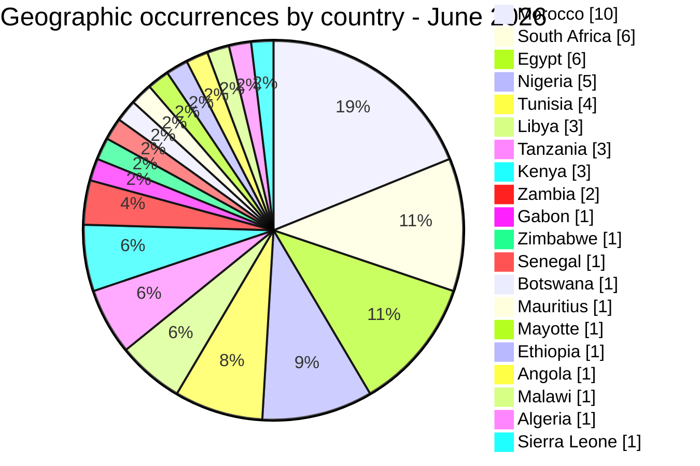
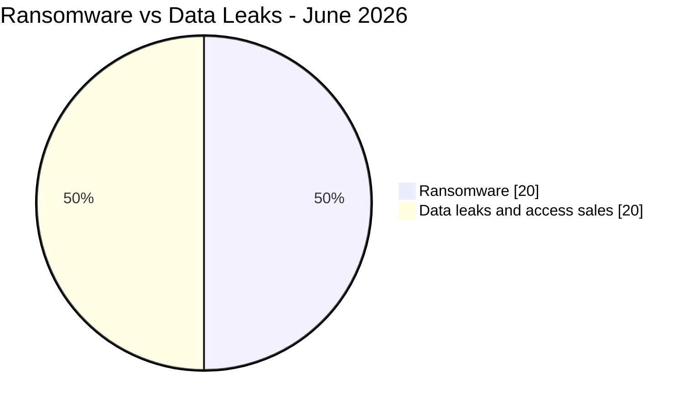
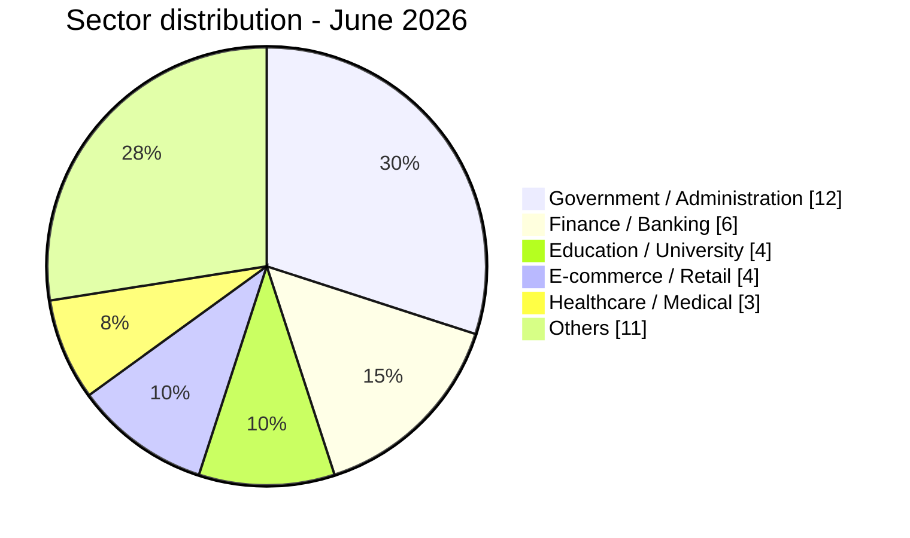
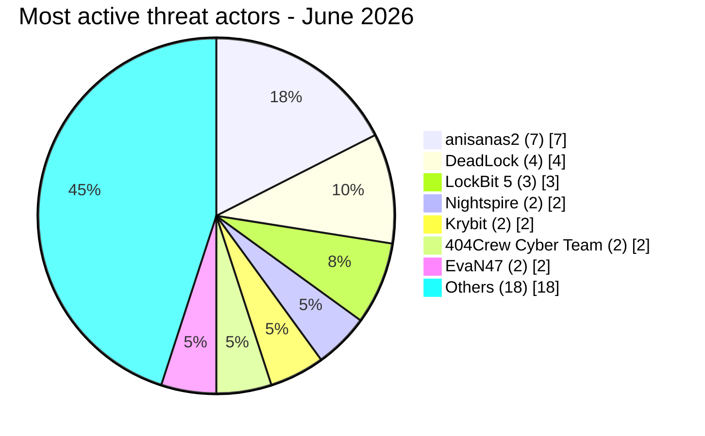

# CTI report - cyberattacks in Africa (June 2026)

👉🏾 [**French version available here**](./README_FR.md)

## 1. Executive summary

June 2026 recorded **40 publicly reported or claimed cyber incidents** across Africa: **20 ransomware listings or disclosures (50%)** and **20 data leaks / access sales (50%)**. This is a marked shift from May 2026, when ransomware represented 28.1% of the 57 incidents recorded in the [May victim dataset](../05-may/victims.md). June includes a high-sensitivity claimed fintech biometric exposure, a publication of plaintext credentials attributed to a national army's webmail domain, and a three-month sequence of publications attributed to the same actor cluster against Moroccan organizations.

Key findings:
- **20 ransomware listings or disclosures (50%)** and **20 data leaks / access sales (50%)**, an even split and a higher ransomware share than in May.
- **14 countries** directly affected, plus **6 additional countries** exposed only through two multi-country credential-sale schemes (Ethiopia, Angola, Zambia, Malawi, Algeria, Sierra Leone), for **20 African countries** touched overall.
- **Morocco (9 direct incidents)** is the most represented country of the month. Seven publications are attributed to **anisanas2** across education, logistics, mining, e-commerce and automotive. The same cluster also appeared in AFRINTEL records for April and May 2026; whether the underlying events form one coordinated operation remains unknown.
- **Jeroid.co (Nigeria), source actor burti:** the actor claimed a dataset covering 312,433 users, 110,282 BVN, 64,300 NIN and 70,956 biometric face-verification photos, offered for $2,000. The analysed material suggests that KYC data was accessible through an unauthenticated S3 bucket; AFRINTEL does not confirm the full claimed volume or the initial access vector.
- **Nigerian Army (army.mil.ng):** published material reportedly included plaintext webmail credentials for more than 20 military accounts and credentials associated with a satellite imagery portal. If valid at the time of observation, the material presented a high national-security risk.
- **BRELA (Tanzania):** the actor claimed 10.2 million records covering 8 million people, the largest claimed dataset volume recorded this month. The complete scope was not independently confirmed.
- **Two Libyan ministries** were the subject of consecutive publications attributed to EvaN47 on June 29 and 30. This temporal pattern warrants monitoring but does not by itself establish a coordinated campaign.

### Victim list

👉🏾 [View full victim list](./victims.md)

---

## 2. Methodology

- **Scope**: 54 African countries.
- **Period**: 1-30 June 2026 (incidents disclosed or claimed during this month; actual attack dates may be earlier).
- **Sources**: Dark web, DLS (leak sites), OSINT, Telegram channels, underground forums.
- **Inclusion**: Incidents first identified and assessed by AFRINTEL during June 2026. The original claim or attack date may be earlier and is retained in the victim card when known.
- **Typology**:
  - *Ransomware*: claim or disclosure attributed to a ransomware group. Encryption is not assumed unless supporting evidence is available.
  - *Data leak / access sale*: exfiltration without encryption, database sold/published, or access/credential sale.

---

## 3. Global overview

| Indicator | Value |
|---|---|
| Total victims | 40 unique incidents |
| Countries affected | 20 (14 direct + 6 via multi-country incidents) |
| Country occurrences | 53 (38 direct + 15 exposures from 2 multi-country incidents) |
| Distinct actors | 25 |
| Ransomware incidents | 20 (50.0%) |
| Data leaks / access sales | 20 (50.0%) |

### Country ranking

**Expanded geographic ranking (53 country occurrences from 40 unique incidents):**

| Rank | Country | Direct incidents | Multi-country exposures | Geographic total | Chart |
| :---: | :--- | :---: | :---: | :---: | :--- |
| **1** | 🇲🇦 Morocco | 9 | 1 | **10** | ██████████ |
| **2** | 🇿🇦 South Africa | 6 | 0 | **6** | ██████ |
| **2** | 🇪🇬 Egypt | 4 | 2 | **6** | ██████ |
| **4** | 🇳🇬 Nigeria | 4 | 1 | **5** | █████ |
| **5** | 🇹🇳 Tunisia | 4 | 0 | **4** | ████ |
| **6** | 🇱🇾 Libya | 3 | 0 | **3** | ███ |
| **6** | 🇹🇿 Tanzania | 1 | 2 | **3** | ███ |
| **6** | 🇰🇪 Kenya | 1 | 2 | **3** | ███ |
| **9** | 🇿🇲 Zambia | 0 | 2 | **2** | ██ |
| **10** | 🇬🇦 Gabon | 1 | 0 | **1** | █ |
| **10** | 🇿🇼 Zimbabwe | 1 | 0 | **1** | █ |
| **10** | 🇸🇳 Senegal | 1 | 0 | **1** | █ |
| **10** | 🇧🇼 Botswana | 1 | 0 | **1** | █ |
| **10** | 🇲🇺 Mauritius | 1 | 0 | **1** | █ |
| **10** | 🇾🇹 Mayotte | 1 | 0 | **1** | █ |
| **10** | 🇪🇹 Ethiopia | 0 | 1 | **1** | █ |
| **10** | 🇦🇴 Angola | 0 | 1 | **1** | █ |
| **10** | 🇲🇼 Malawi | 0 | 1 | **1** | █ |
| **10** | 🇩🇿 Algeria | 0 | 1 | **1** | █ |
| **10** | 🇸🇱 Sierra Leone | 0 | 1 | **1** | █ |

> The report records 40 unique incidents. The geographic ranking totals 53 country occurrences because the Convince and Governor offers are allocated to every explicitly named African country. This allocation does not change the global total. Palestine and Yemen are excluded because they fall outside the African scope.

### Ransomware distribution (Total: 20)

| Rank | Country | Incidents | Chart |
| :---: | :--- | :---: | :--- |
| **1** | 🇿🇦 South Africa | **4** | ████ |
| **2** | 🇪🇬 Egypt | **3** | ███ |
| **2** | 🇹🇳 Tunisia | **3** | ███ |
| **4** | 🇲🇦 Morocco | **1** | █ |
| **4** | 🇳🇬 Nigeria | **1** | █ |
| **4** | 🇱🇾 Libya | **1** | █ |
| **4** | 🇬🇦 Gabon | **1** | █ |
| **4** | 🇿🇼 Zimbabwe | **1** | █ |
| **4** | 🇸🇳 Senegal | **1** | █ |
| **4** | 🇧🇼 Botswana | **1** | █ |
| **4** | 🇲🇺 Mauritius | **1** | █ |
| **4** | 🇾🇹 Mayotte | **1** | █ |
| **4** | 🇰🇪 Kenya | **1** | █ |

### Geographic distribution of data leaks / access sales

**20 unique incidents, representing 33 country occurrences after allocating the two multi-country offers.**

| Rank | Country | Occurrences | Chart |
| :---: | :--- | :---: | :--- |
| **1** | 🇲🇦 Morocco | **9** | █████████ |
| **2** | 🇳🇬 Nigeria | **4** | ████ |
| **3** | 🇪🇬 Egypt | **3** | ███ |
| **3** | 🇹🇿 Tanzania | **3** | ███ |
| **5** | 🇿🇦 South Africa | **2** | ██ |
| **5** | 🇱🇾 Libya | **2** | ██ |
| **5** | 🇰🇪 Kenya | **2** | ██ |
| **5** | 🇿🇲 Zambia | **2** | ██ |
| **9** | 🇹🇳 Tunisia | **1** | █ |
| **9** | 🇪🇹 Ethiopia | **1** | █ |
| **9** | 🇦🇴 Angola | **1** | █ |
| **9** | 🇲🇼 Malawi | **1** | █ |
| **9** | 🇩🇿 Algeria | **1** | █ |
| **9** | 🇸🇱 Sierra Leone | **1** | █ |

### Ransomware vs. data leaks comparison by country

| Country | Ransomware | Data leaks | Side-by-side distribution |
| :--- | :---: | :---: | :--- |
| 🇲🇦 Morocco | **1** | **9** | 🟧 🟦🟦🟦🟦🟦🟦🟦🟦🟦 |
| 🇿🇦 South Africa | **4** | **2** | 🟧🟧🟧🟧 🟦🟦 |
| 🇪🇬 Egypt | **3** | **3** | 🟧🟧🟧 🟦🟦🟦 |
| 🇳🇬 Nigeria | **1** | **4** | 🟧 🟦🟦🟦🟦 |
| 🇹🇳 Tunisia | **3** | **1** | 🟧🟧🟧 🟦 |
| 🇱🇾 Libya | **1** | **2** | 🟧 🟦🟦 |
| 🇹🇿 Tanzania | **0** | **3** | 🟦🟦🟦 |
| 🇰🇪 Kenya | **1** | **2** | 🟧 🟦🟦 |
| 🇿🇲 Zambia | **0** | **2** | 🟦🟦 |
| 🇬🇦 Gabon | **1** | **0** | 🟧 |
| 🇿🇼 Zimbabwe | **1** | **0** | 🟧 |
| 🇸🇳 Senegal | **1** | **0** | 🟧 |
| 🇧🇼 Botswana | **1** | **0** | 🟧 |
| 🇲🇺 Mauritius | **1** | **0** | 🟧 |
| 🇾🇹 Mayotte | **1** | **0** | 🟧 |
| 🇪🇹 Ethiopia | **0** | **1** | 🟦 |
| 🇦🇴 Angola | **0** | **1** | 🟦 |
| 🇲🇼 Malawi | **0** | **1** | 🟦 |
| 🇩🇿 Algeria | **0** | **1** | 🟦 |
| 🇸🇱 Sierra Leone | **0** | **1** | 🟦 |
| **Country occurrences (53)** | **20** | **33** | *Legend: 🟧 Ransomware \| 🟦 Data Leaks* |

> The analytical total remains 40 unique incidents, comprising 20 ransomware incidents and 20 data leaks or access sales. The 33 leak-related country occurrences include the geographic allocation of the two multi-country incidents.

### Geographic breakdown by region

| Region | Country occurrences | Ransomware | Leaks | Side-by-side |
| :--- | :---: | :---: | :---: | :--- |
| **North Africa** | **24** (45.3%) | 8 | 16 | 🟧🟧🟧🟧🟧🟧🟧🟧 🟦🟦🟦🟦🟦🟦🟦🟦🟦🟦🟦🟦🟦🟦🟦🟦 |
| **Southern Africa** | **11** (20.8%) | 6 | 5 | 🟧🟧🟧🟧🟧🟧 🟦🟦🟦🟦🟦 |
| **West & Central Africa** | **9** (17.0%) | 2 | 7 | 🟧🟧 🟦🟦🟦🟦🟦🟦🟦 |
| **East Africa** | **7** (13.2%) | 1 | 6 | 🟧 🟦🟦🟦🟦🟦🟦 |
| **Indian Ocean** | **2** (3.8%) | 2 | 0 | 🟧🟧 |
| **Total** | **53** | **20** | **33** | |

*Legend: 🟧 Ransomware | 🟦 Data Leaks. North Africa: Morocco, Egypt, Tunisia, Libya, Algeria. Southern Africa: South Africa, Botswana, Zimbabwe, Zambia, Malawi. West & Central Africa: Nigeria, Gabon, Senegal, Sierra Leone, Angola. East Africa: Kenya, Tanzania, Ethiopia. Indian Ocean: Mauritius, Mayotte. Angola is classified here as Central Africa.*

### Sector distribution

| Activity sector | Incidents | Share (%) | Chart |
| :--- | :---: | :---: | :--- |
| **Government / Administration** | **12** | 30.0% | ████████████ |
| **Finance / Banking** | **6** | 15.0% | ██████ |
| **Education / University** | **4** | 10.0% | ████ |
| **E-commerce / Retail** | **4** | 10.0% | ████ |
| **Healthcare / Medical** | **3** | 7.5% | ███ |
| **Others** | **11** | 27.5% | ███████████ |
| **Total** | **40** | **100%** | |

### Most prolific threat actors and groups

| Threat actor / Group | Incidents | Primary activity | Chart |
| :--- | :---: | :--- | :--- |
| **anisanas2** | **7** | Data leaks / sales (Morocco, sustained 3-month campaign) | 🟦🟦🟦🟦🟦🟦🟦 |
| **DeadLock** | **4** | Ransomware (multi-country: Gabon, Nigeria, Mayotte, Kenya) | 🟧🟧🟧🟧 |
| **LockBit 5** | **3** | Ransomware (Botswana, South Africa, Mauritius) | 🟧🟧🟧 |
| **Nightspire** | **2** | Ransomware (Zimbabwe, Egypt) | 🟧🟧 |
| **Krybit** | **2** | Ransomware / data published (Senegal, Morocco) | 🟧🟧 |
| **404Crew Cyber Team** | **2** | Data leak (Nigeria coalition, Morocco) | 🟦🟦 |
| **EvaN47** | **2** | Data leak (Libya, two ministries in two days) | 🟦🟦 |

*Legend: 🟧 Ransomware \| 🟦 Data Leaks*

---

### Geographic summary

> **For details of each incident, see the complete victim list:** [`victims.md`](./victims.md)

- **Concentration:** Morocco (9 direct incidents) and South Africa (6) account for 37.5% of the month's 40 unique incidents. The expanded geographic ranking reaches 53 country occurrences when exposures from the two multi-country incidents are included.
- **Campaign targeting Morocco:** anisanas2 is associated with 7 of the 9 direct incidents recorded in the country in June. Claims and publications analysed since April show a persistent cluster affecting several sectors, including education, logistics, mining, e-commerce, startups and automotive.
- **Ransomware distribution:** South Africa recorded 4 incidents, while Egypt and Tunisia recorded 3 each. DeadLock had the widest geographic spread, with victims published in Gabon, Nigeria, Mayotte and Kenya.
- **High-impact exposures:** the most sensitive cases involve fintech and biometric data associated with Jeroid.co, email credentials attributed to the Nigerian Army, the 10.2 million records claimed for BRELA in Tanzania and two consecutive publications targeting Libyan education ministries.
- **Multi-country risk:** two sales of credentials or access to government and law-enforcement portals account for 15 occurrences across 11 African countries. They create a risk of institutional impersonation targeting major platforms.
- **Overall picture:** the 40 unique incidents affect 20 African countries, either directly or through multi-country exposure. Ransomware and data leaks or access sales reached parity, with 20 incidents in each category.

---

## 4. Detailed analysis by incident type

### 4.1 Ransomware (20 incidents)

| Rank | Country | Attacks | Main threat actors |
| :---: | :--- | :---: | :--- |
| **1** | 🇿🇦 South Africa | **4** | Black X, WorldLeaks, LockBit 5, CMD Organization |
| **2** | 🇪🇬 Egypt | **3** | TheGentlemen, Nightspire, Lamashtu |
| **2** | 🇹🇳 Tunisia | **3** | Aurora, SETTRA, Stormous |
| **4** | 🇲🇦 Morocco | **1** | Krybit |
| **4** | 🇳🇬 Nigeria | **1** | DeadLock |
| **4** | 🇱🇾 Libya | **1** | Qilin |
| **4** | 🇬🇦 Gabon | **1** | DeadLock |
| **4** | 🇿🇼 Zimbabwe | **1** | Nightspire |
| **4** | 🇸🇳 Senegal | **1** | Krybit |
| **4** | 🇧🇼 Botswana | **1** | LockBit 5 |
| **4** | 🇲🇺 Mauritius | **1** | LockBit 5 |
| **4** | 🇾🇹 Mayotte | **1** | DeadLock |
| **4** | 🇰🇪 Kenya | **1** | DeadLock |

**Observations:** ransomware doubled its share of monthly incidents compared to May (28% to 50%). **DeadLock** was the most geographically distributed group, hitting four countries spread across the continent (Gabon, Nigeria, Mayotte, Kenya) with a consistent pattern: claim, threaten disclosure, and in the Mayotte case, actually publish. **LockBit 5** published three victim listings across three countries in a single week, on June 18. No published sample was accessible for these three entries during AFRINTEL collection. The documented data-publication exceptions are **Mayotte's Municipality of Ouangani**, where DeadLock followed through with a 138 MB publication including payroll and civil registry data, and the **ANC** publication, where Black X published 2.3 million membership records directly.

### 4.2 Data leaks & access sales (20 unique incidents, 33 country occurrences)

| Rank | Country | Occurrences | Main actors |
| :---: | :--- | :---: | :--- |
| **1** | 🇲🇦 Morocco | **9** | anisanas2 (7), 404Crew Cyber Team, Convince |
| **2** | 🇳🇬 Nigeria | **4** | burti, 404Crew CT x NullSec Nigeria, NulleSecNg, Convince |
| **3** | 🇪🇬 Egypt | **3** | Xyphorix, Convince, Governor |
| **3** | 🇹🇿 Tanzania | **3** | hammer, Convince, Governor |
| **5** | 🇿🇦 South Africa | **2** | mosad, GOD User |
| **5** | 🇱🇾 Libya | **2** | EvaN47 |
| **5** | 🇰🇪 Kenya | **2** | Convince, Governor |
| **5** | 🇿🇲 Zambia | **2** | Convince, Governor |
| **9** | 🇹🇳 Tunisia | **1** | AshleyWood2022 |
| **9** | 🇪🇹 Ethiopia | **1** | Convince |
| **9** | 🇦🇴 Angola | **1** | Convince |
| **9** | 🇲🇼 Malawi | **1** | Governor |
| **9** | 🇩🇿 Algeria | **1** | Governor |
| **9** | 🇸🇱 Sierra Leone | **1** | Governor |

**Key observations:**
- **anisanas2** alone accounts for 35% of all data leaks/sales this month (7 of 20), all in Morocco. No other actor comes close to that concentration.
- Nigeria's three leaks span three completely different threat models in one month: a fintech biometric exposure (Jeroid.co), a hacktivist parliamentary leak (NILDS), and a plaintext military credential dump (army.mil.ng). That range, in a single country in four weeks, says more about the breadth of Nigeria's exposed attack surface than any single incident does.
- Two consecutive publications attributed to **EvaN47** concerned Libyan education ministries on June 29-30. This is a monitoring lead; the available material does not establish coordination beyond the shared actor attribution and timing.
- The **Convince** and **Governor** listings together expose government or police credentials representing 15 country mentions across 11 African countries. Neither incident is a "leak" in the traditional sense, both are commercial products built specifically to defraud Meta, Google, TikTok and X into handing over user data under false legal pretenses.

---

## 5. Sectoral impact

| Activity sector | Incidents | Share (%) | Visual impact |
| :--- | :---: | :---: | :--- |
| **Government / Administration** | **12** | 30.0% | ████████████ |
| **Finance / Banking** | **6** | 15.0% | ██████ |
| **Education / University** | **4** | 10.0% | ████ |
| **E-commerce / Retail** | **4** | 10.0% | ████ |
| **Healthcare / Medical** | **3** | 7.5% | ███ |
| **Others** | **11** | 27.5% | ███████████ |

**Key observations:**
- **Public-sector prominence persists:** Government / Administration accounts for 30.0% of June incidents, close to the 29.8% recorded in the [May victim dataset](../05-may/victims.md). It remains the largest sector category in AFRINTEL's June dataset.
- **Finance jumps to second place:** six incidents (Jeroid.co, Finam Gabon, Fidelity Pension Managers, First Mutual Holdings, Central Bank of Libya, MUPRAS RAM) reflect sustained interest in financial and insurance targets, from central banks to microfinance institutions.
- **Two national-security-grade incidents this month:** the SANDF classified document leak and the Nigerian Army credential dump both fall under Government/Defense and both involve direct exposure of military personnel and operational data, an unusually severe pairing for a single month.
- **Healthcare and education remain steady mid-tier targets** (7.5% and 10.0% respectively), consistent with prior months, no major escalation observed.

---

## 6. Threat actor profile

| Threat actor | Type | Incidents | Primary targets |
| :--- | :--- | :---: | :--- |
| **anisanas2** | Data leak / sale cluster | **7** | Moroccan organizations across education, logistics, mining, e-commerce, automotive (3rd consecutive month active) |
| **DeadLock** | Ransomware | **4** | Multi-country: Gabon, Nigeria, Mayotte, Kenya |
| **LockBit 5** | Ransomware | **3** | Botswana, South Africa, Mauritius (single-week listing spree) |
| **Nightspire** | Ransomware | **2** | Zimbabwe, Egypt |
| **Krybit** | Ransomware / data leak | **2** | Senegal (audit institution), Morocco (health mutual) |
| **404Crew Cyber Team** | Data leak (coalition and solo) | **2** | Nigerian legislature (with NullSec Nigeria), Moroccan medical association |
| **EvaN47** | Data leak | **2** | Libyan government education ministries (2 in 2 days) |

**Emerging actors:**
- **burti** (Jeroid.co, Nigeria): first AFRINTEL appearance, high-severity fintech data broker.
- **NulleSecNg** (Nigerian Army credential leak): politically-motivated, first documented appearance.
- **Convince** and **Governor**: two separate actors running parallel law-enforcement impersonation businesses; possibly connected, both first appeared in AFRINTEL records in May-June 2026.
- **mosad** (SANDF classified document leak): single appearance, high-sensitivity military source.

### 6.1 Risk assessment

| Country | Risk level |
|---|---|
| Morocco | 🔴 Critical/High |
| South Africa | 🔴 Critical/High |
| Nigeria | 🔴 Critical/High (fintech biometric leak + military credential exposure in the same month) |
| Egypt | 🟠 Medium |
| Tunisia | 🟠 Medium |
| Libya | 🟠 Medium (watch: two ministries hit in two days, potential campaign into July) |
| Tanzania | 🟠 Medium (single incident, but 10.2M records is a national-scale exposure) |
| Others | 🟡 Low-Medium |

---

## 7. Key trends and intelligence gaps

### Trends

1. **Ransomware regained ground:** the 50/50 split is higher than May's 28.1/71.9 split. One month is insufficient to establish a durable change in actor behaviour, but the geographic spread of DeadLock and LockBit 5 warrants monitoring.
2. **Repeated Morocco-focused activity:** publications attributed to anisanas2 appear across April, May and June. The continuity is observed; a coordinated standing operation remains an analytical hypothesis.
3. **High-sensitivity fintech exposure:** the Jeroid.co material suggests a serious cloud-storage control failure involving KYC data. The full volume and initial access vector remain unconfirmed.
4. **Military and defense credential hygiene:** the Nigerian Army credential publication and SANDF document publication demonstrate exposure of sensitive material. The underlying compromise paths and document-lifecycle failures remain unknown.
5. **Law-enforcement impersonation-as-a-service is consolidating:** Convince and Governor are running two tiers of the same business (raw email addresses vs. fully authenticated portal accounts) across 15 country mentions spanning 11 African countries. This is a cross-border abuse vector that individual national CERTs cannot solve alone; it needs direct engagement with Meta, Google, TikTok and X.
6. **Libya's education sector may be entering a sustained campaign:** two ministries hit by the same actor on back-to-back days is the strongest early-campaign signal of the month.

### Intelligence gaps

- The actual operator behind the "unidentified startup management platform" and "unidentified Moroccan delivery company" leaks (both attributed to anisanas2) has not been established; without a named platform, affected individuals cannot be meaningfully notified.
- Several ransomware claims this month (Bouri Group, Access Dental, Sheraton Miramar, Great Foods, Central Bank of Libya, KeNHA, monoprix.tn, Fidelity Security Group and others) carry no published sample; AFRINTEL records them as claims, not confirmed breaches, and their true status is unknown.
- The reason why Finam Gabon's announced data publication was not accessible remains unknown.
- The true reach of the Convince and Governor credential catalogs may extend beyond what was publicly listed; both may represent partial inventories.

---

## 8. MITRE ATT&CK mapping (contextual)

The following techniques are defensive hypotheses derived from the exposed material. They do not establish the intrusion path unless the source explicitly described the collection method.

| Phase | Technique ID | Technique name | Context |
| :--- | :---: | :--- | :--- |
| **Initial Access** | **T1078** | Valid Accounts | Defensive hypothesis for the government and police portal credentials offered by Convince and Governor; use of the credentials was not observed |
| **Credential Access** | **T1552.001** | Unsecured Credentials: Credentials In Files | Contextually relevant to the plaintext credentials reported in the UNISA and Nigerian Army material |
| **Credential Access** | **T1555.003** | Credentials from Password Stores: Credentials from Web Browsers | The Nigerian Army card states that credentials were captured from Chrome and Edge browser stores |
| **Collection** | **T1213** | Data from Information Repositories | Possible collection context for the NILDS database and startup-platform documents; the acquisition path is unknown |
| **Collection** | **T1530** | Data from Cloud Storage Object | The Jeroid.co material suggests access to KYC objects in an unauthenticated S3 bucket; full scope remains unconfirmed |
| **Reconnaissance** | **T1593** | Search Open Websites/Domains | Context for the Avito.ma listing scrape; no evidence of access to internal systems |

> Common cross-campaign techniques:
> - **T1078** - Valid Accounts (credential theft, portal-access sales, satellite imagery portal access)
> - **T1530** - Data from Cloud Storage Object (defensive hypothesis for exposed cloud objects)
> - **T1552 / T1555** - Unsecured or browser-stored credentials (government and university systems)

---

## 9. Recommendations

- **Fintech and crypto platforms:** audit every cloud storage bucket holding KYC or biometric data today, not after the next incident. Jeroid.co's reported exposure is a control-failure scenario every African fintech should test itself against immediately.
- **Governments and defense ministries:** rotate all credentials tied to .gov, .mil and .ac domains as a standing policy, not a reactive one. The Nigerian Army webmail leak, with satellite imagery portal access attached, should have triggered emergency rotation the day it was found.
- **Platform trust & safety teams (Meta, Google, TikTok, X):** treat the Convince and Governor listings as an active abuse campaign against your own EDR/subpoena process, not just an African CERT problem. Out-of-band verification for law-enforcement data requests is overdue.
- **Moroccan organizations across all sectors:** AFRINTEL recorded at least ten claims or analysed publications attributed to anisanas2 over three months. A sector-wide advisory and coordinated notification process are warranted.
- **Education platforms:** harden CMS and WordPress deployments (Examens.tn's 717 MB dump is a familiar failure pattern); enforce session invalidation and credential rotation after any suspected compromise.
- **Ransomware-targeted organizations generally:** assume double extortion by default. Krybit and DeadLock both followed through on data publication in this dataset after their deadlines passed.

---

## 10. SOC tactical recommendations

- **[T1530] Cloud storage exposure:** continuously scan for public S3/Blob buckets tied to organizational domains, with priority on fintech and KYC pipelines; this control class is relevant to the high-sensitivity reported exposure.
- **[T1552 / T1555] Credential hygiene:** monitor infostealer logs and browser-credential dumps for entries tied to .gov, .mil and .ac domains; the Nigerian Army leak was pulled directly from Chrome/Edge credential stores.
- **[T1078] Portal-access abuse:** any organization with legal authority to file EDR or subpoena requests with major platforms should require out-of-band verification for every such request, not rely on the requester's email domain alone.
- **[T1486] Ransomware tracking:** monitor DeadLock, LockBit 5, Krybit, Nightspire and Qilin leak sites for early listing of new African targets; deploy honeytoken files on shared drives in high-risk sectors (government, finance).
- **[Actor cluster tracking]:** establish a dedicated watch on anisanas2 given the three-month sustained campaign against Morocco; correlate future listings against known TTPs (forum, pricing pattern, sample structure) for early attribution.

---

## 11. Strategic recommendations

- **Morocco-specific response:** given three consecutive months of activity from a single actor cluster across unrelated sectors, Moroccan national cybersecurity authorities (DGSSI) should consider a coordinated notification and takedown effort rather than treating each incident in isolation.
- **Continental fintech data-storage standards:** African financial regulators (starting with the CBN model already recommended in May) should mandate that biometric KYC data is never stored on publicly accessible cloud infrastructure, with binding audit requirements, not guidance.
- **Cross-platform law-enforcement credential monitoring:** Meta, Google, TikTok and X should build a shared notification channel with African national CERTs and AFRIPOL for anomalous law-enforcement portal activity; the Convince/Governor model will keep recurring until platforms close the verification gap.
- **Military and defense credential policy:** African defense ministries should adopt binding minimum standards for personal-account and document lifecycle management; both this month's national-security incidents (SANDF, Nigerian Army) trace back to old material that was never properly retired or secured.
- **Libya monitoring priority:** given the back-to-back ministry incidents at month's end, AFRINTEL will treat Libyan government education infrastructure as an elevated watch priority into July.

---

## 12. Conclusion

June 2026 recorded 40 incidents, compared with 57 in the [May victim dataset](../05-may/victims.md). Ransomware listings and disclosures reached parity with data leaks and access sales, while Morocco accounted for 9 of the 40 direct incident records. Publications attributed to anisanas2 continued for a third month, but their coordination and initial access paths remain unknown. The claimed Jeroid.co fintech exposure and the Nigerian Army credential publication are among the highest-sensitivity cases in the June dataset and warrant prioritized defensive review.

**AFRINTEL** - African Cyber Threat Intelligence
🔗 [GitHub AFRINTEL Repository](https://github.com/Hatchepsoute/AFRINTEL)
