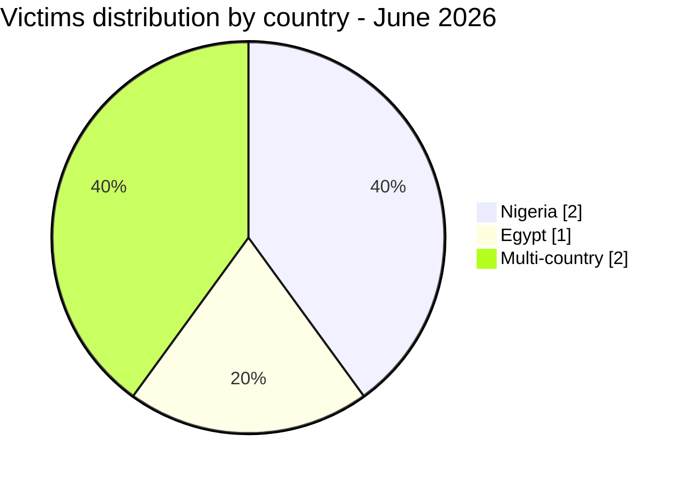
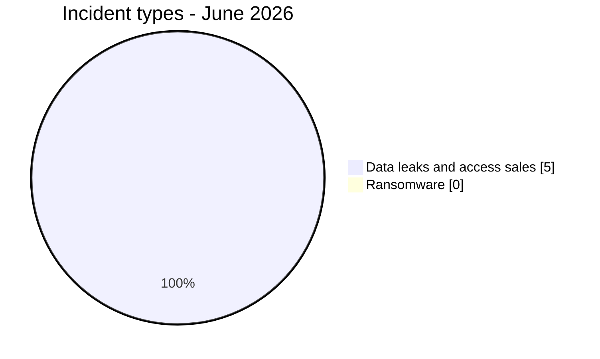
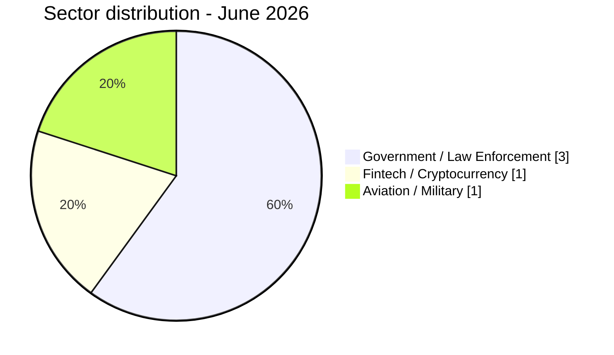

# CTI report - cyberattacks in Africa (June 2026)

👉🏾 [**French version available here**](./README_FR.md)

## 1. Executive summary

June 2026 recorded **5 publicly claimed cyber incidents** across Africa, exclusively in the form of **data leaks, database sales, and access sales**. No ransomware incidents were documented this month. The period was characterized by two major themes: the catastrophic data leak targeting Nigeria's largest crypto-to-Naira exchange (Jeroid.co), and a coordinated market for law enforcement portal access and government email addresses affecting multiple African countries.

Key findings:
- **0 ransomware attacks** and **5 data leaks / access sales (100%)**.
- **2 countries** directly affected (Egypt, Nigeria) plus **2 multi-country incidents** touching up to 11 African nations.
- **Jeroid.co (Nigeria):** one of the most severe fintech data leaks recorded on the continent, with 312,433 users, 759,900 wallets ($306M TVL), 110,282 BVN, 64,300 NIN, and 70,956 biometric face verification photos exposed on a public S3 bucket.
- **Law enforcement portal access sales:** two separate actors ("Convince" and "Governor") sold active government and police credentials specifically usable to submit Emergency Disclosure Requests (EDR) to Meta, Google, TikTok, and X, targeting at least 11 African countries.
- **Egypt:** aviation and military personnel data (pilots from Egypt Air, Qatar Airways, Suez Canal Authority, and the Ministry of Civil Aviation) exposed and offered for sale.
- **Nigeria:** two incidents in the same month: Jeroid.co fintech breach and the NILDS government institution claim.

> All claims from cybercriminal forums, leak sites, and underground channels are treated as **unverified claims** unless independently corroborated.

### Victim list

👉🏾 [View full victim list](./victims.md)

---

## 2. Methodology

- **Scope**: 54 African countries.
- **Period**: 1-21 June 2026 (incidents disclosed or claimed during this period; actual attack dates may be earlier).
- **Sources**: Dark web, DLS (leak sites), OSINT, Telegram channels, underground forums.
- **Inclusion**: Publicly claimed or attributed incidents with identified victim, country, and sector.
- **Typology**:
  - *Ransomware*: encryption and ransom demand.
  - *Data leak / access sale*: exfiltration without encryption, database sold or published, or sale of access to compromised systems or credentials.

---

## 3. Global overview

| Indicator | Value |
| :--- | :--- |
| Total incidents | 5 |
| Countries directly affected | 2 (+ multi-country) |
| Distinct actors | 5 |
| Ransomware incidents | 0 (0%) |
| Data leaks / access sales | 5 (100%) |

**Country breakdown:**

| Rank | Country | Incidents | Chart |
| :---: | :--- | :---: | :--- |
| **1** | 🇳🇬 Nigeria | **2** | ██ |
| **2** | 🇪🇬 Egypt | **1** | █ |
| **–** | 🌍 Multi-country | **2** | ██ |

**Incident type distribution:**

**Most active actors:**

| Actor | Incidents | Type |
| :--- | :---: | :--- |
| Convince | 1 | Access sale (EDR credentials) |
| Governor | 1 | Access sale (LEP accounts) |
| burti | 1 | Data broker |
| 404Crew CT x NullSec Nigeria | 1 | Data leak coalition |
| Xyphorix | 1 | Data broker |

---

## 4. Country-by-country overview

> All entries cover publicly claimed incidents only. Claims remain unverified unless independently confirmed.

### 🇪🇬 Egypt (1 incident)

**Egyptian Pilots Database**: actor Xyphorix offered on the [Citizen] forum a database containing personal information of Egyptian pilots from military, commercial, and civilian aviation. Fields include names, phone numbers, occupation, city, and marital status. Personnel from Egypt Air, Qatar Airways, Fly Emirates, Petroleum Air Services, Suez Canal Authority, and the Ministry of Civil Aviation are represented. The presence of military and state-linked pilots makes this database particularly sensitive for national security. Risks include targeted phishing, espionage, and impersonation of aviation personnel.

### 🇳🇬 Nigeria (2 incidents)

**Jeroid.co**: the most impactful incident of June 2026 and one of the most severe fintech breaches documented on the continent. Actor burti offered the full dataset on the [Citizen] forum for $2,000 USD. Exposed data includes 312,433 users, 759,900 wallets ($306M TVL), 110,282 Bank Verification Numbers (BVN), 64,300 National ID Numbers (NIN), 70,956 face verification photos on an unauthenticated public S3 bucket, 3,872 passports, 2,106 voter cards, 1,700 driver licenses, and 65,013 full Level 3 KYC records (BVN + NIN + face scan + identity document). BVN and NIN are Nigeria's primary banking identifiers; their combined exposure with biometric data enables complete identity theft, financial fraud, and loan scams at scale.

**NILDS**: the National Institute for Legislative and Democratic Studies was claimed by the coalition 404Crew Cyber Team x NullSec Nigeria. Published samples allegedly reveal database structures, administrator accounts, email addresses, and credentials linked to parliamentary systems. Such exposure could enable unauthorized access to internal applications and facilitate targeted phishing campaigns against Nigeria's National Assembly ecosystem. The claim has not been independently verified.

### 🌍 Multi-country (2 incidents)

**Convince (EDR email sale)**: via the Immortal forum, Convince sold real and active government email addresses from 8 African countries (Ethiopia, Tanzania, Angola, Kenya, Zambia, Nigeria, Egypt, Morocco), combined with a complete EDR tutorial enabling impersonation of official authorities to extract user data from Google, Meta, and Telegram. Prices range from $5 (Tanzania, 13,000 emails) to $70 (Morocco, 2 emails). This offer does not represent a passive data breach; it actively compromises the authentication vector of African governments' law enforcement identity.

**Governor (LEP account sale)**: via the [Citizen] forum, Governor offered fully operational law enforcement portal accounts already authenticated on Meta, TikTok, and X for 9 government entities (Egypt, Malawi, Tanzania, Algeria, Palestine, Kenya, Zambia, Sierra Leone, Yemen). Unlike Convince's email-only catalog, Governor's accounts allow direct portal login without drafting fake correspondence, enabling immediate data subpoena requests and content removal. Prices range from $60 to $140 per account. This represents a higher operational severity than the Convince offer.

---

## 5. Detailed analysis by incident type

### 5.1 Ransomware (0 incidents)

No ransomware incidents documented in June 2026.

### 5.2 Data leaks and access sales (5 incidents)

| Date | Country | Organization / Target | Actor | Sector |
| :--- | :---: | :--- | :--- | :--- |
| June 6 | 🇪🇬 Egypt | Egyptian Pilots Database | Xyphorix | Aviation / Military |
| June 10 | 🇳🇬 Nigeria | Jeroid.co | burti | Fintech / Crypto |
| June 13 | 🇳🇬 Nigeria | NILDS | 404Crew CT x NullSec Nigeria | Government / Legislative |
| June 17 | 🌍 Multi-country | Gov. institutions (EDR emails) | Convince | Government / Law Enforcement |
| June 20 | 🌍 Multi-country | Gov. portal access (LEP accounts) | Governor | Government / Law Enforcement |

**Key observations:**
- **Jeroid.co** combines financial, identity, and biometric data in a single exposure. 65,013 users with full Level 3 KYC represent the highest-risk cohort for identity fraud.
- **Convince and Governor** represent two tiers of the same criminal market: email addresses (lower cost, higher volume) and authenticated portal accounts (higher cost, direct operational access). Their simultaneous appearance suggests active market development around law enforcement impersonation as a criminal service.
- **Egyptian pilots database** is notable for its military and government-linked personnel content, creating national security risks beyond typical personal data exposure.
- **NILDS**: the involvement of Nigeria-linked hacktivists targeting a parliamentary research institute reflects ongoing domestic cyber activity beyond foreign ransomware groups.

---

## 6. Sectoral impact

| Sector | Incidents | Percentage |
| :--- | :---: | :---: |
| Government / Law Enforcement | 3 | 60.0% |
| Fintech / Cryptocurrency | 1 | 20.0% |
| Aviation / Military | 1 | 20.0% |

**Takeaways:**
- Government and law enforcement institutions represent 60% of June incidents, making this the most government-focused month in AFRINTEL 2026 records.
- The simultaneous availability of two complementary access products targeting the same African law enforcement ecosystem (EDR emails + LEP portal accounts) indicates market specialization around a single high-value criminal niche.
- Fintech and aviation incidents are fewer in number but carry disproportionately high data sensitivity: biometric KYC at scale (Jeroid.co) and military personnel data (Egyptian pilots).

---

## 7. Threat actor profile

| Actor | Type | Incidents | Primary targets |
| :--- | :--- | :---: | :--- |
| **Convince** | Access sale (EDR credentials) | 1 | African government / law enforcement (8 countries) |
| **Governor** | Access sale (LEP accounts) | 1 | African government / law enforcement (9 countries) |
| **burti** | Data broker | 1 | Nigerian fintech (Jeroid.co) |
| **404Crew CT x NullSec Nigeria** | Data leak (coalition) | 1 | Nigerian government |
| **Xyphorix** | Data broker | 1 | Egyptian aviation / military |

**Actor notes:**
- **Convince and Governor** may be linked or operating in the same criminal ecosystem; they sell complementary products targeting the same law enforcement impersonation market.
- **burti** is a data broker whose prior activity is not documented by AFRINTEL; June 2026 is first appearance.
- **404Crew CT x NullSec Nigeria**: a Nigeria-linked hacktivist coalition targeting domestic government institutions.
- **Xyphorix**: first AFRINTEL appearance; specializes in database sales.

### 7.1 Risk assessment

| Country | Risk level |
| :--- | :--- |
| Nigeria | 🔴 Critical (biometric + financial + identity exposure at scale) |
| Egypt | 🔴 High (military aviation personnel + LEP portal access) |
| Tanzania | 🟠 Medium-High (13,000 gov. emails + LEP portal) |
| Kenya, Zambia, Algeria, Malawi, Sierra Leone | 🟠 Medium (LEP portal accounts sold) |
| Ethiopia, Angola, Morocco | 🟡 Medium-Low (government email addresses sold) |

---

## 8. Key trends and intelligence gaps

### Trends

1. **No ransomware in June**: a notable contrast with May 2026 (16 ransomware incidents). June 2026 is dominated by data monetization and access sales rather than encryption-based attacks.
2. **Law enforcement impersonation as a consolidated criminal market**: the simultaneous appearance of two actors selling government credentials specifically for EDR and LEP abuse confirms the consolidation of a specialized criminal service targeting Africa's law enforcement infrastructure.
3. **Fintech as an extreme data concentration point**: Jeroid.co's exposure illustrates the systemic risk created when a single fintech platform holds BVN, NIN, biometric face scans, and KYC documents for hundreds of thousands of users. The unauthenticated S3 bucket is a basic misconfiguration with catastrophic consequences.
4. **Nigeria targeted twice in one month**: NILDS and Jeroid.co make Nigeria the most exposed country of the month in terms of data sensitivity and incident volume.
5. **Multi-country law enforcement exposure**: the Convince and Governor listings collectively expose government and police institutions in at least 11 African countries, creating structural vulnerability for Africa's digital governance.

### Gaps

- The actual number of countries exposed via the Governor and Convince catalogs may be higher; published listings may represent partial offerings.
- The true identity and prior track record of burti, Xyphorix, Convince, and Governor are not documented in AFRINTEL's existing actor profiles.
- Whether the NILDS breach resulted in any data actually being extracted has not been independently confirmed.
- The extent to which the sold government credentials (Convince, Governor) have already been operationally used by buyers is unknown.

---

## 9. MITRE ATT&CK mapping (contextual)

| Phase | Technique ID | Technique name | Context |
| :--- | :---: | :--- | :--- |
| Collection | T1005 | Data from Local System | Jeroid.co database, NILDS, Egyptian pilots |
| Exfiltration | T1537 | Transfer Data to Cloud Account | S3 bucket exposure (Jeroid.co biometric data) |
| Initial Access | T1078 | Valid Accounts | Government / police credentials sold by Convince, Governor |
| Resource Development | T1586 | Compromise Accounts | Law enforcement portal accounts (Governor) |
| Impact | T1565.001 | Stored Data Manipulation | Potential via LEP access (content removal, account suspension) |

---

## 10. Recommendations

### For fintech platforms

- Audit all data storage policies immediately; S3 buckets containing biometric or KYC data must never be publicly accessible.
- Implement encryption at rest for all KYC documents, face verification assets, BVN, and NIN records.
- Review data minimization practices; Level 3 KYC data should be stored only for the minimum period required by regulation.
- Implement continuous cloud misconfiguration monitoring (CSPM tools).

### For governments and law enforcement

- Governments of Nigeria, Egypt, Tanzania, Kenya, Ethiopia, Angola, Zambia, Morocco, Algeria, Malawi, Sierra Leone, and Algeria must immediately audit government email account inventories and rotate credentials for all law enforcement email addresses.
- Report to Meta, Google, TikTok, and X any suspected misuse of official law enforcement portal access; request audit logs for all EDR and data subpoena requests filed using African government credentials since January 2025.
- Implement MFA on all government email systems; prioritize accounts associated with law enforcement and judicial functions.

### For affected citizens (Nigeria)

- Jeroid.co users should monitor their BVN and NIN for unauthorized linked accounts or unusual activity.
- Consider requesting a BVN verification with their bank to detect any fraudulent account linking.

---

## 11. SOC tactical recommendations

- **[T1078] Credential monitoring**: cross-reference the sold government email addresses (Ethiopia, Tanzania, Angola, Kenya, Zambia, Nigeria, Egypt, Morocco) against internal IAM directories; flag accounts present in both.
- **[T1537] S3 exposure detection**: scan all cloud storage buckets for public access policies on assets containing biometric or KYC data; enforce bucket-level access control lists using automated CSPM tooling.
- **[T1586] Law enforcement portal audit**: request audit logs from Meta, TikTok, and X law enforcement portals for all requests filed using African government credentials since January 2025.
- **[Fintech breach response]**: Nigerian financial institutions should monitor for unusual BVN-linked account opening patterns that could signal Jeroid.co data being exploited for loan fraud or account takeover.
- **EDR abuse detection**: flag any government email account generating unusual numbers of EDR or data subpoena requests; cross-check request patterns against normal institutional activity baselines.

---

## 12. Strategic recommendations

- **African fintech regulatory framework**: the CBN (Central Bank of Nigeria) and equivalent regulators should mandate that Level 3 KYC biometric data is never stored on public-accessible cloud infrastructure; a dedicated security audit framework for fintech data storage should be established and enforced.
- **Continental law enforcement credential monitoring**: AFRIPOL should evaluate the creation of a monitoring mechanism for criminal sales of member states' official government access credentials, enabling rapid notification when an African country's law enforcement identity is compromised on underground markets.
- **Government email hygiene standards**: African Union member states should adopt minimum binding standards for government email account management, including mandatory MFA, regular credential rotation, and centralized inventory management for law enforcement-linked email addresses.
- **Cross-platform coordination**: social media platforms (Meta, Google, TikTok, X) should establish a dedicated notification channel to alert African national CERTs when their countries' law enforcement portal accounts show anomalous activity patterns.
- **Public awareness**: Nigerian citizens exposed through Jeroid.co should be notified through official channels; the Nigerian Data Protection Commission (NDPC) should investigate the S3 misconfiguration and assess regulatory compliance.

---

## 13. Conclusion

June 2026 recorded fewer incidents than May 2026 in absolute terms, but the qualitative impact is significant and in some cases exceptional. The Jeroid.co breach stands as one of the largest fintech data exposures documented on the African continent, combining financial, biometric, and identity data at scale. The simultaneous appearance of EDR and LEP access sales targeting African law enforcement represents a structural threat to digital governance across the region, potentially enabling third parties to impersonate African governments with major platforms. The absence of ransomware this month may reflect seasonal patterns or a temporary shift in actor priorities, but does not indicate a reduction in overall risk exposure.

**AFRINTEL** - African Cyber Threat Intelligence
[GitHub AFRINTEL](https://github.com/Hatchepsoute/AFRINTEL)
