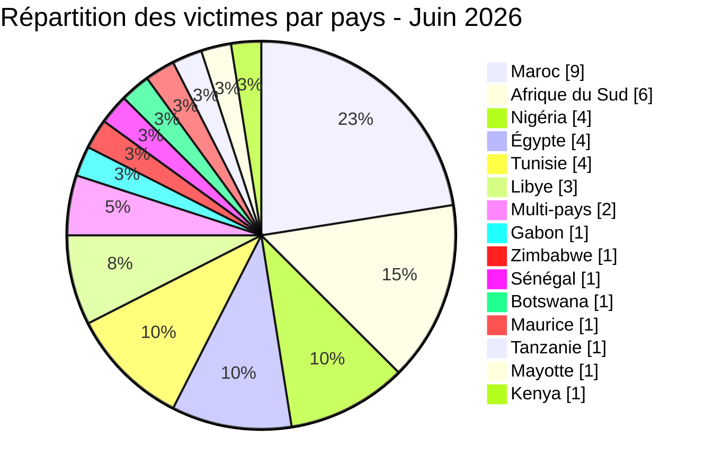
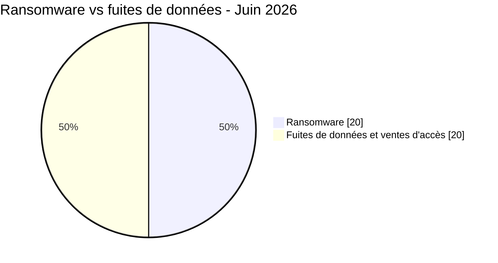
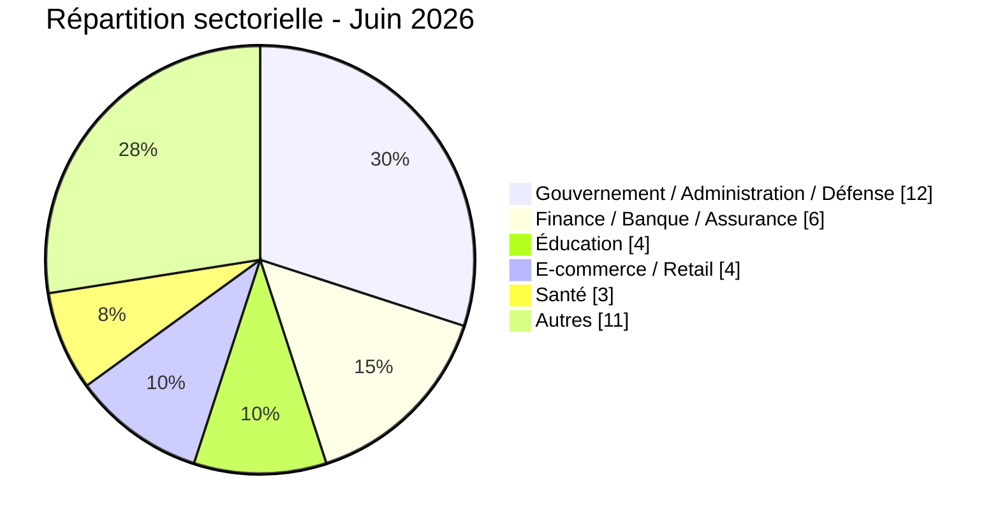
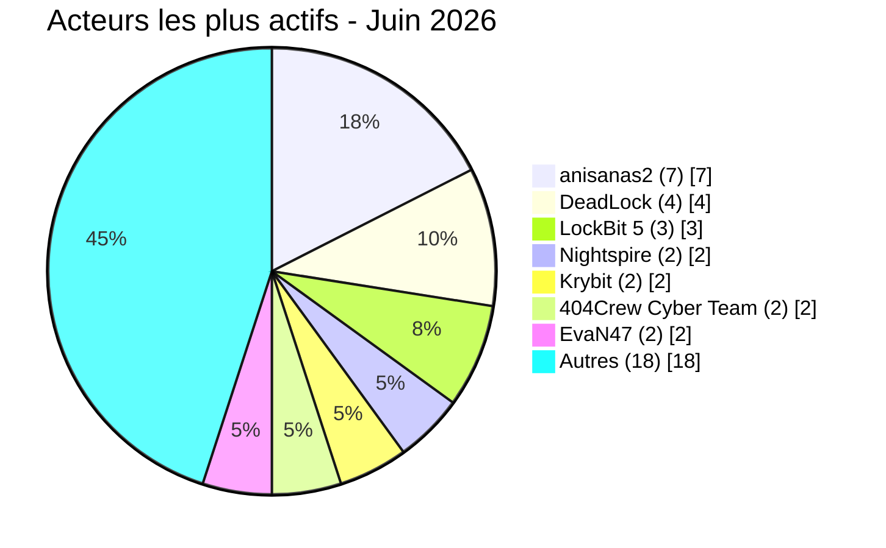

# Rapport CTI - cyberattaques en Afrique (juin 2026)

👉🏾 [**English version available here**](./README.md)

## 1. Synthèse exécutive

Juin 2026 a enregistré **40 incidents cyber revendiqués publiquement** sur le continent : **20 ransomwares (50 %)** et **20 fuites de données / ventes d'accès (50 %)**. C'est un net changement par rapport à mai 2026, où le ransomware ne représentait que 28 % des incidents. Le volume baisse de 57 à 40 incidents, mais le niveau de risque ne baisse pas pour autant : ce mois-ci comprend l'une des pires expositions biométriques fintech documentées sur le continent, une fuite d'identifiants en clair issue de la messagerie d'une armée nationale, et une campagne soutenue d'un seul acteur contre le Maroc qui dure maintenant depuis trois mois consécutifs sans aucune interruption visible.

Principales conclusions :
- **20 ransomwares (50 %)** et **20 fuites de données / ventes d'accès (50 %)**, une répartition inhabituellement équilibrée qui marque une vraie remontée du ransomware par rapport à mai.
- **14 pays** directement touchés, plus **6 pays supplémentaires** exposés uniquement via deux offres multi-pays de vente d'identifiants (Éthiopie, Angola, Zambie, Malawi, Algérie, Sierra Leone), soit **20 pays africains** concernés au total.
- **Le Maroc (9 incidents)** est le pays le plus ciblé du mois, presque entièrement du fait d'un seul cluster d'acteur, **anisanas2**, qui a touché 7 organisations marocaines différentes dans l'éducation, la logistique, les mines, le e-commerce et l'automobile. C'est le même cluster déjà signalé dans le rapport de mai 2026 ; trois mois plus tard, rien n'indique que la campagne ait été contenue.
- **Jeroid.co (Nigéria) :** 312 433 utilisateurs, 110 282 BVN, 64 300 NIN et 70 956 photos de vérification faciale biométrique exposées sur un bucket S3 public non authentifié, vendues pour 2 000 dollars. Les éléments analysés indiquent une exposition grave de données KYC ; le vecteur d'accès initial reste inconnu.
- **Armée nigériane (army.mil.ng) :** identifiants de messagerie en clair pour plus de 20 comptes militaires, incluant un accès à un portail d'imagerie satellite (DigitalGlobe). C'est l'incident le plus grave du mois en matière de sécurité nationale, il mérite d'être traité comme tel, pas classé comme "encore une fuite".
- **BRELA (Tanzanie) :** 10,2 millions d'enregistrements couvrant 8 millions de personnes, le plus grand jeu de données du mois, exposant tout l'écosystème d'enregistrement des entreprises et des contribuables du pays.
- **Deux ministères libyens** (Enseignement technique et professionnel, puis Éducation) ont été touchés par le même acteur, EvaN47, lors des deux derniers jours du mois, une tendance à surveiller en juillet.

> Toutes les publications issues de forums cybercriminels, de leak sites et de canaux clandestins sont traitées comme des **revendications non vérifiées** sauf corroboration indépendante.

### Liste des victimes

👉🏾 [Voir la liste complète des victimes](./victims_FR.md)

---

## 2. Méthodologie

- **Périmètre** : 54 pays africains.
- **Période** : 1-30 juin 2026 (incidents révélés ou revendiqués durant ce mois ; les dates réelles d'attaque peuvent être antérieures).
- **Sources** : Dark web, DLS (sites de fuite), OSINT, canaux Telegram, forums underground.
- **Inclusion** : incidents identifiés et analysés pour la première fois par AFRINTEL en juin 2026. La date initiale de revendication ou d'attaque peut être antérieure et reste indiquée dans la fiche victime lorsqu'elle est connue.
- **Typologie** :
  - *Ransomware* : revendication ou divulgation attribuée à un groupe ransomware. Le chiffrement n'est pas présumé sans élément probant.
  - *Fuite de données / vente d'accès* : exfiltration sans chiffrement, base de données vendue ou publiée, ou vente d'accès/d'identifiants.

> Toutes les publications issues de forums cybercriminels, de leak sites et de canaux clandestins sont traitées comme des **revendications non vérifiées** sauf corroboration indépendante.

---

## 3. Bilan global

| Indicateur | Valeur |
|---|---|
| Total victimes | 40 |
| Pays touchés | 20 (14 directs + 6 via incidents multi-pays) |
| Acteurs distincts | 25 |
| Incidents ransomware | 20 (50,0 %) |
| Fuites de données / ventes d'accès | 20 (50,0 %) |

### Classement par pays

**Tous incidents confondus (40) :**

| Rang | Pays | Incidents | Graphe |
| :---: | :--- | :---: | :--- |
| **1** | 🇲🇦 Maroc | **9** | █████████ |
| **2** | 🇿🇦 Afrique du Sud | **6** | ██████ |
| **3** | 🇳🇬 Nigéria | **4** | ████ |
| **3** | 🇪🇬 Égypte | **4** | ████ |
| **3** | 🇹🇳 Tunisie | **4** | ████ |
| **6** | 🇱🇾 Libye | **3** | ███ |
| **7** | 🌍 Multi-pays (ventes d'identifiants) | **2** | ██ |
| **8** | 🇬🇦 Gabon | **1** | █ |
| **8** | 🇿🇼 Zimbabwe | **1** | █ |
| **8** | 🇸🇳 Sénégal | **1** | █ |
| **8** | 🇧🇼 Botswana | **1** | █ |
| **8** | 🇲🇺 Maurice | **1** | █ |
| **8** | 🇹🇿 Tanzanie | **1** | █ |
| **8** | 🇾🇹 Mayotte | **1** | █ |
| **8** | 🇰🇪 Kenya | **1** | █ |

### Répartition des ransomwares (Total : 20)

| Rang | Pays | Incidents | Graphe |
| :---: | :--- | :---: | :--- |
| **1** | 🇿🇦 Afrique du Sud | **4** | ████ |
| **2** | 🇪🇬 Égypte | **3** | ███ |
| **2** | 🇹🇳 Tunisie | **3** | ███ |
| **4** | 🇲🇦 Maroc | **1** | █ |
| **4** | 🇳🇬 Nigéria | **1** | █ |
| **4** | 🇱🇾 Libye | **1** | █ |
| **4** | 🇬🇦 Gabon | **1** | █ |
| **4** | 🇿🇼 Zimbabwe | **1** | █ |
| **4** | 🇸🇳 Sénégal | **1** | █ |
| **4** | 🇧🇼 Botswana | **1** | █ |
| **4** | 🇲🇺 Maurice | **1** | █ |
| **4** | 🇾🇹 Mayotte | **1** | █ |
| **4** | 🇰🇪 Kenya | **1** | █ |

### Répartition des fuites de données / ventes d'accès (Total : 20)

| Rang | Pays | Incidents | Graphe |
| :---: | :--- | :---: | :--- |
| **1** | 🇲🇦 Maroc | **8** | ████████ |
| **2** | 🇳🇬 Nigéria | **3** | ███ |
| **3** | 🇿🇦 Afrique du Sud | **2** | ██ |
| **3** | 🇱🇾 Libye | **2** | ██ |
| **3** | 🌍 Multi-pays | **2** | ██ |
| **6** | 🇪🇬 Égypte | **1** | █ |
| **6** | 🇹🇳 Tunisie | **1** | █ |
| **6** | 🇹🇿 Tanzanie | **1** | █ |

### Comparaison ransomware vs fuites de données par pays

| Pays | Ransomware | Fuites de données | Répartition côte à côte |
| :--- | :---: | :---: | :--- |
| 🇲🇦 Maroc | **1** | **8** | 🟧 🟦🟦🟦🟦🟦🟦🟦🟦 |
| 🇿🇦 Afrique du Sud | **4** | **2** | 🟧🟧🟧🟧 🟦🟦 |
| 🇳🇬 Nigéria | **1** | **3** | 🟧 🟦🟦🟦 |
| 🇪🇬 Égypte | **3** | **1** | 🟧🟧🟧 🟦 |
| 🇹🇳 Tunisie | **3** | **1** | 🟧🟧🟧 🟦 |
| 🇱🇾 Libye | **1** | **2** | 🟧 🟦🟦 |
| 🌍 Multi-pays | **0** | **2** | 🟦🟦 |
| 🇬🇦 Gabon | **1** | **0** | 🟧 |
| 🇿🇼 Zimbabwe | **1** | **0** | 🟧 |
| 🇸🇳 Sénégal | **1** | **0** | 🟧 |
| 🇧🇼 Botswana | **1** | **0** | 🟧 |
| 🇲🇺 Maurice | **1** | **0** | 🟧 |
| 🇹🇿 Tanzanie | **0** | **1** | 🟦 |
| 🇾🇹 Mayotte | **1** | **0** | 🟧 |
| 🇰🇪 Kenya | **1** | **0** | 🟧 |
| **Total (40)** | **20** | **20** | *Légende : 🟧 Ransomware \| 🟦 Fuites de données* |

### Répartition géographique par région

| Région | Total incidents | Ransomware | Fuites | Côte à côte |
| :--- | :---: | :---: | :---: | :--- |
| **Afrique du Nord** | **20** (50,0 %) | 8 | 12 | 🟧🟧🟧🟧🟧🟧🟧🟧 🟦🟦🟦🟦🟦🟦🟦🟦🟦🟦🟦🟦 |
| **Afrique australe** | **8** (20,0 %) | 6 | 2 | 🟧🟧🟧🟧🟧🟧 🟦🟦 |
| **Afrique de l'Ouest et centrale** | **6** (15,0 %) | 2 | 4 | 🟧🟧 🟦🟦🟦🟦 |
| **Afrique de l'Est** | **2** (5,0 %) | 1 | 1 | 🟧 🟦 |
| **Océan Indien** | **2** (5,0 %) | 2 | 0 | 🟧🟧 |
| **Multi-pays (ventes d'identifiants)** | **2** (5,0 %) | 0 | 2 | 🟦🟦 |

*Légende : 🟧 Ransomware | 🟦 Fuites de données. Afrique du Nord : Maroc, Égypte, Tunisie, Libye. Afrique australe : Afrique du Sud, Botswana, Zimbabwe. Afrique de l'Ouest et centrale : Nigéria, Gabon, Sénégal. Afrique de l'Est : Kenya, Tanzanie. Océan Indien : Maurice, Mayotte.*

### Répartition sectorielle

| Secteur d'activité | Incidents | Part (%) | Graphe |
| :--- | :---: | :---: | :--- |
| **Gouvernement / Administration / Défense** | **12** | 30,0 % | ████████████ |
| **Finance / Banque / Assurance** | **6** | 15,0 % | ██████ |
| **Éducation** | **4** | 10,0 % | ████ |
| **E-commerce / Retail** | **4** | 10,0 % | ████ |
| **Santé** | **3** | 7,5 % | ███ |
| **Autres** | **11** | 27,5 % | ███████████ |
| **Total** | **40** | **100 %** | |

### Acteurs de menace les plus actifs

| Acteur / Groupe | Incidents | Activité principale | Graphe |
| :--- | :---: | :--- | :--- |
| **anisanas2** | **7** | Fuites / ventes de données (Maroc, campagne soutenue sur 3 mois) | 🟦🟦🟦🟦🟦🟦🟦 |
| **DeadLock** | **4** | Ransomware (multi-pays : Gabon, Nigéria, Mayotte, Kenya) | 🟧🟧🟧🟧 |
| **LockBit 5** | **3** | Ransomware (Botswana, Afrique du Sud, Maurice) | 🟧🟧🟧 |
| **Nightspire** | **2** | Ransomware (Zimbabwe, Égypte) | 🟧🟧 |
| **Krybit** | **2** | Ransomware / données publiées (Sénégal, Maroc) | 🟧🟧 |
| **404Crew Cyber Team** | **2** | Fuite de données (coalition Nigéria, Maroc) | 🟦🟦 |
| **EvaN47** | **2** | Fuite de données (Libye, deux ministères en deux jours) | 🟦🟦 |

*Légende : 🟧 Ransomware \| 🟦 Fuites de données*

---

### Vue d'ensemble pays par pays

> **Pour le détail complet de chaque incident (volumes de données, analyse d'échantillon, tactiques des acteurs, etc.), voir la liste complète des victimes :** [`victims_FR.md`](./victims_FR.md)

---

### 🇲🇦 Maroc (9 incidents : 1 ransomware, 8 fuites)

**Ransomware (1) :**
- **Le groupe ransomware Krybit** (19 juin, MUPRAS RAM) : organisme de mutuelle prévoyance des employés de Royal Air Maroc ; les documents publiés couvrent les cotisations des membres, les remboursements médicaux, les flux bancaires et les contrats informatiques, une exposition d'une criticité élevée à tous égards.

**La campagne anisanas2 (7 incidents, 6-27 juin) :** le même cluster d'acteur déjà signalé dans le rapport AFRINTEL de mai 2026 pour RADEM Meknès et le lot Ministère de la Justice reste actif, désormais dans son troisième mois consécutif contre le Maroc.
- **IMT (Institut des Mines de Touissit)** (6 juin) : 100+ dossiers d'étudiants et 37+ dossiers d'enseignants avec numéros CIN.
- **Tlog.ma** (6 juin) : 700 000 dossiers clients logistiques ; demande de rançon de 500 dollars pour la base complète.
- **Mines d'Aouli** (6 juin) : documents fiscaux et de liquidation 2001-2025 d'une société minière en liquidation.
- **Plateforme de gestion de startups non identifiée** (26 juin) : documents d'identité et financiers de quatre entreprises marocaines en aval (ARSYS INFO, AUDD, Black Service Solution, Media Triangle) ; l'opérateur reste lui-même non identifié.
- **Entreprise marocaine de livraison non identifiée** (26 juin) : 486 024 dossiers de livraison couvrant sept ans d'opérations nationales.
- **Avito.ma** (26 juin) : échantillon de 200 000 annonces, prix demandé de 800 dollars pour l'archive complète ; la même plateforme avait déjà fait l'objet d'un échantillon par un autre acteur en mai 2026.
- **Stellantis Maroc** (27 juin) : échantillon de 992 pistes commerciales automobiles ; le mélange de marques présent dans le fichier évoque plutôt une source CRM qu'une compromission directe confirmée.

**Autre fuite (1) :**
- **L'acteur malveillant 404Crew Cyber Team** (25 juin, MG Maroc) : échantillon de déclarations de paie et de cotisations sociales 2025-2026 d'une association de professionnels de santé.

**Évaluation sans détour :** il ne s'agit pas d'une série d'incidents isolés. Un seul cluster d'acteur a désormais touché au moins dix organisations marocaines recensées à partir de revendications ou de publications analysées depuis avril, dans l'éducation, la logistique, les mines, le e-commerce, les startups et l'automobile, sans réaction publique visible des autorités marocaines ou des hébergeurs concernés. C'est ce schéma, plus qu'une seule fuite isolée, qui constitue le véritable sujet marocain du deuxième trimestre 2026.

---

### 🇿🇦 Afrique du Sud (6 incidents : 4 ransomwares, 2 fuites)

**Ransomware (4) :**
- **Black X** (2 juin, African National Congress) : 2 310 865 dossiers d'adhérents avec numéros d'identité sud-africains, adresses et langues, publiés directement ; l'une des plus grandes expositions de données d'un parti politique jamais enregistrées sur le continent.
- **WorldLeaks** (5 juin, Access Dental) : revendication non vérifiée.
- **LockBit 5** (18 juin, Grey High School) : revendication non vérifiée.
- **CMD Organization** (28 juin, Fidelity Security Group) : revendication non vérifiée.

**Fuites (2) :**
- **L'acteur malveillant mosad** (8 juin, Armée sud-africaine / SANDF) : document classifié "Warning Instruction" de 2022 détaillant un déploiement de maintien de l'ordre, incluant les téléphones, e-mails et identifiants liés aux numéros de sécurité sociale d'officiers supérieurs nommément cités. Un document militaire restreint qui circule sur Telegram quatre ans après sa rédaction révèle une fuite interne persistante qui n'a jamais été colmatée.
- **L'acteur malveillant GOD User** (10 juin, UNISA) : dump SQL complet d'un système de support technique avec mots de passe en clair sur les comptes clients, techniciens et administrateurs.

---

### 🇳🇬 Nigéria (4 incidents : 1 ransomware, 3 fuites)

**Ransomware (1) :**
- **DeadLock** (1er juin, Fidelity Pension Managers) : revendication non vérifiée.

**Fuites (3) :**
- **L'acteur malveillant burti** (10 juin, Jeroid.co) : 312 433 utilisateurs, 110 282 BVN, 64 300 NIN et 70 956 photos de vérification faciale biométrique laissées sur un bucket S3 public non authentifié, vendus pour 2 000 dollars. C'est l'exposition fintech la plus grave enregistrée par AFRINTEL au Nigéria cette année, tandis que le vecteur d'accès initial reste inconnu.
- **La coalition 404Crew Cyber Team x NullSec Nigeria** (13 juin, NILDS / Assemblée nationale) : échantillon de base de données parlementaire, motivation hacktiviste (#OpNigeria), confiance moyenne.
- **L'acteur malveillant NulleSecNg** (21 juin, Armée nigériane, army.mil.ng) : plus de 20 identifiants de messagerie en clair pour du personnel militaire, incluant un accès à un portail d'imagerie satellite DigitalGlobe. Des mots de passe en clair pour la messagerie d'une armée nationale, associés à un accès satellite de reconnaissance, est le type d'incident qui devrait déclencher une rotation d'urgence des identifiants le jour même de sa découverte, pas un ticket de routine.

---

### 🇪🇬 Égypte (4 incidents : 3 ransomwares, 1 fuite)

**Ransomware (3) :**
- **Le groupe ransomware TheGentlemen** (4 juin, Bouri Group) : revendication non vérifiée.
- **Le groupe ransomware Nightspire** (15 juin, Sheraton Miramar Resort El Gouna) : revendication non vérifiée.
- **Le groupe ransomware Lamashtu** (17 juin, Great Foods) : revendication non vérifiée.

**Fuite (1) :**
- **L'acteur malveillant Xyphorix** (6 juin, base de données des pilotes égyptiens) : données personnelles de pilotes militaires, commerciaux et civils d'Egypt Air, Qatar Airways, Fly Emirates, l'Autorité du Canal de Suez et le Ministère de l'Aviation Civile, vendues sans prix communiqué. Des données de pilotes liés à l'armée mises en vente sur un forum criminel constituent une exposition de sécurité nationale, pas une fuite de données personnelles ordinaire.

---

### 🇹🇳 Tunisie (4 incidents : 3 ransomwares, 1 fuite)

**Ransomware (3) :**
- **Le groupe ransomware Aurora** (16 juin, Sumitomo Electric Bordnetze, SEBN Tunisia) : revendication non vérifiée, site de Fejja.
- **Le groupe ransomware SETTRA** (26 juin, Centrale Laitière du Cap-Bon) : revendication non vérifiée.
- **Le groupe ransomware Stormous** (28 juin, monoprix.tn) : revendication non vérifiée.

**Fuite (1) :**
- **L'acteur malveillant AshleyWood2022** (23 juin, Examens.tn) : dump complet de la base de données `examens.sql` de 717 Mo, 3 697 comptes utilisateurs et 74 891 enregistrements de métadonnées, incluant jetons de session, jetons de réinitialisation de mot de passe et données OAuth. Un dump complet de base de données WordPress de ce type provient presque toujours d'un plugin non corrigé ou d'un fichier de sauvegarde exposé, à vérifier avant de conclure à un exploit inédit.

---

### 🇱🇾 Libye (3 incidents : 1 ransomware, 2 fuites)

**Ransomware (1) :**
- **Le groupe ransomware Qilin** (22 juin, Central Bank of Libya) : revendication non vérifiée.

**Fuites (2), même acteur, deux ministères consécutifs :**
- **L'acteur malveillant EvaN47** (29 juin, Ministère de l'Enseignement technique et professionnel) : volume revendiqué de 900 000 dossiers d'étudiants, incluant une table de comptes utilisateurs distincte avec des e-mails @tve.gov.ly et un champ lié aux mots de passe.
- **L'acteur malveillant EvaN47** (30 juin, Ministère de l'Éducation) : volume revendiqué de 287 Go de certificats, numéros d'identité nationaux, photos et scans de passeports d'étudiants à l'échelle nationale.

Deux ministères libyens touchés par le même acteur deux jours consécutifs en fin de mois relèvent d'un schéma, pas d'une coïncidence ; à traiter comme une campagne active contre les infrastructures éducatives gouvernementales libyennes en entrant dans juillet.

---

### Pays à incident unique (8)

| Pays | Acteur | Date | Victime | Notes |
| :--- | :--- | :--- | :--- | :--- |
| 🇬🇦 Gabon | DeadLock | 1er juin | Finam Gabon | Échéance de divulgation annoncée pour le 15 mai mais aucune donnée jamais observée publiquement ; négociation, règlement privé, vente privée ou exfiltration insuffisante possibles ; aucune de ces hypothèses n'est confirmée. |
| 🇿🇼 Zimbabwe | Nightspire | 5 juin | First Mutual Holdings | Revendication non vérifiée. |
| 🇸🇳 Sénégal | Krybit | 17 juin | Cour des Comptes du Sénégal | 19,73 Go ; documents d'audit, budgétaires et RH de l'institution supérieure de contrôle du pays. |
| 🇧🇼 Botswana | LockBit 5 | 18 juin | Botswana Vaccine Institute | Revendication non vérifiée. |
| 🇲🇺 Maurice | LockBit 5 | 18 juin | Nundun Gopee & Co | Revendication non vérifiée. |
| 🇹🇿 Tanzanie | hammer | 20 juin | BRELA | 10,2 millions d'enregistrements couvrant 8 millions de personnes ; TIN, numéros d'identité nationaux et données complètes d'enregistrement d'entreprises. Le plus grand jeu de données du mois. |
| 🇾🇹 Mayotte | DeadLock | 21 juin | Commune de Ouangani | 138 Mo entièrement publiés : paie, état civil, coordonnées bancaires et conventions de financement municipales. |
| 🇰🇪 Kenya | DeadLock | 23 juin | Kenya National Highways Authority | Revendication non vérifiée. |

---

### Ventes multi-pays d'identifiants et d'accès portails (2 incidents)

- **L'acteur malveillant Convince** (17 juin) : adresses e-mail gouvernementales en vente dans 8 pays (Éthiopie, Tanzanie, Angola, Kenya, Zambie, Nigéria, Égypte, Maroc), commercialisées explicitement pour soumettre de fausses demandes de divulgation d'urgence (EDR) à Meta, Google et Telegram. Ce n'est pas une fuite passive, c'est un outil vendu pour usurper l'identité de gouvernements africains auprès de fournisseurs de plateformes.
- **L'acteur malveillant [Citizen] Governor** (20 juin) : comptes gouvernementaux et policiers pleinement authentifiés donnant un accès direct aux portails forces de l'ordre de Meta, TikTok et X, listés pour 9 juridictions (Égypte, Malawi, Tanzanie, Algérie, Kenya, Zambie, Sierra Leone, ainsi que la Palestine et le Yémen, hors périmètre africain d'AFRINTEL). C'est une variante plus sévère du même modèle d'abus : l'acheteur n'a même pas besoin de forger une demande, il se connecte comme un véritable agent officiel.

**Synthèse globale (40 incidents, 20 pays) :** le Maroc (9) et l'Afrique du Sud (6) représentent 37,5 % de l'ensemble des incidents. Le ransomware a atteint la parité avec les fuites de données pour la première fois en 2026 (20/20), porté par une large dispersion géographique de DeadLock, LockBit 5 et Nightspire plutôt que par une concentration sur un seul pays. Les incidents individuels les plus critiques sont l'exposition fintech/biométrique de Jeroid.co, la fuite d'identifiants en clair de l'armée nigériane et la fuite de BRELA en Tanzanie.

> **Pour le détail technique complet, l'analyse d'échantillons et les descriptions complètes des victimes, voir :** [`victims_FR.md`](./victims_FR.md)

---

## 4. Analyse détaillée par type d'incident

### 4.1 Ransomware (20 incidents)

| Rang | Pays | Attaques | Principaux acteurs |
| :---: | :--- | :---: | :--- |
| **1** | 🇿🇦 Afrique du Sud | **4** | Black X, WorldLeaks, LockBit 5, CMD Organization |
| **2** | 🇪🇬 Égypte | **3** | TheGentlemen, Nightspire, Lamashtu |
| **2** | 🇹🇳 Tunisie | **3** | Aurora, SETTRA, Stormous |
| **4** | 🇲🇦 Maroc | **1** | Krybit |
| **4** | 🇳🇬 Nigéria | **1** | DeadLock |
| **4** | 🇱🇾 Libye | **1** | Qilin |
| **4** | 🇬🇦 Gabon | **1** | DeadLock |
| **4** | 🇿🇼 Zimbabwe | **1** | Nightspire |
| **4** | 🇸🇳 Sénégal | **1** | Krybit |
| **4** | 🇧🇼 Botswana | **1** | LockBit 5 |
| **4** | 🇲🇺 Maurice | **1** | LockBit 5 |
| **4** | 🇾🇹 Mayotte | **1** | DeadLock |
| **4** | 🇰🇪 Kenya | **1** | DeadLock |

**Observations :** le ransomware a doublé sa part dans les incidents mensuels par rapport à mai (28 % à 50 %). **DeadLock** a été le groupe le plus dispersé géographiquement, touchant quatre pays répartis sur le continent (Gabon, Nigéria, Mayotte, Kenya) avec un schéma constant : revendication, menace de divulgation et, dans le cas de Mayotte, publication effective. **LockBit 5** a touché trois pays en une seule semaine (18 juin) avec des revendications non vérifiées, ce qui évoque davantage une vague de publications opportuniste que des intrusions confirmées dans chaque cas ; plusieurs entrées ransomware de juin ne comportent aucun échantillon publié et doivent être lues comme des revendications jusqu'à preuve du contraire. Les exceptions documentées par une publication de données sont la **Commune de Ouangani à Mayotte**, où DeadLock a effectivement publié 138 Mo incluant des données de paie et d'état civil, ainsi que **l'ANC**, où Black X a publié directement 2,3 millions de dossiers d'adhérents.

### 4.2 Fuites de données et ventes d'accès (20 incidents)

| Rang | Pays | Incidents | Principaux acteurs |
| :---: | :--- | :---: | :--- |
| **1** | 🇲🇦 Maroc | **8** | anisanas2 (7), 404Crew Cyber Team |
| **2** | 🇳🇬 Nigéria | **3** | burti, 404Crew CT x NullSec Nigeria, NulleSecNg |
| **3** | 🇿🇦 Afrique du Sud | **2** | mosad, GOD User |
| **3** | 🇱🇾 Libye | **2** | EvaN47 (les deux incidents) |
| **3** | 🌍 Multi-pays | **2** | Convince, Governor |
| **6** | 🇪🇬 Égypte | **1** | Xyphorix |
| **6** | 🇹🇳 Tunisie | **1** | AshleyWood2022 |
| **6** | 🇹🇿 Tanzanie | **1** | hammer |

**Observations clés :**
- **anisanas2** représente à lui seul 35 % de toutes les fuites/ventes de données ce mois-ci (7 sur 20), toutes au Maroc. Aucun autre acteur n'approche ce niveau de concentration.
- Les trois fuites nigérianes couvrent trois modèles de menace totalement différents en un mois : une exposition biométrique fintech (Jeroid.co), une fuite parlementaire hacktiviste (NILDS) et un dump d'identifiants militaires en clair (army.mil.ng). Cette diversité, dans un seul pays en quatre semaines, en dit plus sur l'étendue de la surface d'exposition nigériane qu'un incident isolé.
- **EvaN47** touchant deux ministères libyens de l'éducation deux jours consécutifs (29-30 juin) est le signal de campagne coordonnée le plus clair du mois ; à suivre en juillet.
- Les listings **Convince** et **Governor** exposent ensemble des identifiants gouvernementaux ou policiers liés à au moins 15 juridictions africaines. Aucun des deux incidents n'est une "fuite" au sens classique, ce sont deux produits commerciaux construits spécifiquement pour tromper Meta, Google, TikTok et X afin d'obtenir des données utilisateurs sous de faux prétextes légaux.

---

## 5. Impact sectoriel

| Secteur d'activité | Incidents | Part (%) | Impact visuel |
| :--- | :---: | :---: | :--- |
| **Gouvernement / Administration / Défense** | **12** | 30,0 % | ████████████ |
| **Finance / Banque / Assurance** | **6** | 15,0 % | ██████ |
| **Éducation** | **4** | 10,0 % | ████ |
| **E-commerce / Retail** | **4** | 10,0 % | ████ |
| **Santé** | **3** | 7,5 % | ███ |
| **Autres** | **11** | 27,5 % | ███████████ |

**Observations clés :**
- **La domination du secteur public se confirme :** le secteur public (Gouvernement/Administration/Défense) représente 30,0 % des incidents de juin, quasiment identique aux 29,8 % de mai. C'est le troisième mois consécutif où les infrastructures étatiques africaines constituent la catégorie la plus ciblée du continent, sans qu'aucune réponse continentale coordonnée n'apparaisse dans les sources publiques.
- **La finance passe en deuxième position :** six incidents (Jeroid.co, Finam Gabon, Fidelity Pension Managers, First Mutual Holdings, Central Bank of Libya, MUPRAS RAM) traduisent un intérêt soutenu pour les cibles financières et d'assurance, des banques centrales aux institutions de microfinance.
- **Deux incidents de niveau sécurité nationale ce mois-ci :** la fuite de document classifié SANDF et le dump d'identifiants de l'armée nigériane relèvent tous deux de Gouvernement/Défense et impliquent tous deux une exposition directe de personnel militaire et de données opérationnelles, une association inhabituellement grave pour un seul mois.
- **Santé et éducation restent des cibles intermédiaires stables** (7,5 % et 10,0 % respectivement), conformes aux mois précédents, sans escalade majeure observée.

---

## 6. Profil des acteurs de menace

| Acteur de menace | Type | Incidents | Cibles principales |
| :--- | :--- | :---: | :--- |
| **anisanas2** | Cluster fuite / vente de données | **7** | Organisations marocaines dans l'éducation, la logistique, les mines, le e-commerce, l'automobile (3ᵉ mois consécutif actif) |
| **DeadLock** | Ransomware | **4** | Multi-pays : Gabon, Nigéria, Mayotte, Kenya |
| **LockBit 5** | Ransomware | **3** | Botswana, Afrique du Sud, Maurice (vague de publications en une semaine) |
| **Nightspire** | Ransomware | **2** | Zimbabwe, Égypte |
| **Krybit** | Ransomware / fuite de données | **2** | Sénégal (institution d'audit), Maroc (mutuelle santé) |
| **404Crew Cyber Team** | Fuite de données (coalition et solo) | **2** | Assemblée nigériane (avec NullSec Nigeria), association médicale marocaine |
| **EvaN47** | Fuite de données | **2** | Ministères libyens de l'éducation (2 en 2 jours) |

**Acteurs émergents :**
- **burti** (Jeroid.co, Nigéria) : première apparition AFRINTEL, data broker fintech à forte sévérité.
- **NulleSecNg** (fuite d'identifiants de l'armée nigériane) : à motivation politique, première apparition documentée.
- **Convince** et **Governor** : deux acteurs distincts exploitant en parallèle des activités d'usurpation des forces de l'ordre ; potentiellement liés, tous deux apparus pour la première fois dans les archives AFRINTEL entre mai et juin 2026.
- **mosad** (fuite de document classifié SANDF) : apparition unique, source militaire à forte sensibilité.

### 6.1 Niveau de risque

| Pays | Niveau de risque |
|---|---|
| Maroc | 🔴 Critique/Élevé |
| Afrique du Sud | 🔴 Critique/Élevé |
| Nigéria | 🔴 Critique/Élevé (fuite biométrique fintech + exposition d'identifiants militaires le même mois) |
| Égypte | 🟠 Moyen |
| Tunisie | 🟠 Moyen |
| Libye | 🟠 Moyen (à surveiller : deux ministères touchés en deux jours, campagne possible en juillet) |
| Tanzanie | 🟠 Moyen (incident unique, mais 10,2M d'enregistrements constituent une exposition d'échelle nationale) |
| Autres | 🟡 Faible-Moyen |

---

## 7. Tendances clés et lacunes de renseignement

### Tendances

1. **Le ransomware regagne du terrain :** une répartition 50/50 avec les fuites de données marque une nette remontée par rapport aux 28/72 de mai. Ce n'est pas du bruit statistique, c'est un vrai changement de comportement des acteurs, porté principalement par une large dispersion géographique (DeadLock, LockBit 5) plutôt que par une concentration sur un seul pays.
2. **La campagne marocaine non résolue :** anisanas2 est actif contre des cibles marocaines depuis trois mois consécutifs (avril, mai, juin), touchant au moins dix organisations dans des secteurs sans lien entre eux. Sans réponse, cela ressemble de moins en moins à de la criminalité opportuniste et de plus en plus à une opération établie disposant d'un flux fiable de cibles marocaines.
3. **La fintech reste la cible la plus vulnérable de la région :** l'exposition S3 prétendument non authentifiée de Jeroid.co, si elle est confirmée par les éléments observés, représente une grave défaillance de contrôle du stockage cloud. Cela ne devrait plus se produire mi-2026.
4. **L'hygiène des identifiants militaires et de défense reste un problème actif :** la fuite en clair de la messagerie de l'armée nigériane et la fuite de document classifié SANDF pointent toutes deux vers le même problème sous-jacent : des comptes personnels et d'anciens documents laissés sans gestion bien après le moment où ils auraient dû être renouvelés ou archivés de manière sécurisée.
5. **L'usurpation des forces de l'ordre en tant que service se consolide :** Convince et Governor exploitent deux niveaux du même modèle économique (adresses e-mail brutes contre comptes portails pleinement authentifiés) sur au moins 15 juridictions africaines. C'est un vecteur d'abus transfrontalier qu'aucun CERT national ne peut résoudre seul ; cela nécessite un engagement direct avec Meta, Google, TikTok et X.
6. **Le secteur éducatif libyen pourrait entrer dans une campagne soutenue :** deux ministères touchés par le même acteur deux jours consécutifs est le signal de campagne naissante le plus fort du mois.

### Lacunes de renseignement

- L'opérateur réel derrière les fuites de "plateforme de gestion de startups non identifiée" et "entreprise marocaine de livraison non identifiée" (toutes deux attribuées à anisanas2) n'a pas été établi ; sans plateforme nommée, les personnes concernées ne peuvent pas être notifiées de manière significative.
- Plusieurs revendications ransomware de ce mois (Bouri Group, Access Dental, Sheraton Miramar, Great Foods, Central Bank of Libya, KeNHA, monoprix.tn, Fidelity Security Group et d'autres) ne comportent aucun échantillon publié ; AFRINTEL les enregistre comme des revendications, pas des compromissions confirmées, et leur statut réel reste inconnu.
- La question de savoir si l'absence de publication pour Finam Gabon reflète un paiement de rançon, un règlement privé ou une exfiltration ratée reste non confirmée.
- La portée réelle des catalogues d'identifiants Convince et Governor pourrait dépasser ce qui a été publiquement listé ; les deux pourraient représenter des inventaires partiels.

---

## 8. Cartographie MITRE ATT&CK (contextuelle)

| Phase | ID Technique | Nom de la technique | Contexte |
| :--- | :---: | :--- | :--- |
| **Accès initial** | **T1078** | Valid Accounts | Identifiants e-mail et portails gouvernementaux/policiers vendus par Convince et Governor ; comptes de messagerie de l'armée nigériane |
| **Accès aux identifiants** | **T1552.001** | Unsecured Credentials in Files | Mots de passe en clair UNISA, mots de passe en clair de la messagerie de l'armée nigériane |
| **Accès aux identifiants** | **T1555.003** | Credentials from Web Browsers | Identifiants de l'armée nigériane capturés depuis les gestionnaires Chrome/Edge |
| **Collecte** | **T1213** | Data from Information Repositories | Base de données parlementaire NILDS, documents de la plateforme de gestion de startups non identifiée |
| **Exfiltration** | **T1530** | Data from Cloud Storage Object | Stockage S3 publiquement accessible de Jeroid.co observé dans les éléments sources (photos biométriques, documents KYC) |
| **Reconnaissance** | **T1596** | Search Open Websites/Domains | Scraping d'annonces Avito.ma (aucune preuve d'accès aux systèmes internes) |

> Techniques transverses communes :
> - **T1078** - Valid Accounts (vol d'identifiants, ventes d'accès portails, accès portail d'imagerie satellite)
> - **T1530** - Data from Cloud Storage Object (buckets S3 non authentifiés, le mode de défaillance le plus évitable du mois)
> - **T1552 / T1555** - Identifiants non sécurisés ou stockés dans le navigateur (systèmes gouvernementaux et universitaires)

---

## 9. Recommandations

- **Plateformes fintech et crypto :** auditer dès aujourd'hui chaque bucket de stockage cloud contenant des données KYC ou biométriques, pas après le prochain incident. L'exposition signalée de Jeroid.co constitue un scénario de défaillance de contrôle que chaque fintech africaine devrait tester sur elle-même immédiatement.
- **Gouvernements et ministères de la Défense :** faire tourner tous les identifiants liés aux domaines .gov, .mil et .ac par politique permanente, pas de manière réactive. La fuite de messagerie de l'armée nigériane, avec un accès au portail d'imagerie satellite, aurait dû déclencher une rotation d'urgence le jour de sa découverte.
- **Équipes trust & safety des plateformes (Meta, Google, TikTok, X) :** traiter les listings Convince et Governor comme une campagne d'abus active contre votre propre processus EDR/citation à comparaître, pas seulement comme un problème de CERT africain. La vérification hors bande pour les demandes de données des forces de l'ordre est en retard.
- **Organisations marocaines tous secteurs confondus :** anisanas2 a touché au moins dix cibles recensées à partir de revendications ou de publications analysées en trois mois sans interruption visible. Une alerte sectorielle est justifiée ; attendre une notification individuelle par organisation ne fonctionne pas.
- **Plateformes éducatives :** durcir les déploiements CMS et WordPress (le dump de 717 Mo d'Examens.tn est un schéma de défaillance familier) ; imposer l'invalidation des sessions et la rotation des identifiants après toute suspicion de compromission.
- **Organisations ciblées par ransomware en général :** partir du principe d'une double extorsion par défaut. Krybit et DeadLock ont tous deux mis leur menace à exécution dans ce jeu de données après l'expiration de leurs délais.

---

## 10. Recommandations SOC tactiques

- **[T1530] Exposition de stockage cloud :** scanner en continu les buckets S3/Blob publics liés aux domaines organisationnels, en priorité sur les pipelines fintech et KYC ; cette catégorie de contrôle est pertinente pour la fuite signalée la plus grave du mois.
- **[T1552 / T1555] Hygiène des identifiants :** surveiller les logs infostealers et les dumps d'identifiants navigateur pour les entrées liées aux domaines .gov, .mil et .ac ; la fuite de l'armée nigériane a été extraite directement des gestionnaires d'identifiants Chrome/Edge.
- **[T1078] Abus d'accès portail :** toute organisation disposant de l'autorité légale pour soumettre des demandes EDR ou de citation à comparaître aux grandes plateformes devrait exiger une vérification hors bande pour chaque demande, sans se fier uniquement au domaine e-mail du demandeur.
- **[T1486] Suivi des ransomwares :** surveiller les leak sites de DeadLock, LockBit 5, Krybit, Nightspire et Qilin pour détecter précocement de nouvelles cibles africaines ; déployer des fichiers honeytoken sur les partages dans les secteurs à haut risque (gouvernement, finance).
- **[Suivi de cluster d'acteur] :** mettre en place une veille dédiée sur anisanas2 compte tenu de la campagne soutenue de trois mois contre le Maroc ; corréler les futurs listings avec les TTP connus (forum, structure tarifaire, structure d'échantillon) pour une attribution précoce.

---

## 11. Recommandations stratégiques

- **Réponse spécifique au Maroc :** compte tenu de trois mois consécutifs d'activité d'un seul cluster d'acteur dans des secteurs sans lien entre eux, les autorités marocaines de cybersécurité nationale (DGSSI) devraient envisager un effort coordonné de notification et de retrait plutôt que de traiter chaque incident isolément.
- **Standards continentaux de stockage des données fintech :** les régulateurs financiers africains (à commencer par le modèle CBN déjà recommandé en mai) devraient imposer que les données biométriques KYC ne soient jamais stockées sur une infrastructure cloud accessible publiquement, avec des exigences d'audit contraignantes, pas de simples recommandations.
- **Surveillance transversale des identifiants forces de l'ordre :** Meta, Google, TikTok et X devraient construire un canal de notification partagé avec les CERT nationaux africains et AFRIPOL pour toute activité anormale des portails forces de l'ordre ; le modèle Convince/Governor continuera de se reproduire tant que les plateformes ne combleront pas la faille de vérification.
- **Politique d'identifiants militaires et de défense :** les ministères de la Défense africains devraient adopter des standards minimaux contraignants pour la gestion du cycle de vie des comptes personnels et des documents ; les deux incidents de sécurité nationale de ce mois (SANDF, armée nigériane) remontent tous deux à d'anciens éléments jamais correctement retirés ou sécurisés.
- **Priorité de surveillance sur la Libye :** compte tenu des incidents ministériels consécutifs en fin de mois, AFRINTEL classera les infrastructures éducatives gouvernementales libyennes en priorité de veille renforcée pour juillet.

---

## 12. Conclusion

Juin 2026 enregistre moins d'incidents qu'en mai (40 contre 57), mais le volume n'est pas l'indicateur pertinent ce mois-ci. Le ransomware a atteint la parité avec les fuites de données pour la première fois en 2026, une vraie remontée et non du bruit statistique. Le Maroc a absorbé près d'un quart de tous les incidents, presque entièrement du fait d'un seul cluster d'acteur qui reste actif depuis trois mois consécutifs, un schéma qui mérite une réponse coordonnée, pas un traitement au cas par cas. La fuite fintech Jeroid.co et la fuite d'identifiants de l'armée nigériane sont les deux incidents individuels les plus graves du mois, l'un une exposition revendiquée du stockage cloud à la portée potentiellement grave, l'autre une défaillance de sécurité nationale dissimulée dans une fuite de données d'apparence routinière. Aucun des deux ne devrait être traité comme ordinaire.

**AFRINTEL** - Cyber Threat Intelligence africaine
🔗 [Dépôt GitHub AFRINTEL](https://github.com/Hatchepsoute/AFRINTEL)
