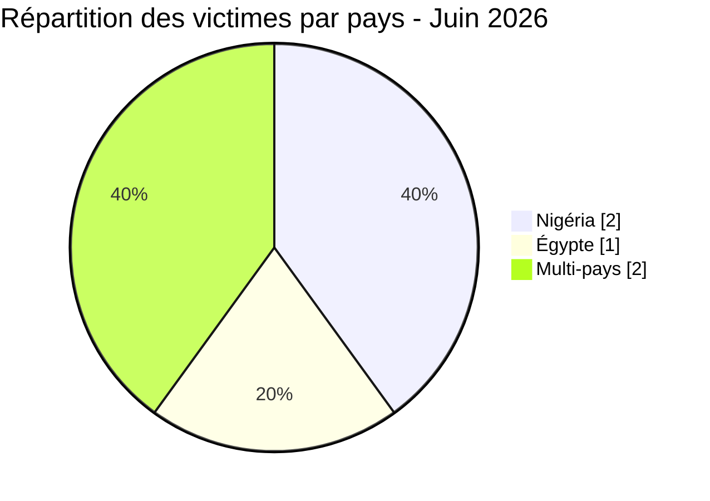
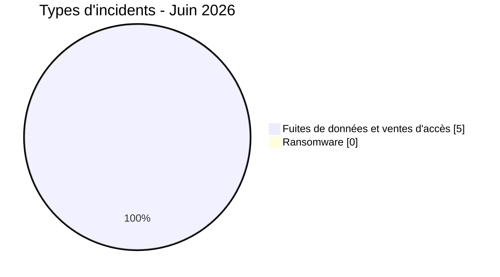
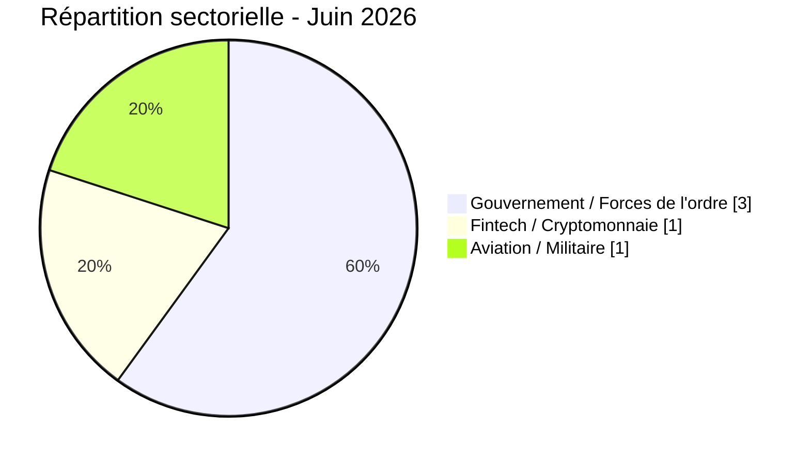

# Rapport CTI - cyberattaques en Afrique (juin 2026)

👉🏾 [**English version available here**](./README.md)

## 1. Synthèse exécutive

Juin 2026 a enregistré **5 incidents cyber revendiqués publiquement** sur le continent, exclusivement sous forme de **fuites de données, ventes de bases de données et ventes d'accès**. Aucun incident ransomware n'a été documenté ce mois-ci. La période se distingue par deux thèmes majeurs : la fuite catastrophique visant la plus grande plateforme crypto-to-Naira du Nigéria (Jeroid.co), et un marché coordonné de vente d'accès aux portails forces de l'ordre et d'adresses e-mail gouvernementales touchant plusieurs pays africains.

Principales conclusions :
- **0 ransomware** et **5 fuites de données / ventes d'accès (100 %)**.
- **2 pays** directement touchés (Égypte, Nigéria) et **2 incidents multi-pays** impactant jusqu'à 11 nations africaines.
- **Jeroid.co (Nigéria) :** l'une des fuites fintech les plus graves jamais recensées sur le continent, avec 312 433 utilisateurs, 759 900 portefeuilles (TVL de 306 millions de dollars), 110 282 BVN, 64 300 NIN et 70 956 photos de vérification faciale biométrique exposées sur un bucket S3 public non authentifié.
- **Ventes d'accès aux portails forces de l'ordre :** deux acteurs distincts ("Convince" et "Governor") ont commercialisé des identifiants gouvernementaux et policiers permettant de soumettre des demandes de divulgation d'urgence (EDR) à Meta, Google, TikTok et X, ciblant au moins 11 pays africains.
- **Égypte :** données personnelles de pilotes militaires et civils (Egypt Air, Qatar Airways, Autorité du Canal de Suez, Ministère de l'Aviation Civile) exposées et mises en vente.
- **Nigéria :** deux incidents distincts en un seul mois : la fuite Jeroid.co et la revendication contre le NILDS.

> Toutes les publications issues de forums cybercriminels, de leak sites et de canaux clandestins sont traitées comme des **revendications non vérifiées** sauf corroboration indépendante.

### Liste des victimes

👉🏾 [Voir la liste complète des victimes](./victims_FR.md)

---

## 2. Méthodologie

- **Périmètre** : 54 pays africains.
- **Période** : 1-21 juin 2026 (incidents révélés ou revendiqués durant cette période ; les dates réelles d'attaque peuvent être antérieures).
- **Sources** : Dark web, DLS (sites de fuite), OSINT, canaux Telegram, forums underground.
- **Inclusion** : incidents revendiqués ou attribués publiquement, avec victime, pays et secteur identifiés.
- **Typologie** :
  - *Ransomware* : chiffrement et demande de rançon.
  - *Fuite de données / vente d'accès* : exfiltration sans chiffrement, base de données vendue ou publiée, ou vente d'accès à des systèmes ou identifiants compromis.

---

## 3. Bilan global

| Indicateur | Valeur |
| :--- | :--- |
| Total incidents | 5 |
| Pays directement touchés | 2 (+ multi-pays) |
| Acteurs distincts | 5 |
| Incidents ransomware | 0 (0 %) |
| Fuites de données / ventes d'accès | 5 (100 %) |

**Répartition par pays :**

| Rang | Pays | Incidents | Graphe |
| :---: | :--- | :---: | :--- |
| **1** | 🇳🇬 Nigéria | **2** | ██ |
| **2** | 🇪🇬 Égypte | **1** | █ |
| **-** | 🌍 Multi-pays | **2** | ██ |

**Répartition par type d'incident :**

**Acteurs les plus actifs :**

| Acteur | Incidents | Type |
| :--- | :---: | :--- |
| Convince | 1 | Vente d'accès (identifiants EDR) |
| Governor | 1 | Vente d'accès (comptes LEP) |
| burti | 1 | Data broker |
| 404Crew CT x NullSec Nigeria | 1 | Coalition fuite de données |
| Xyphorix | 1 | Data broker |

---

## 4. Vue d'ensemble pays par pays

> Tous les éléments présentés proviennent d'incidents revendiqués publiquement. Les revendications restent non confirmées sauf preuve indépendante.

### 🇪🇬 Égypte (1 incident)

**Base de données des pilotes égyptiens** : l'acteur Xyphorix a proposé sur le forum [Citizen] une base de données contenant des informations personnelles de pilotes égyptiens civils, militaires et commerciaux. Les champs incluent noms, numéros de téléphone, profession, ville et statut marital. Du personnel d'Egypt Air, Qatar Airways, Fly Emirates, Petroleum Air Services, l'Autorité du Canal de Suez et le Ministère de l'Aviation Civile est représenté. La présence de pilotes militaires et liés à des entités d'État rend cette base de données particulièrement sensible pour la sécurité nationale. Les risques incluent le phishing ciblé, l'espionnage et l'usurpation d'identité de personnel aéronautique.

### 🇳🇬 Nigéria (2 incidents)

**Jeroid.co** : l'incident le plus grave de juin 2026 et l'une des fuites fintech les plus sévères documentées sur le continent. L'acteur burti a proposé l'ensemble du jeu de données sur le forum [Citizen] pour 2 000 dollars. Les données exposées comprennent 312 433 utilisateurs, 759 900 portefeuilles (TVL de 306 millions de dollars), 110 282 numéros de vérification bancaire (BVN), 64 300 numéros d'identité nationaux (NIN), 70 956 photos de vérification faciale biométrique sur un bucket S3 public non authentifié, 3 872 passeports, 2 106 cartes d'électeur, 1 700 permis de conduire et 65 013 dossiers KYC complets de niveau 3 (BVN + NIN + scan facial + document d'identité). Le BVN et le NIN sont les identifiants bancaires et nationaux primaires du Nigéria ; leur exposition combinée aux données biométriques permet une fraude d'identité complète, des arnaques financières et des escroqueries au crédit à grande échelle.

**NILDS** : le National Institute for Legislative and Democratic Studies a été revendiqué par la coalition 404Crew Cyber Team x NullSec Nigeria. Les échantillons publiés révèlent prétendument des structures de bases de données, des comptes administrateurs, des adresses e-mail et des identifiants liés à des systèmes parlementaires. Cette exposition pourrait permettre un accès non autorisé à des applications internes et faciliter des campagnes de phishing ciblé contre l'écosystème de l'Assemblée nationale nigériane. La revendication n'a pas été vérifiée de manière indépendante.

### 🌍 Multi-pays (2 incidents)

**Convince (vente d'e-mails EDR)** : via le forum Immortal, Convince a vendu de vraies adresses e-mail gouvernementales actives de 8 pays africains (Éthiopie, Tanzanie, Angola, Kenya, Zambie, Nigéria, Égypte, Maroc), combinées à un tutoriel EDR complet permettant d'usurper l'identité des autorités officielles pour extraire des données utilisateurs auprès de Google, Meta et Telegram. Les prix vont de 5 dollars (Tanzanie, 13 000 e-mails) à 70 dollars (Maroc, 2 e-mails). Cette offre ne constitue pas une violation de données passive ; elle compromet activement le vecteur d'authentification de l'identité des forces de l'ordre africaines.

**Governor (vente de comptes LEP)** : via le forum [Citizen], Governor a proposé des comptes portails forces de l'ordre déjà authentifiés sur Meta, TikTok et X pour 9 entités gouvernementales (Égypte, Malawi, Tanzanie, Algérie, Palestine, Kenya, Zambie, Sierra Leone, Yémen). Contrairement au catalogue de Convince (adresses e-mail uniquement), les comptes de Governor permettent une connexion directe aux portails sans rédiger de fausses correspondances, permettant des demandes immédiates de citation à comparaître et des suppressions de contenu. Les prix varient de 60 à 140 dollars par compte. Cela représente une sévérité opérationnelle plus élevée que l'offre Convince.

---

## 5. Analyse détaillée par type d'incident

### 5.1 Ransomware (0 incident)

Aucun incident ransomware documenté en juin 2026.

### 5.2 Fuites de données et ventes d'accès (5 incidents)

| Date | Pays | Organisation / Cible | Acteur | Secteur |
| :--- | :---: | :--- | :--- | :--- |
| 6 juin | 🇪🇬 Égypte | Base de données pilotes égyptiens | Xyphorix | Aviation / Militaire |
| 10 juin | 🇳🇬 Nigéria | Jeroid.co | burti | Fintech / Crypto |
| 13 juin | 🇳🇬 Nigéria | NILDS | 404Crew CT x NullSec Nigeria | Gouvernement / Législatif |
| 17 juin | 🌍 Multi-pays | Institutions gouv. (e-mails EDR) | Convince | Gouvernement / Forces de l'ordre |
| 20 juin | 🌍 Multi-pays | Accès portails forces de l'ordre | Governor | Gouvernement / Forces de l'ordre |

**Observations clés :**
- **Jeroid.co** combine données financières, d'identité et biométriques dans une seule exposition. Les 65 013 utilisateurs avec un KYC complet de niveau 3 constituent le groupe à risque le plus élevé pour la fraude d'identité.
- **Convince et Governor** représentent deux niveaux du même marché criminel : adresses e-mail (coût plus faible, volume plus élevé) et comptes portails authentifiés (coût plus élevé, accès opérationnel direct). Leur apparition simultanée suggère un développement actif du marché autour de l'usurpation des forces de l'ordre comme service criminel.
- **Base de données des pilotes égyptiens** : la présence de personnel militaire et lié au gouvernement crée des risques de sécurité nationale au-delà de la simple exposition de données personnelles.
- **NILDS** : l'implication de hacktivistes liés au Nigéria ciblant un institut de recherche parlementaire reflète une activité cyber domestique continue distincte des groupes ransomwares étrangers.

---

## 6. Impact sectoriel

| Secteur | Incidents | Pourcentage |
| :--- | :---: | :---: |
| Gouvernement / Forces de l'ordre | 3 | 60,0 % |
| Fintech / Cryptomonnaie | 1 | 20,0 % |
| Aviation / Militaire | 1 | 20,0 % |

**Enseignements :**
- Les institutions gouvernementales et forces de l'ordre représentent 60 % des incidents de juin, faisant de ce mois le plus gouvernementalo-centré des archives AFRINTEL 2026.
- La disponibilité simultanée de deux produits d'accès complémentaires ciblant le même écosystème des forces de l'ordre africaines (e-mails EDR + comptes portails LEP) indique une spécialisation du marché autour d'une niche criminelle unique à haute valeur.
- Les incidents fintech et aviation sont moins nombreux mais portent une sensibilité de données disproportionnellement élevée : KYC biométrique à grande échelle (Jeroid.co) et données de personnel militaire (pilotes égyptiens).

---

## 7. Profil des acteurs de menace

| Acteur | Type | Incidents | Cibles principales |
| :--- | :--- | :---: | :--- |
| **Convince** | Vente d'accès (identifiants EDR) | 1 | Institutions gouvernementales africaines (8 pays) |
| **Governor** | Vente d'accès (comptes LEP) | 1 | Institutions gouvernementales africaines (9 pays) |
| **burti** | Data broker | 1 | Fintech nigériane (Jeroid.co) |
| **404Crew CT x NullSec Nigeria** | Fuite de données (coalition) | 1 | Gouvernement nigérian |
| **Xyphorix** | Data broker | 1 | Aviation / militaire égyptien |

**Notes sur les acteurs :**
- **Convince et Governor** pourraient être liés ou opérer dans le même écosystème criminel ; ils vendent des produits complémentaires ciblant le même marché d'usurpation des forces de l'ordre.
- **burti** est un data broker dont l'activité antérieure n'est pas documentée par AFRINTEL ; juin 2026 est sa première apparition.
- **404Crew CT x NullSec Nigeria** : coalition hacktiviste liée au Nigéria ciblant des institutions gouvernementales nationales.
- **Xyphorix** : première apparition AFRINTEL ; spécialisé dans la vente de bases de données.

### 7.1 Niveau de risque

| Pays | Niveau de risque |
| :--- | :--- |
| Nigéria | 🔴 Critique (exposition biométrique + financière + identitaire à grande échelle) |
| Égypte | 🔴 Élevé (personnel aviation militaire + accès portail LEP) |
| Tanzanie | 🟠 Moyen-Élevé (13 000 e-mails gouv. + portail LEP) |
| Kenya, Zambie, Algérie, Malawi, Sierra Leone | 🟠 Moyen (comptes portails LEP vendus) |
| Éthiopie, Angola, Maroc | 🟡 Moyen-Faible (adresses e-mail gouvernementales vendues) |

---

## 8. Tendances clés et lacunes de renseignement

### Tendances

1. **Absence de ransomware en juin** : contraste notable avec mai 2026 (16 incidents ransomware). Juin 2026 est dominé par la monétisation de données et la vente d'accès plutôt que par des attaques par chiffrement.
2. **L'usurpation des forces de l'ordre comme marché criminel consolidé** : l'apparition simultanée de deux acteurs vendant des identifiants gouvernementaux spécifiquement pour abuser des systèmes EDR et LEP confirme la consolidation d'un service criminel spécialisé visant l'infrastructure policière africaine.
3. **La fintech comme point de concentration de données extrême** : la fuite Jeroid.co illustre le risque systémique créé lorsqu'une seule plateforme fintech détient BVN, NIN, scans faciaux biométriques et documents KYC pour des centaines de milliers d'utilisateurs. Le bucket S3 non authentifié est une mauvaise configuration basique aux conséquences catastrophiques.
4. **Nigéria ciblé deux fois en un mois** : NILDS et Jeroid.co font du Nigéria le pays le plus exposé du mois en termes de sensibilité des données et de volume d'incidents.
5. **Exposition multi-pays des forces de l'ordre** : les catalogues Convince et Governor exposent collectivement des institutions gouvernementales et policières d'au moins 11 pays africains, créant une vulnérabilité structurelle pour la gouvernance numérique du continent.

### Lacunes

- Le nombre réel de pays exposés via les catalogues Governor et Convince pourrait être plus élevé ; les listes publiées peuvent ne représenter qu'une offre partielle.
- La véritable identité et les antécédents de burti, Xyphorix, Convince et Governor ne sont pas documentés dans les profils d'acteurs existants d'AFRINTEL.
- Il n'est pas confirmé de manière indépendante si la revendication NILDS a abouti à une extraction réelle de données.
- La mesure dans laquelle les identifiants gouvernementaux vendus (Convince, Governor) ont déjà été utilisés opérationnellement par les acheteurs est inconnue.

---

## 9. Cartographie MITRE ATT&CK (contextuelle)

| Phase | ID Technique | Nom de la technique | Contexte |
| :--- | :---: | :--- | :--- |
| Collecte | T1005 | Data from Local System | Base de données Jeroid.co, NILDS, pilotes égyptiens |
| Exfiltration | T1537 | Transfer Data to Cloud Account | Exposition bucket S3 (données biométriques Jeroid.co) |
| Accès initial | T1078 | Valid Accounts | Identifiants gouvernementaux/policiers vendus par Convince, Governor |
| Développement de ressources | T1586 | Compromise Accounts | Comptes portails forces de l'ordre (Governor) |
| Impact | T1565.001 | Stored Data Manipulation | Potentiel via accès LEP (suppression contenus, suspension comptes) |

---

## 10. Recommandations

### Pour les plateformes fintech

- Auditer immédiatement toutes les politiques de stockage de données ; les buckets S3 contenant des données biométriques ou KYC ne doivent jamais être accessibles publiquement.
- Chiffrer au repos tous les documents KYC, photos de vérification faciale, BVN et NIN.
- Revoir les pratiques de minimisation des données ; les données KYC de niveau 3 ne doivent être conservées que pour la durée minimale requise par la réglementation.
- Mettre en place une surveillance continue des mauvaises configurations cloud (outils CSPM).

### Pour les gouvernements et forces de l'ordre

- Les gouvernements du Nigéria, Égypte, Tanzanie, Kenya, Éthiopie, Angola, Zambie, Maroc, Algérie, Malawi et Sierra Leone doivent auditer immédiatement les inventaires d'adresses e-mail gouvernementales et faire tourner les identifiants de toutes les adresses liées aux forces de l'ordre.
- Signaler à Meta, Google, TikTok et X tout usage suspect des portails officiels des forces de l'ordre ; demander les journaux d'audit pour toutes les demandes EDR et de citation à comparaître soumises via des identifiants gouvernementaux africains depuis janvier 2025.
- Déployer la MFA sur tous les systèmes de messagerie gouvernementaux ; prioriser les comptes associés aux fonctions de maintien de l'ordre et judiciaires.

### Pour les citoyens nigérians concernés

- Les utilisateurs de Jeroid.co doivent surveiller leurs BVN et NIN pour détecter tout compte lié non autorisé ou toute activité inhabituelle.
- Envisager une vérification BVN auprès de leur banque pour détecter toute liaison frauduleuse de compte.

---

## 11. Recommandations SOC tactiques

- **[T1078] Surveillance des identifiants** : croiser les adresses e-mail gouvernementales vendues (Éthiopie, Tanzanie, Angola, Kenya, Zambie, Nigéria, Égypte, Maroc) avec les annuaires IAM internes ; signaler les comptes présents dans les deux.
- **[T1537] Détection d'exposition S3** : scanner tous les buckets de stockage cloud pour détecter les politiques d'accès public sur les actifs contenant des données biométriques ou KYC ; appliquer des listes de contrôle d'accès au niveau bucket via des outils CSPM automatisés.
- **[T1586] Audit des portails forces de l'ordre** : demander les journaux d'audit à Meta, TikTok et X pour toutes les demandes soumises via des identifiants gouvernementaux africains depuis janvier 2025.
- **[Réponse à la fuite fintech]** : les établissements financiers nigérians doivent surveiller les schémas inhabituels d'ouverture de comptes liés au BVN pouvant signaler une exploitation frauduleuse des données Jeroid.co.
- **Détection d'abus EDR** : signaler tout compte e-mail gouvernemental générant un nombre inhabituel de demandes EDR ou de citation à comparaître ; croiser les schémas de demandes avec les lignes de base d'activité institutionnelle normale.

---

## 12. Recommandations stratégiques

- **Cadre réglementaire fintech africain** : la CBN (Banque Centrale du Nigéria) et les régulateurs équivalents doivent imposer que les données biométriques KYC de niveau 3 ne soient jamais stockées sur une infrastructure cloud accessible publiquement ; un cadre d'audit de sécurité dédié au stockage de données fintech doit être établi et appliqué.
- **Surveillance continentale des identifiants forces de l'ordre** : AFRIPOL devrait évaluer la création d'un mécanisme de surveillance des ventes criminelles d'identifiants officiels des États membres sur les marchés souterrains, permettant une notification rapide lorsque l'identité des forces de l'ordre d'un pays africain est compromise.
- **Standards d'hygiène des e-mails gouvernementaux** : les États membres de l'Union africaine devraient adopter des standards contraignants minimaux pour la gestion des comptes e-mail gouvernementaux, incluant la MFA obligatoire, la rotation régulière des identifiants et la gestion centralisée des inventaires pour les adresses liées aux forces de l'ordre.
- **Coordination avec les plateformes** : Meta, Google, TikTok et X devraient établir un canal de notification dédié pour alerter les CERT nationaux africains lorsque les comptes portails forces de l'ordre de leurs pays présentent des schémas d'activité anormaux.
- **Information des citoyens nigérians** : les citoyens exposés via Jeroid.co devraient être informés via des canaux officiels ; la Commission nigériane de protection des données (NDPC) devrait enquêter sur la mauvaise configuration S3 et évaluer la conformité réglementaire.

---

## 13. Conclusion

Juin 2026 enregistre moins d'incidents qu'en mai 2026 en volume absolu, mais l'impact qualitatif est significatif et par endroits exceptionnel. La fuite Jeroid.co figure parmi les expositions fintech les plus graves documentées sur le continent africain, combinant données financières, biométriques et d'identité à grande échelle. L'apparition simultanée de deux offres de vente d'accès EDR et LEP ciblant les forces de l'ordre africaines représente une menace structurelle pour la gouvernance numérique régionale, permettant potentiellement à des tiers d'usurper l'identité de gouvernements africains auprès des grandes plateformes. L'absence d'activité ransomware ce mois-ci peut refléter des patterns saisonniers ou un déplacement temporaire des priorités des acteurs, mais ne doit pas être interprétée comme une réduction globale de l'exposition au risque.

**AFRINTEL** - Cyber Threat Intelligence africaine
[GitHub AFRINTEL](https://github.com/Hatchepsoute/AFRINTEL)
