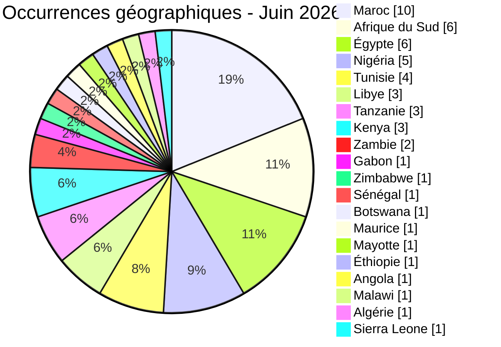
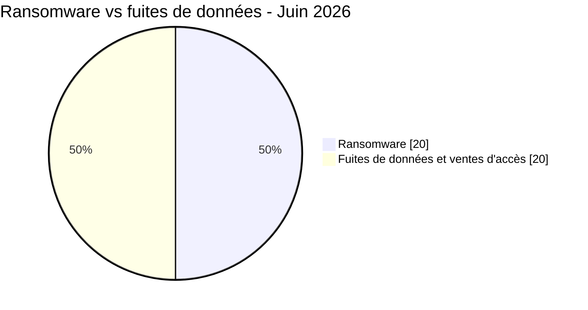
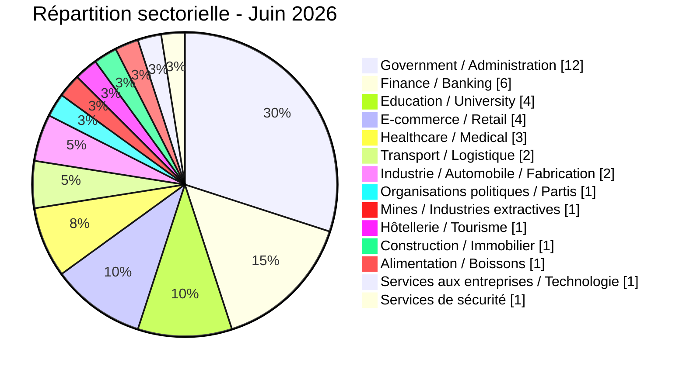
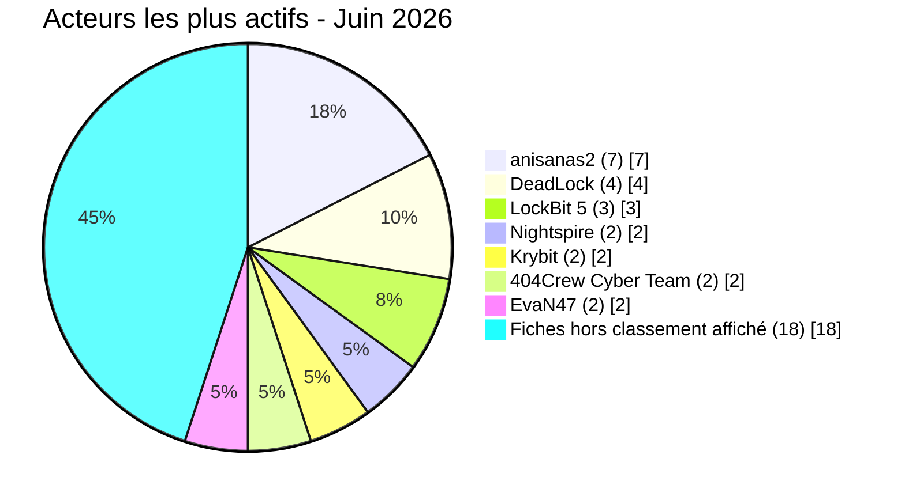

# Rapport CTI - cyberattaques en Afrique (juin 2026)

👉🏾 [**English version available here**](./README.md)

## 1. Synthèse exécutive

Juin 2026 a rapporté **40 incidents cyber signalés ou revendiqués publiquement** sur le continent, **20 publications ou divulgations ransomware (50 %)**, **20 fuites de données ou ventes d'accès (50 %)**. C'est une vraie hausse de la part ransomware par rapport à mai, où elle ne représentait que 28,1 % des 57 incidents du [jeu de données de mai](../05-may/victims_FR.md). Le mois a aussi apporté une revendication d'exposition biométrique fintech à forte sensibilité, des identifiants en clair publiés pour la messagerie d'une armée nationale, et une succession de publications du même cluster contre des organisations marocaines, déjà sur trois mois.

Principales conclusions :
- **20 publications ou divulgations ransomware (50 %)** et **20 fuites de données / ventes d'accès (50 %)**, une répartition équilibrée et une part ransomware supérieure à celle de mai.
- **14 pays** directement touchés, plus **6 pays supplémentaires** exposés uniquement via deux offres multi-pays de vente d'identifiants (Éthiopie, Angola, Zambie, Malawi, Algérie, Sierra Leone), soit **20 pays africains** concernés au total.
- **Le Maroc (9 incidents directs)** est le pays le plus représenté du mois. Sept publications sont attribuées à **anisanas2** dans plusieurs secteurs. Le même cluster apparaît aussi dans les données AFRINTEL d'avril et mai 2026 ; la coordination des événements sous-jacents reste inconnue.
- **Jeroid.co (Nigéria), acteur source burti :** l'acteur revendique un jeu de données couvrant 312 433 utilisateurs, 110 282 BVN, 64 300 NIN et 70 956 photos biométriques, proposé à 2 000 dollars. Les éléments analysés suggèrent que des données KYC étaient accessibles via un bucket S3 sans authentification ; AFRINTEL ne confirme ni le volume complet revendiqué ni le vecteur d'accès initial.
- **Armée nigériane (army.mil.ng) :** les éléments publiés auraient inclus des identifiants de messagerie en clair pour plus de 20 comptes militaires et des identifiants associés à un portail d'imagerie satellite. S'ils étaient valides lors de l'observation, ils présentaient un risque élevé pour la sécurité nationale.
- **BRELA (Tanzanie) :** l'acteur revendique 10,2 millions d'enregistrements couvrant 8 millions de personnes, soit le plus grand volume revendiqué du mois. La portée complète n'a pas été confirmée indépendamment.
- **Deux ministères libyens** ont fait l'objet de publications consécutives attribuées à EvaN47 les 29 et 30 juin. Cette proximité temporelle justifie une surveillance, mais ne suffit pas à établir une campagne coordonnée.

### Liste des victimes

👉🏾 [Voir la liste complète des victimes](./victims_FR.md)

---

## 2. Méthodologie

- **Périmètre** : 54 pays africains.
- **Période** : 1-30 juin 2026 (incidents révélés ou revendiqués durant ce mois ; les dates réelles d'attaque peuvent être antérieures).
- **Sources** : Dark web, DLS (sites de fuite), OSINT, canaux Telegram, forums underground.
- **Inclusion** : incidents identifiés et analysés pour la première fois par AFRINTEL en juin 2026. La date initiale de revendication ou d'attaque peut être antérieure et reste indiquée dans la fiche victime lorsqu'elle est connue.
- **Typologie** :
  - *Ransomware* : revendication ou divulgation attribuée à un groupe ransomware. Le chiffrement n'est pas présumé sans élément probant.
  - *Fuite de données / vente d'accès* : exfiltration sans chiffrement, base de données vendue ou publiée, ou vente d'accès/d'identifiants.

---

## 3. Bilan global

| Indicateur | Valeur |
|---|---|
| Total victimes | 40 incidents uniques |
| Pays touchés | 20 (14 directs + 6 via incidents multi-pays) |
| Occurrences pays | 53 (38 directes + 15 expositions issues de 2 incidents multi-pays) |
| Acteurs distincts | 25 |
| Incidents ransomware | 20 (50,0 %) |
| Fuites de données / ventes d'accès | 20 (50,0 %) |

### Classement par pays

**Classement géographique élargi (53 occurrences pays issues de 40 incidents uniques) :**

| Rang | Pays | Incidents directs | Expositions multi-pays | Total géographique | Graphe |
| :---: | :--- | :---: | :---: | :---: | :--- |
| **1** | 🇲🇦 Maroc | 9 | 1 | **10** | ██████████ |
| **2** | 🇿🇦 Afrique du Sud | 6 | 0 | **6** | ██████ |
| **2** | 🇪🇬 Égypte | 4 | 2 | **6** | ██████ |
| **4** | 🇳🇬 Nigéria | 4 | 1 | **5** | █████ |
| **5** | 🇹🇳 Tunisie | 4 | 0 | **4** | ████ |
| **6** | 🇱🇾 Libye | 3 | 0 | **3** | ███ |
| **6** | 🇹🇿 Tanzanie | 1 | 2 | **3** | ███ |
| **6** | 🇰🇪 Kenya | 1 | 2 | **3** | ███ |
| **9** | 🇿🇲 Zambie | 0 | 2 | **2** | ██ |
| **10** | 🇬🇦 Gabon | 1 | 0 | **1** | █ |
| **10** | 🇿🇼 Zimbabwe | 1 | 0 | **1** | █ |
| **10** | 🇸🇳 Sénégal | 1 | 0 | **1** | █ |
| **10** | 🇧🇼 Botswana | 1 | 0 | **1** | █ |
| **10** | 🇲🇺 Maurice | 1 | 0 | **1** | █ |
| **10** | 🇾🇹 Mayotte | 1 | 0 | **1** | █ |
| **10** | 🇪🇹 Éthiopie | 0 | 1 | **1** | █ |
| **10** | 🇦🇴 Angola | 0 | 1 | **1** | █ |
| **10** | 🇲🇼 Malawi | 0 | 1 | **1** | █ |
| **10** | 🇩🇿 Algérie | 0 | 1 | **1** | █ |
| **10** | 🇸🇱 Sierra Leone | 0 | 1 | **1** | █ |

> Le rapport recense 40 incidents uniques. Le classement géographique totalise 53 occurrences pays, car les offres Convince et Governor sont ventilées dans chaque pays africain explicitement mentionné. Cette ventilation ne modifie pas le total global. La Palestine et le Yémen sont exclus de ce classement, car ils sont hors du périmètre africain.

### Répartition des ransomwares (Total : 20)

| Rang | Pays | Incidents | Graphe |
| :---: | :--- | :---: | :--- |
| **1** | 🇿🇦 Afrique du Sud | **4** | ████ |
| **2** | 🇪🇬 Égypte | **3** | ███ |
| **2** | 🇹🇳 Tunisie | **3** | ███ |
| **4** | 🇲🇦 Maroc | **1** | █ |
| **4** | 🇳🇬 Nigéria | **1** | █ |
| **4** | 🇱🇾 Libye | **1** | █ |
| **4** | 🇬🇦 Gabon | **1** | █ |
| **4** | 🇿🇼 Zimbabwe | **1** | █ |
| **4** | 🇸🇳 Sénégal | **1** | █ |
| **4** | 🇧🇼 Botswana | **1** | █ |
| **4** | 🇲🇺 Maurice | **1** | █ |
| **4** | 🇾🇹 Mayotte | **1** | █ |
| **4** | 🇰🇪 Kenya | **1** | █ |

### Répartition géographique des fuites de données / ventes d'accès

**20 incidents uniques, soit 33 occurrences pays après ventilation des deux offres multi-pays.**

| Rang | Pays | Occurrences | Graphe |
| :---: | :--- | :---: | :--- |
| **1** | 🇲🇦 Maroc | **9** | █████████ |
| **2** | 🇳🇬 Nigéria | **4** | ████ |
| **3** | 🇪🇬 Égypte | **3** | ███ |
| **3** | 🇹🇿 Tanzanie | **3** | ███ |
| **5** | 🇿🇦 Afrique du Sud | **2** | ██ |
| **5** | 🇱🇾 Libye | **2** | ██ |
| **5** | 🇰🇪 Kenya | **2** | ██ |
| **5** | 🇿🇲 Zambie | **2** | ██ |
| **9** | 🇹🇳 Tunisie | **1** | █ |
| **9** | 🇪🇹 Éthiopie | **1** | █ |
| **9** | 🇦🇴 Angola | **1** | █ |
| **9** | 🇲🇼 Malawi | **1** | █ |
| **9** | 🇩🇿 Algérie | **1** | █ |
| **9** | 🇸🇱 Sierra Leone | **1** | █ |

### Comparaison ransomware vs fuites de données par pays

| Pays | Ransomware | Fuites de données | Répartition côte à côte |
| :--- | :---: | :---: | :--- |
| 🇲🇦 Maroc | **1** | **9** | 🟧 🟦🟦🟦🟦🟦🟦🟦🟦🟦 |
| 🇿🇦 Afrique du Sud | **4** | **2** | 🟧🟧🟧🟧 🟦🟦 |
| 🇪🇬 Égypte | **3** | **3** | 🟧🟧🟧 🟦🟦🟦 |
| 🇳🇬 Nigéria | **1** | **4** | 🟧 🟦🟦🟦🟦 |
| 🇹🇳 Tunisie | **3** | **1** | 🟧🟧🟧 🟦 |
| 🇱🇾 Libye | **1** | **2** | 🟧 🟦🟦 |
| 🇹🇿 Tanzanie | **0** | **3** | 🟦🟦🟦 |
| 🇰🇪 Kenya | **1** | **2** | 🟧 🟦🟦 |
| 🇿🇲 Zambie | **0** | **2** | 🟦🟦 |
| 🇬🇦 Gabon | **1** | **0** | 🟧 |
| 🇿🇼 Zimbabwe | **1** | **0** | 🟧 |
| 🇸🇳 Sénégal | **1** | **0** | 🟧 |
| 🇧🇼 Botswana | **1** | **0** | 🟧 |
| 🇲🇺 Maurice | **1** | **0** | 🟧 |
| 🇾🇹 Mayotte | **1** | **0** | 🟧 |
| 🇪🇹 Éthiopie | **0** | **1** | 🟦 |
| 🇦🇴 Angola | **0** | **1** | 🟦 |
| 🇲🇼 Malawi | **0** | **1** | 🟦 |
| 🇩🇿 Algérie | **0** | **1** | 🟦 |
| 🇸🇱 Sierra Leone | **0** | **1** | 🟦 |
| **Occurrences pays (53)** | **20** | **33** | *Légende : 🟧 Ransomware \| 🟦 Fuites de données* |

> Le total analytique reste de 40 incidents uniques, soit 20 ransomwares et 20 fuites de données ou ventes d'accès. Les 33 occurrences pays de la colonne des fuites incluent la ventilation géographique des deux incidents multi-pays.

### Répartition géographique par région

| Région | Occurrences pays | Ransomware | Fuites | Côte à côte |
| :--- | :---: | :---: | :---: | :--- |
| **Afrique du Nord** | **24** (45,3 %) | 8 | 16 | 🟧🟧🟧🟧🟧🟧🟧🟧 🟦🟦🟦🟦🟦🟦🟦🟦🟦🟦🟦🟦🟦🟦🟦🟦 |
| **Afrique australe** | **11** (20,8 %) | 6 | 5 | 🟧🟧🟧🟧🟧🟧 🟦🟦🟦🟦🟦 |
| **Afrique de l'Ouest et centrale** | **9** (17,0 %) | 2 | 7 | 🟧🟧 🟦🟦🟦🟦🟦🟦🟦 |
| **Afrique de l'Est** | **7** (13,2 %) | 1 | 6 | 🟧 🟦🟦🟦🟦🟦🟦 |
| **Océan Indien** | **2** (3,8 %) | 2 | 0 | 🟧🟧 |
| **Total** | **53** | **20** | **33** | |

*Légende : 🟧 Ransomware | 🟦 Fuites de données.
- Afrique du Nord : Maroc, Égypte, Tunisie, Libye, Algérie. 
- Afrique australe : Afrique du Sud, Botswana, Zimbabwe, Zambie, Malawi. 
- Afrique de l'Ouest et centrale : Nigéria, Gabon, Sénégal, Sierra Leone, Angola. 
- Afrique de l'Est : Kenya, Tanzanie, Éthiopie. 
- Océan Indien : Maurice, Mayotte. 
- L'Angola est classé ici en Afrique centrale.*

### Répartition sectorielle

| Secteur d'activité | Incidents | Part (%) | Graphe |
| :--- | :---: | :---: | :--- |
| **Government / Administration** | **12** | 30,0 % | ████████████ |
| **Finance / Banking** | **6** | 15,0 % | ██████ |
| **Education / University** | **4** | 10,0 % | ████ |
| **E-commerce / Retail** | **4** | 10,0 % | ████ |
| **Healthcare / Medical** | **3** | 7,5 % | ███ |
| **Transport / Logistique** | **2** | 5,0 % | ██ |
| **Industrie / Automobile / Fabrication** | **2** | 5,0 % | ██ |
| **Organisations politiques / Partis** | **1** | 2,5 % | █ |
| **Mines / Industries extractives** | **1** | 2,5 % | █ |
| **Hôtellerie / Tourisme** | **1** | 2,5 % | █ |
| **Construction / Immobilier** | **1** | 2,5 % | █ |
| **Alimentation / Boissons** | **1** | 2,5 % | █ |
| **Services aux entreprises / Technologie** | **1** | 2,5 % | █ |
| **Services de sécurité** | **1** | 2,5 % | █ |
| **Total** | **40** | **100 %** | |

### Acteurs de menace les plus actifs

| Acteur / Groupe | Incidents | Activité principale | Graphe |
| :--- | :---: | :--- | :--- |
| **anisanas2** | **7** | Fuites / ventes de données (Maroc, publications observées sur 3 mois) | 🟦🟦🟦🟦🟦🟦🟦 |
| **DeadLock** | **4** | Ransomware (multi-pays : Gabon, Nigéria, Mayotte, Kenya) | 🟧🟧🟧🟧 |
| **LockBit 5** | **3** | Ransomware (Botswana, Afrique du Sud, Maurice) | 🟧🟧🟧 |
| **Nightspire** | **2** | Ransomware (Zimbabwe, Égypte) | 🟧🟧 |
| **Krybit** | **2** | Ransomware / données publiées (Sénégal, Maroc) | 🟧🟧 |
| **404Crew Cyber Team** | **2** | Fuite de données (coalition Nigéria, Maroc) | 🟦🟦 |
| **EvaN47** | **2** | Fuite de données (Libye, deux ministères en deux jours) | 🟦🟦 |

*Légende : 🟧 Ransomware \| 🟦 Fuites de données*

---

### Synthèse géographique

> **Pour le détail de chaque incident, voir la liste complète des victimes :** [`victims_FR.md`](./victims_FR.md)

- **Concentration :** le Maroc (9 incidents directs) et l'Afrique du Sud (6) concentrent 37,5 % des 40 incidents uniques du mois. Le classement géographique élargi atteint 53 occurrences pays lorsque les expositions issues des deux incidents multi-pays sont comptabilisées.
- **Campagne visant le Maroc :** anisanas2 est associé à 7 des 9 incidents directs recensés dans le pays en juin. Les revendications et publications analysées depuis avril montrent un cluster persistant touchant plusieurs secteurs, notamment l'éducation, la logistique, les mines, le e-commerce, les startups et l'automobile.
- **Diffusion du ransomware :** l'Afrique du Sud en compte 4, tandis que l'Égypte et la Tunisie en comptent 3 chacune. DeadLock présente la plus forte dispersion géographique, avec des victimes publiées au Gabon, au Nigéria, à Mayotte et au Kenya.
- **Expositions à fort impact :** les cas les plus sensibles concernent les données fintech et biométriques associées à Jeroid.co, les identifiants de messagerie attribués à l'armée nigériane, les 10,2 millions d'enregistrements revendiqués pour BRELA en Tanzanie et deux publications successives visant des ministères libyens de l'éducation.
- **Risque multi-pays :** deux ventes d'identifiants ou d'accès à des portails gouvernementaux et policiers représentent 15 occurrences réparties dans 11 pays africains. Elles créent un risque d'usurpation d'identité institutionnelle auprès de grandes plateformes.
- **Bilan :** les 40 incidents uniques concernent 20 pays africains, directement ou par exposition multi-pays. Le ransomware et les fuites de données ou ventes d'accès atteignent la parité, avec 20 incidents dans chaque catégorie.

---

## 4. Analyse détaillée par type d'incident

### 4.1 Ransomware (20 incidents)

| Rang | Pays | Attaques | Principaux acteurs |
| :---: | :--- | :---: | :--- |
| **1** | 🇿🇦 Afrique du Sud | **4** | Black X, WorldLeaks, LockBit 5, CMD Organization |
| **2** | 🇪🇬 Égypte | **3** | TheGentlemen, Nightspire, Lamashtu |
| **2** | 🇹🇳 Tunisie | **3** | Aurora, SETTRA, Stormous |
| **4** | 🇲🇦 Maroc | **1** | Krybit |
| **4** | 🇳🇬 Nigéria | **1** | DeadLock |
| **4** | 🇱🇾 Libye | **1** | Qilin |
| **4** | 🇬🇦 Gabon | **1** | DeadLock |
| **4** | 🇿🇼 Zimbabwe | **1** | Nightspire |
| **4** | 🇸🇳 Sénégal | **1** | Krybit |
| **4** | 🇧🇼 Botswana | **1** | LockBit 5 |
| **4** | 🇲🇺 Maurice | **1** | LockBit 5 |
| **4** | 🇾🇹 Mayotte | **1** | DeadLock |
| **4** | 🇰🇪 Kenya | **1** | DeadLock |

**Observations :** la part du ransomware dans les incidents mensuels a doublé par rapport à mai, de 28 % à 50 %. **DeadLock** a été le groupe le plus dispersé géographiquement, quatre pays sur le continent (Gabon, Nigéria, Mayotte, Kenya), avec un schéma constant : revendication, menace de divulgation, et dans le cas de Mayotte, publication effective. **LockBit 5** a publié trois victimes dans trois pays en une seule semaine, le 18 juin, sans qu'aucun échantillon ne soit accessible pour ces trois fiches lors de la collecte AFRINTEL. Les deux exceptions où des données ont réellement été publiées : la **Commune de Ouangani à Mayotte**, où DeadLock a livré 138 Mo de données de paie et d'état civil, et **l'ANC**, où Black X a publié directement 2,3 millions de dossiers d'adhérents.

### 4.2 Fuites de données et ventes d'accès (20 incidents uniques, 33 occurrences pays)

| Rang | Pays | Occurrences | Principaux acteurs |
| :---: | :--- | :---: | :--- |
| **1** | 🇲🇦 Maroc | **9** | anisanas2 (7), 404Crew Cyber Team, Convince |
| **2** | 🇳🇬 Nigéria | **4** | burti, 404Crew CT x NullSec Nigeria, NullSec Nigeria, Convince |
| **3** | 🇪🇬 Égypte | **3** | Xyphorix, Convince, Governor |
| **3** | 🇹🇿 Tanzanie | **3** | hammer, Convince, Governor |
| **5** | 🇿🇦 Afrique du Sud | **2** | mosad, GOD User |
| **5** | 🇱🇾 Libye | **2** | EvaN47 |
| **5** | 🇰🇪 Kenya | **2** | Convince, Governor |
| **5** | 🇿🇲 Zambie | **2** | Convince, Governor |
| **9** | 🇹🇳 Tunisie | **1** | AshleyWood2022 |
| **9** | 🇪🇹 Éthiopie | **1** | Convince |
| **9** | 🇦🇴 Angola | **1** | Convince |
| **9** | 🇲🇼 Malawi | **1** | Governor |
| **9** | 🇩🇿 Algérie | **1** | Governor |
| **9** | 🇸🇱 Sierra Leone | **1** | Governor |

**Observations clés :**
- **anisanas2** représente à lui seul 35 % de toutes les fuites/ventes de données ce mois-ci (7 sur 20), toutes au Maroc. Aucun autre acteur n'approche ce niveau de concentration.
- Les trois fuites nigérianes couvrent trois modèles de menace totalement différents en un mois : une exposition biométrique fintech (Jeroid.co), une fuite parlementaire hacktiviste (NILDS) et un dump d'identifiants militaires en clair (army.mil.ng). Cette diversité, dans un seul pays en quatre semaines, en dit plus sur l'étendue de la surface d'exposition nigériane qu'un incident isolé.
- **EvaN47** est associé à deux publications concernant des ministères libyens de l'éducation les 29 et 30 juin. Cette séquence justifie une surveillance en juillet sans établir une campagne coordonnée.
- Les listings **Convince** et **Governor** exposent ensemble des identifiants gouvernementaux ou policiers correspondant à 15 mentions pays réparties sur 11 pays africains. Aucun des deux incidents n'est une "fuite" au sens classique, ce sont deux produits commerciaux construits spécifiquement pour tromper Meta, Google, TikTok et X afin d'obtenir des données utilisateurs sous de faux prétextes légaux.

---

## 5. Impact sectoriel

| Secteur d'activité | Incidents | Part (%) | Impact visuel |
| :--- | :---: | :---: | :--- |
| **Government / Administration** | **12** | 30,0 % | ████████████ |
| **Finance / Banking** | **6** | 15,0 % | ██████ |
| **Education / University** | **4** | 10,0 % | ████ |
| **E-commerce / Retail** | **4** | 10,0 % | ████ |
| **Healthcare / Medical** | **3** | 7,5 % | ███ |
| **Transport / Logistique** | **2** | 5,0 % | ██ |
| **Industrie / Automobile / Fabrication** | **2** | 5,0 % | ██ |
| **Organisations politiques / Partis** | **1** | 2,5 % | █ |
| **Mines / Industries extractives** | **1** | 2,5 % | █ |
| **Hôtellerie / Tourisme** | **1** | 2,5 % | █ |
| **Construction / Immobilier** | **1** | 2,5 % | █ |
| **Alimentation / Boissons** | **1** | 2,5 % | █ |
| **Services aux entreprises / Technologie** | **1** | 2,5 % | █ |
| **Services de sécurité** | **1** | 2,5 % | █ |
| **Total** | **40** | **100 %** | |

**Observations clés :**
- **Government / Administration reste la première catégorie :** 12 incidents, soit 30,0 %, contre 20 sur 57 en mai (35,1 %).
- **Finance / Banking double :** six incidents contre trois en mai, concernant la fintech, les retraites, la banque centrale et l'assurance mutualiste.
- **Deux incidents de niveau sécurité nationale ce mois-ci :** la fuite de document classifié SANDF et le dump d'identifiants de l'armée nigériane relèvent tous deux de Gouvernement/Défense et impliquent tous deux une exposition directe de personnel militaire et de données opérationnelles, une association inhabituellement grave pour un seul mois.
- **L'éducation et la santé totalisent sept fiches :** quatre dans Education / University et trois dans Healthcare / Medical. Ces seuls volumes mensuels ne suffisent pas à établir une tendance générale.

---

## 6. Profil des acteurs de menace

| Acteur de menace | Type | Incidents | Cibles principales |
| :--- | :--- | :---: | :--- |
| **anisanas2** | Cluster fuite / vente de données | **7** | Organisations marocaines dans l'éducation, la logistique, les mines, le e-commerce, l'automobile (3ᵉ mois consécutif actif) |
| **DeadLock** | Ransomware | **4** | Multi-pays : Gabon, Nigéria, Mayotte, Kenya |
| **LockBit 5** | Ransomware | **3** | Botswana, Afrique du Sud, Maurice (vague de publications en une semaine) |
| **Nightspire** | Ransomware | **2** | Zimbabwe, Égypte |
| **Krybit** | Ransomware / fuite de données | **2** | Sénégal (institution d'audit), Maroc (mutuelle santé) |
| **404Crew Cyber Team** | Fuite de données (coalition et solo) | **2** | Assemblée nigériane (avec NullSec Nigeria), association médicale marocaine |
| **EvaN47** | Fuite de données | **2** | Ministères libyens de l'éducation (2 en 2 jours) |

**Acteurs émergents :**
- **burti** (Jeroid.co, Nigéria) : première apparition AFRINTEL, data broker fintech à forte sévérité.
- **NullSec Nigeria** (fuite d'identifiants de l'armée nigériane) : à motivation politique, première apparition documentée.
- **Convince** et **Governor** : deux acteurs distincts exploitant en parallèle des activités d'usurpation des forces de l'ordre ; potentiellement liés, tous deux apparus pour la première fois dans les archives AFRINTEL entre mai et juin 2026.
- **mosad** (fuite de document classifié SANDF) : apparition unique, source militaire à forte sensibilité.

### 6.1 Niveau de risque

| Pays | Niveau de risque |
|---|---|
| Maroc | 🔴 Critique/Élevé |
| Afrique du Sud | 🔴 Critique/Élevé |
| Nigéria | 🔴 Critique/Élevé (fuite biométrique fintech + exposition d'identifiants militaires le même mois) |
| Égypte | 🟠 Moyen |
| Tunisie | 🟠 Moyen |
| Libye | 🟠 Moyen (à surveiller : deux ministères touchés en deux jours, campagne possible en juillet) |
| Tanzanie | 🟠 Moyen (incident unique, mais 10,2M d'enregistrements constituent une exposition d'échelle nationale) |
| Pays restants | 🟡 Faible-Moyen |

---

## 7. Tendances clés et lacunes de renseignement

### Tendances

1. **Le ransomware regagne du terrain.** La répartition 50/50 dépasse largement les 28,1/71,9 de mai. Un mois ne suffit pas à parler de changement durable, mais la dispersion de DeadLock et LockBit 5 mérite d'être suivie.
2. **Le Maroc reste une cible récurrente.** Des publications attribuées à anisanas2 apparaissent en avril, mai et juin. La continuité est bien réelle ; qu'il s'agisse d'une seule opération coordonnée reste une hypothèse.
3. **Une exposition fintech qui paraît sérieuse.** Les éléments Jeroid.co pointent vers une vraie défaillance de contrôle du stockage cloud impliquant des données KYC. Volume complet et vecteur d'accès initial restent tous les deux non confirmés.
4. **L'hygiène des identifiants militaires pose question.** Les publications Armée nigériane et SANDF montrent des contenus sensibles qui sortent. Comment les compromissions ont eu lieu et où le cycle de vie documentaire a lâché restent inconnus.
5. **L'usurpation des forces de l'ordre passe les frontières.** Les publications Convince et Governor cumulent 15 mentions de pays sur 11 pays africains. Rien ne relie les deux vendeurs entre eux, cela dit.
6. **Deux ministères libyens, coup sur coup.** Même acteur, 29 et 30 juin. À surveiller, pas encore une campagne établie.

### Lacunes de renseignement

- L'opérateur réel derrière les fuites de "plateforme de gestion de startups non identifiée" et "entreprise marocaine de livraison non identifiée" (toutes deux attribuées à anisanas2) n'a pas été établi ; sans plateforme nommée, les personnes concernées ne peuvent pas être notifiées de manière significative.
- Pour les publications Bouri Group, Access Dental, Sheraton Miramar, Great Foods, Central Bank of Libya, KeNHA, monoprix.tn et Fidelity Security Group, aucun échantillon de données n’était accessible pendant la collecte. Les fiches consignent les publications observées et les éléments disponibles à ce moment.
- La raison pour laquelle la publication annoncée des données de Finam Gabon n'était pas accessible reste inconnue.
- La portée réelle des catalogues d'identifiants Convince et Governor pourrait dépasser ce qui a été publiquement listé ; les deux pourraient représenter des inventaires partiels.

---

## 8. Cartographie MITRE ATT&CK (contextuelle)

Les techniques suivantes sont des hypothèses défensives dérivées des éléments exposés. Elles n’établissent pas le chemin d’intrusion, sauf lorsque la source décrit explicitement la méthode de collecte.

| Phase | ID Technique | Nom de la technique | Contexte |
| :--- | :---: | :--- | :--- |
| **Accès initial** | **T1078** | Valid Accounts | Hypothèse défensive pertinente pour les identifiants de portails gouvernementaux et policiers proposés par Convince et Governor ; leur utilisation n’a pas été observée |
| **Accès aux identifiants** | **T1552.001** | Unsecured Credentials: Credentials In Files | Contexte pertinent pour les identifiants en clair signalés dans les éléments UNISA et Armée nigériane |
| **Accès aux identifiants** | **T1555.003** | Credentials from Password Stores: Credentials from Web Browsers | La fiche Armée nigériane indique une collecte depuis les magasins Chrome et Edge |
| **Collecte** | **T1213** | Data from Information Repositories | Contexte possible pour la base NILDS et les documents de la plateforme de startups ; le chemin d’acquisition reste inconnu |
| **Collecte** | **T1530** | Data from Cloud Storage Object | Les éléments Jeroid.co suggèrent un accès à des objets KYC dans un bucket S3 sans authentification ; la portée complète reste non confirmée |
| **Reconnaissance** | **T1593** | Search Open Websites/Domains | Contexte du scraping Avito.ma ; aucune preuve d’accès aux systèmes internes |

> Techniques transverses communes :
> - **T1078** - Valid Accounts (vol d'identifiants, ventes d'accès portails, accès portail d'imagerie satellite)
> - **T1530** - Data from Cloud Storage Object (hypothèse défensive liée à des objets cloud exposés)
> - **T1552 / T1555** - Identifiants non sécurisés ou stockés dans le navigateur (systèmes gouvernementaux et universitaires)

---

## 9. Recommandations

- **Plateformes fintech et crypto :** auditer dès aujourd'hui chaque bucket de stockage cloud contenant des données KYC ou biométriques, pas après le prochain incident. L'exposition signalée de Jeroid.co constitue un scénario de défaillance de contrôle que chaque fintech africaine devrait tester sur elle-même immédiatement.
- **Gouvernements et ministères de la Défense :** faire tourner tous les identifiants liés aux domaines .gov, .mil et .ac par politique permanente, pas de manière réactive. La fuite de messagerie de l'armée nigériane, avec un accès au portail d'imagerie satellite, aurait dû déclencher une rotation d'urgence le jour de sa découverte.
- **Équipes trust & safety des plateformes (Meta, Google, TikTok, X) :** traiter les listings Convince et Governor comme une campagne d'abus active contre votre propre processus EDR/citation à comparaître, pas seulement comme un problème de CERT africain. La vérification hors bande pour les demandes de données des forces de l'ordre est en retard.
- **Organisations marocaines tous secteurs confondus :** AFRINTEL a recensé au moins dix revendications ou publications analysées attribuées à anisanas2 sur trois mois. Une alerte sectorielle et un processus coordonné de notification sont justifiés.
- **Plateformes éducatives :** durcir les déploiements CMS et WordPress (le dump de 717 Mo d'Examens.tn est un schéma de défaillance familier) ; imposer l'invalidation des sessions et la rotation des identifiants après toute suspicion de compromission.
- **Organisations ciblées par ransomware en général :** partir du principe d'une double extorsion par défaut. Krybit et DeadLock ont tous deux mis leur menace à exécution dans ce jeu de données après l'expiration de leurs délais.

---

## 10. Recommandations SOC tactiques

- **[T1530] Exposition de stockage cloud :** scanner en continu les buckets S3/Blob publics liés aux domaines organisationnels, en priorité sur les pipelines fintech et KYC ; cette catégorie de contrôle est pertinente pour l’exposition signalée à forte sensibilité.
- **[T1552 / T1555] Hygiène des identifiants :** surveiller les logs infostealers et les dumps d'identifiants navigateur pour les entrées liées aux domaines .gov, .mil et .ac ; la fuite de l'armée nigériane a été extraite directement des gestionnaires d'identifiants Chrome/Edge.
- **[T1078] Abus d'accès portail :** toute organisation disposant de l'autorité légale pour soumettre des demandes EDR ou de citation à comparaître aux grandes plateformes devrait exiger une vérification hors bande pour chaque demande, sans se fier uniquement au domaine e-mail du demandeur.
- **[T1486] Suivi des ransomwares :** surveiller les leak sites de DeadLock, LockBit 5, Krybit, Nightspire et Qilin pour détecter précocement de nouvelles cibles africaines ; déployer des fichiers honeytoken sur les partages dans les secteurs à haut risque (gouvernement, finance).
- **[Suivi d'acteur] :** maintenir une veille dédiée sur anisanas2 car des publications liées au Maroc apparaissent pendant trois mois consécutifs ; comparer les prochaines publications selon le compte source, le prix annoncé et la structure des échantillons.

---

## 11. Recommandations stratégiques

- **Réponse spécifique au Maroc :** compte tenu de trois mois consécutifs d'activité d'un seul cluster d'acteur dans des secteurs sans lien entre eux, les autorités marocaines de cybersécurité nationale (DGSSI) devraient envisager un effort coordonné de notification et de retrait plutôt que de traiter chaque incident isolément.
- **Standards continentaux de stockage des données fintech :** les régulateurs financiers africains (à commencer par le modèle CBN déjà recommandé en mai) devraient imposer que les données biométriques KYC ne soient jamais stockées sur une infrastructure cloud accessible publiquement, avec des exigences d'audit contraignantes, pas de simples recommandations.
- **Surveillance transversale des identifiants forces de l'ordre :** Meta, Google, TikTok et X devraient construire un canal de notification partagé avec les CERT nationaux africains et AFRIPOL pour toute activité anormale des portails forces de l'ordre ; le modèle Convince/Governor continuera de se reproduire tant que les plateformes ne combleront pas la faille de vérification.
- **Politique d'identifiants militaires et de défense :** les ministères de la Défense africains devraient adopter des standards minimaux contraignants pour la gestion du cycle de vie des comptes personnels et des documents ; les deux incidents de sécurité nationale de ce mois (SANDF, armée nigériane) remontent tous deux à d'anciens éléments jamais correctement retirés ou sécurisés.
- **Priorité de surveillance sur la Libye :** compte tenu des incidents ministériels consécutifs en fin de mois, AFRINTEL classera les infrastructures éducatives gouvernementales libyennes en priorité de veille renforcée pour juillet.

---

## 12. Conclusion

Juin se solde par 40 incidents, contre 57 dans le [jeu de données de mai](../05-may/victims_FR.md), une baisse de 17 fiches, 29,8 %. Les publications ransomware passent de 16 à 20, tandis que les fuites de données et ventes d'accès chutent nettement, de 41 à 20. Le Maroc compte 9 des 38 incidents directs, avec deux fiches multi-pays en plus. Les publications d'anisanas2 se poursuivent, déjà un troisième mois d'affilée. La publication Jeroid.co et celle sur les identifiants de l'armée nigériane restent les cas les plus sensibles du mois.

**AFRINTEL** - Cyber Threat Intelligence africaine
🔗 [Dépôt GitHub AFRINTEL](https://github.com/Hatchepsoute/AFRINTEL)
