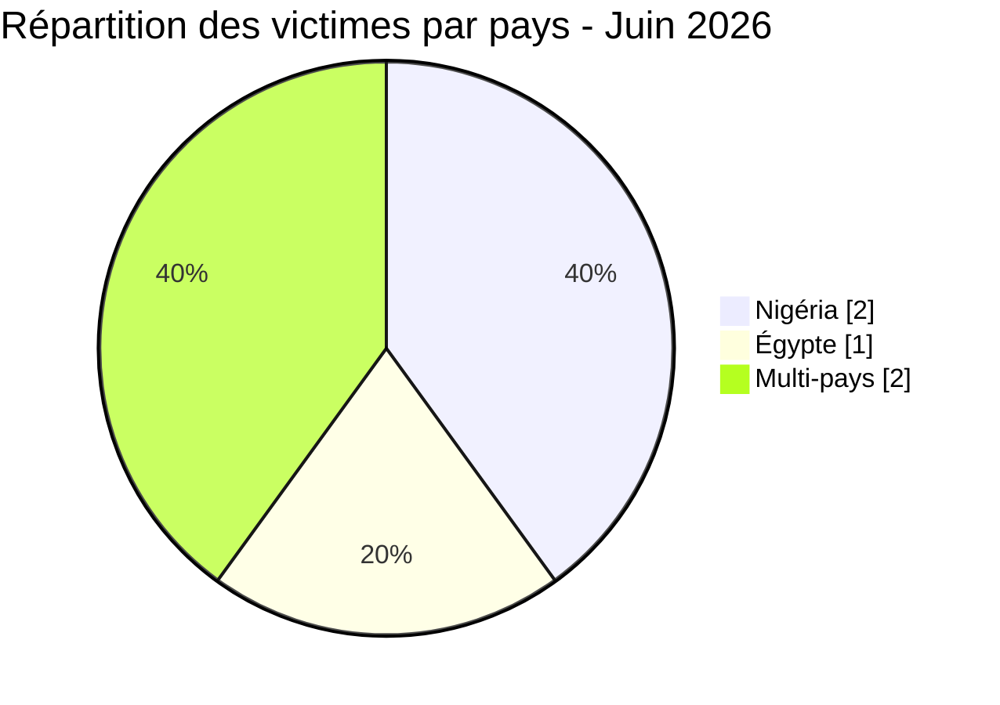
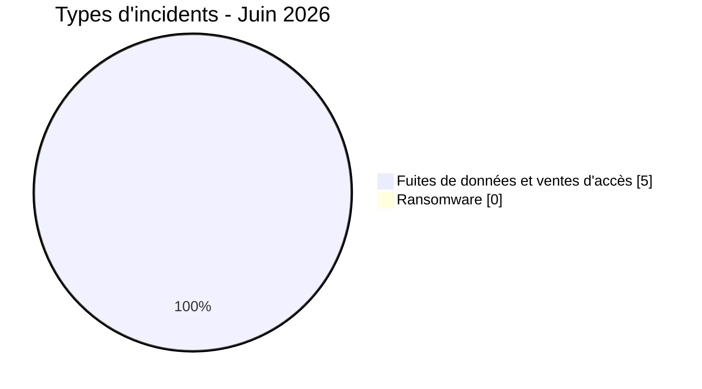
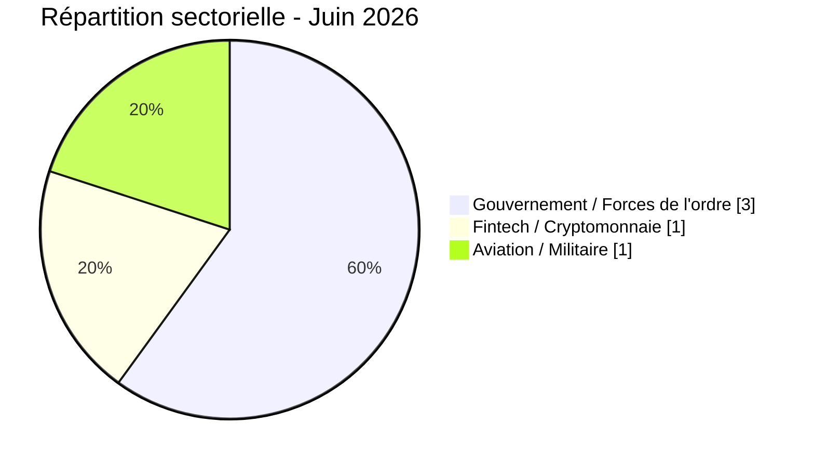

# Rapport CTI - menaces cyber en Afrique (Juin 2026)

👉🏾 [**English version available here**](./README.md)

## 1. Synthèse exécutive

Juin 2026 a enregistré **5 incidents cyber revendiqués publiquement** sur le continent, exclusivement sous forme de **fuites de données, ventes de bases de données et ventes d'accès**. Aucun incident ransomware n'a été documenté ce mois-ci. La période se distingue par deux thèmes majeurs : la fuite catastrophique visant la plus grande plateforme crypto-to-Naira du Nigéria (Jeroid.co), et un marché coordonné de vente d'accès aux portails forces de l'ordre et d'adresses e-mail gouvernementales touchant plusieurs pays africains.

Principales conclusions :
- **0 ransomware** et **5 fuites de données / ventes d'accès (100 %)**.
- **2 pays** directement touchés (Égypte, Nigéria) et **2 incidents multi-pays** impactant jusqu'à 11 nations africaines.
- **Jeroid.co (Nigéria) :** l'une des fuites fintech les plus graves jamais recensées sur le continent, avec 312 433 utilisateurs, 759 900 portefeuilles (TVL de 306 millions de dollars), 110 282 BVN, 64 300 NIN et 70 956 photos de vérification faciale biométrique exposées sur un bucket S3 public non authentifié.
- **Ventes d'accès aux portails forces de l'ordre :** deux acteurs distincts ("Convince" et "Governor") ont commercialisé des identifiants gouvernementaux et policiers permettant de soumettre des demandes de divulgation d'urgence (EDR) à Meta, Google, TikTok et X, ciblant au moins 11 pays africains.
- **Égypte :** données personnelles de pilotes militaires et civils (Egypt Air, Qatar Airways, Autorité du Canal de Suez, Ministère de l'Aviation Civile) exposées et mises en vente.
- **Nigéria :** deux incidents distincts en un seul mois, Jeroid.co et la revendication contre le NILDS.

> Toutes les publications issues de forums cybercriminels, de leak sites et de canaux clandestins sont traitées comme des **revendications non vérifiées** sauf corroboration indépendante.

### Liste des victimes

👉🏾 [Voir la liste complète des victimes](./victims_FR.md)

---

## 2. Méthodologie

- **Périmètre** : 54 pays africains.
- **Période** : 1-21 juin 2026 (incidents révélés ou revendiqués durant cette période ; les dates réelles d'attaque peuvent être antérieures).
- **Sources** : Dark web, DLS (sites de fuite), OSINT, canaux Telegram, forums underground.
- **Inclusion** : incidents revendiqués ou attribués publiquement, avec victime, pays et secteur identifiés.
- **Typologie** :
  - *Ransomware* : chiffrement et demande de rançon.
  - *Fuite de données / vente d'accès* : exfiltration sans chiffrement, base de données vendue ou publiée, ou vente d'accès à des systèmes ou identifiants compromis.

> Toutes les publications issues de forums cybercriminels, de leak sites et de canaux clandestins sont traitées comme des **revendications non vérifiées** sauf corroboration indépendante.

---

## 3. Bilan global

| Indicateur | Valeur |
|---|---|
| Total incidents | 5 |
| Pays directement touchés | 2 (+ multi-pays) |
| Acteurs distincts | 5 |
| Incidents ransomware | 0 (0 %) |
| Fuites de données / ventes d'accès | 5 (100 %) |

### Répartition par pays

| Rang | Pays | Incidents | Graphe |
| :---: | :--- | :---: | :--- |
| **1** | 🇳🇬 Nigéria | **2** | ██ |
| **2** | 🇪🇬 Égypte | **1** | █ |
| **-** | 🌍 Multi-pays | **2** | ██ |

### Répartition par type d'incident

### Répartition sectorielle

| Secteur | Incidents | Part (%) | Graphe |
| :--- | :---: | :---: | :--- |
| **Gouvernement / Forces de l'ordre** | **3** | 60 % | ███ |
| **Fintech / Cryptomonnaie** | **1** | 20 % | █ |
| **Aviation / Militaire** | **1** | 20 % | █ |
| **Total** | **5** | **100 %** | |

---

## 4. Analyse détaillée par type d'incident

### 4.1 Ransomware (0 incident)

Aucun incident ransomware documenté en juin 2026.

### 4.2 Fuites de données et ventes d'accès (5 incidents)

| Date | Pays | Organisation / Cible | Acteur | Secteur |
| :--- | :---: | :--- | :--- | :--- |
| 6 juin | 🇪🇬 Égypte | Base de données pilotes égyptiens | Xyphorix | Aviation / Militaire |
| 10 juin | 🇳🇬 Nigéria | Jeroid.co | burti | Fintech / Crypto |
| 13 juin | 🇳🇬 Nigéria | NILDS | 404Crew CT x NullSec Nigeria | Gouvernement / Législatif |
| 17 juin | 🌍 Multi-pays | Institutions gouv. (e-mails EDR) | Convince | Gouvernement / Forces de l'ordre |
| 20 juin | 🌍 Multi-pays | Accès portails forces de l'ordre | Governor | Gouvernement / Forces de l'ordre |

**Observations clés :**
- **Jeroid.co** représente l'incident le plus grave : 312 433 utilisateurs, 759 900 portefeuilles avec une TVL combinée de 306 millions de dollars, 110 282 numéros de vérification bancaire (BVN), 64 300 numéros d'identité nationaux (NIN) et 70 956 photos de vérification faciale biométrique sur un bucket S3 public non protégé. 65 013 utilisateurs disposaient d'un KYC complet de niveau 3 (BVN + NIN + scan facial + document d'identité). Prix demandé : 2 000 dollars.
- **Convince** (forum Immortal) a vendu des adresses e-mail gouvernementales actives de 8 pays africains, combinées à un tutoriel EDR complet, permettant l'usurpation des autorités officielles pour extraire des données utilisateurs auprès de Google, Meta et Telegram.
- **Governor** (forum [Citizen]) est allé plus loin en vendant des comptes portails forces de l'ordre déjà authentifiés sur Meta, TikTok et X, permettant des demandes directes sans rédiger de fausses correspondances.
- **NILDS Nigéria :** le National Institute for Legislative and Democratic Studies a été ciblé par la coalition 404Crew Cyber Team x NullSec Nigeria, avec des structures de bases de données et des identifiants administrateurs prétendument exposés.
- **Base de données des pilotes égyptiens :** expose du personnel militaire et civil (Egypt Air, Qatar Airways, Petroleum Air Services, Autorité du Canal de Suez, Ministère de l'Aviation Civile).

**Note sur la date de l'entrée "Governor" :** la version française indique le 13 juin, la version anglaise le 20 juin. Un contrôle de la source originale est recommandé pour trancher.

---

## 5. Profil des acteurs de menace

| Acteur | Type | Incidents | Cibles principales |
| :--- | :--- | :---: | :--- |
| **Convince** | Vente d'accès (identifiants EDR) | **1** | Institutions gouvernementales africaines (8 pays) |
| **Governor** | Vente d'accès (comptes LEP) | **1** | Institutions gouvernementales africaines (9 pays) |
| **burti** | Data broker | **1** | Fintech nigériane (Jeroid.co) |
| **404Crew CT x NullSec Nigeria** | Fuite de données (coalition) | **1** | Gouvernement nigérian |
| **Xyphorix** | Data broker | **1** | Aviation / militaire égyptien |

### Évaluation des risques

| Pays | Niveau de risque |
|---|---|
| Nigéria | 🔴 Critique |
| Égypte | 🟠 Élevé |
| Éthiopie, Tanzanie, Kenya, Angola, Zambie, Maroc, Algérie | 🟠 Moyen-Élevé (exposition accès EDR) |

---

## 6. Tendances clés

- **Absence de ransomware ce mois-ci :** contraste notable avec mai 2026 (16 incidents ransomware). La tendance de juin 2026 est dominée par la vente de données et la monétisation d'accès.
- **L'usurpation des forces de l'ordre comme marché émergent :** l'apparition simultanée de deux acteurs vendant des identifiants gouvernementaux spécifiquement pour abuser des systèmes EDR/LEP confirme la consolidation d'un service criminel spécialisé visant l'infrastructure policière africaine.
- **La fintech comme cible à haute valeur :** la fuite Jeroid.co illustre la concentration extrême de données financières et biométriques dans les plateformes fintech africaines. Le BVN et le NIN sont les clés d'identité maîtresses du système bancaire nigérian ; leur exposition combinée aux données biométriques permet une fraude d'identité complète.
- **Nigéria ciblé deux fois :** la revendication NILDS et la fuite Jeroid.co font du Nigéria le pays le plus exposé du mois en termes de sensibilité des données.
- **Exposition multi-pays des forces de l'ordre :** les ventes d'accès EDR et LEP exposent collectivement des institutions gouvernementales et policières d'au moins 11 pays africains, créant une vulnérabilité structurelle pour la gouvernance numérique du continent.

---

## 7. Mapping MITRE ATT&CK (contextuel)

| Phase | ID Technique | Nom de la technique | Contexte |
| :--- | :---: | :--- | :--- |
| **Collection** | **T1005** | Data from Local System | Base de données Jeroid.co, NILDS, pilotes égyptiens |
| **Exfiltration** | **T1537** | Transfer Data to Cloud Account | Exposition bucket S3 (données biométriques Jeroid.co) |
| **Accès initial** | **T1078** | Valid Accounts | Identifiants gouvernementaux/policiers vendus par Convince, Governor |
| **Développement de ressources** | **T1586** | Compromise Accounts | Comptes portails forces de l'ordre (Governor) |
| **Impact** | **T1565.001** | Stored Data Manipulation | Potentiel via accès LEP (suppression contenus, suspension comptes) |

---

## 8. Recommandations

- **Plateformes fintech :** auditer toutes les politiques de stockage de données ; les buckets S3 contenant des données biométriques ne doivent jamais être accessibles publiquement ; chiffrer au repos tous les documents KYC et photos de vérification faciale ; revoir les pratiques de minimisation des données.
- **Gouvernements (Nigéria, Égypte, Tanzanie, Kenya, Éthiopie, Angola, Zambie, Maroc, Algérie) :** auditer immédiatement les inventaires d'adresses e-mail gouvernementales ; faire tourner les identifiants de toutes les adresses liées aux forces de l'ordre ; signaler aux plateformes sociales toute suspicion d'utilisation abusive des portails officiels ; déployer la MFA sur tous les systèmes de messagerie gouvernementaux.
- **Forces de l'ordre :** contacter Meta, Google, TikTok et X pour vérifier la légitimité des demandes d'urgence soumises via des comptes gouvernementaux africains au cours des derniers mois.
- **Utilisateurs fintech (Nigéria) :** les citoyens utilisant Jeroid.co doivent surveiller leurs BVN et NIN pour détecter tout compte lié non autorisé ; envisager une vérification BVN auprès de leur banque.
- **Équipes SOC :** croiser les indicateurs d'exposition issus des catalogues Convince et Governor avec les annuaires internes gouvernementaux ; signaler tout compte présent dans les deux.

---

## 9. Recommandations SOC tactiques

- **[T1078] Surveillance des identifiants :** croiser les adresses e-mail gouvernementales vendues (Éthiopie, Tanzanie, Angola, Kenya, Zambie, Nigéria, Égypte, Maroc) avec les annuaires IAM internes ; signaler les comptes présents dans les deux.
- **[T1537] Détection d'exposition S3 :** scanner tous les buckets de stockage cloud pour détecter les politiques d'accès public sur les actifs contenant des données biométriques ou KYC ; appliquer des listes de contrôle d'accès au niveau bucket.
- **[T1586] Audit des portails forces de l'ordre :** demander les journaux d'audit à Meta, TikTok et X pour toutes les demandes soumises via des identifiants gouvernementaux africains depuis janvier 2026.
- **[Réponse à la fuite fintech] :** les établissements financiers nigérians doivent surveiller les schémas inhabituels d'ouverture de comptes liés au BVN pouvant signaler une utilisation frauduleuse des données Jeroid.co.

---

## 10. Conclusion

Juin 2026 enregistre moins d'incidents qu'en mai 2026 en volume absolu, mais l'impact qualitatif reste significatif. La fuite Jeroid.co figure parmi les expositions fintech les plus graves documentées sur le continent africain, combinant données financières, biométriques et d'identité à grande échelle. L'apparition simultanée de deux offres de vente d'accès EDR et LEP ciblant les forces de l'ordre africaines représente une menace structurelle pour la gouvernance numérique régionale. L'absence d'activité ransomware peut refléter des patterns saisonniers ou un déplacement temporaire des priorités des acteurs, mais ne doit pas être interprétée comme une réduction globale du risque.

**AFRINTEL** – African Cyber Threat Intelligence
🔗 [GitHub AFRINTEL Repository](https://github.com/Hatchepsoute/AFRINTEL)
