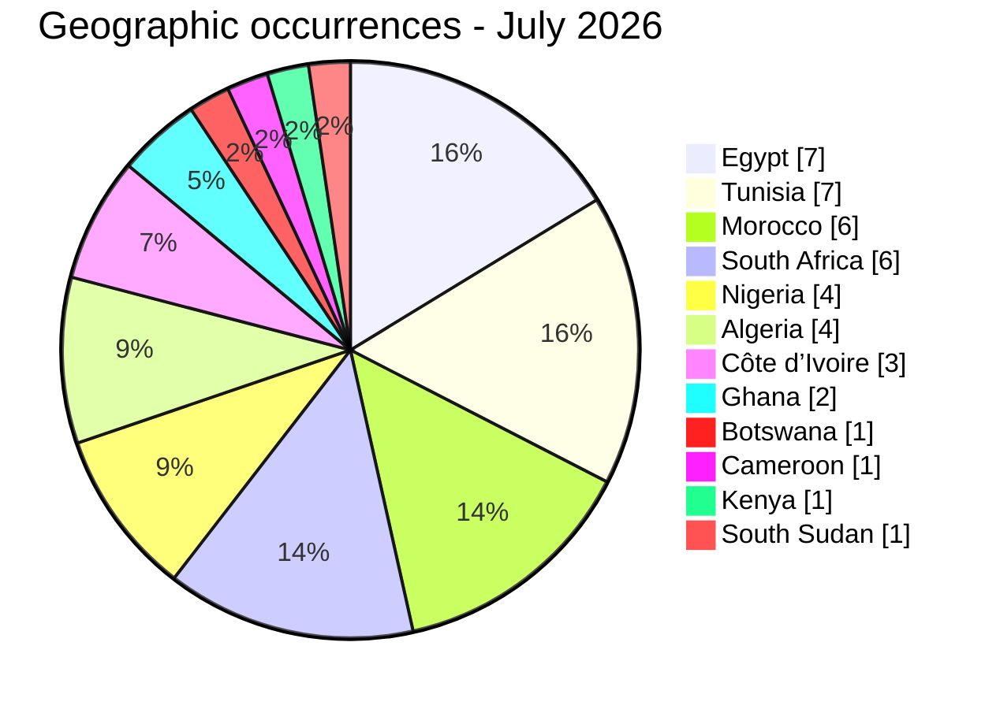
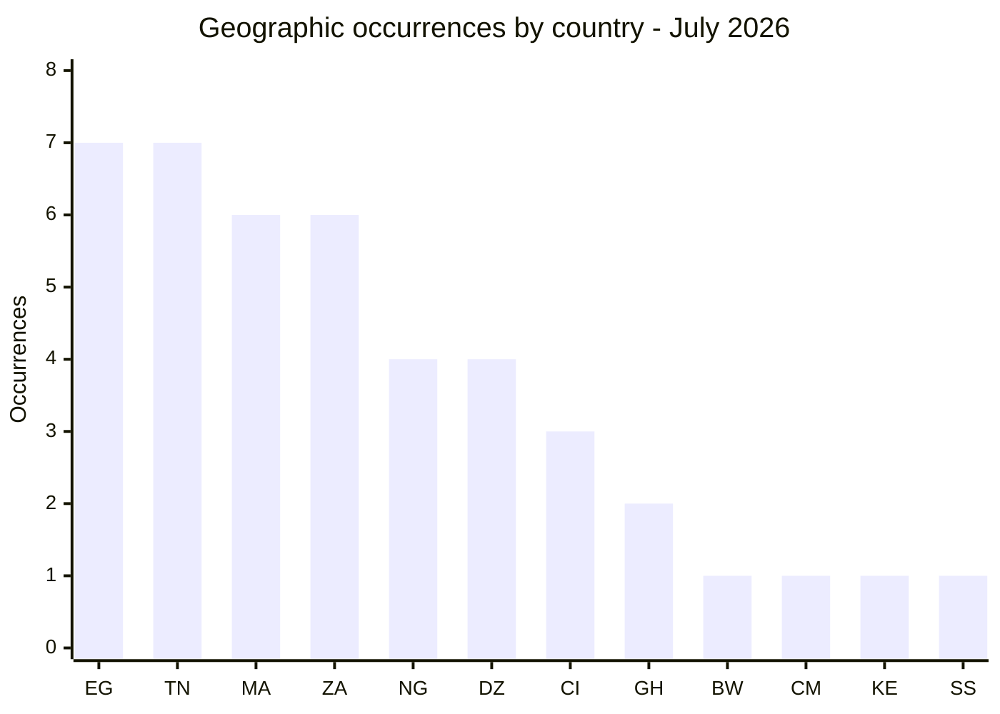
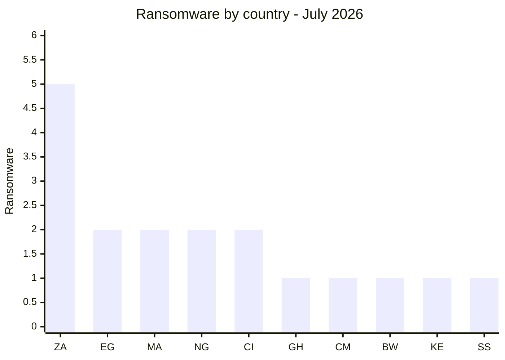
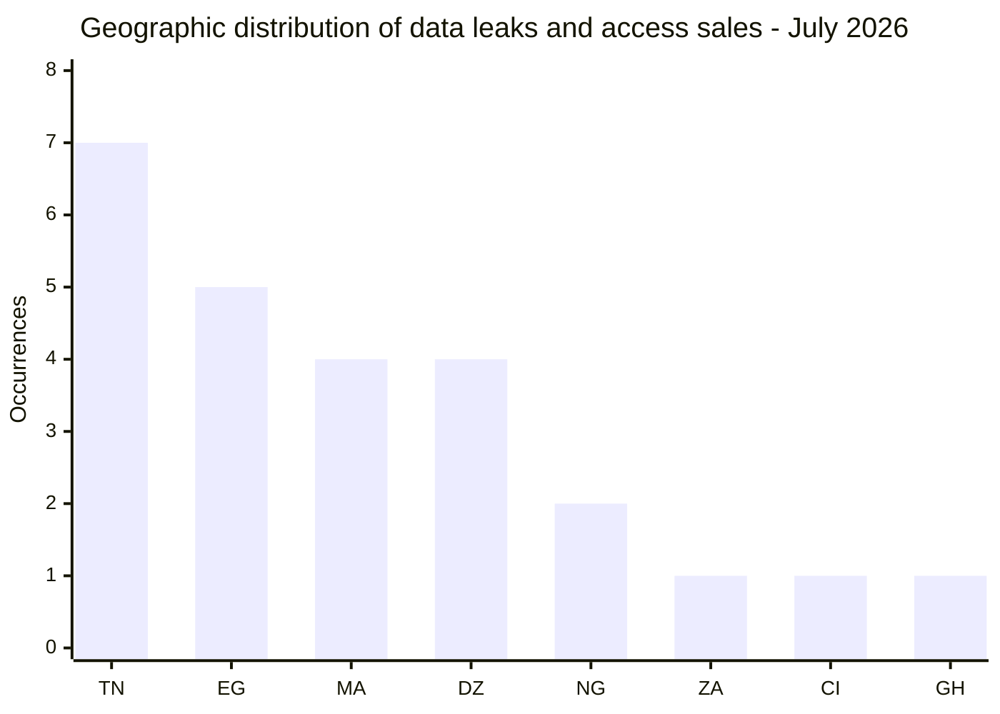
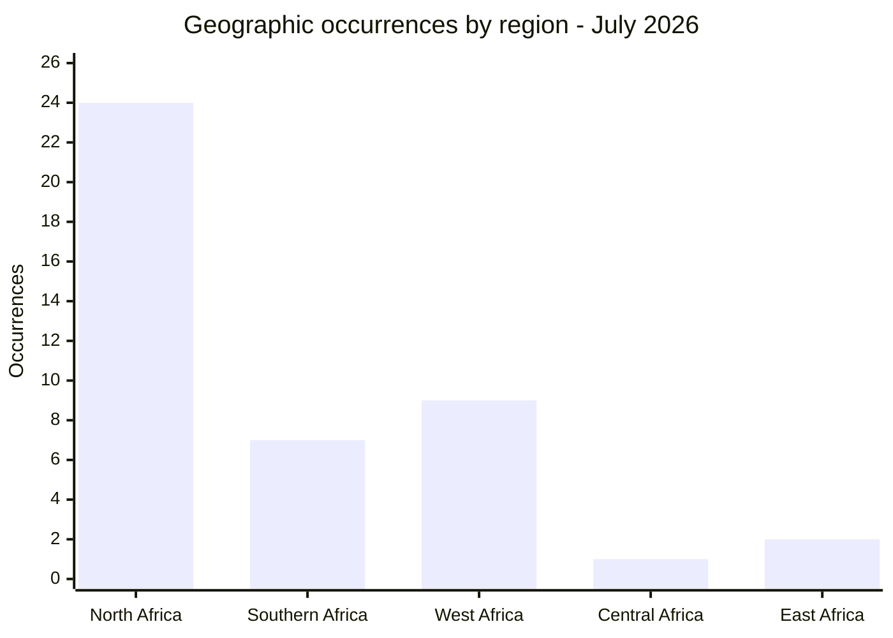
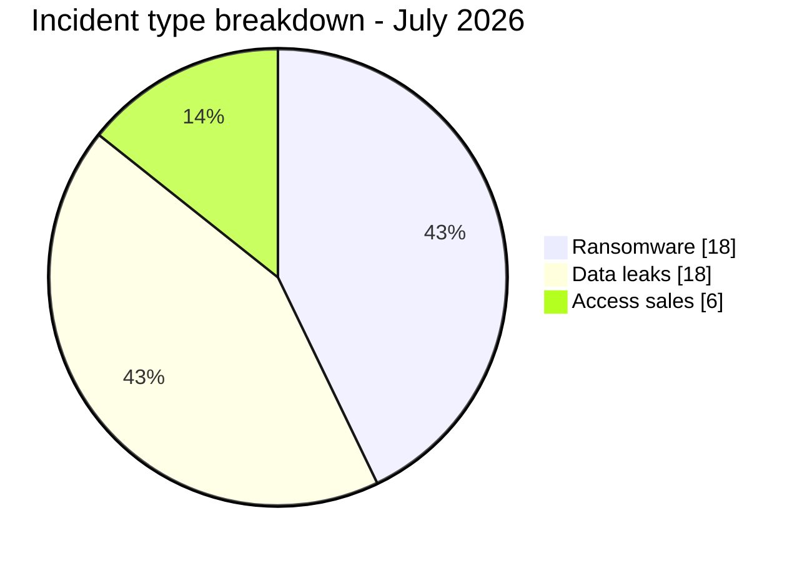
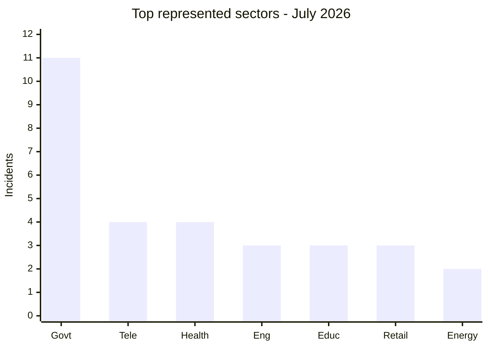
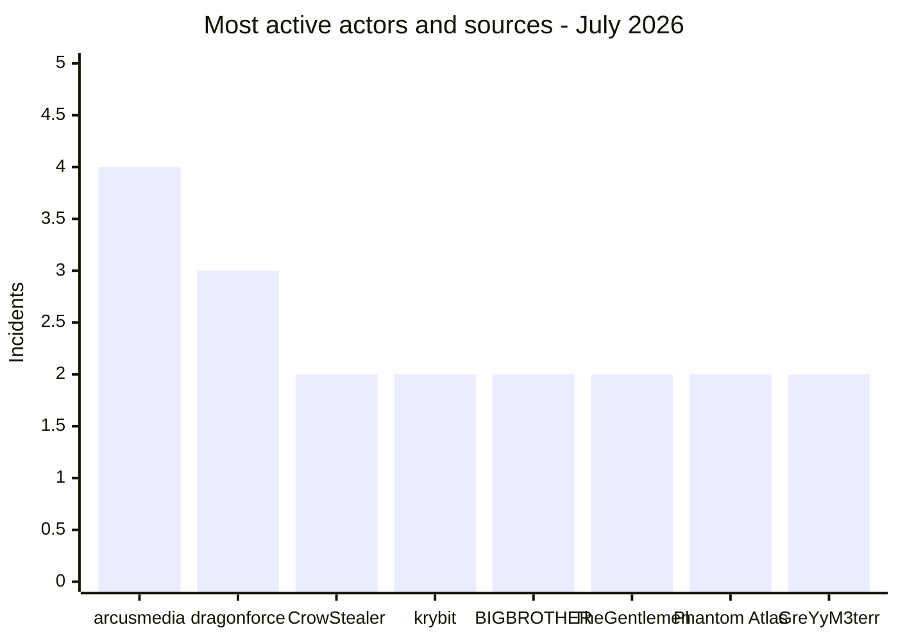

# AFRINTEL - Monthly CTI report
## Cyberattacks in Africa - July 2026

👉🏾 [French version](./README_FR.md) · [Documented victims and incidents](./victims.md)

## 1. Executive summary

AFRINTEL documented **42 Africa-related incidents** in July 2026, involving **12 countries**:

- **18 ransomware claims**;
- **18 data leaks**;
- **6 access-sale offers**;
- **0 defacements**.

Egypt and Tunisia led the geographic count with seven occurrences each, followed by Morocco and South Africa with six. Government and administration accounted for 11 documented incidents, the largest sector group. No single actor dominated: arcusmedia led with four ransomware listings and dragonforce followed with three.

Evidence strength varied materially: **21 observations were unverified claims**, **20 included a published sample**, and **1 incident was classified as `Data Fully Published`, denoting a complete-publication claim rather than verified exhaustiveness**. Nine incidents reached Impact Level 4. The most substantiated high-impact cases included Nerasolgh, Tayara.tn and Distamed, where AFRINTEL reviewed structured material; the advertised full volumes and intrusion paths were not necessarily established.

The main defensive priorities are privileged and webmail account protection, monitoring of bulk database exports, and rapid handling of identity, health, education and government data exposure. Detailed victim and incident data are available in [`victims.md`](./victims.md).

## 2. Scope and methodology

All figures in this English version derive from [`victims.md`](./victims.md), the source of truth for the English report. The French version applies the same method using [`victims_FR.md`](./victims_FR.md).

- **Geographic scope:** Africa's 54 countries; only victims, operations or affected datasets with an explicit African link are included.
- **Collection period:** 1 to 31 July 2026, based on the AFRINTEL detection date recorded for each incident.
- **Sources:** ransomware leak sites, cybercriminal-forum posts, public OSINT and locally reviewed screenshots or structured samples.
- **Inclusion:** one observation per documented claim or incident; distinct repeated claims remain separate only when the actor, date or evidence differs.
- **Classification:** Ransomware, Data Leak, Access Sale and Defacement remain separate types.

The geographic table contains **43 country occurrences rather than 42 incidents**. One identity-photo observation concerns both Nigeria and Côte d’Ivoire and is therefore counted in both country views. The MTN case is attributed to South Africa with reservation; the national entity is not independently confirmed.

Claimed volumes are not treated as established facts. Download links, credentials, personal data and secrets are not reproduced in this report.

### Evidence profile

| Dimension | Distribution | Total |
| :--- | :--- | ---: |
| Status | 21 Claim - Unverified; 20 Claim - Data Sample Published; 1 Data Fully Published | 42 |
| Confidence | 22 Low; 8 Medium; 9 High; 3 Very High | 42 |
| Impact | 12 Level 2; 21 Level 3; 9 Level 4 | 42 |

## 3. Global overview

| Country | Occurrences | Chart |
| :--- | ---: | :--- |
| 🇪🇬 Egypt | 7 | ███████ |
| 🇹🇳 Tunisia | 7 | ███████ |
| 🇲🇦 Morocco | 6 | ██████ |
| 🇿🇦 South Africa | 6 | ██████ |
| 🇳🇬 Nigeria | 4 | ████ |
| 🇩🇿 Algeria | 4 | ████ |
| 🇨🇮 Côte d’Ivoire | 3 | ███ |
| 🇬🇭 Ghana | 2 | ██ |
| 🇧🇼 Botswana | 1 | █ |
| 🇨🇲 Cameroon | 1 | █ |
| 🇰🇪 Kenya | 1 | █ |
| 🇸🇸 South Sudan | 1 | █ |
| **Total geographic occurrences** | **43** | - |

Legend: EG = Egypt, TN = Tunisia, MA = Morocco, ZA = South Africa, NG = Nigeria, DZ = Algeria, CI = Côte d’Ivoire, GH = Ghana, BW = Botswana, CM = Cameroon, KE = Kenya, SS = South Sudan

### Ransomware versus leaks and access sales by country

| Country | Ransomware | Leaks and access sales | Total | Distribution |
|---|---:|---:|---:|---|
| 🇿🇦 South Africa | 5 | 1 | 6 | 🟧🟧🟧🟧🟧 🟦 |
| 🇪🇬 Egypt | 2 | 5 | 7 | 🟧🟧 🟦🟦🟦🟦🟦 |
| 🇲🇦 Morocco | 2 | 4 | 6 | 🟧🟧 🟦🟦🟦🟦 |
| 🇳🇬 Nigeria | 2 | 2 | 4 | 🟧🟧 🟦🟦 |
| 🇨🇮 Côte d’Ivoire | 2 | 1 | 3 | 🟧🟧 🟦 |
| 🇬🇭 Ghana | 1 | 1 | 2 | 🟧 🟦 |
| 🇨🇲 Cameroon | 1 | 0 | 1 | 🟧 |
| 🇧🇼 Botswana | 1 | 0 | 1 | 🟧 |
| 🇰🇪 Kenya | 1 | 0 | 1 | 🟧 |
| 🇸🇸 South Sudan | 1 | 0 | 1 | 🟧 |
| 🇹🇳 Tunisia | 0 | 7 | 7 | 🟦🟦🟦🟦🟦🟦🟦 |
| 🇩🇿 Algeria | 0 | 4 | 4 | 🟦🟦🟦🟦 |
| **Total** | **18** | **25** | **43** | *🟧 Ransomware \| 🟦 Leaks and access sales* |

The 25 leak and access-sale occurrences include the additional country allocation for the Nigeria and Côte d’Ivoire identity-document observation.

### Ransomware by country

Legend: ZA = South Africa, EG = Egypt, MA = Morocco, NG = Nigeria, CI = Côte d’Ivoire, GH = Ghana, CM = Cameroon, BW = Botswana, KE = Kenya, SS = South Sudan

### Geographic distribution of data leaks and access sales

| Rank | Country | Occurrences | Chart |
|---:|---|---:|---|
| 1 | 🇹🇳 Tunisia | **7** | ███████ |
| 2 | 🇪🇬 Egypt | **5** | █████ |
| 3 | 🇲🇦 Morocco | **4** | ████ |
| 3 | 🇩🇿 Algeria | **4** | ████ |
| 5 | 🇳🇬 Nigeria | **2** | ██ |
| 6 | 🇿🇦 South Africa | **1** | █ |
| 6 | 🇨🇮 Côte d’Ivoire | **1** | █ |
| 6 | 🇬🇭 Ghana | **1** | █ |
| **Total** |  | **25** |  |

Legend: TN = Tunisia, EG = Egypt, MA = Morocco, DZ = Algeria, NG = Nigeria, ZA = South Africa, CI = Côte d’Ivoire, GH = Ghana

### Geographic breakdown by region

| Region | Countries included | Occurrences | Ransomware | Leaks and access sales | Distribution |
|---|---|---:|---:|---:|---|
| **North Africa** | 🇪🇬 Egypt, 🇹🇳 Tunisia, 🇲🇦 Morocco, 🇩🇿 Algeria | **24** | 4 | 20 | 🟧🟧🟧🟧 🟦🟦🟦🟦🟦🟦🟦🟦🟦🟦🟦🟦🟦🟦🟦🟦🟦🟦🟦🟦 |
| **Southern Africa** | 🇿🇦 South Africa, 🇧🇼 Botswana | **7** | 6 | 1 | 🟧🟧🟧🟧🟧🟧 🟦 |
| **West Africa** | 🇳🇬 Nigeria, 🇨🇮 Côte d’Ivoire, 🇬🇭 Ghana | **9** | 5 | 4 | 🟧🟧🟧🟧🟧 🟦🟦🟦🟦 |
| **Central Africa** | 🇨🇲 Cameroon | **1** | 1 | 0 | 🟧 |
| **East Africa** | 🇰🇪 Kenya, 🇸🇸 South Sudan | **2** | 2 | 0 | 🟧🟧 |
| **Total** | **12 countries** | **43** | **18** | **25** | *🟧 Ransomware \| 🟦 Leaks and access sales* |

The Nigeria and Côte d’Ivoire identity-document observation contributes one occurrence to each country. MTN is allocated to South Africa in this working view, although its national entity is not confirmed. These allocations do not change the global total of 42 unique incidents.

## 4. Detailed analysis by incident type

| Type | Incidents | Share |
| :--- | ---: | ---: |
| 🟧 Ransomware | 18 | 42.9% |
| 🟦 Data leak | 18 | 42.9% |
| 🟪 Access sale | 6 | 14.3% |
| **Total** | **42** | **100%** |

### 4.1 Ransomware

| Indicator | Result |
| :--- | :--- |
| Incidents | 18 |
| Leading countries | South Africa 5; Egypt, Morocco, Nigeria and Côte d'Ivoire 2 each |
| Most represented groups | arcusmedia 4; dragonforce 3; krybit 2; TheGentlemen 2 |
| Evidence limit | Most documented incidents are victim listings without independent proof of encryption, exfiltration or disruption |

The ransomware total represents observed victim publications attributed to ransomware groups. The report does not infer encryption or operational impact from a listing alone.

### 4.2 Data leaks and access sales

| Category | Incidents | Geographic occurrences | Main observations |
| :--- | ---: | ---: | :--- |
| Data Leak | 18 | 19 | Identity, medical, education, government and commercial data |
| Access Sale | 6 | 6 | Webmail, Fortinet and administrative-system access offers |
| **Combined** | **24** | **25** | One data-leak incident covers Nigeria and Côte d'Ivoire |

Tunisia led this combined view with seven occurrences, followed by Egypt with five and Morocco and Algeria with four each. Evidence ranged from unsupported sale posts to structured exports and visible administration interfaces.

## 5. Sectoral impact

| Sector | Incidents | Share | Chart |
| :--- | ---: | ---: | :--- |
| Government / Administration | 11 | 26.2% | ███████████ |
| Telecommunications | 4 | 9.5% | ████ |
| Healthcare / Medical | 4 | 9.5% | ████ |
| Engineering / Construction | 3 | 7.1% | ███ |
| Education / University | 3 | 7.1% | ███ |
| E-commerce / Retail | 3 | 7.1% | ███ |
| Oil and Energy | 2 | 4.8% | ██ |
| Investment Holding / Energy | 1 | 2.4% | █ |
| Finance / Banking | 1 | 2.4% | █ |
| Transport / Logistics | 1 | 2.4% | █ |
| Real Estate | 1 | 2.4% | █ |
| Mining | 1 | 2.4% | █ |
| Accounting / Audit | 1 | 2.4% | █ |
| Travel / Events | 1 | 2.4% | █ |
| Chemical Industry | 1 | 2.4% | █ |
| Security Services | 1 | 2.4% | █ |
| Gaming / Entertainment | 1 | 2.4% | █ |
| Rubber / Agriculture | 1 | 2.4% | █ |
| Technology / IT | 1 | 2.4% | █ |
| **Total** | **42** | **100%** |  |

Legend: Govt = Government / Administration; Tele = Telecommunications; Eng = Engineering / Construction; Educ = Education / University; Retail = E-commerce / Retail.

Government and administration remained the largest sectoral grouping. The incidents involved public procurement, justice, employment, identity, land administration and public services, creating risks that extend beyond data disclosure into fraud and targeted impersonation.

## 6. Threat actors and sources

| Actor / Group | Type | Incidents | Countries and principal targets |
| :--- | :--- | ---: | :--- |
| arcusmedia | Ransomware group | 4 | Kenya, Nigeria, South Africa, Morocco; energy, wellness, travel, engineering |
| dragonforce | Ransomware group | 3 | South Africa, Botswana, Egypt; chemical industry, engineering, entertainment |
| CrowStealer | Publication actor | 2 | Egypt; university accounts and medical laboratories |
| krybit | Ransomware group | 2 | Côte d'Ivoire, South Sudan; healthcare and energy |
| BIGBROTHER | Reposting / access-sale account | 2 | Tunisia; logistics and public administration |
| TheGentlemen | Ransomware group | 2 | Egypt, Côte d'Ivoire; real estate and agriculture |
| Phantom Atlas | Publication actor | 2 | Algeria; university and telecommunications data |
| GreYyM3terr | Access seller | 2 | Tunisia; telecommunications webmail |

Twenty-three other named actors or source accounts appear once each. They are not aggregated into the chart because a residual bar would obscure the comparative ranking. Frequency alone does not establish a coordinated campaign.

### 6.1 Country risk assessment

This is a **relative July exposure assessment**, not a general national cyber-risk score. It combines documented incident volume, evidence strength, impact and sector sensitivity.

| Risk | Countries | Evidence-based rationale |
| :--- | :--- | :--- |
| 🔴 High | 🇪🇬 Egypt, 🇹🇳 Tunisia, 🇲🇦 Morocco, 🇿🇦 South Africa, 🇬🇭 Ghana | Five or more documented incidents, or a Very High-confidence Level 4 exposure |
| 🟠 Medium | 🇳🇬 Nigeria, 🇩🇿 Algeria, 🇨🇮 Côte d'Ivoire, 🇸🇸 South Sudan | Multiple documented incidents or one material Level 4 case, with material evidence limits |
| 🟡 Low-Medium | 🇧🇼 Botswana, 🇨🇲 Cameroon, 🇰🇪 Kenya | One low-confidence ransomware listing each |

### 6.2 Cases requiring follow-up

#### Egyptian Ministry of Agriculture

The reviewed material included correspondence, contracts, payments, inspection records, technical inventories and application screenshots. The set was coherent with administrative and operational documentation. If authentic, it could support land-related fraud, document forgery and highly contextual phishing.

#### Nerasolgh - Ghana

The reviewed exports showed customer, staff, USSD-payment, transaction and banking-related structures. The actor claimed 26 million records, while the material available for review was considerably smaller. The gap between the claim and the sample remains unresolved.

#### Heliopolis University and HIMS

These incidents should remain separate. Heliopolis’s sample showed parent and student-account structures. HIMS claimed student, staff, financial and payment data. Neither advertised volume was independently confirmed.

#### Adex - Tunisia

The BIGBROTHER repost showed an administration interface with a record count close to the advertised “15k”. This makes the claimed access plausible, but does not establish the original intruder or the complete scope of the data.

### 6.3 Repeated claims and unresolved links

#### Planet Sport

The `planetsport.ma` domain was listed by LockBit 5 in April 2026. A free July publication attributed to Mozvo appeared on the same target. Reposting, third-party redistribution or an affiliate relationship are all possible, but none is demonstrated. The observations remain separate and linked by an analytical note.

#### Zenith Bank

Zenith Bank Plc was listed in a data-leak claim published on 9 August 2025 by KaruHunters, alleging the sale of more than 1.8 million customer and employee records. In July 2026, Zenith Bank appeared again in a separate ransomware claim attributed to ExfilSquad. The two publications are separated by nearly eleven months and involve different actors. This recurrence justifies enhanced monitoring, but the available evidence does not establish that both publications result from the same compromise.

## 7. Key trends and intelligence gaps

### Trends

- Ransomware and data leaks each account for 18 documented incidents.
- Six access offers concern public, telecom or administrative environments.
- Identity and passport-related material appears in several incidents.
- Government and administration remain the largest sector group.
- Planet Sport and Adex illustrate the attribution problems caused by reposting.
- Evidence quality varies from structured exports to unsupported claims.

### Factual comparison with June 2026

This comparison uses the monthly victim and incident data for [June](../06-june/victims.md) and [July](./victims.md). It describes only the publications documented by AFRINTEL and does not infer a change in the actual number of compromises.

| Indicator | June 2026 | July 2026 | Observed change |
| :--- | ---: | ---: | :--- |
| Documented incidents | 40 | 42 | +2 (+5.0%) |
| Ransomware | 20 | 18 | -2 |
| Data leaks | 18 | 18 | Stable |
| Access sales | 2 | 6 | +4 |
| Countries represented | 20 | 12 | -8; comparison affected by June's two multi-country offers |
| Leading country | Morocco, 9 direct incidents | Egypt and Tunisia, 7 occurrences each | Change at the top |
| Government / Administration | 12 | 11 | Largest sector in both months |
| Most visible actor | anisanas2, 7 incidents | arcusmedia, 4 incidents | Lower monthly concentration in July |

July's net increase of two documented incidents corresponds to four additional access sales, while ransomware fell by two incidents and data leaks remained stable. Geographic coverage is not directly comparable with the global volume: in June, two multi-country offers generated 15 country exposures; in July, only one observation covers two countries.

### Intelligence gaps

- Victim confirmation is generally unavailable.
- Complete data volumes are unknown in several cases.
- Initial access vectors are rarely visible.
- National subsidiaries are not always identifiable, including MTN.
- New compromises and reposts can be difficult to separate.
- Remediation after publication is unknown.

Confidence is therefore assessed incident by incident. This report does not turn a claim into a confirmed incident.

## 8. MITRE ATT&CK mapping, contextual

No ATT&CK technique is asserted as directly observed from endpoint or network telemetry. Only two narrow defensive hypotheses are retained from the evidence available.

| Phase | ID | Technique | Associated incidents | Evidentiary limit |
| :--- | :--- | :--- | :--- | :--- |
| Initial Access / Persistence | T1078 | Valid Accounts | TOPNET and Orange Tunisia webmail access sales | Authenticated mailbox interfaces are visible, but the authentication method and credential source are unknown. |
| Collection | T1213 | Data from Information Repositories | Nerasolgh, University of Chlef, Egyptian Ministry of Agriculture, Distamed | Structured repository content was reviewed; the precise collection commands and intrusion path were not observed. |

`T1190`, `T1003`, `T1041` and `T1486` are not mapped for July because the corpus does not establish exploitation of a public-facing application, credential dumping, a C2 exfiltration channel or ransomware encryption.

## 9. Recommendations

- **Governments:** enforce phishing-resistant MFA, audit exposed services and monitor privileged accounts.
- **Telecommunications:** review administrator, VPN and webmail logs and rotate exposed credentials.
- **Universities and healthcare:** segment sensitive databases, restrict bulk exports and review service accounts.
- **Banks and e-commerce:** monitor abnormal authentication, payment activity and account recovery.
- **All organisations:** preserve evidence and validate indicators without redistributing personal data.

## 10. SOC tactical recommendations

**Observed:** the corpus contains six access offers, visible authenticated webmail or administrative interfaces, and several published or reviewed structured datasets. No collection command or endpoint/network telemetry documents the intrusion path.

**Hypotheses - medium confidence:** abnormal use of valid accounts and bulk collection from repositories are plausible defensive hypotheses for monitoring. The source of the credentials and the precise collection mechanisms remain unknown.

**Preventive:** the controls below provide detection and response coverage; they do not describe techniques directly observed in every incident.

| Priority | Detection objective | Telemetry and correlation |
| :--- | :--- | :--- |
| T1078 coverage | Detect abnormal use of valid or hijacked accounts | IAM, webmail, VPN and SSO logs; impossible travel *(e.g., Casablanca at 10:00, then Johannesburg at 10:20)*, new device *(first login from an unregistered laptop or phone)*, unusual ASN, MFA reset, session-token creation and privileged sign-in outside baseline |
| T1213 coverage | Detect unusual repository access and bulk collection | Database audit, application logs, file access and DLP; high-volume queries, full-table reads, bulk exports, archive creation and access outside normal role or schedule |
| Privileged change | Detect preparation for persistence or lateral access | IAM, Active Directory, Microsoft 365 and EDR; new administrators, role grants, mailbox forwarding, new OAuth consent and unexpected remote sessions |
| Data exposure response | Contain confirmed or plausible sensitive-data disclosure | Revoke exposed sessions and keys, preserve evidence, determine affected datasets, notify the responsible legal and response teams, and monitor targeted fraud |

These are detection signals, not proof of compromise; VPNs, proxies, mobile networks and legitimate device changes can create false positives.

Maintain separate triage and response playbooks for ransomware listings, data leaks, access sales and reposts. Do not treat a victim listing as proof of encryption.

## 11. Strategic recommendations

**Observed:** July contains 42 documented incidents, including six access sales and 11 involving government or administration. Reposts and repeated claims also complicate attribution in several cases.

**Hypothesis - medium confidence:** the increase from two access sales in June to six in July is compatible with greater visibility of access-broker activity, but does not establish a sustained trend. A role for Edge devices, VPNs or exposed services remains plausible in some cases but is not established by the corpus.

**Preventive:**

- Establish regional information-sharing channels for ransomware and access-broker activity.
- Require exposed-service and third-party assessments for public and critical organisations.
- Maintain separate playbooks for ransomware, leaks, access sales and reposts.
- Improve asset inventories so national subsidiaries can be identified quickly.
- Exercise response plans for identity-data exposure, privileged access and public disclosure.

## 12. Conclusion

July 2026 showed a broad but fragmented threat picture. Ransomware remained highly visible, while leaks and access offers exposed identity, healthcare, education, government and payment-related data. Evidence quality varied sharply between documented incidents; that distinction should remain visible in operational decision-making.

### Consistency checks

- Incident types: 18 ransomware + 18 data leaks + 6 access sales + 0 defacements = 42.
- Statuses: 21 unverified claims + 20 sample-published claims + 1 complete-publication claim recorded under `Data Fully Published` = 42.
- Confidence: 22 Low + 8 Medium + 9 High + 3 Very High = 42.
- Impact: 12 Level 2 + 21 Level 3 + 9 Level 4 = 42.
- Geography: 42 unique incidents; 43 country occurrences because one observation covers Nigeria and Côte d'Ivoire.
- Sectors: the 19 explicit sector rows sum to 42.

**AFRINTEL - Adama ASSIONGBON, SOC & CTI Consultant**
[AFRINTEL GitHub repository](https://github.com/Hatchepsoute/AFRINTEL)
