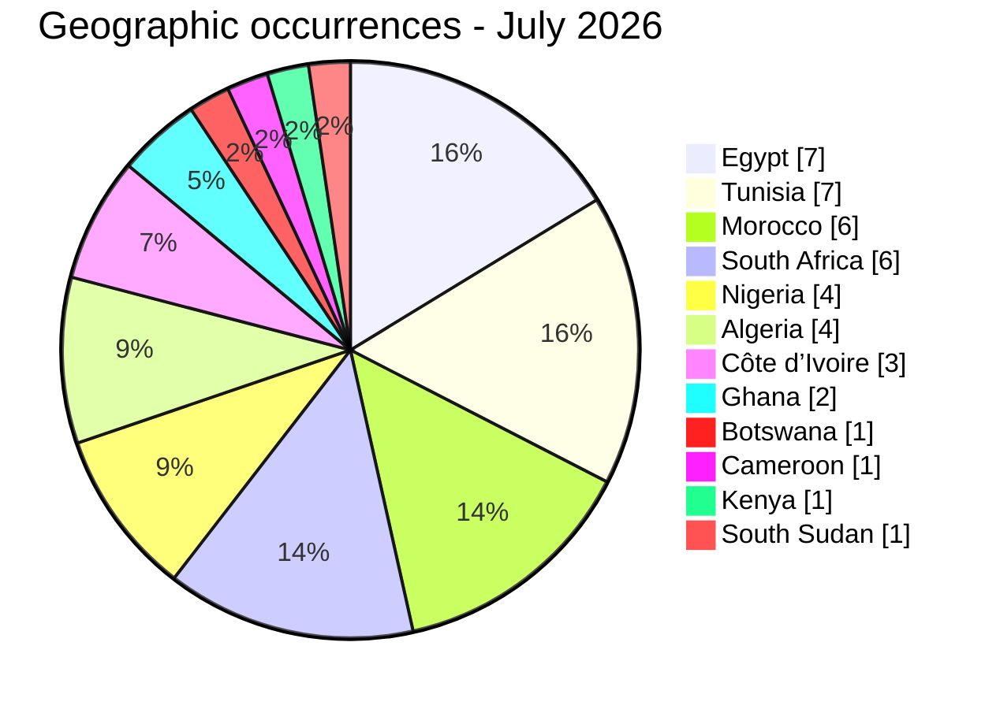
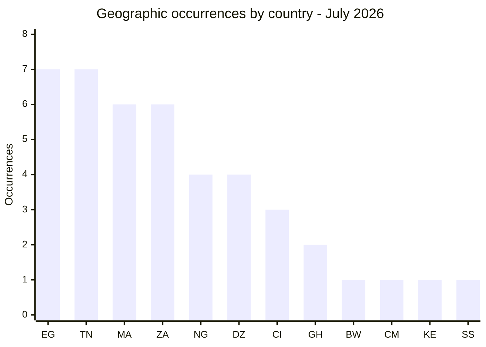
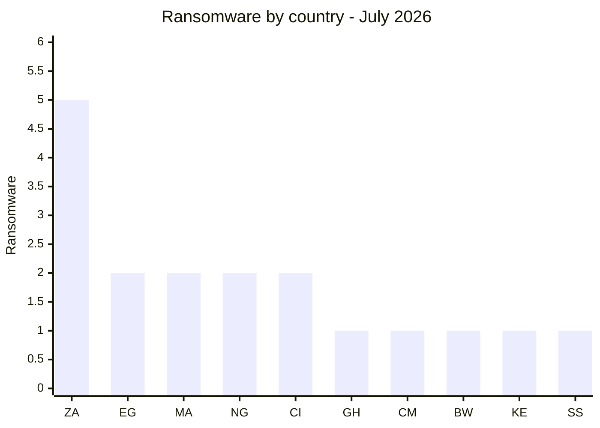
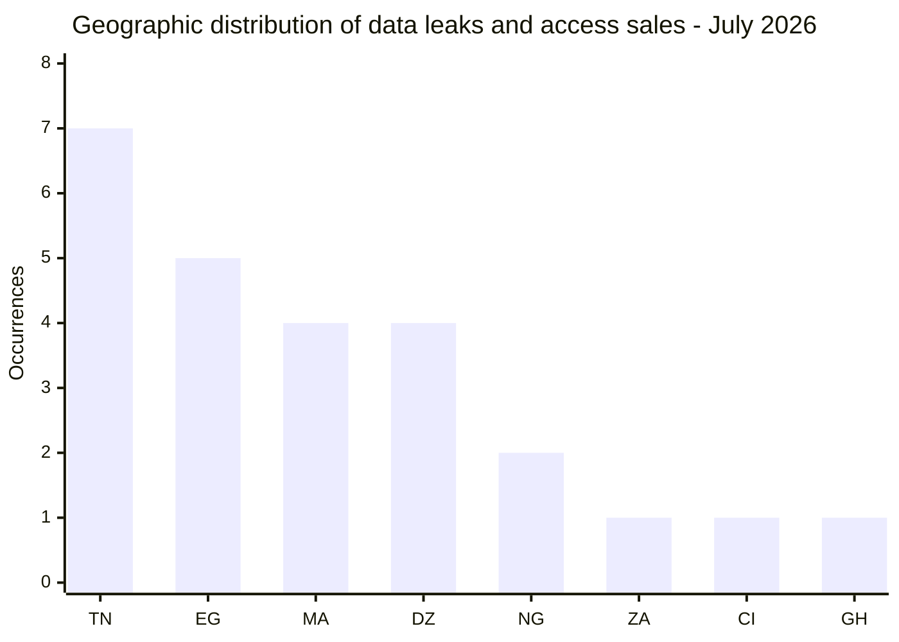
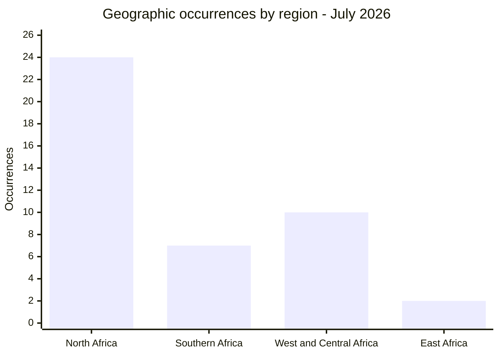
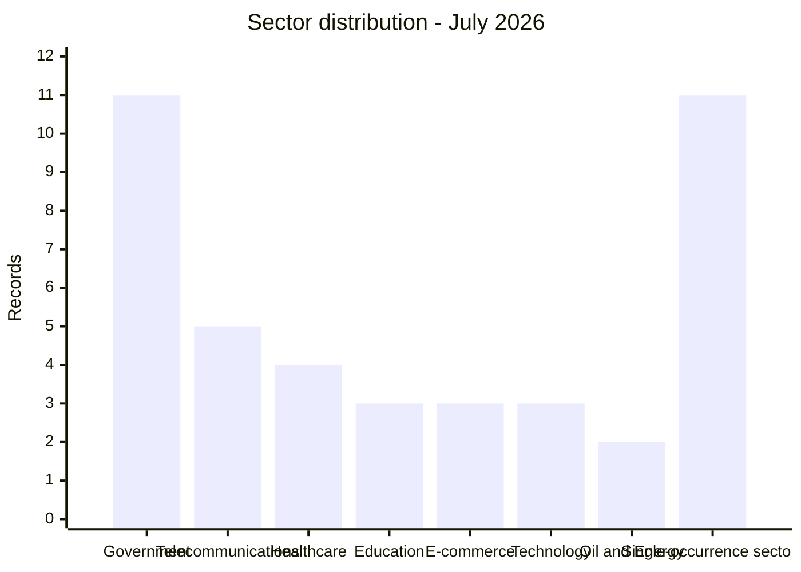
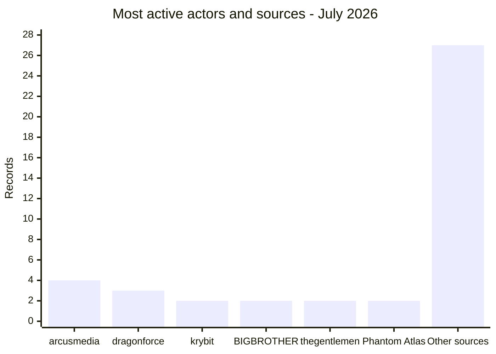

[](https://github.com/Hatchepsoute/AFRINTEL)


# AFRINTEL - Monthly CTI report
## Cyberattacks in Africa - July 2026

👉🏾 [French version](./README_FR.md) · [Victim cards](./victims.md)

## 1. Executive summary

AFRINTEL recorded **42 incident records** in July 2026, involving **12 African countries**:

- **18 ransomware claims**;
- **18 data leaks**;
- **6 access-sale offers**;
- **0 defacements**.

Egypt and Tunisia led the geographic count with seven occurrences each. Morocco and South Africa followed with six each. The month was split between ransomware visibility, data-leak publications and access brokering; no single actor dominated the dataset.

The report combines leak-site listings, underground-forum posts and locally reviewed samples. A criminal publication remains a claim unless independent evidence supports it. The strongest records are those supported by structured files, coherent screenshots or visible administrative interfaces.

## 2. Scope and methodology

All figures derive from [`victims.md`](./victims.md), the monthly source of truth. Each card is counted once in the incident total, using AFRINTEL’s detection date.

The geographic table contains **43 country occurrences rather than 42 incidents**. One identity-photo record concerns both Nigeria and Côte d’Ivoire and is therefore counted in both country views. The MTN record is attributed to South Africa with reservation; the national entity is not independently confirmed.

Claimed volumes are not treated as established facts. Download links, credentials, personal data and secrets are not reproduced in this report.

## 3. Global overview

| Country | Occurrences | Chart |
| :--- | ---: | :--- |
| 🇪🇬 Egypt | 7 | ███████ |
| 🇹🇳 Tunisia | 7 | ███████ |
| 🇲🇦 Morocco | 6 | ██████ |
| 🇿🇦 South Africa | 6 | ██████ |
| 🇳🇬 Nigeria | 4 | ████ |
| 🇩🇿 Algeria | 4 | ████ |
| 🇨🇮 Côte d’Ivoire | 3 | ███ |
| 🇬🇭 Ghana | 2 | ██ |
| 🇧🇼 Botswana | 1 | █ |
| 🇨🇲 Cameroon | 1 | █ |
| 🇰🇪 Kenya | 1 | █ |
| 🇸🇸 South Sudan | 1 | █ |
| **Total geographic occurrences** | **43** | - |






Legend: EG = Egypt, TN = Tunisia, MA = Morocco, ZA = South Africa, NG = Nigeria, DZ = Algeria, CI = Côte d’Ivoire, GH = Ghana, BW = Botswana, CM = Cameroon, KE = Kenya, SS = South Sudan

### Ransomware versus leaks and access sales by country

| Country | Ransomware | Leaks and access sales | Total | Distribution |
|---|---:|---:|---:|---|
| 🇿🇦 South Africa | 5 | 1 | 6 | 🟧🟧🟧🟧🟧 🟦 |
| 🇪🇬 Egypt | 2 | 5 | 7 | 🟧🟧 🟦🟦🟦🟦🟦 |
| 🇲🇦 Morocco | 2 | 4 | 6 | 🟧🟧 🟦🟦🟦🟦 |
| 🇳🇬 Nigeria | 2 | 2 | 4 | 🟧🟧 🟦🟦 |
| 🇨🇮 Côte d’Ivoire | 2 | 1 | 3 | 🟧🟧 🟦 |
| 🇬🇭 Ghana | 1 | 1 | 2 | 🟧 🟦 |
| 🇨🇲 Cameroon | 1 | 0 | 1 | 🟧 |
| 🇧🇼 Botswana | 1 | 0 | 1 | 🟧 |
| 🇰🇪 Kenya | 1 | 0 | 1 | 🟧 |
| 🇸🇸 South Sudan | 1 | 0 | 1 | 🟧 |
| 🇹🇳 Tunisia | 0 | 7 | 7 | 🟦🟦🟦🟦🟦🟦🟦 |
| 🇩🇿 Algeria | 0 | 4 | 4 | 🟦🟦🟦🟦 |
| **Total** | **18** | **25** | **43** | *🟧 Ransomware \| 🟦 Leaks and access sales* |

The 25 leak and access-sale occurrences include the additional country allocation for the Nigeria and Côte d’Ivoire identity-document record.

### Ransomware by country




Legend: ZA = South Africa, EG = Egypt, MA = Morocco, NG = Nigeria, CI = Côte d’Ivoire, GH = Ghana, CM = Cameroon, BW = Botswana, KE = Kenya, SS = South Sudan

### Geographic distribution of data leaks and access sales

| Rank | Country | Occurrences | Chart |
|---:|---|---:|---|
| 1 | 🇹🇳 Tunisia | **7** | ███████ |
| 2 | 🇪🇬 Egypt | **5** | █████ |
| 3 | 🇲🇦 Morocco | **4** | ████ |
| 3 | 🇩🇿 Algeria | **4** | ████ |
| 5 | 🇳🇬 Nigeria | **2** | ██ |
| 6 | 🇿🇦 South Africa | **1** | █ |
| 6 | 🇨🇮 Côte d’Ivoire | **1** | █ |
| 6 | 🇬🇭 Ghana | **1** | █ |
| **Total** |  | **25** |  |




Legend: TN = Tunisia, EG = Egypt, MA = Morocco, DZ = Algeria, NG = Nigeria, ZA = South Africa, CI = Côte d’Ivoire, GH = Ghana

### Geographic breakdown by region

| Region | Countries included | Occurrences | Ransomware | Leaks and access sales | Distribution |
|---|---|---:|---:|---:|---|
| **North Africa** | 🇪🇬 Egypt, 🇹🇳 Tunisia, 🇲🇦 Morocco, 🇩🇿 Algeria | **24** | 4 | 20 | 🟧🟧🟧🟧 🟦🟦🟦🟦🟦🟦🟦🟦🟦🟦🟦🟦🟦🟦🟦🟦🟦🟦🟦🟦 |
| **Southern Africa** | 🇿🇦 South Africa, 🇧🇼 Botswana | **7** | 6 | 1 | 🟧🟧🟧🟧🟧🟧 🟦 |
| **West and Central Africa** | 🇳🇬 Nigeria, 🇨🇮 Côte d’Ivoire, 🇬🇭 Ghana, 🇨🇲 Cameroon | **10** | 6 | 4 | 🟧🟧🟧🟧🟧🟧 🟦🟦🟦🟦 |
| **East Africa** | 🇰🇪 Kenya, 🇸🇸 South Sudan | **2** | 2 | 0 | 🟧🟧 |
| **Total** | **12 countries** | **43** | **18** | **25** | *🟧 Ransomware \| 🟦 Leaks and access sales* |

The Nigeria and Côte d’Ivoire identity-document record contributes one occurrence to each country. MTN is allocated to South Africa in this working view, although its national entity is not confirmed. These allocations do not change the global total of 42 unique incidents.




## 4. Detailed analysis by incident type

| Type | Records | Share |
| :--- | ---: | ---: |
| 🟧 Ransomware | 18 | 42.9% |
| 🟦 Data leak | 18 | 42.9% |
| 🟪 Access sale | 6 | 14.3% |
| **Total** | **42** | **100%** |


pie showData
    title Incident type breakdown - July 2026
    "Ransomware" : 18
    "Data leaks" : 18
    "Access sales" : 6
```

Ransomware publications were mainly associated with **arcusmedia**, **dragonforce**, **krybit** and **thegentlemen**. These are listings or claims; they do not automatically establish encryption, exfiltration or operational disruption.

The leak side was more varied: identity documents, medical data, university accounts, government files and commercial databases. The access offers involved alleged Fortinet, webmail and government-portal access.

## 5. Sectoral impact

| Sector | Records | Share | Chart |
| :--- | ---: | ---: | :--- |
| Government / Administration | 11 | 26.2% | ███████████ |
| Telecommunications | 5 | 11.9% | █████ |
| Healthcare / Medical | 4 | 9.5% | ████ |
| Education / Universities | 3 | 7.1% | ███ |
| E-commerce / Retail | 3 | 7.1% | ███ |
| Technology / Engineering | 3 | 7.1% | ███ |
| Oil and Energy | 2 | 4.8% | ██ |
| Investment Holding / Energy | 1 | 2.4% | █ |
| Finance / Banking | 1 | 2.4% | █ |
| Transport / Logistics | 1 | 2.4% | █ |
| Real Estate | 1 | 2.4% | █ |
| Mining | 1 | 2.4% | █ |
| Accounting / Audit | 1 | 2.4% | █ |
| Travel / Events | 1 | 2.4% | █ |
| Chemical Industry | 1 | 2.4% | █ |
| Security Services | 1 | 2.4% | █ |
| Gaming / Entertainment | 1 | 2.4% | █ |
| Rubber / Agriculture | 1 | 2.4% | █ |
| **Total** | **42** | **100%** |  |



Government and administration remained the largest sectoral grouping. The records covered public procurement, justice, employment, identity, land administration and public services, creating risks that extend beyond data disclosure into fraud and targeted impersonation.

## 6. Threat actors and sources

| Actor / source | Records | Main activity |
| :--- | ---: | :--- |
| arcusmedia | 4 | Ransomware |
| dragonforce | 3 | Ransomware |
| krybit | 2 | Ransomware |
| BIGBROTHER | 2 | Access sale / reposting |
| thegentlemen | 2 | Ransomware |
| Phantom Atlas | 2 | Data leak |
| Other named sources | 27 | Mixed activity |




Frequency alone does not establish a coordinated campaign. The dataset combines ransomware groups, publication accounts, access brokers and reposters.

### 6.2 Cases requiring follow-up

### Egyptian Ministry of Agriculture

The reviewed material included correspondence, contracts, payments, inspection records, technical inventories and application screenshots. The set was coherent with administrative and operational documentation. If authentic, it could support land-related fraud, document forgery and highly contextual phishing.

### Nerasolgh - Ghana

The reviewed exports showed customer, staff, USSD-payment, transaction and banking-related structures. The actor claimed 26 million records, while the material available for review was considerably smaller. The gap between the claim and the sample remains unresolved.

### Heliopolis University and HIMS

These records should remain separate. Heliopolis’s sample showed parent and student-account structures. HIMS claimed student, staff, financial and payment data. Neither advertised volume was independently confirmed.

### Adex - Tunisia

The BIGBROTHER repost showed an administration interface with a record count close to the advertised “15k”. This makes the claimed access plausible, but does not establish the original intruder or the complete scope of the data.

### 6.3 Repeated claims and unresolved links

### Planet Sport

The `planetsport.ma` domain was listed by LockBit 5 in April 2026. A free July publication attributed to Mozvo appeared on the same target. Reposting, third-party redistribution or an affiliate relationship are all possible, but none is demonstrated. The records remain separate and linked by an analytical note.

### Zenith Bank

Zenith Bank Plc was listed in a data-leak claim published on 9 August 2025 by KaruHunters, alleging the sale of more than 1.8 million customer and employee records. In July 2026, Zenith Bank appeared again in a separate ransomware claim attributed to ExfilSquad. The two publications are separated by nearly eleven months and involve different actors. This recurrence justifies enhanced monitoring, but the available evidence does not establish that both publications result from the same compromise.

## 7. Key trends and intelligence gaps

### Trends

- Ransomware and data leaks each account for 18 records.
- Six access offers concern public, telecom or administrative environments.
- Identity and passport-related material appears in several records.
- Government and administration remain the largest sector group.
- Planet Sport and Adex illustrate the attribution problems caused by reposting.
- Evidence quality varies from structured exports to unsupported claims.

### Intelligence gaps

- Victim confirmation is generally unavailable.
- Complete data volumes are unknown in several cases.
- Initial access vectors are rarely visible.
- National subsidiaries are not always identifiable, including MTN.
- New compromises and reposts can be difficult to separate.
- Remediation after publication is unknown.


The main gaps concern victim confirmation, archive authenticity and completeness, actual exposed volumes, the initial access vector, the distinction between original intrusion and redistribution, and any remediation after publication.

Confidence is therefore assessed at card level. This report does not turn a claim into a confirmed incident.

## 8. MITRE ATT&CK mapping, contextual

| Phase | Technique | Defensive interpretation |
| :--- | :--- | :--- |
| Initial access | T1190 - Exploit Public-Facing Application | Relevant to exposed portals and applications; not confirmed for every case. |
| Initial access | T1078 - Valid Accounts | Relevant to alleged webmail, Fortinet and privileged-account access. |
| Credential access | T1003 - OS Credential Dumping | Contextual where credentials or hashes are mentioned. |
| Collection | T1213 - Data from Information Repositories | Relevant to university, public-sector and business repositories. |
| Exfiltration | T1041 - Exfiltration Over C2 Channel | Defensive hypothesis; not consistently observed. |
| Impact | T1486 - Data Encrypted for Impact | Use only where encryption is documented. |

## 9. Recommendations

- **Governments:** enforce phishing-resistant MFA, audit exposed services and monitor privileged accounts.
- **Telecommunications:** review administrator, VPN and webmail logs and rotate exposed credentials.
- **Universities and healthcare:** segment sensitive databases, restrict bulk exports and review service accounts.
- **Banks and e-commerce:** monitor abnormal authentication, payment activity and account recovery.
- **All organisations:** preserve evidence and validate indicators without redistributing personal data.

## 10. SOC tactical recommendations

1. Review privileged accounts, Fortinet portals, webmail and public-facing applications.
2. Enforce MFA and rotate credentials whenever exposure is plausible.
3. Hunt for bulk exports, new administrator accounts and anomalous authentication.
4. Segment identity, justice, land, employment and payment systems.
5. Preserve logs and evidence before destructive remediation.
6. Maintain separate response playbooks for ransomware, data leaks and access sales.

## 11. Strategic recommendations

- Establish regional information-sharing channels for ransomware and access-broker activity.
- Require exposed-service and third-party assessments for public and critical organisations.
- Maintain separate playbooks for ransomware, leaks, access sales and reposts.
- Improve asset inventories so national subsidiaries can be identified quickly.
- Exercise response plans for identity-data exposure, privileged access and public disclosure.

## 12. Conclusion

July 2026 showed a broad but fragmented threat picture. Ransomware remained highly visible, while leaks and access offers exposed identity, healthcare, education, government and payment-related data. Evidence quality varied sharply between records; that distinction should remain visible in operational decision-making.

**AFRINTEL - Adama ASSIONGBON, SOC & CTI Consultant**
[AFRINTEL GitHub repository](https://github.com/Hatchepsoute/AFRINTEL)
