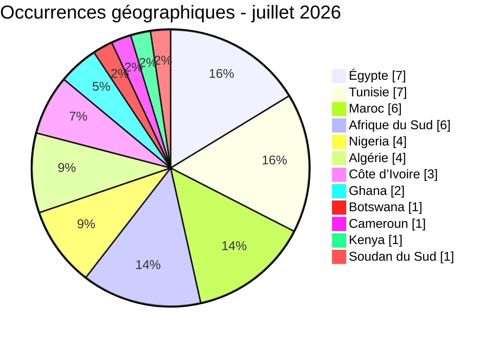

[](https://github.com/Hatchepsoute/AFRINTEL)


# AFRINTEL - Rapport CTI mensuel
## Cyberattaques en Afrique - juillet 2026

👉🏾 [Version anglaise](./README.md) · [Fiches victimes](./victims_FR.md)

## 1. Synthèse exécutive

AFRINTEL a recensé **42 fiches d’incidents** en juillet 2026, concernant **12 pays africains** :

- **18 revendications ransomware** ;
- **18 fuites de données** ;
- **6 offres de vente d’accès** ;
- **0 défacement**.

L’Égypte et la Tunisie arrivent en tête avec sept occurrences géographiques chacune. Le Maroc et l’Afrique du Sud suivent avec six occurrences. La répartition montre un mois partagé entre ransomware, fuites de données et courtage d’accès, sans acteur dominant unique.

Le rapport couvre des publications de sites de fuite, des messages de forums et des échantillons examinés localement. Une publication criminelle reste une revendication tant qu’elle n’est pas confirmée par des éléments indépendants. Les analyses les plus solides sont celles appuyées par des fichiers structurés, des captures cohérentes ou des interfaces administratives visibles.

## 2. Périmètre et méthode

Les chiffres sont dérivés de [`victims_FR.md`](./victims_FR.md), source de référence du mois. Chaque fiche est comptée une fois dans le total des incidents, selon la date de détection retenue par AFRINTEL.

La ventilation géographique totalise **43 occurrences** au lieu de 42 : une fiche concernant des photographies de pièces d’identité associe le Nigeria et la Côte d’Ivoire et est donc comptée dans les deux pays. La fiche MTN est attribuée à l'Afrique du Sud sous réserve ; l'entité nationale n'est pas confirmée de manière indépendante.

Les volumes annoncés par les acteurs ne sont pas repris comme des faits établis. Les liens de téléchargement, les identifiants, les données personnelles et les secrets ne sont pas reproduits dans ce rapport.

## 3. Vue globale

| Pays | Occurrences | Barre |
| :--- | ---: | :--- |
| 🇪🇬 Égypte | 7 | ███████ |
| 🇹🇳 Tunisie | 7 | ███████ |
| 🇲🇦 Maroc | 6 | ██████ |
| 🇿🇦 Afrique du Sud | 6 | ██████ |
| 🇳🇬 Nigeria | 4 | ████ |
| 🇩🇿 Algérie | 4 | ████ |
| 🇨🇮 Côte d’Ivoire | 3 | ███ |
| 🇬🇭 Ghana | 2 | ██ |
| 🇧🇼 Botswana | 1 | █ |
| 🇨🇲 Cameroun | 1 | █ |
| 🇰🇪 Kenya | 1 | █ |
| 🇸🇸 Soudan du Sud | 1 | █ |
| **Total géographique** | **43** | - |




~~~mermaid
xychart-beta
    title "Occurrences géographiques par pays - juillet 2026"
    x-axis ["Égypte","Tunisie","Maroc","Afrique du Sud","Nigeria","Algérie","Côte d’Ivoire","Ghana","Botswana","Cameroun","Kenya","Soudan du Sud"]
    y-axis "Occurrences" 0 --> 8
    bar [7,7,6,6,4,4,3,2,1,1,1,1]
```


### Comparaison ransomware et fuites de données par pays

| Pays | Ransomware | Fuites de données / ventes d'accès | Total | Répartition |
|---|---:|---:|---:|---|
| 🇿🇦 Afrique du Sud | 5 | 1 | 6 | 🟧🟧🟧🟧🟧 🟦 |
| 🇪🇬 Égypte | 2 | 5 | 7 | 🟧🟧 🟦🟦🟦🟦🟦 |
| 🇲🇦 Maroc | 2 | 4 | 6 | 🟧🟧 🟦🟦🟦🟦 |
| 🇳🇬 Nigeria | 2 | 2 | 4 | 🟧🟧 🟦🟦 |
| 🇨🇮 Côte d'Ivoire | 2 | 1 | 3 | 🟧🟧 🟦 |
| 🇬🇭 Ghana | 1 | 1 | 2 | 🟧 🟦 |
| 🇨🇲 Cameroun | 1 | 0 | 1 | 🟧 |
| 🇧🇼 Botswana | 1 | 0 | 1 | 🟧 |
| 🇰🇪 Kenya | 1 | 0 | 1 | 🟧 |
| 🇸🇸 Soudan du Sud | 1 | 0 | 1 | 🟧 |
| 🇹🇳 Tunisie | 0 | 7 | 7 | 🟦🟦🟦🟦🟦🟦🟦 |
| 🇩🇿 Algérie | 0 | 4 | 4 | 🟦🟦🟦🟦 |
| **Total** | **18** | **25** | **43** | *🟧 Ransomware \| 🟦 Fuites et ventes d'accès* |

Les 25 occurrences de fuites et de ventes d'accès incluent l'allocation géographique supplémentaire de la fiche relative aux documents d'identité du Nigeria et de la Côte d'Ivoire.

### Ransomware par pays


~~~mermaid
xychart-beta
    title "Ransomware par pays - juillet 2026"
    x-axis ["Afrique du Sud","Égypte","Maroc","Nigeria","Côte d’Ivoire","Ghana","Cameroun","Botswana","Kenya","Soudan du Sud"]
    y-axis "Ransomware" 0 --> 6
    bar [5,2,2,2,2,1,1,1,1,1]
```


### Répartition géographique des fuites de données et ventes d'accès

| Rang | Pays | Occurrences | Barre |
|---:|---|---:|---|
| 1 | 🇹🇳 Tunisie | **7** | ███████ |
| 2 | 🇪🇬 Égypte | **5** | █████ |
| 3 | 🇲🇦 Maroc | **4** | ████ |
| 3 | 🇩🇿 Algérie | **4** | ████ |
| 5 | 🇳🇬 Nigeria | **2** | ██ |
| 6 | 🇿🇦 Afrique du Sud | **1** | █ |
| 6 | 🇨🇮 Côte d'Ivoire | **1** | █ |
| 6 | 🇬🇭 Ghana | **1** | █ |
| **Total** |  | **25** |  |


~~~mermaid
xychart-beta
    title "Répartition géographique des fuites et ventes d'accès - juillet 2026"
    x-axis ["Tunisie","Égypte","Maroc","Algérie","Nigeria","Afrique du Sud","Côte d’Ivoire","Ghana"]
    y-axis "Occurrences" 0 --> 8
    bar [7,5,4,4,2,1,1,1]
```


### Répartition géographique par région

| Région | Pays inclus | Occurrences | Ransomware | Fuites et ventes d'accès | Répartition |
|---|---|---:|---:|---:|---|
| **Afrique du Nord** | 🇪🇬 Égypte, 🇹🇳 Tunisie, 🇲🇦 Maroc, 🇩🇿 Algérie | **24** | 4 | 20 | 🟧🟧🟧🟧 🟦🟦🟦🟦🟦🟦🟦🟦🟦🟦🟦🟦🟦🟦🟦🟦🟦🟦🟦🟦 |
| **Afrique australe** | 🇿🇦 Afrique du Sud, 🇧🇼 Botswana | **7** | 6 | 1 | 🟧🟧🟧🟧🟧🟧 🟦 |
| **Afrique de l'Ouest et centrale** | 🇳🇬 Nigeria, 🇨🇮 Côte d'Ivoire, 🇬🇭 Ghana, 🇨🇲 Cameroun | **10** | 6 | 4 | 🟧🟧🟧🟧🟧🟧 🟦🟦🟦🟦 |
| **Afrique de l'Est** | 🇰🇪 Kenya, 🇸🇸 Soudan du Sud | **2** | 2 | 0 | 🟧🟧 |
| **Total** | **12 pays** | **43** | **18** | **25** | *🟧 Ransomware \| 🟦 Fuites et ventes d'accès* |

La fiche relative aux documents d'identité du Nigeria et de la Côte d'Ivoire ajoute une occurrence dans chacun de ces deux pays. MTN est attribué à l'Afrique du Sud dans cette vue de travail, mais son entité nationale n'est pas confirmée. Ces allocations ne modifient pas le total global de 42 incidents uniques.


~~~mermaid
xychart-beta
    title "Occurrences géographiques par région - juillet 2026"
    x-axis ["Afrique du Nord","Afrique australe","Afrique de l'Ouest et centrale","Afrique de l'Est"]
    y-axis "Occurrences" 0 --> 26
    bar [24,7,10,2]
```

## 4. Analyse détaillée par type d'incident

| Type | Fiches | Part |
| :--- | ---: | ---: |
| 🟧 Ransomware | 18 | 42,9 % |
| 🟦 Fuite de données | 18 | 42,9 % |
| 🟪 Vente d’accès | 6 | 14,3 % |
| **Total** | **42** | **100 %** |


pie showData
    title Répartition des types d'incidents - juillet 2026
    "Ransomware" : 18
    "Fuites de données" : 18
    "Ventes d'accès" : 6
```

Les publications ransomware sont principalement associées à **arcusmedia**, **dragonforce**, **krybit** et **thegentlemen**. Ces occurrences correspondent à des publications ou revendications ; elles ne démontrent pas systématiquement un chiffrement, une exfiltration ou une interruption d’activité.

Les fuites de données couvrent des documents d’identité, des données médicales, des comptes universitaires, des dossiers administratifs et des bases commerciales. Les offres d’accès concernent notamment des environnements Fortinet, des services de messagerie et des portails administratifs allégués.

## 5. Secteurs les plus exposés

| Secteur | Fiches | Part | Barre |
| :--- | ---: | ---: | :--- |
| Gouvernement / Administration | 11 | 26,2 % | ███████████ |
| Télécommunications | 5 | 11,9 % | █████ |
| Santé / Médical | 4 | 9,5 % | ████ |
| Éducation / Universités | 3 | 7,1 % | ███ |
| E-commerce / Distribution | 3 | 7,1 % | ███ |
| Technologie / Ingénierie | 3 | 7,1 % | ███ |
| Pétrole et énergie | 2 | 4,8 % | ██ |
| Portefeuille d’investissement / Énergie | 1 | 2,4 % | █ |
| Finance / Banque | 1 | 2,4 % | █ |
| Transport / Logistique | 1 | 2,4 % | █ |
| Immobilier | 1 | 2,4 % | █ |
| Mines | 1 | 2,4 % | █ |
| Comptabilité / Audit | 1 | 2,4 % | █ |
| Voyage / Événementiel | 1 | 2,4 % | █ |
| Industrie chimique | 1 | 2,4 % | █ |
| Services de sécurité | 1 | 2,4 % | █ |
| Jeux / Divertissement | 1 | 2,4 % | █ |
| Caoutchouc / Agriculture | 1 | 2,4 % | █ |
| **Total** | **42** | **100 %** |  |

~~~mermaid
xychart-beta
    title "Répartition sectorielle - juillet 2026"
    x-axis ["Gouvernement","Télécommunications","Santé","Éducation","E-commerce","Technologie","Pétrole et énergie","Secteurs unitaires"]
    y-axis "Fiches" 0 --> 12
    bar [11,5,4,3,3,3,2,11]
```

Les administrations restent le premier ensemble sectoriel. Les fiches concernent notamment des systèmes liés aux marchés publics, à la justice, à l’emploi, à l’identité, au foncier et aux services publics. Cette concentration augmente le risque de fraude documentaire, d’usurpation et d’ingénierie sociale ciblée.

## 6. Acteurs et sources les plus présents

| Acteur / source | Fiches | Activité principale |
| :--- | ---: | :--- |
| arcusmedia | 4 | Ransomware |
| dragonforce | 3 | Ransomware |
| krybit | 2 | Ransomware |
| BIGBROTHER | 2 | Vente d’accès / republication |
| thegentlemen | 2 | Ransomware |
| Phantom Atlas | 2 | Fuite de données |
| Autres sources nommées | 27 | Activités diverses |


~~~mermaid
xychart-beta
    title "Acteurs et sources les plus présents - juillet 2026"
    x-axis ["arcusmedia","dragonforce","krybit","BIGBROTHER","thegentlemen","Phantom Atlas","Autres sources"]
    y-axis "Fiches" 0 --> 28
    bar [4,3,2,2,2,2,27]
```

La fréquence d’un nom ne suffit pas à établir une campagne coordonnée. Le corpus mélange groupes ransomware, comptes de publication, courtiers d’accès et republications.

### 6.2 Dossiers à surveiller

### Ministère égyptien de l’Agriculture

Les éléments examinés comprennent des correspondances, contrats, paiements, inspections, inventaires techniques et captures d’application. L’ensemble est cohérent avec une exposition de documents administratifs et opérationnels. Si l’authenticité est confirmée, les risques incluent la fraude foncière, la falsification documentaire et le phishing contextualisé.

### Nerasolgh - Ghana

Les exports examinés présentent des structures liées aux clients, au personnel, aux paiements USSD, aux transactions et à certains champs bancaires. L’acteur revendique 26 millions d’enregistrements, mais le volume effectivement examiné est beaucoup plus limité. L’écart entre la revendication et l’échantillon demeure une inconnue importante.

### Heliopolis University et HIMS

Ces deux dossiers doivent rester distincts. L’échantillon d’Heliopolis montre des structures de comptes parents et étudiants. La publication HIMS revendique des données concernant les étudiants, le personnel, la finance et les paiements. Les volumes annoncés n’ont pas été confirmés indépendamment.

### Adex - Tunisie

La republication attribuée à BIGBROTHER montre une interface administrative dont le nombre d’enregistrements est proche du volume annoncé. Cela rend l’accès allégué plausible, sans établir l’identité de l’intrus initial ni l’étendue des données.

### 6.3 Revendications multiples et hypothèses

### Planet Sport

Le domaine `planetsport.ma` avait été listé par LockBit 5 en avril 2026. Une publication gratuite attribuée à Mozvo est apparue en juillet. Une republication, une redistribution par un tiers ou un lien avec un affilié sont possibles, mais aucune de ces hypothèses n’est démontrée. Les deux fiches restent donc séparées et liées par une note analytique.

### Zenith Bank

Zenith Bank Plc a été mentionnée dans une revendication de fuite de données publiée le 9 août 2025 par KaruHunters, qui alléguait la mise en vente de plus de 1,8 million de dossiers de clients et d’employés. En juillet 2026, Zenith Bank est réapparue dans une revendication ransomware attribuée à ExfilSquad. Les deux publications sont séparées de près de onze mois et impliquent des acteurs différents. Cette répétition justifie une surveillance renforcée, mais les éléments disponibles ne permettent pas d’établir que les deux publications proviennent de la même compromission.

## 7. Tendances et lacunes de renseignement

### Tendances

- Les ransomware et les fuites de données représentent chacun 18 fiches.
- Six offres concernent des environnements publics, télécoms ou administratifs.
- Des documents d'identité et des éléments liés aux passeports apparaissent dans plusieurs fiches.
- Le gouvernement et l'administration restent le principal groupe sectoriel.
- Planet Sport et Adex illustrent les difficultés d'attribution liées aux republications.
- La qualité des preuves varie des exports structurés aux simples revendications.

### Lacunes de renseignement

- La confirmation par les victimes est généralement absente.
- Le volume complet des données est inconnu dans plusieurs cas.
- Le vecteur d'intrusion initial est rarement visible.
- Les filiales nationales ne sont pas toujours identifiables, notamment pour MTN.
- Une nouvelle compromission et une republication sont parfois difficiles à distinguer.
- La remédiation après publication reste inconnue.


Les principales limites portent sur :

- la confirmation par les organisations victimes ;
- l’authenticité et l’exhaustivité des archives ;
- les volumes réellement exposés ;
- le vecteur d’accès initial ;
- la distinction entre intrusion originale, republication et redistribution ;
- la remédiation éventuelle après publication.

Les niveaux de confiance sont donc évalués fiche par fiche. Le rapport ne transforme pas une revendication en incident confirmé.

## 8. Correspondances MITRE ATT&CK contextuelles

| Phase | Technique | Interprétation défensive |
| :--- | :--- | :--- |
| Accès initial | T1190 - Exploit Public-Facing Application | Pertinent pour les portails et applications exposés ; non confirmé pour chaque cas. |
| Accès initial | T1078 - Valid Accounts | Pertinent pour les accès webmail, Fortinet et comptes privilégiés allégués. |
| Accès aux identifiants | T1003 - OS Credential Dumping | Contextuel lorsque des identifiants ou hachages sont mentionnés. |
| Collecte | T1213 - Data from Information Repositories | Pertinent pour les référentiels universitaires, publics et d’entreprise. |
| Exfiltration | T1041 - Exfiltration Over C2 Channel | Hypothèse défensive ; non observée systématiquement. |
| Impact | T1486 - Data Encrypted for Impact | À retenir uniquement lorsqu’un chiffrement est documenté. |

## 9. Recommandations

- **Administrations :** imposer une MFA résistante au phishing, auditer les services exposés et surveiller les comptes privilégiés.
- **Télécommunications :** examiner les journaux des accès administrateurs, VPN et messageries, puis renouveler les identifiants exposés.
- **Universités et santé :** segmenter les bases sensibles, limiter les exports massifs et vérifier les comptes de service.
- **Banques et e-commerce :** surveiller les authentifications anormales, les paiements et la récupération de comptes.
- **Toutes les organisations :** préserver les preuves et valider les indicateurs sans redistribuer de données personnelles.

## 10. Recommandations tactiques SOC

1. Vérifier l’exposition des comptes privilégiés, des portails Fortinet, de la messagerie et des applications publiques.
2. Imposer la MFA et faire tourner les identifiants dès qu’une exposition est plausible.
3. Rechercher les exports massifs, les créations de comptes administrateurs et les connexions inhabituelles.
4. Segmenter les systèmes d’identité, de justice, de foncier, d’emploi et de paiement.
5. Préserver les journaux et les éléments de preuve avant toute remédiation destructive.
6. Préparer une réponse distincte pour les revendications ransomware, les fuites de données et les ventes d’accès.

## 11. Recommandations stratégiques

- Mettre en place des canaux régionaux de partage sur les ransomware et les courtiers d'accès.
- Imposer des évaluations des services exposés et des fournisseurs tiers pour les organisations publiques et critiques.
- Maintenir des procédures distinctes pour les ransomware, les fuites, les ventes d'accès et les republications.
- Améliorer les inventaires afin d'identifier rapidement les filiales nationales.
- Organiser des exercices sur l'exposition de données d'identité, les accès privilégiés et la divulgation publique.

## 12. Conclusion

Juillet 2026 présente une menace fragmentée mais large. Le ransomware reste très visible, tandis que les fuites et les ventes d’accès exposent des données d’identité, de santé, d’éducation, d’administration et de paiement. La qualité des preuves varie fortement d’une fiche à l’autre ; cette différence doit rester visible dans toute décision opérationnelle.

**AFRINTEL - Adama ASSIONGBON, Consultant SOC & CTI**
[Repository GitHub](https://github.com/Hatchepsoute/AFRINTEL)
