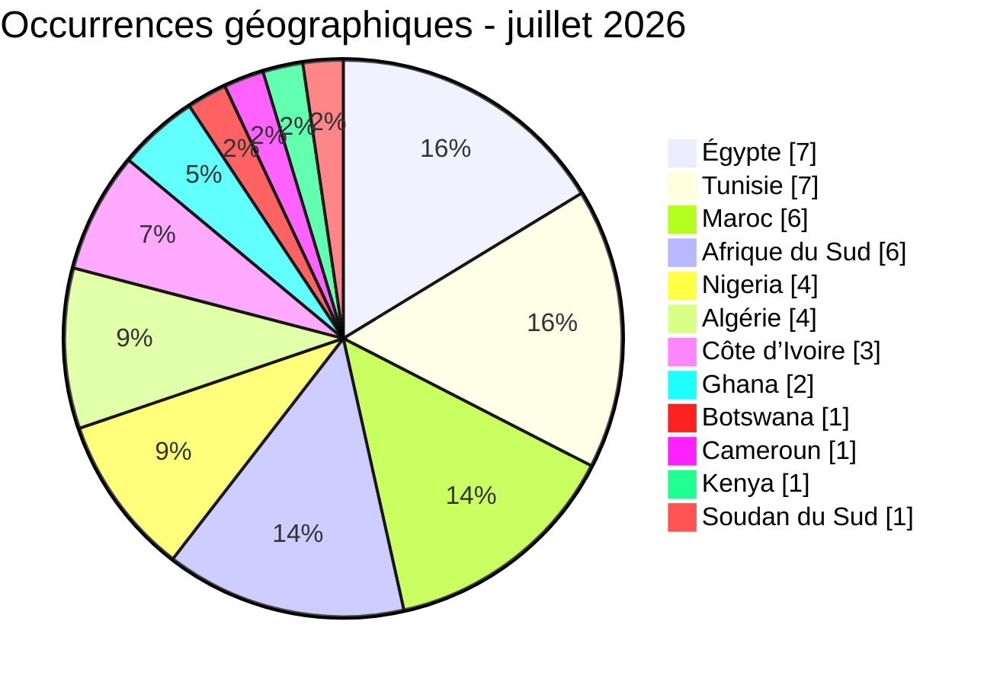
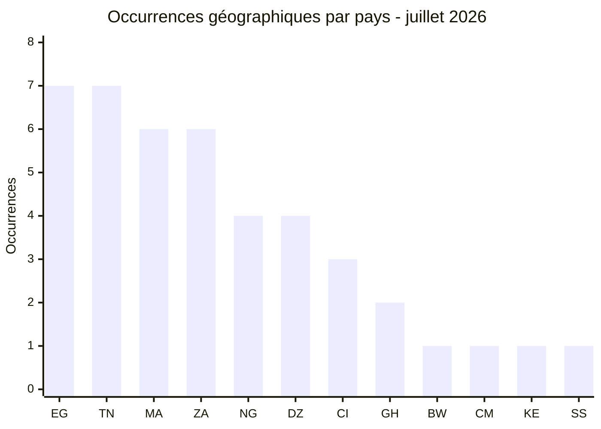
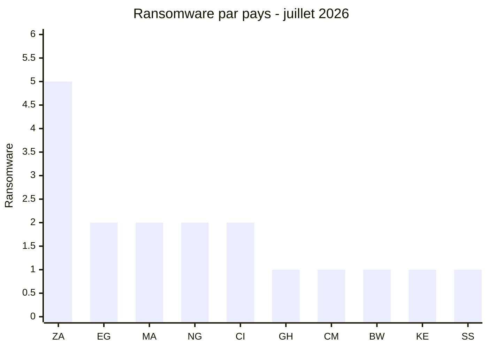
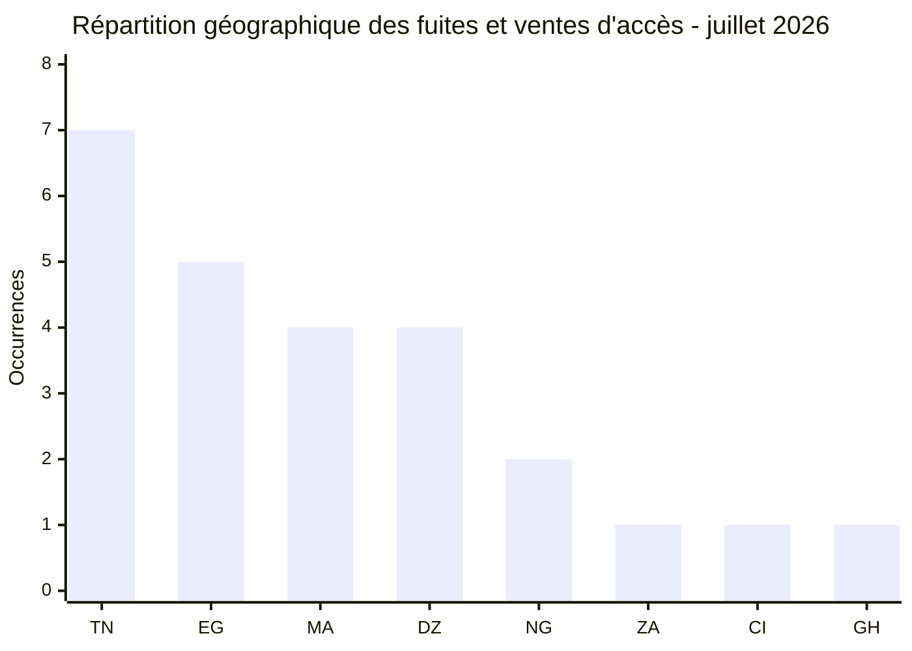
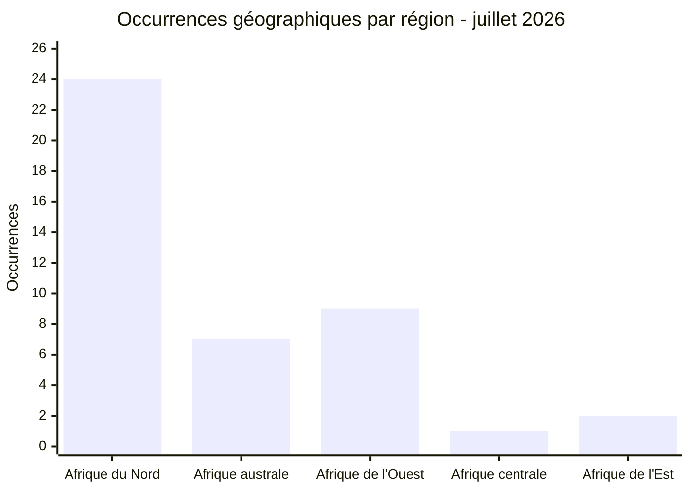
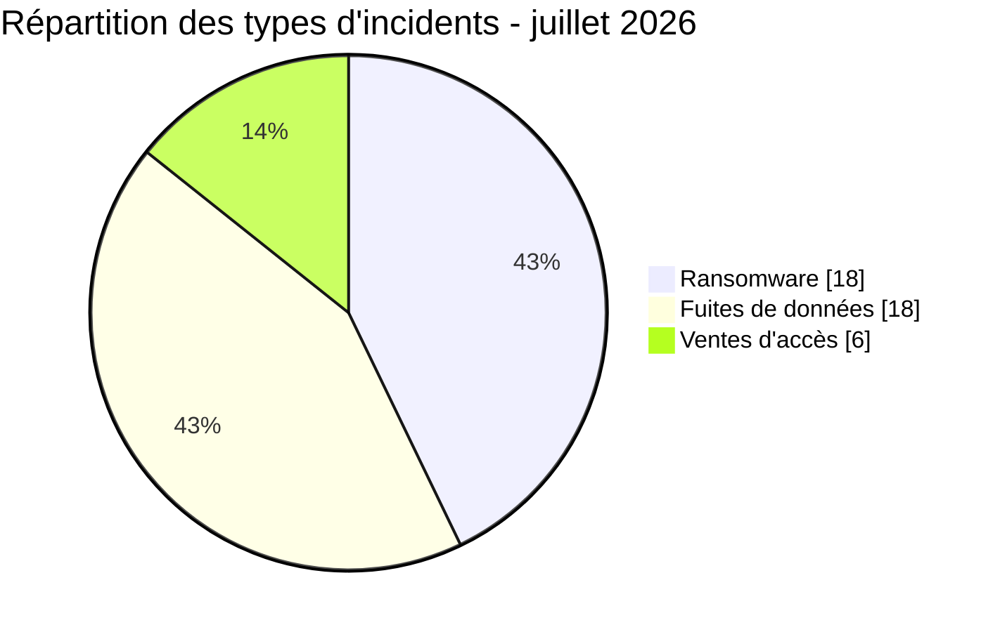
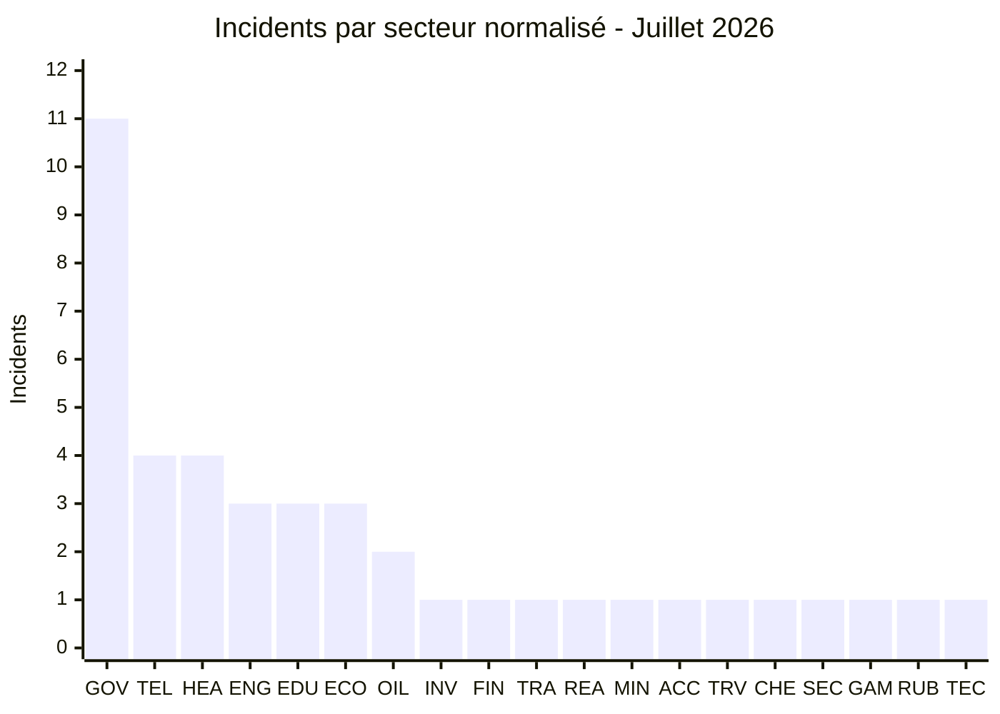
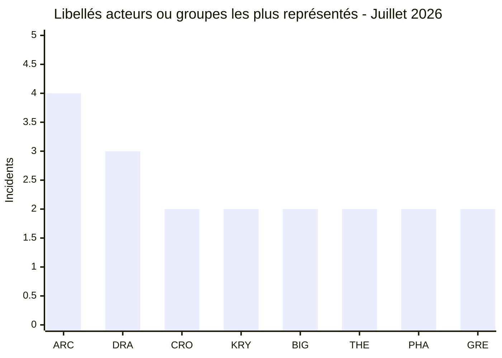
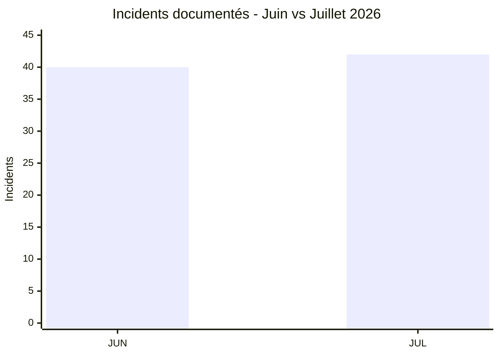

# AFRINTEL - Rapport CTI mensuel
## Cyberattaques en Afrique - juillet 2026

👉🏾 [Version anglaise](./README.md) · [Victimes et incidents documentés](./victims_FR.md)

## 1. Synthèse exécutive

AFRINTEL a recensé **42 incidents liés à l’Afrique** en juillet 2026, concernant **12 pays** :

- **18 revendications ransomware** ;
- **18 fuites de données** ;
- **6 offres de vente d’accès** ;
- **0 défacement**.

L’Égypte et la Tunisie arrivent en tête avec sept occurrences géographiques chacune, devant le Maroc et l’Afrique du Sud avec six. Le gouvernement et l’administration constituent le premier ensemble sectoriel avec 11 incidents documentés. Aucun acteur ne domine : arcusmedia totalise quatre publications ransomware et dragonforce trois.

La solidité des preuves varie fortement : **21 observations relèvent de revendications non vérifiées**, **20 comportent un échantillon publié** et **1 incident est enregistré sous le statut `Data Fully Published`, qui décrit une publication complète revendiquée et non une exhaustivité vérifiée**. Neuf incidents atteignent le niveau d’impact 4. Les cas à la fois sensibles et les mieux étayés comprennent Nerasolgh, Tayara.tn et Distamed, pour lesquels AFRINTEL a examiné des éléments structurés ; les volumes complets annoncés et les vecteurs d’intrusion ne sont pas nécessairement établis.

Les priorités défensives sont la protection des comptes privilégiés et des messageries, la détection des exports massifs de bases et la prise en charge rapide des expositions de données d’identité, de santé, d’éducation et d’administration. Les données détaillées sur les victimes et incidents sont disponibles dans [`victims_FR.md`](./victims_FR.md).

### 1.1 Comparaison avec le mois précédent

> Comparaison fondée sur les corpus mensuels AFRINTEL validés. Une variation du nombre de fiches documentées ne prouve pas, à elle seule, une variation du nombre réel de compromissions.

| Indicateur | Juin 2026 | Juillet 2026 | Évolution observée |
|---|---:|---:|---:|
| Total incidents | 40 | 42 | **+2 (+5,0 %)** |
| Ransomware | 20 | 18 | **-2 (-10,0 %)** |
| Data Leak | 18 | 18 | **0 (+0,0 %)** |
| Access Sale | 2 | 6 | **+4 (+200,0 %)** |
| DDoS | 0 | 0 | **0 (stable)** |
| Defacement | 0 | 0 | **0 (stable)** |
| Operational Fraud | 0 | 0 | **0 (stable)** |

> Règle de lecture : si la valeur du mois précédent est `0` et celle du mois courant est supérieure à `0`, l'évolution est indiquée comme `nouveau` plutôt qu'avec un pourcentage artificiel. Les catégories absentes restent affichées à `0`.

## 2. Périmètre et méthode

Tous les chiffres sont calculés une seule fois à partir du couple bilingue validé [`victims_FR.md`](./victims_FR.md) / [`victims.md`](./victims.md). Après synchronisation, ce couple constitue la source de vérité des deux versions ; les statistiques ne sont pas recalculées séparément par langue.

- **Périmètre géographique :** les 54 pays africains ; seules les victimes, opérations ou données ayant un lien africain explicite sont incluses.
- **Période de collecte :** du 1er au 31 juillet 2026, selon la date de détection AFRINTEL inscrite pour chaque incident.
- **Sources :** sites de fuite ransomware, forums cybercriminels, OSINT public, captures et échantillons structurés examinés localement.
- **Inclusion :** une observation par revendication ou incident documenté ; les revendications répétées restent distinctes uniquement si l’acteur, la date ou les preuves diffèrent.
- **Classification :** Ransomware, Data Leak, Access Sale et Defacement restent des types distincts.

La ventilation géographique totalise **43 occurrences** au lieu de 42 : une observation concernant des photographies de pièces d’identité associe le Nigeria et la Côte d’Ivoire et est donc comptée dans les deux pays. Le cas MTN est attribué à l'Afrique du Sud sous réserve ; l'entité nationale n'est pas confirmée de manière indépendante.

Les volumes annoncés par les acteurs ne sont pas repris comme des faits établis. Les liens de téléchargement, les identifiants, les données personnelles et les secrets ne sont pas reproduits dans ce rapport.

### Profil des preuves

| Dimension | Répartition | Total |
| :--- | :--- | ---: |
| Statut | 21 Claim - Unverified ; 20 Claim - Data Sample Published ; 1 Data Fully Published | 42 |
| Confiance | 22 Faible ; 8 Moyen ; 9 Élevé ; 3 Très élevé | 42 |
| Impact | 12 Niveau 2 ; 21 Niveau 3 ; 9 Niveau 4 | 42 |

## 3. Vue globale

| Pays | Occurrences | Barre |
| :--- | ---: | :--- |
| 🇪🇬 Égypte | 7 | ███████ |
| 🇹🇳 Tunisie | 7 | ███████ |
| 🇲🇦 Maroc | 6 | ██████ |
| 🇿🇦 Afrique du Sud | 6 | ██████ |
| 🇳🇬 Nigeria | 4 | ████ |
| 🇩🇿 Algérie | 4 | ████ |
| 🇨🇮 Côte d’Ivoire | 3 | ███ |
| 🇬🇭 Ghana | 2 | ██ |
| 🇧🇼 Botswana | 1 | █ |
| 🇨🇲 Cameroun | 1 | █ |
| 🇰🇪 Kenya | 1 | █ |
| 🇸🇸 Soudan du Sud | 1 | █ |
| **Total géographique** | **43** | - |

Légende : EG = Égypte, TN = Tunisie, MA = Maroc, ZA = Afrique du Sud, NG = Nigeria, DZ = Algérie, CI = Côte d’Ivoire, GH = Ghana, BW = Botswana, CM = Cameroun, KE = Kenya, SS = Soudan du Sud

### Comparaison Ransomware et Fuite de données / Vente d'accès par pays

Cette comparaison géographique contient **43 occurrences pays** : **18 occurrences ransomware** et **25 occurrences Fuite de données / Vente d'accès**. Le total bleu est supérieur aux **24 incidents uniques Data Leak / Access Sale** car une fiche Data Leak concerne à la fois le Nigeria et la Côte d'Ivoire et est comptée une fois dans chacun de ces deux pays.

**Légende visuelle :** 🟧 Ransomware | 🟦 Fuite de données / Vente d'accès

| Code | Pays | Ransomware | Barre | Fuite / vente d'accès | Barre |
|---|---|---:|---|---:|---|
| `ZA` | Afrique du Sud | **5** | 🟧🟧🟧🟧🟧 | **1** | 🟦 |
| `EG` | Égypte | **2** | 🟧🟧 | **5** | 🟦🟦🟦🟦🟦 |
| `MA` | Maroc | **2** | 🟧🟧 | **4** | 🟦🟦🟦🟦 |
| `NG` | Nigeria | **2** | 🟧🟧 | **2** | 🟦🟦 |
| `CI` | Côte d'Ivoire | **2** | 🟧🟧 | **1** | 🟦 |
| `GH` | Ghana | **1** | 🟧 | **1** | 🟦 |
| `CM` | Cameroun | **1** | 🟧 | **0** | - |
| `BW` | Botswana | **1** | 🟧 | **0** | - |
| `KE` | Kenya | **1** | 🟧 | **0** | - |
| `SS` | Soudan du Sud | **1** | 🟧 | **0** | - |
| `TN` | Tunisie | **0** | - | **7** | 🟦🟦🟦🟦🟦🟦🟦 |
| `DZ` | Algérie | **0** | - | **4** | 🟦🟦🟦🟦 |
|  | **Total géographique** | **18** |  | **25** |  |

```mermaid
xychart-beta
    title "Ransomware vs Fuite de données / Vente d'accès par pays - Juillet 2026"
    x-axis ["ZA", "EG", "MA", "NG", "CI", "GH", "CM", "BW", "KE", "SS", "TN", "DZ"]
    y-axis "Occurrences" 0 --> 8
    bar [5, 2, 2, 2, 2, 1, 1, 1, 1, 1, 0, 0]
    bar [1, 5, 4, 2, 1, 1, 0, 0, 0, 0, 7, 4]
```

**Légende des séries :** première série = 🟧 Ransomware | deuxième série = 🟦 Fuite de données / Vente d'accès.

**Légende pays :** `ZA` = Afrique du Sud | `EG` = Égypte | `MA` = Maroc | `NG` = Nigeria | `CI` = Côte d'Ivoire | `GH` = Ghana | `CM` = Cameroun | `BW` = Botswana | `KE` = Kenya | `SS` = Soudan du Sud | `TN` = Tunisie | `DZ` = Algérie

> Le total analytique reste de **42 incidents uniques** : 18 Ransomware, 18 Data Leak et 6 Access Sale. Le total géographique est de 43 car la fiche relative aux documents d'identité Nigeria / Côte d'Ivoire contribue une occurrence dans chacun des deux pays.

### Ransomware par pays

Légende : ZA = Afrique du Sud, EG = Égypte, MA = Maroc, NG = Nigeria, CI = Côte d’Ivoire, GH = Ghana, CM = Cameroun, BW = Botswana, KE = Kenya, SS = Soudan du Sud

### Répartition géographique des fuites de données et ventes d'accès

| Rang | Pays | Occurrences | Barre |
|---:|---|---:|---|
| 1 | 🇹🇳 Tunisie | **7** | ███████ |
| 2 | 🇪🇬 Égypte | **5** | █████ |
| 3 | 🇲🇦 Maroc | **4** | ████ |
| 3 | 🇩🇿 Algérie | **4** | ████ |
| 5 | 🇳🇬 Nigeria | **2** | ██ |
| 6 | 🇿🇦 Afrique du Sud | **1** | █ |
| 6 | 🇨🇮 Côte d'Ivoire | **1** | █ |
| 6 | 🇬🇭 Ghana | **1** | █ |
| **Total** |  | **25** |  |

Légende : TN = Tunisie, EG = Égypte, MA = Maroc, DZ = Algérie, NG = Nigeria, ZA = Afrique du Sud, CI = Côte d’Ivoire, GH = Ghana

### Répartition géographique par région

| Région | Pays inclus | Occurrences | Ransomware | Fuites et ventes d'accès | Répartition |
|---|---|---:|---:|---:|---|
| **Afrique du Nord** | 🇪🇬 Égypte, 🇹🇳 Tunisie, 🇲🇦 Maroc, 🇩🇿 Algérie | **24** | 4 | 20 | 🟧🟧🟧🟧 🟦🟦🟦🟦🟦🟦🟦🟦🟦🟦🟦🟦🟦🟦🟦🟦🟦🟦🟦🟦 |
| **Afrique australe** | 🇿🇦 Afrique du Sud, 🇧🇼 Botswana | **7** | 6 | 1 | 🟧🟧🟧🟧🟧🟧 🟦 |
| **Afrique de l'Ouest** | 🇳🇬 Nigeria, 🇨🇮 Côte d'Ivoire, 🇬🇭 Ghana | **9** | 5 | 4 | 🟧🟧🟧🟧🟧 🟦🟦🟦🟦 |
| **Afrique centrale** | 🇨🇲 Cameroun | **1** | 1 | 0 | 🟧 |
| **Afrique de l'Est** | 🇰🇪 Kenya, 🇸🇸 Soudan du Sud | **2** | 2 | 0 | 🟧🟧 |
| **Total** | **12 pays** | **43** | **18** | **25** | *🟧 Ransomware \| 🟦 Fuites et ventes d'accès* |

L'observation relative aux documents d'identité du Nigeria et de la Côte d'Ivoire ajoute une occurrence dans chacun de ces deux pays. MTN est attribué à l'Afrique du Sud dans cette vue de travail, mais son entité nationale n'est pas confirmée. Ces allocations ne modifient pas le total global de 42 incidents uniques.

## 4. Analyse détaillée par type d'incident

| Type | Incidents | Part |
| :--- | ---: | ---: |
| 🟧 Ransomware | 18 | 42,9 % |
| 🟦 Fuite de données | 18 | 42,9 % |
| 🟪 Vente d’accès | 6 | 14,3 % |
| **Total** | **42** | **100 %** |

**Convention couleur :** 🟧 Ransomware | 🟦 Fuite de données | 🟪 Vente d'accès.

### 4.1 Ransomware

| Indicateur | Résultat |
| :--- | :--- |
| Incidents | 18 |
| Principaux pays | Afrique du Sud 5 ; Égypte, Maroc, Nigeria et Côte d'Ivoire 2 chacun |
| Groupes les plus représentés | arcusmedia 4 ; dragonforce 3 ; krybit 2 ; TheGentlemen 2 |
| Limite des preuves | La plupart des incidents recensés sont des publications de victimes sans preuve indépendante de chiffrement, d’exfiltration ou d’interruption |

Le total ransomware représente des publications de victimes observées et attribuées à des groupes ransomware. Le rapport ne déduit ni chiffrement ni impact opérationnel de la seule présence d’une victime sur un site de groupe.

### 4.2 Fuites de données et ventes d’accès

| Catégorie | Incidents | Occurrences géographiques | Principales observations |
| :--- | ---: | ---: | :--- |
| Fuite de données | 18 | 19 | Données d’identité, médicales, éducatives, administratives et commerciales |
| Vente d’accès | 6 | 6 | Offres concernant des messageries, Fortinet et des systèmes administratifs |
| **Ensemble** | **24** | **25** | Un incident de fuite couvre le Nigeria et la Côte d’Ivoire |

La Tunisie domine cette vue avec sept occurrences, devant l’Égypte avec cinq, puis le Maroc et l’Algérie avec quatre chacun. Les preuves vont de simples annonces de vente à des exports structurés et des interfaces administratives visibles.

## 5. Secteurs les plus exposés

| Secteur | Incidents | Part | Barre |
| :--- | ---: | ---: | :--- |
| Gouvernement / Administration | 11 | 26,2 % | ███████████ |
| Télécommunications | 4 | 9,5 % | ████ |
| Santé / Médical | 4 | 9,5 % | ████ |
| Ingénierie / Construction | 3 | 7,1 % | ███ |
| Éducation / Université | 3 | 7,1 % | ███ |
| E-commerce / Distribution | 3 | 7,1 % | ███ |
| Pétrole et énergie | 2 | 4,8 % | ██ |
| Portefeuille d’investissement / Énergie | 1 | 2,4 % | █ |
| Finance / Banque | 1 | 2,4 % | █ |
| Transport / Logistique | 1 | 2,4 % | █ |
| Immobilier | 1 | 2,4 % | █ |
| Mines | 1 | 2,4 % | █ |
| Comptabilité / Audit | 1 | 2,4 % | █ |
| Voyage / Événementiel | 1 | 2,4 % | █ |
| Industrie chimique | 1 | 2,4 % | █ |
| Services de sécurité | 1 | 2,4 % | █ |
| Jeux / Divertissement | 1 | 2,4 % | █ |
| Caoutchouc / Agriculture | 1 | 2,4 % | █ |
| Technologie / Informatique | 1 | 2,4 % | █ |
| **Total** | **42** | **100 %** |  |

**Légende codes secteurs :** `GOV` = Gouvernement / Administration | `TEL` = Télécommunications | `HEA` = Santé / Médical | `ENG` = Ingénierie / Construction | `EDU` = Éducation / Université | `ECO` = E-commerce / Retail | `OIL` = Pétrole / Énergie | `INV` = Holding d'investissement / Énergie | `FIN` = Finance / Banque | `TRA` = Transport / Logistique | `REA` = Immobilier | `MIN` = Mines | `ACC` = Comptabilité / Audit | `TRV` = Voyage / Événementiel | `CHE` = Industrie chimique | `SEC` = Services de sécurité | `GAM` = Jeux / Divertissement | `RUB` = Caoutchouc / Agriculture | `TEC` = Technologie / IT

Les administrations restent le premier ensemble sectoriel. Les incidents concernent notamment des systèmes liés aux marchés publics, à la justice, à l’emploi, à l’identité, au foncier et aux services publics. Cette concentration augmente le risque de fraude documentaire, d’usurpation et d’ingénierie sociale ciblée.

## 6. Acteurs et sources les plus présents

| Acteur / Groupe | Type | Incidents | Pays et principales cibles |
| :--- | :--- | ---: | :--- |
| arcusmedia | Groupe ransomware | 4 | Kenya, Nigeria, Afrique du Sud, Maroc ; énergie, bien-être, voyage, ingénierie |
| dragonforce | Groupe ransomware | 3 | Afrique du Sud, Botswana, Égypte ; chimie, ingénierie, divertissement |
| CrowStealer | Acteur de publication | 2 | Égypte ; comptes universitaires et laboratoires médicaux |
| krybit | Groupe ransomware | 2 | Côte d'Ivoire, Soudan du Sud ; santé et énergie |
| BIGBROTHER | Compte de republication / vente d’accès | 2 | Tunisie ; logistique et administration publique |
| TheGentlemen | Groupe ransomware | 2 | Égypte, Côte d'Ivoire ; immobilier et agriculture |
| Phantom Atlas | Acteur de publication | 2 | Algérie ; université et télécommunications |
| GreYyM3terr | Vendeur d’accès | 2 | Tunisie ; messageries de télécommunications |

**Légende codes acteurs/groupes :** `ARC` = arcusmedia | `DRA` = dragonforce | `CRO` = CrowStealer | `KRY` = krybit | `BIG` = BIGBROTHER | `THE` = TheGentlemen | `PHA` = Phantom Atlas | `GRE` = GreYyM3terr

Vingt-trois autres acteurs ou comptes sources nommés apparaissent une fois chacun. Ils ne sont pas agrégés dans le graphique, car une barre résiduelle masquerait le classement comparatif. La fréquence d’un nom ne suffit pas à établir une campagne coordonnée.

### 6.1 Évaluation du risque par pays

Il s’agit d’une **évaluation relative de l’exposition observée en juillet**, et non d’une notation générale du risque cyber national. Elle combine le volume, la solidité des preuves, l’impact et la sensibilité sectorielle.

| Risque | Pays | Justification fondée sur les incidents documentés |
| :--- | :--- | :--- |
| 🔴 Élevé | 🇪🇬 Égypte, 🇹🇳 Tunisie, 🇲🇦 Maroc, 🇿🇦 Afrique du Sud, 🇬🇭 Ghana | Au moins cinq incidents documentés, ou une exposition Niveau 4 à confiance Très élevée |
| 🟠 Moyen | 🇳🇬 Nigeria, 🇩🇿 Algérie, 🇨🇮 Côte d'Ivoire, 🇸🇸 Soudan du Sud | Plusieurs incidents documentés ou un cas Niveau 4 significatif, avec des limites de preuve importantes |
| 🟡 Faible à moyen | 🇧🇼 Botswana, 🇨🇲 Cameroun, 🇰🇪 Kenya | Une publication ransomware à faible confiance par pays |

### 6.2 Dossiers à surveiller

#### Ministère égyptien de l’Agriculture

Les éléments examinés comprennent des correspondances, contrats, paiements, inspections, inventaires techniques et captures d’application. L’ensemble est cohérent avec une exposition de documents administratifs et opérationnels. Si l’authenticité est confirmée, les risques incluent la fraude foncière, la falsification documentaire et le phishing contextualisé.

#### Nerasolgh - Ghana

Les exports examinés présentent des structures liées aux clients, au personnel, aux paiements USSD, aux transactions et à certains champs bancaires. L’acteur revendique 26 millions d’enregistrements, mais le volume effectivement examiné est beaucoup plus limité. L’écart entre la revendication et l’échantillon demeure une inconnue importante.

#### Heliopolis University et HIMS

Ces deux dossiers doivent rester distincts. L’échantillon d’Heliopolis montre des structures de comptes parents et étudiants. La publication HIMS revendique des données concernant les étudiants, le personnel, la finance et les paiements. Les volumes annoncés n’ont pas été confirmés indépendamment.

#### Adex - Tunisie

La republication attribuée à BIGBROTHER montre une interface administrative dont le nombre d’enregistrements est proche du volume annoncé. Cela rend l’accès allégué plausible, sans établir l’identité de l’intrus initial ni l’étendue des données.

### 6.3 Revendications multiples et hypothèses

#### Planet Sport

Le domaine `planetsport.ma` avait été listé par LockBit 5 en avril 2026. Une publication gratuite attribuée à Mozvo est apparue en juillet. Une republication, une redistribution par un tiers ou un lien avec un affilié sont possibles, mais aucune de ces hypothèses n’est démontrée. Les deux observations restent donc séparées et liées par une note analytique.

#### Zenith Bank

Zenith Bank Plc a été mentionnée dans une revendication de fuite de données publiée le 9 août 2025 par KaruHunters, qui alléguait la mise en vente de plus de 1,8 million de dossiers de clients et d’employés. En juillet 2026, Zenith Bank est réapparue dans une revendication ransomware attribuée à ExfilSquad. Les deux publications sont séparées de près de onze mois et impliquent des acteurs différents. Cette répétition justifie une surveillance renforcée, mais les éléments disponibles ne permettent pas d’établir que les deux publications proviennent de la même compromission.

## 7. Tendances et lacunes de renseignement

### Tendances

- Les ransomware et les fuites de données représentent chacun 18 incidents documentés.
- Six offres concernent des environnements publics, télécoms ou administratifs.
- Des documents d'identité et des éléments liés aux passeports apparaissent dans plusieurs incidents.
- Le gouvernement et l'administration restent le principal groupe sectoriel.
- Planet Sport et Adex illustrent les difficultés d'attribution liées aux republications.
- La qualité des preuves varie des exports structurés aux simples revendications.

### Comparaison factuelle avec juin 2026

Cette comparaison repose sur les données mensuelles relatives aux victimes et incidents de [juin](../06-june/victims_FR.md) et de [juillet](./victims_FR.md). Elle décrit uniquement les publications recensées par AFRINTEL, sans conclure à une variation du nombre réel de compromissions.

| Indicateur | Juin 2026 | Juillet 2026 | Évolution observée |
| :--- | ---: | ---: | :--- |
| Incidents documentés | 40 | 42 | +2 (+5,0 %) |
| Ransomware | 20 | 18 | -2 |
| Fuites de données | 18 | 18 | Stable |
| Ventes d'accès | 2 | 6 | +4 |
| Pays représentés | 20 | 12 | -8 ; comparaison affectée par les deux offres multi-pays de juin |
| Premier pays du classement | Maroc, 9 incidents directs | Égypte et Tunisie, 7 occurrences chacune | Changement de tête |
| Gouvernement / Administration | 12 | 11 | Premier secteur pendant les deux mois |
| Acteur le plus présent | anisanas2, 7 incidents | arcusmedia, 4 incidents | Concentration mensuelle plus faible en juillet |

La hausse nette de deux incidents documentés en juillet correspond à quatre ventes d'accès supplémentaires, tandis que le ransomware recule de deux incidents et que les fuites restent stables. La couverture géographique n'est pas directement comparable au volume global : en juin, deux offres multi-pays généraient 15 expositions pays ; en juillet, une seule observation couvre deux pays.

**Légende temporelle :** `JUN` = Juin 2026 | `JUL` = Juillet 2026.

### Lacunes de renseignement

- La confirmation par les victimes est généralement absente.
- Le volume complet des données est inconnu dans plusieurs cas.
- Le vecteur d'intrusion initial est rarement visible.
- Les filiales nationales ne sont pas toujours identifiables, notamment pour MTN.
- Une nouvelle compromission et une republication sont parfois difficiles à distinguer.
- La remédiation après publication reste inconnue.

Les niveaux de confiance sont donc évalués incident par incident. Le rapport ne transforme pas une revendication en incident confirmé.

## 8. Correspondances MITRE ATT&CK contextuelles

Aucune technique ATT&CK n’est présentée comme directement observée dans une télémétrie endpoint ou réseau. Seules deux hypothèses défensives, étroites et explicitement limitées, sont conservées.

| Phase | ID | Technique | Incidents associés | Limite des preuves |
| :--- | :--- | :--- | :--- | :--- |
| Accès initial / Persistance | T1078 | Valid Accounts | Ventes d’accès webmail TOPNET et Orange Tunisie | Des interfaces de messagerie authentifiées sont visibles, mais le mode d’authentification et l’origine des identifiants restent inconnus. |
| Collecte | T1213 | Data from Information Repositories | Nerasolgh, Université de Chlef, ministère égyptien de l’Agriculture, Distamed | Des contenus structurés issus de référentiels ont été examinés ; les commandes de collecte et le chemin d’intrusion n’ont pas été observés. |

`T1190`, `T1003`, `T1041` et `T1486` ne sont pas retenues pour juillet, car le corpus ne démontre ni exploitation d’une application exposée, ni credential dumping, ni canal C2 d’exfiltration, ni chiffrement ransomware.

## 9. Recommandations

- **Administrations :** imposer une MFA résistante au phishing, auditer les services exposés et surveiller les comptes privilégiés.
- **Télécommunications :** examiner les journaux des accès administrateurs, VPN et messageries, puis renouveler les identifiants exposés.
- **Universités et santé :** segmenter les bases sensibles, limiter les exports massifs et vérifier les comptes de service.
- **Banques et e-commerce :** surveiller les authentifications anormales, les paiements et la récupération de comptes.
- **Toutes les organisations :** préserver les preuves et valider les indicateurs sans redistribuer de données personnelles.

## 10. Recommandations tactiques SOC

**Observé :** le corpus contient six offres d'accès, des interfaces webmail ou administratives authentifiées visibles et plusieurs jeux de données structurés publiés ou examinés. Aucune commande de collecte ni télémétrie endpoint ou réseau ne documente le chemin d'intrusion.

**Hypothèses - confiance moyenne :** l'usage anormal de comptes valides et la collecte massive depuis des référentiels constituent des hypothèses défensives plausibles pour guider la surveillance. La provenance des identifiants et les mécanismes précis de collecte restent inconnus.

**Préventif :** les contrôles ci-dessous fournissent une couverture de détection et de réponse ; ils ne décrivent pas des techniques directement observées dans chaque incident.

| Priorité | Objectif de détection | Télémétrie et corrélation |
| :--- | :--- | :--- |
| Couverture T1078 | Détecter l’usage anormal de comptes valides ou détournés | Journaux IAM, webmail, VPN et SSO ; voyage impossible *(ex. Casablanca à 10 h 00, puis Johannesburg à 10 h 20)*, nouvel appareil *(première connexion depuis un ordinateur portable ou téléphone non enregistré)*, ASN inhabituel, réinitialisation MFA, création de jeton de session et connexion privilégiée hors profil |
| Couverture T1213 | Détecter les accès inhabituels aux référentiels et la collecte massive | Audit des bases, journaux applicatifs, accès fichiers et DLP ; requêtes volumineuses, lecture de tables complètes, exports massifs, création d’archives et accès hors rôle ou horaire habituel |
| Modification privilégiée | Détecter une préparation de persistance ou d’accès latéral | IAM, Active Directory, Microsoft 365 et EDR ; nouvel administrateur, attribution de rôle, transfert de messagerie, nouveau consentement OAuth et session distante inattendue |
| Réponse à l’exposition | Contenir une divulgation plausible ou confirmée de données sensibles | Révoquer sessions et clés exposées, préserver les preuves, déterminer les jeux affectés, notifier les équipes juridiques et de réponse, surveiller la fraude ciblée |

Ces signaux ne constituent pas une preuve de compromission ; les VPN, proxys, réseaux mobiles et changements légitimes d’appareil peuvent générer des faux positifs.

Maintenir des procédures de triage et de réponse distinctes pour les publications ransomware, les fuites, les ventes d’accès et les republications. Ne pas traiter une publication de victime comme une preuve de chiffrement.

## 11. Recommandations stratégiques

**Observé :** juillet compte 42 incidents documentés, dont six ventes d'accès et 11 liés au gouvernement ou à l'administration. Des republications et revendications répétées compliquent également l'attribution de certains dossiers.

**Hypothèse - confiance moyenne :** le passage de deux ventes d'accès en juin à six en juillet est compatible avec une visibilité accrue d'activités de courtiers d'accès, sans suffire à démontrer une tendance durable. Le rôle d'équipements Edge, VPN ou services exposés reste plausible dans certains cas, mais n'est pas établi par le corpus.

**Préventif :**

- Mettre en place des canaux régionaux de partage sur les ransomware et les courtiers d'accès.
- Imposer des évaluations des services exposés et des fournisseurs tiers pour les organisations publiques et critiques.
- Maintenir des procédures distinctes pour les ransomware, les fuites, les ventes d'accès et les republications.
- Améliorer les inventaires afin d'identifier rapidement les filiales nationales.
- Organiser des exercices sur l'exposition de données d'identité, les accès privilégiés et la divulgation publique.

## 12. Conclusion

Juillet 2026 présente une menace fragmentée mais large. Le ransomware reste très visible, tandis que les fuites et les ventes d’accès exposent des données d’identité, de santé, d’éducation, d’administration et de paiement. La qualité des preuves varie fortement d’un incident documenté à l’autre ; cette différence doit rester visible dans toute décision opérationnelle.

### Contrôles de cohérence

- Types : 18 ransomware + 18 fuites de données + 6 ventes d’accès + 0 défacement = 42.
- Statuts : 21 revendications non vérifiées + 20 revendications avec échantillon + 1 publication complète revendiquée, enregistrée sous `Data Fully Published` = 42.
- Confiance : 22 Faible + 8 Moyen + 9 Élevé + 3 Très élevé = 42.
- Impact : 12 Niveau 2 + 21 Niveau 3 + 9 Niveau 4 = 42.
- Géographie : 42 incidents uniques ; 43 occurrences pays, car une observation couvre le Nigeria et la Côte d’Ivoire.
- Secteurs : les 19 lignes sectorielles explicites totalisent 42.

**AFRINTEL - Adama ASSIONGBON, Consultant SOC & CTI**
[Repository GitHub](https://github.com/Hatchepsoute/AFRINTEL)
