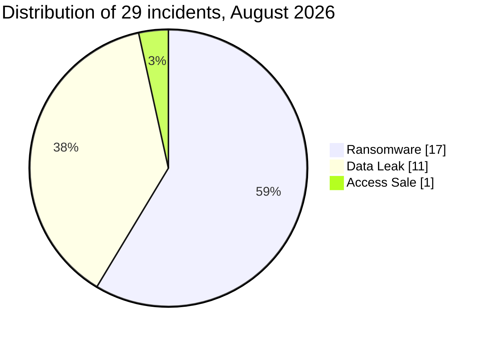

# AFRINTEL: monthly CTI report

## Cyberattacks in Africa: August 2026

👉🏾 [French version](./README_FR.md) · [Victim records](./victims.md) · [Statistics](../../../statistics/2026/08-august/README.md)

## 1. Executive summary

The AFRINTEL August 2026 corpus contains **29 documented incidents across 10 countries**: **17 ransomware incidents (58.6%)**, **11 data leaks (37.9%)** and **1 access sale (3.4%)**. South Africa accounts for **11 records (37.9%)**, followed by Egypt with **4**, then Algeria and Morocco with **3** each. Government and administration account for **7 incidents**, and finance and banking for **6**. KRYBIT is the most frequent actor label, associated with **6 ransomware publications**.

Evidence maturity varies: **13 records** carry `Claim - Data Sample Published`, **12** carry `Claim - Unverified`, **3** carry `Data Fully Published` and **1** carries `Victim Confirmed`. The Furniture Bargaining Council acknowledged server encryption. The analyses recorded for The Courier Guy, Daily Trust and the Conseil Gabonais des Chargeurs describe payment data, an account-reset workbook and internal documents containing infrastructure information, respectively. Files examined in the RAMED and DGSN/DGST cases contain sensitive identity and administrative information.

The corpus contains **13 fewer records than July (-31.0%)**. The **17 ransomware cases** are assigned to August. Some data leaks published earlier were discovered and added in August because closed monthly reports are not modified retroactively. This difference therefore measures documented collection and does not establish an equivalent decline in compromises across Africa. Operational priorities are protecting identities, administrative data and payments, and controlling access to databases and document repositories.

Case-specific facts, sources and limitations are retained in the bilingual [victims_FR.md](./victims_FR.md) / [victims.md](./victims.md) pair.

### 1.1 Month-over-month comparison

> Comparison of AFRINTEL collection corpora, with record counts and types checked in both languages. A change in documented records does not, by itself, prove a change in the real number of compromises.

| Indicator | July 2026 | August 2026 | Observed change |
|---|---|---|---|
| Total incidents | 42 | 29 | -13 (-31.0%) |
| Ransomware | 18 | 17 | -1 (-5.6%) |
| Data Leak | 18 | 11 | -7 (-38.9%) |
| Access Sale | 6 | 1 | -5 (-83.3%) |
| DDoS | 0 | 0 | 0 (stable) |
| Defacement | 0 | 0 | 0 (stable) |
| Account Takeover | 0 | 0 | 0 (stable) |
| System Intrusion | 0 | 0 | 0 (stable) |
| Malware | 0 | 0 | 0 (stable) |
| Operational Fraud | 0 | 0 | 0 (stable) |

The July baseline comes from its [French](../07-july/victims_FR.md) and [English](../07-july/victims.md) records: 42 records, comprising 18 ransomware incidents, 18 data leaks and 6 access sales. The comparison uses these matching structured values. The August corpus includes data leaks published earlier but discovered during the month; the table therefore compares closed monthly corpora and is not a time series based solely on intrusion dates.

## 2. Scope, methodology and limitations

Monitoring covers Africa’s 54 countries. This report includes the **29 records in the August folder**, following FR/EN checks of organisations, record order, countries, types, actors, domains, statuses, dates, numerical values and ransomware metadata. Sectors are normalised once from the French version, and the same data feeds both reports and the statistics. An event has one primary type among the nine AFRINTEL categories; secondary effects do not create additional records.

**Period and knowledge cutoff.** The report describes August collection, incorporating analyses and follow-up information already recorded in the victim files through **13 September 2026**. It was written on **14 September 2026**. Observations come from ransomware leak sites, forums, messaging channels, public sources and local sample analyses. The report summarises documented findings; it is not a fresh examination of raw files or a new visit to actor sites.

**Chronology.** The **17 ransomware cases** are assigned to August based on the recorded observations. Five data leaks published earlier were discovered in August: the PAYGO platform (16 January), the Egyptian Local Services Portal (5 June), Albarq (9 June), DGRSDT (8 July) and EFA (26 July). Because closed monthly reports are not reopened, these cases remain in the August discovery corpus with their initial dates preserved and are not presented as events that occurred in August. SpearFin is an 18 August ransomware publication with an actor-alleged incident date of 26 June. DGRSDT lists 8 July as the supplied incident date; Albarq lists June as the publication period, while access remains undated. FBC places the incident in August without an exact day. The actor published RAMED on 22 August. Section 3.4 provides the full timeline.

**Geographic counting.** Each record contributes to one country assignment: **29 incidents = 29 country occurrences**. The PAYGO scope is limited to the described Kenyan operations; the other markets mentioned are not added. Hungry Lion remains assigned to South Africa in line with its record, with an explicit reservation about the targeted entity and country. DGSN/DGST counts as one event despite naming two institutions. A company’s regional operations do not, by themselves, establish incidents in every country where it operates.

**Evidence and volumes.** A consistent sample can support authenticity and attribution without establishing initial access, complete extraction or official confirmation. `Data Fully Published` describes a release presented as complete; it does not validate completeness. Rows, profiles, files and individuals are not interchangeable units. No total of affected people or exfiltrated data is calculated by adding heterogeneous corpora. Impact remains unspecified for RAMED; its confidence level is `High`. No record in this corpus carries `Under Investigation - Alleged`.

## 3. Global overview

| Indicator | Value |
|---|---|
| Documented incidents | 29 |
| Country assignments | 10 |
| Normalised sectors | 16 |
| Actor / publication labels | 19 |
| Ransomware | 17 (58.6%) |
| Data Leak | 11 (37.9%) |
| Access Sale | 1 (3.4%) |

The other six canonical types are zero: DDoS, Defacement, Account Takeover, System Intrusion, Malware and Operational Fraud. Their absence from collection does not mean no such events occurred in Africa. Percentages are rounded to one decimal place and may sum to 99.9% or 100.1%.

### 3.1 Country and incident-type distribution

| Country | ISO code | Ransomware | Data Leak | Access Sale | Total | Share | Bar |
|---|---|---|---|---|---|---|---|
| 🇿🇦 South Africa | ZA | 9 | 2 | 0 | 11 | 37.9% | ███████████ |
| 🇪🇬 Egypt | EG | 2 | 2 | 0 | 4 | 13.8% | ████ |
| 🇩🇿 Algeria | DZ | 0 | 2 | 1 | 3 | 10.3% | ███ |
| 🇲🇦 Morocco | MA | 1 | 2 | 0 | 3 | 10.3% | ███ |
| 🇰🇪 Kenya | KE | 0 | 2 | 0 | 2 | 6.9% | ██ |
| 🇳🇬 Nigeria | NG | 2 | 0 | 0 | 2 | 6.9% | ██ |
| 🇨🇲 Cameroon | CM | 1 | 0 | 0 | 1 | 3.4% | █ |
| 🇬🇦 Gabon | GA | 1 | 0 | 0 | 1 | 3.4% | █ |
| 🇱🇾 Libya | LY | 0 | 1 | 0 | 1 | 3.4% | █ |
| 🇲🇺 Mauritius | MU | 1 | 0 | 0 | 1 | 3.4% | █ |
| **Total** |  | 17 | 11 | 1 | **29** | 100% |  |

Bars use a constant scale: **█ = 1 incident**. The columns cover the three observed types; the other six are zero for every country.

### 3.2 Regional distribution

| Region | Ransomware | Data Leak | Access Sale | Total | Share |
|---|---|---|---|---|---|
| North Africa | 3 | 7 | 1 | 11 | 37.9% |
| Southern Africa | 9 | 2 | 0 | 11 | 37.9% |
| West Africa | 2 | 0 | 0 | 2 | 6.9% |
| Central Africa | 2 | 0 | 0 | 2 | 6.9% |
| East Africa | 0 | 2 | 0 | 2 | 6.9% |
| Indian Ocean | 1 | 0 | 0 | 1 | 3.4% |
| **Total** | 17 | 11 | 1 | **29** | 100% |

The regional convention separates the Indian Ocean, represented here by Mauritius, from East Africa. West Africa and Central Africa remain separate. North Africa and Southern Africa each account for 11 records, together **22 of 29 (75.9%)**.

### 3.3 Evidence maturity

| Dimension | Value | Records | Share |
|---|---|---|---|
| Status | Claim - Data Sample Published | 13 | 44.8% |
| Status | Claim - Unverified | 12 | 41.4% |
| Status | Data Fully Published | 3 | 10.3% |
| Status | Victim Confirmed | 1 | 3.4% |
| **Total status** |  | 29 | 100% |
| Confidence | Low | 8 | 27.6% |
| Confidence | Medium | 7 | 24.1% |
| Confidence | High | 12 | 41.4% |
| Confidence | Very High | 2 | 6.9% |
| Confidence | Not specified | 0 | 0.0% |
| **Total confidence** |  | 29 | 100% |
| Impact | Level 1 | 0 | 0.0% |
| Impact | Level 2 | 3 | 10.3% |
| Impact | Level 3 | 7 | 24.1% |
| Impact | Level 4 | 18 | 62.1% |
| Impact | Not specified (RAMED) | 1 | 3.4% |
| **Total impact** |  | 29 | 100% |

Confidence describes the assessment recorded in a victim file and is not synonymous with victim confirmation. Impact may describe potential risk associated with the data or organisation; it does not measure an observed loss. CGC retains the structured value `High`, although its documentary analysis describes strong confidence in the documents’ origin. RAMED remains included in type and sector counts, with `High` confidence and unspecified impact.

### 3.4 Complete corpus timeline

The August reference below is the publication, source detection or AFRINTEL discovery date documented in the record. **It is not automatically the compromise date.** “Not specified” means that no initial publication date is recorded in the available material.

| No. | August reference | Victim / context | Initial publication | Incident date / period |
|---|---|---|---|---|
| 1 | 2026-08-01 (discovery) | 🇪🇬 Egyptian Local Services Portal | 2026-06-05 | Unknown |
| 2 | 2026-08-01 (publication) | 🇿🇦 SARB | 2026-08-01 | Unknown |
| 3 | 2026-08-01 (discovery) | 🇩🇿 DGRSDT | 2026-07-08 | 2026-07-08, supplied date |
| 4 | 2026-08-01 (detection) | 🇪🇬 EFA | 2026-07-26 | Unknown |
| 5 | 2026-08-02 (source detection) | 🇿🇦 Buzz Trading 104 | Not specified | Unknown |
| 6 | 2026-08-02 (source detection) | 🇳🇬 ASHA Microfinance Bank | Not specified | Unknown |
| 7 | 2026-08-02 (source detection) | 🇿🇦 DC Partner | Not specified | Unknown |
| 8 | 2026-08-04 (source detection) | 🇿🇦 Sure Travel | Not specified | Unknown |
| 9 | 2026-08-04 (source detection) | 🇪🇬 ADG Healthcare | Not specified | Unknown |
| 10 | 2026-08-05 (publication) | 🇩🇿 Ministry of Commerce | 2026-08-05 | Unknown |
| 11 | 2026-08-07 (source detection) | 🇿🇦 Serengeti Golf and Wildlife Estate | Not specified | Unknown |
| 12 | 2026-08-08 (detection) | 🇰🇪 Unidentified PAYGO platform | 2026-01-16 | Unknown |
| 13 | 2026-08-08 (detection) | 🇿🇦 mpowa.mobi | 2026-08-07 | Unknown |
| 14 | 2026-08-08 (publication) | 🇳🇬 Daily Trust | 2026-08-08 | Unknown |
| 15 | 2026-08-14 (source detection) | 🇲🇦 AVANTA Maroc | Not specified | Unknown |
| 16 | 2026-08-16 (source detection) | 🇿🇦 The Courier Guy | Not specified | Unknown |
| 17 | 2026-08-17 (publication) | 🇰🇪 SnapStar Talent | 2026-08-17 | Unknown |
| 18 | 2026-08-18 (publication) | 🇲🇺 SpearFin Ltd | 2026-08-18 | 2026-06-26, alleged |
| 19 | 2026-08-19 (source detection) | 🇿🇦 Babcock Africa | Not specified | Unknown |
| 20 | 2026-08-20 (publication) | 🇩🇿 Afribaba | 2026-08-20 | Unknown |
| 21 | 2026-08-20 (publication) | 🇨🇲 CCA Bank | 2026-08-20 | Unknown |
| 22 | 2026-08-22 (publication) | 🇲🇦 RAMED | 2026-08-22 | Unknown |
| 23 | 2026-08-24 (source detection) | 🇿🇦 Furniture Bargaining Council | Not specified | August 2026, day unknown |
| 24 | 2026-08-24 (publication) | 🇲🇦 DGSN / DGST | 2026-08-24 | Unknown |
| 25 | 2026-08-26 (source detection) | 🇪🇬 Mima Foods | Not specified | Unknown |
| 26 | 2026-08-26 (source detection) | 🇬🇦 Conseil Gabonais des Chargeurs (CGC) | Not specified | Unknown |
| 27 | 2026-08-27 (source detection) | 🇿🇦 Hungry Lion | Not specified | Unknown |
| 28 | 2026-08-27 (source detection) | 🇿🇦 Rohloff Group | Not specified | Unknown |
| 29 | 2026-08-29 (discovery) | 🇱🇾 Albarq Media Service | 2026-06-09 | Access unknown; publication in June |

Additional analyses and September checks do not create new August incidents. No compromise date is inferred from the date of an administrative document, database record or archive.

## 4. Analysis by incident type

### 4.1 Ransomware

The **17 ransomware records** cover seven countries and eight actor labels. They document publications in an extortion context; within this corpus, encryption is explicitly confirmed by the victim only for the Furniture Bargaining Council.

| Country | Victim | Group | Observation / limitation |
|---|---|---|---|
| 🇿🇦 South Africa | Buzz Trading 104 | KRYBIT | Observed listing; no supplied sample |
| 🇳🇬 Nigeria | ASHA Microfinance Bank | KRYBIT | Reviewed release, with coverage limitations |
| 🇿🇦 South Africa | DC Partner | KRYBIT | Expired deadline, no accessible data at reported check |
| 🇿🇦 South Africa | Sure Travel | Orova | Verified listing; namesake reference excluded |
| 🇪🇬 Egypt | ADG Healthcare | Orova | Verified listing; domain discrepancy recorded |
| 🇿🇦 South Africa | Serengeti Golf and Wildlife Estate | KRYBIT | Reviewed document sample |
| 🇳🇬 Nigeria | Daily Trust | Panzer | Reviewed workbook; value validity unknown |
| 🇲🇦 Morocco | AVANTA Maroc | thegentlemen | Observed publication, no supplied sample |
| 🇿🇦 South Africa | The Courier Guy | medusalocker | Reviewed payment samples |
| 🇲🇺 Mauritius | SpearFin Ltd | incransom | Visible previews; original files unavailable |
| 🇿🇦 South Africa | Babcock Africa | thegentlemen | Observed publication, no supplied data |
| 🇨🇲 Cameroon | CCA Bank | Everest | Publication and inventory; raw-file review not exhaustive |
| 🇿🇦 South Africa | Furniture Bargaining Council | Deadlock | Victim-confirmed encryption; reviewed corpus |
| 🇪🇬 Egypt | Mima Foods | KRYBIT | Expired deadline, no accessible data at reported check |
| 🇬🇦 Gabon | Conseil Gabonais des Chargeurs (CGC) | KRYBIT | Reviewed internal documents and technical information |
| 🇿🇦 South Africa | Hungry Lion | medusalocker | No sample; geographic scope ambiguous |
| 🇿🇦 South Africa | Rohloff Group | incransom | Announced disclosure; no supplied sample |

**Publications with reviewed data.** Six victim records indicate `sample-reviewed`: ASHA Microfinance Bank, Serengeti, Daily Trust, The Courier Guy, FBC and CGC. Analysis scope and coverage vary. ASHA’s directory contains **1,498 files**, including **1,101 filled with null bytes**; the tables’ **14.6 million physical lines** are not a customer count. Text analysis sampled **5,164 lines**. Serengeti’s **21 artefacts** include schedules, purchasing and booking material dated **2017 to 2020**; they do not establish recent access.

The Daily Trust sample contains **443 records** in its main worksheet, including **438 populated password fields**, and **444 distinct target-domain addresses** across both sheets. The current validity of those values has not been established. The Courier Guy material contains **1,269 payment rows**, **236 distinct accounts** and rental schedules, warranting specific attention to payment-detail substitution. FBC’s **69 artefacts** include financial, tax, HR and identity documents. CGC’s material spans several departments and includes a snapshot of its Active Directory infrastructure, without demonstrating ransomware execution in those documents.

**Previews and inventories.** SpearFin shows previews of identity, KYC and investment documents alongside a **416 GB** claim. Analysis is limited to visible material; the original files were unavailable. CCA Bank is listed by Everest; the available technical inventory describes approximately **19.04 GB**, including **11,837 files** and **17 nested archives** whose contents are not counted. This inventory is not an exhaustive review of the raw files. Large tables do not establish a total number of distinct customers.

**Deadlines and disclosure.** Follow-up information recorded on **13 September** for DC Partner and **12 September** for Mima Foods describes expired deadlines with no publicly accessible data at the latest reported checks. Exact deadlines and check times are unspecified. The cause remains unknown: negotiations or an agreement with or without payment, transfer or resale, delay, unavailability or an inaccurate claim are non-exhaustive hypotheses. None is established. For ASHA, failed negotiations are described in the supplied provenance information without independent public corroboration; negotiation, payment and resale remain `unknown`.

The “active countdown” states for Daily Trust and CCA Bank refer to the dated observations in their records, respectively the **20 August** follow-up and **20 August** observation; they do not describe the position on 14 September. Daily Trust’s countdown was visible on 11 August. Rohloff Group’s **536 GB**, **103,196 files** and **30,805 folders** remain claimed without a supplied sample. Other publications without samples do not establish what data was obtained or the operational consequences.

### 4.2 Data leaks

| Country | Records | Documented targets |
|---|---|---|
| 🇿🇦 South Africa | 2 | SARB; mpowa.mobi |
| 🇪🇬 Egypt | 2 | Egyptian Local Services Portal; EFA |
| 🇩🇿 Algeria | 2 | DGRSDT; Afribaba |
| 🇲🇦 Morocco | 2 | RAMED; DGSN / DGST |
| 🇰🇪 Kenya | 2 | Unidentified PAYGO platform; SnapStar Talent |
| 🇱🇾 Libya | 1 | Albarq Media Service |
| **Total** | **11** |  |

**Identity and administrative records.** The main RAMED file contains **1,098,685 records**, including **666,103** with a populated CIN field; **seven portraits** correspond to entries in the supplied corpus. This does not validate the claimed **more than 17 million entries** or photographs for every record. The main DGSN/DGST database contains **70,381 records**. The three supplementary files overlap with the corpus and must not be added as independent populations. These records cannot all be described as active intelligence officers.

Earlier publications discovered in August remain relevant to protecting individuals: **9,938 rows** in the Egyptian Local Services Portal sample, **1,000 records** in the DGRSDT CSV and **884 rows** after deduplicating two EFA extracts. These observations concern identity, administrative, academic or sporting data. They do not confirm the overall claimed volumes or an intrusion in August.

**Recruitment and cloud.** The reviewed mpowa.mobi export contains **2,585 CVs**, **26,675 geolocation points**, **19 user accounts** and **3 API-key entries**. These counts are established in the export; key validity and privileges cannot be inferred from appearance. SnapStar Talent contains **300 applications corresponding to 207 profiles** and six employer values. The CSV and TXT representations match, but they cover the most recent applications rather than a random sample. CV and video-interview links were not accessed; their current accessibility and the offered overall volumes remain unknown. The PAYGO case describes **27,526 rows** associated with Kenyan operations, without identifying the operator with certainty.

**Attribution gaps.** Afribaba links an offer of **642,000 contacts** to a **20-row** CSV with only two distinct order identifiers and no Algerian shipping row. Assignment to Algeria reflects the target named in the publication, without validating the sample’s geographic origin. The SARB publication describes data categories and provides links whose contents were not examined. Albarq is based on **18 visible rows**; the original file was unavailable. These limitations prevent treating all cases as authenticated complete extractions.

### 4.3 Access sale

One offer is recorded, attributed to **Florence** and targeting the **Algerian Ministry of Commerce**. The **5 August** publication advertises VPN access for **USD 500**, without showing an endpoint, account, privileges or evidence of functionality. The observed fact is the sale offer. Effective access to the ministry’s environment and any subsequent use remain unknown. The record retains `Access Sale` and `Claim - Unverified`.

## 5. Sectoral impact

| Normalised sector | Records | Share | Organisations / contexts |
|---|---|---|---|
| Government / Administration | 7 | 24.1% | Egyptian Local Services Portal; DGRSDT; Ministry of Commerce; mpowa.mobi; RAMED; DGSN / DGST; Conseil Gabonais des Chargeurs (CGC) |
| Finance / Banking | 6 | 20.7% | SARB; ASHA Microfinance Bank; DC Partner; Unidentified PAYGO platform; SpearFin Ltd; CCA Bank |
| Human Resources / Recruitment | 2 | 6.9% | AVANTA Maroc; SnapStar Talent |
| Restaurants / Quick-service restaurants | 2 | 6.9% | Hungry Lion; Rohloff Group |
| E-commerce / Retail | 1 | 3.4% | Afribaba |
| Engineering / Construction | 1 | 3.4% | Babcock Africa |
| Food manufacturing | 1 | 3.4% | Mima Foods |
| Healthcare / Medical | 1 | 3.4% | ADG Healthcare |
| Labour relations / Sector governance | 1 | 3.4% | Furniture Bargaining Council |
| Media / Publishing | 1 | 3.4% | Daily Trust |
| Plastics manufacturing / Housewares | 1 | 3.4% | Buzz Trading 104 |
| Real Estate | 1 | 3.4% | Serengeti Golf and Wildlife Estate |
| Sports / Federations | 1 | 3.4% | EFA |
| Telecommunications | 1 | 3.4% | Albarq Media Service |
| Transport / Logistics | 1 | 3.4% | The Courier Guy |
| Travel / Events | 1 | 3.4% | Sure Travel |
| **Total** | **29** | 100% |  |

Normalisation places SARB, microfinance, payment distribution, PAYGO financing and fund administration under **Finance / Banking**. DGRSDT and CGC fall under **Government / Administration**; mpowa.mobi retains its association with public youth services. ADG Healthcare falls under **Healthcare / Medical**, with pharmaceutical activity. FBC remains in labour relations and sector governance rather than being counted as a furniture manufacturer.

Government and financial sectors together account for **13 of 29 records (44.8%)**. The best-documented risks concern secondary exploitation of identity, personnel, payment and internal-process data. Babcock Africa’s critical-sector activities and the point-of-sale systems mentioned for Hungry Lion warrant targeted checks, but the records do not establish disruption to those environments.

### 5.1 Cases prioritised for operational review

The following five cases are selected from records carrying **Level 4** impact and victim confirmation or **High / Very High** confidence. This is not an exhaustive severity ranking.

| Case | Basis for priority | Defensive implication |
|---|---|---|
| Furniture Bargaining Council | Victim Confirmed, Very High; acknowledged encryption and reviewed sensitive corpus | Coordinate recovery, investigation and protection of affected individuals |
| mpowa.mobi | Data Fully Published, Very High; CVs, geolocation and API-key entries in the export | Correct data access controls and assess exposed keys |
| DGSN / DGST | Data Fully Published, High; administrative, professional and banking information | Protect personnel against impersonation and contextual targeting |
| Daily Trust | Claim - Data Sample Published, High; account-reset workbook | Identify represented accounts and secure their authentication lifecycle |
| Conseil Gabonais des Chargeurs | Claim - Data Sample Published, High; business documents and infrastructure information | Reduce document exposure and review privileged access |

## 6. Actor and publication profile

| Actor / author | Type | Records | Targets |
|---|---|---|---|
| KRYBIT | Ransomware | 6 | Buzz Trading 104 (ZA); ASHA Microfinance Bank (NG); DC Partner (ZA); Serengeti Golf and Wildlife Estate (ZA); Mima Foods (EG); Conseil Gabonais des Chargeurs (CGC) (GA) |
| Orova | Ransomware | 2 | Sure Travel (ZA); ADG Healthcare (EG) |
| exfilar | Data Leak | 2 | mpowa.mobi (ZA); SnapStar Talent (KE) |
| incransom | Ransomware | 2 | SpearFin Ltd (MU); Rohloff Group (ZA) |
| medusalocker | Ransomware | 2 | The Courier Guy (ZA); Hungry Lion (ZA) |
| thegentlemen | Ransomware | 2 | AVANTA Maroc (MA); Babcock Africa (ZA) |
| Deadlock | Ransomware | 1 | Furniture Bargaining Council (ZA) |
| Everest | Ransomware | 1 | CCA Bank (CM) |
| Florence | Access Sale | 1 | Ministry of Commerce (DZ) |
| JBT2026 | Data Leak | 1 | RAMED (MA) |
| JabaR00t | Data Leak | 1 | DGSN / DGST (MA) |
| NullSec Nigeria | Data Leak | 1 | SARB (ZA) |
| OriginalCrazyOldFart | Data Leak | 1 | Unidentified PAYGO platform (KE) |
| Panzer | Ransomware | 1 | Daily Trust (NG) |
| R3D3MPTION | Data Leak | 1 | Egyptian Local Services Portal (EG) |
| Revesky | Data Leak | 1 | EFA (EG) |
| Richard2002 | Data Leak | 1 | Albarq Media Service (LY) |
| TelephoneHooliganism | Data Leak | 1 | Afribaba (DZ) |
| anisanas2 | Data Leak | 1 | DGRSDT (DZ) |
| **Total** |  | **29** |  |

Country codes: see the ISO legend in the country table.

The **19 labels** identify authors or groups associated with publications, without establishing 19 independent operational teams. The `krybit` / `KRYBIT` case variants are harmonised for counting. `JBT2026` is counted for RAMED; in the DGSN/DGST case, the publication attributes the activity to `JabaR00t` and identifies `JBT2026` as the relay. These roles are not merged. `OriginalCrazyOldFart` is a republisher and does not claim the intrusion in the PAYGO record. FBC confirms the incident without technically attributing it to Deadlock.

KRYBIT appears across sectors and four countries: South Africa, Nigeria, Egypt and Gabon. exfilar is associated with the mpowa.mobi and SnapStar Talent publications. These links describe shared labels and publication themes; they do not prove a common initial-access method, shared infrastructure or a single campaign.

### 6.1 Country risk assessment

This assessment concerns the cases in the corpus and their sensitivity. It is not a comparative measure of national security or actual attack frequency.

| Country | Corpus risk | Rationale |
|---|---|---|
| 🇿🇦 South Africa | 🔴 High | Confirmed encryption at FBC; documented payment data and CVs |
| 🇪🇬 Egypt | 🔴 High | Reviewed administrative and sporting data; two ransomware publications with limited technical details |
| 🇩🇿 Algeria | 🔴 High | Reviewed researcher records; VPN offer; unresolved Afribaba attribution |
| 🇲🇦 Morocco | 🔴 High | Reviewed sensitive identity and personnel data; HR publication without a sample |
| 🇰🇪 Kenya | 🔴 High | Financing and recruitment data; unverified document access |
| 🇳🇬 Nigeria | 🔴 High | ASHA financial corpus and Daily Trust reset values; current scope and validity unknown |
| 🇨🇲 Cameroon | 🔴 High | Sensitive banking inventory; risk conditional on authenticity and scope |
| 🇬🇦 Gabon | 🔴 High | CGC business documents and infrastructure information; secondary-targeting risk |
| 🇱🇾 Libya | 🟠 Medium | Limited subscription-data extract; overall volume and origin unestablished |
| 🇲🇺 Mauritius | 🔴 High | KYC and investment previews; potential risk, original files unavailable |

## 7. Trends and intelligence gaps

**Observed trends.** Material examined for The Courier Guy, FBC, CGC and ASHA combines administrative data with financial, HR or technical information. A data release can therefore create several secondary risks even when acquisition remains unknown. RAMED, DGSN/DGST, DGRSDT and EFA illustrate the lasting sensitivity of identifiers and administrative documents. The mpowa.mobi and SnapStar Talent publications also show actors’ interest in application data and cloud resources; a common access vector is not demonstrated.

Differences between advertised volume and reviewed coverage are another recurring observation: null files at ASHA, repeated order identifiers at Afribaba, multiple applications per profile at SnapStar Talent and overlapping DGSN/DGST files. Published volume alone cannot determine how many people are affected.

| Priority gap | Effect on assessment | Evidence needed |
|---|---|---|
| Precise origin of the CCA Bank, Afribaba and Egyptian portal corpora | Limits system attribution and volume validation | Consistent provenance markers, metadata and an organisational response |
| Current validity of Daily Trust values and cloud-platform access | Prevents concluding that access is usable today | Internal checks by responsible owners, IAM logs and revocation history |
| PAYGO and Hungry Lion scope | Limits identification of the entity and countries actually involved | Identification of the operator, system and country-specific data |
| DC Partner and Mima Foods deadlines | Does not explain the absence of accessible disclosure | Dated public observation of the listing and any disclosure change |
| Ransomware intrusion chains and remediation | Prevents technical attribution and complete ATT&CK mapping | DFIR reporting, technical timelines, logs and detailed victim notification |

The consulted victim records do not contain public DFIR reports detailing the ransomware intrusion chains. This limited visibility is a major gap for initial access, exfiltration and remediation. Leak-site observations and sample analyses reduce some uncertainty about disclosed data without replacing that technical evidence. An organisation’s public silence does not prove payment, concealment or the absence of an incident.

## 8. MITRE ATT&CK mapping hypotheses

The following references are solely **analytical hypotheses intended to support defensive planning**. They do not demonstrate that the actors used these techniques. The underlying facts may be observed or confirmed, but their association with MITRE ATT&CK remains hypothetical without DFIR reporting that establishes the technical chains.

| Hypothetical phase | Considered technique | Source fact and hypothesis limitation |
|---|---|---|
| Impact | [T1486: Data Encrypted for Impact](https://attack.mitre.org/techniques/T1486/) | FBC: server encryption is confirmed by the victim; association with T1486 remains a hypothesis because no specific software or technical sequence is established |
| Collection | [T1213.006: Databases](https://attack.mitre.org/techniques/T1213/006/) | mpowa.mobi: reviewed Firebase export; SnapStar Talent: reviewed structured data. The collection method and Firestore access are not independently established |
| Collection | [T1530: Data from Cloud Storage](https://attack.mitre.org/techniques/T1530/) | PAYGO: bucket reported as exposed; SnapStar Talent: cloud-document links observed but not accessed. Actor use of T1530 is not demonstrated |
| Initial access | [T1078: Valid Accounts](https://attack.mitre.org/techniques/T1078/) | Algerian VPN offer and possible reuse of Daily Trust values: defensive scenario only; no successful use of valid accounts is demonstrated |

The presence of a PowerShell artefact or Active Directory diagnostics in the CGC corpus does not demonstrate malicious execution. No ATT&CK identifier in this section constitutes a technical attribution to an actor.

## 9. Recommendations by organisation type

| Organisations | Proposed action based on corpus cases |
|---|---|
| Public bodies, research organisations and federations | Restrict identity-record exports, review document-repository access and prepare protection for individuals actually represented in the data |
| Banks, microfinance and fund administrators | Map KYC, credit and payment data; verify banking-detail changes through an independent channel |
| Recruitment and youth-service platforms | Apply restrictive access rules to databases and documents, separate environments and revoke document access that is no longer needed |
| Media organisations | Replace password distribution in files with controlled reset procedures; review affected accounts and sessions |
| Logistics, real estate and sector-governance bodies | Control access to payment schedules, supplier records and HR documents; strengthen financial-request verification |
| Industry and restaurants | Check boundaries between office environments, production systems and point-of-sale systems as a preventive measure where exposure is not demonstrated |

Firebase’s official guidance recommends denying access by default, testing security rules and separating environments. A Firebase identification key does not, by itself, authorise data access; observed entries need assessment according to their service, scope and restrictions. Actually exposed secrets should be revoked through internal procedures. [Firebase reference](https://firebase.google.com/support/guides/security-checklist).

## 10. SOC and tactical recommendations

“Observed” describes only the documentary basis for a recommendation. MITRE ATT&CK identifiers cited in the actions remain defensive mapping hypotheses. Proposed alerts still require configuration and validation in the relevant environment; the corresponding behaviour was not necessarily observed at the victim.

| Qualification | Basis | Proposed monitoring or action |
|---|---|---|
| Observed | Structured exports and sensitive data in several samples | Correlate read and export volumes, identities and unusual timing; preserve database and storage logs (T1213.006, T1530) |
| Observed | Populated password fields at Daily Trust | Identify represented accounts, review resets, sessions and MFA changes; revoke affected elements according to the established scope |
| Observed | Payment information at The Courier Guy and FBC | Detect beneficiary changes and unusual urgent requests, then validate them outside the originating channel |
| Observed | Encryption acknowledged by FBC | Review EDR timelines and mass file changes; preserve evidence and verify recovery capabilities (T1486) |
| Assumption | Reuse of VPN access or exposed account values | Correlate new devices, unusual origins, dormant accounts and MFA changes; do not conclude from geolocation alone (T1078) |
| Assumption | Exploitation of CGC technical and organisational information | Review new privileged access and contextualised support requests; AD diagnostics in documents are not IoCs |
| Preventive | Reducing exposure and ransomware risk | Review cloud rules, share permissions and backups; test recovery and administrative-access segmentation |

Thresholds should account for legitimate processing, backups and business exports. Victim domains are not malicious indicators. No secret, sample link or personal identifier is published as an IoC.

## 11. Strategic recommendations

1. **Prioritise observed risks:** assign an owner to each documented exposure, establish which datasets are actually involved and coordinate technical response, individual protection and service continuity. Verify access closure and restoration internally.
2. **Observed document-concentration risks:** reduce identity, financial and HR data copies in shares, exports and staging. Review retention periods and permissions by business function.
3. **Hypotheses to investigate:** assess potential reuse of data against customers, employees and partners. Prioritise sensitive access and payment processes without treating suspected fraud or lateral movement as established fact.
4. **Prevention:** exercise recovery, identity segmentation and response to an extortion publication. Prepare shareable technical findings that improve detection without exposing individuals or internal systems.

## 12. Conclusion

August 2026 collection contains **29 documented incidents: 17 ransomware incidents, 11 data leaks and 1 access sale**. South Africa and North Africa account for the largest shares of records, while administrative, financial and personnel data dominate the described risks. Sample analyses make several exposures tangible; they do not support generalisation about volumes, vectors or technical attribution.

Defensive decisions should reflect each case’s evidence level and chronology. Consult the [French records](./victims_FR.md), their [English version](./victims.md) and the [associated statistics](../../../statistics/2026/08-august/README.md).

**AFRINTEL** · Adama ASSIONGBON, SOC & CTI Consultant · MIT licence

[AFRINTEL GitHub repository](https://github.com/Hatchepsoute/AFRINTEL)
