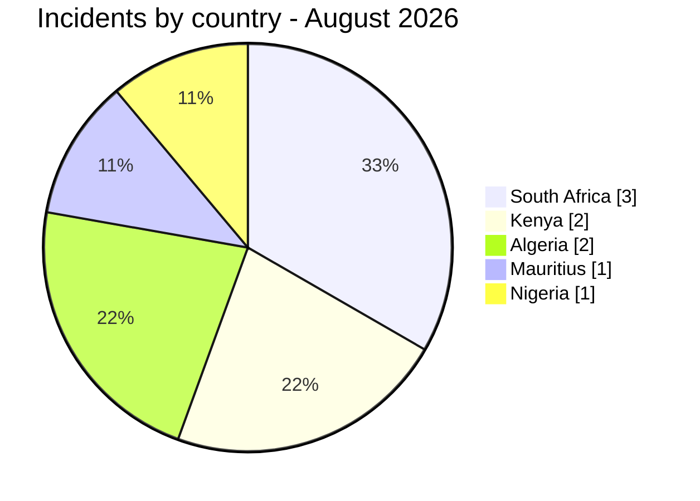
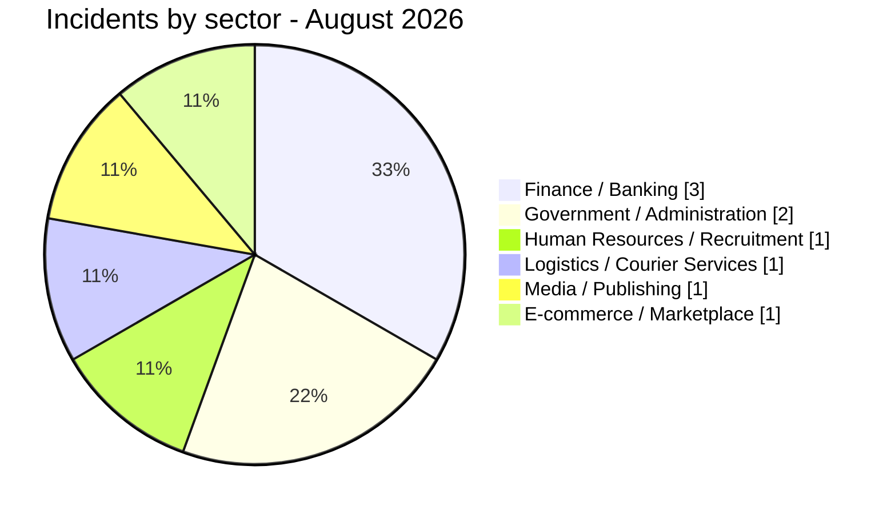

# CTI Report - Cyberattacks in Africa (August 2026)

👉🏾 [**Version française disponible ici**](./README_FR.md)

## 1. Executive summary

AFRINTEL recorded **9 incidents** involving African entities in August 2026: **3 ransomware publications**, **5 data leaks** and **1 access sale**. South Africa accounts for three incidents, Kenya for two, Algeria for two, and Mauritius and Nigeria for one each. No defacement was recorded.

- **9 incidents** across **5 countries** and **8 observed actors / sources**.
- **3 Ransomware (33.3%)**, **5 Data Leaks (55.6%)** and **1 Access Sale (12.5%)**.
- Finance / Banking accounts for **3 incidents (33.3%)**, Government / Administration for **2 (22.2%)**, and Human Resources / Recruitment, Logistics / Courier Services, Media / Publishing and E-commerce / Marketplace for **1 each (11.1%)**.
- The most consequential observations concern Daily Trust account-reset and credential material, the visible contractual, identity, KYC, corporate and financial document samples in the SpearFin ransomware publication, the alleged large-scale exposure of Kenyan recruitment records, and exposed youth CVs and API-key entries in South Africa.
- The Ministry of Commerce access sale and the South African Reserve Bank data-leak publication remain claims without independent confirmation.

### Victim list

👉🏾 [View the full victim list](./victims.md)

## 2. Methodology

- **Scope:** 54 African countries.
- **Period:** 1–31 August 2026, based on AFRINTEL detection/publication records in `victims.md`.
- **Sources:** ransomware data-leak sites, OSINT, underground forums, supplied samples and publicly exposed cloud/database material described in the source file.
- **Inclusion:** African victim, operation or data exposure with an identifiable country and organization/context.
- **Typology:** Ransomware, Data Leak, Access Sale and Defacement. A publication is not treated as confirmation unless the available evidence supports that assessment.
- `victims.md` is the single source of truth for all counts in this report.

## 3. Global overview

| Indicator | Value |
|---|---:|
| Total incidents | 9 |
| Countries affected | 5 |
| Observed actors / sources | 8 |
| Ransomware | 3 (33.3%) |
| Data Leaks | 5 (55.6%) |
| Access Sales | 1 (12.5%) |
| Defacement | 0 (0.0%) |

### Country ranking

| Country | Incidents | Distribution |
|---|---:|---|
| 🇿🇦 South Africa | 3 | ██████ 33.3% |
| 🇰🇪 Kenya | 2 | ████ 22.2% |
| 🇩🇿 Algeria | 2 | ████ 22.2% |
| 🇲🇺 Mauritius | 1 | ██ 11.1% |
| 🇳🇬 Nigeria | 1 | ██ 11.1% |

### Incident type by country

| Country | Ransomware | Data Leak | Access Sale | Defacement |
|---|---:|---:|---:|---:|
| Algeria | 0 | 1 | 1 | 0 |
| Kenya | 0 | 2 | 0 | 0 |
| Mauritius | 1 | 0 | 0 | 0 |
| Nigeria | 1 | 0 | 0 | 0 |
| South Africa | 1 | 2 | 0 | 0 |
| **Total** | **3** | **5** | **1** | **0** |

🟧 Ransomware | 🟦 Data Leaks | 🟨 Access Sales | 🟥 Defacement

### Regional distribution

| Region | Incidents |
|---|---:|
| East Africa | 3 |
| Southern Africa | 3 |
| North Africa | 2 |
| West Africa | 1 |

### Sector distribution

| Sector | Incidents | Share |
|---|---:|---:|
| Finance / Banking | 3 | 33.3% |
| Government / Administration | 2 | 22.2% |
| Human Resources / Recruitment | 1 | 11.1% |
| Logistics / Courier Services | 1 | 11.1% |
| Media / Publishing | 1 | 11.1% |
| E-commerce / Marketplace | 1 | 11.1% |

### Most prolific actors / sources

| Actor or source | Incident type | Incidents | Targets |
|---|---|---:|---|
| TelephoneHooliganism | Data leak | 1 | Afribaba (Algeria) |
| exfilar | Data Leak | 2 | SnapStar Talent; mpowa.mobi |
| Florence | Access Sale | 1 | Ministry of Commerce (Algeria) |
| incransom | Ransomware | 1 | SpearFin Ltd |
| medusalocker | Ransomware | 1 | The Courier Guy |
| NullSec Nigeria | Data Leak | 1 | South African Reserve Bank |
| OriginalCrazyOldFart | Data Leak | 1 | Unidentified Kenyan PAYGO platform |
| Panzer | Ransomware | 1 | Daily Trust |

## 4. Detailed analysis by incident type

### 4.1 Ransomware

Three separate ransomware publications were recorded. SpearFin Ltd in Mauritius was listed by incransom with a claimed 416 GB archive and a claimed leak date of 26 June 2026. The supplied screenshots display identity, KYC, corporate, administrative and financial document thumbnails presented as samples. One enlarged contractual sample is dated in June 2026, contains a Mauritius registered-office reference, a seven-figure USD capital commitment and fund-related fee and performance clauses. This visual analysis supports a medium-confidence assessment that part of the material is target-specific, but the original files were unavailable and full publication was still announced as forthcoming. Daily Trust in Nigeria was listed by Panzer with a claimed 320 GB volume and an active countdown. AFRINTEL's read-only review of the supplied workbook found 443 primary account-reset records, 438 populated password fields and 444 distinct target-domain addresses across both sheets. This provides high confidence that the sample is target-specific, but it does not establish that the values remain valid, validate the claimed volume or prove how the material was obtained. The Courier Guy in South Africa is a distinct medusalocker entry claiming 2,018 extracted emails while listing published data as “N/D”; no sample, deadline, ransom price or data release is visible. No observed evidence links the three victims or actor publications. None of the cases establishes encryption, operational disruption, complete exfiltration or independent victim confirmation.

### 4.2 Data leaks and access sales

Five data leaks and one access sale were recorded. The Afribaba case in Algeria adds a leak accompanied by a CSV sample, but the absence of an Algerian shipping row creates an attribution inconsistency. The South African entries concern an unverified publication naming the central bank and a separately reviewed exposure involving youth CVs, geolocation records, user accounts and API-key entries. The Kenyan entries concern customer-financing data associated with an unidentified PAYGO operation and a claim offering a large recruitment dataset with identity, application, CV and video-interview records. The Algerian entry is an advertised VPN access sale without independent confirmation.

## 5. Sectoral impact

Finance / Banking represents **3 of 9 incidents (33.3%)**, associated with the Kenyan PAYGO records, the South African central-bank claim and the SpearFin ransomware publication. Government / Administration represents **2 incidents (22.2%)**, covering the Algerian access-sale claim and the South African youth-services exposure. Human Resources / Recruitment, Logistics / Courier Services, Media / Publishing and E-commerce / Marketplace each represent **1 incident (11.1%)**, respectively the SnapStar Talent data-sale claim, The Courier Guy ransomware entry, the Daily Trust ransomware publication and the Afribaba leak accompanied by a geographically inconsistent CSV sample.

## 6. Threat actor profile

Seven distinct actors or publication sources are recorded. exfilar appears in two data-leak entries across Kenya and South Africa involving allegedly exposed cloud-hosted application data. incransom is associated with the SpearFin publication in Mauritius, Panzer with Daily Trust in Nigeria and medusalocker with The Courier Guy in South Africa. No available evidence links those ransomware cases, their victims or their actor publications. These observations do not establish a common intrusion chain or broader campaign relationship.

### 6.1 Risk assessment

| Country | Risk | Rationale |
|---|---|---|
| 🇰🇪 Kenya | 🔴 High | Two records involve sensitive financing data and an alleged large-scale recruitment dataset containing identity, CV and video-interview material. |
| 🇿🇦 South Africa | 🔴 High | The month includes exposed youth records and API-key entries, an unverified medusalocker claim concerning 2,018 emails at The Courier Guy, and a separate unverified claim naming the central bank. |
| 🇲🇺 Mauritius | 🔴 High | The SpearFin publication displays a detailed Mauritius-linked contractual sample and thumbnails presented as sensitive identity, KYC, corporate and financial documents; the original files, completeness and claimed volume remain unverified. |
| 🇳🇬 Nigeria | 🔴 High | The Daily Trust sample contains a target-specific account-reset structure with hundreds of populated password fields; current credential validity, acquisition method and the claimed 320 GB volume remain unverified. |
| 🇩🇿 Algeria | 🟠 Medium | Government VPN access was advertised, but the claim and access validity remain unverified. |

## 7. Key trends and intelligence gaps

- Misconfigured cloud databases and storage services remain a material exposure path.
- Recruitment data combines identity, employment, compensation and recorded-image material, increasing fraud, impersonation and privacy risks.
- The SpearFin publication illustrates third-party concentration risk in fund administration: one alleged archive may contain records concerning multiple managed entities and investors.
- The visible SpearFin contractual sample contains fund-administration, capital-commitment and fee-structure markers, but screenshot-only review cannot authenticate the underlying file or establish acquisition.
- The Daily Trust workbook illustrates the risk created by storing account-reset records and password values in spreadsheets; structural authenticity does not establish that the credentials remain current.
- exfilar appears in two observed publications involving cloud-hosted application data; the available material does not prove a shared intrusion chain.
- Intelligence gaps include the exact Kenyan PAYGO operator, the validity and privileges of the Algerian access, the authenticity and completeness of the SnapStar Talent and SpearFin material, the current validity and origin of the Daily Trust credential values, the absence of a visible sample for The Courier Guy, the central-bank claim, and whether related production environments remain exposed.

### Factual comparison with July 2026

This comparison uses the monthly victim and incident data for [July](../07-july/victims.md) and [August](./victims.md). It describes AFRINTEL's documented publications only and does not infer a change in the actual number of compromises. The residual category groups data leaks, access sales and defacement where the source report does not separate them.

| Indicator | July 2026 | August | Observed change |
| :--- | ---: | ---: | :--- |
| Documented incidents | 42 | 9 | -33 (-78.6%) |
| Ransomware / extortion | 18 | 3 | -15 |
| Other leaks, access sales or defacement | 24 | 6 | -18 |

The month-on-month variation is a change in the public record collected by AFRINTEL. It may reflect publication timing, multi-country counting rules, reposts or collection coverage, and should not be read as a confirmed change in attacker activity.

## 8. MITRE ATT&CK mapping (contextual)

| Phase | Technique | Name | Associated observation |
|---|---|---|---|
| Initial Access | T1078 | Valid Accounts | Advertised VPN access in the Algerian claim; validity not independently confirmed. |
| Collection | T1530 | Data from Cloud Storage | Cloud-hosted files are described in the Kenyan PAYGO record and the SnapStar Talent claim. |
| Collection | T1213.006 | Databases | Customer, application and candidate records were reportedly accessible in database repositories. |

These are contextual defensive mappings, not proof of the actors' complete intrusion chains. No ATT&CK technique is assigned to the SpearFin, Daily Trust or The Courier Guy entries because the available material does not establish the initial-access, collection, exfiltration or encryption method.

## 9. Recommendations

- Government and public-sector organizations: enforce phishing-resistant MFA for VPN, review privileged access and monitor impossible-travel or anomalous VPN activity.
- Cloud and application teams: deny public reads by default, continuously test Firestore/Firebase/database rules and rotate exposed API keys immediately.
- Financial and PAYGO operators: minimize exported customer fields, encrypt backups, monitor public object storage and prepare customer-notification procedures.
- Fund administrators and corporate-service providers: isolate KYC repositories, enforce least privilege, review third-party access and prepare coordinated notification procedures for affected managed entities.
- Logistics and courier operators: restrict bulk exports of contact directories, enforce phishing-resistant MFA for email and identity systems, and require out-of-band verification for sensitive requests following public exposure claims.
- Media and publishing organizations: prohibit spreadsheet-based password distribution, force-reset exposed accounts, revoke active sessions, enforce phishing-resistant MFA and protect editorial systems and source communications through segmentation and least privilege.
- Recruitment and HR platforms: segregate identity documents and recorded interviews, shorten signed-URL lifetimes, restrict bulk exports and implement privacy-focused retention controls.

## 10. SOC and tactical recommendations

- Alert on new VPN logins from unusual geographies, new devices or dormant accounts.
- Monitor cloud audit logs for anonymous reads, bulk exports, unusual enumeration and access to staging or production databases.
- Detect API-key use from new IP ranges, unexpected user agents or services outside approved workloads.
- Hunt for bulk access to candidate, customer, CV, photograph and video-interview records, including unusually high signed-URL generation or download volumes.
- Monitor KYC, document-management and file-share telemetry for unusual bulk reads, archive creation and large outbound transfers, without treating those signals alone as proof of ransomware activity.
- Monitor unusual directory exports, mailbox enumeration, forwarding-rule creation and phishing campaigns impersonating courier or logistics personnel.
- For accounts represented in exposed credential material, revoke sessions and tokens, reset credentials through a trusted channel, review identity-provider and mailbox logs, and investigate anomalous password resets, MFA changes and forwarding rules.

## 11. Strategic recommendations

Maintain an inventory of internet-exposed assets and data stores, require security review of staging and production environments, and establish recurring external-exposure assessments for government-adjacent, financial, fund-administration, recruitment, logistics and media platforms. Treat exposed personal, financial, employment and credential data as an incident requiring coordinated security, legal, privacy and affected-user protection review.

## 12. Conclusion

August 2026 contains **9 recorded incidents**: three ransomware publications, five data-leak entries and one access-sale claim. Although several publications remain unconfirmed, the sensitivity and scale of the claimed identity, credential, employment, financial and government data warrant immediate defensive validation by potentially affected organizations.

- **AFRINTEL**
[GitHub repository](https://github.com/Hatchepsoute/AFRINTEL)
