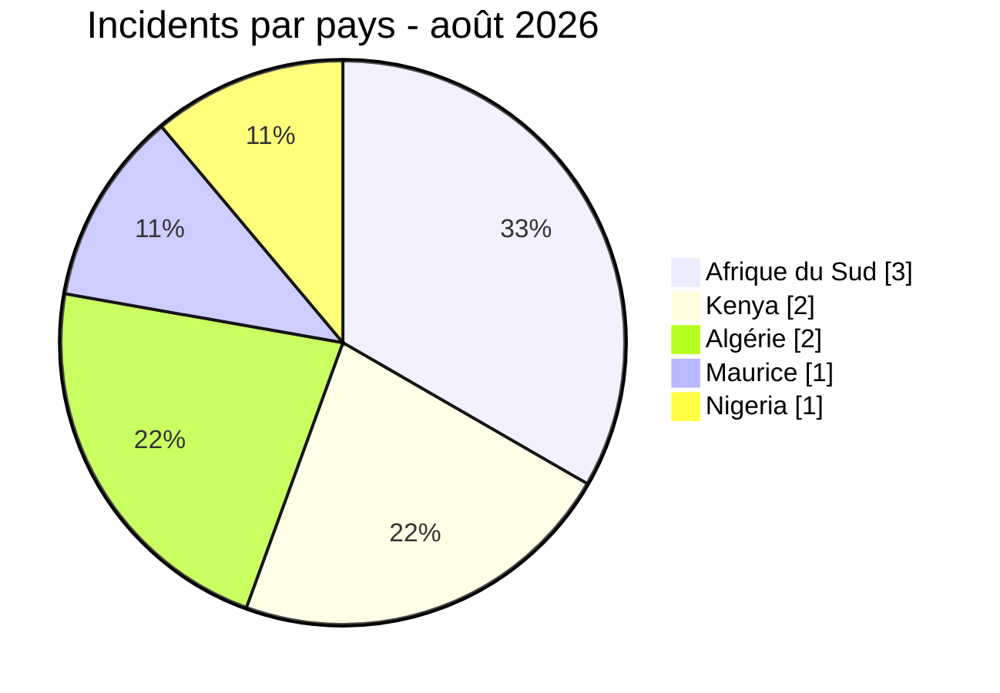
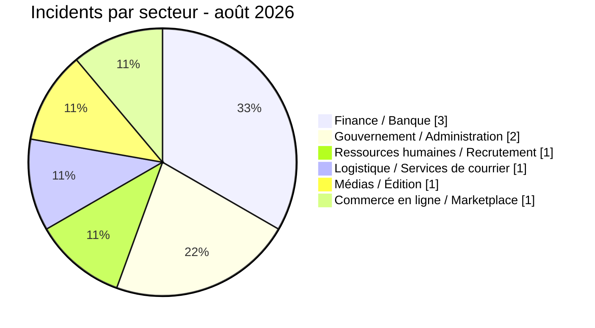

# Rapport CTI - Cyberattaques en Afrique (août 2026)

👉🏾 [**English version available here**](./README.md)

## 1. Résumé exécutif

AFRINTEL a recensé **9 incidents** concernant des entités africaines en août 2026 : **3 publications ransomware**, **5 fuites de données** et **1 vente d'accès**. L'Afrique du Sud compte trois incidents, le Kenya deux, l'Algérie deux, et Maurice et le Nigeria un chacun. Aucun défacement n'est recensé.

- **9 incidents** dans **5 pays** et **8 acteurs / sources observés**.
- **3 ransomware (33,3 %)**, **5 fuites de données (55,6 %)** et **1 vente d'accès (12,5 %)**.
- Finance / Banque représente **3 incidents (33,3 %)**, Gouvernement / Administration **2 (22,2 %)**, et Ressources humaines / Recrutement, Logistique / Services de courrier, Médias / Édition et Commerce en ligne / Marketplace **1 chacun (11,1 %)**.
- Les observations les plus importantes concernent les données de réinitialisation de comptes et d'identifiants Daily Trust, les échantillons visibles de documents contractuels, d'identité, KYC, d'entreprise et financiers dans la publication ransomware SpearFin, l'exposition alléguée à grande échelle de dossiers de recrutement kényans, ainsi que des CV de jeunes et des entrées de clés API en Afrique du Sud.
- La vente d'accès visant le ministère du Commerce et la publication concernant la South African Reserve Bank restent des revendications sans confirmation indépendante.

### Liste des victimes

👉🏾 [Voir la liste complète des victimes](./victims_FR.md)

## 2. Méthodologie

- **Périmètre :** 54 pays africains.
- **Période :** 1er–31 août 2026, selon les dates de détection/publication du fichier `victims.md`.
- **Sources :** sites de fuite ransomware, OSINT, forums clandestins, échantillons fournis et éléments de stockage cloud/base de données exposés décrits dans le fichier source.
- **Inclusion :** victime, activité ou exposition liée à l'Afrique avec pays et organisation/contexte identifiables.
- **Typologie :** Ransomware, Fuite de données, Vente d'accès et Défacement. Une publication n'est pas traitée comme une confirmation sans éléments suffisants.
- `victims.md` est la source unique de vérité pour tous les comptages de ce rapport.

## 3. Vue d'ensemble

| Indicateur | Valeur |
|---|---:|
| Total des incidents | 9 |
| Pays concernés | 5 |
| Acteurs / sources observés | 8 |
| Ransomware | 3 (33,3 %) |
| Fuites de données | 5 (55,6 %) |
| Ventes d'accès | 1 (12,5 %) |
| Défacement | 0 (0,0 %) |

### Classement par pays

| Pays | Incidents | Répartition |
|---|---:|---|
| 🇿🇦 Afrique du Sud | 3 | ██████ 33,3 % |
| 🇰🇪 Kenya | 2 | ████ 22,2 % |
| 🇩🇿 Algérie | 2 | ████ 22,2 % |
| 🇲🇺 Maurice | 1 | ██ 11,1 % |
| 🇳🇬 Nigeria | 1 | ██ 11,1 % |

### Type d'incident par pays

| Pays | Ransomware | Fuite de données | Vente d'accès | Défacement |
|---|---:|---:|---:|---:|
| Algérie | 0 | 1 | 1 | 0 |
| Kenya | 0 | 2 | 0 | 0 |
| Maurice | 1 | 0 | 0 | 0 |
| Nigeria | 1 | 0 | 0 | 0 |
| Afrique du Sud | 1 | 2 | 0 | 0 |
| **Total** | **3** | **5** | **1** | **0** |

🟧 Ransomware | 🟦 Fuites de données | 🟨 Ventes d'accès | 🟥 Défacement

### Répartition régionale

| Région | Incidents |
|---|---:|
| Afrique de l'Est | 3 |
| Afrique australe | 3 |
| Afrique du Nord | 2 |
| Afrique de l'Ouest | 1 |

### Répartition sectorielle

| Secteur | Incidents | Part |
|---|---:|---:|
| Finance / Banque | 3 | 33,3 % |
| Gouvernement / Administration | 2 | 22,2 % |
| Ressources humaines / Recrutement | 1 | 11,1 % |
| Logistique / Services de courrier | 1 | 11,1 % |
| Médias / Édition | 1 | 11,1 % |
| Commerce en ligne / Marketplace | 1 | 11,1 % |

### Acteurs / sources les plus actifs

| Acteur ou source | Type d'incident | Incidents | Cibles |
|---|---|---:|---|
| TelephoneHooliganism | Fuite de données | 1 | Afribaba (Algérie) |
| exfilar | Fuite de données | 2 | SnapStar Talent ; mpowa.mobi |
| Florence | Vente d'accès | 1 | Ministère du Commerce (Algérie) |
| incransom | Ransomware | 1 | SpearFin Ltd |
| medusalocker | Ransomware | 1 | The Courier Guy |
| NullSec Nigeria | Fuite de données | 1 | South African Reserve Bank |
| OriginalCrazyOldFart | Fuite de données | 1 | Plateforme PAYGO kényane non identifiée |
| Panzer | Ransomware | 1 | Daily Trust |

## 4. Analyse détaillée par type d'incident

### 4.1 Ransomware

Trois publications ransomware distinctes sont recensées. SpearFin Ltd à Maurice a été publiée par incransom avec une archive revendiquée de 416 Go et une date de fuite alléguée au 26 juin 2026. Les captures fournies affichent des miniatures de documents d'identité, KYC, d'entreprise, administratifs et financiers présentées comme des échantillons. Un échantillon contractuel agrandi est daté de juin 2026, contient une référence à un siège social à Maurice, un engagement de capital en USD à sept chiffres et des clauses relatives aux frais et à la performance d'un fonds. Cette analyse visuelle soutient avec un niveau de confiance moyen le caractère spécifique d'une partie des éléments, mais les fichiers originaux n'étaient pas disponibles et la publication intégrale restait annoncée comme à venir. Daily Trust au Nigeria a été publiée par Panzer avec un volume revendiqué de 320 Go et un compte à rebours actif. L'examen en lecture seule du classeur fourni par AFRINTEL a relevé 443 enregistrements principaux de réinitialisation de comptes, 438 champs de mot de passe renseignés et 444 adresses distinctes du domaine cible sur les deux feuilles. Ces éléments permettent d'évaluer avec un niveau de confiance élevé que l'échantillon est propre à la cible, sans établir que les valeurs restent valides, valider le volume revendiqué ni prouver la méthode d'acquisition. The Courier Guy en Afrique du Sud constitue une entrée medusalocker distincte revendiquant 2 018 emails extraits tout en indiquant « N/D » pour les données publiées ; aucun échantillon, échéance, prix de rançon ni téléchargement de données n'est visible. Aucun élément observé ne relie les trois victimes ou publications d'acteurs. Aucun des cas n'établit un chiffrement, une perturbation opérationnelle, une exfiltration complète ou une confirmation indépendante de la victime.

### 4.2 Fuites de données et ventes d'accès

Cinq fuites de données et une vente d'accès ont été recensées. Le cas Afribaba en Algérie ajoute une fuite accompagnée d’un échantillon CSV, mais l’absence de ligne d’expédition algérienne crée une incohérence d’attribution. Les entrées sud-africaines concernent une publication non vérifiée visant la banque centrale et une exposition distincte analysée portant sur des CV de jeunes, des données de géolocalisation, des comptes utilisateurs et des entrées de clés API. Les entrées kényanes concernent des données de financement client associées à une activité PAYGO non identifiée et une revendication proposant un important jeu de données de recrutement comprenant des identités, candidatures, CV et entretiens vidéo. L'entrée algérienne est une vente d'accès VPN annoncée sans confirmation indépendante.

## 5. Impact sectoriel

Finance / Banque représente **3 des 9 incidents (33,3 %)**, associés aux dossiers PAYGO kényans, à la revendication visant la banque centrale sud-africaine et à la publication ransomware SpearFin. Gouvernement / Administration représente **2 incidents (22,2 %)**, avec la revendication de vente d'accès en Algérie et l'exposition d'un service jeunesse en Afrique du Sud. Ressources humaines / Recrutement, Logistique / Services de courrier, Médias / Édition et Commerce en ligne / Marketplace représentent chacun **1 incident (11,1 %)**, respectivement la revendication de vente de données concernant SnapStar Talent, l'entrée ransomware The Courier Guy, la publication ransomware Daily Trust et la fuite Afribaba accompagnée d'un échantillon CSV incohérent géographiquement.

## 6. Profil des acteurs

Sept acteurs ou sources de publication distincts sont recensés. exfilar apparaît dans deux entrées de fuite de données au Kenya et en Afrique du Sud impliquant des données applicatives prétendument exposées dans le cloud. incransom est associé à la publication SpearFin à Maurice, Panzer à Daily Trust au Nigeria et medusalocker à The Courier Guy en Afrique du Sud. Aucun élément disponible ne relie ces cas ransomware, leurs victimes ou les publications de leurs acteurs. Ces observations ne permettent pas d'établir une chaîne d'intrusion commune ni une relation de campagne plus large.

### 6.1 Évaluation du risque

| Pays | Risque | Justification |
|---|---|---|
| 🇰🇪 Kenya | 🔴 Élevé | Deux entrées concernent des données sensibles de financement et un important jeu de données de recrutement allégué comprenant des identités, CV et entretiens vidéo. |
| 🇿🇦 Afrique du Sud | 🔴 Élevé | Le mois comprend des dossiers sensibles de jeunes et des entrées de clés API exposés, une revendication medusalocker non vérifiée portant sur 2 018 emails chez The Courier Guy, ainsi qu'une revendication distincte non vérifiée visant la banque centrale. |
| 🇲🇺 Maurice | 🔴 Élevé | La publication SpearFin affiche un échantillon contractuel détaillé lié à Maurice et des miniatures présentées comme des documents sensibles d'identité, KYC, d'entreprise et financiers ; les fichiers originaux, l'exhaustivité et le volume revendiqué restent non vérifiés. |
| 🇳🇬 Nigeria | 🔴 Élevé | L'échantillon Daily Trust contient une structure de réinitialisation de comptes propre à la cible avec des centaines de champs de mot de passe renseignés ; la validité actuelle des identifiants, la méthode d'acquisition et le volume revendiqué de 320 Go restent non vérifiés. |
| 🇩🇿 Algérie | 🟠 Moyen | Un accès VPN gouvernemental et une fuite Afribaba sont annoncés ; l’accès reste non vérifié et l’échantillon CSV présente une attribution géographique incohérente. |

## 7. Tendances et lacunes de renseignement

- Les bases de données et services de stockage cloud mal configurés restent une voie d'exposition importante.
- Les données de recrutement combinent identité, emploi, rémunération et images enregistrées, ce qui accroît les risques de fraude, d'usurpation et d'atteinte à la vie privée.
- La publication SpearFin illustre le risque de concentration chez les administrateurs de fonds : une seule archive alléguée peut contenir des dossiers concernant plusieurs entités gérées et investisseurs.
- L'échantillon contractuel SpearFin visible contient des marqueurs d'administration de fonds, d'engagement de capital et de structure de frais, mais une analyse limitée aux captures ne peut authentifier le fichier sous-jacent ni établir sa méthode d'acquisition.
- Le classeur Daily Trust illustre le risque créé par le stockage d'enregistrements de réinitialisation de comptes et de mots de passe dans des feuilles de calcul ; son authenticité structurelle n'établit pas que les identifiants restent actuels.
- exfilar apparaît dans deux publications observées impliquant des données applicatives hébergées dans le cloud ; les éléments disponibles ne prouvent pas une chaîne d'intrusion commune.
- Les lacunes portent sur l'opérateur PAYGO kényan exact, la validité et les privilèges de l'accès algérien, l'authenticité et l'exhaustivité des éléments SnapStar Talent et SpearFin, la validité actuelle et l'origine des valeurs d'identifiants Daily Trust, l'absence d'échantillon visible pour The Courier Guy, la revendication visant la banque centrale et l'éventuelle persistance d'expositions dans les environnements associés.

### Comparaison factuelle avec juillet 2026

Cette comparaison utilise les données mensuelles relatives aux victimes et incidents de [juillet](../07-july/victims_FR.md) et de [août](./victims_FR.md). Elle décrit uniquement les publications recensées par AFRINTEL et ne conclut pas à une variation du nombre réel de compromissions. La catégorie résiduelle regroupe les fuites de données, ventes d'accès et défacements lorsque le rapport source ne les sépare pas.

| Indicateur | juillet 2026 | août | Évolution observée |
| :--- | ---: | ---: | ---: |
| Incidents documentés | 42 | 9 | -33 (-78,6%) |
| Ransomware / extorsion | 18 | 3 | -15 |
| Autres fuites, ventes d'accès ou défacements | 24 | 6 | -18 |

La variation mensuelle reflète l'évolution des publications publiques collectées par AFRINTEL. Elle peut dépendre du calendrier de publication, des règles de comptage multi-pays, des republications ou de la couverture de collecte, et ne doit pas être interprétée comme une évolution confirmée de l'activité des attaquants.

## 8. Cartographie MITRE ATT&CK (contextuelle)

| Phase | Technique | Nom | Observation associée |
|---|---|---|---|
| Accès initial | T1078 | Valid Accounts | Accès VPN annoncé dans le cas algérien ; validité non confirmée indépendamment. |
| Collecte | T1530 | Data from Cloud Storage | Des fichiers cloud sont décrits dans le dossier PAYGO kényan et la revendication SnapStar Talent. |
| Collecte | T1213.006 | Databases | Des dossiers clients, applicatifs et candidats auraient été accessibles dans des bases de données. |

Ces correspondances sont défensives et contextuelles ; elles ne prouvent pas la chaîne complète d'intrusion des acteurs. Aucune technique ATT&CK n'est attribuée à SpearFin, Daily Trust ou The Courier Guy, car les éléments disponibles n'établissent ni la méthode d'accès initial, ni la collecte, ni l'exfiltration, ni le chiffrement.

## 9. Recommandations

- Administrations : imposer une MFA résistante au phishing pour les VPN, revoir les accès privilégiés et surveiller les connexions VPN anormales.
- Équipes cloud et applicatives : interdire les lectures publiques par défaut, tester continuellement les règles Firestore/Firebase/base de données et faire tourner immédiatement les clés API exposées.
- Opérateurs financiers et PAYGO : limiter les champs exportés, chiffrer les sauvegardes, surveiller le stockage objet public et préparer les procédures d'information des clients.
- Administrateurs de fonds et prestataires de services aux entreprises : isoler les référentiels KYC, appliquer le moindre privilège, revoir les accès tiers et préparer des procédures coordonnées de notification aux entités gérées concernées.
- Opérateurs logistiques et de courrier : restreindre les exports massifs d'annuaires de contacts, imposer une MFA résistante au phishing pour les systèmes de messagerie et d'identité, et vérifier hors bande toute demande sensible après une revendication publique d'exposition.
- Organisations de médias et d'édition : interdire la distribution de mots de passe par feuille de calcul, réinitialiser de force les comptes exposés, révoquer les sessions actives, imposer une MFA résistante au phishing et protéger les systèmes éditoriaux et les communications avec les sources par la segmentation et le moindre privilège.
- Plateformes RH et de recrutement : séparer les documents d'identité et entretiens enregistrés, raccourcir la durée des URL signées, restreindre les exports massifs et appliquer des durées de conservation respectueuses de la vie privée.

## 10. Recommandations SOC et tactiques

- Déclencher des alertes sur les connexions VPN depuis une géographie inhabituelle, un nouvel appareil ou un compte dormant.
- Surveiller les journaux cloud pour les lectures anonymes, exports massifs, énumérations et accès aux bases de préproduction ou de production.
- Détecter l'utilisation de clés API depuis de nouvelles plages IP, des user-agents inattendus ou des services non autorisés.
- Rechercher les accès massifs aux dossiers candidats et clients, CV, photographies et entretiens vidéo, notamment la génération inhabituelle d'URL signées ou des volumes anormaux de téléchargement.
- Surveiller les référentiels KYC, la gestion documentaire et les partages de fichiers pour détecter des lectures massives, créations d'archives et transferts sortants inhabituels, sans considérer ces seuls signaux comme une preuve d'activité ransomware.
- Surveiller les exports inhabituels d'annuaires, l'énumération de boîtes aux lettres, la création de règles de transfert et les campagnes de phishing usurpant du personnel logistique ou de courrier.
- Pour les comptes représentés dans des éléments d'identifiants exposés, révoquer les sessions et jetons, réinitialiser les identifiants par un canal de confiance, examiner les journaux du fournisseur d'identité et des boîtes aux lettres, et rechercher les réinitialisations de mot de passe, changements de MFA et règles de transfert anormaux.

## 11. Recommandations stratégiques

Maintenir un inventaire des actifs et stockages exposés sur Internet, imposer une revue de sécurité des environnements de préproduction et de production, et organiser des évaluations externes récurrentes pour les plateformes publiques, financières, d'administration de fonds, de recrutement, de logistique et de médias. Traiter l'exposition de données personnelles, financières, professionnelles et d'identifiants comme un incident nécessitant une revue coordonnée de sécurité, juridique, vie privée et protection des personnes concernées.

## 12. Conclusion

Août 2026 comprend **9 incidents recensés** : trois publications ransomware, cinq entrées de fuite de données et une revendication de vente d'accès. Bien que plusieurs publications restent non confirmées, la sensibilité et l'ampleur des données identitaires, d'identifiants, professionnelles, financières et gouvernementales revendiquées justifient une validation défensive immédiate par les organisations potentiellement concernées.

- **AFRINTEL**
[Dépôt GitHub](https://github.com/Hatchepsoute/AFRINTEL)
