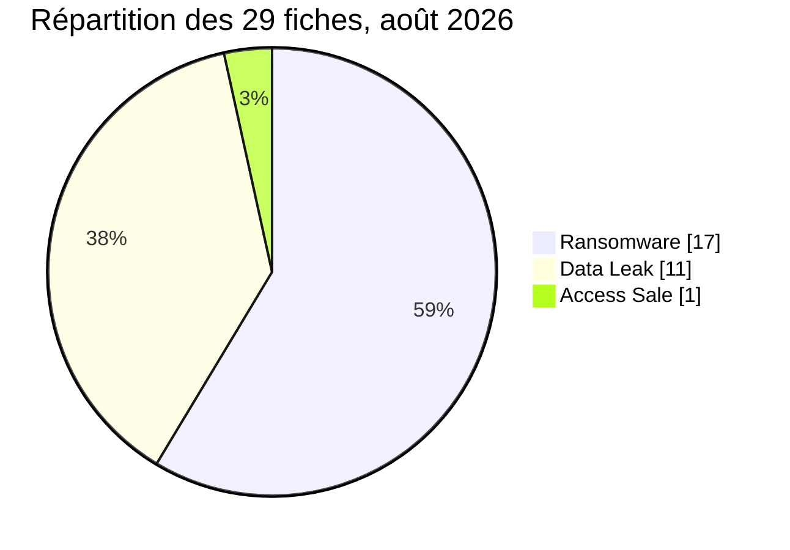

[](https://github.com/Hatchepsoute/AFRINTEL)


# AFRINTEL : rapport CTI mensuel

## Cyberattaques en Afrique : août 2026

👉🏾 [Version anglaise](./README.md) · [Fiches victimes](./victims_FR.md) · [Statistiques](../../../statistics/2026/08-august/README_FR.md)

## 1. Synthèse exécutive

Le corpus AFRINTEL d’août 2026 comprend **29 cas / observations documentés dans 10 pays** : **17 publications ou cas ransomware (58,6 %)**, **11 fuites de données (37,9 %)** et **1 vente d’accès (3,4 %)**. L’Afrique du Sud concentre **11 fiches (37,9 %)**, devant l’Égypte avec **4**, puis l’Algérie et le Maroc avec **3** chacun. Le gouvernement et l’administration représentent **6 fiches**, la finance et la banque **6**, et les ressources humaines / recrutement **3**. KRYBIT est le libellé d’acteur le plus fréquent, associé à **6 publications ransomware**. Ces proportions décrivent le corpus AFRINTEL et ne constituent pas une estimation de la fréquence réelle des cyberattaques par pays ou secteur.

La maturité des preuves est contrastée : **13 fiches** portent le statut `Claim - Data Sample Published`, **11** le statut `Claim - Unverified`, **3** le statut `Data Fully Published` et **2** le statut `Victim Confirmed`. Le Furniture Bargaining Council a reconnu un chiffrement de serveurs et DC Partner a publiquement confirmé avoir subi une attaque ransomware. Les analyses consignées pour The Courier Guy, Daily Trust et le Conseil Gabonais des Chargeurs décrivent respectivement des données de paiement, un classeur de réinitialisation de comptes et des documents internes incluant des informations d’infrastructure. Les publications relatives à RAMED et à la DGSN/DGST exposent, dans les fichiers examinés, des données d’identité et des informations administratives sensibles.

Le corpus comporte **13 fiches de moins qu’en juillet (-31,0 %)**. Les **17 cas ransomware** sont rattachés à août. **Cinq fuites de données publiées antérieurement ont été découvertes en août**, soit **5/29 fiches (17,2 % du corpus)** et **5/11 fuites de données (45,5 % de la catégorie Data Leak)**. Les rapports mensuels clôturés n’étant pas modifiés rétroactivement, cette différence mesure donc la collecte documentée et ne démontre pas une baisse équivalente des compromissions en Afrique. Les priorités opérationnelles sont la protection des identités, des données administratives et des paiements, ainsi que la maîtrise des accès aux bases et espaces documentaires.

Les faits, sources et limites propres à chaque cas sont conservés dans le couple bilingue [victims_FR.md](./victims_FR.md) / [victims.md](./victims.md).

### 1.1 Comparaison avec le mois précédent

> Comparaison des corpus de collecte AFRINTEL, avec contrôle des nombres de fiches et des types dans les deux langues. Une variation du nombre de fiches documentées ne prouve pas, à elle seule, une variation du nombre réel de compromissions.

| Indicateur | Juillet 2026 | Août 2026 | Évolution observée |
|---|---|---|---|
| Fiches documentées | 42 | 29 | -13 (-31,0 %) |
| Ransomware | 18 | 17 | -1 (-5,6 %) |
| Data Leak | 18 | 11 | -7 (-38,9 %) |
| Access Sale | 6 | 1 | -5 (-83,3 %) |
| DDoS | 0 | 0 | 0 (stable) |
| Defacement | 0 | 0 | 0 (stable) |
| Account Takeover | 0 | 0 | 0 (stable) |
| System Intrusion | 0 | 0 | 0 (stable) |
| Malware | 0 | 0 | 0 (stable) |
| Operational Fraud | 0 | 0 | 0 (stable) |

La base de juillet provient de ses [fiches françaises](../07-july/victims_FR.md) et [anglaises](../07-july/victims.md) : 42 fiches, dont 18 ransomware, 18 fuites et 6 ventes d’accès. La comparaison porte sur ces valeurs structurées concordantes. Le corpus d’août comprend des fuites publiées antérieurement mais découvertes pendant le mois ; le tableau compare donc les corpus mensuels clôturés et ne constitue pas une série chronologique des seules dates d’intrusion.

**Comparaison visuelle des corpus (█ = 1 fiche documentée) :**

```text
Juillet 2026 | ██████████████████████████████████████████ | 42
Août 2026    | █████████████████████████████ | 29
```

## 2. Périmètre et méthode

Le périmètre de veille couvre les 54 pays africains. Ce rapport retient les **29 fiches du dossier d’août**, après contrôle de parité FR/EN des champs structurés. Les secteurs sont normalisés une seule fois depuis la version française ; les mêmes données alimentent les deux rapports et les statistiques. Chaque événement reçoit un seul type principal parmi les neuf catégories AFRINTEL ; les effets secondaires ne créent pas de fiche supplémentaire. Les règles détaillées de période, de chronologie et de comptage sont présentées en section 12.

## 3. Vue globale

| Indicateur | Valeur |
|---|---|
| Fiches documentées | 29 |
| Pays de rattachement | 10 |
| Secteurs normalisés | 16 |
| Libellés d’acteur / de publication | 19 |
| Ransomware | 17 (58,6 %) |
| Data Leak | 11 (37,9 %) |
| Access Sale | 1 (3,4 %) |

Les six autres types canoniques sont à zéro : DDoS, Defacement, Account Takeover, System Intrusion, Malware et Operational Fraud. Leur absence dans la collecte ne signifie pas qu’aucun événement de ces types n’a eu lieu en Afrique. Les pourcentages sont arrondis à une décimale et peuvent totaliser 99,9 % ou 100,1 %.



### 3.1 Répartition par pays et par type

| Pays | Code ISO | Ransomware | Barre ransomware | Data Leak | Access Sale | Barre fuites / accès | Total | Part |
|---|---|---:|---|---:|---:|---|---:|---:|
| 🇿🇦 Afrique du Sud | ZA | 9 | 🟧🟧🟧🟧🟧🟧🟧🟧🟧 | 2 | 0 | 🟦🟦 | 11 | 37,9 % |
| 🇪🇬 Égypte | EG | 2 | 🟧🟧 | 2 | 0 | 🟦🟦 | 4 | 13,8 % |
| 🇩🇿 Algérie | DZ | 0 | - | 2 | 1 | 🟦🟦🟦 | 3 | 10,3 % |
| 🇲🇦 Maroc | MA | 1 | 🟧 | 2 | 0 | 🟦🟦 | 3 | 10,3 % |
| 🇰🇪 Kenya | KE | 0 | - | 2 | 0 | 🟦🟦 | 2 | 6,9 % |
| 🇳🇬 Nigeria | NG | 2 | 🟧🟧 | 0 | 0 | - | 2 | 6,9 % |
| 🇨🇲 Cameroun | CM | 1 | 🟧 | 0 | 0 | - | 1 | 3,4 % |
| 🇬🇦 Gabon | GA | 1 | 🟧 | 0 | 0 | - | 1 | 3,4 % |
| 🇱🇾 Libye | LY | 0 | - | 1 | 0 | 🟦 | 1 | 3,4 % |
| 🇲🇺 Maurice | MU | 1 | 🟧 | 0 | 0 | - | 1 | 3,4 % |
| **Total** |  | **17** | **🟧🟧🟧🟧🟧🟧🟧🟧🟧🟧🟧🟧🟧🟧🟧🟧🟧** | **11** | **1** | **🟦🟦🟦🟦🟦🟦🟦🟦🟦🟦🟦🟦** | **29** | 100 % |

**Légende des barres :** 🟧 Ransomware | 🟦 Fuites de données et ventes d’accès. Chaque carré représente une fiche ; les deux dernières catégories sont regroupées uniquement dans la barre bleue. Les six autres types canoniques sont à zéro pour chaque pays.

### 3.2 Répartition régionale

| Région | Ransomware | Data Leak | Access Sale | Total | Part | Barre |
|---|---:|---:|---:|---:|---:|---|
| Afrique du Nord | 3 | 7 | 1 | 11 | 37,9 % | ███████████ |
| Afrique australe | 9 | 2 | 0 | 11 | 37,9 % | ███████████ |
| Afrique de l’Ouest | 2 | 0 | 0 | 2 | 6,9 % | ██ |
| Afrique centrale | 2 | 0 | 0 | 2 | 6,9 % | ██ |
| Afrique de l’Est | 0 | 2 | 0 | 2 | 6,9 % | ██ |
| Océan Indien | 1 | 0 | 0 | 1 | 3,4 % | █ |
| **Total** | 17 | 11 | 1 | **29** | 100 % |  |

Barres régionales : **█ = 1 fiche**, selon le pays de rattachement de chaque fiche.

La convention régionale distingue l’océan Indien, qui regroupe ici Maurice, de l’Afrique de l’Est. L’Afrique de l’Ouest et l’Afrique centrale restent séparées. L’Afrique du Nord et l’Afrique australe représentent chacune 11 fiches, soit ensemble **22 sur 29 (75,9 %)**.

### 3.3 Maturité des preuves

| Dimension | Valeur | Fiches | Part |
|---|---|---|---|
| Statut | Claim - Data Sample Published | 13 | 44,8 % |
| Statut | Claim - Unverified | 11 | 37,9 % |
| Statut | Data Fully Published | 3 | 10,3 % |
| Statut | Victim Confirmed | 2 | 6,9 % |
| **Total statut** |  | 29 | 100 % |
| Confiance | Low | 7 | 24,1 % |
| Confiance | Medium | 7 | 24,1 % |
| Confiance | High | 13 | 44,8 % |
| Confiance | Very High | 2 | 6,9 % |
| Confiance | Non précisé | 0 | 0,0 % |
| **Total confiance** |  | 29 | 100 % |
| Impact | Level 1 | 0 | 0,0 % |
| Impact | Level 2 | 3 | 10,3 % |
| Impact | Level 3 | 7 | 24,1 % |
| Impact | Level 4 | 19 | 65,5 % |
| **Total impact** |  | 29 | 100 % |

**Répartition visuelle des preuves, de la confiance et de l’impact (█ = 1 fiche) :**

```text
Statut:
  Échantillon publié               | █████████████ 13
  Revendication non vérifiée       | ███████████ 11
  Publication complète revendiquée | ███ 3
  Victime confirmée                | ██ 2

Confiance:
  Low       | ███████ 7
  Medium    | ███████ 7
  High      | █████████████ 13
  Very High | ██ 2

Impact:
  Level 1 |  0
  Level 2 | ███ 3
  Level 3 | ███████ 7
  Level 4 | ███████████████████ 19
```

Le niveau de confiance porte sur l’évaluation de la fiche et n’est pas synonyme de confirmation par la victime. L’impact peut décrire un risque potentiel associé aux données ou à l’organisation ; il ne mesure pas une perte effectivement constatée. Pour le CGC, le champ structuré demeure `High`, même si l’analyse documentaire décrit une forte confiance dans l’origine des documents. RAMED reste inclus dans les comptes de type et de secteur, avec une confiance `High` et un impact `Level 4`.

### 3.4 Chronologie complète du corpus

Le repère d’août ci-dessous correspond à la publication, à la détection de la source ou à la découverte AFRINTEL indiquée dans la fiche. **Il ne désigne pas automatiquement la date de compromission.** « Non précisée » indique l’absence de date initiale dans les éléments consignés.

| N° | Repère d’août | Victime / contexte | Publication initiale | Date / période de l’incident |
|---|---|---|---|---|
| 1 | 2026-08-01 (découverte) | 🇪🇬 Portail des services locaux égyptiens | 2026-06-05 | Inconnue |
| 2 | 2026-08-01 (publication) | 🇿🇦 SARB | 2026-08-01 | Inconnue |
| 3 | 2026-08-01 (découverte) | 🇩🇿 DGRSDT | 2026-07-08 | 2026-07-08, date fournie |
| 4 | 2026-08-01 (détection) | 🇪🇬 EFA | 2026-07-26 | Inconnue |
| 5 | 2026-08-02 (détection source) | 🇿🇦 Buzz Trading 104 | Non précisée | Inconnue |
| 6 | 2026-08-02 (détection source) | 🇳🇬 ASHA Microfinance Bank | Non précisée | Inconnue |
| 7 | 2026-08-02 (détection source) | 🇿🇦 DC Partner | Non précisée | Août 2026, date exacte non établie ; incident ransomware confirmé par la victime le 7 août |
| 8 | 2026-08-04 (détection source) | 🇿🇦 Sure Travel | Non précisée | Inconnue |
| 9 | 2026-08-04 (détection source) | 🇪🇬 ADG Healthcare | Non précisée | Inconnue |
| 10 | 2026-08-05 (publication) | 🇩🇿 Ministère du Commerce | 2026-08-05 | Inconnue |
| 11 | 2026-08-07 (détection source) | 🇿🇦 Serengeti Golf and Wildlife Estate | Non précisée | Inconnue |
| 12 | 2026-08-08 (détection) | 🇰🇪 Plateforme PAYGO non identifiée | 2026-01-16 | Inconnue |
| 13 | 2026-08-08 (détection) | 🇿🇦 mpowa.mobi | 2026-08-07 | Inconnue |
| 14 | 2026-08-08 (publication) | 🇳🇬 Daily Trust | 2026-08-08 | Inconnue |
| 15 | 2026-08-14 (détection source) | 🇲🇦 AVANTA Maroc | Non précisée | Inconnue |
| 16 | 2026-08-16 (détection source) | 🇿🇦 The Courier Guy | Non précisée | Inconnue |
| 17 | 2026-08-17 (publication) | 🇰🇪 SnapStar Talent | 2026-08-17 | Inconnue |
| 18 | 2026-08-18 (publication) | 🇲🇺 SpearFin Ltd | 2026-08-18 | 2026-06-26, alléguée |
| 19 | 2026-08-19 (détection source) | 🇿🇦 Babcock Africa | Non précisée | Inconnue |
| 20 | 2026-08-20 (publication) | 🇩🇿 Afribaba | 2026-08-20 | Inconnue |
| 21 | 2026-08-20 (publication) | 🇨🇲 CCA Bank | 2026-08-20 | Inconnue |
| 22 | 2026-08-22 (publication) | 🇲🇦 RAMED | 2026-08-22 | Inconnue |
| 23 | 2026-08-24 (détection source) | 🇿🇦 Furniture Bargaining Council | Non précisée | Août 2026, jour inconnu |
| 24 | 2026-08-24 (publication corroborée / détection) | 🇲🇦 DGSN / DGST | 2026-08-24 | Inconnue |
| 25 | 2026-08-26 (détection source) | 🇪🇬 Mima Foods | Non précisée | Inconnue |
| 26 | 2026-08-26 (détection source) | 🇬🇦 Conseil Gabonais des Chargeurs (CGC) | Non précisée | Inconnue |
| 27 | 2026-08-27 (détection source) | 🇿🇦 Hungry Lion | Non précisée | Inconnue |
| 28 | 2026-08-27 (détection source) | 🇿🇦 Rohloff Group | Non précisée | Inconnue |
| 29 | 2026-08-29 (découverte) | 🇱🇾 Albarq Media Service | 2026-06-09 | Accès inconnu ; publication en juin |

Les analyses complémentaires et les contrôles de septembre ne créent pas de nouveaux incidents d’août. Aucune date de compromission n’est déduite de la date d’un document administratif, d’un enregistrement ou d’une archive.

## 4. Analyse par type d’incident

### 4.1 Ransomware

Les **17 fiches ransomware** concernent sept pays et huit libellés d’acteur. Elles documentent des publications dans un contexte d’extorsion. Deux victimes ont publiquement confirmé un incident ransomware dans ce corpus : le Furniture Bargaining Council et DC Partner. Le chiffrement de serveurs est explicitement confirmé uniquement par le Furniture Bargaining Council.

| Pays | Victime | Groupe | Observation / limite |
|---|---|---|---|
| 🇿🇦 Afrique du Sud | Buzz Trading 104 | KRYBIT | Fiche observée ; aucun échantillon fourni |
| 🇳🇬 Nigeria | ASHA Microfinance Bank | KRYBIT | Publication examinée, avec limites de couverture |
| 🇿🇦 Afrique du Sud | DC Partner | KRYBIT | Incident ransomware confirmé par la victime ; systèmes annoncés opérationnels ; portée des données inconnue |
| 🇿🇦 Afrique du Sud | Sure Travel | Orova | Fiche vérifiée ; référence homonyme écartée |
| 🇪🇬 Égypte | ADG Healthcare | Orova | Fiche vérifiée ; divergence de domaine documentée |
| 🇿🇦 Afrique du Sud | Serengeti Golf and Wildlife Estate | KRYBIT | Échantillon documentaire examiné |
| 🇳🇬 Nigeria | Daily Trust | Panzer | Classeur examiné ; validité des valeurs inconnue |
| 🇲🇦 Maroc | AVANTA Maroc | thegentlemen | Publication observée, sans échantillon fourni |
| 🇿🇦 Afrique du Sud | The Courier Guy | medusalocker | Échantillons de paiements examinés |
| 🇲🇺 Maurice | SpearFin Ltd | incransom | Aperçus visibles ; fichiers originaux indisponibles |
| 🇿🇦 Afrique du Sud | Babcock Africa | thegentlemen | Publication observée, sans données fournies |
| 🇨🇲 Cameroun | CCA Bank | Everest | Publication et inventaire ; examen brut non exhaustif |
| 🇿🇦 Afrique du Sud | Furniture Bargaining Council | Deadlock | Chiffrement confirmé par la victime ; corpus examiné |
| 🇪🇬 Égypte | Mima Foods | KRYBIT | Échéance dépassée, sans données accessibles au contrôle rapporté |
| 🇬🇦 Gabon | Conseil Gabonais des Chargeurs (CGC) | KRYBIT | Documents internes et informations techniques examinés |
| 🇿🇦 Afrique du Sud | Hungry Lion | medusalocker | Aucun échantillon ; portée géographique ambiguë |
| 🇿🇦 Afrique du Sud | Rohloff Group | incransom | Divulgation annoncée ; aucun échantillon fourni |

**Publications accompagnées de données examinées.** Les fiches de six victimes indiquent `sample-reviewed` : ASHA Microfinance Bank, Serengeti, Daily Trust, The Courier Guy, le FBC et le CGC. La nature et la couverture des analyses diffèrent. Chez ASHA, le dossier comprend **1 498 fichiers**, dont **1 101 remplis d’octets nuls** ; les **14,6 millions de lignes physiques** des tables ne sont pas un décompte de clients. L’analyse textuelle a échantillonné **5 164 lignes**. Chez Serengeti, les **21 artefacts** portent notamment sur des plannings, des achats et des réservations datés de **2017 à 2020** ; ils ne suffisent pas à établir un accès récent.

L’échantillon Daily Trust comprend **443 enregistrements** dans sa feuille principale, dont **438 champs de mot de passe renseignés**, et **444 adresses distinctes du domaine cible** sur les deux feuilles. La validité actuelle de ces valeurs n’a pas été établie. The Courier Guy comporte **1 269 lignes de paiement**, **236 comptes distincts** et des calendriers locatifs ; ce contenu justifie une vigilance spécifique contre la substitution de coordonnées de paiement. Au FBC, **69 artefacts** comprennent des documents financiers, fiscaux, RH et d’identité. Le CGC expose une documentation couvrant plusieurs directions et un état de son infrastructure Active Directory, sans démontrer l’exécution d’un ransomware dans ces documents.

**Aperçus et inventaires.** SpearFin présente des aperçus de documents d’identité, KYC et d’investissement, avec une revendication de **416 Go**. L’analyse est limitée aux éléments visibles ; les fichiers originaux n’étaient pas disponibles. CCA Bank est publiée par Everest ; l’inventaire technique disponible décrit environ **19,04 Go**, dont **11 837 fichiers** et **17 archives imbriquées** dont les contenus ne sont pas comptabilisés. Cet inventaire ne constitue pas une analyse exhaustive des fichiers bruts. La présence de tables volumineuses n’établit pas un nombre total de clients distincts.

**Échéances et divulgation.** Pour Mima Foods, le suivi consigné le **12 septembre** indique une échéance dépassée sans données publiquement accessibles lors du dernier contrôle rapporté. La date exacte de l’échéance et l’heure du contrôle ne sont pas précisées. La cause reste inconnue : négociation ou accord avec ou sans paiement, transfert ou revente, report, indisponibilité ou revendication inexacte sont des hypothèses non exhaustives. Aucune n’est établie. Pour DC Partner, la confirmation publique du ransomware est désormais intégrée, mais la nature et l’étendue d’une éventuelle divulgation restent inconnues. Pour ASHA, l’échec des négociations est mentionné dans les informations de provenance du corpus, sans corroboration publique indépendante ; négociation, paiement et revente restent `unknown`.

Les états « compte à rebours actif » de Daily Trust et de CCA Bank se rapportent aux observations datées dans leurs fiches, respectivement au suivi du **20 août** et à l’observation du **20 août** ; ils ne décrivent pas nécessairement l’état actuel. Le compte à rebours de Daily Trust était visible le 11 août. Pour Rohloff Group, les **536 Go**, **103 196 fichiers** et **30 805 dossiers** restent annoncés sans échantillon fourni. Les autres publications sans échantillon ne permettent pas de préciser les données obtenues ou les conséquences opérationnelles.

### 4.2 Fuites de données

| Pays | Fiches | Cibles documentées |
|---|---|---|
| 🇿🇦 Afrique du Sud | 2 | SARB; mpowa.mobi |
| 🇪🇬 Égypte | 2 | Portail des services locaux égyptiens; EFA |
| 🇩🇿 Algérie | 2 | DGRSDT; Afribaba |
| 🇲🇦 Maroc | 2 | RAMED; DGSN / DGST |
| 🇰🇪 Kenya | 2 | Plateforme PAYGO non identifiée; SnapStar Talent |
| 🇱🇾 Libye | 1 | Albarq Media Service |
| **Total** | **11** |  |

**Identités et dossiers administratifs.** Le fichier principal RAMED contient **1 098 685 enregistrements**, dont **666 103** avec un champ CIN renseigné ; **sept portraits** correspondent à des entrées du corpus fourni. Cela ne valide ni les **plus de 17 millions d’entrées** revendiquées ni la présence de photographies pour l’ensemble. La base principale DGSN/DGST comprend **70 381 enregistrements**, sans doublon de ligne exact. Les trois fichiers complémentaires sont hétérogènes : **972/1 456** lignes du fichier présenté comme DGST et **18/21** lignes de `BIG HEADS` se recoupent exactement avec le fichier principal sur la paire normalisée nom+CIN, tandis que le fichier complémentaire présenté comme DGSN ne produit aucun recoupement exact sur cette paire, malgré **209 CIN** communs. Les PPR ne concordent pas sur les correspondances nom+CIN observées. Ces éléments soutiennent l’association d’une partie significative du corpus à l’écosystème DGSN/DGST, mais ne permettent pas de traiter les quatre fichiers comme un export homogène d’un même système. Le **27 août**, le pôle DGSN-DGST a officiellement démenti toute intrusion dans ses systèmes et a attribué les données publiées à d’anciennes bases gérées par des assureurs et organismes de couverture sociale ou de santé. AFRINTEL maintient donc la provenance directe d’un SI DGSN/DGST en **Unknown / Disputed** et considère l’hypothèse d’un agrégat ou d’un repackaging comme plausible, non démontrée.

Les publications antérieures découvertes en août restent pertinentes pour la protection des personnes : **9 938 lignes** dans l’échantillon du portail des services locaux égyptiens, **1 000 enregistrements** dans le CSV DGRSDT et **884 lignes** après déduplication de deux extractions EFA. Ces observations concernent des données d’identité, administratives, universitaires ou sportives. Elles ne confirment pas les volumes globaux annoncés, ni une intrusion survenue en août.

**Recrutement et cloud.** L’export mpowa.mobi examiné comprend **2 585 CV**, **26 675 points de géolocalisation**, **19 comptes utilisateurs** et **3 entrées de clés API**. Les décomptes sont établis dans l’export ; la validité et les privilèges des clés ne se déduisent pas de leur apparence. SnapStar Talent comporte **300 candidatures correspondant à 207 profils** et six valeurs d’employeur. Les deux représentations CSV/TXT concordent, mais il s’agit des candidatures les plus récentes, sans échantillonnage aléatoire. Les liens de CV et d’entretien vidéo n’ont pas été consultés ; leur accessibilité actuelle et les volumes globaux proposés restent inconnus. Le cas PAYGO décrit **27 526 lignes** associées à des opérations kényanes, sans identification certaine de l’opérateur.

**Attributions à préciser.** Afribaba associe une offre de **642 000 contacts** à un CSV de **20 lignes** ne contenant que deux identifiants de commande distincts et aucune ligne d’expédition algérienne. Son rattachement à l’Algérie reprend la cible de la publication, sans valider l’origine géographique de l’échantillon. La publication SARB décrit des catégories de données et fournit des liens dont le contenu n’a pas été examiné. Albarq repose sur **18 lignes visibles** ; le fichier original n’était pas disponible. Ces limites empêchent de traiter tous les cas comme des extractions complètes authentifiées.

### 4.3 Vente d’accès

Une seule offre est recensée, attribuée à **Florence**, visant le **ministère algérien du Commerce**. La publication du **5 août** propose un accès VPN pour **500 USD**, sans montrer de point d’accès, de compte, de privilèges ou de preuve de fonctionnement. Le fait observé est l’offre de vente. L’accès effectif à l’environnement du ministère et une éventuelle utilisation ultérieure restent inconnus. Le cas conserve le type `Access Sale` et le statut `Claim - Unverified`.

## 5. Impact sectoriel

| Secteur normalisé | Fiches | Part | Organisations / contextes | Barre |
|---|---:|---:|---|---|
| Gouvernement / Administration | 6 | 20,7 % | Portail des services locaux égyptiens; DGRSDT; Ministère du Commerce; RAMED; DGSN / DGST; Conseil Gabonais des Chargeurs (CGC) | ██████ |
| Finance / Banque | 6 | 20,7 % | SARB; ASHA Microfinance Bank; DC Partner; Plateforme PAYGO non identifiée; SpearFin Ltd; CCA Bank | ██████ |
| Ressources humaines / Recrutement | 3 | 10,3 % | AVANTA Maroc; SnapStar Talent; mpowa.mobi | ███ |
| Restauration / Restauration rapide | 2 | 6,9 % | Hungry Lion; Rohloff Group | ██ |
| E-commerce / Retail | 1 | 3,4 % | Afribaba | █ |
| Ingénierie / Construction | 1 | 3,4 % | Babcock Africa | █ |
| Industrie agroalimentaire | 1 | 3,4 % | Mima Foods | █ |
| Santé / Médical | 1 | 3,4 % | ADG Healthcare | █ |
| Relations sociales / Gouvernance sectorielle | 1 | 3,4 % | Furniture Bargaining Council | █ |
| Médias / Édition | 1 | 3,4 % | Daily Trust | █ |
| Fabrication de plastiques / Articles ménagers | 1 | 3,4 % | Buzz Trading 104 | █ |
| Immobilier | 1 | 3,4 % | Serengeti Golf and Wildlife Estate | █ |
| Sports / Fédérations | 1 | 3,4 % | EFA | █ |
| Télécommunications | 1 | 3,4 % | Albarq Media Service | █ |
| Transport / Logistique | 1 | 3,4 % | The Courier Guy | █ |
| Voyage / Événementiel | 1 | 3,4 % | Sure Travel | █ |
| **Total** | **29** | 100 % |  |  |

Barres sectorielles : **█ = 1 fiche** attribuée au secteur normalisé.

La normalisation rattache la SARB, la microfinance, la distribution de paiements, le financement PAYGO et l’administration de fonds à **Finance / Banque**. La DGRSDT et le CGC relèvent de **Gouvernement / Administration** ; mpowa.mobi est classé dans **Ressources humaines / Recrutement** en raison de sa fonction principale de service d’emploi des jeunes, malgré son rattachement à une initiative publique. ADG Healthcare relève de **Santé / Médical**, avec une activité pharmaceutique. Le FBC reste dans les relations sociales et la gouvernance sectorielle, sans être compté comme fabricant de meubles.

La concentration gouvernementale et financière atteint **12 fiches sur 29 (41,4 %)**. Les risques les mieux documentés portent sur l’exploitation secondaire de données d’identité, de personnel, de paiement et de procédures internes. Les activités critiques décrites pour Babcock Africa ou les systèmes de point de vente cités pour Hungry Lion justifient des vérifications ciblées, mais aucune perturbation de ces environnements n’est établie dans les fiches.

### 5.1 Cas prioritaires pour la lecture opérationnelle

Les cinq cas suivants sont retenus parmi les fiches d’impact **Level 4**, avec confirmation par la victime ou confiance **High / Very High**. Cette sélection n’est pas un classement exhaustif de gravité.

| Cas | Fondement de la priorité | Conséquence défensive |
|---|---|---|
| Furniture Bargaining Council | Victim Confirmed, Very High ; chiffrement reconnu et corpus sensible examiné | Coordonner restauration, investigation et protection des personnes concernées |
| mpowa.mobi | Data Fully Published, Very High ; CV, géolocalisation et entrées de clés API présents dans l’export | Corriger les accès aux données et qualifier les clés exposées |
| DGSN / DGST | Data Fully Published au sens de la publication revendiquée ; High pour l’association d’une partie significative du corpus, mais recoupements inter-fichiers hétérogènes et provenance directe des SI officiellement contestée | Protéger les personnels contre l’usurpation tout en traitant la provenance et l’hypothèse de repackaging comme des questions ouvertes |
| Daily Trust | Claim - Data Sample Published, High ; classeur de réinitialisation de comptes | Identifier les comptes représentés et sécuriser leur cycle d’authentification |
| Conseil Gabonais des Chargeurs | Claim - Data Sample Published, High ; documents métiers et informations d’infrastructure | Réduire l’exposition documentaire et revoir les accès privilégiés |

## 6. Profil des acteurs et des publications

| Acteur / auteur | Type | Fiches | Cibles |
|---|---|---|---|
| KRYBIT | Ransomware | 6 | Buzz Trading 104 (ZA); ASHA Microfinance Bank (NG); DC Partner (ZA); Serengeti Golf and Wildlife Estate (ZA); Mima Foods (EG); Conseil Gabonais des Chargeurs (CGC) (GA) |
| Orova | Ransomware | 2 | Sure Travel (ZA); ADG Healthcare (EG) |
| exfilar | Data Leak | 2 | mpowa.mobi (ZA); SnapStar Talent (KE) |
| incransom | Ransomware | 2 | SpearFin Ltd (MU); Rohloff Group (ZA) |
| medusalocker | Ransomware | 2 | The Courier Guy (ZA); Hungry Lion (ZA) |
| thegentlemen | Ransomware | 2 | AVANTA Maroc (MA); Babcock Africa (ZA) |
| Deadlock | Ransomware | 1 | Furniture Bargaining Council (ZA) |
| Everest | Ransomware | 1 | CCA Bank (CM) |
| Florence | Access Sale | 1 | Ministère du Commerce (DZ) |
| JBT2026 | Data Leak | 1 | RAMED (MA) |
| JabaR00t | Data Leak | 1 | DGSN / DGST (MA) |
| NullSec Nigeria | Data Leak | 1 | SARB (ZA) |
| OriginalCrazyOldFart | Data Leak | 1 | Plateforme PAYGO non identifiée (KE) |
| Panzer | Ransomware | 1 | Daily Trust (NG) |
| R3D3MPTION | Data Leak | 1 | Portail des services locaux égyptiens (EG) |
| Revesky | Data Leak | 1 | EFA (EG) |
| Richard2002 | Data Leak | 1 | Albarq Media Service (LY) |
| TelephoneHooliganism | Data Leak | 1 | Afribaba (DZ) |
| anisanas2 | Data Leak | 1 | DGRSDT (DZ) |
| **Total** |  | **29** |  |

**Acteurs associés à plusieurs fiches (█ = 1 fiche) :**

```text
KRYBIT             | ██████ 6
Orova              | ██ 2
exfilar            | ██ 2
incransom          | ██ 2
medusalocker       | ██ 2
thegentlemen       | ██ 2
```

Les 13 autres libellés apparaissent une fois chacun et figurent dans le tableau complet.

Codes pays : voir la légende ISO dans le tableau des pays.

Les **19 libellés** correspondent aux auteurs ou groupes associés aux publications, sans démontrer 19 équipes opérationnelles indépendantes. La casse `krybit` / `KRYBIT` est harmonisée pour le comptage. `JBT2026` est compté pour RAMED ; dans le cas DGSN/DGST, la publication attribue l’action à `JabaR00t` et cite `JBT2026` comme relais. Ces deux rôles ne sont pas fusionnés. `OriginalCrazyOldFart` est un republicateur, sans intrusion revendiquée dans la fiche PAYGO. Le FBC confirme l’incident, sans attribuer techniquement l’attaque à Deadlock.

KRYBIT apparaît dans plusieurs secteurs et quatre pays : Afrique du Sud, Nigeria, Égypte et Gabon. exfilar est associé aux publications mpowa.mobi et SnapStar Talent. Ces rapprochements décrivent des libellés communs et des thèmes de publication ; ils ne prouvent pas un même accès initial, un partage d’infrastructure ou une campagne unique.

### 6.1 Lecture par pays des observations du corpus

Cette lecture résume les signaux présents dans les **29 fiches collectées**. Elle ne constitue ni un classement de la cybersécurité des États, ni une estimation du taux réel d’attaque par pays.

| Pays | Signal principal observé dans le corpus | Limitation principale |
|---|---|---|
| 🇿🇦 Afrique du Sud | Deux incidents ransomware confirmés par les victimes ; plusieurs expositions de données financières, RH ou opérationnelles | Forte représentation dans le corpus, sans dénominateur national permettant d’inférer un risque pays |
| 🇪🇬 Égypte | Données administratives et sportives examinées ; deux publications ransomware | Peu d’éléments techniques publics sur les chaînes d’intrusion |
| 🇩🇿 Algérie | Dossiers de chercheurs examinés ; offre de vente d’accès ; fuite Afribaba à attribution limitée | Origine et portée de plusieurs jeux restent incomplètement établies |
| 🇲🇦 Maroc | Données d’identité et administratives sensibles ; publication RAMED ; corpus DGSN/DGST | Provenance directe des SI officiellement contestée ; hétérogénéité inter-fichiers compatible avec un agrégat ou repackaging, sans preuve définitive |
| 🇰🇪 Kenya | Données de financement et de recrutement | Identification et périmètre exacts de la plateforme PAYGO restent incomplets |
| 🇳🇬 Nigeria | Corpus financier ASHA et classeur Daily Trust | Portée et validité actuelle de certaines valeurs restent inconnues |
| 🇨🇲 Cameroun | Inventaire associé à CCA Bank | Authenticité et portée complètes non établies |
| 🇬🇦 Gabon | Documents métiers et informations d’infrastructure du CGC | Chaîne d’intrusion et impact opérationnel non démontrés |
| 🇱🇾 Libye | Extrait limité de données d’abonnement Albarq | Fichier original et volume global non disponibles |
| 🇲🇺 Maurice | Aperçus KYC et d’investissement SpearFin | Fichiers originaux indisponibles et volume revendiqué non vérifié |

## 7. Tendances et lacunes de renseignement

**Tendances observées.** Les documents examinés chez The Courier Guy, le FBC, le CGC et ASHA associent des données administratives à des informations financières, RH ou techniques. Une publication de données peut donc créer plusieurs risques secondaires, même lorsque le mode d’acquisition reste inconnu. Les cas RAMED, DGSN/DGST, DGRSDT et EFA illustrent la sensibilité durable des identifiants et documents administratifs. Les publications mpowa.mobi et SnapStar Talent montrent également l’intérêt des acteurs pour les données de candidature et les ressources cloud ; le recours à un même vecteur n’est pas démontré.

Les écarts entre volume annoncé et couverture examinée constituent un autre constat transversal : fichiers nuls chez ASHA, identifiants de commande répétés chez Afribaba, candidatures multiples par profil chez SnapStar Talent et recoupements **partiels et hétérogènes** entre les fichiers DGSN/DGST. Un volume publié ne permet pas, seul, de compter les personnes touchées. Le cas DGSN/DGST montre également qu’un corpus peut contenir des données authentiquement associées à une population sans que son **système source** soit établi ; la déclaration officielle du 27 août contredit explicitement l’hypothèse d’une intrusion directe, tandis que les différences de structure et d’identifiants entre fichiers rendent plausible — sans la prouver — une agrégation ou un repackaging.

| Lacune prioritaire | Effet sur l’évaluation | Éléments nécessaires |
|---|---|---|
| Origine précise des corpus CCA Bank, Afribaba et du portail égyptien | Limite l’attribution au système et la validation des volumes | Marqueurs de provenance cohérents, métadonnées et réponse de l’organisation |
| Validité actuelle des valeurs Daily Trust et des accès liés aux plateformes cloud | Empêche de conclure à un accès exploitable aujourd’hui | Vérification interne par les responsables, journaux IAM et historique de révocation |
| Portée PAYGO et Hungry Lion | Limite l’identification de l’entité et des pays réellement concernés | Identification de l’opérateur, du système et des données propres à chaque pays |
| Échéance Mima Foods | Ne permet pas d’expliquer l’absence de publication accessible | Observation publique datée de la fiche et d’un éventuel changement de divulgation |
| Chaînes d’intrusion et remédiation des cas ransomware | Empêche une attribution technique et une cartographie ATT&CK complète | Rapport DFIR, chronologie technique, journaux et notification détaillée de la victime |

Les fiches consultées ne contiennent pas de rapport DFIR public détaillant les chaînes d’intrusion des cas ransomware. Cette visibilité limitée constitue une lacune majeure pour l’accès initial, l’exfiltration et la remédiation. Les observations des sites de fuite et les analyses d’échantillons réduisent certaines inconnues sur les données divulguées, sans remplacer ces éléments techniques. Le silence public d’une organisation ne prouve ni paiement, ni dissimulation, ni absence d’incident.

## 8. Hypothèses de correspondance MITRE ATT&CK

Les références suivantes sont uniquement des **hypothèses analytiques destinées à orienter la défense**. Elles ne démontrent pas que les acteurs ont employé ces techniques. Les faits cités comme fondement peuvent être observés ou confirmés, mais leur association à MITRE ATT&CK reste hypothétique en l’absence de rapports DFIR établissant les chaînes techniques.

| Phase hypothétique | Technique envisagée | Fait source et limite de l’hypothèse |
|---|---|---|
| Impact | [T1486 : Data Encrypted for Impact](https://attack.mitre.org/techniques/T1486/) | FBC : le chiffrement de serveurs est confirmé par la victime ; l’association à T1486 reste une hypothèse, car aucun logiciel ni déroulement technique précis n’est établi |
| Collecte | [T1213.006 : Databases](https://attack.mitre.org/techniques/T1213/006/) | mpowa.mobi : export Firebase examiné ; SnapStar Talent : données structurées examinées. La méthode de collecte et l’accès Firestore ne sont pas établis indépendamment |
| Collecte | [T1530 : Data from Cloud Storage](https://attack.mitre.org/techniques/T1530/) | PAYGO : bucket présenté comme exposé ; SnapStar Talent : liens de documents cloud observés mais non consultés. L’utilisation de T1530 par les acteurs n’est pas démontrée |
| Accès initial | [T1078 : Valid Accounts](https://attack.mitre.org/techniques/T1078/) | Offre VPN algérienne et éventuelle réutilisation des valeurs Daily Trust : scénario défensif uniquement ; aucun emploi réussi de comptes valides n’est démontré |

La présence d’un artefact PowerShell ou de diagnostics Active Directory dans le corpus CGC ne démontre pas une exécution malveillante. Aucun identifiant ATT&CK de cette section ne constitue une attribution technique aux acteurs.

## 9. Recommandations par type d’organisation

| Organisations | Action proposée à partir des cas du corpus |
|---|---|
| Administrations, organismes de recherche et fédérations | Restreindre les exports de dossiers d’identité, examiner les accès aux répertoires documentaires et préparer la protection des personnes dont les données sont effectivement représentées |
| Banques, microfinance et administrateurs de fonds | Cartographier les données KYC, de crédit et de paiement ; vérifier tout changement de coordonnées bancaires par un canal indépendant |
| Plateformes de recrutement et de services jeunesse | Appliquer des règles d’accès restrictives aux bases et documents, séparer les environnements et révoquer les accès documentaires devenus inutiles |
| Médias | Remplacer la circulation de mots de passe dans des fichiers par un processus de réinitialisation contrôlé ; examiner les comptes concernés et les sessions |
| Logistique, immobilier et organismes de gouvernance sectorielle | Contrôler les accès aux calendriers de paiement, dossiers fournisseurs et documents RH ; renforcer la validation des demandes financières |
| Industrie et restauration | Vérifier les frontières entre environnements bureautiques, systèmes de production et points de vente, à titre préventif lorsque l’exposition n’est pas démontrée |

Pour Firebase, la documentation officielle recommande de refuser les accès par défaut, de tester les règles de sécurité et de séparer les environnements. Une clé d’identification Firebase ne confère pas, à elle seule, l’autorisation d’accéder aux données ; les entrées observées doivent être qualifiées selon leur service, leur portée et leurs restrictions. Les secrets effectivement exposés doivent être révoqués selon le processus interne. [Référence Firebase](https://firebase.google.com/support/guides/security-checklist).

## 10. Recommandations SOC et tactiques

« Observé » qualifie ici uniquement le fondement documentaire de la recommandation. Les identifiants MITRE ATT&CK cités dans les actions restent des hypothèses de correspondance défensive. Les alertes proposées restent à configurer et à valider dans les environnements concernés ; leur comportement n’a pas nécessairement été observé chez la victime.

| Qualification | Fondement | Surveillance ou action proposée |
|---|---|---|
| Observé | Exports structurés et données sensibles dans plusieurs échantillons | Corréler les volumes de lecture et d’export, les identités utilisées et les horaires inhabituels ; conserver les journaux de bases et de stockage (T1213.006, T1530) |
| Observé | Champs de mot de passe renseignés chez Daily Trust | Identifier les comptes représentés, examiner réinitialisations, sessions et modifications MFA ; révoquer les éléments concernés selon le périmètre établi |
| Observé | Données de paiement chez The Courier Guy et le FBC | Détecter les changements de bénéficiaire et demandes urgentes anormales, puis les valider hors du canal à l’origine de la demande |
| Observé | Chiffrement reconnu par le FBC | Examiner la chronologie EDR et les modifications massives de fichiers ; préserver les traces et vérifier les capacités de restauration (T1486) |
| Hypothèse | Réutilisation d’un accès VPN ou de valeurs de compte exposées | Corréler nouvel appareil, origine inhabituelle, compte dormant et changement MFA ; ne pas conclure sur la seule géolocalisation (T1078) |
| Hypothèse | Exploitation des informations techniques et organisationnelles du CGC | Examiner les nouveaux accès privilégiés et les demandes de support contextualisées ; les diagnostics AD présents dans les documents ne sont pas des IoC |
| Préventif | Réduction de l’exposition et du risque ransomware | Contrôler les règles cloud, les droits sur les partages et les sauvegardes ; tester la restauration et le cloisonnement des accès administratifs |

Les seuils doivent être adaptés aux traitements légitimes, aux sauvegardes et aux exports métiers. Les domaines des victimes ne constituent pas des indicateurs malveillants. Aucun secret, lien d’échantillon ou identifiant personnel n’est publié comme IoC.

## 11. Recommandations stratégiques

1. **Priorité aux risques observés :** attribuer un responsable à chaque exposition documentée, déterminer les jeux réellement concernés et organiser conjointement la réponse technique, la protection des personnes et la continuité de service. Mesurer la fermeture des accès et la restauration par des vérifications internes.
2. **Risques observés de concentration documentaire :** réduire les copies de données d’identité, financières et RH dans les partages, les exports et la préproduction. Revoir les durées de conservation et les droits selon les fonctions métier.
3. **Hypothèses à instruire :** examiner les risques de réutilisation des données contre les clients, employés et partenaires. Prioriser les accès sensibles et les circuits de paiement, sans traiter une hypothèse de fraude ou de mouvement latéral comme un fait établi.
4. **Prévention :** exercer la restauration, le cloisonnement des identités et la réponse à une publication d’extorsion. Préparer un retour technique partageable qui permette d’améliorer les détections sans exposer les personnes ni les systèmes internes.

## 12. Limites méthodologiques, contrôles et conclusion

### 12.1 Périmètre, période et règles de classement

Le rapport décrit la collecte d’août, enrichie par les analyses et suivis déjà consignés dans les fiches jusqu’au **13 septembre 2026**. Les observations proviennent de sites de fuite ransomware, de forums, de canaux de messagerie, de sources publiques et d’analyses locales d’échantillons. Le rapport reprend les résultats documentés ; il ne constitue pas une nouvelle expertise des fichiers bruts ni une nouvelle visite des sites des acteurs.

Les **17 cas ransomware** sont rattachés à août selon les observations consignées. Cinq fuites de données publiées antérieurement ont été découvertes en août : la plateforme PAYGO (16 janvier), le portail des services locaux égyptiens (5 juin), Albarq (9 juin), la DGRSDT (8 juillet) et l’EFA (26 juillet). Les rapports mensuels déjà clôturés n’étant pas réouverts, ces cas restent dans le corpus de découverte d’août, avec leur date initiale conservée, sans être transformés en événements survenus en août. SpearFin est une publication ransomware du 18 août assortie d’une date d’incident alléguée au 26 juin. La DGRSDT mentionne le 8 juillet comme date d’incident fournie ; Albarq mentionne juin comme période de publication, l’accès restant non daté. Le FBC situe l’incident en août, sans jour exact. RAMED a été publié par l’acteur le 22 août. La chronologie détaillée du corpus figure en section 3.4.

Chaque fiche contribue à un seul pays de rattachement : **29 fiches = 29 occurrences pays**. Le périmètre PAYGO est limité à la partie kényane décrite ; les autres marchés cités ne sont pas ajoutés. Hungry Lion est rattaché à l’Afrique du Sud conformément à sa fiche, avec une réserve explicite sur l’entité et le pays visés. DGSN/DGST compte pour un événement, malgré la mention de deux institutions. Les activités régionales d’une entreprise ne constituent pas, à elles seules, des incidents dans chaque pays où elle opère.


- **Corpus non exhaustif.** Les 29 fiches représentent les observations effectivement collectées, conservées et analysées par AFRINTEL pour ce dossier. Elles ne constituent pas un recensement exhaustif de toutes les cyberattaques survenues ou publiquement signalées en Afrique pendant la période.
- **Biais de collecte.** Les sites de fuite ransomware, forums et canaux criminels surreprésentent mécaniquement les événements rendus publics par des acteurs d’extorsion ou de fuite. Les parts par pays, secteur ou acteur décrivent donc le corpus, pas un taux d’incidence national ou sectoriel.
- **Niveaux de preuve hétérogènes.** Une revendication d’acteur, un échantillon cohérent, une publication présentée comme complète et une confirmation par la victime sont des niveaux de preuve différents. `Data Fully Published` qualifie l’état de publication revendiqué, pas la confirmation d’une intrusion ni l’exhaustivité réelle du corpus.
- **Chronologies distinctes.** Date de compromission, date de publication criminelle, date de découverte AFRINTEL et date de confirmation publique peuvent différer. Le rattachement mensuel suit les règles de collecte décrites en section 12.1 et ne transforme pas une date de découverte en date d’intrusion.
- **Confiance et impact.** Le niveau de confiance porte sur l’évaluation propre à la fiche et peut concerner l’authenticité ou l’association d’un corpus sans confirmer son système source. Le niveau d’impact peut refléter un **risque potentiel** lié à la sensibilité des données ou au rôle de l’organisation ; il ne mesure pas nécessairement une perte opérationnelle observée.
- **Volumes et personnes touchées.** Lignes, profils, fichiers, documents, comptes et personnes ne sont pas des unités interchangeables. Les volumes annoncés par les acteurs ne sont pas additionnés pour produire un nombre global de personnes affectées.
- **État des connaissances.** Le rapport intègre les informations consignées jusqu’au **13 septembre 2026** et les corrections de corroboration documentées lors de la revue éditoriale. Les statuts peuvent évoluer avec de nouvelles confirmations, démentis, notifications réglementaires ou analyses techniques.

Ces limites doivent accompagner toute réutilisation des graphiques et pourcentages du rapport. En particulier, les distributions géographiques et sectorielles ne doivent pas être interprétées comme une mesure comparative du « risque cyber » des pays africains.

### 12.2 Contrôles de cohérence

- **Types :** 17 Ransomware + 11 Data Leak + 1 Access Sale = **29**.
- **Statuts :** 13 `Claim - Data Sample Published` + 11 `Claim - Unverified` + 3 `Data Fully Published` + 2 `Victim Confirmed` = **29**.
- **Confiance :** 7 `Low` + 7 `Medium` + 13 `High` + 2 `Very High` = **29**.
- **Impact :** 3 `Level 2` + 7 `Level 3` + 19 `Level 4` = **29**.
- **Géographie :** 29 fiches = 29 occurrences pays, réparties sur **10 pays**.
- **Secteurs :** 16 catégories normalisées = **29 fiches**.
- **Backfill :** 5 publications antérieures découvertes en août, toutes classées `Data Leak`.
- **Parité bilingue :** 29 fiches FR = 29 fiches EN, avec les champs structurés harmonisés.

### 12.3 Conclusion

La collecte d’août 2026 rassemble **29 cas / observations documentés : 17 publications ou cas ransomware, 11 fuites de données et 1 vente d’accès**. L’Afrique du Sud et l’Afrique du Nord concentrent les fiches, tandis que les données administratives, financières et de personnel dominent les risques décrits. Les analyses d’échantillons rendent plusieurs expositions tangibles ; elles ne permettent pas de généraliser les volumes, les vecteurs ou les attributions techniques.

Les décisions défensives doivent tenir compte du niveau de preuve propre à chaque cas et de sa chronologie. Consulter les [fiches françaises](./victims_FR.md), leur [version anglaise](./victims.md) et les [statistiques associées](../../../statistics/2026/08-august/README_FR.md).


**AFRINTEL** · Adama ASSIONGBON, Consultant SOC & CTI · Licence MIT

[Dépôt GitHub AFRINTEL](https://github.com/Hatchepsoute/AFRINTEL)
