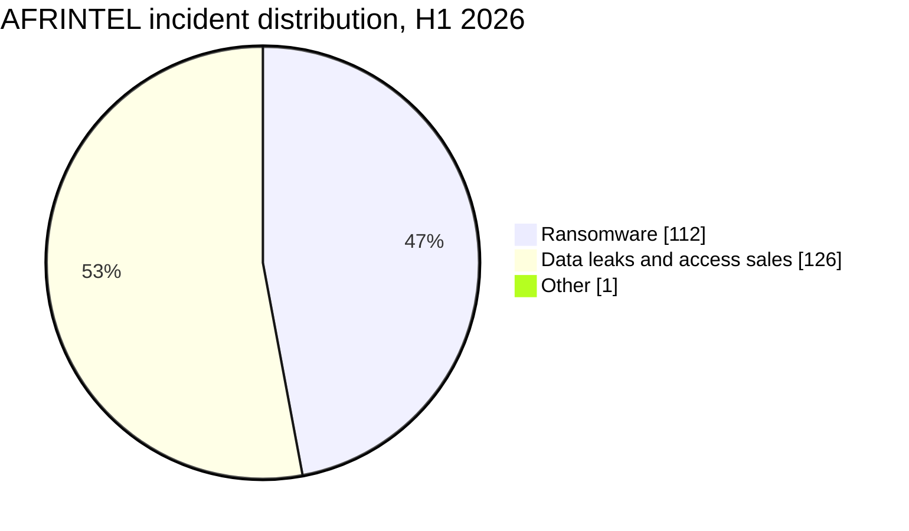
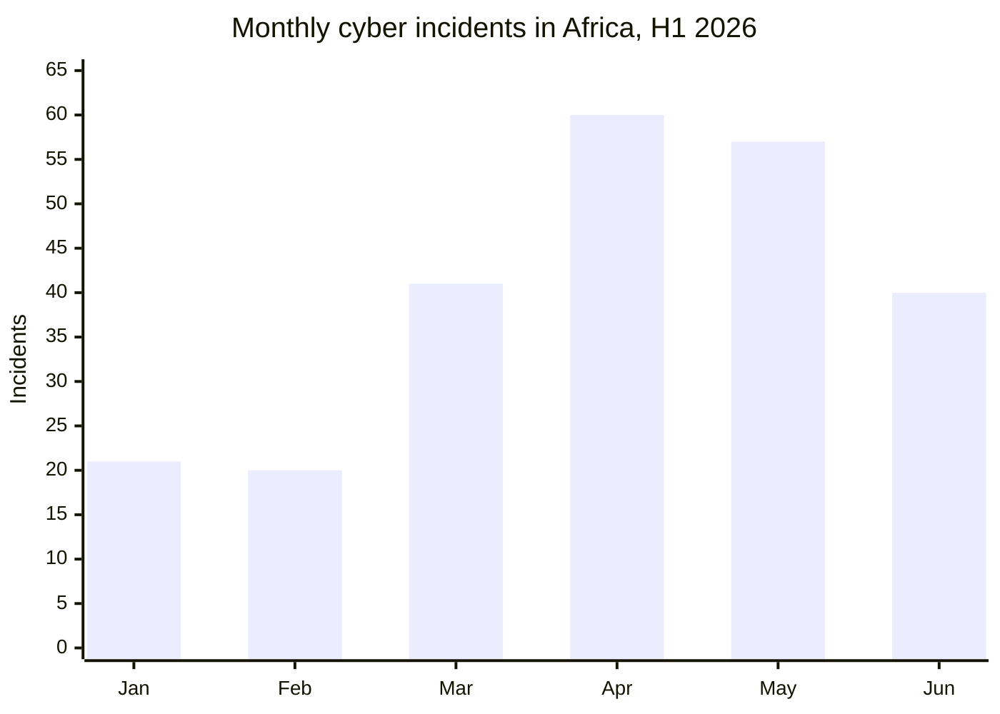
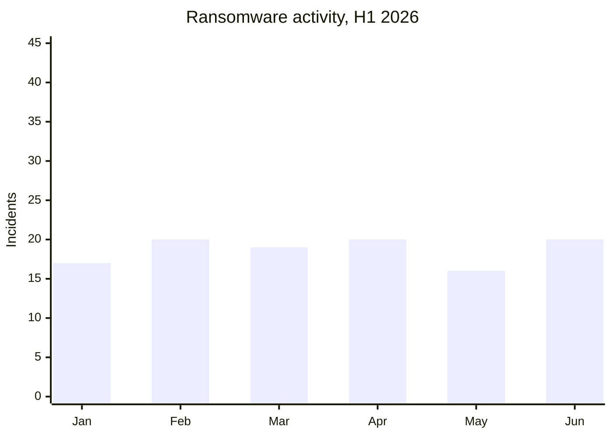
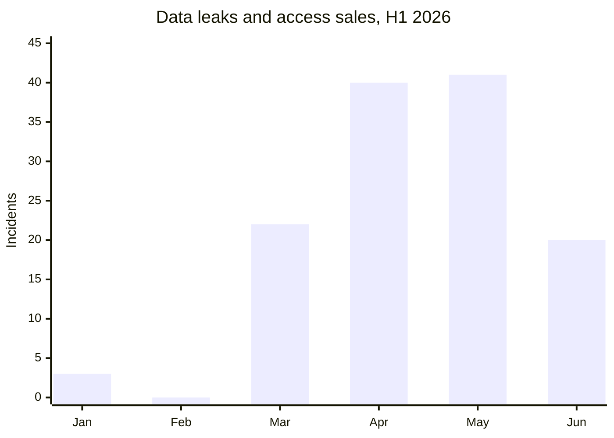

# AFRINTEL first-half cyber threat report

## January to June 2026

👉🏾 [Version française](./README_H1_FR.md)

TLP:CLEAR, public distribution

## 1. Executive summary

AFRINTEL documented **239 Africa-related cyber incidents** during the first half of 2026: **112 ransomware incidents**, **126 data leaks or access sales**, and **1 website defacement**.

Data leaks and access sales represented **52.7%** of all recorded activity, slightly exceeding ransomware at **46.9%**. When the single defacement is excluded, the two principal AFRINTEL categories account for 238 incidents: 47.1% ransomware and 52.9% data leaks or access sales.

Activity accelerated sharply during the second quarter. April and May alone accounted for **117 incidents**, or **49.0%** of the semester. June recorded fewer incidents than both April and May, but ransomware returned to parity with data leaks at 20 incidents each.

## 2. Methodology and scope

- **Geographic scope:** African victims, institutions, operations or affected datasets.
- **Period:** 1 January to 30 June 2026.
- **Single sources of truth:** the six monthly `victims.md` files.
- **Ransomware:** incidents attributed to a ransomware group, without assuming encryption when no supporting evidence is available.
- **Data leaks and access sales:** published or sampled datasets, database sales, credential sales and access offers.
- **Other:** one January website-defacement incident outside the two principal categories.
- **Confidence:** criminal publications remain claims unless independently confirmed. Analysed data or samples may support the credibility of an exposure without proving the initial access vector.

Source files: [January](./01-january/victims.md), [February](./02-february/victims.md), [March](./03-march/victims.md), [April](./04-april/victims.md), [May](./05-may/victims.md), [June](./06-june/victims.md).

## 3. Semester overview

| Indicator | Value |
|---|---:|
| Total documented incidents | 239 |
| Ransomware | 112 |
| Data leaks / access sales | 126 |
| Other, website defacement | 1 |
| Highest-volume month | April, 60 incidents |
| Second-highest month | May, 57 incidents |
| Lowest-volume month | February, 20 incidents |

## 4. Monthly evolution

| Month | Ransomware | Data leaks / access sales | Other | Total | Monthly share |
|---|---:|---:|---:|---:|---:|
| January | 17 | 3 | 1 | 21 | 8.8% |
| February | 20 | 0 | 0 | 20 | 8.4% |
| March | 19 | 22 | 0 | 41 | 17.2% |
| April | 20 | 40 | 0 | 60 | 25.1% |
| May | 16 | 41 | 0 | 57 | 23.8% |
| June | 20 | 20 | 0 | 40 | 16.7% |
| **H1 2026** | **112** | **126** | **1** | **239** | **100%** |

### Ransomware and leak evolution

## 5. Quarter comparison

| Period | Ransomware | Data leaks / access sales | Other | Total |
|---|---:|---:|---:|---:|
| Q1, January to March | 56 | 25 | 1 | 82 |
| Q2, April to June | 56 | 101 | 0 | 157 |
| **H1 2026** | **112** | **126** | **1** | **239** |

Q2 recorded **75 more incidents than Q1**, an increase of **91.5%**. Ransomware volume remained stable at 56 incidents in each quarter. Data leaks and access sales rose from 25 in Q1 to 101 in Q2, an increase of **304%**.

## 6. Key CTI findings

1. **Ransomware remained persistent rather than continuously accelerating.** Monthly volume stayed between 16 and 20 incidents.
2. **Data leaks became the principal volume driver in Q2.** April and May recorded 81 leaks or access sales, compared with 25 during the entire first quarter.
3. **June changed the balance without returning to Q1 conditions.** Total volume declined after the April-May peak, but ransomware returned to 50% of monthly incidents.
4. **Claim status must remain visible.** Ransomware listings without accessible published data remain claims, not confirmed encryption or publication.
5. **Observed data strengthens exposure assessments, not intrusion attribution.** Dataset analysis can establish structure, sensitivity and potential impact while the initial access vector remains unknown.

## 7. Intelligence limitations

- January contains a historical discrepancy: the monthly report records 17 ransomware incidents while the statistics file records 18.
- Review of the January cards supports 17 ransomware incidents, 2 data leaks, 1 access sale and 1 defacement.
- March contains two XP95 entries with ransomware-group fields but database-sale characteristics. The published distribution, 19 ransomware and 22 leaks or sales, is retained.
- This report counts incidents, not unique persons, records, files or systems.
- A multi-country incident counts once in the global total.
- Public claims may later be confirmed, withdrawn, duplicated or reclassified.

## 8. SOC and defensive priorities

- Prioritize identity, VPN, email, cloud-storage and privileged-account telemetry.
- Monitor ransomware listings separately from confirmed encryption and confirmed publication.
- Detect unusual bulk exports, database dumps and public-cloud object exposure.
- Enforce MFA for government, education, financial and healthcare portals.
- Establish rapid credential revocation workflows for leaked government and military accounts.
- Normalize actor names across months to avoid duplicate counts.
- Preserve the original claim date, AFRINTEL discovery date and publication date.

## 9. Strategic outlook

The first half of 2026 shows two parallel risks. Ransomware maintained a stable operational baseline, while data leaks and access sales expanded sharply during Q2. The semester should not be described as a simple ransomware wave. The more significant structural change was the growth of data brokerage, credential exposure and publication of structured datasets.

For the second half of 2026, AFRINTEL should monitor whether the June 50/50 distribution becomes a sustained ransomware recovery or remains a temporary correction after the April-May leak peak.

## 10. Conclusion

AFRINTEL recorded **239 incidents during H1 2026**: **112 ransomware**, **126 data leaks or access sales**, and **1 defacement**. Q2 accounted for nearly two-thirds of semester activity, and all net growth over Q1 came from leaks and access sales.

The defensive priority is dual: maintain ransomware readiness while strengthening controls against credential exposure, bulk data extraction, cloud-storage exposure and underground data sales.

---

**AFRINTEL**  
Open African CTI Monitoring Initiative  
[GitHub repository](https://github.com/Hatchepsoute/AFRINTEL)
