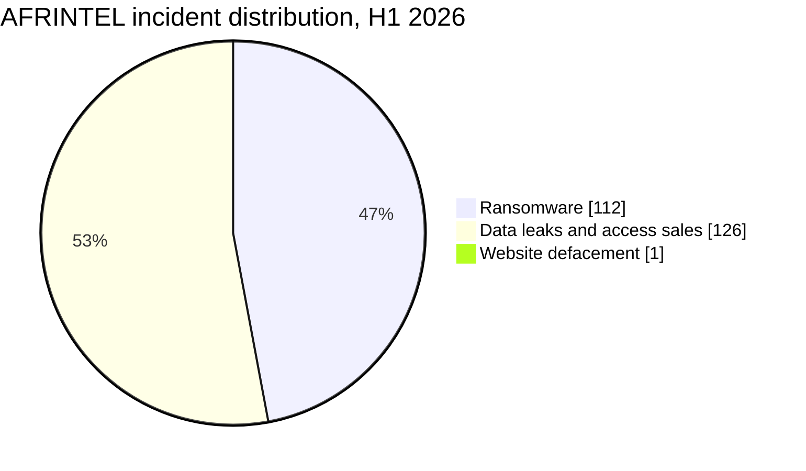
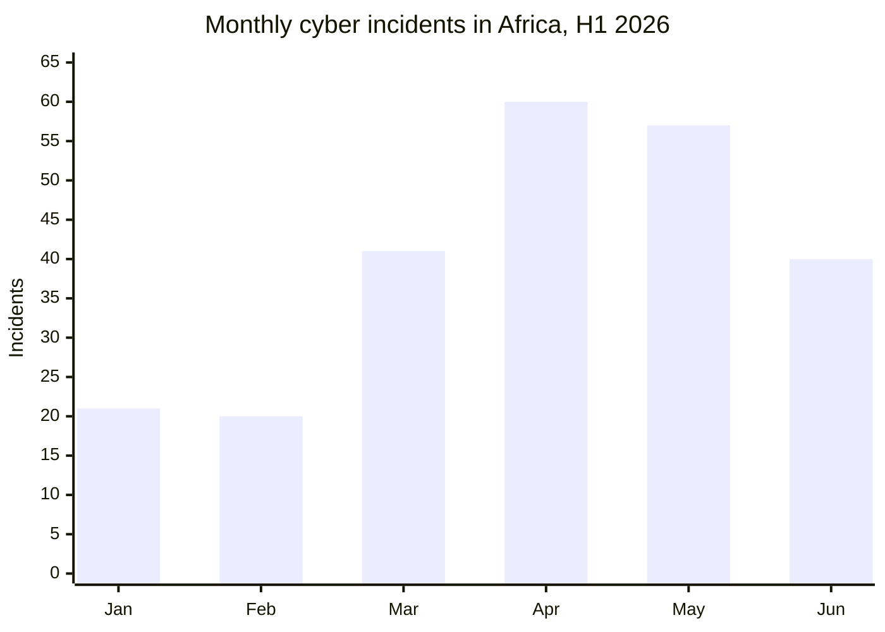
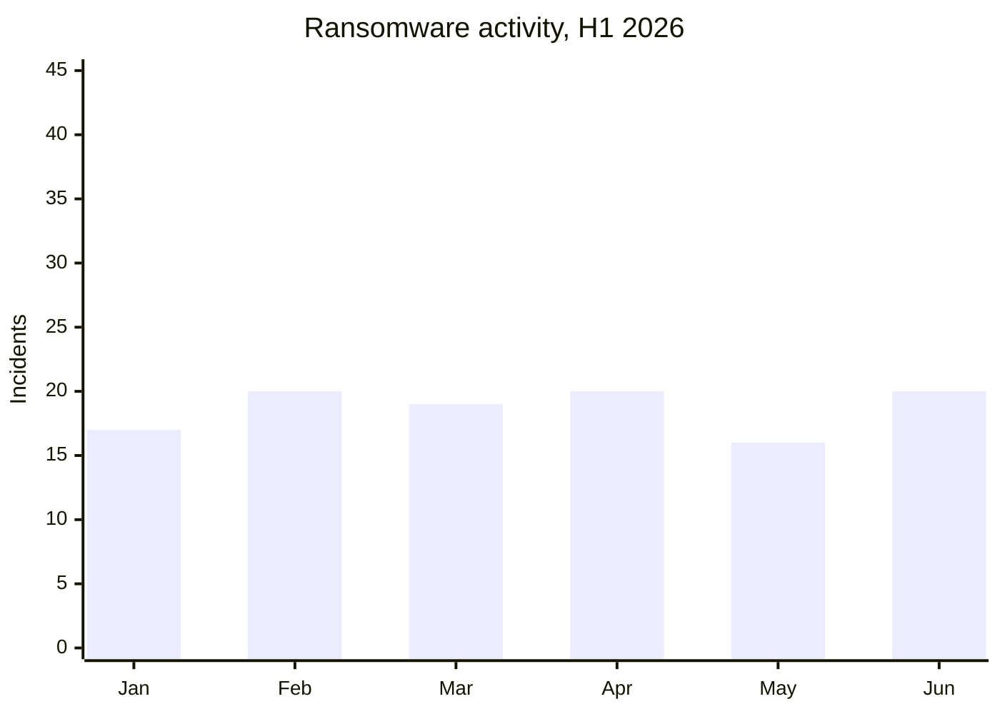
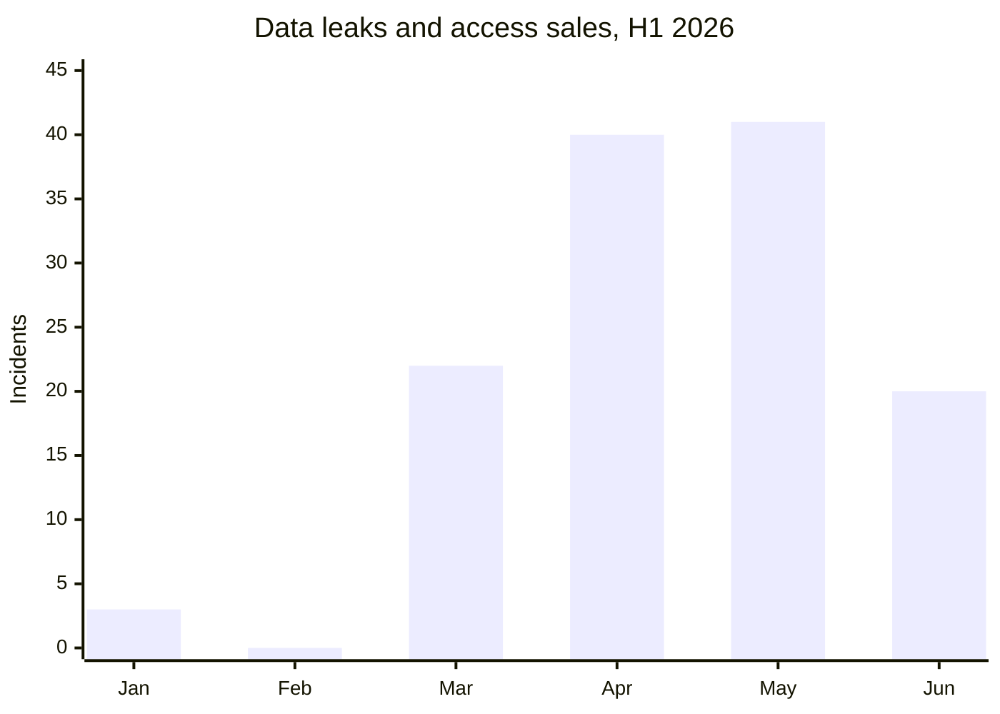

# AFRINTEL first-half cyber threat report

## January to June 2026

👉🏾 [Version française](./README_H1_FR.md)

TLP:CLEAR, public distribution

## 1. Executive summary

AFRINTEL documented **239 Africa-related cyber incidents** during the first half of 2026: **112 ransomware incidents**, **126 data leaks or access sales**, and **1 website defacement**.

Data leaks and access sales represented **52.7%** of all recorded activity, slightly exceeding ransomware at **46.9%**. When the single defacement is excluded, the two principal AFRINTEL categories account for 238 incidents: 47.1% ransomware and 52.9% data leaks or access sales.

Activity accelerated sharply during the second quarter. April and May alone accounted for **117 incidents**, or **49.0%** of the semester. June recorded fewer incidents than both April and May, but ransomware returned to parity with data leaks at 20 incidents each.

## 2. Methodology and scope

- **Geographic scope:** African victims, institutions, operations or affected datasets.
- **Period:** 1 January to 30 June 2026.
- **Single sources of truth:** the six monthly `victims.md` files.
- **Ransomware:** incidents attributed to a ransomware group, without assuming encryption when no supporting evidence is available.
- **Data leaks and access sales:** published or sampled datasets, database sales, credential sales and access offers.
- **Website defacement:** one coordinated January incident affecting Nigerien state websites.
- **Evidence treatment:** each record retains its AFRINTEL status. Victim listings, accessible samples and full data publications are described according to the material documented in the monthly card.

Source files: [January](./01-january/victims.md), [February](./02-february/victims.md), [March](./03-march/victims.md), [April](./04-april/victims.md), [May](./05-may/victims.md), [June](./06-june/victims.md).

## 3. Semester overview

| Indicator | Value |
|---|---:|
| Total documented incidents | 239 |
| Ransomware | 112 |
| Data leaks / access sales | 126 |
| Website defacement | 1 |
| Highest-volume month | April, 60 incidents |
| Second-highest month | May, 57 incidents |
| Lowest-volume month | February, 20 incidents |

## 4. Monthly evolution

| Month | Ransomware | Data leaks / access sales | Website defacement | Total | Monthly share |
|---|---:|---:|---:|---:|---:|
| January | 17 | 3 | 1 | 21 | 8.8% |
| February | 20 | 0 | 0 | 20 | 8.4% |
| March | 19 | 22 | 0 | 41 | 17.2% |
| April | 20 | 40 | 0 | 60 | 25.1% |
| May | 16 | 41 | 0 | 57 | 23.8% |
| June | 20 | 20 | 0 | 40 | 16.7% |
| **H1 2026** | **112** | **126** | **1** | **239** | **100%** |

### Ransomware and leak evolution

## 5. Quarter comparison

| Period | Ransomware | Data leaks / access sales | Website defacement | Total |
|---|---:|---:|---:|---:|
| First quarter, January to March | 56 | 25 | 1 | 82 |
| Second quarter, April to June | 56 | 101 | 0 | 157 |
| **H1 2026** | **112** | **126** | **1** | **239** |

The second quarter recorded **75 more incidents than first quarter**, an increase of **91.5%**. Ransomware volume remained stable at 56 incidents in each quarter. Data leaks and access sales rose from 25 in the first quarter to 101 in the second quarter, an increase of **304%**.

## 6. Key CTI findings

1. **Ransomware remained persistent rather than continuously accelerating.** Monthly volume stayed between 16 and 20 incidents.
2. **Data leaks became the principal volume driver in the second quarter.** April and May recorded 81 leaks or access sales, compared with 25 during the entire first quarter.
3. **June changed the balance without returning to conditions observed during the first quarter.** Total volume declined after the April-May peak, but ransomware returned to 50% of monthly incidents.
4. **The semester was geographically concentrated.** South Africa, Egypt and Morocco accounted for 137 of 239 records, or 57.3%.
5. **Government / Administration was the leading normalized sector.** It accounted for 70 records, or 29.3%, followed by Industry / Automotive / Manufacturing / Construction / Mining and Finance / Banking with 25 records each.
6. **Repeated publication does not prove a shared intrusion campaign.** Cross-month activity associated with the same source account is recorded as continuity of publication unless the source cards establish a common access vector.

## 7. Intelligence limitations

- The total represents 239 incident records, each counted according to its structured AFRINTEL status.
- Cross-month victim deduplication has not been completed.
- A multi-country record counts once in the global total and several times only in the expanded geographic view.
- Actor names were normalized for obvious spelling and version variants. Composite coalition labels were not decomposed into individual actor counts.
- Sector labels were normalized from the explicit sector and organization description in each source card. Each card is counted once.
- Initial access, encryption and operational impact are not documented for many ransomware listings.

## 8. SOC and defensive priorities

### Evidence-backed H1 priorities

| Direct country label | Records |
|---|---:|
| 🇿🇦 South Africa | 48 |
| 🇪🇬 Egypt | 45 |
| 🇲🇦 Morocco | 44 |
| 🇹🇳 Tunisia | 16 |
| 🇳🇬 Nigeria | 15 |
| 🇰🇪 Kenya | 9 |
| 🇩🇿 Algeria | 8 |
| 🇹🇿 Tanzania | 6 |
| 🇸🇳 Senegal | 6 |
| 🇬🇭 Ghana | 5 |
| 🇲🇺 Mauritius | 3 |
| 🇱🇾 Libya | 3 |
| 🇿🇲 Zambia | 2 |
| 🇳🇦 Namibia | 2 |
| 🇨🇮 Ivory Coast | 2 |
| 🇪🇹 Ethiopia | 2 |
| 🇧🇼 Botswana | 2 |
| 🇿🇼 Zimbabwe | 1 |
| 🇺🇬 Uganda | 1 |
| 🇹🇬 Togo | 1 |
| 🇸🇩 Sudan | 1 |
| 🇸🇴 Somalia | 1 |
| 🇸🇨 Seychelles | 1 |
| 🇳🇪 Niger | 1 |
| 🇲🇿 Mozambique | 1 |
| 🇾🇹 Mayotte | 1 |
| 🇲🇬 Madagascar | 1 |
| 🇬🇳 Guinea | 1 |
| 🇬🇦 Gabon | 1 |
| 🇨🇩 Democratic Republic of the Congo | 1 |
| 🇨🇲 Cameroon | 1 |
| 🇧🇯 Benin | 1 |
| **Single-country records** | **233** |

The top three direct country labels account for **137 records (57.3%)**. Six additional records are multi-country, bringing the incident total to 239.

| Normalized sector | Records |
|---|---:|
| Government / Administration | 70 |
| Industry / Automotive / Manufacturing / Construction / Mining | 25 |
| Finance / Banking | 25 |
| Education / University / Academic institutions | 19 |
| Technology / Digital / Business services / Digital identity | 15 |
| Healthcare / Medical | 12 |
| Sports / Federations | 12 |
| E-commerce / Retail | 12 |
| Food / Beverage / Agriculture | 8 |
| Transport / Logistics / Aviation | 8 |
| Oil & Energy | 8 |
| Telecommunications | 5 |
| Human Resources / Recruitment | 5 |
| NGO / Social Welfare | 3 |
| Hospitality / Events / Tourism | 3 |
| Media / Audiovisual | 2 |
| Personal Data Aggregation | 2 |
| Legal Services | 1 |
| Real Estate | 1 |
| Research / Think tank | 1 |
| Political Organizations / Parties | 1 |
| Security Services | 1 |
| **Total** | **239** |

No residual sector category remains in this semester view. Nundun Gopee & Co Ltd is classified under Construction / Real Estate.

#### Most represented normalized actor labels

| Actor or source label | Records |
|---|---:|
| anisanas2 | 10 |
| TheGentlemen | 7 |
| Databasehooligan | 7 |
| 404Crew Cyber Team | 7 |
| CrowStealer | 6 |
| NightSpire | 6 |
| LockBit 5 | 5 |
| Qilin | 4 |
| DeadLock | 4 |
| APT73 / Bashe | 4 |
| XP95 | 3 |
| xNov | 3 |
| Keymous | 3 |

These counts normalize obvious naming variants such as `The Gentlemen` / `TheGentlemen`, `Nightspire` / `NightSpire`, and `LockBit 5.0` / `LockBit 5`. Coalition labels remain separate when the source card names several actors together.

#### Expanded multi-country exposure

| Month | Source card | African countries explicitly listed | Exposures |
|---|---|---|---:|
| April | Government data leak and administrative access sale | Angola, South Africa, Nigeria | 3 |
| May | Resume-document leak | Kenya, Ethiopia, Nigeria, Zimbabwe | 4 |
| May | Regional multi-country listing | Mozambique, Liberia, Nigeria, Togo, Sierra Leone | 5 |
| May | Egypt / Libya listing | Egypt, Libya | 2 |
| June | Government email sale | Ethiopia, Tanzania, Angola, Kenya, Zambia, Nigeria, Egypt, Morocco | 8 |
| June | Law-enforcement portal access sale | Egypt, Malawi, Tanzania, Algeria, Kenya, Zambia, Sierra Leone | 7 |
| **Total** | **6 source cards** | | **29 country exposures** |

The incident total remains **239**. Replacing the six multi-country cards with their 29 explicit African country occurrences produces **262 geographic exposure occurrences**: 233 single-country cards plus 29 expanded occurrences. The expanded view covers **36 distinct African countries**.

- Prioritize identity, VPN, email, cloud-storage and privileged-account telemetry.
- Track victim listings, encryption evidence and data publication as separate fields.
- Detect unusual bulk exports, database dumps and public-cloud object exposure.
- Enforce MFA for government, education, financial and healthcare portals.
- Establish rapid credential revocation workflows for leaked government and military accounts.
- Normalize actor names across months to avoid duplicate counts.
- Preserve the original claim date, AFRINTEL discovery date and publication date.

## 9. Strategic outlook

### Intelligence gaps

- It is not possible to separate actual activity growth from improved collection coverage using repository data alone.
- The operators behind several unnamed platforms and multi-organization datasets remain unidentified.
- Composite actor labels and coalition publications limit precise actor-level attribution.
- The June return to a 50/50 ransomware versus leak split is one monthly observation, not an established second-half trend.

### Contextual MITRE ATT&CK coverage

| Technique | Name | Defensive use |
|---|---|---|
| T1078 | Valid Accounts | Monitor access-sale and exposed-credential scenarios |
| T1041 | Exfiltration Over C2 Channel | Detection hypothesis for unusual outbound transfers |
| T1537 | Transfer Data to Cloud Account | Monitor cloud data movement |
| T1486 | Data Encrypted for Impact | Apply only when encryption is independently observed |

No technique is attributed to a specific H1 incident without supporting telemetry.

The first half of 2026 shows two parallel risks. Ransomware maintained a stable operational baseline, while data leaks and access sales expanded sharply during the second quarter. The semester should not be described as a simple ransomware wave. The more significant structural change was the growth of data brokerage, credential exposure and publication of structured datasets.

For the second half of 2026, AFRINTEL should monitor whether the June 50/50 distribution becomes a sustained ransomware recovery or remains a temporary correction after the April-May leak peak.

## 10. Conclusion

AFRINTEL recorded **239 incidents during H1 2026**: **112 ransomware**, **126 data leaks or access sales**, and **1 defacement**. The second quarter accounted for 157 records, or 65.7% of semester activity. All net growth over the first quarter came from leaks and access sales.

The defensive priority is dual: maintain ransomware readiness while strengthening controls against credential exposure, bulk data extraction, cloud-storage exposure and underground data sales.

### Consistency checks

- Monthly totals: 21 + 20 + 41 + 60 + 57 + 40 = 239.
- Type totals: 112 + 126 + 1 = 239.
- Direct geography: 233 single-country records + 6 multi-country records = 239.
- Expanded geography: 233 single-country occurrences + 29 multi-country occurrences = 262.
- Sector totals: all 22 explicit sector rows sum to 239.

---

**AFRINTEL**  
Open African CTI Monitoring Initiative  
[GitHub repository](https://github.com/Hatchepsoute/AFRINTEL)
