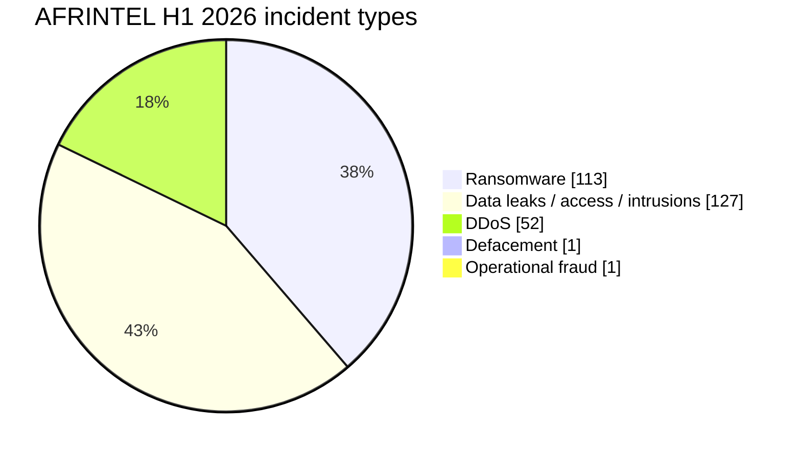

# AFRINTEL H1 2026 Cyber Threat Report

👉🏾 [**French version available here**](./README_H1_FR.md)

## 1. Executive summary

From **1 January to 30 June 2026**, AFRINTEL records **294 deduplicated incidents**.

After correcting the March taxonomy, the semester-level distribution is:

- **113 ransomware claims/publications (38.4%)**
- **127 data leaks / access sales / system intrusions (43.2%)**
- **52 DDoS claims (17.7%)**
- **1 defacement (0.3%)**
- **1 operational-fraud incident (0.3%)**

The global total of **294 does not change**. March is reallocated as **19 ransomware + 21 leaks/intrusions + 1 operational fraud**.

April and May remain the highest-volume months with **69** and **103** incidents. Together they account for **172 incidents (58.5%)**.

## 2. Methodology

The monthly `victims.md` files are the primary source for this synthesis.

- Each victim card counts once in the deduplicated total.
- Multi-country records count once globally but may generate several geographic occurrences.
- Ransomware publication does not automatically confirm encryption.
- DDoS records remain actor claims or availability observations unless independently corroborated.
- UBA Senegal is retained in the March total as **Operational Fraud**, outside the standard structured types.
- Stats SA and GCRA are classified as **Data Leak / Intrusion** in March.

## 3. Monthly evolution

| Month | Ransomware | Data leaks / access / intrusions | DDoS | Defacement | Operational fraud | Total | Share |
|---|---:|---:|---:|---:|---:|---:|---:|
| January | 17 | 3 | 0 | 1 | 0 | **21** | 7.1% |
| February | 20 | 0 | 0 | 0 | 0 | **20** | 6.8% |
| March | 19 | 21 | 0 | 0 | 1 | **41** | 13.9% |
| April | 20 | 40 | 9 | 0 | 0 | **69** | 23.5% |
| May | 17 | 43 | 43 | 0 | 0 | **103** | 35.0% |
| June | 20 | 20 | 0 | 0 | 0 | **40** | 13.6% |
| **H1 2026** | **113** | **127** | **52** | **1** | **1** | **294** | **100%** |

## 4. Quarter comparison

| Period | Ransomware | Data leaks / access / intrusions | DDoS | Defacement | Operational fraud | Total |
|---|---:|---:|---:|---:|---:|---:|
| Q1 | 56 | 24 | 0 | 1 | 1 | **82** |
| Q2 | 57 | 103 | 52 | 0 | 0 | **212** |
| **H1** | **113** | **127** | **52** | **1** | **1** | **294** |

Q2 represents **72.1%** of H1 versus **27.9%** for Q1. The increase from 82 to 212 records is **+130 (+158.5%)**.

## 5. Geographic exposure

The semester contains **294 deduplicated incidents**. Expanding the six multi-country records produces **317 geographic occurrences**.

| Region | Ransomware | Data leaks / access / intrusions | DDoS | Defacement | Operational fraud | Geographic occurrences |
|---|---:|---:|---:|---:|---:|---:|
| North Africa | 49 | 78 | 52 | 0 | 0 | **179** |
| Southern Africa | 30 | 32 | 0 | 0 | 0 | **62** |
| West Africa | 16 | 22 | 0 | 1 | 1 | **40** |
| East Africa | 11 | 15 | 0 | 0 | 0 | **26** |
| Indian Ocean | 6 | 0 | 0 | 0 | 0 | **6** |
| Central Africa | 1 | 2 | 0 | 0 | 0 | **3** |
| Pan-African / unspecified | 0 | 1 | 0 | 0 | 0 | **1** |
| **Total** | **113** | **150** | **52** | **1** | **1** | **317** |

The expanded geographic leak/access/intrusion count is **150 occurrences**, higher than the **127 deduplicated incidents**, because multi-country records are expanded by geography.

### Leading country totals

| Country | H1 total |
|---|---:|
| 🇲🇦 Morocco | **89** |
| 🇪🇬 Egypt | **55** |
| 🇿🇦 South Africa | **48** |
| 🇹🇳 Tunisia | **16** |
| 🇳🇬 Nigeria | **15** |
| 🇰🇪 Kenya | **9** |
| 🇩🇿 Algeria | **8** |
| 🇸🇳 Senegal | **6** |
| 🇹🇿 Tanzania | **6** |
| 🇬🇭 Ghana | **5** |

Corrected top-country type splits:
- **Morocco:** 10 ransomware + 36 leaks/access + 43 DDoS = **89**
- **Egypt:** 28 ransomware + 19 leaks/access + 8 DDoS = **55**
- **South Africa:** 23 ransomware + 25 leaks/intrusions = **48**

## 6. Key semester trends

1. **Data exposure is the largest category:** 127 leaks/access/intrusions versus 113 ransomware.
2. **Q2 dominates volume:** April and May alone account for 58.5% of H1.
3. **All 52 DDoS claims occur in April and May.**
4. **Morocco records the highest H1 geographic total (89).**
5. **UBA Senegal requires a separate operational-fraud category**, preventing forced classification into ransomware, leak, access sale or defacement.

## 7. Data-quality note

This edition separates **deduplicated incidents** from **expanded geographic occurrences** and preserves an **Operational Fraud** category for UBA Senegal.

A sector-level H1 ranking is intentionally not reproduced here because the six monthly files use heterogeneous sector labels. A fresh six-month normalization is required before publishing a sector ranking without mixing incompatible rules.

## 8. Conclusion

AFRINTEL H1 2026 contains **294 deduplicated incidents**: **113 ransomware**, **127 data leaks/access sales/system intrusions**, **52 DDoS**, **1 defacement** and **1 operational fraud**.

The correction changes category allocation, not the semester total.

**AFRINTEL** - African Cyber Threat Intelligence
