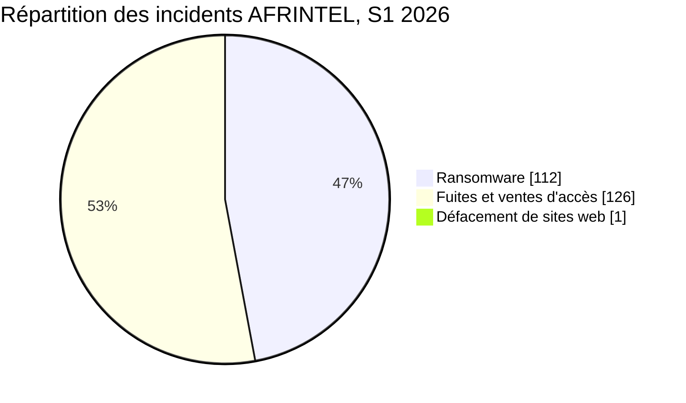
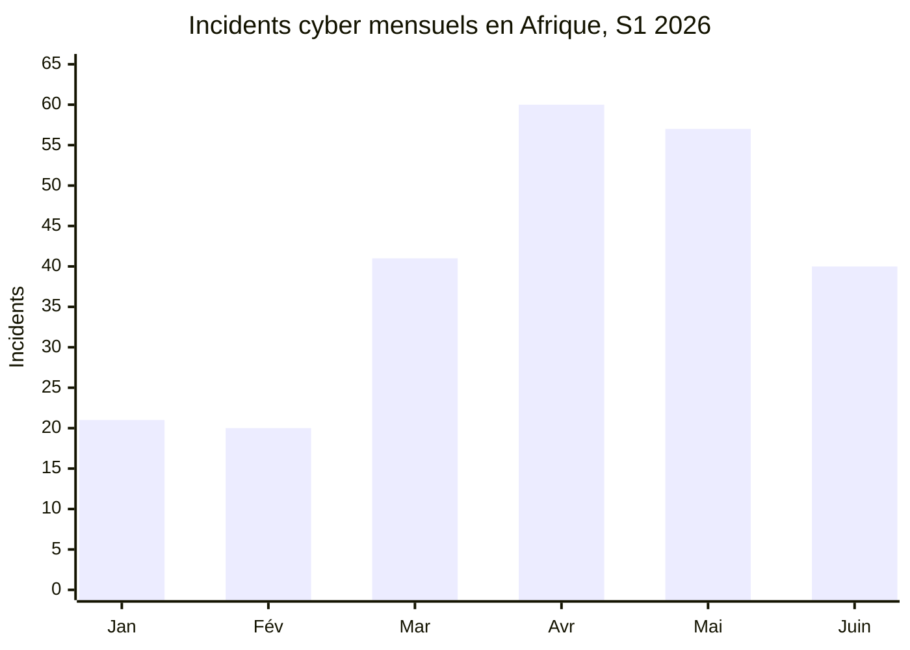
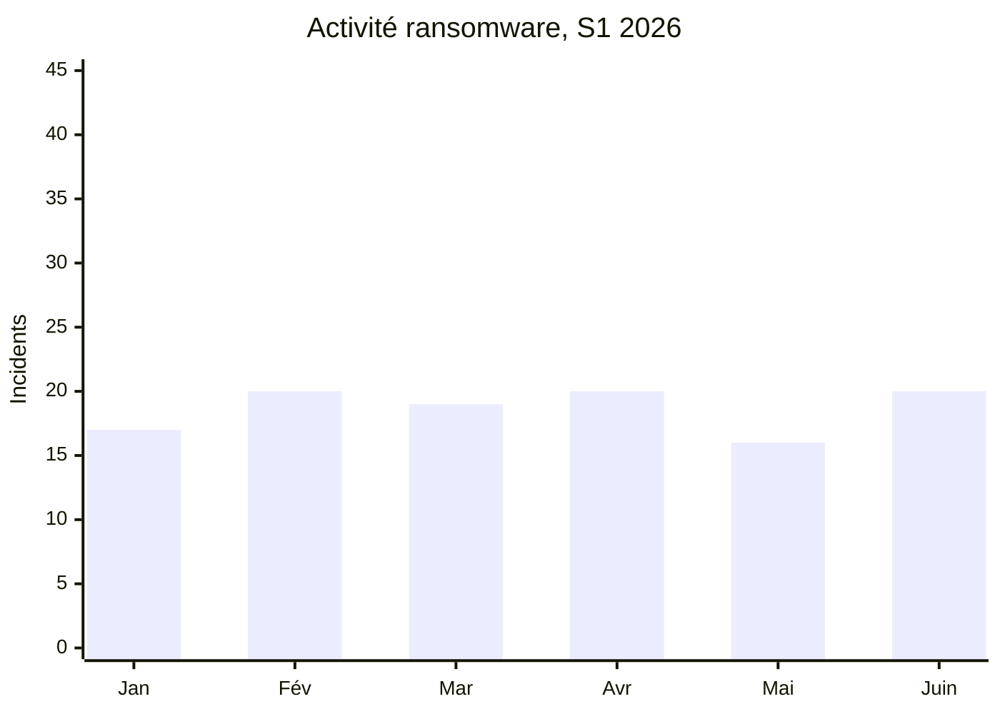
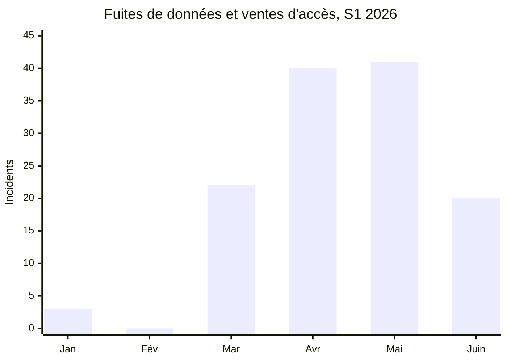

# Rapport AFRINTEL sur les cybermenaces du premier semestre

## Janvier à juin 2026

👉🏾 [English version](./README_H1.md)

TLP:CLEAR, diffusion publique

## 1. Synthèse exécutive

AFRINTEL a documenté **239 incidents cyber liés à l'Afrique** durant le premier semestre 2026 : **112 incidents ransomware**, **126 fuites de données ou ventes d'accès** et **1 défacement de sites web**.

Les fuites et ventes d'accès représentent **52,7 %** de l'activité recensée, contre **46,9 %** pour le ransomware. En excluant l'unique défacement, les deux catégories principales regroupent 238 incidents : 47,1 % de ransomware et 52,9 % de fuites ou ventes d'accès.

L'activité augmente fortement au deuxième trimestre. Avril et mai totalisent **117 incidents**, soit **49,0 %** du semestre. Juin enregistre moins d'incidents qu'avril et mai, mais le ransomware retrouve la parité avec les fuites, avec 20 incidents dans chaque catégorie.

## 2. Méthodologie et périmètre

- **Périmètre géographique :** victimes, institutions, opérations ou données liées à l'Afrique.
- **Période :** du 1er janvier au 30 juin 2026.
- **Sources uniques de vérité :** les six fichiers mensuels `victims.md`.
- **Ransomware :** incident attribué à un groupe ransomware, sans présumer un chiffrement lorsque les éléments disponibles ne le démontrent pas.
- **Fuites et ventes d'accès :** données ou échantillons publiés, ventes de bases, ventes d'identifiants et offres d'accès.
- **Défacement de sites web :** un incident coordonné en janvier visant des sites de l’État nigérien.
- **Traitement des éléments :** chaque fiche conserve son statut AFRINTEL. Les publications de victimes, les échantillons accessibles et les publications complètes de données sont décrits selon les éléments documentés dans la fiche mensuelle.

Fichiers sources : [janvier](./01-january/victims.md), [février](./02-february/victims.md), [mars](./03-march/victims.md), [avril](./04-april/victims.md), [mai](./05-may/victims.md), [juin](./06-june/victims.md).

## 3. Vue d'ensemble du semestre

| Indicateur | Valeur |
|---|---:|
| Total des incidents documentés | 239 |
| Ransomware | 112 |
| Fuites de données / ventes d'accès | 126 |
| Défacement de sites web | 1 |
| Mois au volume le plus élevé | Avril, 60 incidents |
| Deuxième mois au volume le plus élevé | Mai, 57 incidents |
| Mois au volume le plus faible | Février, 20 incidents |

## 4. Évolution mensuelle

| Mois | Ransomware | Fuites / ventes d’accès | Défacement de sites web | Total | Part mensuelle |
|---|---:|---:|---:|---:|---:|
| Janvier | 17 | 3 | 1 | 21 | 8,8 % |
| Février | 20 | 0 | 0 | 20 | 8,4 % |
| Mars | 19 | 22 | 0 | 41 | 17,2 % |
| Avril | 20 | 40 | 0 | 60 | 25,1 % |
| Mai | 16 | 41 | 0 | 57 | 23,8 % |
| Juin | 20 | 20 | 0 | 40 | 16,7 % |
| **S1 2026** | **112** | **126** | **1** | **239** | **100 %** |

### Évolution du ransomware et des fuites

## 5. Comparaison des trimestres

| Période | Ransomware | Fuites / ventes d’accès | Défacement de sites web | Total |
|---|---:|---:|---:|---:|
| premier trimestre, janvier à mars | 56 | 25 | 1 | 82 |
| deuxième trimestre, avril à juin | 56 | 101 | 0 | 157 |
| **S1 2026** | **112** | **126** | **1** | **239** |

Le deuxième trimestre enregistre **75 incidents de plus que le premier trimestre**, soit une hausse de **91,5 %**. Le ransomware reste stable, avec 56 incidents dans chaque trimestre. Les fuites et ventes d'accès passent de 25 au premier trimestre à 101 au deuxième trimestre, soit une hausse de **304 %**.

## 6. Principaux constats CTI

1. **Le ransomware reste persistant sans accélération continue.** Son volume mensuel reste compris entre 16 et 20 incidents.
2. **Les fuites deviennent le principal moteur du volume au deuxième trimestre.** Avril et mai enregistrent 81 fuites ou ventes d'accès, contre 25 sur l'ensemble du premier trimestre.
3. **Juin modifie l'équilibre sans revenir à la situation du premier trimestre.** Le volume baisse après le pic d'avril-mai, mais le ransomware revient à 50 % des incidents mensuels.
4. **Le semestre est géographiquement concentré.** L'Afrique du Sud, l'Égypte et le Maroc regroupent 137 des 239 fiches, soit 57,3 %.
5. **Government / Administration est le premier secteur normalisé.** Il représente 70 fiches, soit 29,3 %, devant Industrie / Automobile / Fabrication / Construction / Mines et Finance / Banking avec 25 fiches chacun.
6. **La répétition des publications ne démontre pas une campagne d'intrusion commune.** Une activité associée au même compte source sur plusieurs mois est décrite comme une continuité de publication tant que les fiches n'établissent pas de vecteur d'accès commun.

## 7. Limites du renseignement

- Le total représente 239 fiches d'incidents, chacune comptée selon son statut AFRINTEL structuré.
- La déduplication des victimes entre les mois n'est pas terminée.
- Une fiche multi-pays compte une fois dans le total global et plusieurs fois uniquement dans la vue géographique développée.
- Les variantes évidentes de noms et de versions d'acteurs sont normalisées. Les libellés de coalitions ne sont pas décomposés en comptes individuels.
- Les secteurs sont normalisés depuis le secteur explicite et la description de l'organisation dans chaque fiche source. Chaque fiche compte une seule fois.
- L'accès initial, le chiffrement et l'impact opérationnel ne sont pas documentés pour de nombreuses publications ransomware.

## 8. Priorités SOC et défensives

### Priorités du S1 fondées sur les données

| Libellé pays direct | Fiches |
|---|---:|
| 🇿🇦 Afrique du Sud | 48 |
| 🇪🇬 Égypte | 45 |
| 🇲🇦 Maroc | 44 |
| 🇹🇳 Tunisie | 16 |
| 🇳🇬 Nigeria | 15 |
| 🇰🇪 Kenya | 9 |
| 🇩🇿 Algérie | 8 |
| 🇹🇿 Tanzanie | 6 |
| 🇸🇳 Sénégal | 6 |
| 🇬🇭 Ghana | 5 |
| 🇲🇺 Maurice | 3 |
| 🇱🇾 Libye | 3 |
| 🇿🇲 Zambie | 2 |
| 🇳🇦 Namibie | 2 |
| 🇨🇮 Côte d'Ivoire | 2 |
| 🇪🇹 Éthiopie | 2 |
| 🇧🇼 Botswana | 2 |
| 🇿🇼 Zimbabwe | 1 |
| 🇺🇬 Ouganda | 1 |
| 🇹🇬 Togo | 1 |
| 🇸🇩 Soudan | 1 |
| 🇸🇴 Somalie | 1 |
| 🇸🇨 Seychelles | 1 |
| 🇳🇪 Niger | 1 |
| 🇲🇿 Mozambique | 1 |
| 🇾🇹 Mayotte | 1 |
| 🇲🇬 Madagascar | 1 |
| 🇬🇳 Guinée | 1 |
| 🇬🇦 Gabon | 1 |
| 🇨🇩 République démocratique du Congo | 1 |
| 🇨🇲 Cameroun | 1 |
| 🇧🇯 Bénin | 1 |
| **Fiches mono-pays** | **233** |

Les trois premiers pays directs regroupent **137 fiches (57,3 %)**. Six fiches supplémentaires sont multi-pays, ce qui porte le total à 239.

| Secteur normalisé | Fiches |
|---|---:|
| Government / Administration | 70 |
| Industrie / Automobile / Fabrication / Construction / Mines | 25 |
| Finance / Banking | 25 |
| Education / University / Institutions académiques | 19 |
| Technologie / Numérique / Services aux entreprises / Identité numérique | 15 |
| Healthcare / Medical | 12 |
| Sports / Federations | 12 |
| E-commerce / Retail | 12 |
| Alimentation / Boissons / Agriculture | 8 |
| Transport / Logistique / Aviation | 8 |
| Oil & Energy | 8 |
| Telecommunications | 5 |
| Ressources humaines / Recrutement | 5 |
| ONG / Action sociale | 3 |
| Hôtellerie / Événementiel / Tourisme | 3 |
| Médias / Audiovisuel | 2 |
| Agrégation de données personnelles | 2 |
| Services juridiques | 1 |
| Immobilier | 1 |
| Recherche / Think tank | 1 |
| Organisations politiques / Partis | 1 |
| Services de sécurité | 1 |
| **Total** | **239** |

Aucune catégorie sectorielle résiduelle ne subsiste dans cette vue semestrielle. Nundun Gopee & Co Ltd est classée dans Construction / Immobilier.

#### Libellés d'acteurs normalisés les plus représentés

| Acteur ou source | Fiches |
|---|---:|
| anisanas2 | 10 |
| TheGentlemen | 7 |
| Databasehooligan | 7 |
| 404Crew Cyber Team | 7 |
| CrowStealer | 6 |
| NightSpire | 6 |
| LockBit 5 | 5 |
| Qilin | 4 |
| DeadLock | 4 |
| APT73 / Bashe | 4 |
| XP95 | 3 |
| xNov | 3 |
| Keymous | 3 |

Ces comptes normalisent les variantes évidentes comme `The Gentlemen` / `TheGentlemen`, `Nightspire` / `NightSpire` et `LockBit 5.0` / `LockBit 5`. Les coalitions restent séparées lorsque la fiche source nomme plusieurs acteurs.

#### Exposition multi-pays développée

| Mois | Fiche source | Pays africains explicitement cités | Expositions |
|---|---|---|---:|
| Avril | Fuite gouvernementale et vente d'accès administratif | Angola, Afrique du Sud, Nigeria | 3 |
| Mai | Fuite de CV | Kenya, Éthiopie, Nigeria, Zimbabwe | 4 |
| Mai | Publication régionale multi-pays | Mozambique, Liberia, Nigeria, Togo, Sierra Leone | 5 |
| Mai | Publication Égypte / Libye | Égypte, Libye | 2 |
| Juin | Vente d'adresses gouvernementales | Éthiopie, Tanzanie, Angola, Kenya, Zambie, Nigeria, Égypte, Maroc | 8 |
| Juin | Vente d'accès aux portails des forces de l'ordre | Égypte, Malawi, Tanzanie, Algérie, Kenya, Zambie, Sierra Leone | 7 |
| **Total** | **6 fiches sources** | | **29 expositions pays** |

Le total des incidents reste **239**. Le remplacement des six fiches multi-pays par leurs 29 occurrences africaines explicites produit **262 occurrences d'exposition géographique** : 233 fiches mono-pays plus 29 occurrences développées. La vue développée couvre **36 pays africains distincts**.

- Prioriser la télémétrie liée aux identités, VPN, messageries, stockages cloud et comptes privilégiés.
- Suivre séparément les publications de victimes, les éléments de chiffrement et la publication de données.
- Détecter les exports massifs, dumps de bases et expositions d'objets cloud publics.
- Imposer la MFA sur les portails gouvernementaux, éducatifs, financiers et de santé.
- Préparer des procédures rapides de révocation des identifiants gouvernementaux ou militaires exposés.
- Normaliser les noms d'acteurs entre les mois afin d'éviter les doubles comptages.
- Conserver les dates de revendication initiale, de découverte AFRINTEL et de publication.

## 9. Perspective stratégique

### Lacunes de renseignement

- Les données du dépôt ne permettent pas de distinguer la croissance réelle de l'activité d'une amélioration de la couverture de collecte.
- Les opérateurs de plusieurs plateformes non identifiées et jeux de données multi-organisations restent inconnus.
- Les libellés composites d'acteurs et les publications de coalitions limitent l'attribution précise par acteur.
- Le retour à une répartition 50/50 entre ransomware et fuites en juin constitue une observation mensuelle, pas encore une tendance établie pour le second semestre.

### Couverture MITRE ATT&CK contextuelle

| Technique | Nom | Usage défensif |
|---|---|---|
| T1078 | Valid Accounts | Surveiller les ventes d'accès et identifiants exposés |
| T1041 | Exfiltration Over C2 Channel | Hypothèse de détection des transferts sortants inhabituels |
| T1537 | Transfer Data to Cloud Account | Surveiller les déplacements de données cloud |
| T1486 | Data Encrypted for Impact | Seulement si le chiffrement est observé indépendamment |

Aucune technique n'est attribuée à un incident du S1 sans télémétrie probante.

Le premier semestre fait apparaître deux risques parallèles. Le ransomware conserve un niveau opérationnel stable, tandis que les fuites et ventes d'accès augmentent fortement au deuxième trimestre. Le changement structurel le plus important est la progression du courtage de données, des expositions d'identifiants et des publications de données structurées.

Pour le second semestre, AFRINTEL devra déterminer si la répartition 50/50 de juin marque un retour durable du ransomware ou une correction temporaire après le pic de fuites d'avril et mai.

## 10. Conclusion

AFRINTEL a recensé **239 incidents au premier semestre 2026** : **112 ransomware**, **126 fuites ou ventes d'accès** et **1 défacement**. Le deuxième trimestre représente 157 fiches, soit 65,7 % de l'activité semestrielle. Toute la hausse nette par rapport au premier trimestre provient des fuites et ventes d'accès.

La priorité défensive est double : maintenir la préparation au ransomware tout en renforçant les contrôles contre l'exposition d'identifiants, l'extraction massive de données, l'exposition du stockage cloud et les ventes clandestines de données.

### Contrôles de cohérence

- Totaux mensuels : 21 + 20 + 41 + 60 + 57 + 40 = 239.
- Totaux par type : 112 + 126 + 1 = 239.
- Géographie directe : 233 fiches mono-pays + 6 fiches multi-pays = 239.
- Géographie développée : 233 occurrences mono-pays + 29 occurrences multi-pays = 262.
- Totaux sectoriels : les 22 lignes sectorielles explicites totalisent 239.

---

**AFRINTEL**  
Open African CTI Monitoring Initiative  
[Dépôt GitHub](https://github.com/Hatchepsoute/AFRINTEL)
