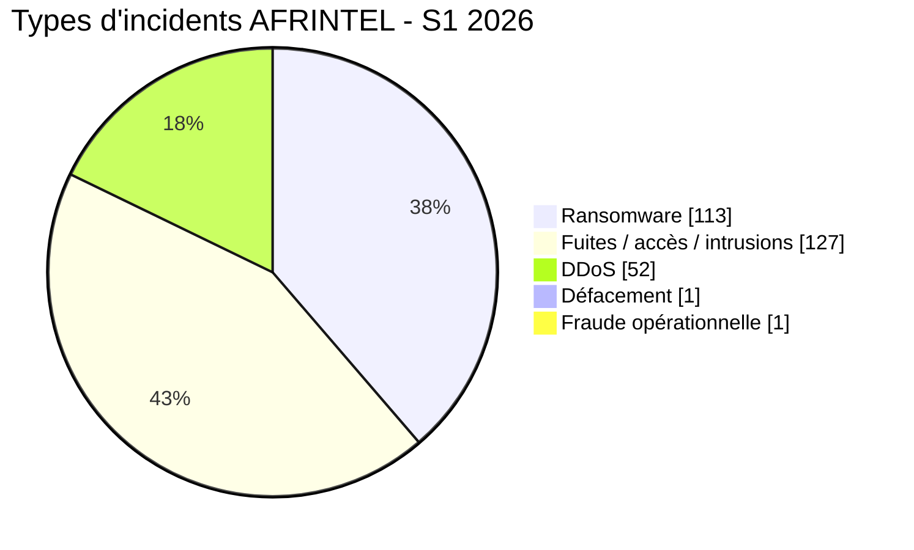

# Rapport AFRINTEL S1 2026 sur les cybermenaces

👉🏾 [**English version available here**](./README_H1.md)

## 1. Synthèse exécutive

Du **1er janvier au 30 juin 2026**, AFRINTEL recense **294 incidents dédupliqués**.

Après correction de la taxonomie de mars, la répartition semestrielle devient :

- **113 revendications/publications ransomware (38,4 %)**
- **127 fuites de données / ventes d’accès / intrusions système (43,2 %)**
- **52 revendications DDoS (17,7 %)**
- **1 défacement (0,3 %)**
- **1 incident de fraude opérationnelle (0,3 %)**

Le total global de **294 ne change pas**. Mars est désormais ventilé en **19 ransomware + 21 fuites/intrusions + 1 fraude opérationnelle**.

Avril et mai restent les mois les plus chargés avec **69** et **103** incidents. Ensemble, ils représentent **172 incidents (58,5 %)**.

## 2. Méthodologie

Les fichiers mensuels `victims_FR.md` constituent la source primaire de cette synthèse.

- Chaque fiche victime compte une fois dans le total dédupliqué.
- Les fiches multi-pays comptent une fois globalement mais peuvent produire plusieurs occurrences géographiques.
- Une publication ransomware ne confirme pas automatiquement un chiffrement.
- Les entrées DDoS restent des revendications d’acteur ou observations d’indisponibilité en l’absence de corroboration indépendante.
- UBA Sénégal est conservé dans le total de mars comme **Fraude opérationnelle**, hors des types structurés standards.
- Stats SA et GCRA sont classés **Fuite / intrusion** en mars.

## 3. Évolution mensuelle

| Mois | Ransomware | Fuites / accès / intrusions | DDoS | Défacement | Fraude opérationnelle | Total | Part |
|---|---:|---:|---:|---:|---:|---:|---:|
| Janvier | 17 | 3 | 0 | 1 | 0 | **21** | 7,1 % |
| Février | 20 | 0 | 0 | 0 | 0 | **20** | 6,8 % |
| Mars | 19 | 21 | 0 | 0 | 1 | **41** | 13,9 % |
| Avril | 20 | 40 | 9 | 0 | 0 | **69** | 23,5 % |
| Mai | 17 | 43 | 43 | 0 | 0 | **103** | 35,0 % |
| Juin | 20 | 20 | 0 | 0 | 0 | **40** | 13,6 % |
| **S1 2026** | **113** | **127** | **52** | **1** | **1** | **294** | **100 %** |

## 4. Comparaison des trimestres

| Période | Ransomware | Fuites / accès / intrusions | DDoS | Défacement | Fraude opérationnelle | Total |
|---|---:|---:|---:|---:|---:|---:|
| T1 | 56 | 24 | 0 | 1 | 1 | **82** |
| T2 | 57 | 103 | 52 | 0 | 0 | **212** |
| **S1** | **113** | **127** | **52** | **1** | **1** | **294** |

Le T2 représente **72,1 %** du semestre contre **27,9 %** pour le T1. Le passage de 82 à 212 fiches correspond à **+130 incidents (+158,5 %)**.

## 5. Exposition géographique

Le semestre compte **294 incidents dédupliqués**. Le développement des six fiches multi-pays produit **317 occurrences géographiques**.

| Région | Ransomware | Fuites / accès / intrusions | DDoS | Défacement | Fraude opérationnelle | Occurrences géographiques |
|---|---:|---:|---:|---:|---:|---:|
| Afrique du Nord | 49 | 78 | 52 | 0 | 0 | **179** |
| Afrique australe | 30 | 32 | 0 | 0 | 0 | **62** |
| Afrique de l’Ouest | 16 | 22 | 0 | 1 | 1 | **40** |
| Afrique de l’Est | 11 | 15 | 0 | 0 | 0 | **26** |
| Océan Indien | 6 | 0 | 0 | 0 | 0 | **6** |
| Afrique centrale | 1 | 2 | 0 | 0 | 0 | **3** |
| Panafricain / non précisé | 0 | 1 | 0 | 0 | 0 | **1** |
| **Total** | **113** | **150** | **52** | **1** | **1** | **317** |

Le total géographique développé des fuites/accès/intrusions est de **150 occurrences**, supérieur aux **127 incidents dédupliqués**, car les fiches multi-pays sont développées géographiquement.

### Principaux pays

| Pays | Total S1 |
|---|---:|
| 🇲🇦 Maroc | **89** |
| 🇪🇬 Égypte | **55** |
| 🇿🇦 Afrique du Sud | **48** |
| 🇹🇳 Tunisie | **16** |
| 🇳🇬 Nigeria | **15** |
| 🇰🇪 Kenya | **9** |
| 🇩🇿 Algérie | **8** |
| 🇸🇳 Sénégal | **6** |
| 🇹🇿 Tanzanie | **6** |
| 🇬🇭 Ghana | **5** |

Ventilation corrigée des trois premiers pays :
- **Maroc :** 10 ransomware + 36 fuites/accès + 43 DDoS = **89**
- **Égypte :** 28 ransomware + 19 fuites/accès + 8 DDoS = **55**
- **Afrique du Sud :** 23 ransomware + 25 fuites/intrusions = **48**

## 6. Tendances clés du semestre

1. **L’exposition de données constitue la première catégorie :** 127 fuites/accès/intrusions contre 113 ransomware.
2. **Le T2 domine le volume :** avril et mai représentent à eux seuls 58,5 % du S1.
3. **Les 52 revendications DDoS apparaissent toutes en avril et mai.**
4. **Le Maroc présente le total géographique S1 le plus élevé (89).**
5. **UBA Sénégal impose une catégorie fraude opérationnelle distincte**, afin d’éviter de forcer cet incident dans les compteurs ransomware, fuite, vente d’accès ou défacement.

## 7. Note qualité des données

Cette édition distingue les **incidents dédupliqués** des **occurrences géographiques développées** et conserve une catégorie **Fraude opérationnelle** pour UBA Sénégal.

Le classement sectoriel S1 n’est volontairement pas reproduit ici : les six fichiers mensuels utilisent des libellés sectoriels hétérogènes. Une nouvelle normalisation sectorielle sur les six mois est nécessaire avant de publier un classement sans mélanger des règles incompatibles.

## 8. Conclusion

AFRINTEL S1 2026 contient **294 incidents dédupliqués** : **113 ransomware**, **127 fuites de données/ventes d’accès/intrusions système**, **52 DDoS**, **1 défacement** et **1 fraude opérationnelle**.

La correction modifie la ventilation par type, pas le total semestriel.

**AFRINTEL** - African Cyber Threat Intelligence
