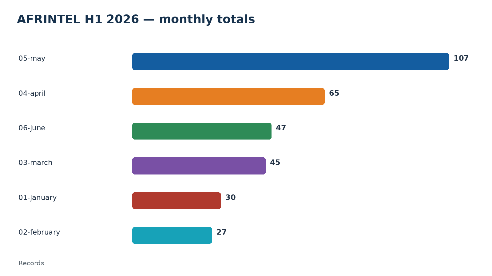
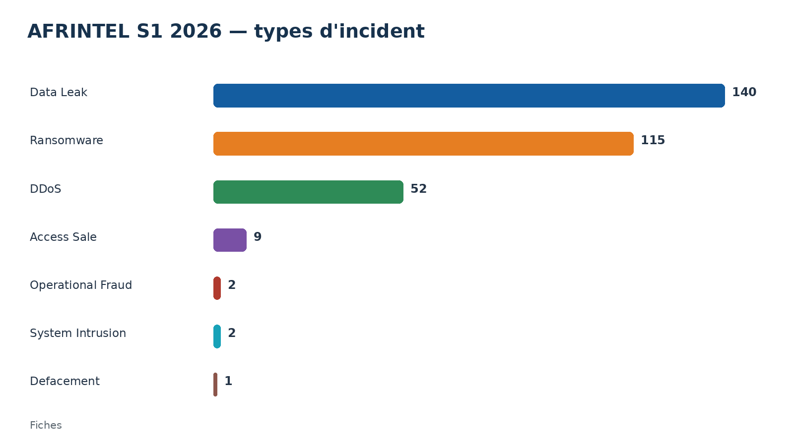
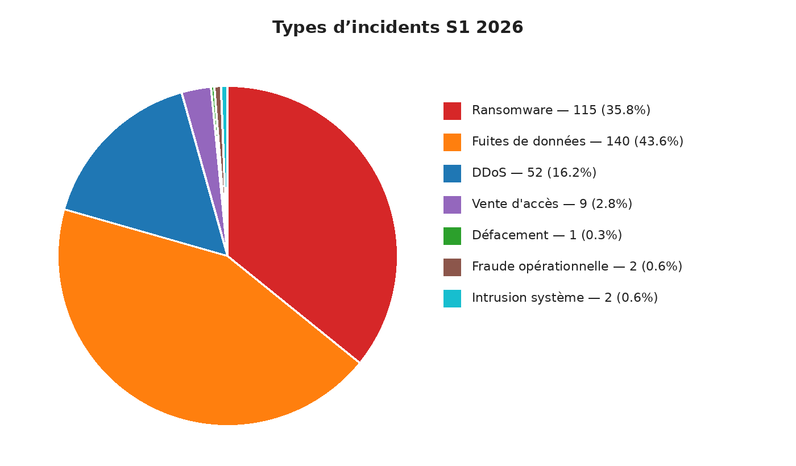
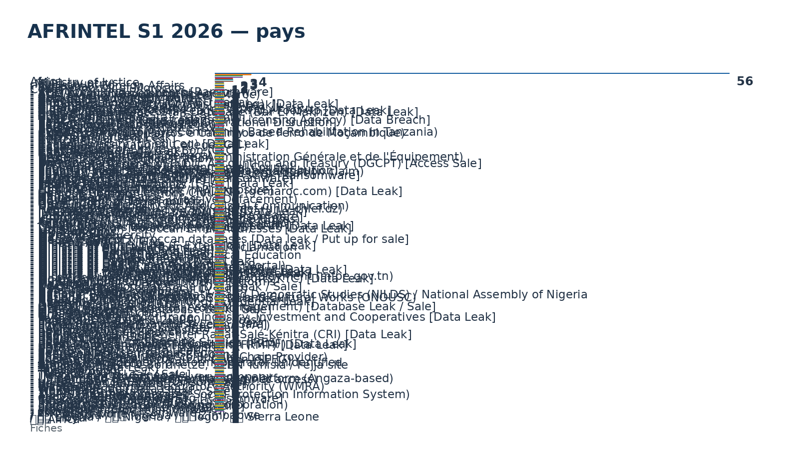
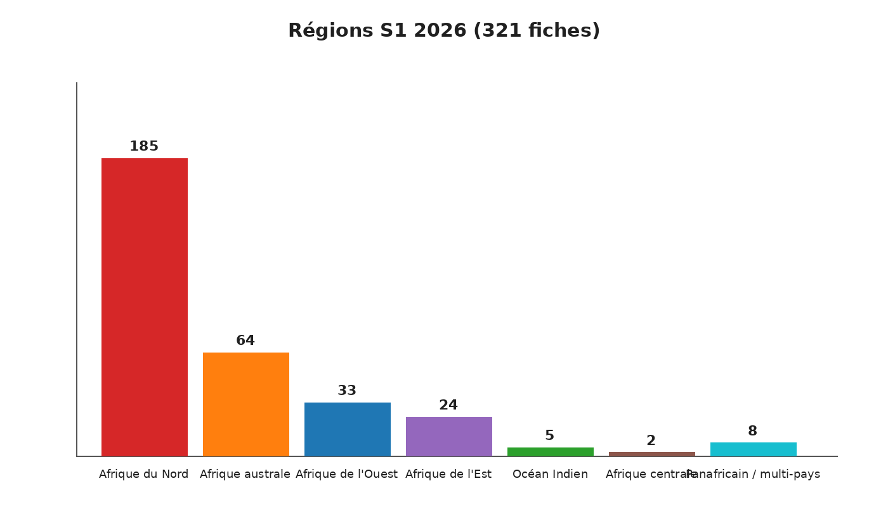
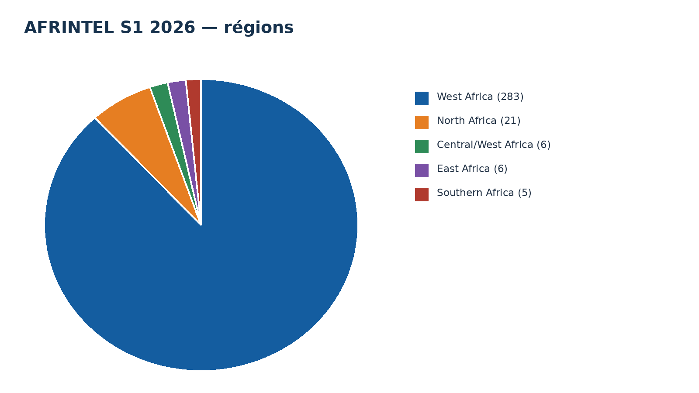
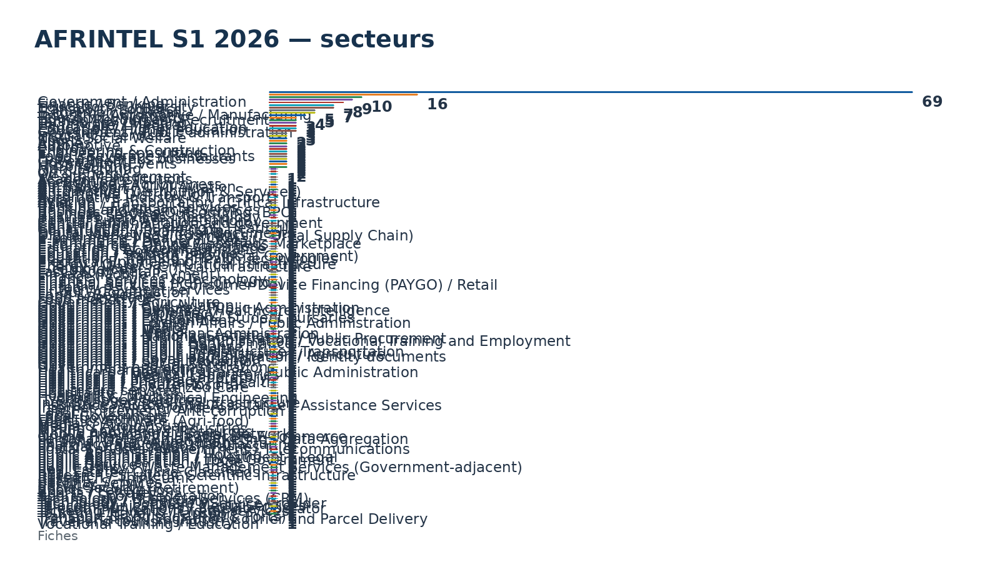
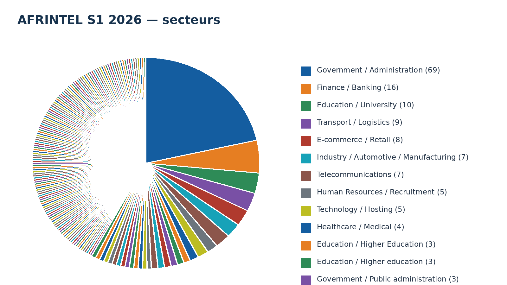
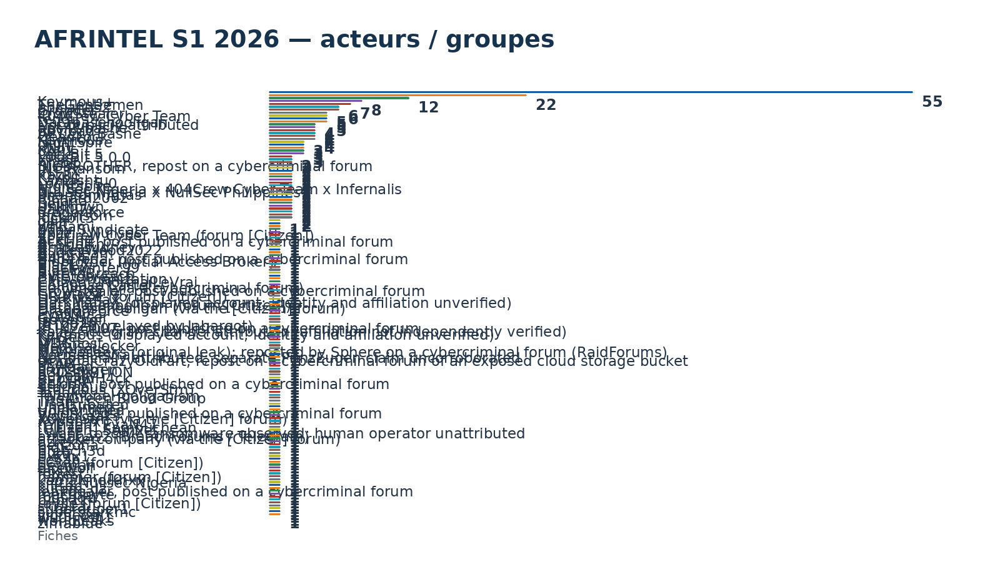

# Rapport AFRINTEL sur les cybermenaces - S1 2026

Du 1er janvier au 30 juin 2026, AFRINTEL recense **320 incidents ou cas documentés** dans le corpus mensuel validé.

## Ventilation semestrielle

| Type | Nombre | Part |
|---|---:|---:|
| Fuite de données | 140 | 43,8 % |
| Ransomware | 115 | 35,9 % |
| DDoS | 52 | 16.2% |
| Vente d'accès | 9 | 2.8% |
| Fraude opérationnelle | 1 | 0,3 % |
| Intrusion système | 2 | 0.6% |
| Défacement | 1 | 0.3% |
| **Total** | **320** | **100,0 %** |

## Totaux mensuels

| Mois | Fiches |
|---|---:|
| janvier | 30 |
| février | 27 |
| mars | 45 |
| avril | 65 |
| mai | 107 |
| juin | 47 |

## Méthodologie

Les chiffres sont calculés depuis les fiches françaises, contrôlés contre les fiches anglaises, puis réutilisés dans les comparaisons et STIX. Le rattachement mensuel suit la publication ou la première observation documentée ; aucune date de compromission n'est déduite. Avril contient **65 fiches canoniques** dans le couple mensuel synchronisé actuel.

## Visualisations

[Jeu complet des visualisations S1 2026](../../visual-intelligence/H1-2026/README_FR.md)

