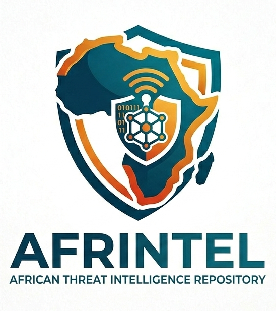

<p align="left">


# AFRINTEL - African Threat Intelligence
</p>

👉🏾 [Version française](README_FR.md)

---

**AFRINTEL** is an open-source Cyber Threat Intelligence project focused on cyber incidents affecting African organizations across all 54 countries on the continent. The project documents the nine canonical AFRINTEL incident types: ransomware, data leaks, access sales, DDoS, defacement, account takeover, system intrusion, malware and operational fraud. These events are observed through dark web sources, leak sites, underground forums and OSINT. Incident type, status, confidence and impact are kept separate so that a criminal claim is not silently treated as a confirmed compromise.

| Countries monitored | Threat actors tracked | Period covered | Formats |
| :---: | :---: | :---: | :---: |
| 54 | 100+ | 2024-2026 | Markdown, STIX 2.1, Visual CTI |

> What ends up here is what got observed: posts on leak sites, underground forums and OSINT sources. A victim card keeps whatever status it had when AFRINTEL last reviewed it.

---

## Featured reports

### Cyber threats in Africa - July 2026

July 2026 brought in 42 incident records: 18 ransomware claims, 18 data leaks, 6 access-sale offers. Egypt and Tunisia top the list at 7 each, Morocco and South Africa follow at 6. One record, Planet Sport, might just be a free repost of April's LockBit 5 claim rather than a new compromise, so the real count of distinct breaches could be a touch lower. The cases worth watching go beyond ransomware: government identity and land records, medical and lab data, university accounts, utility payment records, civil-service exam data, real information sitting on forums.

📄 [Full CTI report - July 2026](CyberAttackAfrica/2026/07-july/README.md)
📋 [Victim list - July 2026](CyberAttackAfrica/2026/07-july/victims.md)

### First-half 2026 cyber threat report

Between January and June 2026, AFRINTEL documented **294 deduplicated incidents**: **113 ransomware**, **121 data leaks**, **6 access-sale records**, **52 DDoS claims**, **1 defacement** and **1 operational-fraud incident**. Q1 accounts for **82 incidents**, compared with **212 in Q2**. Ransomware is nearly stable between quarters (56 to 57), while the sharp increase in Q2 is driven mainly by data exposure/access activity and DDoS reporting. Six multi-country records expand the semester to **317 geographic occurrences**.

📊 [Full H1 2026 report](CyberAttackAfrica/2026/README_H1.md)

📊 [Rapport complet du S1 2026](CyberAttackAfrica/2026/README_H1_FR.md)

📦 [H1 2026 STIX 2.1 / OpenCTI bundle](stix/2026/afrintel_h1_2026_opencti.json)

🖼️ [H1 2026 statistical visual](visual-intelligence/H1-2026/afrintel_h1_2026_statistics.png)

🗺️ [H1 2026 visual map](visual-intelligence/H1-2026/afrintel_s1_2026_carte.png)

---

## Annual CTI reports

Each annual report pulls together the validated monthly corpus for the year: incident-type distribution, country and regional exposure, sector patterns, actor visibility, evidence maturity and the CTI assessment. French and English are kept structurally aligned.

| Year | Documented records | FR | EN |
| :--- | ---: | :--- | :--- |
| 2024 | **119** | [Rapport annuel](CyberAttackAfrica/2024/README_FR.md) | [Annual report](CyberAttackAfrica/2024/README.md) |
| 2025 | **224** | [Rapport annuel](CyberAttackAfrica/2025/README_FR.md) | [Annual report](CyberAttackAfrica/2025/README.md) |

**2024 corrected baseline:** **119 canonical incidents across 30 African countries**, reclassified under the same nine-type taxonomy used for 2025: 91 Ransomware, 13 Data Leak, 4 Access Sale, 2 DDoS, 1 Defacement, 0 Account Takeover, 7 System Intrusion, 0 Malware and 1 Operational Fraud.

**2025 validated baseline:** **224 canonical incidents across 30 African countries**: 121 Ransomware, 80 Data Leak, 6 Access Sale, 3 DDoS, 4 Defacement, 6 Account Takeover, 3 System Intrusion, 1 Malware and 0 Operational Fraud. H1 contains **111 incidents** and H2 **113**.

---

## Semiannual CTI reports

| Period | Documented records | FR | EN |
| :--- | ---: | :--- | :--- |
| H1 2024 | **45** | [Rapport S1](CyberAttackAfrica/2024/README_H1_FR.md) | [H1 report](CyberAttackAfrica/2024/README_H1.md) |
| H1 2025 | **111** | [Rapport S1](CyberAttackAfrica/2025/README_H1_FR.md) | [H1 report](CyberAttackAfrica/2025/README_H1.md) |
| H2 2025 | **113** | [Rapport S2](CyberAttackAfrica/2025/README_H2_FR.md) | [H2 report](CyberAttackAfrica/2025/README_H2.md) |
| H1 2026 | **294** | [Rapport S1](CyberAttackAfrica/2026/README_H1_FR.md) | [H1 report](CyberAttackAfrica/2026/README_H1.md) |

---

## Monthly CTI reports

| Month | FR | EN |
| :--- | :--- | :--- |
| January 2026 | [Rapport](CyberAttackAfrica/2026/01-january/README_FR.md) | [Report](CyberAttackAfrica/2026/01-january/README.md) |
| February 2026 | [Rapport](CyberAttackAfrica/2026/02-february/README_FR.md) | [Report](CyberAttackAfrica/2026/02-february/README.md) |
| March 2026 | [Rapport](CyberAttackAfrica/2026/03-march/README_FR.md) | [Report](CyberAttackAfrica/2026/03-march/README.md) |
| April 2026 | [Rapport](CyberAttackAfrica/2026/04-april/README_FR.md) | [Report](CyberAttackAfrica/2026/04-april/README.md) |
| May 2026 | [Rapport](CyberAttackAfrica/2026/05-may/README_FR.md) | [Report](CyberAttackAfrica/2026/05-may/README.md) |
| June 2026 | [Rapport](CyberAttackAfrica/2026/06-june/README_FR.md) | [Report](CyberAttackAfrica/2026/06-june/README.md) |
| July 2026 | [Rapport](CyberAttackAfrica/2026/07-july/README_FR.md) | [Report](CyberAttackAfrica/2026/07-july/README.md) |
| August 2026 | *in progress* | *in progress* |

---

## Statistics

| Month | FR | EN |
| :--- | :--- | :--- |
| January 2026 | [Statistiques](statistics/2026/01-january/README_FR.md) | [Statistics](statistics/2026/01-january/README.md) |
| February 2026 | [Statistiques](statistics/2026/02-february/README_FR.md) | [Statistics](statistics/2026/02-february/README.md) |
| March 2026 | [Statistiques](statistics/2026/03-march/README_FR.md) | [Statistics](statistics/2026/03-march/README.md) |
| April 2026 | [Statistiques](statistics/2026/04-april/README_FR.md) | [Statistics](statistics/2026/04-april/README.md) |
| May 2026 | [Statistiques](statistics/2026/05-may/README_FR.md) | [Statistics](statistics/2026/05-may/README.md) |
| June 2026 | [Statistiques](statistics/2026/06-june/README_FR.md) | [Statistics](statistics/2026/06-june/README.md) |
| July 2026 | [Statistiques](statistics/2026/07-july/README_FR.md) | [Statistics](statistics/2026/07-july/README.md) |
| August 2026 | *in progress* | *in progress* |

---

## Month-over-month comparisons

| Comparison | FR | EN |
| :--- | :--- | :--- |
| January vs February 2026 | [FR](comparison/2026/01-january-february/README_FR.md) | [EN](comparison/2026/01-january-february/README.md) |
| February vs March 2026 | [FR](comparison/2026/02-february-march/README_FR.md) | [EN](comparison/2026/02-february-march/README.md) |
| March vs April 2026 | [FR](comparison/2026/03-march-april/README_FR.md) | [EN](comparison/2026/03-march-april/README.md) |
| April vs May 2026 | [FR](comparison/2026/04-april-may/README_FR.md) | [EN](comparison/2026/04-april-may/README.md) |
| May vs June 2026 | [FR](comparison/2026/05-may-june/README_FR.md) | [EN](comparison/2026/05-may-june/README.md) |
| June vs July 2026 | [FR](comparison/2026/06-june-july/README_FR.md) | [EN](comparison/2026/06-june-july/README.md) |


---

## Visual intelligence

| Period | Dashboard |
| :--- | :--- |
| January 2026 | [Visual intelligence](visual-intelligence/01-january/README.md) |
| February 2026 | [Visual intelligence](visual-intelligence/02-february/README.md) |
| March 2026 | [Visual intelligence](visual-intelligence/03-march/README.md) |
| April 2026 | [Visual intelligence](visual-intelligence/04-april/README.md) |
| May 2026 | [Visual intelligence](visual-intelligence/05-may/README.md) |
| June 2026 | [Visual intelligence](visual-intelligence/06-june/README.md) |
| July 2026 | [LinkedIn visual](visual-intelligence/07-july/afrintel_july_2026_linkedin_top5.png) |
| August 2026 | *in progress* |
| H1 2026 | [Statistical visual](visual-intelligence/H1-2026/afrintel_h1_2026_statistics.png) |
| H1 2026 map | [Visual map](visual-intelligence/H1-2026/afrintel_s1_2026_carte.png) |

---

## STIX / OpenCTI datasets

| Dataset | File |
| :--- | :--- |
| January 2026 | [STIX Bundle](stix/2026/01-january/afrintel_january_2026_opencti.json) |
| February 2026 | [STIX Bundle](stix/2026/02-february/afrintel_february_2026_opencti.json) |
| March 2026 | [STIX Bundle](stix/2026/03-march/afrintel_march_2026_opencti.json) |
| April 2026 | [STIX Bundle](stix/2026/04-april/afrintel_april_2026_opencti.json) |
| May 2026 | [STIX Bundle](stix/2026/05-may/afrintel_may_2026_opencti.json) |
| June 2026 | [STIX Bundle](stix/2026/06-june/afrintel_june_2026_opencti.json) |
| July 2026 | [STIX Bundle](stix/2026/07-july/afrintel_july_2026_opencti.json) |
| August 2026 | *in progress* |
| H1 2026 | [STIX Bundle](stix/2026/afrintel_h1_2026_opencti.json) |

Every monthly STIX 2.1 bundle carries bilingual incident and victim descriptions, the CTI report, statistics, month-over-month comparisons, source references, and identity objects for AFRINTEL and its author. H1 bundles preserve the original monthly STIX IDs so OpenCTI can correlate records across reporting periods. When a monthly or half-year corpus is corrected, the corresponding aggregate STIX bundle should be regenerated before it is treated as an exact mirror of the Markdown source of truth. MITRE ATT&CK context lives in the report descriptions themselves.

---

## Data quality principles

AFRINTEL separates **incident type**, **status**, **confidence** and **impact**. A ransomware leak-site listing remains a claim unless stronger evidence is available. Published samples, victim confirmations, government confirmations and later corroboration are preserved as different evidence states.

Historical reposts are dated separately from the underlying claimed leak when that distinction is known. Multi-country records are counted once in deduplicated totals but may generate more than one geographic occurrence. AFRINTEL uses nine canonical incident types: Ransomware, Data Leak, Access Sale, DDoS, Defacement, Account Takeover, System Intrusion, Malware and Operational Fraud. Cases that cannot yet be classified with sufficient evidence remain under investigation rather than being forced into a category.

---

## Project structure

```text
AFRINTEL/
├── CyberAttackAfrica/   # Monthly victim lists and CTI reports (2024-2026)
├── statistics/          # Monthly statistics
├── comparison/          # Month-over-month comparisons
├── visual-intelligence/ # Ecosystem maps and diagrams
├── stix/                # STIX 2.1 / OpenCTI bundles
├── scripts/             # Validation and utility scripts
└── workflows/           # Automation workflows
```

---

## ✍🏿 Author

**Adama ASSIONGBON** - SOC & Cyber Threat Intelligence Consultant

🔗 [LinkedIn](https://www.linkedin.com/in/adama-assiongbon-9029893a/) | 📄 [MIT License](LICENSE)
