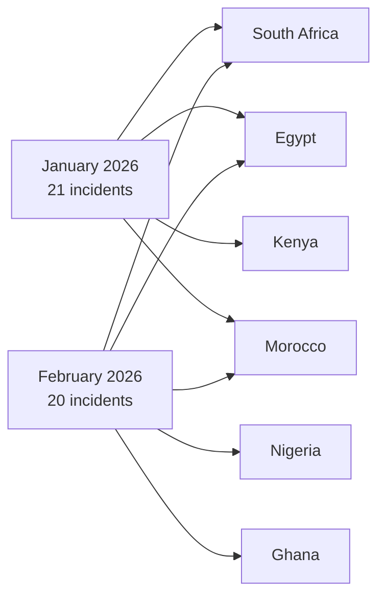
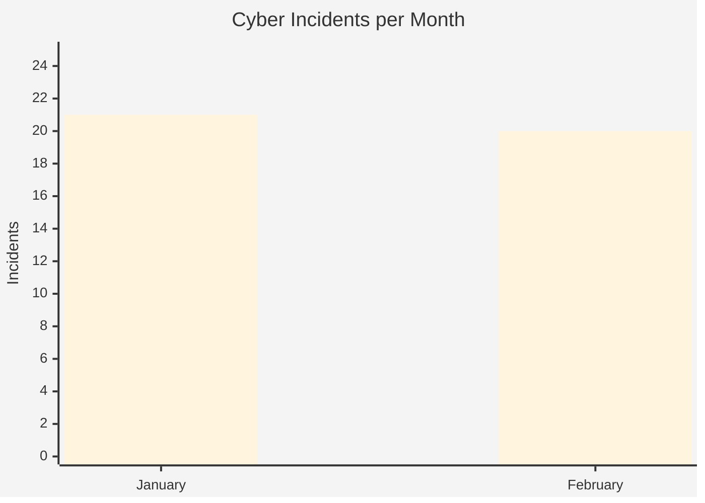
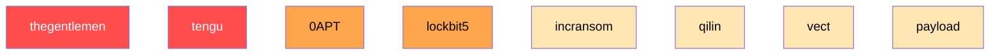
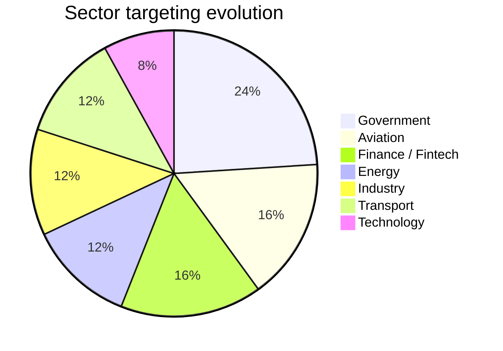

# AFRINTEL - Comparative cyber threat analysis
👉🏾 [**French version available here** ](README_FR.md)
## January vs February 2026 (Africa)

This report provides a **comparative Cyber Threat Intelligence (CTI) analysis** of cyber incidents affecting Africa during **January and February 2026**.  
The objective is to identify **evolving threat actors, geographic concentrations, sector exposure, and operational trends** observed across the continent.

---

# 📊 High‑Level Comparison

| Metric | January 2026 | February 2026 |
|---|---|---|
| Incidents | **21** | **20** |
| Countries affected | 12 | 13 |
| Threat actors | 11 | 10 |
| Ransomware | 18 | dominant |
| Data leaks | 2 | multiple |
| Defacement | 1 | rare |
| Data exposed | limited | **~147 TB** |

---

# 🌍 Geographic distribution comparison

---

# 📈 Incident volume by month

---

# 🎯 Threat actor activity

### Key observations

• **thegentlemen remains the most active actor across both months**  
• **tengu dominates January activity**  
• **0APT emerges in February with multi‑country operations**

---

# 🏭 Sector exposure comparison

### Interpretation

January attacks were **more distributed across sectors**, while February shows a **clear concentration on strategic industries** such as:

• aviation  
• government infrastructure  
• energy sector  

---

# 🔥 Major incidents

### January 2026

• **Government Defacement - Niger**
- Multi‑site attack
- Unattributed actor

• **PixPay Data Leak - Senegal**
- Financial sector exposure

---

### February 2026

• **DAF Senegal breach**
- **139 TB data exposure**
- Largest known African data breach

• **EnerTec South Africa**
- 151 GB industrial data leak

---

# 🧠 Strategic CTI insights

### 1️⃣ Ransomware industrialization

Several groups demonstrate **Ransomware‑as‑a‑Service (RaaS)** characteristics:

- thegentlemen
- lockbit5
- incransom
- vect

---

### 2️⃣ Expansion of attack surface

Key drivers:

• digitalization of African public services  
• increasing fintech adoption  
• growing aviation sector connectivity

---

### 3️⃣ Geographic cyber hotspots

Primary threat clusters:

| Rank | Region |
|---|---|
| 1 | South Africa |
| 2 | Egypt |
| 3 | Kenya |
| 4 | Nigeria |
| 5 | Morocco |

---

# 🔮 Threat Outlook (Next Months)

Based on current patterns, the following sectors are **high‑risk targets for upcoming campaigns**:

• Government institutions  
• Aviation infrastructure  
• Financial platforms  
• Energy providers

Countries likely to remain **primary cyber targets**:

South Africa • Egypt • Kenya • Nigeria • Morocco

---

# 🛡 Strategic recommendations

SOC and CTI teams should prioritize:

### Threat Monitoring

Monitor ransomware groups:

- thegentlemen
- lockbit5
- incransom
- vect
- qilin

### Detection Capabilities

Deploy monitoring for:

• abnormal data exfiltration  
• suspicious outbound traffic  
• credential abuse  

### Infrastructure protection

Strengthen:

• public government portals  
• aviation networks  
• financial platforms

---

# AFRINTEL

* **African Threat Intelligence Initiative**
* TLP:CLEAR - Public release
---
## ✍🏿 Auteur

**Adama ASSIONGBON**  
Consultant SOC & Cyber Threat Intelligence  
[LinkedIn Profile](https://www.linkedin.com/in/adama-assiongbon-9029893a/)

