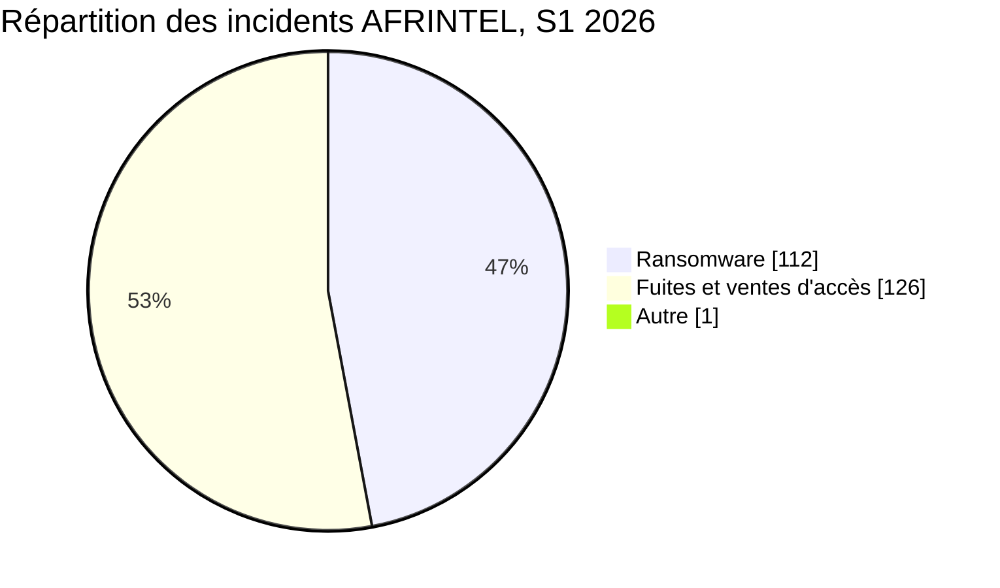
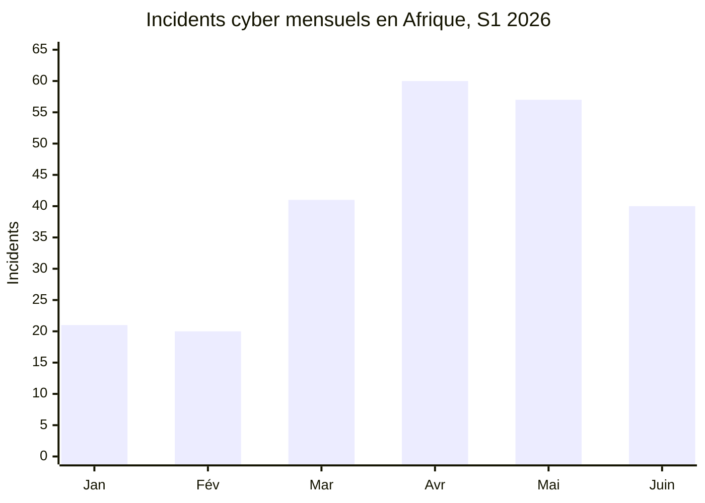
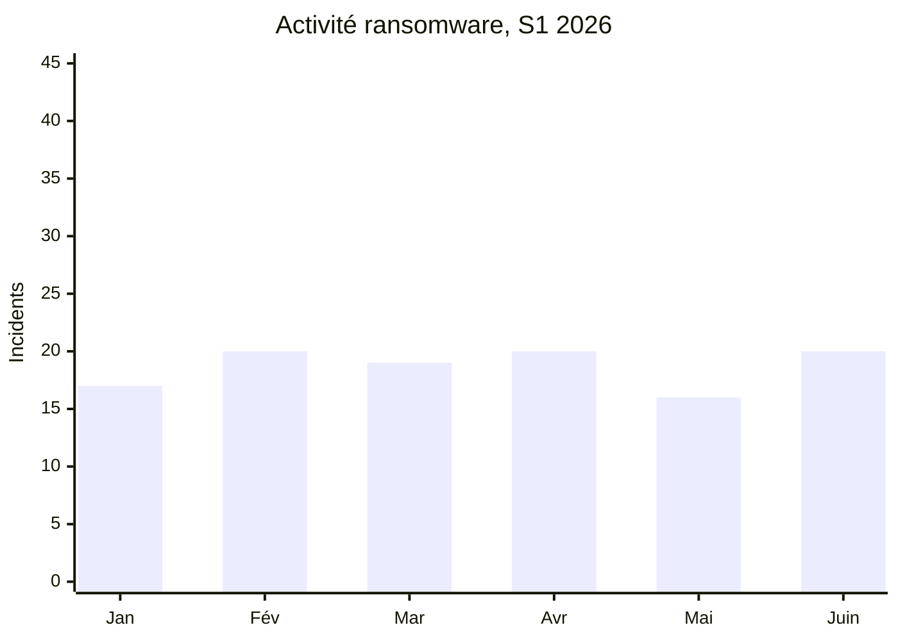
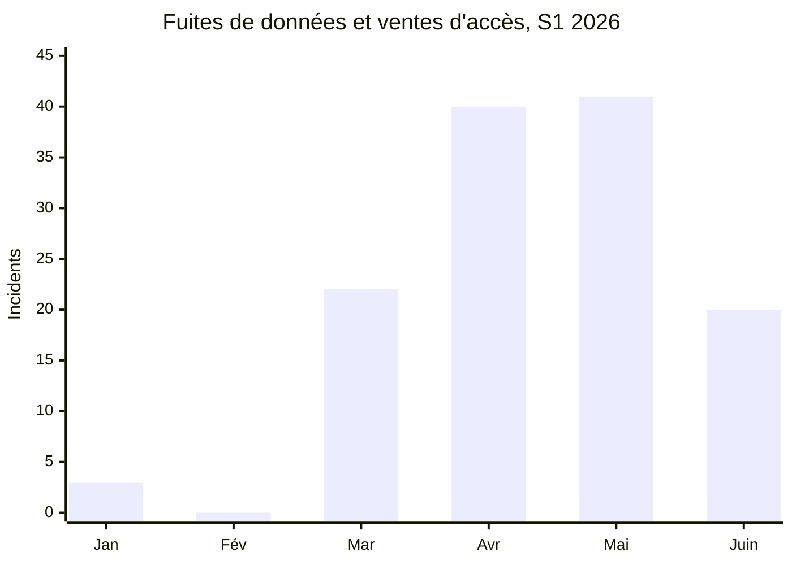

# Rapport AFRINTEL sur les cybermenaces du premier semestre

## Janvier à juin 2026

👉🏾 [English version](./README.md)

TLP:CLEAR, diffusion publique

## 1. Synthèse exécutive

AFRINTEL a documenté **239 incidents cyber liés à l'Afrique** durant le premier semestre 2026 : **112 incidents ransomware**, **126 fuites de données ou ventes d'accès** et **1 défiguration de site web**.

Les fuites et ventes d'accès représentent **52,7 %** de l'activité recensée, contre **46,9 %** pour le ransomware. En excluant l'unique défiguration, les deux catégories principales regroupent 238 incidents : 47,1 % de ransomware et 52,9 % de fuites ou ventes d'accès.

L'activité augmente fortement au deuxième trimestre. Avril et mai totalisent **117 incidents**, soit **49,0 %** du semestre. Juin enregistre moins d'incidents qu'avril et mai, mais le ransomware retrouve la parité avec les fuites, avec 20 incidents dans chaque catégorie.

## 2. Méthodologie et périmètre

- **Périmètre géographique :** victimes, institutions, opérations ou données liées à l'Afrique.
- **Période :** du 1er janvier au 30 juin 2026.
- **Sources uniques de vérité :** les six fichiers mensuels `victims.md`.
- **Ransomware :** incident attribué à un groupe ransomware, sans présumer un chiffrement lorsque les éléments disponibles ne le démontrent pas.
- **Fuites et ventes d'accès :** données ou échantillons publiés, ventes de bases, ventes d'identifiants et offres d'accès.
- **Autre :** une défiguration recensée en janvier, hors des deux catégories principales.
- **Confiance :** les publications criminelles restent des revendications sauf confirmation indépendante. L'analyse de données ou d'échantillons peut renforcer la crédibilité d'une exposition sans démontrer le vecteur d'accès initial.

Fichiers sources : [janvier](../../../CyberAttackAfrica/2026/01-january/victims.md), [février](../../../CyberAttackAfrica/2026/02-february/victims.md), [mars](../../../CyberAttackAfrica/2026/03-march/victims.md), [avril](../../../CyberAttackAfrica/2026/04-april/victims.md), [mai](../../../CyberAttackAfrica/2026/05-may/victims.md), [juin](../../../CyberAttackAfrica/2026/06-june/victims.md).

## 3. Vue d'ensemble du semestre

| Indicateur | Valeur |
|---|---:|
| Total des incidents documentés | 239 |
| Ransomware | 112 |
| Fuites de données / ventes d'accès | 126 |
| Autre, défiguration de site web | 1 |
| Mois au volume le plus élevé | Avril, 60 incidents |
| Deuxième mois au volume le plus élevé | Mai, 57 incidents |
| Mois au volume le plus faible | Février, 20 incidents |

## 4. Évolution mensuelle

| Mois | Ransomware | Fuites / ventes d'accès | Autre | Total | Part mensuelle |
|---|---:|---:|---:|---:|---:|
| Janvier | 17 | 3 | 1 | 21 | 8,8 % |
| Février | 20 | 0 | 0 | 20 | 8,4 % |
| Mars | 19 | 22 | 0 | 41 | 17,2 % |
| Avril | 20 | 40 | 0 | 60 | 25,1 % |
| Mai | 16 | 41 | 0 | 57 | 23,8 % |
| Juin | 20 | 20 | 0 | 40 | 16,7 % |
| **S1 2026** | **112** | **126** | **1** | **239** | **100 %** |

### Évolution du ransomware et des fuites

## 5. Comparaison des trimestres

| Période | Ransomware | Fuites / ventes d'accès | Autre | Total |
|---|---:|---:|---:|---:|
| T1, janvier à mars | 56 | 25 | 1 | 82 |
| T2, avril à juin | 56 | 101 | 0 | 157 |
| **S1 2026** | **112** | **126** | **1** | **239** |

Le T2 enregistre **75 incidents de plus que le T1**, soit une hausse de **91,5 %**. Le ransomware reste stable, avec 56 incidents dans chaque trimestre. Les fuites et ventes d'accès passent de 25 au T1 à 101 au T2, soit une hausse de **304 %**.

## 6. Principaux constats CTI

1. **Le ransomware reste persistant sans accélération continue.** Son volume mensuel reste compris entre 16 et 20 incidents.
2. **Les fuites deviennent le principal moteur du volume au T2.** Avril et mai enregistrent 81 fuites ou ventes d'accès, contre 25 sur l'ensemble du T1.
3. **Juin modifie l'équilibre sans revenir à la situation du T1.** Le volume baisse après le pic d'avril-mai, mais le ransomware revient à 50 % des incidents mensuels.
4. **Le statut de revendication doit rester visible.** Une publication ransomware sans données accessibles reste une revendication, pas une preuve de chiffrement ou de publication.
5. **Les données observées renforcent l'évaluation de l'exposition, pas l'attribution de l'intrusion.** L'analyse permet d'établir la structure, la sensibilité et l'impact potentiel des données, tandis que le vecteur initial peut rester inconnu.

## 7. Limites du renseignement

- Janvier présente une divergence historique : le rapport mensuel recense 17 ransomware, tandis que les statistiques en indiquent 18.
- L'examen des fiches soutient une répartition de 17 ransomware, 2 fuites, 1 vente d'accès et 1 défiguration.
- Mars contient deux entrées XP95 avec un champ groupe ransomware, mais des caractéristiques de vente de base. La répartition publiée, 19 ransomware et 22 fuites ou ventes, est conservée.
- Ce rapport compte des incidents, pas des personnes, enregistrements, fichiers ou systèmes uniques.
- Un incident multi-pays compte une seule fois dans le total global.
- Une revendication peut ensuite être confirmée, retirée, dupliquée ou reclassée.

## 8. Priorités SOC et défensives

- Prioriser la télémétrie liée aux identités, VPN, messageries, stockages cloud et comptes privilégiés.
- Séparer les revendications ransomware du chiffrement confirmé et de la publication confirmée.
- Détecter les exports massifs, dumps de bases et expositions d'objets cloud publics.
- Imposer la MFA sur les portails gouvernementaux, éducatifs, financiers et de santé.
- Préparer des procédures rapides de révocation des identifiants gouvernementaux ou militaires exposés.
- Normaliser les noms d'acteurs entre les mois afin d'éviter les doubles comptages.
- Conserver les dates de revendication initiale, de découverte AFRINTEL et de publication.

## 9. Perspective stratégique

Le premier semestre fait apparaître deux risques parallèles. Le ransomware conserve un niveau opérationnel stable, tandis que les fuites et ventes d'accès augmentent fortement au T2. Le changement structurel le plus important est la progression du courtage de données, des expositions d'identifiants et des publications de données structurées.

Pour le second semestre, AFRINTEL devra déterminer si la répartition 50/50 de juin marque un retour durable du ransomware ou une correction temporaire après le pic de fuites d'avril et mai.

## 10. Conclusion

AFRINTEL a recensé **239 incidents au premier semestre 2026** : **112 ransomware**, **126 fuites ou ventes d'accès** et **1 défiguration**. Le T2 représente près des deux tiers de l'activité semestrielle et toute la hausse nette par rapport au T1 provient des fuites et ventes d'accès.

La priorité défensive est double : maintenir la préparation au ransomware tout en renforçant les contrôles contre l'exposition d'identifiants, l'extraction massive de données, l'exposition du stockage cloud et les ventes clandestines de données.

---

**AFRINTEL**  
Open African CTI Monitoring Initiative  
[Dépôt GitHub](https://github.com/Hatchepsoute/AFRINTEL)
