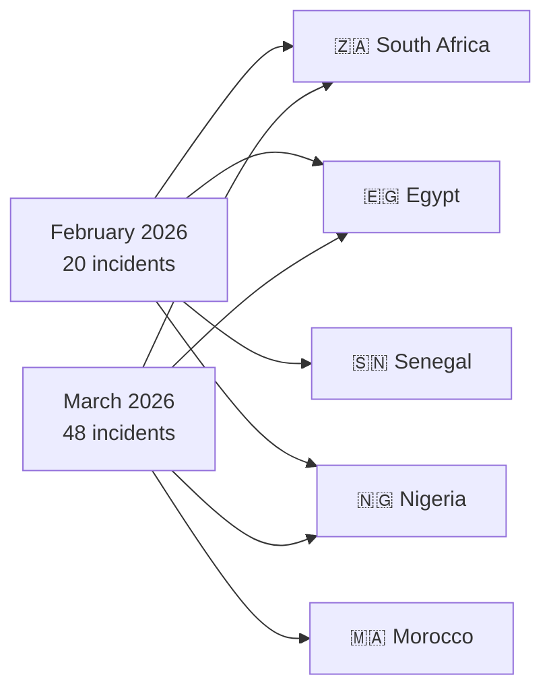
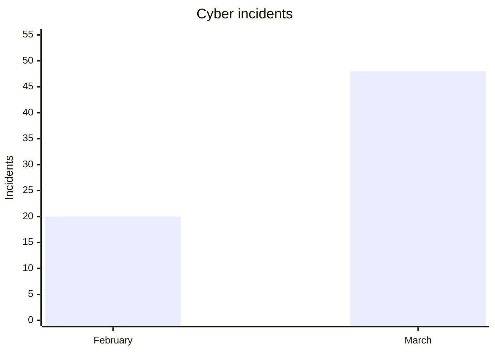

# AFRINTEL - Comparative Cyber Threat Analysis

👉🏾 [Version française disponible ici](README_FR.md)

## February vs March 2026 (Africa)

This report provides a comparative CTI analysis of cyber incidents affecting Africa during February and March 2026.

---

# 📊 General Comparison

| Indicator | February 2026 | March 2026 |
|---|---|---|
| Incidents | 20 | 48 |
| Countries affected | 13 | 14 |
| Threat actors observed | 10 | 24+ |
| Ransomware | dominant | high |
| Data leaks | limited | explosive increase |
| Government incidents | important | very high |

---

# 🌍 Geographic Distribution

---

# 📈 Incident Volume

---

# 🎯 CTI Trends

- February 2026 remained dominated by traditional ransomware activity.
- March 2026 showed a sharp increase in data leaks and intrusions.
- Morocco became a major CTI hotspot during March.
- Exfiltration-oriented operations significantly increased.
- Government, healthcare and education sectors became priority targets.

---

# 🔥 Major Incidents

## February 2026

- DAF Senegal (139 TB)
- 0APT emergence and disappearance
- aviation and energy attacks

## March 2026

- Smarteez / L’Oréal Morocco impact
- AuditTeam operations
- growth of multi-country campaigns

---

# 🛡 SOC Recommendations

- Monitor large-scale exfiltration
- Correlate privileged authentication with outbound traffic
- Strengthen MFA and segmentation
- Increase CTI monitoring on leak sites

---

# AFRINTEL

TLP:CLEAR
