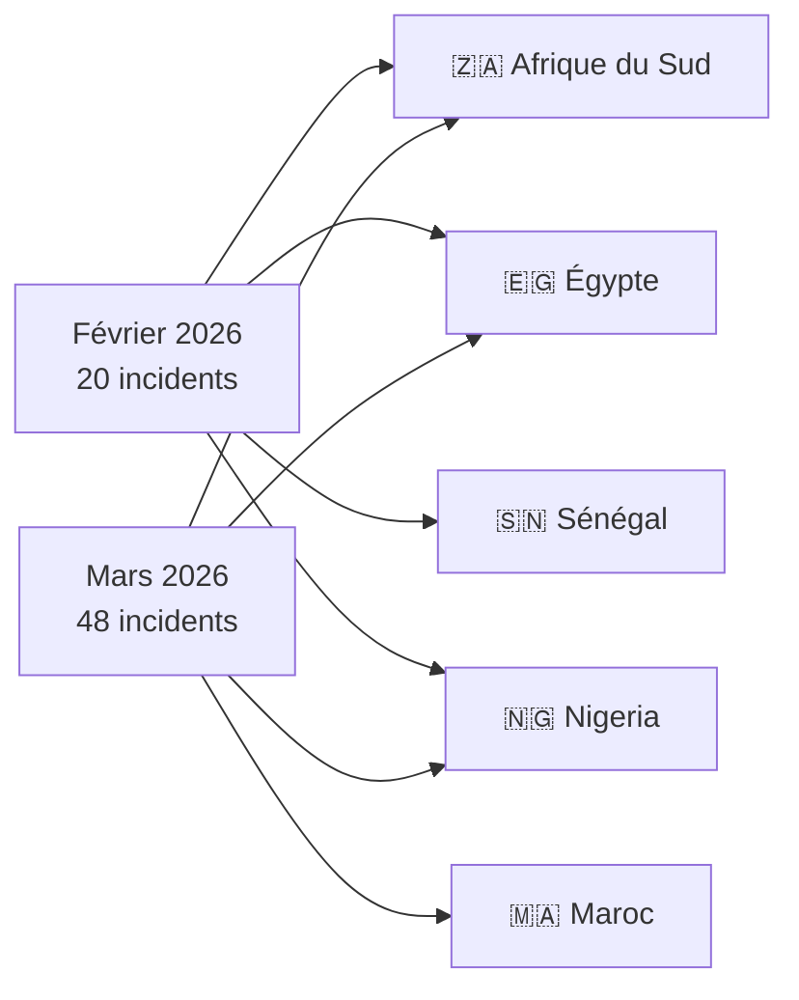
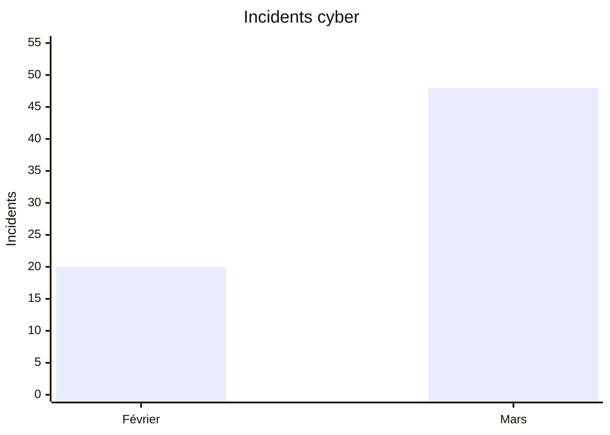

# AFRINTEL - Analyse comparative des cybermenaces

👉🏾 [English version available here](README.md)

## Février vs Mars 2026 (Afrique)

Ce rapport présente une analyse comparative CTI des incidents cyber affectant l’Afrique durant février et mars 2026.

---

# 📊 Comparaison générale

| Indicateur | Février 2026 | Mars 2026 |
|---|---|---|
| Incidents | 20 | 48 |
| Pays touchés | 13 | 14 |
| Acteurs observés | 10 | 24+ |
| Ransomware | dominant | élevé |
| Fuites de données | limitées | explosion |
| Incidents gouvernementaux | importants | très élevés |

---

# 🌍 Répartition géographique

---

# 📈 Volume d'incidents

---

# 🎯 Tendances CTI

- Février 2026 reste dominé par le ransomware classique.
- Mars 2026 montre une montée forte des fuites de données et intrusions.
- Le Maroc devient un hotspot CTI majeur en mars.
- Les opérations orientées exfiltration augmentent fortement.
- Les secteurs gouvernement, santé et éducation deviennent prioritaires.

---

# 🔥 Incidents majeurs

## Février 2026

- DAF Sénégal (139 To)
- 0APT et disparition des leak sites
- attaques aviation et énergie

## Mars 2026

- Smarteez / impact L’Oréal Maroc
- opérations AuditTeam
- multiplication des campagnes multi-pays

---

# 🛡 Recommandations SOC

- Surveiller les exfiltrations massives
- Corréler authentifications privilégiées et trafic sortant
- Renforcer MFA et segmentation réseau
- Intensifier la veille CTI sur les leak sites

---

# AFRINTEL

TLP:CLEAR
