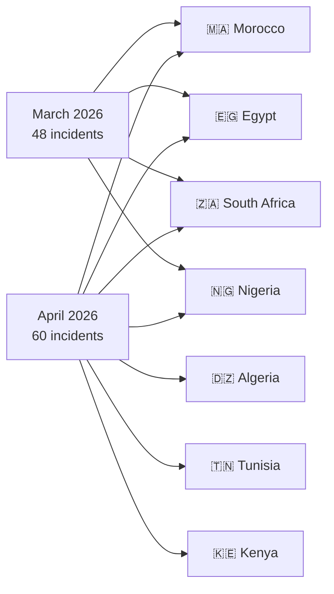
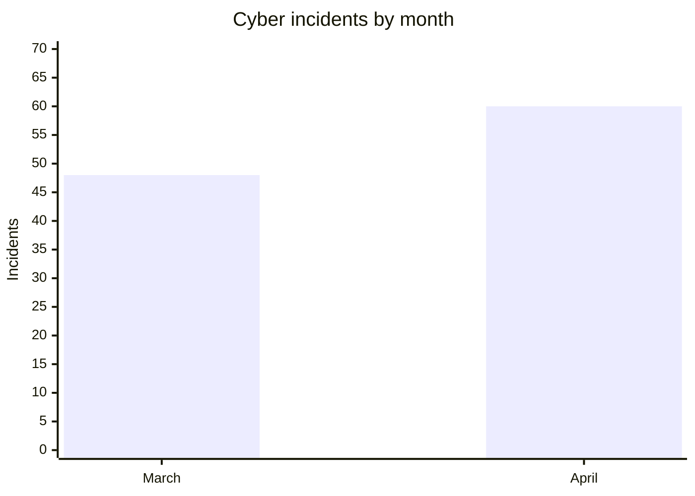
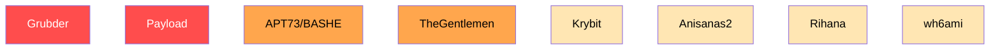
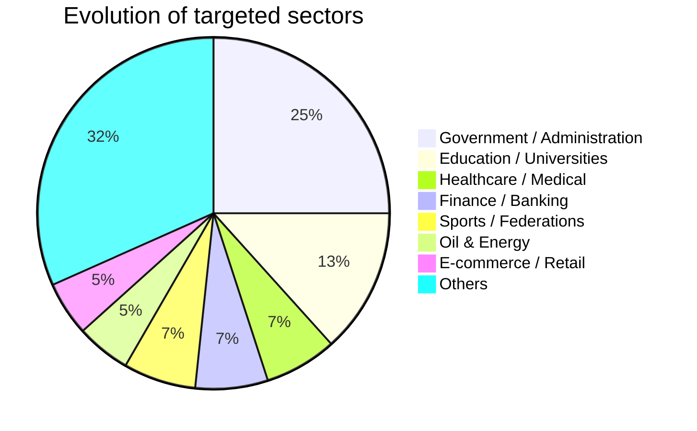

# AFRINTEL - Comparative Cyber Threat Analysis  
👉🏾 [Version française disponible ici](README_FR.md)

## March vs April 2026 (Africa)

This report provides a comparative Cyber Threat Intelligence (CTI) analysis of cyber incidents affecting Africa during March and April 2026.

---

# 📊 General Comparison

| Indicator | March 2026 | April 2026 |
|---|---|---|
| Incidents | 48 | 60 |
| Countries affected | 14 | 16 |
| Threat actors | 24+ | 30+ |
| Ransomware | 22 | 20 |
| Data leaks / Access sales | 26 | 40 |
| Government-related incidents | High | Very High |
| Identity / KYC leaks | Moderate | Massive increase |

---

# 🌍 Geographic Distribution Comparison

---

# 📈 Incident Volume by Month

---

# 🎯 Threat Actor Activity

## Key observations

- Grubder became the dominant African data broker actor in April.
- Payload intensified ransomware campaigns against Egyptian strategic sectors.
- Government access sales sharply increased.
- Identity-centric cybercrime exploded across Morocco and North Africa.

---

# 🏭 Comparison of Targeted Sectors

---

# 🔥 Major Incidents

## March 2026

- Smarteez / L’Oréal Morocco supply-chain exposure
- AuditTeam Senegal ransomware operations
- Multiple African ransomware waves targeting finance and industry

## April 2026

- CNOPS Morocco massive healthcare leak
- Royal Palace staff database exposure
- Kenya Airports Authority claimed 2 TB compromise
- CNSS Benin mailbox leak
- Pick n Pay ASAP / Bottles.com banking data exposure

---

# 🧠 Strategic CTI Findings

1. Industrialization of African data brokers accelerated significantly.
2. Government systems became primary monetization targets.
3. Identity-document trading became a dominant underground business model.
4. Healthcare and educational ecosystems remain critically exposed.

---

# 🔮 Threat Outlook

Priority targets expected in coming months:

- Government institutions
- Healthcare ecosystems
- Financial infrastructures
- Educational platforms
- E-commerce environments

Priority countries:

🇲🇦 Morocco • 🇪🇬 Egypt • 🇿🇦 South Africa • 🇳🇬 Nigeria • 🇩🇿 Algeria

---

# AFRINTEL

African Threat Intelligence Initiative  
TLP:CLEAR – Public distribution
