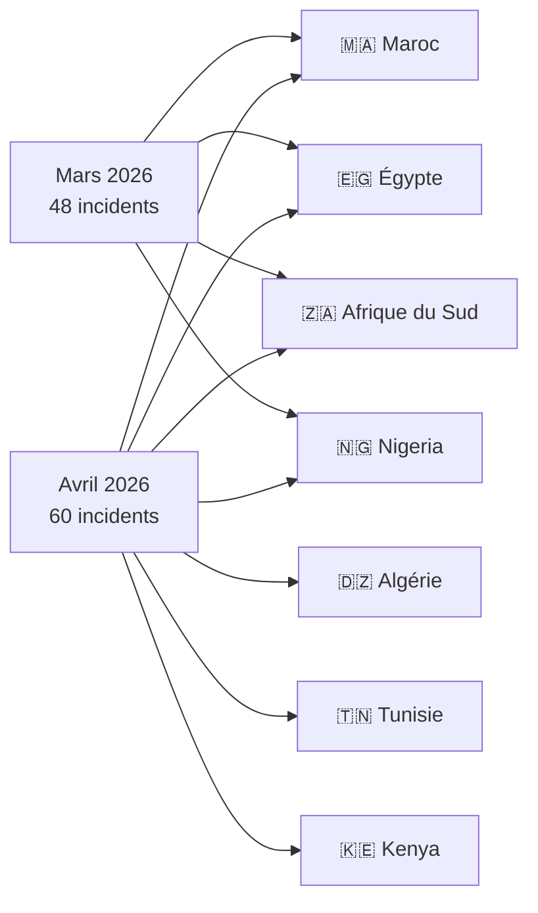
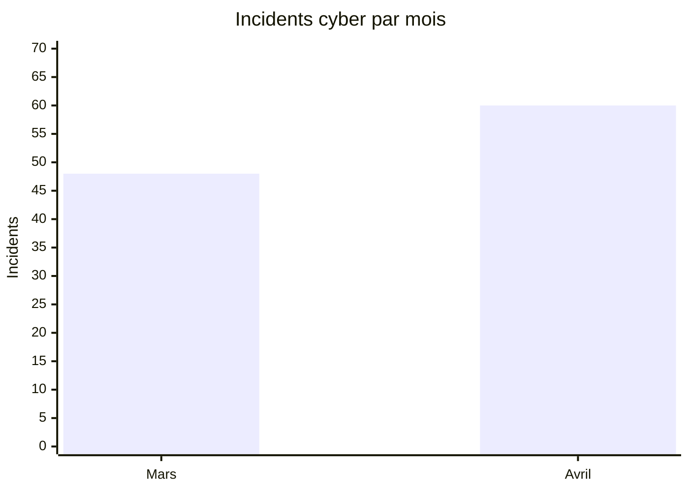
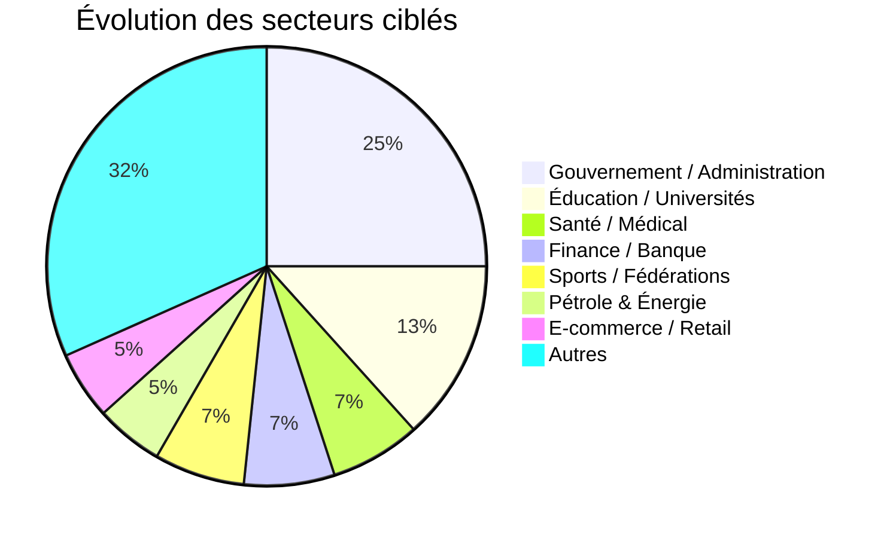

# AFRINTEL - Analyse comparative des cybermenaces  en Afrique
👉🏾 [English version available here](README.md)

## Mars vs Avril 2026 (Afrique)

Ce rapport présente une analyse comparative de Cyber Threat Intelligence (CTI) des incidents cyber ayant affecté l’Afrique durant mars et avril 2026.

---

# 📊 Comparaison générale

| Indicateur | Mars 2026 | Avril 2026 |
|---|---|---|
| Incidents | 48 | 60 |
| Pays touchés | 14 | 16 |
| Acteurs malveillants | 24+ | 30+ |
| Ransomware | 22 | 20 |
| Fuites de données / ventes d’accès | 26 | 40 |
| Incidents gouvernementaux | Élevés | Très élevés |
| Fuites KYC / identité | Modérées | Explosion |

---

# 🌍 Comparaison de la répartition géographique

---

# 📈 Volume d’incidents par mois

---

# 🎯 Activité des acteurs de la menace

## Observations clés

- Grubder devient l’acteur dominant des ventes de données en avril.
- Payload intensifie les campagnes ransomware contre les secteurs stratégiques égyptiens.
- Les ventes d’accès gouvernementaux augmentent fortement.
- La cybercriminalité orientée identité explose au Maroc et en Afrique du Nord.

---

# 🏭 Comparaison des secteurs ciblés

---

# 🔥 Incidents majeurs

## Mars 2026

- Smarteez / impact L’Oréal Maroc
- Opérations ransomware AuditTeam au Sénégal
- Vagues ransomware visant finance et industrie

## Avril 2026

- Fuite massive CNOPS Maroc
- Exposition de la base du personnel du Palais Royal
- Kenya Airports Authority (2 To revendiqués)
- Fuite de messagerie CNSS Bénin
- Exposition bancaire Pick n Pay ASAP / Bottles.com

---

# 🧠 Enseignements stratégiques CTI

1. Industrialisation accélérée des courtiers de données africains.
2. Les systèmes gouvernementaux deviennent des cibles de monétisation prioritaires.
3. Le commerce de documents d’identité explose.
4. Les secteurs santé et éducation restent fortement exposés.

---

# 🔮 Perspectives de menace

Secteurs susceptibles de rester fortement ciblés :

- Institutions gouvernementales
- Santé
- Finance
- Éducation
- E-commerce

Pays prioritaires :

🇲🇦 Maroc • 🇪🇬 Égypte • 🇿🇦 Afrique du Sud • 🇳🇬 Nigeria • 🇩🇿 Algérie

---

# AFRINTEL

African Threat Intelligence Initiative  
TLP:CLEAR – diffusion publique
