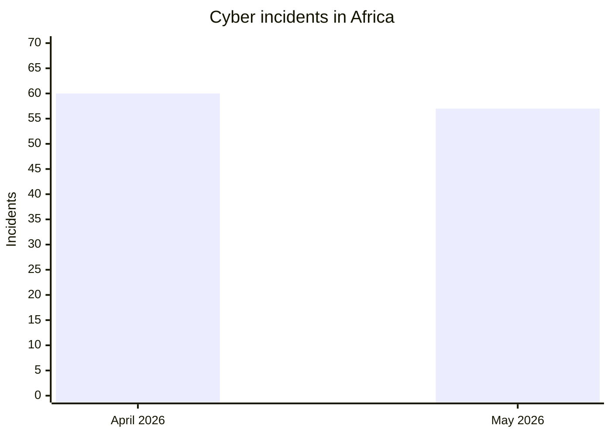
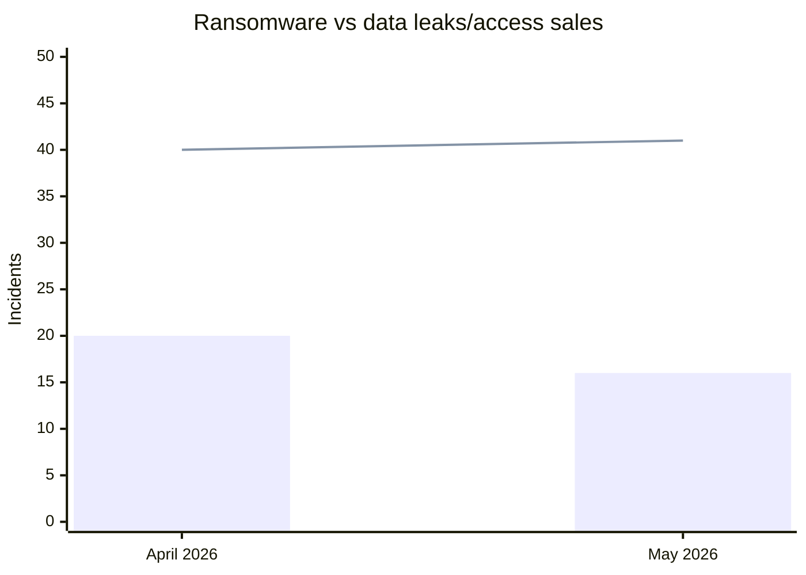
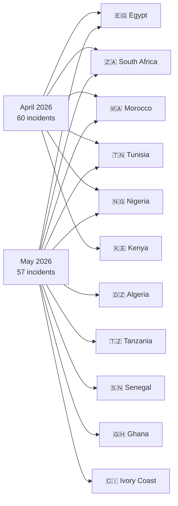
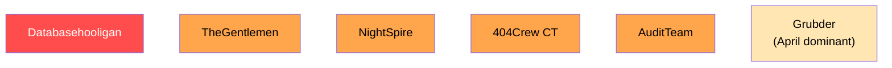

# AFRINTEL - Comparative cyber threat analysis
## April vs May 2026 (Africa)

👉🏾 [Version française disponible ici](README_FR.md)

TLP:CLEAR – Public distribution

---

## General comparison

| Indicator | April 2026 | May 2026 | Change |
|---|---:|---:|---:|
| Total incidents | 60 | 57 | -3 (-5%) |
| Countries affected | 16 | 11 + multi-country | Narrower scope |
| Distinct actors | 30+ | 25+ | Slight decrease |
| Ransomware | 20 | 16 | -4 (-20%) |
| Data leaks / access sales | 40 | 41 | +1 (+3%) |
| Government-related incidents | Very High | High | Stable |
| Education sector incidents | Moderate | Systemic | Sharp increase |
| Identity / KYC leaks | Massive | High | Sustained |

---

## Volume comparison

---

## Ransomware vs data leaks

*Legend: bars = ransomware, line = data leaks/access sales*

---

## Geographic distribution

---

## Country ranking comparison

| Country | April 2026 | May 2026 | Trend |
|---|---:|---:|:---:|
| 🇪🇬 Egypt | ~15 | 16 | ↑ |
| 🇿🇦 South Africa | ~12 | 14 | ↑ |
| 🇲🇦 Morocco | ~10 | 7 | ↓ |
| 🇹🇳 Tunisia | ~5 | 5 | → |
| 🇳🇬 Nigeria | ~5 | 3 | ↓ |
| 🇩🇿 Algeria | ~4 | 2 | ↓ |
| 🇰🇪 Kenya | ~3 | 1 | ↓ |
| 🇹🇿 Tanzania | 0 | 2 | ↑ new |
| 🇸🇳 Senegal | 0 | 1 | ↑ new |
| 🇬🇭 Ghana | 0 | 1 | ↑ new |
| 🇨🇮 Ivory Coast | 0 | 1 | ↑ new |
| 🌍 Multi-country | ~6 | 3 | ↓ |

> April 2026 country-level counts are estimates pending full reconciliation with the April statistics file.

---

## Sector evolution

| Sector | April 2026 | May 2026 | Trend |
|---|:---:|:---:|:---:|
| Government / Administration | Very High | High | → |
| Education / University | Moderate | **Systemic** | ↑↑ |
| Recruitment / Personal Data | Moderate | High | ↑ |
| Finance / Banking | High | Moderate | ↓ |
| Healthcare | High | Low | ↓ |
| Food / Beverage | Low | Moderate | ↑ |
| Telecom / ICT | Moderate | Moderate | → |

---

## Threat actor evolution

### Most active actors

| Actor | April 2026 | May 2026 |
|---|:---:|:---:|
| Databasehooligan | Active | **Dominant (8 victims)** |
| TheGentlemen | Active | Active (4 countries) |
| NightSpire | - | **Emerging (3 Egypt)** |
| 404Crew Cyber Team | Active | Active (OpSouthAfrica) |
| Grubder | Dominant | Less visible |
| Payload | Active | Less visible |
| APT73/BASHE | Active | Less visible |

---

## Key findings

### What escalated from April to May

- **Education sector:** April had scattered education incidents; May saw a systemic breach of Egypt's entire education infrastructure (28M+ students and teachers).
- **OpSouthAfrica coalition:** 404Crew escalated from individual leaks to a coordinated political campaign against 8 South African institutions.
- **Ransomware on government:** AuditTeam's attack on the Tresor Public du Senegal confirmed double-extortion with the largest single government data exfiltration of the year to date (~1.66M records).
- **NightSpire emergence:** absent in April, claimed 3 Egyptian targets in May – the month's leading ransomware group on the continent.

### What decreased from April to May

- **Morocco:** from 10+ incidents in April to 7 in May – still elevated, with a persistent data exfiltration campaign (RADEM Meknès, multi-entity bundle sale by anisanas2).
- **Kenya:** April included the Kenya Airports Authority 2TB claim; May had only 1 incident.
- **Healthcare:** CNOPS Morocco and widespread health incidents in April did not repeat at the same scale in May.
- **Total incident volume:** slight decline from 60 to 57, driven primarily by a reduction in ransomware (-4). Data leaks increased slightly (+1).

### Structural continuities

- Egypt and South Africa remain the two most targeted countries both months.
- Data broker activity (Databasehooligan) intensified rather than declined.
- Government credentials and law enforcement email exposure grew as a market segment.
- CRM and recruitment database sales continued across North and Southern Africa.

---

## Strategic assessment

The April-to-May shift shows **sustained attack volume with a qualitative shift in targeting**. The overall reduction from 60 to 57 incidents is marginal; what changed is the sectoral focus. Education in Egypt became a strategic target category, and ransomware hit higher-impact government institutions (Tresor Public du Senegal). The emergence of NightSpire and consolidation of the 404Crew coalition signal ongoing ecosystem maturation.

### 30-60-90 day risk outlook (from June 2026)

- **30 days:** Government, education, and fintech sectors remain under elevated threat. Nigeria fintech sector now confirmed as high-value target (Jeroid.co, June 2026).
- **60 days:** Law enforcement impersonation market (EDR/LEP access sales) likely to expand given June 2026 confirmation of two active actors.
- **90 days:** OpSouthAfrica-style coalition campaigns may replicate against other African regional targets as actor networks consolidate.

---

*AFRINTEL – African Cyber Threat Intelligence | TLP:CLEAR*
