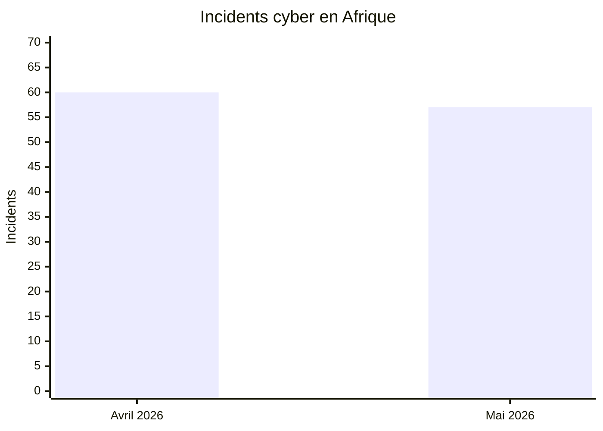
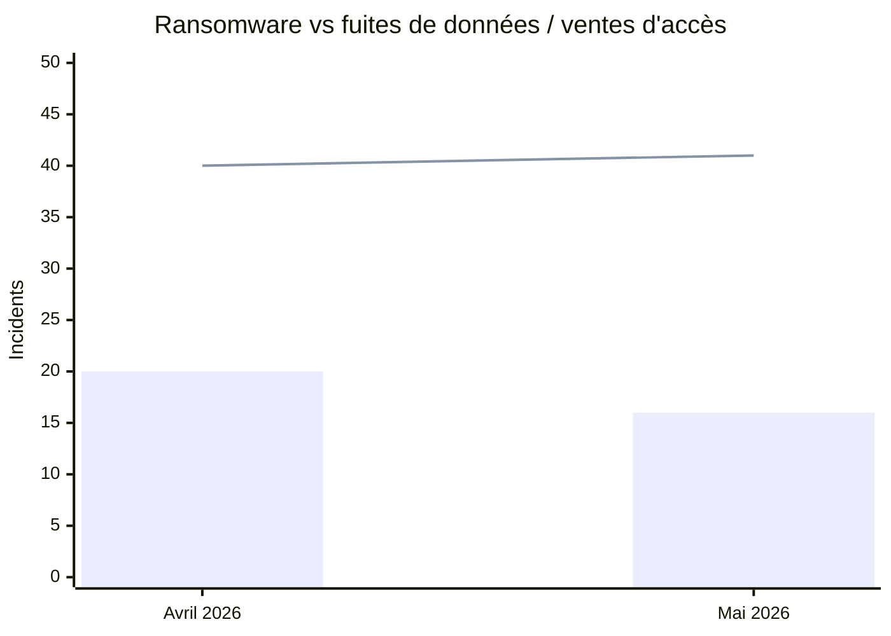
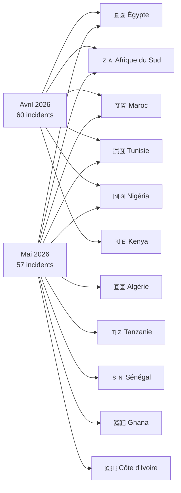
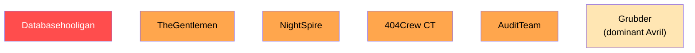

# AFRINTEL - Analyse comparative des cybermenaces en Afrique
## Avril vs Mai 2026

👉🏾 [English version available here](README.md)

TLP:CLEAR - Distribution publique

---

## Comparaison générale

| Indicateur | Avril 2026 | Mai 2026 | Évolution |
|---|---:|---:|---:|
| Total incidents | 60 | 57 | -3 (-5 %) |
| Pays touchés | 16 | 11 + multi-pays | Périmètre plus resserré |
| Acteurs distincts | 30+ | 25+ | Légère baisse |
| Ransomware | 20 | 16 | -4 (-20 %) |
| Fuites de données / ventes d'accès | 40 | 41 | +1 (+3 %) |
| Incidents gouvernementaux | Très élevés | Élevés | Stable |
| Incidents secteur éducatif | Modérés | Systémiques | Forte hausse |
| Fuites KYC / identité | Massives | Élevées | Soutenu |

---

## Comparaison des volumes

---

## Ransomware vs fuites de données

*Légende : barres = ransomware, ligne = fuites de données / ventes d'accès*

---

## Répartition géographique

---

## Classement des pays

| Pays | Avril 2026 | Mai 2026 | Tendance |
|---|---:|---:|:---:|
| 🇪🇬 Égypte | ~15 | 16 | ↑ |
| 🇿🇦 Afrique du Sud | ~12 | 14 | ↑ |
| 🇲🇦 Maroc | ~10 | 7 | ↓ |
| 🇹🇳 Tunisie | ~5 | 5 | → |
| 🇳🇬 Nigéria | ~5 | 3 | ↓ |
| 🇩🇿 Algérie | ~4 | 2 | ↓ |
| 🇰🇪 Kenya | ~3 | 1 | ↓ |
| 🇹🇿 Tanzanie | 0 | 2 | ↑ nouveau |
| 🇸🇳 Sénégal | 0 | 1 | ↑ nouveau |
| 🇬🇭 Ghana | 0 | 1 | ↑ nouveau |
| 🇨🇮 Côte d'Ivoire | 0 | 1 | ↑ nouveau |
| 🌍 Multi-pays | ~6 | 3 | ↓ |

> Les décomptes par pays pour avril 2026 sont des estimations en attente de rapprochement avec le fichier statistiques d'avril.

---

## Évolution sectorielle

| Secteur | Avril 2026 | Mai 2026 | Tendance |
|---|:---:|:---:|:---:|
| Gouvernement / Administration | Très élevé | Élevé | → |
| Éducation / Universités | Modéré | **Systémique** | ↑↑ |
| Recrutement / Données personnelles | Modéré | Élevé | ↑ |
| Finance / Banque | Élevé | Modéré | ↓ |
| Santé | Élevé | Faible | ↓ |
| Alimentation / Restauration | Faible | Modéré | ↑ |
| Telecom / ICT | Modéré | Modéré | → |

---

## Évolution des acteurs de menace

| Acteur | Avril 2026 | Mai 2026 |
|---|:---:|:---:|
| Databasehooligan | Actif | **Dominant (8 victimes)** |
| TheGentlemen | Actif | Actif (4 pays) |
| NightSpire | Absent | **Émergent (3 cibles Égypte)** |
| 404Crew Cyber Team | Actif | Actif (OpSouthAfrica) |
| Grubder | Dominant | Moins visible |
| Payload | Actif | Moins visible |

---

## Conclusions clés

### Ce qui s'est aggravé d'avril à mai

- **Secteur éducatif :** avril enregistrait des incidents épars ; mai a vu une attaque systémique de toute l'infrastructure éducative égyptienne (28 millions d'élèves et enseignants).
- **Coalition OpSouthAfrica :** 404Crew est passé de fuites individuelles à une campagne politique coordonnée contre 8 institutions sud-africaines.
- **Ransomware sur entités gouvernementales :** l'attaque AuditTeam contre le Trésor Public du Sénégal a confirmé une double-extorsion avec la plus grande exfiltration gouvernementale de l'année (~1,66 million d'enregistrements).
- **Émergence de NightSpire :** absent en avril, le groupe a revendiqué 3 cibles égyptiennes en mai, devenant le principal groupe ransomware du mois sur le continent.

### Ce qui a diminué d'avril à mai

- **Maroc :** de 10+ incidents en avril à 7 en mai, encore élevé avec une campagne persistante d'exfiltration de données publiques (RADEM Meknès, vente massive multi-entités).
- **Kenya :** avril comprenait la revendication Kenya Airports Authority (2 To) ; mai n'enregistre qu'un seul incident.
- **Santé :** la vague d'incidents santé d'avril (CNOPS Maroc notamment) ne s'est pas reproduite à la même échelle.
- **Volume total :** légère baisse de 60 à 57, portée principalement par la réduction des ransomwares (-4). Les fuites de données ont légèrement augmenté (+1).

### Continuités structurelles

- L'Égypte et l'Afrique du Sud restent les deux pays les plus ciblés les deux mois.
- L'activité data broker (Databasehooligan) s'est intensifiée plutôt que diminuée.
- La vente d'identifiants gouvernementaux et d'e-mails forces de l'ordre s'est affirmée comme segment de marché.
- Les ventes de bases de données CRM et recrutement se sont poursuivies en Afrique du Nord et australe.

---

## Évaluation stratégique

Le passage d'avril à mai révèle un **volume d'attaques soutenu avec un glissement qualitatif des cibles**. La baisse globale de 60 à 57 incidents est marginale ; ce qui a changé, c'est le focus sectoriel. L'éducation en Égypte est devenue une catégorie stratégique, et le ransomware a touché des institutions gouvernementales à fort impact (Trésor Public du Sénégal). L'émergence de NightSpire et la consolidation de la coalition 404Crew signalent une maturation continue de l'écosystème criminel ciblant l'Afrique.

### Perspectives de risque à 30-60-90 jours (depuis juin 2026)

- **30 jours :** les secteurs gouvernemental, éducatif et fintech restent sous menace élevée. Le secteur fintech nigérian est désormais confirmé comme cible à haute valeur (Jeroid.co, juin 2026).
- **60 jours :** le marché d'usurpation des forces de l'ordre (ventes d'accès EDR/LEP) devrait se développer compte tenu de la confirmation en juin 2026 de deux acteurs actifs.
- **90 jours :** des campagnes de type OpSouthAfrica pourraient se reproduire contre d'autres cibles régionales africaines à mesure que les réseaux d'acteurs se consolident.

---

*AFRINTEL - Initiative ouverte de veille CTI sur l'Afrique | TLP:CLEAR*
