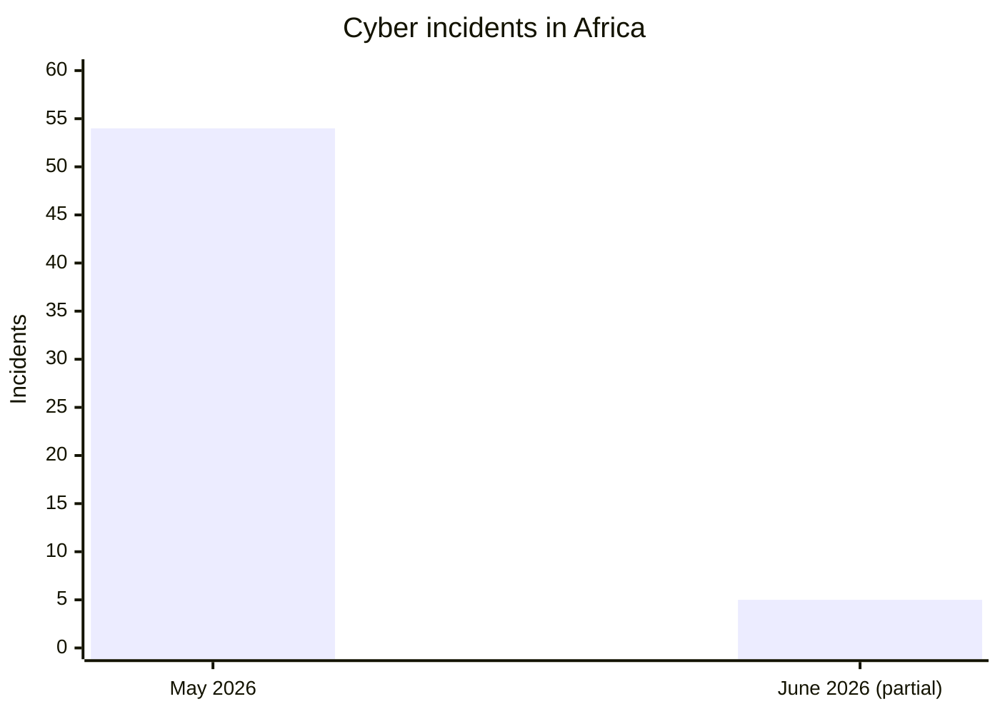
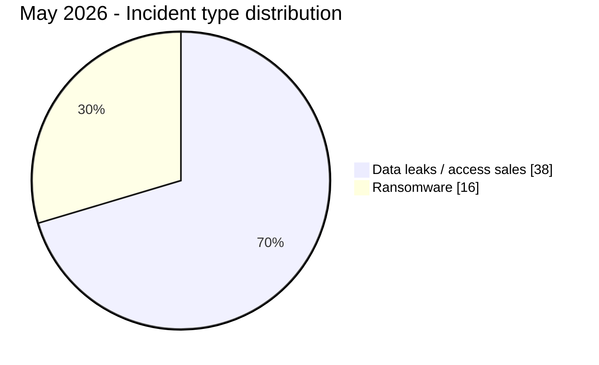
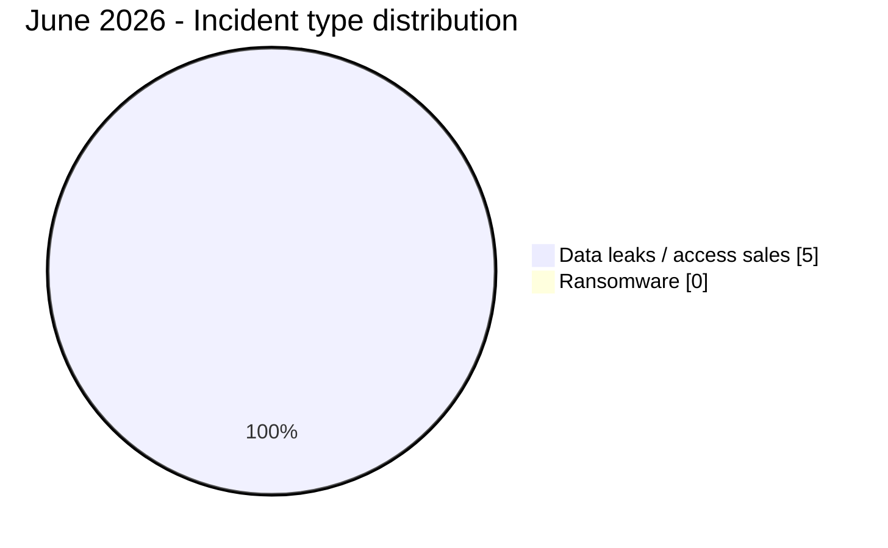
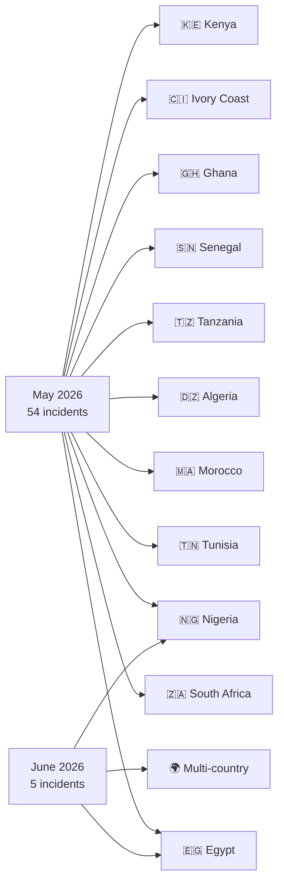
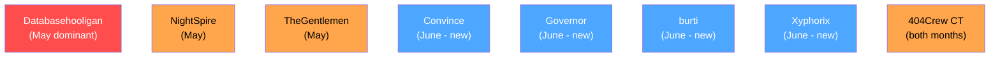

# AFRINTEL - Comparative cyber threat analysis
## May vs June 2026 (Africa)

👉🏾 [Version française disponible ici](README_FR.md)

TLP:CLEAR – Public distribution

> Note: June 2026 data covers 1-21 June 2026 (month in progress at time of publication).

---

## General comparison

| Indicator | May 2026 | June 2026 | Change |
|---|---:|---:|---:|
| Total incidents | 54 | 5 | -49 (significant) |
| Countries directly affected | 11 + multi | 2 + multi | Sharp decrease |
| Distinct actors | 25+ | 5 | Decrease |
| Ransomware | 16 | 0 | -16 (-100%) |
| Data leaks / access sales | 38 | 5 | -33 (-87%) |
| Government-related incidents | High | High | Stable |
| Law enforcement exposure | Moderate | Critical | ↑↑ |
| Fintech sector | Low | Critical | ↑↑ new |

> The drop in incident count reflects both a genuine reduction and the fact that June data is partial (1-21 June only). The qualitative shift from ransomware to access monetization is structurally significant.

---

## Volume comparison

---

## Ransomware vs data leaks

---

## Geographic distribution

---

## Country ranking comparison

| Country | May 2026 | June 2026 | Trend |
|---|---:|---:|:---:|
| 🇪🇬 Egypt | 16 | 1 | ↓ |
| 🇿🇦 South Africa | 14 | 0 | ↓ absent |
| 🇲🇦 Morocco | 5 | 0 | ↓ absent |
| 🇹🇳 Tunisia | 5 | 0 | ↓ absent |
| 🇳🇬 Nigeria | 3 | 2 | ↓ but present |
| 🇩🇿 Algeria | 2 | 0 | ↓ absent |
| 🇹🇿 Tanzania | 2 | 0 | ↓ absent |
| 🌍 Multi-country | 3 | 2 | → stable |

---

## Sector evolution

| Sector | May 2026 | June 2026 | Trend |
|---|:---:|:---:|:---:|
| Government / Administration | 14 (25.9%) | 3 (60%) | Dominates June |
| Fintech / Cryptocurrency | 0 | 1 (20%) | **New entry** |
| Aviation / Military | 0 | 1 (20%) | **New entry** |
| Education / University | 5 (9.3%) | 0 | ↓ absent |
| Recruitment / Personal Data | 8 (14.8%) | 0 | ↓ absent |
| Finance / Banking | 4 (7.4%) | 0 | ↓ absent |
| Healthcare | 2 (3.7%) | 0 | ↓ absent |

---

## Threat actor evolution

| Actor | May 2026 | June 2026 |
|---|:---:|:---:|
| Databasehooligan | **Dominant (8)** | Absent |
| TheGentlemen | Active (4) | Absent |
| NightSpire | Active (3) | Absent |
| 404Crew CT | Active (4+) | Active (NILDS) |
| Convince | Absent | **New (EDR fraud)** |
| Governor | Absent | **New (LEP access)** |
| burti | Absent | **New (Jeroid.co)** |
| Xyphorix | Absent | **New (Egypt pilots)** |

---

## Key findings

### What disappeared from May to June

- **Ransomware:** 16 incidents in May, 0 in June. This is the most striking shift. No ransomware group published African victims in the documented June period.
- **South Africa:** 14 incidents in May, 0 in June. The OpSouthAfrica campaign ended without replacement.
- **Morocco:** 5 incidents in May, 0 in June.
- **Tunisia:** 5 incidents in May, 0 in June.
- **Education sector:** 5 incidents in May (systemic Egypt breach), 0 in June.
- **Databasehooligan:** 8 victims in May, no visible activity in June.

### What emerged in June

- **Law enforcement impersonation market:** two independent actors (Convince and Governor) sell EDR credentials and authenticated LEP portal accounts targeting at least 11 African countries. This represents a new structural threat to digital governance, absent from May's documented activity.
- **Fintech as a high-value target:** Jeroid.co breach (Nigeria) is the first major fintech data leak of 2026 combining BVN, NIN, and biometric data at scale.
- **Military/aviation sector:** Egyptian pilots database – a new sector category not seen in May.
- **Nigeria dominant in June:** 2 of 5 directly attributed incidents, versus 3 of 54 in May.

### Continuities

- Government sector remains the primary target category (60% of June incidents vs 25.9% in May, confirming persistent focus).
- 404Crew Cyber Team maintained presence both months (OpSouthAfrica in May, NILDS in June).
- Law enforcement credential exposure grew from a secondary theme in May (Tanzania Police webmail) to the defining threat of June.

---

## Strategic assessment

The May-to-June shift reveals a **structural change in threat actor behavior**. The complete disappearance of ransomware and the sharp volume reduction are partly explained by June data being partial, but the qualitative shift is real: threat actors pivoted from encryption and mass database sales to targeted access monetization, specifically law enforcement impersonation infrastructure.

The Jeroid.co breach is structurally different from the May data broker activity: it combines financial, biometric, and identity data in a single platform breach, representing a systemic risk to Nigeria's entire banking and digital identity ecosystem.

The consolidation of an EDR/LEP access sale market in June signals that criminal actors are now actively targeting Africa's law enforcement authentication infrastructure as a standalone monetizable product.

### 30-60-90 day risk outlook (from June 21, 2026)

- **30 days:** Nigerian fintech sector at elevated risk following Jeroid.co breach; anticipate increased BVN-linked fraud attempts. Law enforcement EDR/LEP credential abuse will likely generate downstream fraud cases across Africa.
- **60 days:** Ransomware groups absent in June (NightSpire, TheGentlemen, Databasehooligan) may resurface with new African campaigns. South Africa and Egypt will likely return as primary targets.
- **90 days:** The EDR/LEP access sale market may expand to other African countries not yet documented. Anticipate further fintech and government credential targeting in West and North Africa.

---

*AFRINTEL – African Cyber Threat Intelligence | TLP:CLEAR*
