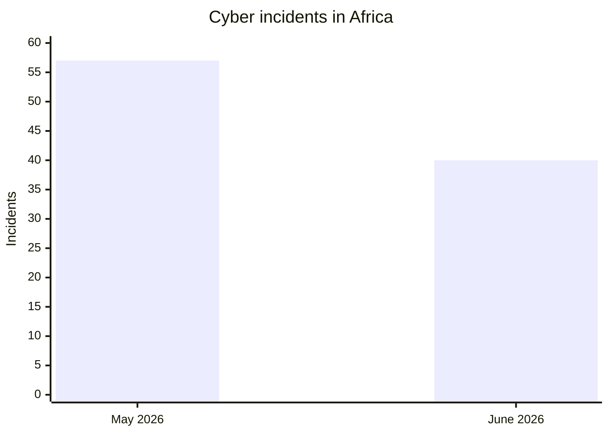
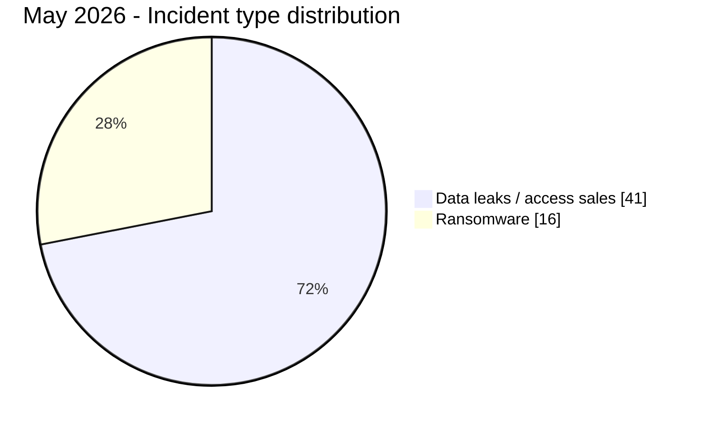
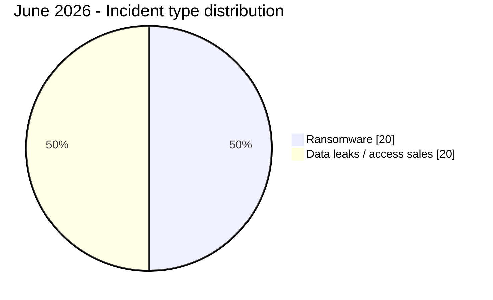
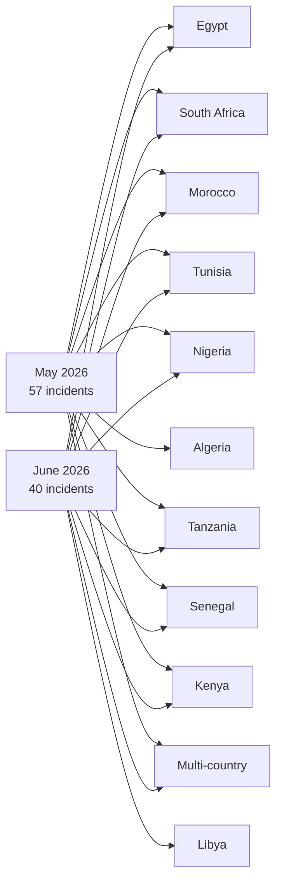

# AFRINTEL - Comparative cyber threat analysis
## May vs June 2026 (Africa)

👉🏾 [Version française disponible ici](README_FR.md)

TLP:CLEAR, public distribution

> Both months are now finalized. May 2026 covers 1-31 May, June 2026 covers 1-30 June. Incidents are assigned to the month in which AFRINTEL first identified and assessed them, while earlier original claim dates remain documented in the victim cards.

---

## General comparison

| Indicator | May 2026 | June 2026 | Change |
|---|---:|---:|---:|
| Total incidents | 57 | 40 | -17 (-29.8%) |
| Countries affected | 18 (12 direct + 6 multi) | 20 (14 direct + 6 multi) | +2 countries |
| Distinct actors | 25+ | 25 | Stable |
| Ransomware | 16 (28.1%) | 20 (50.0%) | +4 (+25.0%), share nearly doubled |
| Data leaks / access sales | 41 (71.9%) | 20 (50.0%) | -21 (-51.2%) |
| Government-related incidents | 17 (29.8%) | 12 (30.0%) | Stable share |
| Most targeted country | Egypt (16) | Morocco (9) | Shifted from North-East to North-West Africa |

> Total volume dropped by nearly 30%, but this is not a story of declining risk. Ransomware's share of incidents nearly doubled, and the month's most severe individual incidents (Jeroid.co, the Nigerian Army credential leak, BRELA Tanzania) are each comparable in severity to May's worst cases.

---

## Volume comparison

---

## Ransomware vs data leaks

The share of ransomware rose from 28.1% to 50.0% month over month. This is driven by geographic spread (DeadLock hit 4 countries, LockBit 5 hit 3 countries in a single week) rather than concentration in one country, unlike May where Egypt alone accounted for nearly half of all ransomware activity.

---

## Geographic distribution

---

## Country ranking comparison

| Country | May 2026 | June 2026 | Trend |
|---|---:|---:|:---:|
| Morocco | 7 | 9 | Up, now the top country |
| South Africa | 14 | 6 | Down, still active |
| Egypt | 16 | 4 | Down sharply, no longer dominant |
| Nigeria | 3 | 4 | Up slightly |
| Tunisia | 5 | 4 | Stable |
| Libya | 0 | 3 | New direct entrant |
| Algeria | 2 | 0 | Absent in June |
| Tanzania | 2 | 1 | Down |
| Kenya | 1 | 1 | Stable |
| Senegal | 1 | 1 | Stable |
| Ghana | 1 | 0 | Absent in June |
| Ivory Coast | 1 | 0 | Absent in June |
| Ethiopia | 1 | 0 (multi-country exposure only) | Shifted to indirect exposure |
| Gabon | 0 | 1 | New entrant |
| Zimbabwe | 0 | 1 | New entrant |
| Botswana | 0 | 1 | New entrant |
| Mauritius | 0 | 1 | New entrant |
| Mayotte | 0 | 1 | New entrant |
| Multi-country incidents | 3 | 2 | Stable pattern, different actors |

The month's defining reversal: Egypt (May's top country by a wide margin) dropped to fourth place, while Morocco went from third to first, driven almost entirely by a single actor cluster (see threat actor evolution below).

---

## Sector evolution

| Sector | May 2026 | June 2026 | Trend |
|---|:---:|:---:|:---:|
| Government / Administration / Defense | 17 (29.8%) | 12 (30.0%) | Stable, still the top sector both months |
| Finance / Banking / Insurance | 4 (7.0%) | 6 (15.0%) | Up, more than doubled its share |
| Education | 5 (8.8%) | 4 (10.0%) | Roughly stable |
| E-commerce / Retail | 3 (5.3%) | 4 (10.0%) | Up |
| Healthcare | 2 (3.5%) | 3 (7.5%) | Up |
| Recruitment / Personal Data | 8 (14.0%) | 0 | Absent in June, Databasehooligan-driven category disappeared with the actor |
| Automotive | 3 (5.3%) | 2 (5.0%) | Stable |
| Logistics / Transport | 3 (5.3%) | 2 (5.0%) | Stable |
| Telecom / ICT | 3 (5.3%) | 0 | Absent in June |
| NGO / Charity | 2 (3.5%) | 0 | Absent in June |

Government remains the single most consistent target category across both months at essentially the same share, confirming this is a structural pattern, not a monthly anomaly. Finance's jump is driven largely by one incident, Jeroid.co, whose severity outweighs its single count.

---

## Threat actor evolution

| Actor | May 2026 | June 2026 |
|---|:---:|:---:|
| Databasehooligan | Dominant (8) | Absent |
| anisanas2 | Active (2) | **Dominant (7), more than tripled** |
| 404Crew Cyber Team | Active (5) | Active (2) |
| TheGentlemen | Active (4) | Active (1) |
| NightSpire / Nightspire | Active (3) | Active (2) |
| DeadLock | Absent | **New, most geographically distributed (4)** |
| LockBit 5 | Absent | **New (3)** |
| Krybit | Absent | **New (2)** |
| EvaN47 | Absent | **New (2), two Libyan ministries in two days** |
| burti | Absent | **New (Jeroid.co)** |
| Convince / Governor | Absent | **New, law-enforcement credential/portal sales** |

```mermaid
flowchart TB

classDef high fill:#ff4d4d,color:#ffffff
classDef medium fill:#ffa64d,color:#000000
classDef new fill:#4da6ff,color:#ffffff

DBH["Databasehooligan\n(May dominant, 8)"]:::high
ANI["anisanas2\n(May: 2, June: 7)"]:::high
CREW["404Crew Cyber Team\n(active both months)"]:::medium
GENT["TheGentlemen\n(May: 4, June: 1)"]:::medium
NIGHT["NightSpire/Nightspire\n(May: 3, June: 2)"]:::medium
DEAD["DeadLock\n(June, new, 4)"]:::new
LOCK["LockBit 5\n(June, new, 3)"]:::new
KRY["Krybit\n(June, new, 2)"]:::new
```

---

## Key findings

### What disappeared or receded from May to June

- **Databasehooligan:** dominant in May (8 victims across 4 countries), no visible activity in June. Either dormant, rebranded, or shifted to a different monetization channel not yet documented.
- **Egypt's dominance:** 16 incidents in May, 4 in June. The NightSpire/TheGentlemen/multi-actor ransomware wave against Egyptian finance and food services did not repeat.
- **Recruitment / Personal Data sector:** 8 incidents in May (Databasehooligan's core target category), zero in June, disappeared along with the actor.
- **Algeria, Ghana, Ivory Coast:** each had 1-2 incidents in May, none in June.

### What emerged or escalated in June

- **anisanas2's Morocco campaign more than tripled:** 2 incidents in May to 7 in June, now spanning education, logistics, mining, e-commerce, startups and automotive. This is the single most important actor-level shift between the two months.
- **Ransomware's share nearly doubled** (28.1% to 50.0%), driven by DeadLock and LockBit 5 spreading across multiple countries rather than any single-country concentration.
- **Libya entered as a direct target for the first time in 2026** with 3 incidents, including two government ministries hit by the same actor on consecutive days.
- **Law-enforcement credential/portal abuse consolidated into a repeatable model:** Convince and Governor's June listings build directly on the same abuse pattern first seen with isolated credential leaks earlier in the year, now packaged and sold as a service across 15 jurisdictions.
- **Fintech risk materialized concretely:** the reported Jeroid.co exposure (Nigeria) is the most severe single data exposure across both months, combining biometric, KYC and financial data through a reported cloud-storage exposure whose initial access vector remains unknown.

### Continuities

- Government/Administration/Defense remained the top sector both months at a near-identical share (29.8% then 30.0%).
- 404Crew Cyber Team stayed active both months (OpSouthAfrica coalition activity in May, NILDS and MG Maroc in June), confirming it as a persistent actor rather than a one-off campaign.
- Morocco was already flagged as a recurring target in May (RADEM Meknès, Ministry of Justice bundle); June confirms this was the start of a sustained campaign, not an isolated wave.

---

## Strategic assessment

The month-over-month numbers understate what actually changed. Total volume fell by roughly 30%, which on its own might read as a cooling month. It is not. Ransomware's share nearly doubled, a single Moroccan-focused actor cluster more than tripled its output, and two of June's individual incidents (Jeroid.co, the Nigerian Army credential leak) rank among the most severe AFRINTEL has recorded in 2026 regardless of month.

The clearest structural signal is anisanas2's Morocco campaign. It did not appear suddenly in June, it was already present in May, and its escalation from 2 to 7 incidents in one month, now spanning three consecutive months of activity, indicates an operation with a reliable pipeline of targets rather than opportunistic, one-off crime. This is the pattern most likely to still be active when the July report is produced.

The consolidation of the law-enforcement credential/portal access market (Convince, Governor) is the second structural signal worth tracking. It did not exist as a documented pattern in May and appeared fully formed in June across at least 15 jurisdictions, suggesting the underlying supply of compromised government accounts predates its June commercialization.

### 30-60-90 day risk outlook (from July 24, 2026)

- **30 days (into August):** Expect continued anisanas2 activity against Morocco unless a coordinated takedown or notification effort intervenes; expect further ransomware listings from DeadLock, LockBit 5 and Krybit given their June cadence.
- **60 days:** Watch for confirmation of the Libya ministry campaign extending to additional government bodies; watch for Databasehooligan's return or a successor data-broker filling the same recruitment/personal-data niche it vacated in June.
- **90 days:** The law-enforcement credential/portal access market (Convince, Governor) is likely to expand to additional jurisdictions or attract copycat sellers unless Meta, Google, TikTok and X close the underlying verification gap.

---

*AFRINTEL, African Cyber Threat Intelligence. TLP:CLEAR*
