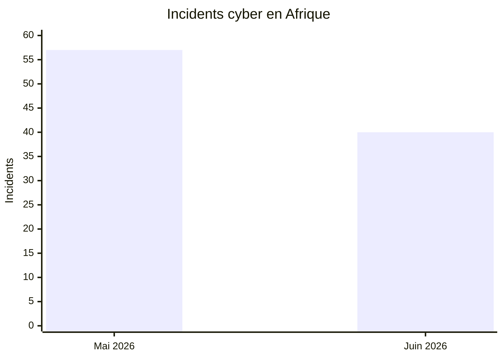
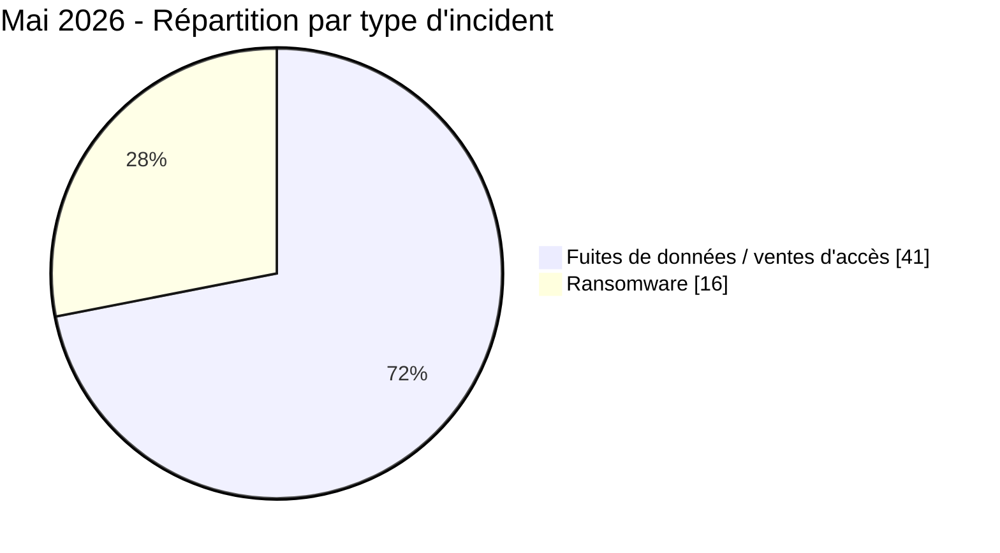
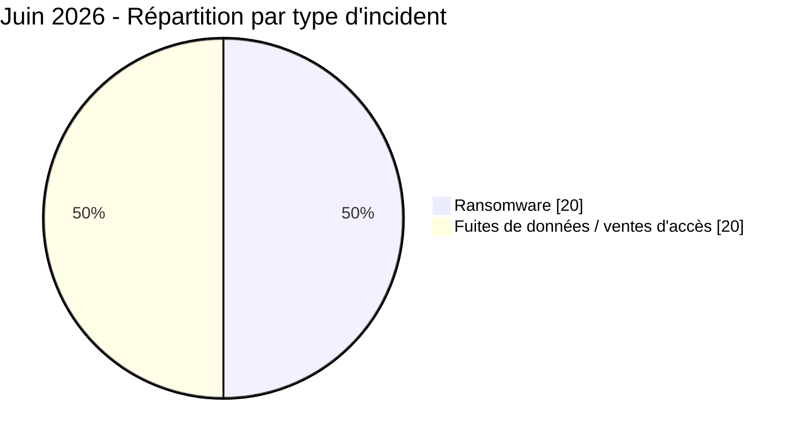
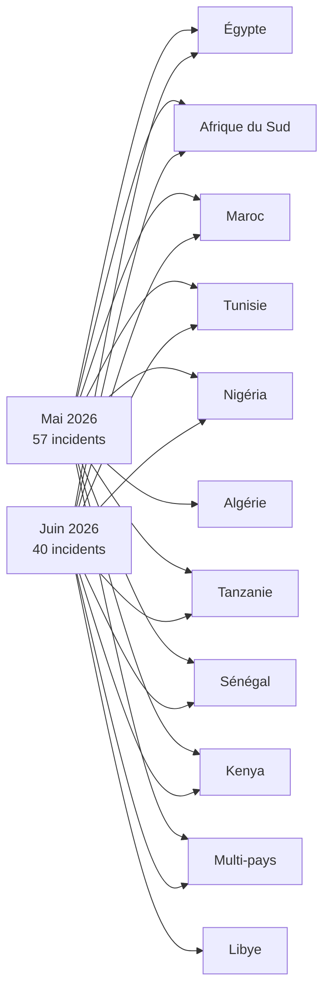

# AFRINTEL - Analyse comparative des cybermenaces en Afrique
## Mai vs Juin 2026

👉🏾 [English version available here](README.md)

TLP:CLEAR, distribution publique

> Les deux mois sont désormais finalisés. Mai 2026 couvre le 1er au 31 mai, juin 2026 couvre le 1er au 30 juin. Les incidents sont rattachés au mois de leur première identification et analyse par AFRINTEL ; les dates de revendication antérieures restent documentées dans les fiches victimes.

---

## Comparaison générale

| Indicateur | Mai 2026 | Juin 2026 | Évolution |
|---|---:|---:|---:|
| Total incidents | 57 | 40 | -17 (-29,8 %) |
| Pays touchés | 18 (12 directs + 6 multi-pays) | 20 (14 directs + 6 multi-pays) | +2 pays |
| Acteurs distincts | 25+ | 25 | Stable |
| Ransomware | 16 (28,1 %) | 20 (50,0 %) | +4 (+25,0 %), part quasi doublée |
| Fuites de données / ventes d'accès | 41 (71,9 %) | 20 (50,0 %) | -21 (-51,2 %) |
| Incidents liés au gouvernement | 17 (29,8 %) | 12 (30,0 %) | Part stable |
| Pays le plus touché | Égypte (16) | Maroc (9) | Bascule de l'Afrique du Nord-Est vers le Nord-Ouest |

> Le volume total baisse de près de 30 %, mais ce n'est pas le signe d'un risque en recul. La part du ransomware a quasiment doublé, et les incidents individuels les plus graves du mois (Jeroid.co, la fuite d'identifiants de l'armée nigériane, BRELA en Tanzanie) sont chacun comparables en gravité aux pires cas de mai.

---

## Comparaison des volumes

---

## Ransomware vs fuites de données

La part du ransomware est passée de 28,1 % à 50,0 % d'un mois à l'autre. Cette évolution est portée par la dispersion géographique (DeadLock a touché 4 pays, LockBit 5 a touché 3 pays en une seule semaine) plutôt que par une concentration sur un seul pays, contrairement à mai où l'Égypte représentait à elle seule près de la moitié de l'activité ransomware.

---

## Répartition géographique

---

## Classement des pays

| Pays | Mai 2026 | Juin 2026 | Tendance |
|---|---:|---:|:---:|
| Maroc | 7 | 9 | En hausse, désormais premier pays |
| Afrique du Sud | 14 | 6 | En baisse, toujours actif |
| Égypte | 16 | 4 | Forte baisse, n'est plus dominant |
| Nigéria | 3 | 4 | Légère hausse |
| Tunisie | 5 | 4 | Stable |
| Libye | 0 | 3 | Nouvelle entrée directe |
| Algérie | 2 | 0 | Absent en juin |
| Tanzanie | 2 | 1 | En baisse |
| Kenya | 1 | 1 | Stable |
| Sénégal | 1 | 1 | Stable |
| Ghana | 1 | 0 | Absent en juin |
| Côte d'Ivoire | 1 | 0 | Absent en juin |
| Éthiopie | 1 | 0 (exposition multi-pays uniquement) | Bascule vers une exposition indirecte |
| Gabon | 0 | 1 | Nouvelle entrée |
| Zimbabwe | 0 | 1 | Nouvelle entrée |
| Botswana | 0 | 1 | Nouvelle entrée |
| Maurice | 0 | 1 | Nouvelle entrée |
| Mayotte | 0 | 1 | Nouvelle entrée |
| Incidents multi-pays | 3 | 2 | Schéma stable, acteurs différents |

Le renversement marquant du mois : l'Égypte (premier pays de mai avec une large avance) chute à la quatrième place, tandis que le Maroc passe de la troisième à la première place, porté presque entièrement par un seul cluster d'acteur (voir évolution des acteurs ci-dessous).

---

## Évolution sectorielle

| Secteur | Mai 2026 | Juin 2026 | Tendance |
|---|:---:|:---:|:---:|
| Gouvernement / Administration / Défense | 17 (29,8 %) | 12 (30,0 %) | Stable, reste le premier secteur les deux mois |
| Finance / Banque / Assurance | 4 (7,0 %) | 6 (15,0 %) | En hausse, part plus que doublée |
| Éducation | 5 (8,8 %) | 4 (10,0 %) | Globalement stable |
| E-commerce / Retail | 3 (5,3 %) | 4 (10,0 %) | En hausse |
| Santé | 2 (3,5 %) | 3 (7,5 %) | En hausse |
| Recrutement / Données personnelles | 8 (14,0 %) | 0 | Absent en juin, catégorie portée par Databasehooligan disparue avec l'acteur |
| Automobile | 3 (5,3 %) | 2 (5,0 %) | Stable |
| Télécom / TIC | 3 (5,3 %) | 0 | Absent en juin |
| ONG / Associatif | 2 (3,5 %) | 0 | Absent en juin |

Le gouvernement reste la catégorie cible la plus constante sur les deux mois, avec une part quasiment identique, confirmant qu'il s'agit d'un schéma structurel, pas d'une anomalie mensuelle. La hausse de la finance est portée en grande partie par un seul incident, Jeroid.co, dont la gravité dépasse largement son poids en nombre.

---

## Évolution des acteurs de menace

| Acteur | Mai 2026 | Juin 2026 |
|---|:---:|:---:|
| Databasehooligan | Dominant (8) | Absent |
| anisanas2 | Actif (2) | **Dominant (7), plus que triplé** |
| 404Crew Cyber Team | Actif (5) | Actif (2) |
| TheGentlemen | Actif (4) | Actif (1) |
| NightSpire / Nightspire | Actif (3) | Actif (2) |
| DeadLock | Absent | **Nouveau, le plus dispersé géographiquement (4)** |
| LockBit 5 | Absent | **Nouveau (3)** |
| Krybit | Absent | **Nouveau (2)** |
| EvaN47 | Absent | **Nouveau (2), deux ministères libyens en deux jours** |
| burti | Absent | **Nouveau (Jeroid.co)** |
| Convince / Governor | Absent | **Nouveau, ventes d'identifiants/portails forces de l'ordre** |

```mermaid
flowchart TB

classDef high fill:#ff4d4d,color:#ffffff
classDef medium fill:#ffa64d,color:#000000
classDef new fill:#4da6ff,color:#ffffff

DBH["Databasehooligan\n(dominant mai, 8)"]:::high
ANI["anisanas2\n(mai : 2, juin : 7)"]:::high
CREW["404Crew Cyber Team\n(actif les deux mois)"]:::medium
GENT["TheGentlemen\n(mai : 4, juin : 1)"]:::medium
NIGHT["NightSpire/Nightspire\n(mai : 3, juin : 2)"]:::medium
DEAD["DeadLock\n(juin, nouveau, 4)"]:::new
LOCK["LockBit 5\n(juin, nouveau, 3)"]:::new
KRY["Krybit\n(juin, nouveau, 2)"]:::new
```

---

## Conclusions clés

### Ce qui a disparu ou reculé de mai à juin

- **Databasehooligan :** dominant en mai (8 victimes dans 4 pays), aucune activité visible en juin. Soit inactif, soit reconverti, soit passé à un canal de monétisation différent non encore documenté.
- **La domination de l'Égypte :** 16 incidents en mai, 4 en juin. La vague ransomware NightSpire/TheGentlemen/multi-acteurs contre la finance et l'agroalimentaire égyptiens ne s'est pas reproduite.
- **Le secteur Recrutement / Données personnelles :** 8 incidents en mai (catégorie cible principale de Databasehooligan), zéro en juin, disparu avec l'acteur.
- **Algérie, Ghana, Côte d'Ivoire :** chacun comptait 1 à 2 incidents en mai, aucun en juin.

### Ce qui est apparu ou s'est intensifié en juin

- **La campagne marocaine d'anisanas2 a plus que triplé :** 2 incidents en mai, 7 en juin, désormais répartis entre éducation, logistique, mines, e-commerce, startups et automobile. C'est le changement le plus important au niveau acteur entre les deux mois.
- **La part du ransomware a quasiment doublé** (28,1 % à 50,0 %), portée par DeadLock et LockBit 5 dispersés sur plusieurs pays plutôt que par une concentration sur un seul pays.
- **La Libye entre pour la première fois en 2026 comme cible directe** avec 3 incidents, dont deux ministères gouvernementaux touchés par le même acteur deux jours consécutifs.
- **L'abus des identifiants/portails forces de l'ordre s'est consolidé en modèle reproductible :** les listings de Convince et Governor en juin prolongent directement le schéma d'abus déjà observé avec des fuites d'identifiants isolées plus tôt dans l'année, désormais packagé et vendu comme un service sur 15 juridictions.
- **Le risque fintech s'est matérialisé concrètement :** l'exposition signalée chez Jeroid.co (Nigéria) est l'exposition de données individuelle la plus grave des deux mois, combinant données biométriques, KYC et financières via une exposition signalée du stockage cloud dont le vecteur d'accès initial reste inconnu.

### Continuités

- Gouvernement / Administration / Défense reste le premier secteur les deux mois, avec une part quasiment identique (29,8 % puis 30,0 %).
- 404Crew Cyber Team est resté actif les deux mois (coalition OpSouthAfrica en mai, NILDS et MG Maroc en juin), confirmant un acteur persistant plutôt qu'une campagne ponctuelle.
- Le Maroc avait déjà été signalé comme cible récurrente en mai (RADEM Meknès, lot Ministère de la Justice) ; juin confirme qu'il s'agissait du début d'une campagne soutenue, pas d'une vague isolée.

---

## Évaluation stratégique

Les chiffres mois par mois sous-estiment ce qui a réellement changé. Le volume total baisse d'environ 30 %, ce qui pourrait à première vue se lire comme un mois de refroidissement. Ce n'est pas le cas. La part du ransomware a quasiment doublé, un seul cluster d'acteur centré sur le Maroc a plus que triplé sa production, et deux incidents individuels de juin (Jeroid.co, la fuite d'identifiants de l'armée nigériane) figurent parmi les plus graves qu'AFRINTEL ait enregistrés en 2026, tous mois confondus.

Le signal structurel le plus clair est la campagne marocaine d'anisanas2. Elle n'est pas apparue soudainement en juin, elle était déjà présente en mai, et son escalation de 2 à 7 incidents en un mois, désormais sur trois mois consécutifs d'activité, indique une opération disposant d'un flux fiable de cibles plutôt qu'une criminalité opportuniste et ponctuelle. C'est le schéma le plus susceptible d'être encore actif au moment du rapport de juillet.

La consolidation du marché des identifiants/portails forces de l'ordre (Convince, Governor) est le second signal structurel à surveiller. Il n'existait pas comme schéma documenté en mai et est apparu pleinement formé en juin sur au moins 15 juridictions, ce qui suggère que l'approvisionnement sous-jacent en comptes gouvernementaux compromis précède sa commercialisation de juin.

### Perspectives de risque à 30-60-90 jours (depuis le 24 juillet 2026)

- **30 jours (vers fin août) :** poursuite probable de l'activité d'anisanas2 contre le Maroc sauf effort coordonné de notification ou de retrait ; attendre de nouveaux listings ransomware de DeadLock, LockBit 5 et Krybit compte tenu de leur cadence de juin.
- **60 jours :** surveiller une éventuelle extension de la campagne ministérielle libyenne à d'autres organismes gouvernementaux ; surveiller le retour de Databasehooligan ou d'un successeur occupant la même niche recrutement/données personnelles laissée vacante en juin.
- **90 jours :** le marché des identifiants/portails forces de l'ordre (Convince, Governor) devrait s'étendre à d'autres juridictions ou attirer des vendeurs imitateurs, sauf si Meta, Google, TikTok et X comblent la faille de vérification sous-jacente.

---

*AFRINTEL, Cyber Threat Intelligence africaine. TLP:CLEAR*
