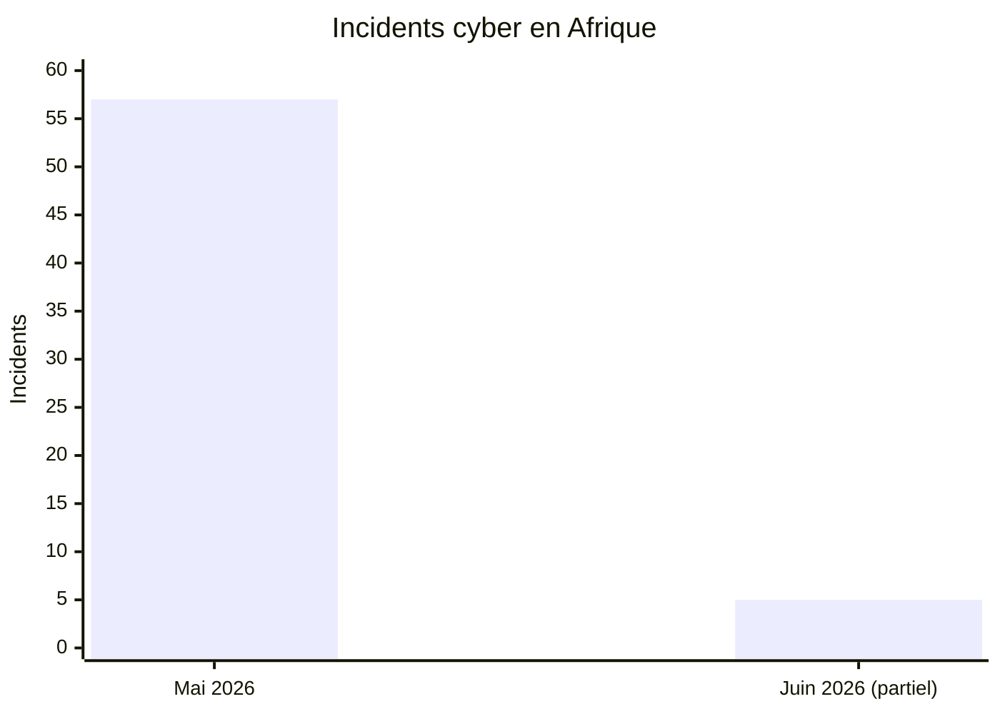
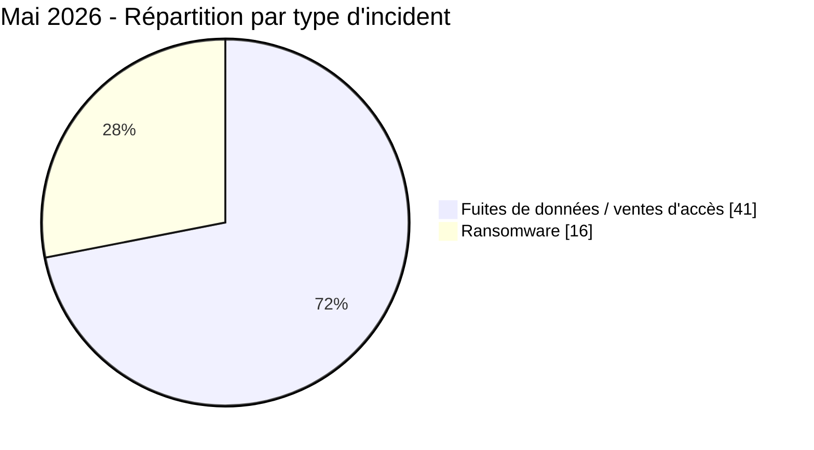
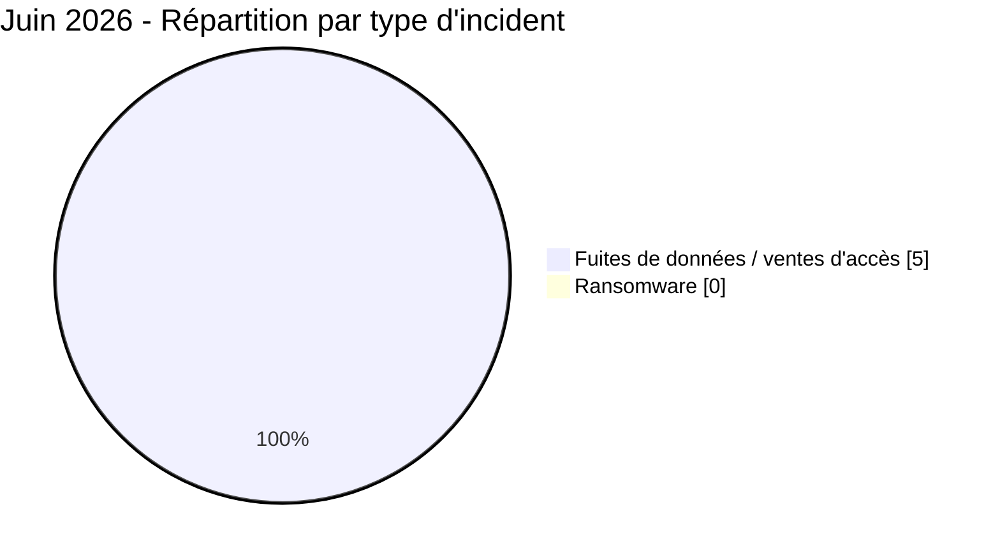
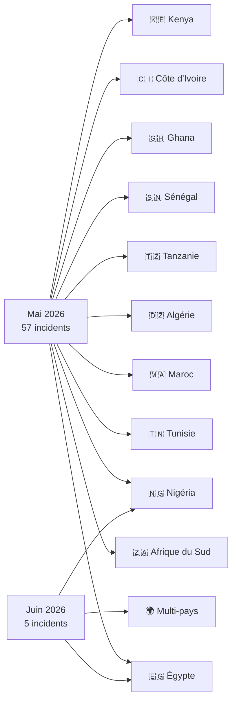
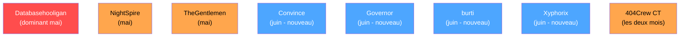

# AFRINTEL - Analyse comparative des cybermenaces en Afrique
## Mai vs Juin 2026

👉🏾 [English version available here](README.md)

TLP:CLEAR - Distribution publique

> Note : les données de juin 2026 couvrent la période du 1er au 21 juin 2026 (mois en cours au moment de la publication).

---

## Comparaison générale

| Indicateur | Mai 2026 | Juin 2026 | Évolution |
|---|---:|---:|---:|
| Total incidents | 57 | 5 | -52 (significatif) |
| Pays directement touchés | 11 + multi | 2 + multi | Forte baisse |
| Acteurs distincts | 25+ | 5 | Baisse |
| Ransomware | 16 | 0 | -16 (-100 %) |
| Fuites de données / ventes d'accès | 41 | 5 | -36 (-88 %) |
| Incidents gouvernementaux | Élevés | Élevés | Stable |
| Exposition forces de l'ordre | Modérée | Critique | ↑↑ |
| Secteur fintech | Faible | Critique | ↑↑ nouveau |

> La baisse du nombre d'incidents reflète à la fois une réduction réelle et le fait que les données de juin sont partielles (1-21 juin uniquement). La rupture qualitative entre ransomware et monétisation d'accès est structurellement significative.

---

## Comparaison des volumes

---

## Ransomware vs fuites de données

---

## Répartition géographique

---

## Classement des pays

| Pays | Mai 2026 | Juin 2026 | Tendance |
|---|---:|---:|:---:|
| 🇪🇬 Égypte | 16 | 1 | ↓ |
| 🇿🇦 Afrique du Sud | 14 | 0 | ↓ absent |
| 🇲🇦 Maroc | 7 | 0 | ↓ absent |
| 🇹🇳 Tunisie | 5 | 0 | ↓ absent |
| 🇳🇬 Nigéria | 3 | 2 | ↓ mais présent |
| 🇩🇿 Algérie | 2 | 0 | ↓ absent |
| 🇹🇿 Tanzanie | 2 | 0 | ↓ absent |
| 🌍 Multi-pays | 3 | 2 | → stable |

---

## Évolution sectorielle

| Secteur | Mai 2026 | Juin 2026 | Tendance |
|---|:---:|:---:|:---:|
| Gouvernement / Administration | 17 (29,8 %) | 3 (60 %) | Domine juin |
| Fintech / Cryptomonnaie | 0 | 1 (20 %) | **Nouveau** |
| Aviation / Militaire | 0 | 1 (20 %) | **Nouveau** |
| Éducation / Universités | 5 (9,3 %) | 0 | ↓ absent |
| Recrutement / Données personnelles | 8 (14,8 %) | 0 | ↓ absent |
| Finance / Banque | 4 (7,4 %) | 0 | ↓ absent |
| Santé | 2 (3,7 %) | 0 | ↓ absent |

---

## Évolution des acteurs de menace

| Acteur | Mai 2026 | Juin 2026 |
|---|:---:|:---:|
| Databasehooligan | **Dominant (8)** | Absent |
| TheGentlemen | Actif (4) | Absent |
| NightSpire | Actif (3) | Absent |
| 404Crew CT | Actif (4+) | Actif (NILDS) |
| Convince | Absent | **Nouveau (fraude EDR)** |
| Governor | Absent | **Nouveau (accès LEP)** |
| burti | Absent | **Nouveau (Jeroid.co)** |
| Xyphorix | Absent | **Nouveau (pilotes Égypte)** |

---

## Conclusions clés

### Ce qui a disparu de mai à juin

- **Ransomware :** 16 incidents en mai, 0 en juin. C'est le changement le plus frappant. Aucun groupe ransomware n'a publié de victimes africaines dans la période documentée de juin.
- **Afrique du Sud :** 14 incidents en mai, 0 en juin. La campagne OpSouthAfrica s'est terminée sans relève.
- **Maroc :** 7 incidents en mai, 0 en juin.
- **Tunisie :** 5 incidents en mai, 0 en juin.
- **Secteur éducatif :** 5 incidents en mai (attaque systémique Égypte), 0 en juin.
- **Databasehooligan :** 8 victimes en mai, aucune activité visible en juin.

### Ce qui est apparu en juin

- **Marché d'usurpation des forces de l'ordre :** deux acteurs indépendants (Convince et Governor) vendent des identifiants EDR et des comptes portails LEP authentifiés ciblant au moins 11 pays africains. Cette menace structurelle est absente des activités documentées de mai.
- **Fintech comme cible à haute valeur :** la fuite Jeroid.co (Nigéria) est la première grande fuite fintech de 2026 combinant BVN, NIN et données biométriques à grande échelle.
- **Secteur militaire / aviation :** base de données des pilotes égyptiens, catégorie sectorielle nouvelle absente de mai.
- **Nigéria dominant en juin :** 2 des 5 incidents directement attribués, contre 3 sur 57 en mai.

### Continuités

- Le secteur gouvernemental reste la catégorie cible principale (60 % des incidents de juin contre 25,9 % en mai, confirmant une focalisation persistante).
- 404Crew Cyber Team maintient une présence les deux mois (OpSouthAfrica en mai, NILDS en juin).
- L'exposition des identifiants forces de l'ordre est passée d'un thème secondaire en mai (messagerie police tanzanienne) à la menace structurante de juin.

---

## Évaluation stratégique

Le passage de mai à juin révèle un **changement structurel de comportement des acteurs de menace**. La disparition complète du ransomware et la forte baisse de volume s'expliquent en partie par le caractère partiel des données de juin, mais la rupture qualitative est réelle : les acteurs ont pivoté du chiffrement et des ventes de bases de données massives vers la monétisation ciblée d'accès, notamment l'usurpation des forces de l'ordre.

La fuite Jeroid.co est structurellement différente des activités de data broker de mai : elle combine données financières, biométriques et identitaires dans une seule fuite, représentant un risque systémique pour l'ensemble de l'écosystème bancaire et d'identité numérique du Nigéria.

La consolidation d'un marché de vente d'accès EDR/LEP en juin signale que des acteurs criminels ciblent désormais l'infrastructure d'authentification des forces de l'ordre africaines comme produit monétisable à part entière.

### Perspectives de risque à 30-60-90 jours (depuis le 21 juin 2026)

- **30 jours :** le secteur fintech nigérian est sous risque élevé après la fuite Jeroid.co. Des tentatives de fraude liées aux BVN sont à anticiper. L'abus des accès EDR/LEP générera vraisemblablement des cas de fraude en aval dans plusieurs pays africains.
- **60 jours :** les groupes ransomware absents en juin (NightSpire, TheGentlemen, Databasehooligan) pourraient réapparaître avec de nouvelles campagnes africaines. L'Afrique du Sud et l'Égypte redeviendront probablement des cibles prioritaires.
- **90 jours :** le marché des accès EDR/LEP peut s'étendre à d'autres pays africains non encore documentés. Anticiper un ciblage accru des identifiants fintech et gouvernementaux en Afrique de l'Ouest et du Nord.

---

*AFRINTEL - Initiative ouverte de veille CTI sur l'Afrique | TLP:CLEAR*
