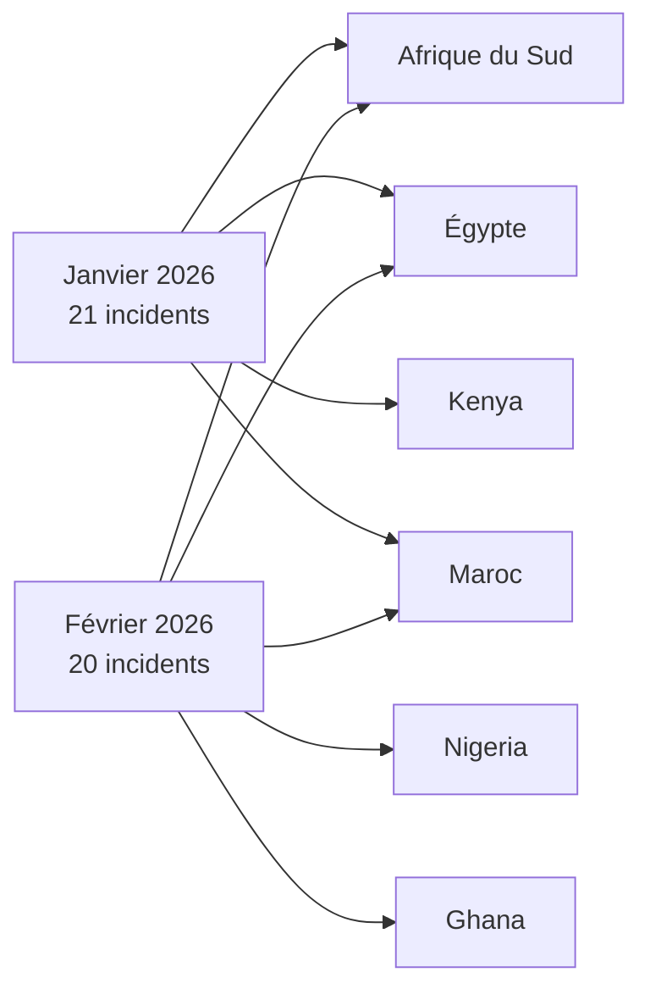
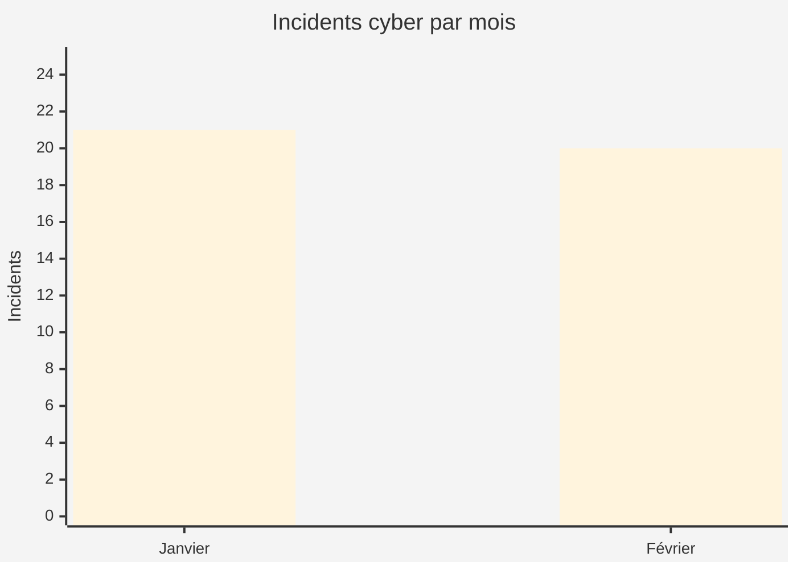
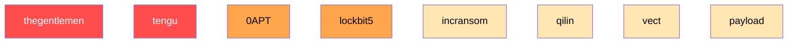
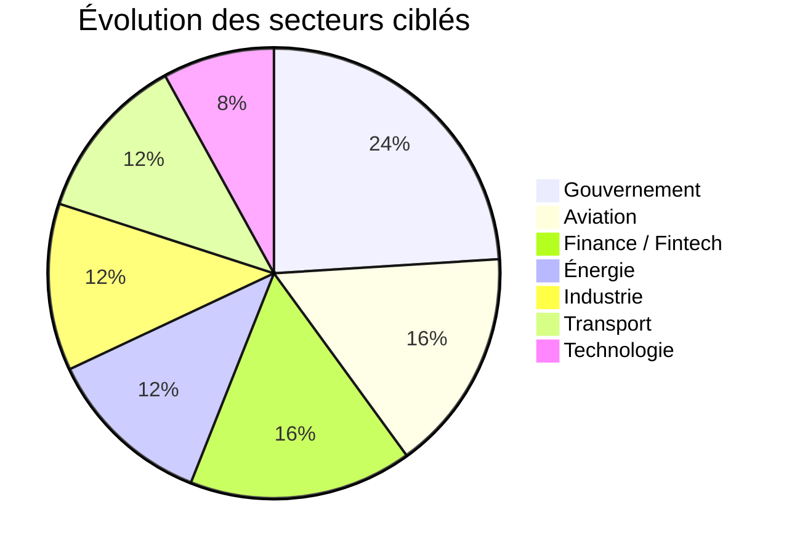

# AFRINTEL - Analyse comparative des cybermenaces
👉🏾 [English version avilable here](README.md)

## Janvier vs Février 2026 (Afrique)

Ce rapport présente une **analyse comparative de Cyber Threat Intelligence (CTI)** des incidents cyber ayant affecté l’Afrique durant **janvier et février 2026**.

L’objectif est d’identifier :

- l’évolution des acteurs de la menace
- les concentrations géographiques
- les secteurs exposés
- les tendances opérationnelles observées sur le continent

---

# 📊 Comparaison générale

| Indicateur | Janvier 2026 | Février 2026 |
|---|---|---|
| Incidents | **21** | **20** |
| Pays touchés | 12 | 13 |
| Acteurs malveillants | 11 | 10 |
| Ransomware | 18 | dominant |
| Fuites de données | 2 | multiples |
| Défaçage | 1 | rare |
| Volume de données exposées | limité | **~147 TB** |

---

# 🌍 Comparaison de la répartition géographique

---

# 📈 Volume d’incidents par mois

---

# 🎯 Activité des acteurs de la menace

### Observations clés

• **thegentlemen reste l’acteur le plus actif sur les deux mois**  
• **tengu domine l’activité observée en janvier**  
• **0APT apparaît en février avec des opérations multi‑pays**

---

# 🏭 Comparaison des secteurs ciblés

### Interprétation

Les attaques de janvier étaient **plus distribuées entre les secteurs**, tandis que février montre une **concentration plus marquée sur des industries stratégiques** telles que :

• aviation  
• infrastructures gouvernementales  
• secteur énergétique  

---

# 🔥 Incidents majeurs

### Janvier 2026

• **Défaçage de sites gouvernementaux – Niger**  
- attaque multi‑sites  
- acteur non attribué  

• **Fuite de données PixPay – Sénégal**  
- exposition de données du secteur financier  

---

### Février 2026

• **Violation de données DAF Sénégal**  
- **139 TB de données exposées**  
- plus grande fuite de données observée dans ce jeu de données  

• **EnerTec Afrique du Sud**  
- fuite de **151 GB de données industrielles**  

---

# 🧠 Enseignements stratégiques CTI

### 1️⃣ Industrialisation du ransomware

Plusieurs groupes démontrent des caractéristiques de **Ransomware‑as‑a‑Service (RaaS)** :

- thegentlemen
- lockbit5
- incransom
- vect

---

### 2️⃣ Expansion de la surface d’attaque

Facteurs principaux :

• digitalisation des services publics africains  
• adoption croissante de la fintech  
• connectivité accrue du secteur aérien  

---

### 3️⃣ Points chauds géographiques

Principaux clusters de menace :

| Rang | Région |
|---|---|
| 1 | Afrique du Sud |
| 2 | Égypte |
| 3 | Kenya |
| 4 | Nigeria |
| 5 | Maroc |

---

# 🔮 Perspectives de menace

Selon les tendances observées, les secteurs suivants devraient rester **hautement ciblés** dans les prochains mois :

• institutions gouvernementales  
• infrastructures aériennes  
• plateformes financières  
• fournisseurs d’énergie  

Pays susceptibles de rester **des cibles prioritaires** :

Afrique du Sud • Égypte • Kenya • Nigeria • Maroc

---

# 🛡 Recommandations stratégiques

Les équipes SOC et CTI devraient prioriser :

### Surveillance des menaces

Surveiller les groupes ransomware :

- thegentlemen
- lockbit5
- incransom
- vect
- qilin

### Capacités de détection

Déployer une surveillance pour :

• exfiltration de données anormale  
• trafic sortant suspect  
• abus d’identifiants  

### Protection des infrastructures

Renforcer la sécurité des :

• portails gouvernementaux publics  
• réseaux aéronautiques  
• plateformes financières  

---

# AFRINTEL

**African Threat Intelligence Initiative**  
TLP:CLEAR – diffusion publique

---

## ✍🏿 Auteur

Adama ASSIONGBON  
[Consultant SOC & Cyber Threat Intelligence]  
(https://www.linkedin.com/in/adama-assiongbon-9029893a/)
