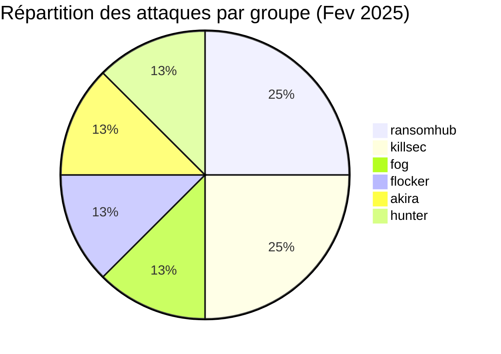
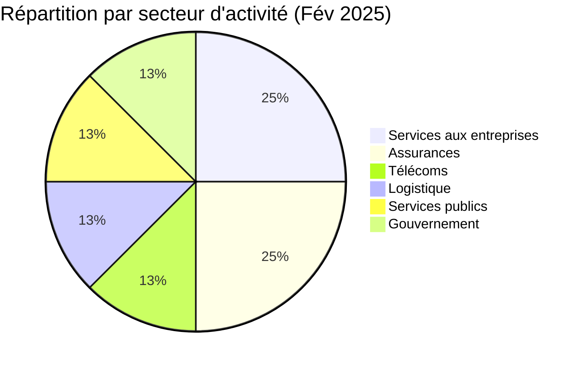
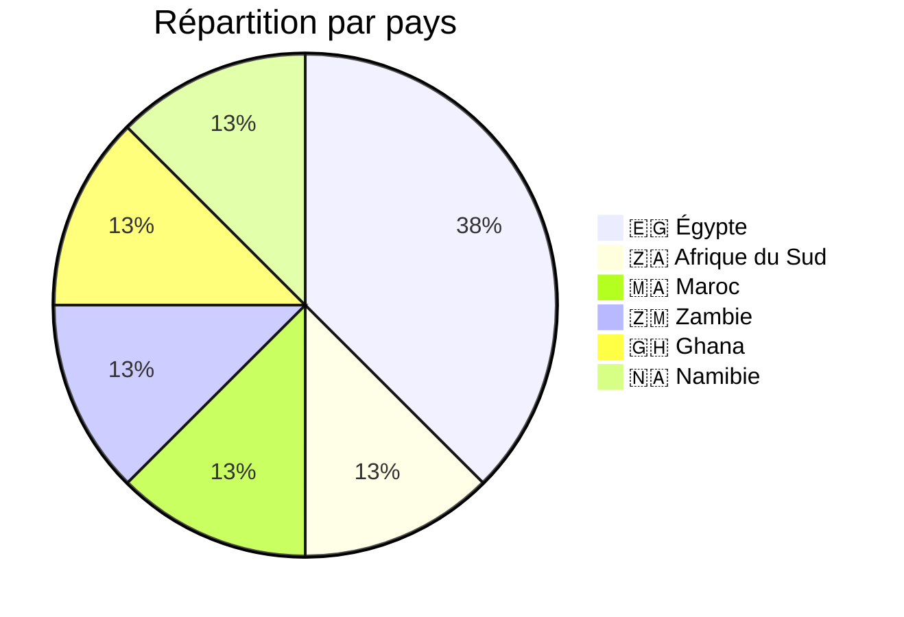
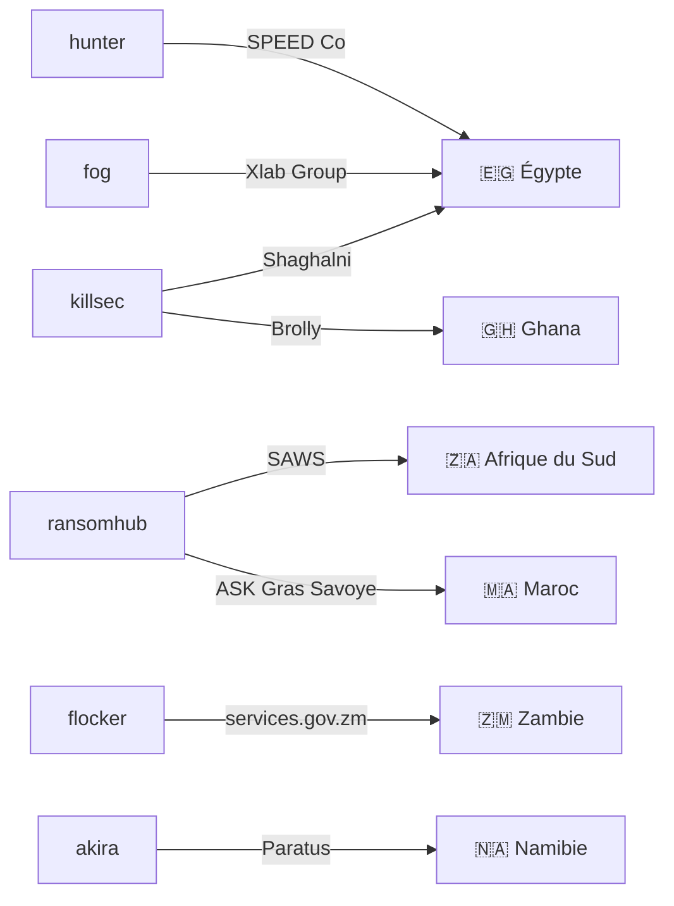
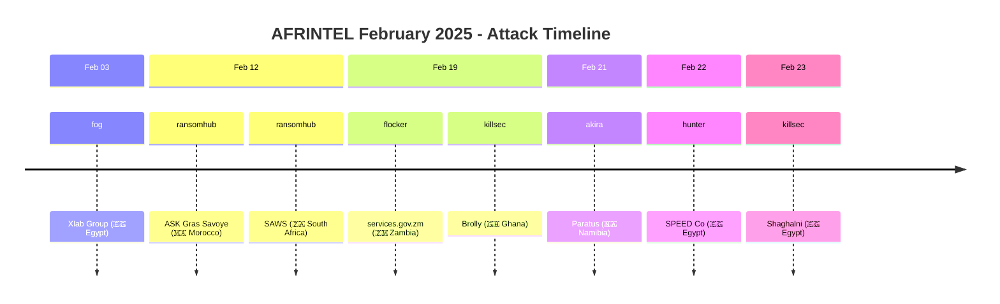

# Rapport CTI : Cyberattaques en Afrique - Février 2025
👉🏾 [**English version available here**](README.md)
## 1. Introduction
Ce rapport de Cyber Threat Intelligence (CTI) présente une analyse détaillée des cyberattaques survenues en Afrique durant le mois de février 2025. Les informations sont issues de sources OSINT et de sites de fuites de groupes ransomware, compilées dans le cadre du projet AFRINTEL. L'objectif est de fournir une vision claire des tendances, des acteurs menaçants, des secteurs ciblés et des indicateurs de compromission associés.

## 2. Résumé exécutif
- **Nombre total d'attaques recensées** : 8
- **Groupes ransomware les plus actifs** : ransomhub (2 attaques), killsec (2), fog (1), flocker (1), akira (1), hunter (1).
- **Secteurs les plus ciblés** : Services aux entreprises (2), Assurances (2), Télécommunications (1), Logistique (1), Services publics (1), Gouvernement (1).
- **Pays les plus touchés** : Égypte (3), Afrique du Sud (1), Maroc (1), Zambie (1), Ghana (1), Namibie (1).
- **Volume de données exfiltrées** : 444,8 Go pour SPEED Co (Égypte), 1,2 Go pour le portail gouvernemental zambien. Les autres volumes ne sont pas précisés.

## 3. Statistiques clés

### 3.1 Répartition par groupe ransomware
| Groupe ransomware | Nombre d'attaques |
|-------------------|-------------------|
| ransomhub         | 2                 |
| killsec           | 2                 |
| fog               | 1                 |
| flocker           | 1                 |
| akira             | 1                 |
| hunter            | 1                 |
| **Total**         | **08**             |

### 3.2 Répartition par secteur d'activité
| Secteur | Nombre d'attaques |
|---------|-------------------|
| Services aux entreprises | 2 |
| Assurances / Insurtech | 2 |
| Télécommunications | 1 |
| Logistique | 1 |
| Services publics (Météo) | 1 |
| Gouvernement (portail) | 1 |
| **Total** | **08** |

### 3.3 Répartition par pays
| Pays | Nombre d'attaques |
|------|-------------------|
| Égypte | 3 |
| Afrique du Sud | 1 |
| Maroc | 1 |
| Zambie | 1 |
| Ghana | 1 |
| Namibie | 1 |
| **Total** | **08** |

## 4. Détail des attaques par groupe ransomware

### 4.1 ransomhub (2 attaques)
- **12/02/2025** : ASK Gras Savoye (Maroc, assurances)
- **12/02/2025** : South African Weather Service (Afrique du Sud, services publics)

*Remarque* : ransomhub a ciblé deux entités du secteur des services, au Maroc et en Afrique du Sud, le même jour.

### 4.2 killsec (2 attaques)
- **19/02/2025** : Brolly (Ghana, insurtech)
- **23/02/2025** : Shaghalni (Égypte, recrutement)

*Remarque* : killsec a frappé une startup technologique et une plateforme de recrutement, montrant un intérêt pour les secteurs innovants.
### 4.3 fog (1 attaque)
- **03/02/2025** : Xlab Group (Égypte, services IT)

### 4.4 flocker (1 attaque)
- **19/02/2025** : Government Services Portal (Zambie, gouvernement) - 1,2 Go exfiltrés

### 4.5 akira (1 attaque)
- **21/02/2025** : Paratus (Namibie, télécommunications) - opérateur panafricain

### 4.6 hunter (1 attaque)
- **22/02/2025** : SPEED Co (Égypte, logistique) - 444,8 Go exfiltrés (285 891 fichiers)

## 5. Analyse sectorielle
- **Services aux entreprises** : 2 attaques (Xlab Group, Shaghalni). Les groupes fog et killsec sont impliqués, ciblant des prestataires de services numériques et RH.
- **Assurances / Insurtech** : 2 attaques (ASK Gras Savoye, Brolly). ransomhub et killsec montrent un intérêt pour le secteur financier et les startups.
- **Télécommunications** : 1 attaque (Paratus) par akira, visant un opérateur majeur en Namibie.
- **Logistique** : 1 attaque majeure (SPEED Co) par hunter, avec un volume de données très important (444,8 Go).
- **Services publics** : 1 attaque (SAWS) par ransomhub, touchant le service météo national sud-africain.
- **Gouvernement** : 1 attaque (portail zambien) par flocker, exposant des données sensibles des citoyens.

## 6. Analyse géographique
- **Égypte** : 3 attaques (Xlab Group, SPEED Co, Shaghalni) – secteurs variés (IT, logistique, recrutement). L'Égypte confirme sa position de pays le plus ciblé du mois.
- **Afrique du Sud** : 1 attaque (SAWS) – service météo national, données potentiellement utilisées pour des opérations stratégiques.
- **Maroc** : 1 attaque (ASK Gras Savoye) – secteur des assurances, données clients sensibles.
- **Zambie** : 1 attaque (portail gouvernemental) – 1,2 Go de données citoyennes exfiltrées.
- **Ghana** : 1 attaque (Brolly) – insurtech, données personnelles et financières.
- **Namibie** : 1 attaque (Paratus) – télécommunications, infrastructure critique.

L'Égypte est le pays le plus touché, avec des attaques sur des infrastructures critiques (logistique) et des services numériques.

### 6.1. Graphe acteur → victime → pays

### 6.2. Timeline des attaques

## 7. TTPs observées
D'après les descriptions disponibles, on note :
- **Exfiltration massive** : SPEED Co (444,8 Go) et portail zambien (1,2 Go) montrent une volonté de collecter un maximum de données avant chiffrement.
- **Ciblage d'infrastructures critiques** : logistique (SPEED Co), télécoms (Paratus), services publics (SAWS).
- **Secteurs émergents** : insurtech (Brolly) et plateformes de recrutement (Shaghalni) sont également visées, indiquant une adaptation des attaquants aux nouvelles niches.
- **Utilisation de sites de fuite** : les groupes publient des échantillons pour prouver leurs compromissions et faire pression sur les victimes.
- **Double extorsion** : probable dans tous les cas, avec divulgation de données sensibles.

## 8. Recommandations
- **Égypte** : renforcer la cybersécurité dans les secteurs de la logistique et des services numériques, très ciblés. Mettre en place une surveillance proactive des menaces.
- **Secteur des assurances** : sensibiliser les courtiers et insurtechs aux risques de ransomware, et mettre en œuvre des sauvegardes isolées.
- **Télécoms** : les opérateurs panafricains comme Paratus doivent protéger leurs infrastructures critiques et segmenter leurs réseaux.
- **Gouvernements** : les portails de services publics (Zambie) doivent être sécurisés en priorité, avec authentification multi-facteurs et audits réguliers.
- **Tous secteurs** : former les employés à la détection des phishing, vecteur d'accès initial probable.

## 9. Conclusion
Février 2025 a vu une activité concentrée sur l'Égypte, avec des attaques de grande ampleur (SPEED Co) et une diversification sectorielle. Les groupes ransomhub et killsec se distinguent par leur polyvalence, frappant aussi bien des assurances traditionnelles que des startups innovantes. La diversité des cibles (assurances, télécoms, logistique, gouvernement) montre que les attaquants s'adaptent aux spécificités locales et aux secteurs porteurs. Une vigilance accrue est nécessaire, en particulier pour les infrastructures critiques et les services numériques émergents.

## ✍🏿 Auteur
*Adama ASSIONGBON*  
*Consultant SOC & Cyber Threat Intelligence*  
[LinkedIn Profile](https://www.linkedin.com/in/adama-assiongbon-9029893a/)

---
*AFRINTEL - Initiative ouverte de veille CTI sur l’Afrique*
