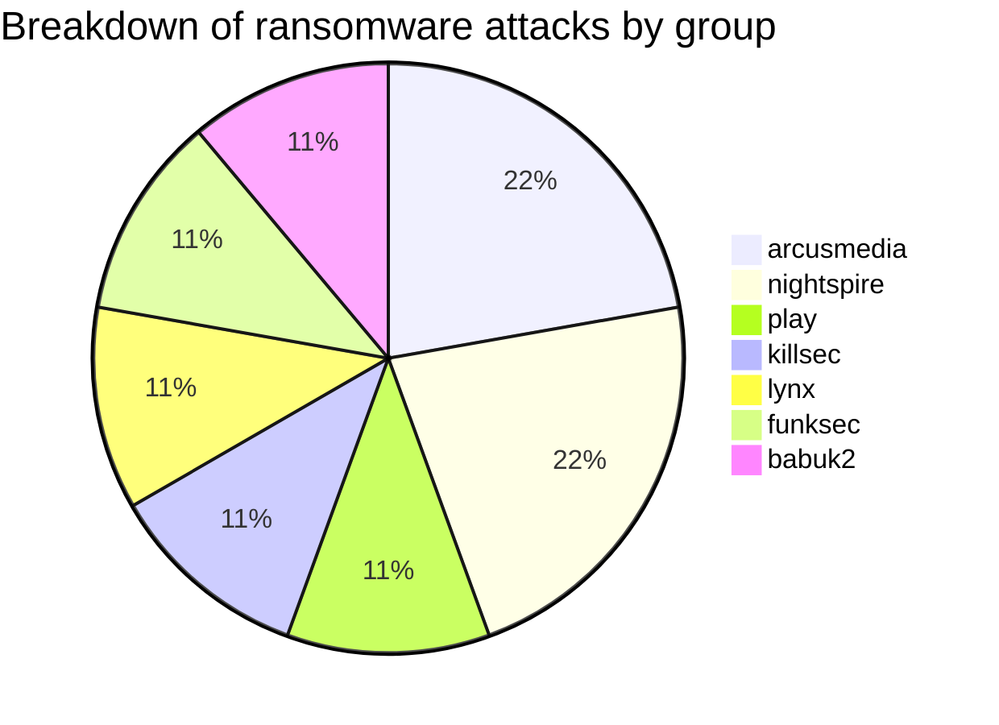
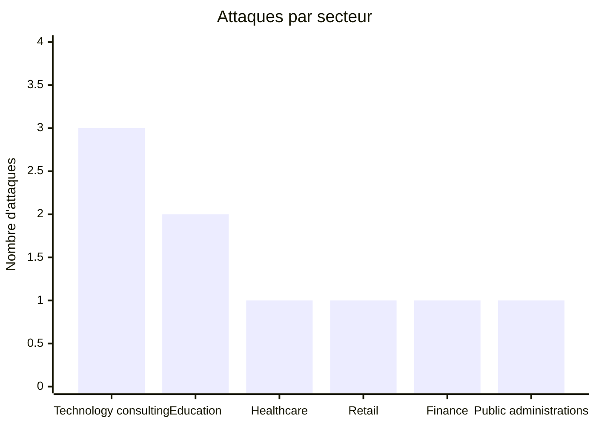
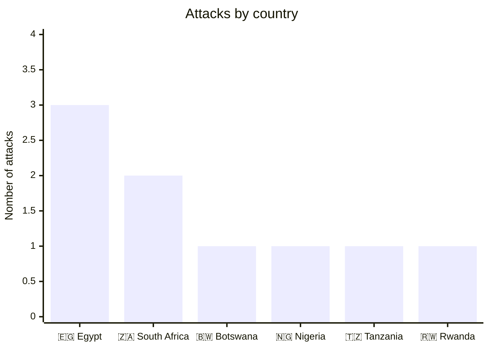
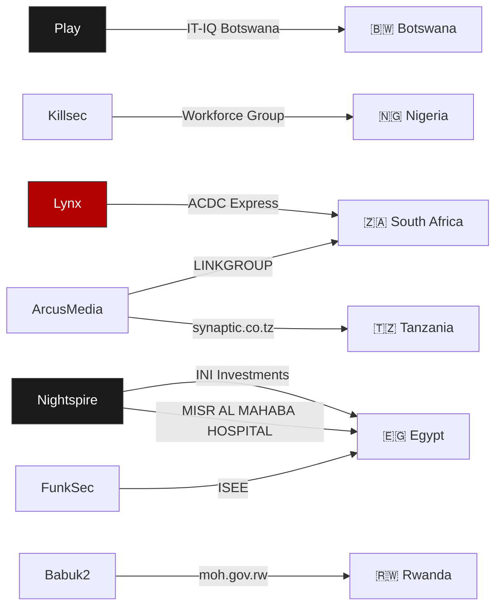
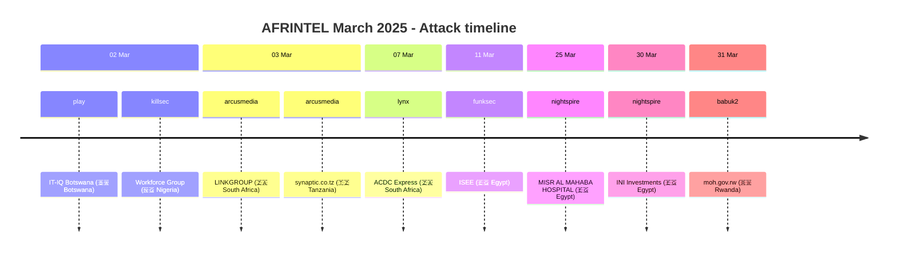

# CTI Report: Cyber attacks in Africa - March 2025
👉🏾 [**French version available here** ](./README_FR.md)
## 1. Introduction
This Cyber Threat Intelligence (CTI) report provides a detailed analysis of cyber attacks that occurred in Africa during March 2025. The information is derived from OSINT sources and ransomware group leak sites, compiled as part of the AFRINTEL project. The objective is to provide a clear overview of trends, threat actors, targeted sectors, and associated indicators of compromise.

## 2. Executive summary
- **Total number of recorded attacks:** 09
- **Most active ransomware groups:** arcusmedia (2 attacks), nightspire (2), play (1), killsec (1), lynx (1), funksec (1), babuk2 (1).
- **Most targeted sectors:** Technology Consulting (3), Education (2), Healthcare (1), Retail (1), Finance (1), Public Administrations (1).
- **Most affected countries:** Egypt (3), South Africa (2), Botswana (1), Nigeria (1), Tanzania (1), Rwanda (1).
- **Exfiltrated data volume:** 400 GB for INI Investments (Egypt). Other volumes are not specified.

## 3. Key statistics

### 3.1 Breakdown by ransomware group
| Ransomware Group | Number of Attacks |
|-------------------|-------------------|
| arcusmedia        | 2                 |
| nightspire        | 2                 |
| play              | 1                 |
| killsec           | 1                 |
| lynx              | 1                 |
| funksec           | 1                 |
| babuk2            | 1                 |
| **Total**         | **09**            |

### 3.2 Breakdown by sector
| Sector | Number of Attacks |
|---------|-------------------|
| Technology consulting | 3 |
| Education | 2 |
| Healthcare | 1 |
| Retail | 1 |
| Finance | 1 |
| Public administrations | 1 |
| **Total** | **09** |

### 3.3 Breakdown by country
| Country | Number of attacks |
|------|-------------------|
| 🇪🇬 Egypt | 3 |
| 🇿🇦 South Africa | 2 |
| 🇧🇼 Botswana | 1 |
| 🇳🇬 Nigeria | 1 |
| 🇹🇿 Tanzania | 1 |
| 🇷🇼 Rwanda | 1 |
| **Total** | **09** |

## 4. Detailed attacks by ransomware group

### 4.1 Arcusmedia (2 attacks)
- **03/03/2025:** LINKGROUP (South Africa, technology consulting)
- **03/03/2025:** synaptic.co.tz (Tanzania, technology consulting)

*Note:* arcusmedia targeted two IT consulting companies on the same day, in South Africa and Tanzania.

### 4.2 nightspire (2 attacks)
- **25/03/2025:** MISR AL MAHABA HOSPITAL (Egypt, healthcare)
- **30/03/2025:** INI Investments (Egypt, finance) – 400 GB exfiltrated

*Note:* nightspire struck two Egyptian entities, a private hospital and a financial holding, with a significant data volume.

### 4.3 play (1 attack)
- **02/03/2025:** IT-IQ Botswana (Botswana, technology consulting)

### 4.4 killsec (1 attack)
- **02/03/2025:** Workforce Group (Nigeria, education/HR)

### 4.5 lynx (1 attack)
- **07/03/2025:** ACDC Express (South Africa, retail)

### 4.6 funksec (1 attack)
- **11/03/2025:** ISEE (Egypt, education)

### 4.7 babuk2 (1 attack)
- **31/03/2025:** moh.gov.rw (Rwanda, public administration – health)

## 5. Sectoral Analysis
- **Technology Consulting:** 3 attacks (IT-IQ Botswana, LINKGROUP, synaptic.co.tz). Groups play and arcusmedia are the main actors, targeting IT service providers in three different countries.
- **Education:** 2 attacks (Workforce Group, ISEE). killsec and funksec targeted an educational services company and a private school.
- **Healthcare:** 1 attack (MISR AL MAHABA HOSPITAL) by nightspire, affecting a private hospital in Cairo.
- **Retail:** 1 attack (ACDC Express) by lynx, targeting a major distributor in South Africa.
- **Finance:** 1 attack (INI Investments) by nightspire, with massive exfiltration of 400 GB.
- **Public Administrations:** 1 attack (Rwandan Ministry of Health) by babuk2.

## 6. Geographic analysis
- **Egypt:** 3 attacks (ISEE, MISR AL MAHABA HOSPITAL, INI Investments) - education, healthcare, and finance. Egypt remains the most targeted country of the month.
- **South Africa:** 2 attacks (LINKGROUP, ACDC Express) - technology and retail.
- **Botswana:** 1 attack (IT-IQ Botswana) - technology.
- **Nigeria:** 1 attack (Workforce Group) - education/HR.
- **Tanzania:** 1 attack (synaptic.co.tz) - technology.
- **Rwanda:** 1 attack (Ministry of Health) - public administration.

### 6.1. Threat actor → victim → country graph

North Africa (Egypt) and Southern Africa (South Africa, Botswana) concentrate the majority of attacks, with a presence in East Africa (Tanzania, Rwanda) and West Africa (Nigeria).

### 6.2. Cyberattack timeline

## 7. Observed TTPs
Based on the available descriptions, we note:
- **Massive exfiltration:** INI Investments (400 GB) demonstrates the capacity to collect large volumes of sensitive data.
- **Targeting of strategic sectors:** finance, healthcare, public administrations.
- **Geographic diversity:** attacks cover six countries, showing an expansion of ransomware groups across the continent.
- **Double extortion likely:** claims accompanied by threats of disclosure.
- **Targeting of IT providers:** 3 attacks on technology consulting companies, potentially used as a springboard to their clients.

## 8. Recommendations
- **Egypt:** strengthen cybersecurity in the finance and healthcare sectors, particularly targeted by nightspire.
- **IT consulting companies:** implement strict network segmentation and enhanced monitoring, as they are prime targets.
- **Education sector:** raise awareness among private and public institutions about ransomware risks.
- **Public administrations:** the Rwandan Ministry of Health must review its security protocols and backups.
- **All sectors:** train employees to detect phishing and implement multi-factor authentication.

## 9. Conclusion
March 2025 was marked by sustained activity of ransomware groups in Africa, with geographic and sectoral diversification. Egypt remains the most affected country, notably by nightspire which carried out the largest attack of the month (INI Investments, 400 GB). The technology consulting sector is particularly targeted, with 3 attacks. The presence of groups like play, arcusmedia, and babuk2 across several countries demonstrates a professionalization and expansion of threats on the continent.

## ✍🏿 Author
*Adama ASSIONGBON*  
*SOC & Cyber Threat Intelligence Consultant*  
[LinkedIn Profile](https://www.linkedin.com/in/adama-assiongbon-9029893a/)

---
*AFRINTEL - Open CTI Monitoring Initiative on Africa*
