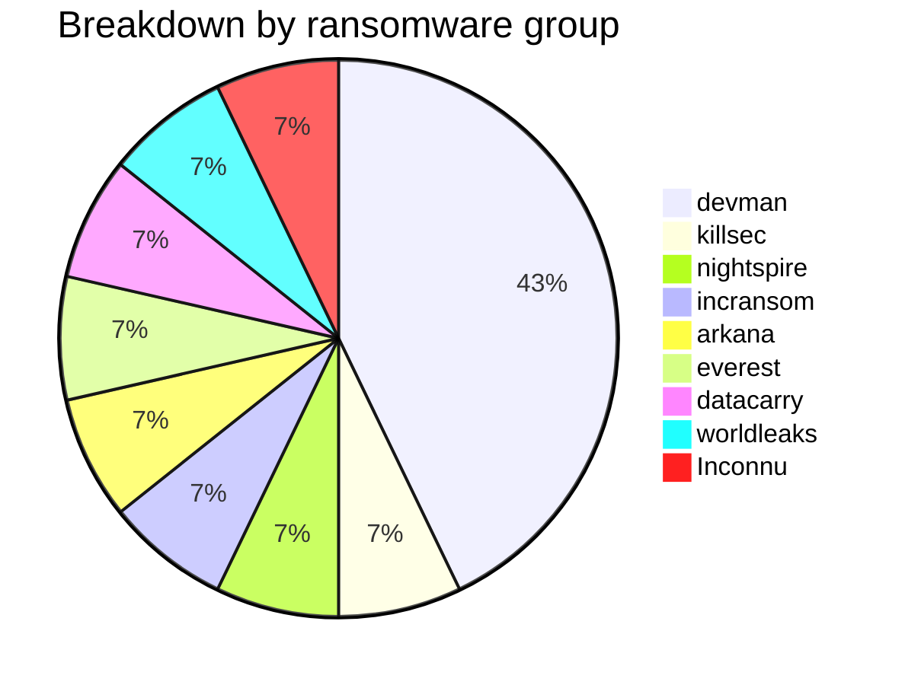
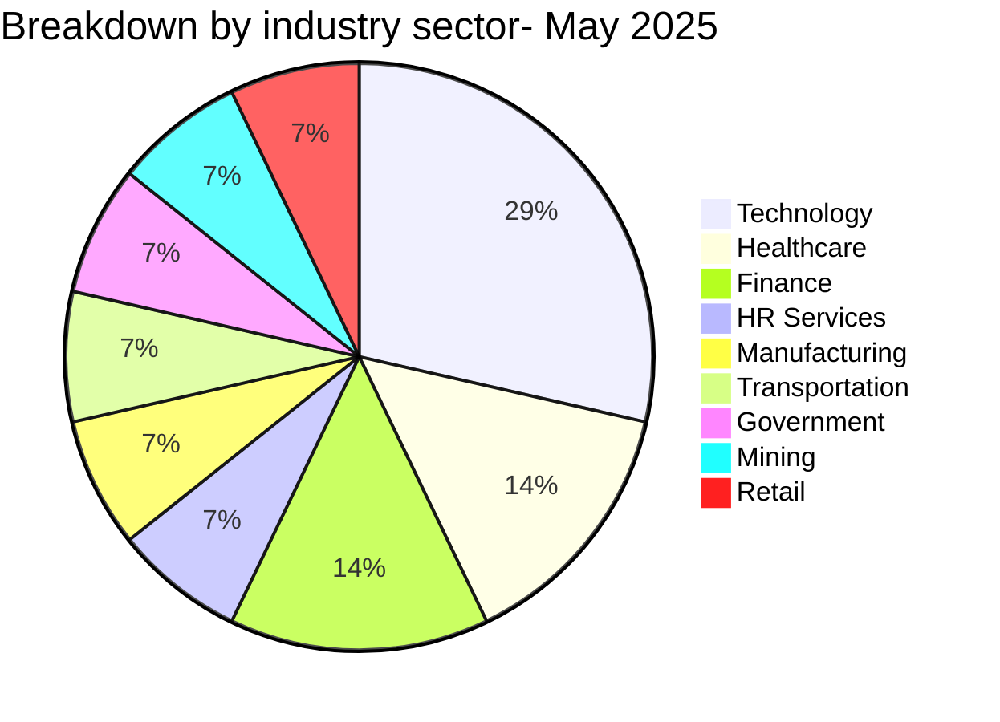
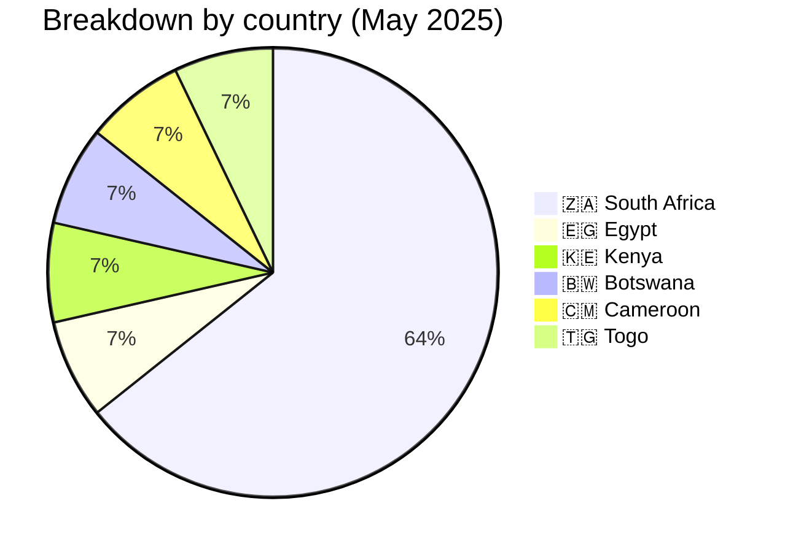
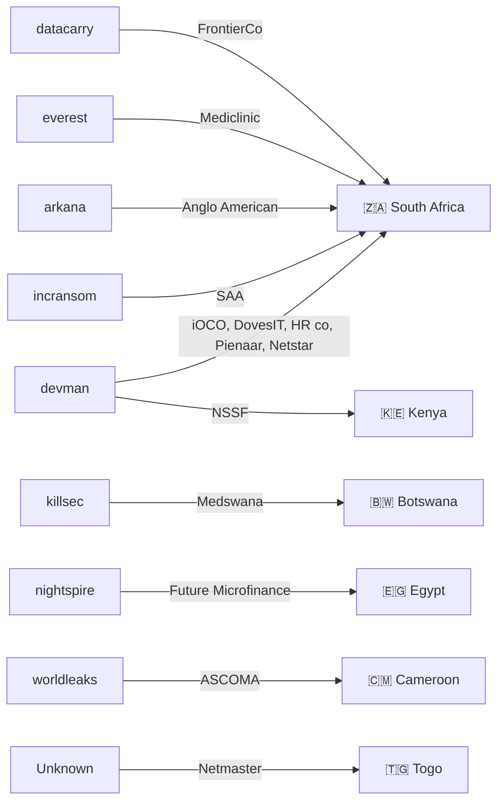

# CTI Report: Cyber Attacks in Africa - May 2025
👉🏾 [**Version française disponible ici**](./README_FR.md)

## 1. Introduction
This Cyber Threat Intelligence (CTI) report provides a detailed analysis of cyber attacks that occurred in Africa during May 2025. The information is derived from OSINT sources and ransomware group leak sites, compiled as part of the AFRINTEL project. The objective is to provide a clear overview of trends, threat actors, targeted sectors, and associated indicators of compromise.

## 2. Executive Summary
- **Total number of recorded attacks:** 14
- **Most active ransomware groups:** devman (6 attacks), killsec (1), nightspire (1), incransom (1), arkana (1), everest (1), datacarry (1), worldleaks (1), unknown (1).
- **Most targeted sectors:** Technology (4), Healthcare (2), Finance (2), Business Services (1), Industry (1), Transport (1), Government (1), Mining (1), Retail (1).
- **Most affected countries:** South Africa (9), Egypt (1), Kenya (1), Botswana (1), Cameroon (1), Togo (1).
- **Exfiltrated data volume:** 2.5 TB for NSSF Kenya, 1 GB for Netmaster Togo. Other volumes are not specified.

## 3. Key Statistics

### 3.1 Breakdown by Ransomware Group
| Ransomware Group | Number of Attacks |
|-------------------|-------------------|
| devman            | 6                 |
| killsec           | 1                 |
| nightspire        | 1                 |
| incransom         | 1                 |
| arkana            | 1                 |
| everest           | 1                 |
| datacarry         | 1                 |
| worldleaks        | 1                 |
| Unknown           | 1                 |
| **Total**         | **14**            |

### 3.2 Breakdown by sector
| Sector | Number of Attacks |
|---------|-------------------|
| Technology | 4 |
| Healthcare / Pharmacy | 2 |
| Finance / Insurance | 2 |
| Business Services (HR) | 1 |
| Industry (PPE) | 1 |
| Air Transport | 1 |
| Government / Social | 1 |
| Mining | 1 |
| Retail / Distribution | 1 |
| **Total** | **14** |

### 3.3 Breakdown by country
| Country | Number of Attacks |
|------|-------------------|
| 🇿🇦 South Africa | 9 |
| 🇪🇬 Egypt | 1 |
| 🇰🇪 Kenya | 1 |
| 🇧🇼 Botswana | 1 |
| 🇨🇲 Cameroon | 1 |
| 🇹🇬 Togo | 1 |
| **Total** | **14** |

## 4. Detailed Attacks by Ransomware Group

### 4.1 devman (6 attacks)
- **01/05/2025:** iOCO (South Africa, technology)
- **01/05/2025:** DovesIT (South Africa, technology)
- **01/05/2025:** South African HR company (South Africa, business services)
- **10/05/2025:** Pienaar Brothers (South Africa, industry PPE)
- **19/05/2025:** NSSF Kenya (Kenya, government) – 2.5 TB exfiltrated, ransom $4.5M
- **23/05/2025:** Netstar (South Africa, technology)

*Note:* devman concentrated its attacks on South Africa (5) and Kenya (1), with sectoral diversification (technology, HR, industry, government). The attack against Kenya's NSSF was the largest of the month.

### 4.2 killsec (1 attack)
- **20/05/2025:** Medswana (Botswana, pharmacy/healthcare)

### 4.3 nightspire (1 attack)
- **05/05/2025:** Future Association for Microfinance (Egypt, finance)

### 4.4 incransom (1 attack)
- **16/05/2025:** South African Airways (South Africa, air transport)

### 4.5 arkana (1 attack)
- **21/05/2025:** Anglo American plc (South Africa, mining)

### 4.6 everest (1 attack)
- **26/05/2025:** Mediclinic Group (South Africa, healthcare)

### 4.7 datacarry (1 attack)
- **26/05/2025:** FrontierCo (South Africa, retail/distribution)

### 4.8 worldleaks (1 attack)
- **31/05/2025:** ASCOMA Cameroon (Cameroon, insurance)

### 4.9 Unknown (1 attack)
- **31/05/2025:** Netmaster (Togo, technology/hosting) – 1 GB exfiltrated
### 4.10 Actor →victim → country graph

## 5. Sectoral Analysis
- **Technology:** 4 attacks (iOCO, DovesIT, Netstar, Netmaster). devman dominates, with an attack on a Togolese registrar by an unknown group.
- **Healthcare/Pharmacy:** 2 attacks (Medswana, Mediclinic). killsec and everest target healthcare players in Botswana and South Africa.
- **Finance/Insurance:** 2 attacks (Future Microfinance, ASCOMA). nightspire and worldleaks target an Egyptian NGO and a Cameroonian broker.
- **Business Services (HR):** 1 attack (South African HR company) by devman, showing interest in personal data.
- **Industry (PPE):** 1 attack (Pienaar Brothers) by devman, in the mining sector.
- **Air Transport:** 1 attack (SAA) by incransom, hitting the South African national airline.
- **Government/Social:** 1 attack (NSSF Kenya) by devman, with massive exfiltration.
- **Mining:** 1 attack (Anglo American) by arkana, targeting a mining giant.
- **Retail/Distribution:** 1 attack (FrontierCo) by datacarry.

## 6. Geographic Analysis
- **South Africa:** 9 attacks, including 6 by devman. All sectors are represented, with a strong focus on technology and critical infrastructures.
- **Egypt:** 1 attack (microfinance) by nightspire.
- **Kenya:** 1 major attack (NSSF) by devman, with 2.5 TB of data exfiltrated.
- **Botswana:** 1 attack (pharmacy) by killsec.
- **Cameroon:** 1 attack (insurance) by worldleaks.
- **Togo:** 1 attack (web hosting) by an unknown group.

South Africa is by far the most affected country, confirming its position as a regional economic hub and prime target.

## 7. Observed TTPs
- **Massive exfiltration:** NSSF Kenya (2.5 TB) and Netmaster (1 GB) illustrate the collection of large data volumes.
- **Targeting critical infrastructures:** air transport (SAA), mining (Anglo American), healthcare (Mediclinic), government (NSSF).
- **Dominance of one actor:** devman is responsible for nearly half the attacks (6/14), showing an active campaign.
- **Diversity of victims:** large groups (Anglo, SAA, Mediclinic) and SMEs (DovesIT, Pienaar) are equally targeted.
- **Double extortion:** claims with published data samples.

## 8. Recommendations
- **South Africa:** strengthen cybersecurity across all sectors, especially technology and critical infrastructures.
- **Public sector:** organizations like NSSF should implement offline backups and network segmentation.
- **Technology companies:** MSPs (iOCO, DovesIT, Netstar) are prime targets; they must secure access and monitor anomalous activities.
- **Mining sector:** Anglo American must protect sensitive data and industrial systems.
- **All sectors:** train employees on phishing detection, multi-factor authentication, and regular audits.

## 9. Conclusion
May 2025 was marked by sustained activity from the devman group, which struck South Africa and Kenya with a massive attack on NSSF (2.5 TB). The sectoral diversity (technology, healthcare, mining, transport) shows that attackers target both critical infrastructures and service companies. South Africa remains the most affected country, with 9 attacks. Regional cooperation and information sharing are more necessary than ever.

## ✍🏿 Author
*Adama ASSIONGBON*  
*SOC & Cyber Threat Intelligence Consultant*  
[LinkedIn Profile](https://www.linkedin.com/in/adama-assiongbon-9029893a/)

---
*AFRINTEL - Open CTI Monitoring Initiative on Africa*
