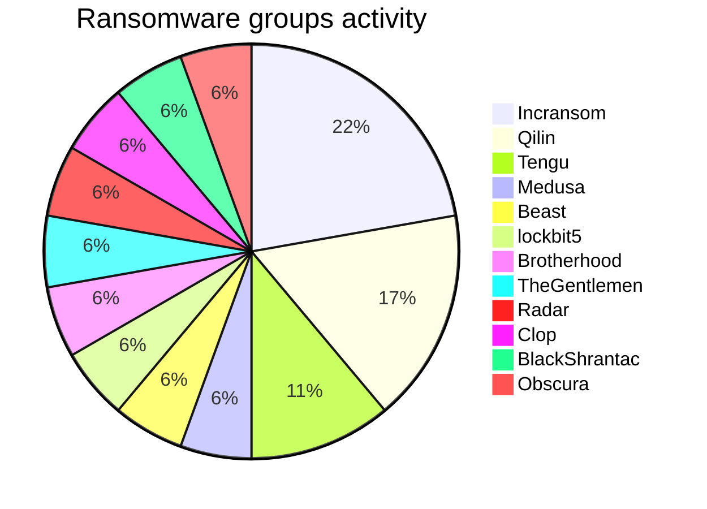
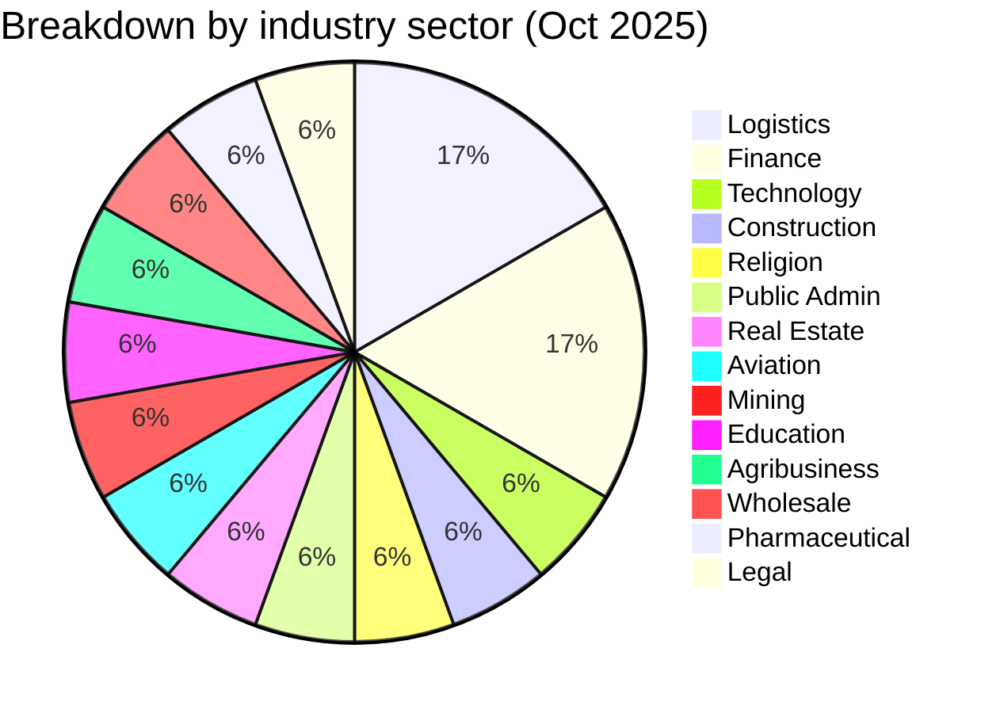
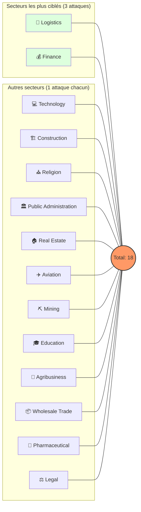
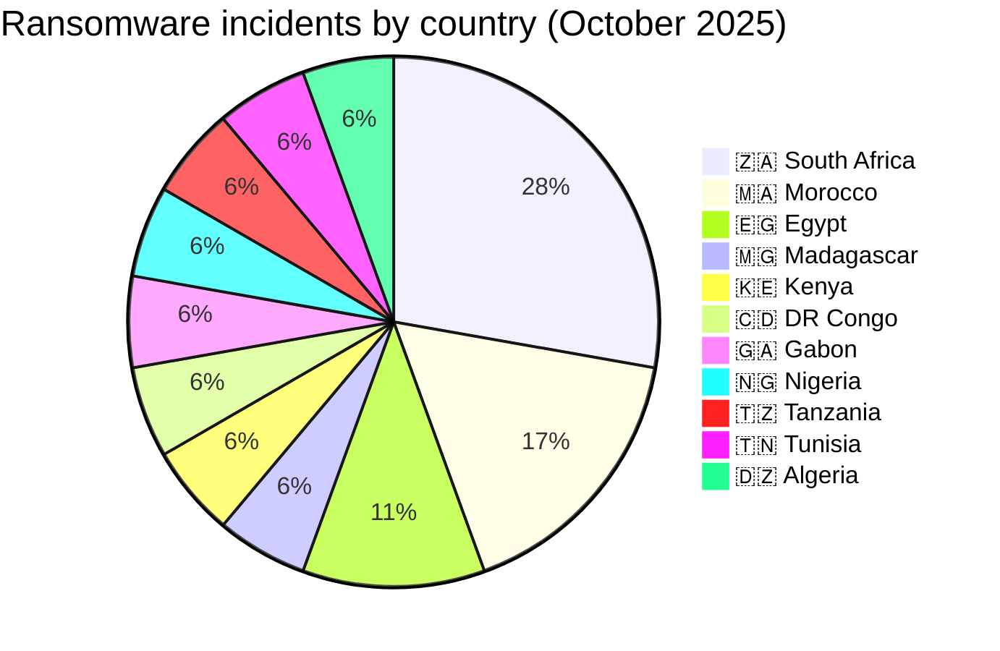
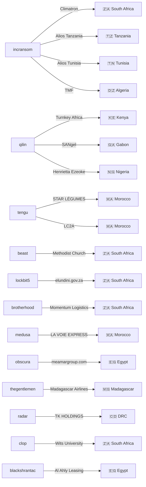

# CTI Report: Cyberattacks in Africa - October 2025 (18 victims)

👉🏾 [**French version available here**](README_FR.md)

---

## 1. Introduction
This **Cyber Threat Intelligence (CTI)** report provides a detailed analysis of cyberattacks recorded across Africa during October 2025. Data is gathered from **OSINT** sources and ransomware group leak sites, compiled under the **AFRINTEL** project. The goal is to provide a clear overview of trends, threat actors, targeted sectors, and associated indicators of compromise.

---

## 2. Executive summary
October 2025 shows a significant ransomware activity affecting African organizations, with multiple sectors targeted including finance, logistics, technology, education, and public administration.

A total of 18 confirmed ransomware claims targeting organizations operating in 11 African countries were identified during this period.

* **Total recorded attacks**: 18
* **Most active threat actors**: `incransom` (4 attacks), `qilin` (3 attacks), `tengu` (2 attacks). 
    * *Other active groups*: beast, lockbit5, brotherhood, medusa, obscura, thegentlemen, radar, clop, blackshrantac (1 attack each).
* **Most targeted sectors**: Logistics (3), Finance (3), Technologies (1), Public Administration (1).
* **Most affected countries**: 🇿🇦 South Africa (5), 🇲🇦 Morocco (3), 🇪🇬 Egypt (2).
* **Notable data exfiltration volumes**: 
    * **Alios Finance Group** (Tanzania & Tunisia): 100 GB each.
    * **TMF Logistics** (Algeria): 39 GB.

---

## 3. Key statistics

### 3.1 Breakdown by ransomware group
| Group / Actor | Number of attacks |
| :--- | :---: |
| **incransom** | 4 |
| **qilin** | 3 |
| **tengu** | 2 |
| **beast** | 1 |
| **lockbit5** | 1 |
| **brotherhood** | 1 |
| **medusa** | 1 |
| **obscura** | 1 |
| **thegentlemen** | 1 |
| **radar** | 1 |
| **clop** | 1 |
| **blackshrantac** | 1 |
| **Total** | **18** |

### 3.2 Breakdown by industry sector
| Sector | Number of Attacks |
| :--- | :---: |
| 🚚 Logistics | 3 |
| 💰 Finance | 3 |
| 💻 Technology | 1 |
| 🏗️ Construction | 1 |
| ⛪ Religion | 1 |
| 🏛️ Public Administration | 1 |
| 🏠 Real Estate | 1 |
| ✈️ Aviation | 1 |
| ⛏️ Mining | 1 |
| 🎓 Education | 1 |
| 🌾 Agribusiness | 1 |
| 📦 Wholesale Trade | 1 |
| 🧪 Pharmaceutical | 1 |
| ⚖️ Legal | 1 |
| **Total** | **18** |

### 3.3 Breakdown by country
| Country | Number of Attacks |
| :--- | :---: |
| 🇿🇦 South Africa | 5 |
| 🇲🇦 Morocco | 3 |
| 🇪🇬 Egypt | 2 |
| 🇰🇪 Kenya | 1 |
| 🇲🇬 Madagascar | 1 |
| 🇨🇩 DRC | 1 |
| 🇬🇦 Gabon | 1 |
| 🇳🇬 Nigeria | 1 |
| 🇹🇿 Tanzania | 1 |
| 🇹🇳 Tunisia | 1 |
| 🇩🇿 Algeria | 1 |
| **Total** | **18** |

---

## 4. Attack Details by ransomware group

### 4.1 incransom (4 attacks)
* **2025-10-01**: Climatron (South Africa, Construction) – Claimed & Leaked.
* **2025-10-28**: Alios Finance Group (Tanzania, Finance) – **100 GB exfiltrated**.
* **2025-10-28**: Alios Finance Group (Tunisia, Finance) – **100 GB exfiltrated**.
* **2025-10-31**: TMF Logistics (Algeria, Logistics) – **39 GB exfiltrated**.
> **Note**: incransom targeted multiple entities across different sectors and countries with high data volumes.

### 4.2 qilin (3 attacks)
* **2025-10-15**: Turnkey Africa (Kenya, Tech/Fintech) – Claimed & Leaked.
* **2025-10-19**: SANgel (Gabon, Agribusiness) – Claimed & Leaked.
* **2025-10-24**: Henrietta Ezeoke Law Firm (Nigeria, Legal) – Claimed & Leaked.

### 4.3 tengu (2 attacks)
* **2025-10-23**: STAR LÉGUMES (Morocco, Wholesale) – Claimed & Leaked.
* **2025-10-24**: Le MULTI LABORATOIRE LC2A (Morocco, Pharmaceutical) – Claimed & Leaked.

### 4.4 Other Groups (1 attack each)
* **beast** (Oct 05): The Methodist Church of Southern Africa (South Africa, Religion).
* **lockbit5** (Oct 07): elundini.gov.za (South Africa, Public Administration).
* **brotherhood** (Oct 10): Momentum Logistics (South Africa, Logistics).
* **medusa** (Oct 13): LA VOIE EXPRESS (Morocco, Logistics).
* **obscura** (Oct 13): meamargroup.com (Egypt, Real Estate) – **3rd attack against this company**.
* **thegentlemen** (Oct 17): Madagascar Airlines (Madagascar, Aviation).
* **clop** (Oct 18): University of the Witwatersrand (South Africa, Education).
### 4.5 Actor → Victim → Country Graph

---

## 5. Strategic observations & TTPs
* **Massive Data Exfiltration**: High focus on sensitive data theft (up to 100 GB) to maximize extortion pressure.
* **Persistent Vulnerabilities**: The repeated targeting of *meamargroup.com* (3rd time) suggests unpatched entry points or poor remediation.
* **Geographical Dispersion**: Balanced threat distribution between North Africa (7 attacks) and Sub-Saharan Africa (11 attacks).

---

## 6. Recommendations
1.  **Logistics & Finance**: Implement data-at-rest encryption and monitor for anomalous outbound traffic (exfiltration).
2.  **Public Sector**: Conduct regular security audits and enforce strict Multi-Factor Authentication (MFA).
3.  **Education & Research**: Protect personal student data and research intellectual property through network segmentation.
4.  **Incident Response**: Regularly test Business Continuity Plans (BCP) and Disaster Recovery Plans (DRP).

---

### ✍🏿 Author
**Adama ASSIONGBON** *SOC & Cyber Threat Intelligence Consultant* [LinkedIn Profile](https://www.linkedin.com/in/adama-assiongbon-9029893a/)

**AFRINTEL** - *Open CTI Initiative for Africa*
