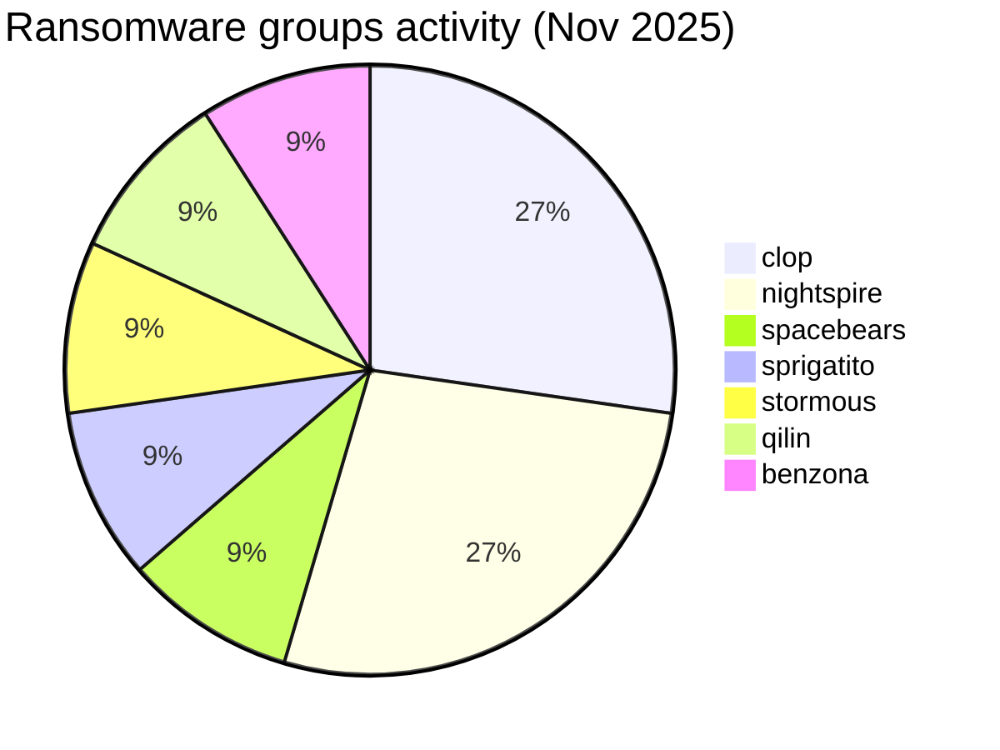
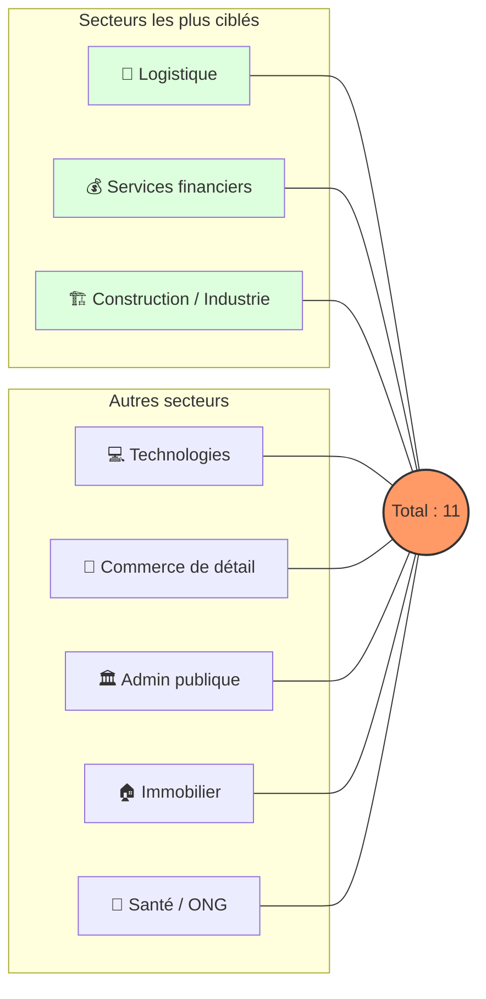
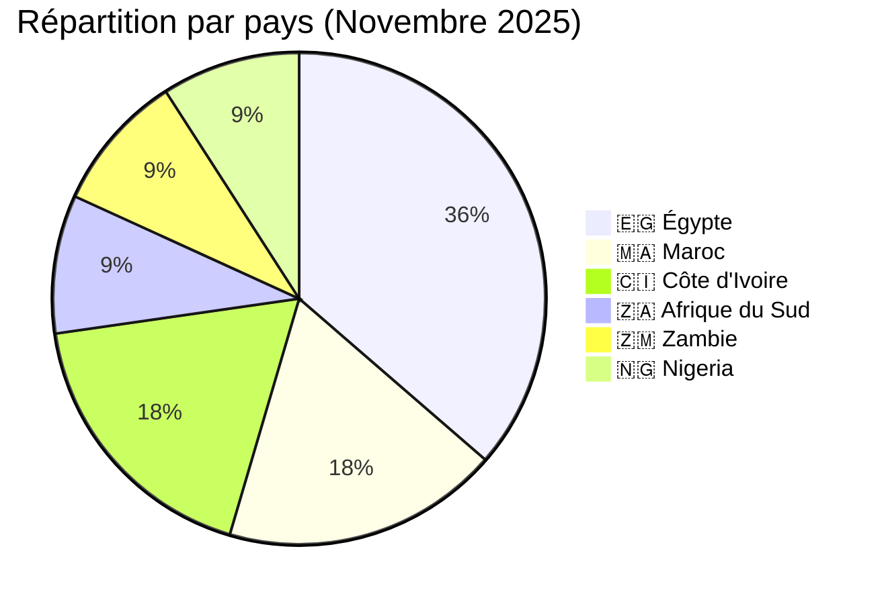
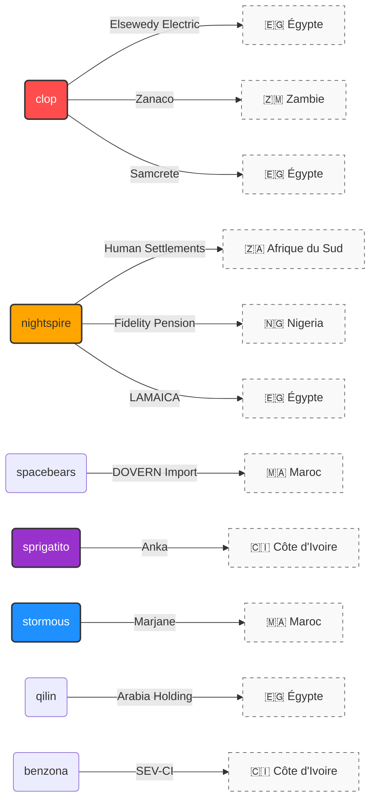

# Rapport CTI : Cyberattaques en Afrique - Novembre 2025 (11 victimes)

👉🏾 [**English version available here**](./README.md)

## 1. Introduction
Ce rapport de **Cyber Threat Intelligence (CTI)** présente une analyse détaillée des cyberattaques survenues en Afrique durant le mois de novembre 2025. Les informations sont issues de sources **OSINT** et de sites de fuites de groupes ransomware, compilées dans le cadre du projet **AFRINTEL**. L'objectif est de fournir une vision claire des tendances, des acteurs menaçants, des secteurs ciblés et des indicateurs de compromission associés.

---

## 2. Résumé exécutif
Novembre 2025 montre une activité persistante de ransomwares ciblant les organisations africaines, avec un focus marqué sur l'Égypte et le Maroc. Un total de 11 revendications confirmées ciblant des organisations opérant dans 6 pays africains ont été identifiées.

* **Nombre total d'attaques recensées** : 11
* **Acteurs les plus actifs** : `clop` (3 attaques), `nightspire` (3 attaques).
    * *Autres groupes actifs* : spacebears, sprigatito, stormous, qilin, benzona (1 attaque chacun).
* **Secteurs les plus ciblés** : Logistique (2), Services financiers (2), Construction/Industrie (2).
* **Pays les plus touchés** : 🇪🇬 Égypte (4), 🇲🇦 Maroc (2), 🇨🇮 Côte d'Ivoire (2).
* **Fuite de données notable** : **Anka** (Côte d'Ivoire) avec une base de données de 12,1 Go affectant plus de 537 000 utilisateurs.

---

## 3. Statistiques clés

### 3.1 Répartition par groupe ransomware
| Groupe / Acteur | Nombre d'attaques |
| :--- | :---: |
| **clop** | 3 |
| **nightspire** | 3 |
| **spacebears** | 1 |
| **sprigatito** | 1 |
| **stormous** | 1 |
| **qilin** | 1 |
| **benzona** | 1 |
| **Total** | **11** |

### 3.2 Répartition par secteur d'activité
| Secteur | Nombre d'attaques |
| :--- | :---: |
| Logistique | 2 |
| Services financiers | 2 |
| Construction / Industrie | 2 |
| Technologies | 1 |
| Commerce / E-commerce | 1 |
| Administration publique | 1 |
| Immobilier / Investissement | 1 |
| Santé / ONG | 1 |
| **Total** | **11** |

### 3.3 Répartition par pays
| Pays | Nombre d'attaques |
| :--- | :---: |
| 🇪🇬 Égypte | 4 |
| 🇲🇦 Maroc | 2 |
| 🇨🇮 Côte d'Ivoire | 2 |
| 🇿🇦 Afrique du Sud | 1 |
| 🇿🇲 Zambie | 1 |
| 🇳🇬 Nigeria | 1 |
| **Total** | **11** |

---

## 4. Détail des attaques par groupe ransomware

### 4.1 clop (3 attaques)
* **06/11/2025** : ELSEWEDYELECTRIC.COM (Égypte, Tech/Industrie) - Revendication & divulgation.
* **06/11/2025** : ZANACO.CO.ZM (Zambie, Banque) - Revendication & divulgation.
* **11/11/2025** : Samcrete Holding (Égypte, Construction) - Revendication & divulgation.

### 4.2 nightspire (3 attaques)
* **09/11/2025** : Eastern Cape Dept. of Human Settlements (Afrique du Sud, Admin publique) - Revendication & divulgation.
* **09/11/2025** : Fidelity Pension Managers (Nigeria, Finance) - Revendication & divulgation.
* **25/11/2025** : LAMAICA (Égypte, Industrie) - Revendication & divulgation.

### 4.3 Autres groupes (1 attaque chacun)
* **spacebears** (04/11) : DOVERN Import (Maroc, Logistique) - Revendication & Menace.
* **sprigatito** (05/11) : Anka (Côte d'Ivoire, Logistique) - Fuite de 12,1 Go de données.
* **stormous** (06/11) : Marjane (Maroc, Commerce) - Revendication & divulgation.
* **qilin** (26/11) : Arabia Holding (Égypte, Immobilier) - Revendication & divulgation.
* **benzona** (26/11) : SEV-CI (Côte d'Ivoire, Santé/ONG) - Revendication & divulgation.

---

## 5. Analyse sectorielle
* **Logistique (2)** : Ciblage de plateformes stratégiques (Dovern Import au Maroc et Anka en Côte d'Ivoire), confirmant la vulnérabilité des chaînes d'approvisionnement régionales.
* **Services Financiers (2)** : Attaques contre une institution bancaire majeure (Zanaco en Zambie) et un gestionnaire de fonds de pension (Fidelity au Nigeria).
* **Construction / Industrie (2)** : Focus sur des fleurons industriels égyptiens (Elsewedy Electric et Samcrete), cibles de choix pour l'espionnage industriel et l'extorsion.
* **Administration Publique (1)** : Incident notable en Afrique du Sud (Eastern Cape), rappelant que les services aux citoyens restent une cible privilégiée.

---

## 6. Analyse géographique
* **🇪🇬 Égypte** : Épicentre de l'activité ce mois-ci avec **4 victimes**. Le ciblage est exclusivement industriel et technologique.
* **🇲🇦 Maroc** : Activité stable avec **2 victimes** (Logistique et Commerce de détail), touchant des acteurs majeurs du marché local.
* **🇨🇮 Côte d'Ivoire** : Émergence d'attaques à fort impact (2 victimes), notamment avec la fuite massive de données utilisateurs de la plateforme Anka.
* **Répartition Globale** : **Afrique du Nord (6 attaques)** vs **Afrique subsaharienne (5 attaques)**. La menace est particulièrement concentrée sur les puissances économiques du continent (Égypte, Maroc, Afrique du Sud, Nigeria).

---

## 7. TTPs observées (Tactics, Techniques & Procedures)
* **Fuites de données B2C à grande échelle** : L'incident Anka (537 000 utilisateurs) montre une volonté de nuire à la réputation et de monétiser les données personnelles sur les forums de cybercriminalité.
* **Ciblage d'Infrastructures Critiques** : L'attaque contre Elsewedy Electric souligne les risques pesant sur le secteur de l'énergie et des systèmes industriels.

---

## 8. Recommandations
1.  **Secteurs Logistique & Commerce** : Durcissement de la sécurité des bases de données clients et surveillance accrue des accès API et des tentatives de dumps SQL.
2.  **Secteur Financier** : Renforcement du chiffrement de bout en bout et mise en place d'une surveillance proactive des transactions et des accès aux registres de comptes.
3.  **Santé & ONG** : Protection des données sensibles via une segmentation réseau stricte pour éviter la propagation latérale des ransomwares.
4.  **Général : Tester régulièrement les plans de réponse aux incidents :**
    * **BCP (Business Continuity Plan)** / **PCA (Plan de Continuité d'Activité)** : Pour assurer le maintien des opérations critiques de l'entreprise pendant la durée de l'attaque.
    * **DRP (Disaster Recovery Plan)** / **PRA (Plan de Reprise d'Activité)** : Pour garantir la restauration rapide et sécurisée des infrastructures informatiques et des données.

---

## 9. Conclusion
Novembre 2025 témoigne d'une diversification des acteurs de menace (7 groupes différents pour 11 victimes). La concentration des attaques sur l'Égypte et le ciblage de données utilisateurs massives en Afrique de l'Ouest indiquent une évolution des stratégies d'extorsion vers des secteurs plus variés que la simple finance traditionnelle.
---

### ✍🏿 Auteur
**Adama ASSIONGBON** *Consultant SOC & Cyber Threat Intelligence* [Profil LinkedIn](https://www.linkedin.com/in/adama-assiongbon-9029893a/)

**AFRINTEL** - *Initiative ouverte de veille CTI sur l’Afrique*
