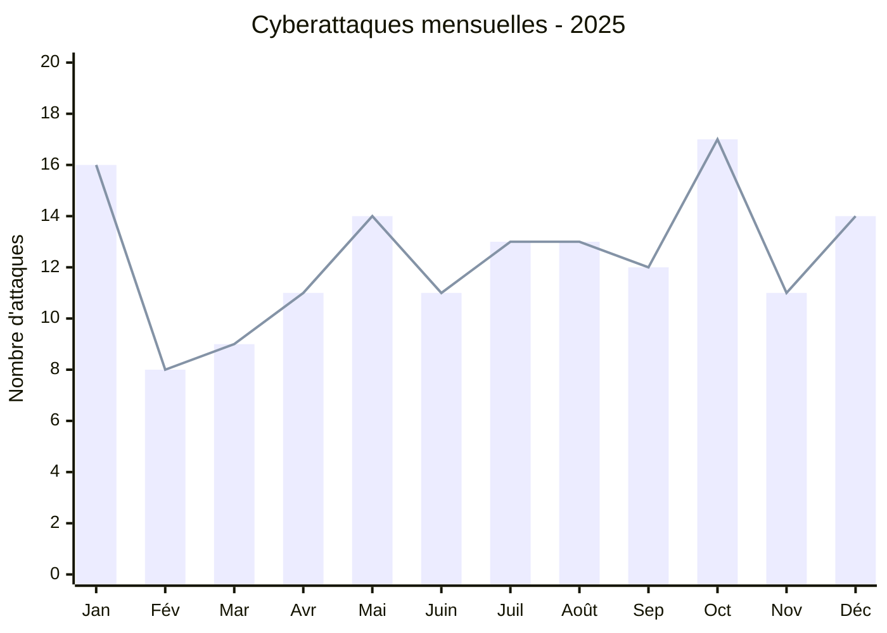
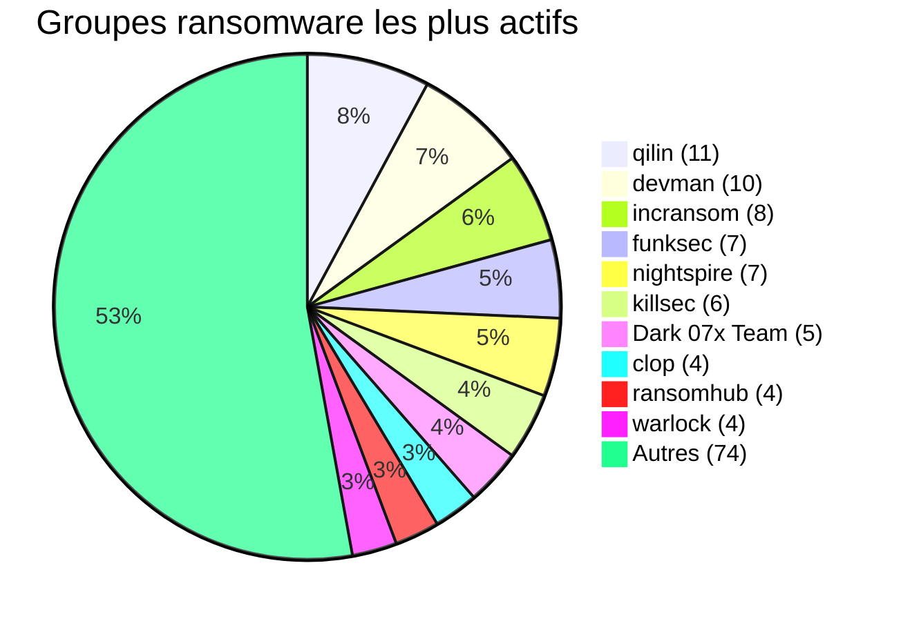
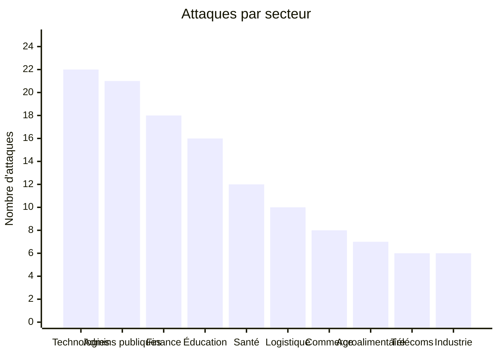
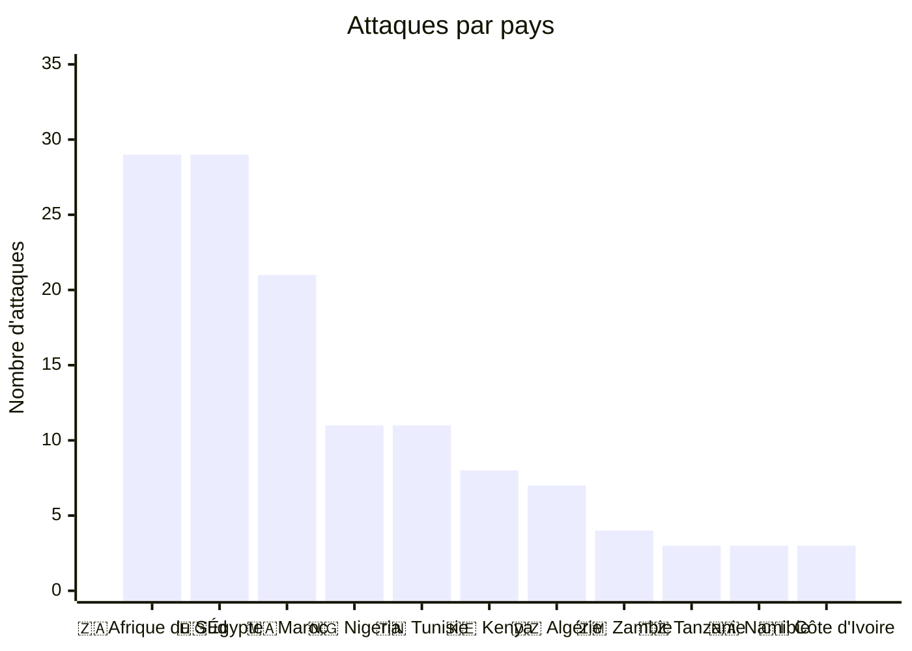
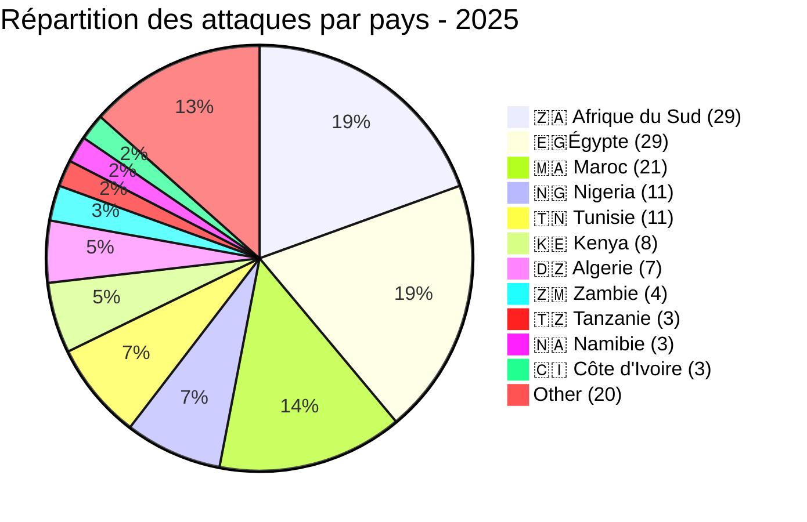
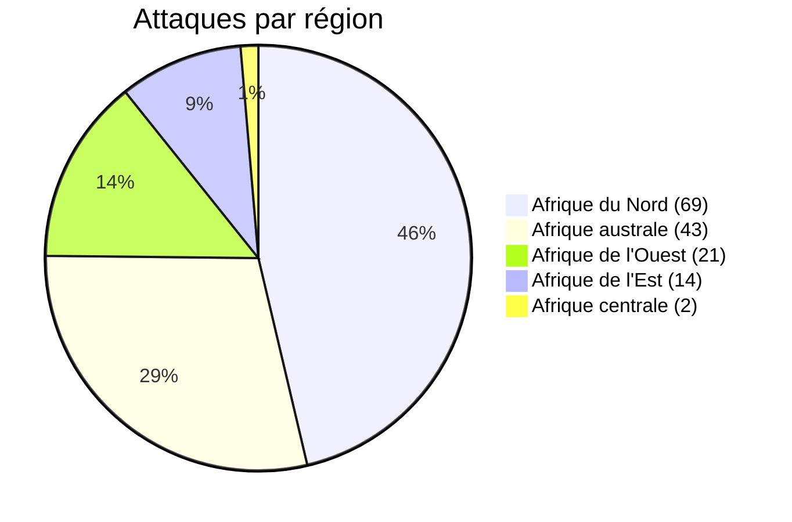

# AFRINTEL - Rapport annuel 2025 : Cyberattaques en Afrique
👉🏾 [**English version available here**](./README.md)

## 1. Introduction
Ce rapport offre une vue d’ensemble des attaques de ransomware et des fuites de données ayant ciblé des organisations africaines au cours de l’année 2025. Tous les incidents ont été collectés à partir de sources OSINT, de sites de fuite de groupes ransomware et de forums clandestins, dans le cadre de l’initiative open source AFRINTEL.

L’ensemble de données comprend **149 revendications publiques** affectant **146 victimes uniques** dont trois organisations ont été frappées à deux reprises par des groupes ransomware différents. L’analyse porte sur les tendances mensuelles, les acteurs de la menace, les secteurs touchés, la répartition géographique et les principales tactiques, techniques et procédures (TTP).

## 2. Résumé exécutif
- **Total des revendications :** 149 (146 victimes uniques, 3 doubles revendications)
- **Mois le plus actif :** octobre (17 revendications)
- **Mois le moins actif :** février (8 revendications)
- **Groupes les plus prolifiques :** qilin (11), devman (10), incransom (8)
- **Pays les plus ciblés :** Afrique du Sud et Égypte (29 chacun), Maroc (21)
- **Secteurs les plus ciblés :** Technologies (22), Administrations publiques (21), Finance (18)
- **Plus grande exfiltration :** NSSF Kenya - 2,5 To (devman)
- **Demande de rançon la plus élevée :** NSSF Kenya - 4,5 M$

👉🏾 [**Liste des victimes** ](./victims_FR.md)
## 3. Répartition mensuelle
| Mois      | Revendications |
|-----------|----------------|
| Janvier   | 16 |
| Février   | 8  |
| Mars      | 9  |
| Avril     | 11 |
| Mai       | 14 |
| Juin      | 11 |
| Juillet   | 13 |
| Août      | 13 |
| Septembre | 12 |
| Octobre   | 17 |
| Novembre  | 11 |
| Décembre  | 14 |
| **Total** | **149** |

Le premier trimestre (janv.-mars) a totalisé 33 attaques, suivi de 36 au T2, 38 au T3 et un pic de 42 au T4.

## 4. Groupes ransomware les plus actifs
| Rang | Groupe           | Revendications |
|------|------------------|----------------|
| 1    | qilin            | 11     |
| 2    | devman           | 10     |
| 3    | incransom        | 8      |
| 4    | funksec          | 7      |
| 4    | nightspire       | 7      |
| 6    | killsec          | 6      |
| 7    | Dark 07x Team    | 5      |
| 8    | clop             | 4      |
| 8    | ransomhub        | 4      |
| 8    | warlock          | 4      |
| 11   | arcusmedia       | 3      |
| 11   | babuk2           | 3      |
| 11   | dragonforce      | 3      |
| 11   | GDLockerSec      | 3      |
| 11   | lockbit5         | 3      |
| 11   | spacebears       | 3      |
| 11   | thegentlemen     | 3      |
|      | *Autres groupes* | 61     |

- **qilin** est devenu l’acteur le plus actif au second semestre, frappant les secteurs de l’énergie, de l’assurance et des technologies en Afrique de l’Est et australe.
- **devman** est resté une menace persistante, notamment en Afrique du Sud et au Kenya, et a revendiqué la plus grosse exfiltration de l’année (NSSF Kenya, 2,5 To).
- **incransom** a été actif tout au long de l’année, exfiltrant souvent de grands volumes (100 Go, 39 Go) auprès d’entreprises logistiques et financières.

## 5. Secteurs les plus ciblés
| Secteur                     | Revendications |
|-----------------------------|----------------|
| Technologies                | 22     |
| Administrations publiques   | 21     |
| Finance                     | 18     |
| Éducation                   | 16     |
| Santé                       | 12     |
| Logistique                  | 10     |
| Commerce de détail          | 8      |
| Agroalimentaire             | 7      |
| Télécommunications          | 6      |
| Industrie manufacturière    | 6      |
| *Autres secteurs*           | 23     |

Le secteur des technologies a été le plus durement touché, suivi de près par les administrations publiques et les institutions financières. Les infrastructures critiques (énergie, transport, défense) ont également subi plusieurs attaques.

## 6. Pays les plus ciblés
| Rang | Pays                    | Revendications |
|------|-------------------------|----------------|
| 1    | 🇿🇦 Afrique du Sud      | 29     |
| 1    | 🇪🇬 Égypte              | 29     |
| 3    | 🇲🇦 Maroc               | 21     |
| 4    | 🇳🇬 Nigeria             | 11     |
| 4    | 🇹🇳 Tunisie             | 11     |
| 6    | 🇰🇪 Kenya               | 8      |
| 7    | 🇩🇿 Algérie             | 7      |
| 8    | 🇿🇲 Zambie              | 4      |
| 9    | 🇹🇿 Tanzanie            | 3      |
| 9    | 🇳🇦 Namibie             | 3      |
| 9    | 🇨🇮 Côte d’Ivoire       | 3      |
| 12   | 🇬🇭 Ghana               | 2      |
| 12   | 🇺🇬 Ouganda             | 2      |
| 12   | 🇧🇼 Botswana            | 2      |
| 12   | 🇹🇬 Togo                | 2      |
| 12   | 🇿🇼 Zimbabwe            | 2      |
| 12   | 🇲🇺 Maurice             | 2      |
| 18   | 🇲🇬 Madagascar          | 1      |
| 18   | 🇨🇩 RDC                 | 1      |
| 18   | 🇬🇦 Gabon               | 1      |
| 18   | 🇨🇲 Cameroun            | 1      |
| 18   | 🇸🇳 Sénégal             | 1      |
| 18   | 🇷🇼 Rwanda              | 1      |

L’Afrique du Sud et l’Égypte sont les pays les plus ciblés, représentant près de 40 % de toutes les attaques. L’Afrique du Nord (Égypte, Maroc, Algérie, Tunisie) totalise 69 attaques (46 %), tandis que l’Afrique australe (Afrique du Sud, Zambie, Namibie, Botswana, Zimbabwe, Maurice, Madagascar) en compte 43 (29 %).

## 7. Incidents notables
| Victime                    | Pays          | Groupe       | Volume de données | Rançon |
|----------------------------|---------------|--------------|-------------------|--------|
| NSSF Kenya                 | 🇰🇪 Kenya      | devman       | 2,5 To            | 4,5 M$ |
| INTELS Nigeria             | 🇳🇬 Nigeria    | ransomhub    | 1,5 To            | - |
| DGID Sénégal               | 🇸🇳 Sénégal    | BlackShrantac| 1 To              | - |
| SPEED Co                   | 🇪🇬 Égypte     | hunter       | 444,8 Go          | - |
| INI Investments            | 🇪🇬 Égypte     | nightspire   | 400 Go            | - |

- **Doubles revendications** (même victime, groupes différents) :
  - Hôpital La Rabta (Tunisie) - devman (12 déc.) & qilin (26 déc.)
  - Netstar South Africa (Afrique du Sud) - devman (23 mai) & incransom (20 août)
  - Proplastics Limited (Zimbabwe) - thegentlemen (9 sept.) & lockbit5 (26 déc.)

## 8. Répartition régionale
| Région            | Revendications | Part |
|-------------------|----------------|------|
| Afrique du Nord   | 69             | 46,3 % |
| Afrique australe  | 43             | 28,9 % |
| Afrique de l’Ouest| 21             | 14,1 % |
| Afrique de l’Est  | 14             | 9,4 %  |
| Afrique centrale  | 2              | 1,3 %  |

## 9. TTP observées
- **Exfiltration massive** - de nombreux groupes ont exfiltré des centaines de gigaoctets, voire des téraoctets, avant le chiffrement.
- **Double extorsion** - presque toutes les attaques s’accompagnaient de fuites de données sur des sites TOR dédiés.
- **Injections SQL** - utilisées contre plusieurs applications web (ex. Yasat, New Era Com) pour vider les bases de données.
- **Ciblage d’infrastructures critiques** - énergie (KenGen, Uganda Electricity), transport (SAA, Madagascar Airlines), défense (Nigerian Navy).
- **Implication de hacktivistes** - des groupes comme DieNet, Phantom Atlas, Dark 07x Team ont revendiqué des fuites à motivation politique.
- **Victimisation répétée** - trois organisations ont été attaquées deux fois par des groupes ransomware différents.

## 10. Recommandations
- **Mesures sectorielles** :
  - **Technologies** - mettre en place une validation rigoureuse des entrées, un WAF et des tests d’intrusion réguliers.
  - **Administrations publiques** - appliquer l’authentification multi‑facteurs, des sauvegardes hors ligne et une surveillance continue.
  - **Finance** - segmenter les réseaux, chiffrer les données sensibles, surveiller les accès anormaux.
  - **Énergie et transport** - adopter une détection avancée des menaces et des plans de réponse aux incidents.
- **Général** :
  - Organiser des formations régulières de sensibilisation des employés (le phishing reste un vecteur d’accès initial majeur).
  - Maintenir des sauvegardes isolées et hors ligne.
  - Partager les indicateurs de compromission (IoC) entre les CSIRT régionaux.

## 11. Conclusion
L’année 2025 a été marquée par une activité soutenue des ransomware en Afrique, avec une tendance nette vers le vol massif de données et la double extorsion. L’Afrique du Sud et l’Égypte ont été les plus touchées, mais aucune région n’a été épargnée. L’émergence de groupes comme qilin, devman et incransom, ainsi que la diversification des cibles (des infrastructures critiques aux startups insurtech), souligne la nécessité d’une intelligence proactive des menaces et d’une coopération transfrontalière.

👉🏾 [**Liste des victimes** ](./victims_FR.md)
---
## ✍🏿 Auteur
*Adama ASSIONGBON*  
*Consultant SOC & Cyber Threat Intelligence*  
[Profil LinkedIn](https://www.linkedin.com/in/adama-assiongbon-9029893a/)

---
*AFRINTEL - Initiative ouverte de veille CTI sur l’Afrique*
