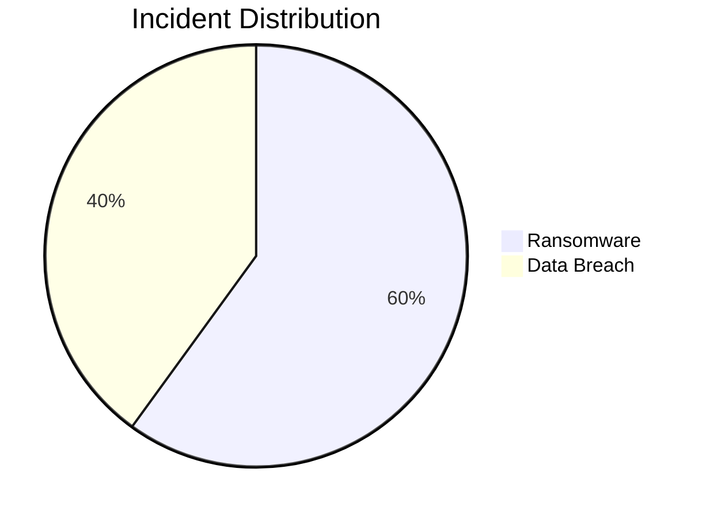
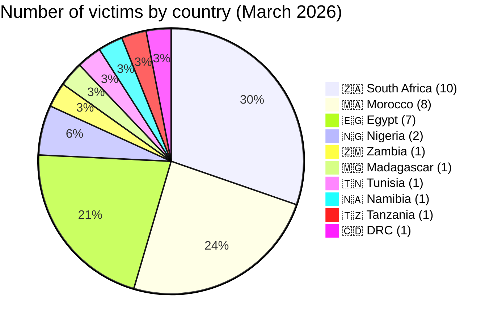
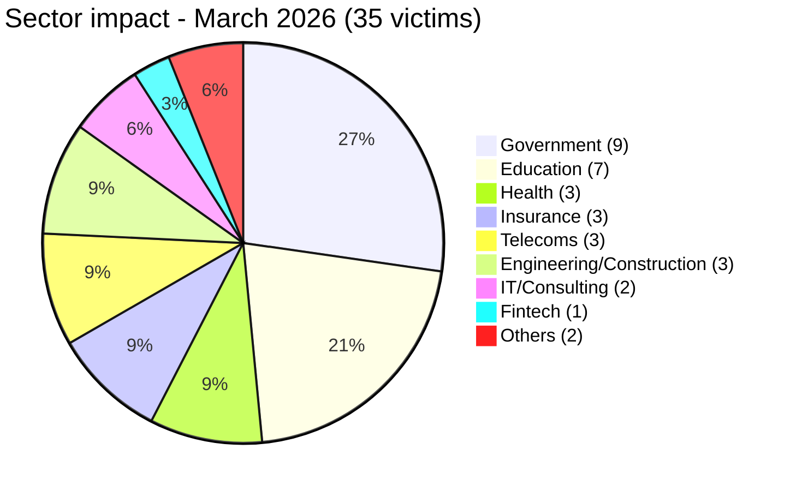
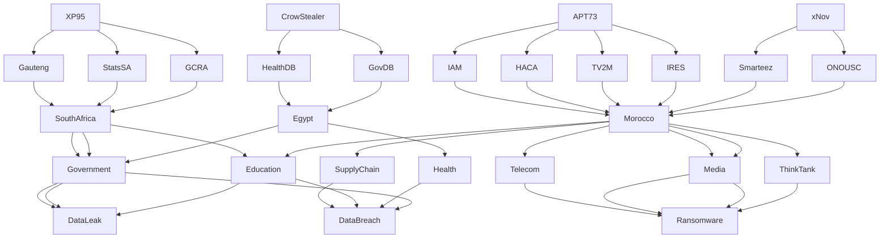

[](https://github.com/Hatchepsoute/AFRINTEL)


# CTI Report - Cyberattacks in Africa (March 2026)
👉🏾 [**French version available here**](./README_FR.md)
## 1. Executive summary

In March 2026, **35 cyber incidents** targeting African entities were publicly claimed or detected. The continent continues to face a dual threat: **ransomware** (encryption with ransom demand) and **data breaches** (exfiltration without encryption). Key findings:

- **21 ransomware attacks (60%)** and **14 data breaches (40%)**.
- **10 countries** affected; **South Africa** (10 incidents), **Morocco** (8) and **Egypt** (7) account for 71% of all victims.
- **22 distinct threat actors**; **CrowStealer** (5 incidents), **APT73/BASHE** (4) and **XP95** (3) are the most active.
- **Government and education sectors** represent 46% of victims, highlighting a strategic focus on public institutions.
- Massive data leaks: Egyptian health ministry (3.8M records), Gauteng provincial government (3.8 TB), Remita Nigeria (3 TB), Stats SA (154 GB).

## 2. Methodology

- **Scope**: 54 African countries.
- **Period**: 1 - 31 March 2026.
- **Sources**: DLS (leak sites), OSINT, Telegram channels, underground forums.
- **Inclusion**: Publicly claimed or attributed incidents with identified victim, country, sector.
- **Typology**:
  - *Ransomware*: encryption + ransom demand (claim on DLS).
  - *Data breach*: unencrypted exfiltration, database sold or published.
  

## 3. Global overview

| Indicator                     | Value |
|-------------------------------|-------|
| Total victims                 | 35    |
| Countries affected            | 10    |
| Distinct actors               | 22    |
| Ransomware incidents          | 21 (60%) |
| Data breach incidents         | 14 (40%) |

**Most targeted countries:**
- 🇿🇦 South Africa: 10 victims
- 🇲🇦 Morocco: 8 victims
- 🇪🇬 Egypt: 7 victims

```mermaid
xychart-beta
    title Most targeted countries
    "🇿🇦 South Africa" : 10
    "🇲🇦 Morocco" : 8
    "🇪🇬 Egypt" : 7
    "Others" : 10
```

**Breakdown by country:**
- South Africa: 10
- Morocco: 8
- Egypt: 7
- Nigeria: 2
- Zambia: 1
- Madagascar: 1
- Tunisia: 1
- Namibia: 1
- Tanzania: 1
- DRC: 1



**Ransomware vs Data Breaches by country:**
| Country       | Ransomware | Data Breach |
|---------------|------------|-------------|
| South Africa  | 10         | 2           |
| Morocco       | 5          | 3           |
| Egypt         | 3          | 5           |
| Nigeria       | 0          | 2           |
| Zambia        | 0          | 1           |
| DRC           | 0          | 1           |

```mermaid
xychart-beta
    title "Ransomware vs Data Breaches by country"
    x-axis ["🇿🇦 South Africa", "🇲🇦 Morocco", "🇪🇬 Egypt", "🇳🇬 Nigeria", "🇿🇲 Zambia", "🇨🇩 DRC"]
    y-axis "Number of incidents" 0 to 12
    bar [10, 5, 3, 0, 0, 0]
    bar [2, 3, 5, 2, 1, 1]
```


**Sector distribution:**
| Sector                    | Incidents | Percentage |
|---------------------------|-----------|------------|
| Government / Admin        | 9         | 26%        |
| Education / University    | 7         | 20%        |
| Health                    | 3         | 9%         |
| Insurance                 | 3         | 9%         |
| Telecommunications        | 3         | 9%         |
| Engineering/Construction  | 3         | 9%         |
| IT/Consulting             | 2         | 6%         |
| Fintech                   | 1         | 3%         |
| Others                    | 2         | 6%         |

**Most prolific actors:**
| Actor            | Type            | Incidents | Primary targets |
|------------------|-----------------|-----------|-----------------|
| CrowStealer      | Data broker     | 5         | Egyptian government & education |
| APT73/BASHE      | Ransomware      | 4         | Moroccan state institutions |
| XP95             | Ransomware      | 3         | South African government |
| Qilin            | Ransomware      | 2         | Morocco, Madagascar |
| The Gentlemen    | Ransomware      | 2         | Tunisia, South Africa |
| INC Ransom       | Ransomware      | 2         | Namibia, South Africa |
| xNov             | Data breach     | 2         | Moroccan supply chain |

```mermaid
xychart-beta
    title "Most prolific threat actors"
    x-axis "Incidents" 0 to 6
    y-axis ["CrowStealer", "APT73/BASHE", "XP95", "Qilin", "The Gentlemen", "INC Ransom", "xNov"]
    bar [5, 4, 3, 2, 2, 2, 2]
```

**Daily timeline (March 2026):**
- 01/03: 3 incidents
- 02/03: 3
- 03/03: 3
- 04/03: 1
- 05/03: 1
- 06/03: 2
- 09/03: 1
- 12/03: 1
- 13/03: 2
- 14/03: 1
- 19/03: 1
- 20/03: 2
- 21/03: 1
- 22/03: 1
- 26/03: 4
- 29/03: 2
- 30/03: 3
- 31/03: 3

```mermaid
xychart-beta
    title "Daily incident timeline - March 2026"
    x-axis ["1/3", "2/3", "3/3", "4/3", "5/3", "6/3", "9/3", "12/3", "13/3", "14/3", "19/3", "20/3", "21/3", "22/3", "26/3", "29/3", "30/3", "31/3"]
    y-axis "Incidents" 0 to 5
    line [3, 3, 3, 1, 1, 2, 1, 1, 2, 1, 1, 2, 1, 1, 4, 2, 3, 3]
```
## 4. Detailed analysis by incident type

### 4.1 Ransomware (21 incidents)

| Country          | Ransomware attacks | Main actors |
|------------------|--------------------|-------------|
| South Africa     | 10                 | XP95 (3), LockBit 5.0, Lynx, DragonForce, The Gentlemen, NightSpire, INC Ransom, Coinbase Cartel |
| Morocco          | 5                  | APT73/BASHE (3), Qilin, The Gentlemen |
| Egypt            | 3                  | Crypto24, PEAR, Payload |
| Madagascar       | 1                  | Qilin |
| Tunisia          | 1                  | The Gentlemen |
| Namibia          | 1                  | INC Ransom |
| Tanzania         | 1                  | Morpheus |

```mermaid
xychart-beta
    title "Ransomware - Number of attacks by country"
    x-axis ["🇿🇦 South Africa", "🇲🇦 Morocco", "🇪🇬 Egypt", "🇲🇬 Madagascar", "🇹🇳 Tunisia", "🇳🇦 Namibia", "🇹🇿 Tanzania"]
    y-axis "Attacks" 0 to 12
    bar [10, 5, 3, 1, 1, 1, 1]
```

**Key observations**:
- **XP95** emerged as a major threat in South Africa, striking Gauteng provincial government (3.8 TB), Stats SA (154 GB) and GCRA (147 GB). Data is being sold, not just encrypted.
- **APT73/BASHE** targeted strategic Moroccan institutions (HACA, Maroc Telecom, 2M TV, IRES), suggesting possible geopolitical motivation.
- Insurance sector heavily hit in South Africa (Lion of Africa, The Unlimited).

### 4.2 Data breaches (14 incidents)

| Country          | Breaches | Main actors |
|------------------|----------|-------------|
| Egypt            | 5        | CrowStealer (5) |
| Morocco          | 3        | xNov (2), anisanas2 |
| South Africa     | 2        | TelephoneHooliganism, XP95 (already counted in ransomware) |
| Nigeria          | 2        | AshleyWood2022, Bytetobreach |
| Zambia           | 1        | Spirigatito |
| DRC              | 1        | privillege |

```mermaid
xychart-beta
    title "Data breaches - Number by country"
    x-axis ["🇪🇬 Egypt", "🇲🇦 Morocco", "🇿🇦 South Africa", "🇳🇬 Nigeria", "🇿🇲 Zambia", "🇨🇩 DRC"]
    y-axis "Breaches" 0 to 6
    bar [5, 3, 2, 2, 1, 1]
```

**Key observations**:
- **CrowStealer** dominates Egyptian breaches, including a medical database of 3.8 million patients (Ministry of Health) sold for $2,500.
- **xNov** exposed student records (ONOUSC, 3,631 entries) and L'Oréal Morocco supply chain data (296 pharmacies, 361,000 sales records, OAuth2 secrets).
- Massive Nigerian breaches: Remita (3 TB, including KYC documents and government HSM keys) and Ahmadu Bello University (11,000+ staff records).

## 5. Sectoral impact

| Sector                | Incidents | Percentage |
|-----------------------|-----------|------------|
| Government / Admin    | 9         | 26%        |
| Education / University| 7         | 20%        |
| Health                | 3         | 9%         |
| Insurance             | 3         | 9%         |
| Telecommunications    | 3         | 9%         |
| Engineering/Construction | 3      | 9%         |
| IT/Consulting         | 2         | 6%         |
| Fintech               | 1         | 3%         |
| Others                | 2         | 6%         |


**Takeaways**:
- Public sector (government + education) accounts for **46%** of all incidents.
- Health data remains highly valued: Egyptian health ministry breach (3.8M records) and South African insurance leaks.
- Telecoms (Orange Madagascar, Maroc Telecom) are strategic targets.

## 6. Threat actor profile

| Actor            | Type            | Incidents | Primary targets |
|------------------|-----------------|-----------|-----------------|
| CrowStealer      | Data broker     | 5         | Egyptian government & education |
| APT73/BASHE      | Ransomware      | 4         | Moroccan state institutions |
| XP95             | Ransomware      | 3         | South African government |
| Qilin            | Ransomware      | 2         | Morocco, Madagascar |
| The Gentlemen    | Ransomware      | 2         | Tunisia, South Africa |
| INC Ransom       | Ransomware      | 2         | Namibia, South Africa |
| xNov             | Data breach     | 2         | Moroccan supply chain |

**Emerging actors**: xNov (supply chain focus), XP95 (South African government targeting).

### 6.1 Risk assessment

| Country | Risk Level |
|--------|-----------|
| South Africa | 🔴 Critical |
| Morocco | 🔴 High |
| Egypt | 🔴 High |
| Others | 🟠 Medium |


## 7. Key trends & intelligence gaps

### Trends
1. **Ransomware evolves into data extortion** - XP95 and others sell exfiltrated data instead of merely encrypting.
2. **Supply chain attacks** - Smarteez (L'Oréal Morocco provider) shows vulnerability of digital service providers.
3. **Massive health data leaks** - Egyptian health ministry breach (3.8M records) highlights poor security in public health IT.
4. **Geopolitical targeting** - APT73/BASHE focus on Moroccan state media and telecoms.

## 8. MITRE ATT&CK mapping (Contextual)

| Incident | Techniques |
|---------|-----------|
| Smarteez | T1552 - Credentials in Files |
| Gauteng | T1041 - Exfiltration |
| ONOUSC | T1078 - Valid Accounts |
| Egypt Health DB | T1005 - Data from Local System |

### Common techniques observed
- T1566 - Phishing  
- T1190 - Exploit Public-Facing Application  
- T1041 - Exfiltration  
- T1078 - Valid Accounts  
- T1486 - Ransomware  

## 9. Recommendations

### For African governments and enterprises
- **Database security**: Encrypt sensitive data, implement access controls, regular audits.
- **Third-party risk management**: Audit digital service providers, enforce cybersecurity clauses.
- **Incident response**: Offline backups, tabletop exercises, communication protocols.
- **Staff training**: Phishing awareness (primary initial vector).
- **Information sharing**: Join CTI communities (AFRINTEL, CyberDef Africa).

### For CTI analysts
- Monitor **XP95** and **xNov** for new campaigns.
- Track supply chain exposures (especially digital marketing and logistics providers).
- Prioritize monitoring of government, education, and health sectors in North and Southern Africa.


## 10. SOC recommendations

### Detection priorities
- Monitor **data exfiltration patterns (T1041)**  
- Detect **privileged account abuse (T1078)**  
- Track **API / OAuth misuse**  
- Analyze **outbound traffic anomalies**  

### Monitoring sources
- EDR / Sysmon  
- Firewall / Proxy  
- DNS logs  
- Identity logs  

---

## 11. Strategic recommendations

- Enforce **MFA on all critical systems**  
- Implement **network segmentation**  
- Audit **third-party providers**  
- Maintain **offline backups**  
- Conduct **incident response exercises**  

---

## 12. Conclusion

Africa is entering a phase of:

➡️ **Industrialized cybercrime + strategic targeting**

The convergence of:
- ransomware groups  
- data brokers  
- supply chain compromises  

…creates a **high-risk cyber environment across the continent**
### AFRINTEL Ecosystem Map



**AFRINTEL** - African Cyber Threat Intelligence 

[GitHub AFRINTEL](https://github.com/Hatchepsoute/AFRINTEL)
