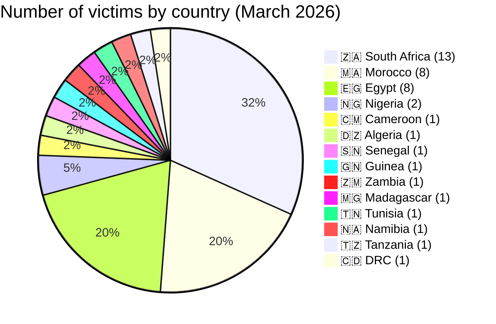
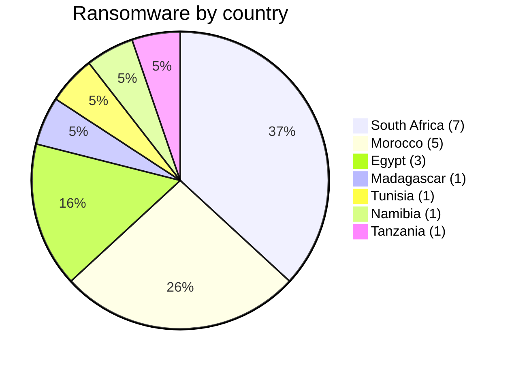
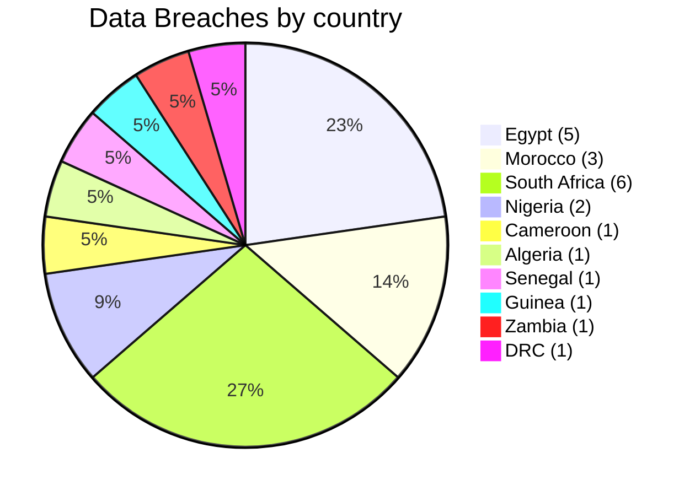
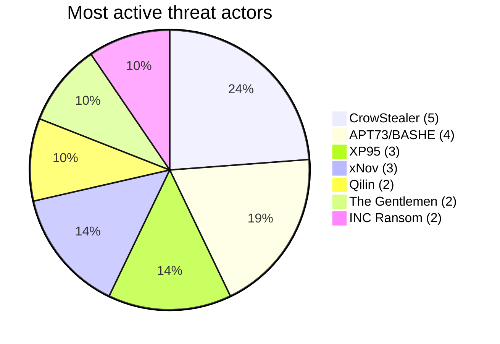
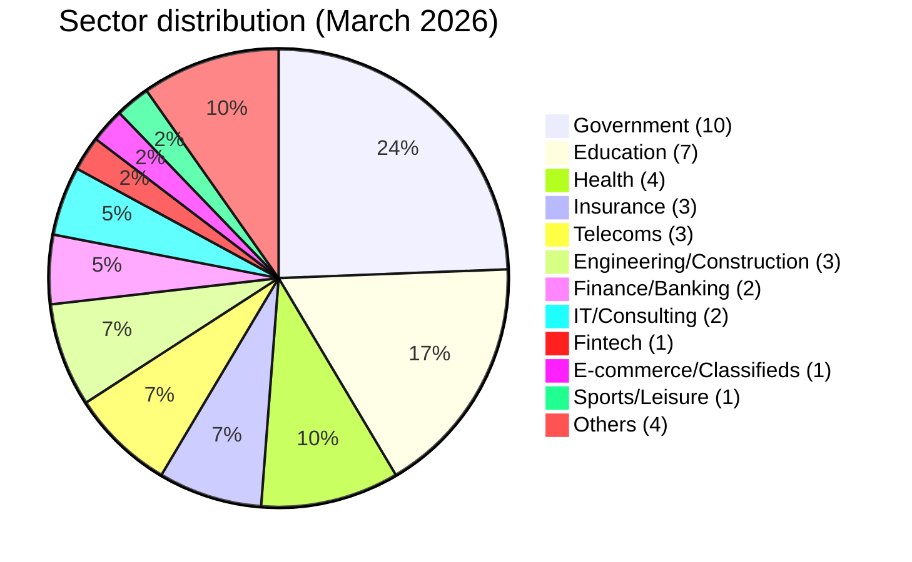

# CTI Report - Cyberattacks in Africa (March 2026)

👉🏾 [**French version available here**](./README_FR.md)
## 1. Executive summary

In March 2026, **41 cyber incidents** targeting African entities were publicly claimed or detected. The continent continues to face a dual threat: **ransomware** (encryption with ransom demand) and **data breaches / system intrusions** (exfiltration without encryption or direct financial fraud). Key findings:

- **19 ransomware attacks (46.3%)** and **22 data breaches / intrusions (53.7%)**.
- **14 countries** affected; **South Africa** (13 incidents), **Morocco** (8) and **Egypt** (8) account for 71% of all victims.
- **27 distinct threat actors**; **CrowStealer** (5 incidents), **APT73/BASHE** (4) and **XP95** (3) are the most active.
- **Government and education sectors** represent 39% of victims, highlighting a strategic focus on public institutions.
- Massive data leaks: Egyptian health ministry (3.8M records), Gauteng provincial government (3.8 TB), Remita Nigeria (3 TB), Stats SA (154 GB). In Morocco, several major breaches hit government institutions, including the Ministry of Justice (300 GB of court case files).
- New major incident: **UBA Senegal** - a coordinated cyber heist involving system compromise, database manipulation, and over 3,400 fraudulent ATM withdrawals totaling 1.143 billion FCFA (~$1.9M USD), disclosed in March but executed in late January.
- Emerging threats: **Loozap (Cameroon)** - 34,000 user accounts leaked (SHA1 passwords); **Guinea Ministry of Health** - suspected compromise of DHIS2 dashboards by actor Keymous.

## 📋 Victim list

👉🏾 [View full victim list](./victims.md)

## 2. Methodology

- **Scope**: 54 African countries.
- **Period**: 1 - 31 March 2026 (incidents disclosed or claimed during this month; actual attack dates may be earlier).
- **Sources**: Dark web, DLS (leak sites), OSINT, Telegram channels, underground forums, media reports.
- **Inclusion**: Publicly claimed or attributed incidents with identified victim, country, sector.
- **Typology**:
  - *Ransomware*: encryption + ransom demand (claim on DLS).
  - *Data breach / intrusion*: unencrypted exfiltration, database sold or published, or system compromise leading to financial fraud.

## 3. Global overview

| Indicator                     | Value |
|-------------------------------|-------|
| Total victims                 | 41    |
| Countries affected            | 14    |
| Distinct actors               | 27    |
| Ransomware incidents          | 19 (46.3%) |
| Data breaches / intrusions    | 22 (53.7%) |

**Most targeted countries:**
- 🇿🇦 South Africa: 13 victims
- 🇲🇦 Morocco: 8 victims
- 🇪🇬 Egypt: 8 victims
- 🇳🇬 Nigeria: 2 victims
- 🇨🇲 Cameroon: 1 victim
- 🇩🇿 Algeria: 1 victim
- 🇸🇳 Senegal: 1 victim
- 🇬🇳 Guinea: 1 victim
- 🇿🇲 Zambia: 1 victim
- 🇲🇬 Madagascar: 1 victim
- 🇹🇳 Tunisia: 1 victim
- 🇳🇦 Namibia: 1 victim
- 🇹🇿 Tanzania: 1 victim
- 🇨🇩 DRC: 1 victim

**Ransomware vs data breaches by country:**
| Country               | Ransomware | Data Breach |
|-----------------------|------------|-------------|
| South Africa          | 7          | 6           |
| Morocco               | 5          | 3           |
| Egypt                 | 3          | 5           |
| Nigeria               | 0          | 2           |
| Cameroon              | 0          | 1           |
| Algeria               | 0          | 1           |
| Senegal               | 0          | 1           |
| Guinea                | 0          | 1           |
| Zambia                | 0          | 1           |
| Madagascar            | 1          | 0           |
| Tunisia               | 1          | 0           |
| Namibia               | 1          | 0           |
| Tanzania              | 1          | 0           |
| DRC                   | 0          | 1           |

**Sector distribution:**
| Sector                    | Incidents | Percentage |
|---------------------------|-----------|------------|
| Government / Admin        | 10        | 24.4%      |
| Education / University    | 7         | 17.1%      |
| Health                    | 4         | 9.8%       |
| Insurance                 | 3         | 7.3%       |
| Telecommunications        | 3         | 7.3%       |
| Engineering/Construction  | 3         | 7.3%       |
| Finance / Banking         | 2         | 4.9%       |
| IT/Consulting             | 2         | 4.9%       |
| Fintech                   | 1         | 2.4%       |
| E-commerce / Classifieds  | 1         | 2.4%       |
| Sports / Leisure          | 1         | 2.4%       |
| Others                    | 4         | 9.8%       |

**Most prolific actors:**
| Actor            | Type            | Incidents | Primary targets |
|------------------|-----------------|-----------|-----------------|
| CrowStealer      | Data broker     | 5         | Egyptian government & education |
| APT73/BASHE      | Ransomware      | 4         | Moroccan state institutions |
| XP95             | Ransomware      | 3         | South African government |
| xNov             | Data breach     | 3         | Moroccan supply chain, South African sports |
| Qilin            | Ransomware      | 2         | Morocco, Madagascar |
| The Gentlemen    | Ransomware      | 2         | Tunisia, South Africa |
| INC Ransom       | Ransomware      | 2         | Namibia, South Africa |

## 4. Detailed analysis by incident type

### 4.1 Ransomware (19 incidents)

| Country          | Ransomware attacks | Main actors |
|------------------|--------------------|-------------|
| South Africa     | 7                  | XP95 (3), LockBit 5.0, Lynx, DragonForce, The Gentlemen, NightSpire, INC Ransom, Coinbase Cartel |
| Morocco          | 5                  | APT73/BASHE (3), Qilin, The Gentlemen |
| Egypt            | 3                  | Crypto24, PEAR, Payload |
| Madagascar       | 1                  | Qilin |
| Tunisia          | 1                  | The Gentlemen |
| Namibia          | 1                  | INC Ransom |
| Tanzania         | 1                  | Morpheus |

**Key observations**:
- **XP95** emerged as a major threat in South Africa, striking Gauteng provincial government (3.8 TB), Stats SA (154 GB) and GCRA (147 GB). Data is being sold, not just encrypted.
- **APT73/BASHE** targeted strategic Moroccan institutions (HACA, Maroc Telecom, 2M TV, IRES), suggesting possible geopolitical motivation.
- Insurance sector heavily hit in South Africa (Lion of Africa, The Unlimited).

### 4.2 Data Breaches / System Intrusions (22 incidents)

| Country          | Breaches/Intrusions | Main actors |
|------------------|---------------------|-------------|
| Egypt            | 5                   | CrowStealer (5) |
| South Africa     | 6                   | xNov (2), TelephoneHooliganism, Blackwinter99, XP95 |
| Morocco          | 3                   | xNov (2), anisanas2 |
| Nigeria          | 2                   | AshleyWood2022, Bytetobreach |
| Cameroon         | 1                   | zimablue |
| Algeria          | 1                   | Grubder |
| Senegal          | 1                   | Coordinated network |
| Guinea           | 1                   | Keymous |
| Zambia           | 1                   | Spirigatito |
| DRC              | 1                   | privillege |

**Key observations**:
- **CrowStealer** dominates Egyptian breaches, including a medical database of 3.8 million patients (Ministry of Health) sold for $2,500.
- **xNov** exposed student records (ONOUSC, 3,631 entries), L'Oréal Morocco supply chain data (296 pharmacies, 361,000 sales records, OAuth2 secrets), and Eventing South Africa (equestrian database).
- **UBA Senegal** (disclosed in March, executed in late January): attackers compromised the internal information system, manipulated databases (created/modified accounts, increased withdrawal limits, transferred funds), then coordinated over 3,400 ATM withdrawals across multiple cities in a few hours, netting 1.143 billion FCFA (~$1.9M). Potential exploited vulnerabilities: lack of real-time SOC monitoring, insufficient anti-fraud procedures, possible internal complicity.
- **Loozap (Cameroon)** - 34,000 user accounts leaked with SHA1‑hashed passwords, IP addresses, personal data.
- **Guinea Ministry of Health** - suspected compromise of DHIS2 dashboards by Keymous, exposing health surveillance tools and government email/staff records.
- Massive Nigerian breaches: Remita (3 TB, including KYC documents and government HSM keys) and Ahmadu Bello University (11,000+ staff records).

## 5. Sectoral Impact

| Sector                | Incidents | Percentage |
|-----------------------|-----------|------------|
| Government / Admin    | 10        | 24.4%      |
| Education / University| 7         | 17.1%      |
| Health                | 4         | 9.8%       |
| Insurance             | 3         | 7.3%       |
| Telecommunications    | 3         | 7.3%       |
| Engineering/Construction | 3      | 7.3%       |
| Finance / Banking     | 2         | 4.9%       |
| IT/Consulting         | 2         | 4.9%       |
| Fintech               | 1         | 2.4%       |
| E-commerce / Classifieds | 1      | 2.4%       |
| Sports / Leisure      | 1         | 2.4%       |
| Others                | 4         | 9.8%       |

**Takeaways**:
- Public sector (government + education) accounts for **41.5%** of all incidents.
- Health data remains highly valued: Egyptian health ministry breach (3.8M records), South African insurance leaks, Guinea health ministry compromise.
- Telecoms (Orange Madagascar, Maroc Telecom) are strategic targets.
- The UBA Senegal incident highlights a new trend: **direct financial fraud through system compromise**, bypassing traditional ransomware.
- E‑commerce platforms (Loozap) are increasingly targeted for user credential theft.

## 6. Threat actor profile

| Actor            | Type            | Incidents | Primary targets |
|------------------|-----------------|-----------|-----------------|
| CrowStealer      | Data broker     | 5         | Egyptian government & education |
| APT73/BASHE      | Ransomware      | 4         | Moroccan state institutions |
| XP95             | Ransomware      | 3         | South African government |
| xNov             | Data breach     | 3         | Moroccan supply chain, South African sports, education |
| Qilin            | Ransomware      | 2         | Morocco, Madagascar |
| The Gentlemen    | Ransomware      | 2         | Tunisia, South Africa |
| INC Ransom       | Ransomware      | 2         | Namibia, South Africa |

**Emerging actors**: xNov (supply chain focus), XP95 (South African government targeting), zimablue (Cameroon e‑commerce), Keymous (West African health ministries), Grubder (Algerian tech sector).

### 6.1 Risk assessment

| Country | Risk Level |
|--------|-----------|
| South Africa | 🔴 Critical |
| Morocco | 🔴 High |
| Egypt | 🔴 High |
| Nigeria | 🟠 Medium-High |
| Senegal | 🟠 Medium (post-UBA) |
| Cameroon | 🟠 Medium (emerging) |
| Guinea | 🟠 Medium |
| Others | 🟠 Medium |

## 7. Key trends & intelligence gaps

### Trends
1. **Ransomware evolves into data extortion** - XP95 and others sell exfiltrated data instead of merely encrypting.
2. **Supply chain attacks** - Smarteez (L'Oréal Morocco provider) shows vulnerability of digital service providers.
3. **Massive health data leaks** - Egyptian health ministry breach (3.8M records) highlights poor security in public health IT.
4. **Geopolitical targeting** - APT73/BASHE focus on Moroccan state media and telecoms.
5. **Direct financial fraud via system compromise** - UBA Senegal demonstrates that attackers bypass ransomware to go straight for the money, exploiting weak SOC and anti-fraud controls.
6. **E‑commerce credential theft** - Loozap (Cameroon) leak of 34,000 accounts with weak SHA1 hashing.

### Gaps
- Many attacks go undetected or unreported; this list only includes publicly disclosed incidents.
- Actual data volumes may be inflated by actors.
- The UBA Senegal attack was executed in late January but only disclosed in March - significant delay in public awareness.
- Guinea’s Ministry of Health compromise remains partially confirmed (correlated access, not full disclosure).

## 8. MITRE ATT&CK Mapping (Contextual)

| Incident | Techniques |
|---------|-----------|
| Smarteez | T1552 - Credentials in Files |
| Gauteng | T1041 - Exfiltration |
| ONOUSC | T1078 - Valid Accounts |
| Egypt Health DB | T1005 - Data from Local System |
| UBA Senegal | T1190 - Exploit Public-Facing App, T1078 - Valid Accounts, T1048 - Exfiltration over Alternative Protocol, T1531 - Account Manipulation |
| Loozap | T1190 - Exploit Public-Facing App, T1005 - Data from Local System (weak SHA1 storage) |
| Guinea Health | T1190, T1078 (suspected) |

**Common techniques observed**:
- T1566 - Phishing  
- T1190 - Exploit Public-Facing Application  
- T1041 - Exfiltration  
- T1078 - Valid Accounts  
- T1486 - Ransomware  
- T1531 - Account Manipulation (UBA Senegal)

## 9. Recommendations

### For African governments and enterprises
- **Database security**: Encrypt sensitive data, implement access controls, regular audits.
- **Third-party risk management**: Audit digital service providers, enforce cybersecurity clauses.
- **Incident response**: Offline backups, tabletop exercises, communication protocols.
- **Staff training**: Phishing awareness (primary initial vector).
- **Real-time monitoring**: Deploy or strengthen Security Operations Centers (SOC) with 24/7 capability; implement transaction anomaly detection (especially for financial institutions).
- **Anti-fraud mechanisms**: Dynamic withdrawal limits, automatic blocking on abnormal patterns, behavioral analysis.
- **Password security**: Enforce strong hashing (bcrypt, Argon2) instead of SHA1; implement MFA for all user accounts.

### For CTI analysts
- Monitor **XP95**, **xNov**, **zimablue**, **Keymous** for new campaigns.
- Track supply chain exposures (especially digital marketing and logistics providers).
- Prioritize monitoring of government, education, and health sectors in North, West, and Southern Africa.
- Watch for **non-ransomware financial intrusions** - UBA Senegal is likely not an isolated case.

## 10. SOC Recommendations

### Detection priorities
- Monitor **data exfiltration patterns (T1041)**  
- Detect **privileged account abuse (T1078)**  
- Track **API / OAuth misuse**  
- Analyze **outbound traffic anomalies**  
- For banks: implement **real-time ATM transaction anomaly detection** (velocity, location, amount spikes)

### Monitoring sources
- EDR / Sysmon  
- Firewall / Proxy  
- DNS logs  
- Identity logs  
- Core banking system logs (for financial institutions)

## 11. Strategic Recommendations

- Enforce **MFA on all critical systems**  
- Implement **network segmentation** (separate ATM network from core banking)  
- Audit **third-party providers**  
- Maintain **offline backups**  
- Conduct **incident response exercises** including red-team simulations  
- **Regulatory push**: Central banks should mandate minimum SOC and fraud detection standards for financial institutions

## 12. Conclusion

March 2026 confirms that **Africa is a prime target for industrialized cybercrime**. The convergence of ransomware groups, data brokers, supply chain attacks, direct financial intrusions (UBA Senegal), and e‑commerce credential theft (Loozap) creates a high-risk environment. South Africa, Morocco, and Egypt remain the most affected, but **West and Central Africa are emerging as new hotspots** (Senegal, Cameroon, Guinea). Health ministries are increasingly targeted, as seen in Egypt and Guinea. Financial institutions and e‑commerce platforms must urgently strengthen real-time monitoring, anti-fraud capabilities, and password security. AFRINTEL will continue tracking these trends.

**AFRINTEL** - African Cyber Threat Intelligence 
[GitHub AFRINTEL](https://github.com/Hatchepsoute/AFRINTEL)
