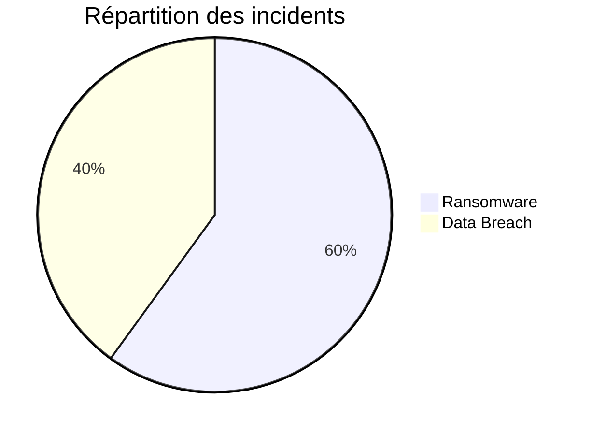
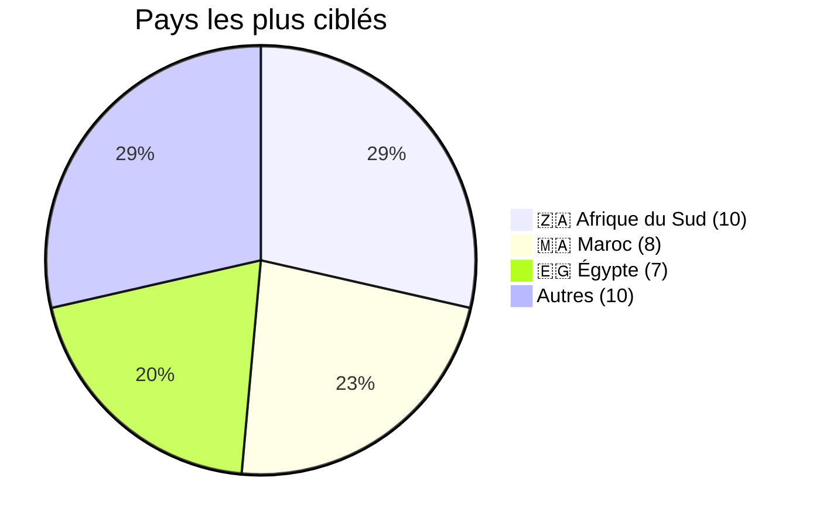
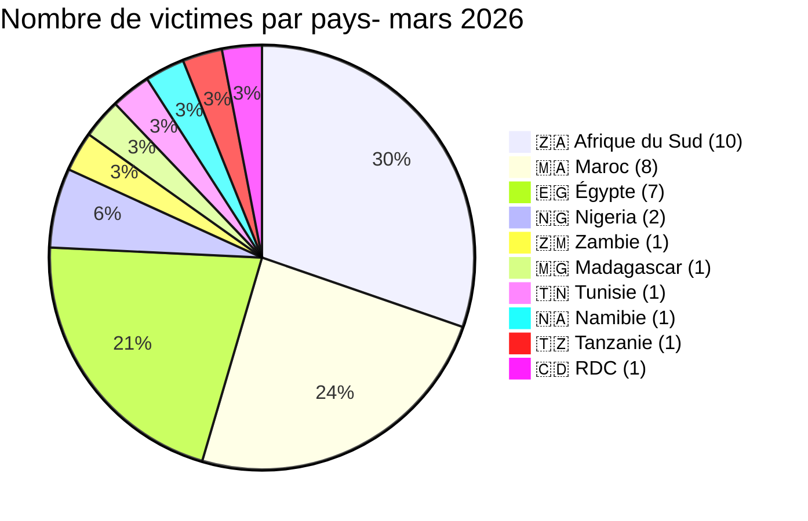
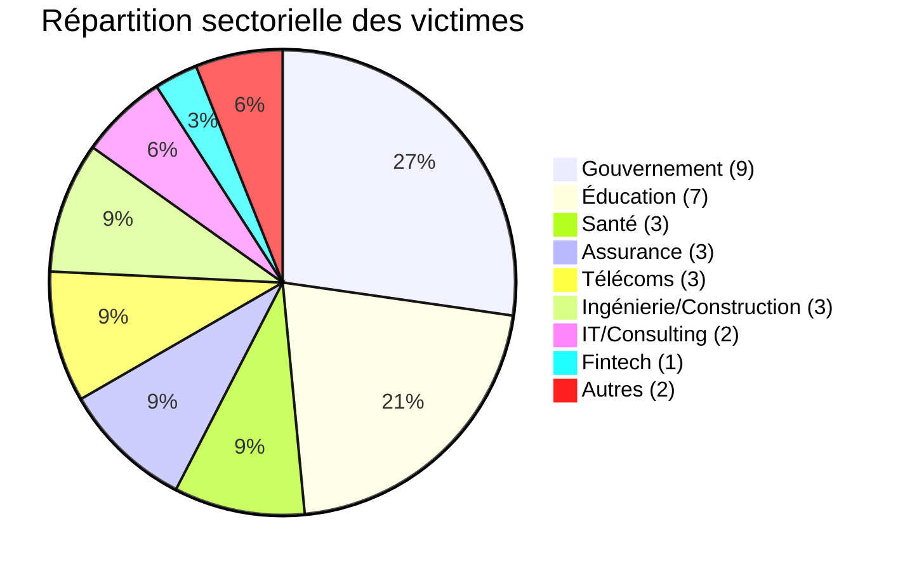
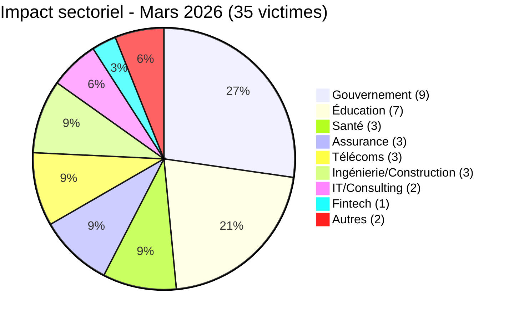
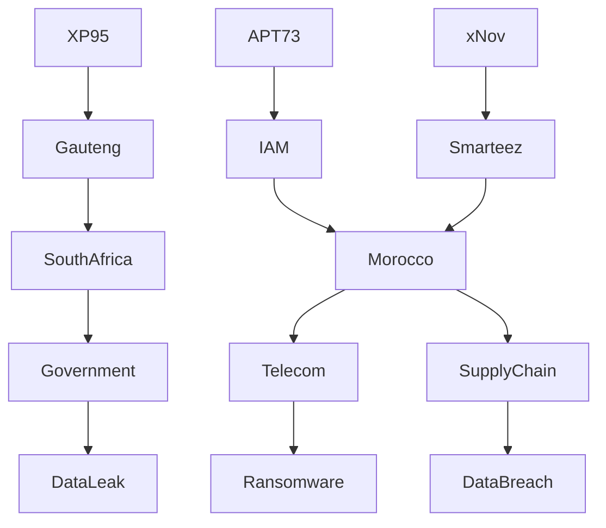
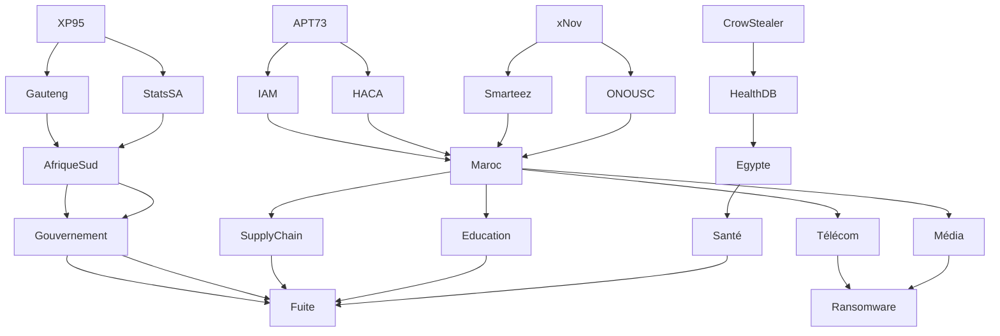

[](https://github.com/Hatchepsoute/AFRINTEL)


# Rapport CTI - Cyberattaques en Afrique (Mars 2026)
👉🏾 [**English version available here**](./README.md)
## 1. Synthèse exécutive

En mars 2026, **35 incidents cyber** ciblant des entités africaines ont été revendiqués ou détectés publiquement. Le continent fait face à une double menace : **ransomware** (chiffrement avec rançon) et **fuites de données** (exfiltration sans chiffrement). Principales conclusions :

- **21 attaques de ransomware (60 %)** et **14 fuites de données (40 %)**.
- **10 pays touchés** ; **Afrique du Sud** (10 incidents), **Maroc** (8) et **Égypte** (7) représentent 71 % des victimes.
- **22 acteurs distincts** ; **CrowStealer** (5 incidents), **APT73/BASHE** (4) et **XP95** (3) sont les plus actifs.
- **Secteurs gouvernemental et éducatif** : 46 % des victimes, montrant un ciblage stratégique des institutions publiques.
- Fuites massives : ministère de la Santé égyptien (3,8 M d’enregistrements), province de Gauteng (3,8 To), Remita Nigeria (3 To), Stats SA (154 Go).
## 📋 Liste des victimes

👉🏾 [Voir la liste complète des victimes](./victims_FR.md)
## 2. Méthodologie

- **Périmètre** : 54 pays africains.
- **Période** : 1er - 31 mars 2026.
- **Sources** : DLS (sites de fuite), OSINT, canaux Telegram, forums underground.
- **Inclusion** : incidents publiquement revendiqués ou attribués avec victime, pays et secteur identifiés.
- **Typologie** :
  - *Ransomware* : chiffrement + rançon (revendication sur DLS).
  - *Fuite de données* : exfiltration non chiffrée, base de données vendue ou publiée.

## 3. Vue d’ensemble

| Indicateur                     | Valeur |
|--------------------------------|--------|
| Nombre total de victimes       | 35     |
| Pays touchés                   | 10     |
| Acteurs distincts              | 22     |
| Incidents de ransomware        | 21 (60 %) |
| Fuites de données              | 14 (40 %) |

**Pays les plus ciblés :**
- 🇿🇦 Afrique du Sud : 10 victimes
- 🇲🇦 Maroc : 8 victimes
- 🇪🇬 Égypte : 7 victimes



**Répartition par pays :**
- 🇿🇦 Afrique du Sud : 10
- 🇲🇦 Maroc : 8
- 🇪🇬 Égypte : 7
- 🇳🇬 Nigeria : 2
- 🇿🇲 Zambie : 1
- 🇲🇬 Madagascar : 1
- 🇹🇳 Tunisie : 1
- 🇳🇦 Namibie : 1
- 🇹🇿 Tanzanie : 1
- 🇨🇩 RDC : 1



**Comparaison ransomware vs fuites par pays :**
| Pays                  | Ransomware | Fuites de données |
|-----------------------|------------|-------------------|
| 🇿🇦 Afrique du Sud     | 10         | 2                 |
| 🇲🇦 Maroc              | 5          | 3                 |
| 🇪🇬 Égypte             | 3          | 5                 |
| 🇳🇬 Nigeria            | 0          | 2                 |
| 🇿🇲 Zambie             | 0          | 1                 |
| 🇲🇬 Madagascar         | 1          | 0                 |
| 🇹🇳 Tunisie            | 1          | 0                 |
| 🇳🇦 Namibie            | 1          | 0                 |
| 🇹🇿 Tanzanie           | 1          | 0                 |
| 🇨🇩 RDC                | 0          | 1                 |

```mermaid
xychart-beta
    title "Ransomware vs Fuites de données par pays"
    x-axis ["🇿🇦 Afrique Sud", "🇲🇦 Maroc", "🇪🇬 Égypte", "🇳🇬 Nigeria", "🇿🇲 Zambie", "🇲🇬 Madagascar", "🇹🇳 Tunisie", "🇳🇦 Namibie", "🇹🇿 Tanzanie", "🇨🇩 RDC"]
    y-axis "Nombre d'incidents" 0 to 12
    bar [10, 5, 3, 0, 0, 1, 1, 1, 1, 0]
    bar [2, 3, 5, 2, 1, 0, 0, 0, 0, 1]
```


```mermaid
xychart-beta
    title "Ransomware vs Fuites de données par pays"
    x-axis ["Afrique Sud", "Maroc", "Égypte", "Nigeria", "Zambie", "Madagascar", "Tunisie", "Namibie", "Tanzanie", "RDC"]
    y-axis "Incidents" 0 to 12
    line [10, 5, 3, 0, 0, 1, 1, 1, 1, 0]
    line [2, 3, 5, 2, 1, 0, 0, 0, 0, 1]
```

**Répartition sectorielle :**
| Secteur                    | Incidents | Pourcentage |
|----------------------------|-----------|-------------|
| Gouvernement / Admin       | 9         | 26 %        |
| Éducation / Université     | 7         | 20 %        |
| Santé                      | 3         | 9 %         |
| Assurance                  | 3         | 9 %         |
| Télécommunications         | 3         | 9 %         |
| Ingénierie/Construction    | 3         | 9 %         |
| IT/Consulting              | 2         | 6 %         |
| Fintech                    | 1         | 3 %         |
| Autres                     | 2         | 6 %         |



**Acteurs les plus prolifiques :**
| Acteur           | Type           | Incidents | Cibles principales |
|------------------|----------------|-----------|---------------------|
| CrowStealer      | Courtier de données | 5    | Gouvernement et éducation égyptiens |
| APT73/BASHE      | Ransomware     | 4         | Institutions d’État marocaines |
| XP95             | Ransomware     | 3         | Gouvernement sud-africain |
| Qilin            | Ransomware     | 2         | Maroc, Madagascar |
| The Gentlemen    | Ransomware     | 2         | Tunisie, Afrique du Sud |
| INC Ransom       | Ransomware     | 2         | Namibie, Afrique du Sud |
| xNov             | Fuite de données | 2       | Supply chain marocaine |

```mermaid
xychart-beta
    title "Acteurs les plus actifs"
    x-axis ["CrowStealer", "APT73/BASHE", "XP95", "Qilin", "The Gentlemen", "INC Ransom", "xNov"]
    y-axis "Incidents" 0 to 6
    bar "Incidents" [5, 4, 3, 2, 2, 2, 2]
```

## 4. Analyse détaillée par type d’incident

### 4.1 Ransomware (21 incidents)

| Pays             | Attaques ransomware | Acteurs principaux |
|------------------|---------------------|---------------------|
| Afrique du Sud   | 10                  | XP95 (3), LockBit 5.0, Lynx, DragonForce, The Gentlemen, NightSpire, INC Ransom, Coinbase Cartel |
| Maroc            | 5                   | APT73/BASHE (3), Qilin, The Gentlemen |
| Égypte           | 3                   | Crypto24, PEAR, Payload |
| Madagascar       | 1                   | Qilin |
| Tunisie          | 1                   | The Gentlemen |
| Namibie          | 1                   | INC Ransom |
| Tanzanie         | 1                   | Morpheus |

```mermaid
xychart-beta
    title "Ransomware - Nombre d'attaques par pays"
    x-axis ["🇿🇦 Afrique du Sud", "🇲🇦 Maroc", "🇪🇬 Égypte", "🇲🇬 Madagascar", "🇹🇳 Tunisie", "🇳🇦 Namibie", "🇹🇿 Tanzanie"]
    y-axis "Attaques" 0 to 12
    bar [10, 5, 3, 1, 1, 1, 1]
```

**Observations clés** :
- **XP95** est devenu une menace majeure en Afrique du Sud : gouvernement de Gauteng (3,8 To), Stats SA (154 Go) et GCRA (147 Go). Les données sont vendues, pas seulement chiffrées.
- **APT73/BASHE** a ciblé des institutions stratégiques marocaines (HACA, Maroc Telecom, 2M TV, IRES), suggérant une motivation géopolitique.
- Le secteur des assurances lourdement touché en Afrique du Sud (Lion of Africa, The Unlimited).

### 4.2 Fuites de données (14 incidents)

| Pays             | Fuites | Acteurs principaux |
|------------------|--------|---------------------|
| Égypte           | 5      | CrowStealer (5) |
| Maroc            | 3      | xNov (2), anisanas2 |
| Afrique du Sud   | 2      | TelephoneHooliganism, XP95 (déjà compté dans ransomware) |
| Nigeria          | 2      | AshleyWood2022, Bytetobreach |
| Zambie           | 1      | Spirigatito |
| RDC              | 1      | privillege |

```mermaid
xychart-beta
    title "Fuites de données - Nombre par pays"
    x-axis ["🇪🇬 Égypte", "🇲🇦 Maroc", "🇿🇦 Afrique du Sud", "🇳🇬 Nigeria", "🇿🇲 Zambie", "🇨🇩 RDC"]
    y-axis "Fuites" 0 to 6
    bar [5, 3, 2, 2, 1, 1]
```

**Observations clés** :
- **CrowStealer** domine les fuites égyptiennes, y compris une base de données médicale de 3,8 millions de patients (ministère de la Santé) vendue 2 500 $.
- **xNov** a exposé des dossiers étudiants (ONOUSC, 3 631 entrées) et les données supply chain de L’Oréal Maroc (296 pharmacies, 361 000 ventes, secrets OAuth2).
- Fuites massives au Nigeria : Remita (3 To, incluant documents KYC et clés HSM gouvernementales) et université Ahmadu Bello (11 000+ dossiers).

## 5. Impact sectoriel

| Secteur                  | Incidents | Pourcentage |
|--------------------------|-----------|-------------|
| Gouvernement / Admin     | 9         | 26 %        |
| Éducation / Université   | 7         | 20 %        |
| Santé                    | 3         | 9 %         |
| Assurance                | 3         | 9 %         |
| Télécommunications       | 3         | 9 %         |
| Ingénierie/Construction  | 3         | 9 %         |
| IT/Consulting            | 2         | 6 %         |
| Fintech                  | 1         | 3 %         |
| Autres                   | 2         | 6 %         |



**Enseignements** :
- Le secteur public (gouvernement + éducation) représente **46 %** des incidents.
- Les données de santé restent très valorisées : fuite du ministère de la Santé égyptien (3,8 M d’enregistrements) et fuites d’assurances sud-africaines.
- Les télécoms (Orange Madagascar, Maroc Telecom) sont des cibles stratégiques.

## 6. Profil des acteurs

| Acteur           | Type           | Incidents | Cibles principales |
|------------------|----------------|-----------|---------------------|
| CrowStealer      | Courtier de données | 5    | Gouvernement et éducation égyptiens |
| APT73/BASHE      | Ransomware     | 4         | Institutions d’État marocaines |
| XP95             | Ransomware     | 3         | Gouvernement sud-africain |
| Qilin            | Ransomware     | 2         | Maroc, Madagascar |
| The Gentlemen    | Ransomware     | 2         | Tunisie, Afrique du Sud |
| INC Ransom       | Ransomware     | 2         | Namibie, Afrique du Sud |
| xNov             | Fuite de données | 2       | Supply chain marocaine |

**Acteurs émergents** : xNov (ciblage de la supply chain), XP95 (gouvernement sud-africain).


### 6.1. Niveau de risque

| Pays | Risque |
|------|--------|
| Afrique du Sud | 🔴 Critique |
| Maroc | 🔴 Élevé |
| Égypte | 🔴 Élevé |
| Autres | 🟠 Moyen |

## 7. Tendances clés et lacunes de renseignement

### Tendances
1. **Évolution des ransomwares** - XP95 et d’autres vendent les données exfiltrées plutôt que de simplement chiffrer.
2. **Attaques de la supply chain** - Smarteez (prestataire de L’Oréal Maroc) montre la vulnérabilité des sous-traitants digitaux.
3. **Fuites massives de données de santé** - Ministère de la Santé égyptien (3,8 M d’enregistrements) révèle des failles dans la sécurité des systèmes publics.
4. **Ciblage géopolitique** - APT73/BASHE concentré sur les médias et télécoms d’État marocains.

## 8. Mapping MITRE ATT&CK

| Incident | Techniques |
|----------|-----------|
| Smarteez | T1552 |
| Gauteng | T1041 |
| ONOUSC | T1078 |
| Santé Égypte | T1005 |

Techniques observées :
- T1566 - Phishing  
- T1190 - Exploitation web  
- T1041 - Exfiltration  
- T1078 - Comptes valides  
- T1486 - Ransomware  

## 9. Recommandations

### Pour les gouvernements et entreprises africains
- **Sécurité des bases de données** : chiffrement des données sensibles, contrôles d’accès, audits réguliers.
- **Gestion des risques tiers** : auditer les prestataires de services digitaux, imposer des clauses de cybersécurité.
- **Réponse aux incidents** : sauvegardes hors ligne, exercices de simulation, protocoles de communication.
- **Formation des utilisateurs** : sensibilisation au phishing (vecteur initial principal).
- **Partage d’information** : rejoindre des communautés CTI (AFRINTEL, CyberDef Africa).

### Pour les analystes CTI
- Surveiller **XP95** et **xNov** pour de nouvelles campagnes.
- Cartographier les expositions de la supply chain (notamment marketing digital et logistique).
- Prioriser la surveillance des secteurs gouvernemental, éducatif et de la santé en Afrique du Nord et australe.


## 10. Recommandations SOC

- Détection exfiltration (T1041)  
- Surveillance comptes privilégiés  
- Analyse trafic sortant  
- Monitoring API / OAuth  

## 11. Recommandations stratégiques

- Activer MFA  
- Segmenter le réseau  
- Auditer les prestataires  
- Maintenir des sauvegardes offline  
- Effectuer des exercices de crise  

---

## 12. Conclusion

➡️ L’Afrique devient une cible stratégique cyber  

La convergence :
- ransomware  
- revente de données  
- supply chain  

…crée un **écosystème cyber à haut risque**

---
### Carte écosystème AFRINTEL


**AFRINTEL** - Cyber Threat Intelligence africaine  
 
[GitHub AFRINTEL](https://github.com/Hatchepsoute/AFRINTEL)
