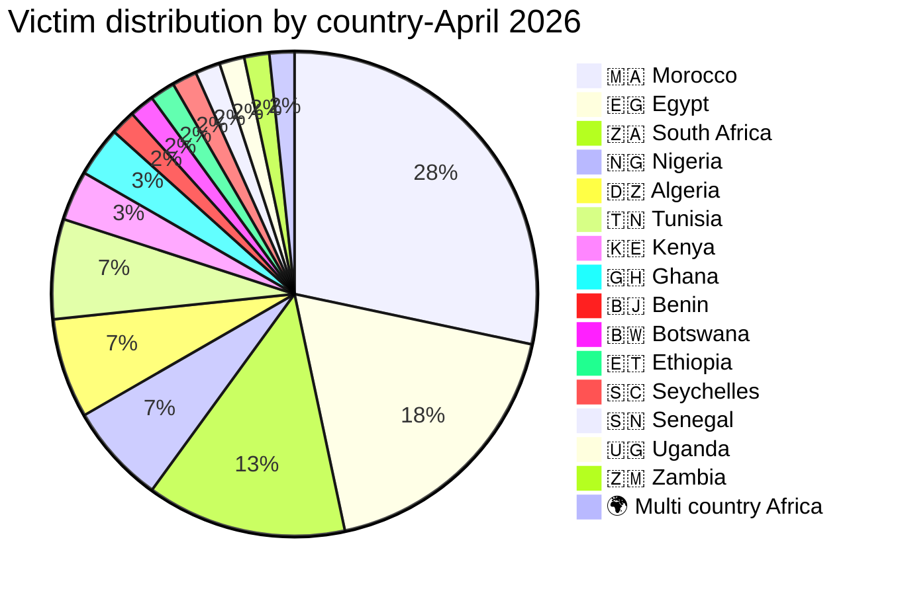
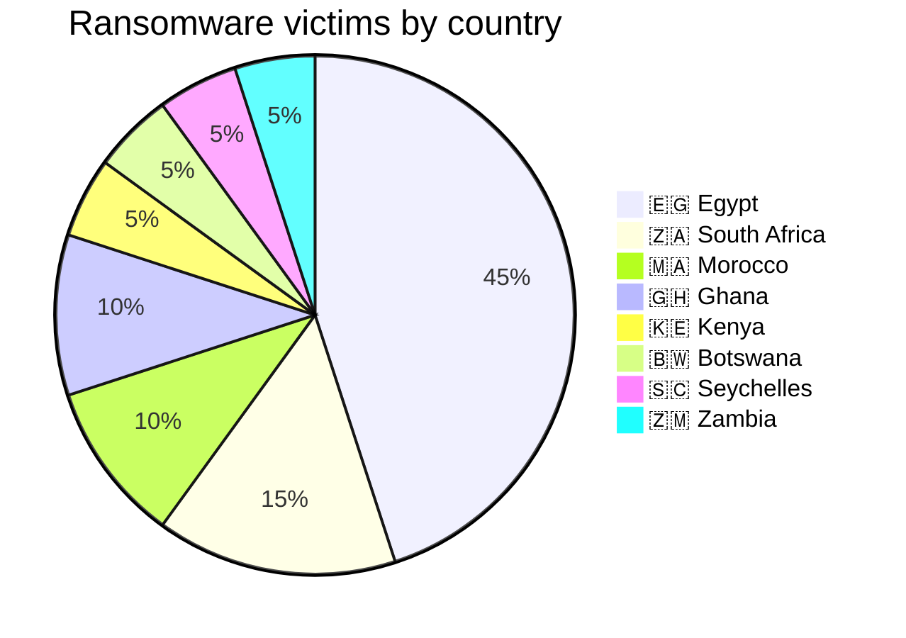
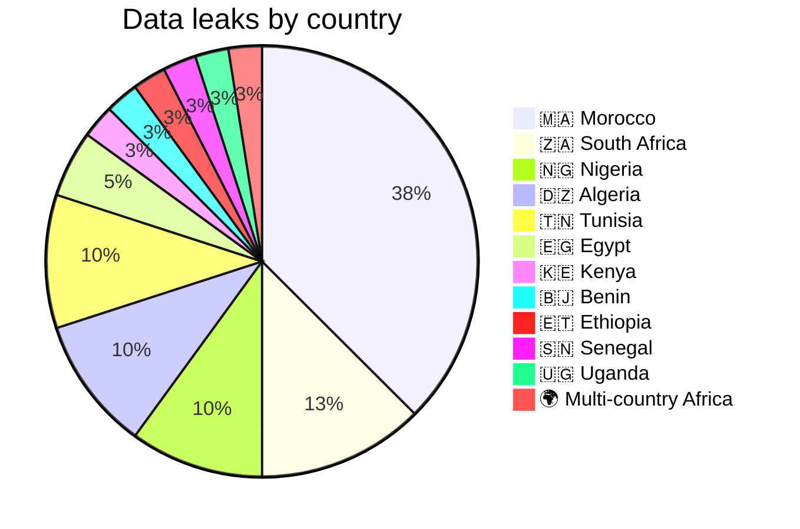
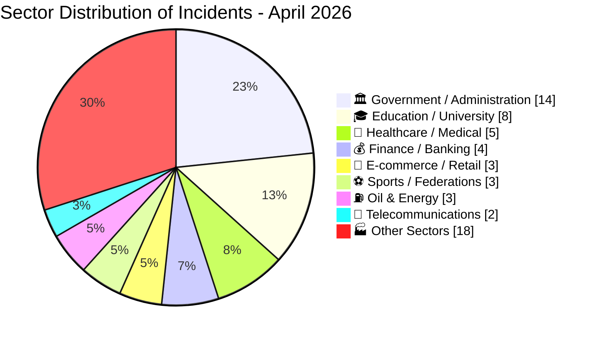
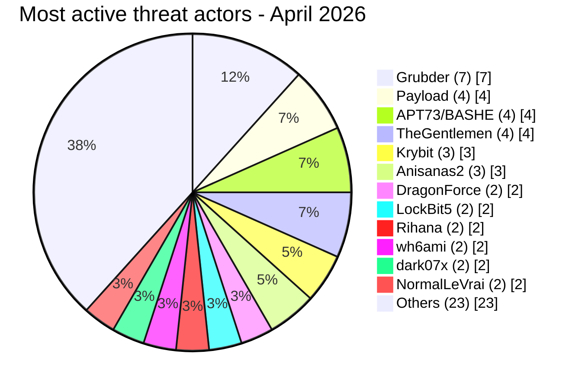

# CTI Report - Cyberattacks in Africa (April 2026)

👉🏾 [**French version available here**](./README_FR.md)

## 1. Executive summary

April 2026 recorded **60 publicly claimed cyber incidents** across Africa - **20 ransomware attacks** and **40 data leaks / access sales**. The threat landscape intensified with a surge in data broker activity, highly sensitive database exposures (royal staff, identity documents, medical records), and targeted access sales against government infrastructure. Ransomware groups **payload**, **apt73/bashe**, **thegentlemen**, and **krybit** maintained pressure, while data‑leak actors **Grubder**, **anisanas2**, **dark07x**, **wh6ami**, and **Rihana** dominated the underground market.

Key findings:
- **20 ransomware attacks (33.3%)** and **40 data leaks / access sales (66.7%)**.
- **18 countries** affected; **Morocco** (17 incidents), **Egypt** (11), **South Africa** (8) account for 60% of victims.
- **30+ distinct threat actors**; prolific data brokers **Grubder** (7 victims) and **anisanas2** (3 victims) lead.
- Government, education, and healthcare remain prime targets (combined 45%).
- Massive breaches: Royal Palace staff DB (3,300 records with CNIE), Pick n Pay ASAP/Bottles.com (full payment cards, GPS), Kenya Airports Authority (claimed 2 TB), CNSS Benin mailbox leak (7.1 GB).

### 📋 Victim list

👉🏾 [View full victim list](./victims.md)

## 2. Methodology

- **Scope**: 54 African countries.
- **Period**: 1-30 April 2026 (incidents disclosed or claimed during this month; actual attack dates may be earlier).
- **Sources**: Dark web, DLS (leak sites), OSINT, Telegram channels, underground forums.
- **Inclusion**: Publicly claimed or attributed incidents with identified victim, country, sector.
- **Typology**:
  - *Ransomware*: encryption + ransom demand.
  - *Data leak / access sale*: exfiltration without encryption, database sold/published, or access sale to compromised systems.

## 3. Global overview

| Indicator                  | Value |
|----------------------------|-------|
| Total victims              | 60    |
| Countries affected         | 18    |
| Distinct actors            | 30+   |
| Ransomware incidents       | 20 (33.3%) |
| Data leaks / access sales  | 40 (66.7%) |

### Country ranking

**All incidents combined (60):**
| Rank | Country | Incidents |
|------|--------|-----------|
| 1 | 🇲🇦 Morocco | 17 |
| 2 | 🇪🇬 Egypt | 11 |
| 3 | 🇿🇦 South Africa | 8 |
| 4-6 | 🇳🇬 Nigeria, 🇩🇿 Algeria, 🇹🇳 Tunisia | 4 each |
| 7-8 | 🇰🇪 Kenya, 🇬🇭 Ghana | 2 each |
| 9-15 | 🇧🇯 Benin, 🇧🇼 Botswana, 🇪🇹 Ethiopia, 🇸🇨 Seychelles, 🇸🇳 Senegal, 🇺🇬 Uganda, 🇿🇲 Zambia | 1 each |
| – | 🌍 Multi‑country incident (Angola, South Africa, Nigeria) | 1 (counted as 1 victim) |

**By ransomware (20):**
| Rank | Country | Ransomware |
|------|--------|------------|
| 1 | 🇪🇬 Egypt | 9 |
| 2 | 🇿🇦 South Africa | 3 |
| 3-4 | 🇲🇦 Morocco, 🇬🇭 Ghana | 2 each |
| 5-8 | 🇰🇪 Kenya, 🇧🇼 Botswana, 🇸🇨 Seychelles, 🇿🇲 Zambia | 1 each |

**By data leaks (40):**
| Rank | Country | Data leaks |
|------|--------|------------|
| 1 | 🇲🇦 Morocco | 15 |
| 2 | 🇿🇦 South Africa | 5 |
| 3-5 | 🇳🇬 Nigeria, 🇩🇿 Algeria, 🇹🇳 Tunisia | 4 each |
| 6 | 🇪🇬 Egypt | 2 |
| 7-11 | 🇰🇪 Kenya, 🇧🇯 Benin, 🇪🇹 Ethiopia, 🇸🇳 Senegal, 🇺🇬 Uganda | 1 each |
| – | 🌍 Multi‑country Africa | 1 |

**Most targeted countries:**
- 🇲🇦 Morocco: 17 victims
- 🇪🇬 Egypt: 11 victims
- 🇿🇦 South Africa: 8 victims
- 🇳🇬 Nigeria: 4 victims
- 🇩🇿 Algeria: 4 victims
- 🇹🇳 Tunisia: 4 victims
- 🇰🇪 Kenya: 2 victims
- 🇬🇭 Ghana: 2 victims
- Others (1 victim each): Senegal, Benin, Ethiopia, Botswana, Seychelles, Zambia, Uganda, plus 1 multi‑country incident (Angola/South Africa/Nigeria).

### Ransomware vs data leaks by country

| Country               | Ransomware | Data Leaks |
|-----------------------|------------|-------------|
| 🇲🇦 Morocco           | 2          | 15          |
| 🇪🇬 Egypt             | 9          | 2           |
| 🇿🇦 South Africa      | 3          | 5           |
| 🇳🇬 Nigeria           | 0          | 4           |
| 🇩🇿 Algeria           | 0          | 4           |
| 🇹🇳 Tunisia           | 0          | 4           |
| 🇰🇪 Kenya             | 1          | 1           |
| 🇬🇭 Ghana             | 2          | 0           |
| 🇧🇯 Benin             | 0          | 1           |
| 🇧🇼 Botswana          | 1          | 0           |
| 🇪🇹 Ethiopia          | 0          | 1           |
| 🇸🇨 Seychelles        | 1          | 0           |
| 🇸🇳 Senegal           | 0          | 1           |
| 🇺🇬 Uganda            | 0          | 1           |
| 🇿🇲 Zambia            | 1          | 0           |
| 🌍 Multi-country Africa | 0        | 1           |
| **Total**             | **20**     | **40**      |

### Targeted sectors by country

| Country | Main targeted sectors |
|---------|----------------------|
| 🇩🇿 Algeria | Government (2), Insurance, Sports |
| 🇧🇯 Benin | Government |
| 🇧🇼 Botswana | Education |
| 🇪🇬 Egypt | Education (2), Finance, Energy (2), Automotive, Engineering, Manufacturing, Construction |
| 🇪🇹 Ethiopia | Energy |
| 🇬🇭 Ghana | Health, Finance |
| 🇰🇪 Kenya | Government, Aviation |
| 🇲🇦 Morocco | Government (2), Education (3), Health (3), Finance (2), Sports (3), Digital identity, Services, Agribusiness, Personal data |
| 🇳🇬 Nigeria | Government (3), NGO (1) + multi‑country government access |
| 🇸🇳 Senegal | Government |
| 🇸🇨 Seychelles | Government |
| 🇿🇦 South Africa | E‑commerce (2), Government (2), Education, Telecoms, Tourism, Agribusiness + multi‑country government access |
| 🇹🇳 Tunisia | E‑commerce, Education, Services, Social network |
| 🇺🇬 Uganda | Government |
| 🇿🇲 Zambia | Insurance |
| 🇦🇴 Angola | Multi‑country government access (combined incident) |

*Numbers in parentheses indicate the number of incidents when >1.*

**Ransomware victims by country - April 2026**

**Data leaks by country - April 2026**

**Sector distribution:**
| Sector                    | Incidents | Percentage |
|---------------------------|-----------|------------|
| Government / Admin        | 14        | 23.3%      |
| Education / University    | 8         | 13.3%      |
| Health / Medical          | 5         | 8.3%       |
| Finance / Banking         | 4         | 6.7%       |
| E-commerce / Retail       | 3         | 5.0%       |
| Sports / Federations      | 3         | 5.0%       |
| Oil & Energy              | 3         | 5.0%       |
| Telecommunications        | 2         | 3.3%       |
| Others                    | 18        | 30.0%      |

### Most prolific threat actors

|Threat Actor / Group  | Number of Incidents | Dominant activity type        |
|----------------------|--------------------|----------------------|
| Grubder              | 7                  | Data leaks    |
| Payload              | 4                  | Ransomware           |
| APT73 / BASHE        | 4                  | Ransomware           |
| TheGentlemen         | 4                  | Ransomware           |
| Krybit               | 3                  | Ransomware           |
| Anisanas2            | 3                  | Data leaks    |
| DragonForce          | 2                  | Ransomware           |
| LockBit5             | 2                  | Ransomware           |
| Rihana               | 2                  | Data leaks    |
| wh6ami               | 2                  | Data leaks    |
| dark07x              | 2                  | Data leaks    |
| NormalLeVrai         | 2                  | Data leaks    |

*Among the actors having carried out a single incident are notably Nullsec/0xLei, MDGhost, RubiconH4ck, Keymous, xNov, superduper1, w00l_ysh1, BlueEx, Sejjil, forrest, mecrobyte, and others (see the complete list of victims).*

## 4. Detailed analysis by incident type

### 4.1 Ransomware (20 incidents)

| Country          | Attacks | Main actors |
|------------------|---------|-------------|
| Egypt            | 9       | payload (4), dragonforce, lockbit5, thegentlemen, apt73/bashe |
| South Africa     | 3       | dragonforce, krybit, thegentlemen |
| Morocco          | 2       | worldleaks, lockbit5 |
| Ghana            | 2       | thegentlemen, apt73/bashe |
| Kenya            | 1       | apt73/bashe |
| Botswana         | 1       | krybit |
| Seychelles       | 1       | apt73/bashe |
| Zambia           | 1       | krybit |

**Key observations:**
- ransomware group **payload** hammered Egyptian economic sectors (finance, oil, manufacturing, real estate).
- **apt73/bashe** spread across government portals (Seychelles e‑gov, Kenya IFMIS) and strategic industries (Ghana insurance, Egyptian oil).
- Insurance, food, and automotive sectors also hit in South Africa.

### 4.2 Data Leaks & Access Sales (40 incidents)

| Country       | Incidents | Main actors |
|---------------|-----------|-------------|
| Morocco       | 15        | anisanas2, Sejjil, Rihana, MDGhost, Keymous, xNov, bxxxx1 |
| South Africa  | 5         | wh6ami, p4pr1k4, Grubder |
| Algeria       | 4         | dark07x, BlueEx, Grubder |
| Tunisia       | 4         | Grubder, mecrobyte, forrest |
| Nigeria       | 4         | NormalLeVrai, 0xLei, ki4t, AckLine |
| Egypt         | 2         | Grubder |
| Others        | 6         | various (see victim list) |

**Key observations:**
- **Grubder** dominated with 7 victims, selling databases from small CRM to large university portals.
- **anisanas2** focused on Morocco, leaking student records, medical data, and football federation files.
- **dark07x** compromised Algerian insurance and football management platforms, exposing national ID cards and internal documents.
- Two massive municipality leaks in South Africa (Northern Cape Roads, Buffalo City) by **wh6ami** exposed tender processes and admin logs.
- The **Pick n Pay ASAP / Bottles.com** breach included full payment card data (VISA, Mastercard, 3DS) and passwords, representing one of the most dangerous e‑commerce breaches of the year.

## 5. Sectoral impact

| Sector                    | Incidents | Percentage |
|---------------------------|-----------|------------|
| Government / Admin        | 14        | 23.3%      |
| Education / University    | 8         | 13.3%      |
| Health / Medical          | 5         | 8.3%       |
| Finance / Banking         | 4         | 6.7%       |
| E-commerce / Retail       | 3         | 5.0%       |
| Sports / Federations      | 3         | 5.0%       |
| Oil & Energy              | 3         | 5.0%       |
| Telecommunications        | 2         | 3.3%       |
| Others                     | 18        | 30.0%      |

Public sector (government + education) accounts for **36.7%** of incidents. Healthcare data leaks (CNOPS, LNM6, Chezpara.ma, SUPTECH SANTÉ) show sensitive medical information is actively traded. Sports organisations (FRMF, FRMT, LRFA) are increasingly targeted for identity and licensing data.

## 6. Threat actor profile

| Actor / Group     | Type                | Incidents | Primary targets |
|-------------------|---------------------|-----------|-----------------|
| Grubder           | Data broker         | 7         | Governments, universities, e‑commerce |
| payload           | Ransomware          | 4         | Finance, oil, industry |
| APT73 / BASHE     | Ransomware          | 4         | e‑government, oil, insurance |
| TheGentlemen      | Ransomware          | 4         | Health, food, engineering |
| anisanas2         | Data leak           | 3         | Education, health, Moroccan football |
| dark07x           | Data leak           | 2         | Insurance, Algerian football |
| DragonForce       | Ransomware          | 2         | Tourism, pharmaceutical industry |
| LockBit5          | Ransomware          | 2         | Automotive, sports |
| wh6ami            | Data leak           | 2         | South African municipalities |
| Rihana            | Data leak           | 2         | Royal household, emails |
| NormalLeVrai      | Data leak           | 2         | NGO, government (social security) |

**Emerging actors**: **wh6ami** (municipal admin access), **forrest** (mobile app data), **mecrobyte** (Tunisian education), **Keymous** (Moroccan tennis).

### 6.1 Risk assessment

| Country | Risk Level |
|--------|-----------|
| Morocco | 🔴 Critical |
| Egypt | 🔴 High |
| South Africa | 🔴 High |
| Nigeria | 🟠 Medium-High |
| Algeria | 🟠 Medium |
| Tunisia | 🟠 Medium |
| Others | 🟡 Low-Medium |

## 7. Key trends & intelligence gaps

### Trends
1. **Explosion of data broker activity** - Grubder alone accounted for 7 victims, monetising everything from student records to CRM databases.
2. **Identity documents as a commodity** - Multiple listings offered scanned IDs, passports, and KYC packages (Moroccan Identity Documents, Algeria Post, Inter Partner Assistance).
3. **Access sales targeting government** - superduper1 (multi‑country) and w00l_ysh1 (Senegal treasury) sold high‑privilege accesses, including Domain Controllers.
4. **Ransomware diversification** - Groups like payload expanded beyond traditional targets into oil, real estate, and automotive.
5. **E‑commerce breaches with payment data** - Pick n Pay ASAP / Bottles.com leaked full card details and 3DS data, illustrating poor PCI‑DSS compliance.
6. **Mailbox scraping** - CNSS Benin’s entire official mailbox was dumped, exposing pension cards and life certificates.

### Gaps
- Many incidents remain claims without independent verification; actual impact may be greater.
- Some leaks are resales of older datasets (e.g., Gemaroc September 2024 dump).
- Attribution is based solely on forum handles; true identities and affiliations are unknown.

## 8. MITRE ATT&CK Mapping (contextual)

| Incident | Techniques |
|---------|-----------|
| Pick n Pay/Bottles | T1005, T1041, T1078 |
| Royal Palace DB | T1005, T1078 |
| Kenya Airports Authority | T1041, T1078 |
| DGCPT Senegal | T1078, T1068 (privilege escalation), T1021.002 (remote desktop) |
| CNSS Benin | T1114.002 (email collection), T1005 |

**Common techniques**: T1190 (public‑facing apps), T1078 (valid accounts), T1041 (exfiltration), T1486 (ransomware).

## 9. Recommendations

- **Governments**: enforce MFA on all external portals, audit e‑gov systems, and monitor for access listings.
- **Financial & e‑commerce**: implement robust PCI‑DSS controls, tokenize cardholder data, and deploy transaction monitoring.
- **Educational & health institutions**: segment networks, encrypt sensitive databases, and regularly test incident response.
- **Individuals**: be vigilant about phishing; avoid password reuse (especially after large email list leaks).

## 10. SOC recommendations

- Monitor for **unusual access to government portals** (T1078).
- Detect **bulk data downloads from educational/health databases**.
- Analyse **outbound traffic** for large exfiltrations.
- For banks: implement **real‑time ATM withdrawal anomaly detection**.

## 11. Strategic recommendations

- Strengthen public‑private threat intelligence sharing (especially for IAB activity).
- Regulate third‑party payment platforms to enforce PCI‑DSS.
- Encourage mandatory SOC capabilities for critical infrastructure.

## 12. Conclusion

April 2026 marked a sharp increase in data broker operations and deep intrusions into government, education, and health systems. The rise of identity document trading and access sales signals a maturing underground economy. Morocco, Egypt, and South Africa remain the epicentre, but new hotspots (Algeria, Tunisia, Kenya) are emerging. AFRINTEL will continue to monitor these evolving threats.

**AFRINTEL** - African Cyber Threat Intelligence
[GitHub AFRINTEL](https://github.com/Hatchepsoute/AFRINTEL)
