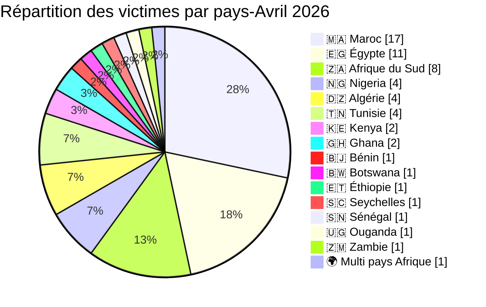
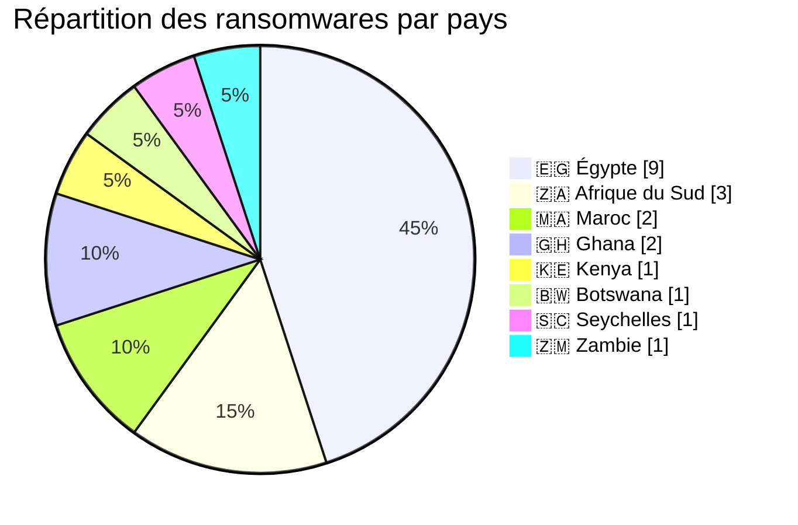
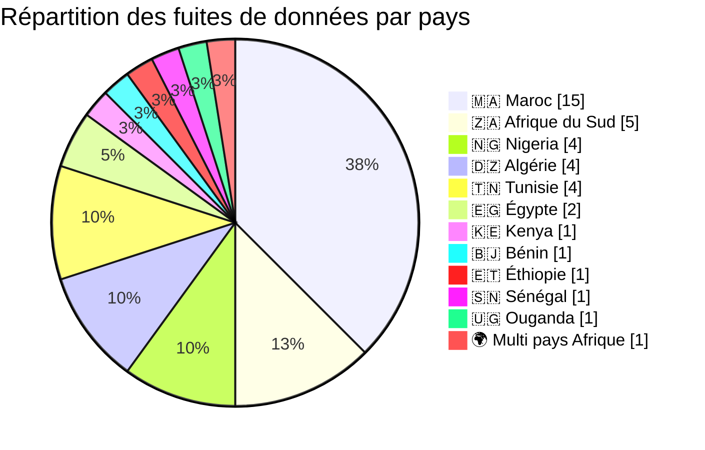
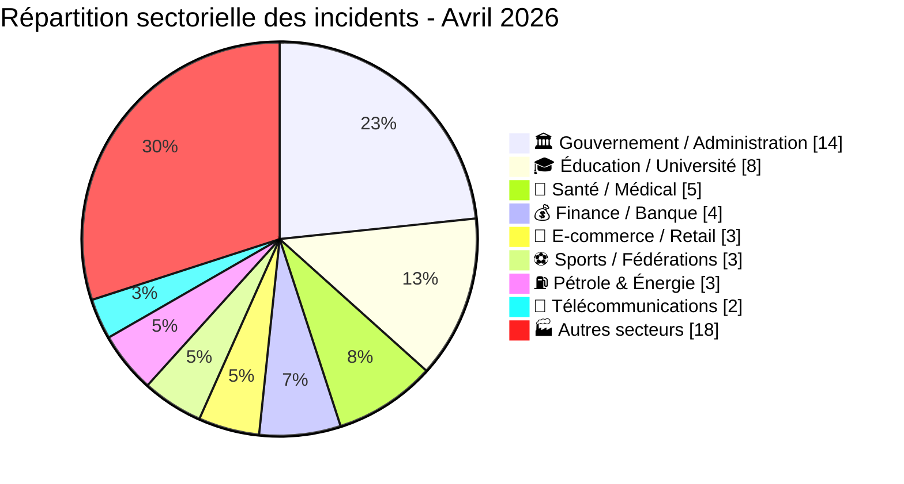
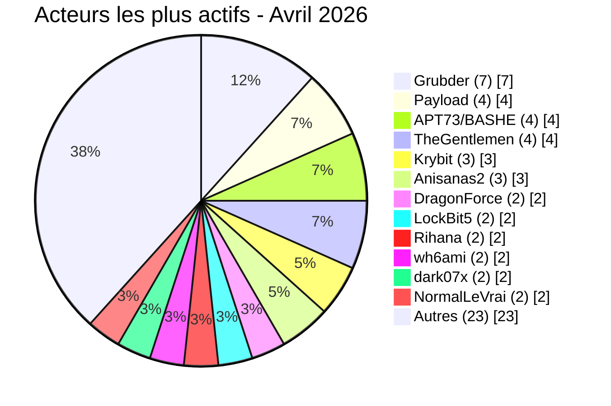

# Rapport CTI - menaces cyber en Afrique (Avril 2026)

👉🏾 [**English version available here**](./README.md)

## 1. Synthèse exécutive

Avril 2026 a enregistré **60 incidents cyber revendiqués publiquement** sur le continent - **20 ransomwares** et **40 fuites de données / ventes d’accès**. La menace s’intensifie avec une prolifération de courtiers de données, des expositions très sensibles (personnel du palais royal, documents d’identité, dossiers médicaux) et des ventes d’accès ciblant les gouvernements. Les groupes de ransomware **payload**, **apt73/bashe**, **thegentlemen** et **krybit** maintiennent la pression, tandis que les acteurs de fuites **Grubder**, **anisanas2**, **dark07x**, **wh6ami** et **Rihana** dominent le marché souterrain.

Principales conclusions :
- **20 ransomwares (33,3 %)** et **40 fuites de données / ventes d’accès (66,7 %)**.
- **18 pays** touchés ; le **Maroc** (17 incidents), l’**Égypte** (11) et l’**Afrique du Sud** (8) concentrent 60 % des victimes.
- Plus de **30 acteurs distincts** ; les courtiers de données **Grubder** (7 victimes) et **anisanas2** (4 victimes) en tête.
- Les secteurs gouvernemental, éducatif et de la santé restent les plus visés (45 % combinés).
- Brèches massives : base du personnel du Palais Royal (3 300 fiches avec CNIE), Pick n Pay ASAP/Bottles.com (données bancaires complètes), Kenya Airports Authority (2 To revendiqués), fuite de la messagerie CNSS Bénin (7,1 Go).

### 📋 Liste des victimes

👉🏾 [Voir la liste complète des victimes](./victims_FR.md)

## 2. Méthodologie

- **Périmètre** : 54 pays africains.
- **Période** : 1er - 30 avril 2026 (incidents révélés ou revendiqués ; les attaques peuvent être antérieures).
- **Sources** : Dark web, DLS, OSINT, Telegram, forums underground.
- **Inclusion** : incidents publiquement revendiqués avec victime, pays et secteur identifiés.
- **Typologie** :
  - *Ransomware* : chiffrement + demande de rançon.
  - *Fuite de données / vente d’accès* : exfiltration sans chiffrement, base de données vendue ou publiée, ou vente d’accès à des systèmes compromis.

## 3. Vue d’ensemble

| Indicateur                     | Valeur |
|--------------------------------|--------|
| Nombre total de victimes       | 60     |
| Pays touchés                   | 18     |
| Acteurs distincts              | 30+    |
| Ransomwares                    | 20 (33,3 %) |
| Fuites de données / ventes d’accès | 40 (66,7 %) |

**Pays les plus touchés :**
- 🇲🇦 Maroc : 17 victimes
- 🇪🇬 Égypte : 11 victimes
- 🇿🇦 Afrique du Sud : 8 victimes
- 🇳🇬 Nigeria : 4 victimes
- 🇩🇿 Algérie : 4 victimes
- 🇹🇳 Tunisie : 4 victimes
- 🇰🇪 Kenya : 2 victimes
- 🇬🇭 Ghana : 2 victimes
- Autres (1 victime chacun) : Sénégal, Bénin, Éthiopie, Botswana, Seychelles, Zambie, Ouganda, plus 1 incident multi‑pays (Angola/Afrique du Sud/Nigeria).

### Ransomware vs fuites de données par pays

| Pays                  | Ransomware | Fuites de données |
|-----------------------|------------|-------------------|
| 🇲🇦 Maroc             | 2          | 15                |
| 🇪🇬 Égypte            | 9          | 2                 |
| 🇿🇦 Afrique du Sud    | 3          | 5                 |
| 🇳🇬 Nigeria           | 0          | 4                 |
| 🇩🇿 Algérie           | 0          | 4                 |
| 🇹🇳 Tunisie           | 0          | 4                 |
| 🇰🇪 Kenya             | 1          | 1                 |
| 🇬🇭 Ghana             | 2          | 0                 |
| 🇧🇯 Bénin             | 0          | 1                 |
| 🇧🇼 Botswana          | 1          | 0                 |
| 🇪🇹 Éthiopie          | 0          | 1                 |
| 🇸🇨 Seychelles        | 1          | 0                 |
| 🇸🇳 Sénégal           | 0          | 1                 |
| 🇺🇬 Ouganda           | 0          | 1                 |
| 🇿🇲 Zambie            | 1          | 0                 |
| 🌍 Multi-pays Afrique | 0          | 1                 |
| **Total**             | **20**     | **40**            |

### Secteurs ciblés par pays

| Pays | Principaux secteurs ciblés |
|------|----------------------------|
| 🇩🇿 Algérie | Gouvernement (2), Assurance, Sports |
| 🇧🇯 Bénin | Gouvernement |
| 🇧🇼 Botswana | Éducation |
| 🇪🇬 Égypte | Éducation (2), Finance, Énergie (2), Automobile, Ingénierie, Manufacture, Construction|
| 🇪🇹 Éthiopie | Énergie |
| 🇬🇭 Ghana | Santé, Finance |
| 🇰🇪 Kenya | Gouvernement, Aviation |
| 🇲🇦 Maroc | Gouvernement (2), Éducation (3), Santé (3), Finance (2), Sports (3), Identité numérique, Services, Agroalimentaire / Retail, Données personnelles |
| 🇳🇬 Nigeria | Gouvernement (3), ONG (1) + accès gouvernemental multi‑pays |
| 🇸🇳 Sénégal | Gouvernement |
| 🇸🇨 Seychelles | Gouvernement |
| 🇿🇦 Afrique du Sud | E‑commerce (2), Gouvernement (2), Éducation, Télécoms, Tourisme, Agroalimentaire + accès gouvernemental multi‑pays |
| 🇹🇳 Tunisie | E‑commerce, Éducation, Services, Réseau social |
| 🇺🇬 Ouganda | Gouvernement |
| 🇿🇲 Zambie | Assurance |
| 🇦🇴 Angola | Accès gouvernemental multi‑pays (incident combiné) |

*Les chiffres entre parenthèses indiquent le nombre d’incidents lorsqu’il est supérieur à 1.*

**Répartition des ransomwares par pays - Avril 2026**

**Fuites de données par pays - Avril 2026**

**Répartition sectorielle :**
| Secteur                    | Incidents | Pourcentage |
|----------------------------|-----------|-------------|
| Gouvernement / Admin       | 14        | 23,3 %      |
| Éducation / Université     | 8         | 13,3 %      |
| Santé / Médical            | 5         | 8,3 %       |
| Finance / Banque           | 4         | 6,7 %       |
| E-commerce / Retail        | 3         | 5,0 %       |
| Sports / Fédérations       | 3         | 5,0 %       |
| Pétrole & Énergie          | 3         | 5,0 %       |
| Télécommunications         | 2         | 3,3 %       |
| Autres                     | 18        | 30,0 %      |

### Acteurs les plus prolifiques

| Acteur / Groupe      | Nombre d’incidents | Type dominant        |
|----------------------|--------------------|----------------------|
| Grubder              | 7                  | Fuites de données    |
| Payload              | 4                  | Ransomware           |
| APT73 / BASHE        | 4                  | Ransomware           |
| TheGentlemen         | 4                  | Ransomware           |
| Krybit               | 3                  | Ransomware           |
| Anisanas2            | 3                  | Fuites de données    |
| DragonForce          | 2                  | Ransomware           |
| LockBit5             | 2                  | Ransomware           |
| Rihana               | 2                  | Fuites de données    |
| wh6ami               | 2                  | Fuites de données    |
| dark07x              | 2                  | Fuites de données    |
| NormalLeVrai         | 2                  | Fuites de données    |

*Parmi les acteurs ayant réalisé un seul incident figurent notamment Nullsec/0xLei, MDGhost, RubiconH4ck, Keymous, xNov, superduper1, w00l_ysh1, BlueEx, Sejjil, forrest, mecrobyte, et d’autres (voir la liste complète des victimes).*

## 4. Analyse détaillée par type d’incident

### 4.1 Ransomware (20 incidents)

| Pays             | Attaques | Acteurs principaux |
|------------------|----------|---------------------|
| Égypte           | 9        | payload (4), dragonforce, lockbit5, thegentlemen, apt73/bashe |
| Afrique du Sud   | 3        | dragonforce, krybit, thegentlemen |
| Maroc            | 2        | worldleaks, lockbit5 |
| Ghana            | 2        | thegentlemen, apt73/bashe |
| Kenya            | 1        | apt73/bashe |
| Botswana         | 1        | krybit |
| Seychelles       | 1        | apt73/bashe |
| Zambie           | 1        | krybit |

**Observations :** le groupe ransomware **payload** a lourdement ciblé l’économie égyptienne (finance, pétrole, industrie). Le groupe **apt73/bashe** s’est étendu des gouvernements (Seychelles, Kenya) aux assurances et au pétrole.

### 4.2 Fuites de données / ventes d’accès (40 incidents)

| Pays            | Incidents | Acteurs principaux |
|-----------------|-----------|---------------------|
| Maroc           | 15        | anisanas2, Sejjil, Rihana, MDGhost, Keymous, xNov, bxxxx1 |
| Afrique du Sud  | 5         | wh6ami, p4pr1k4, Grubder |
| Algérie         | 4         | dark07x, BlueEx, Grubder |
| Tunisie         | 4         | Grubder, mecrobyte, forrest |
| Nigeria         | 4         | NormalLeVrai, 0xLei, ki4t, AckLine |
| Égypte          | 2         | Grubder |
| Autres          | 6         | divers (cf. liste des victimes) |

**Observations :** **Grubder** a vendu des bases allant de petites CRM à des universités. **anisanas2** a ciblé la santé et le football marocains. **dark07x** a exposé des cartes d’identité et des dossiers automobiles. La fuite **Pick n Pay ASAP / Bottles.com** inclut des données de paiement complètes.

## 5. Impact sectoriel

- Gouvernement / Admin : 14 incidents (23,3 %)
- Éducation / Université : 8 incidents (13,3 %)
- Santé / Médical : 5 incidents (8,3 %)
- Finance / Banque : 4 incidents (6,7 %)
- E-commerce / Retail : 3 incidents (5,0 %)
- Sports / Fédérations : 3 incidents (5,0 %)
- Pétrole & Énergie : 3 incidents (5,0 %)
- Télécommunications : 2 incidents (3,3 %)
- Autres : 18 incidents (30,0 %)

Le secteur public (gouvernement + éducation) représente **36,7 %** des incidents. Les données de santé restent très convoitées (CNOPS, LNM6, Chezpara.ma). Les fédérations sportives (FRMF, FRMT, LRFA) émergent comme cibles de choix.

## 6. Profil des acteurs

| Acteur           | Type                | Incidents | Cibles principales |
|------------------|---------------------|-----------|---------------------|
| Grubder          | Courtier de données | 7         | Gouvernements, universités, e‑commerce |
| payload          | Ransomware          | 4         | Finance, pétrole, industrie |
| APT73 / BASHE    | Ransomware          | 4         | e‑gouvernement, pétrole, assurance |
| TheGentlemen     | Ransomware          | 4         | Santé, alimentation, ingénierie |
| anisanas2        | Fuite de données    | 3         | Éducation, santé, football marocains |
| dark07x          | Fuite de données    | 2         | Assurance, football algériens |
| DragonForce      | Ransomware          | 2         | Tourisme, industrie pharmaceutique |
| LockBit5         | Ransomware          | 2         | Automobile, sports |
| wh6ami           | Fuite de données    | 2         | Municipalités sud‑africaines |
| Rihana           | Fuite de données    | 2         | Maison royale, courriels |
| NormalLeVrai     | Fuite de données    | 2         | ONG, gouvernements (sécurité sociale) |

**Acteurs émergents** : **wh6ami** (accès administrateur municipal), **forrest** (données d’application mobile), **mecrobyte** (éducation tunisienne), **Keymous** (tennis marocain).

### 6.1 Niveau de risque

| Pays | Risque |
|------|--------|
| Maroc | 🔴 Critique |
| Égypte | 🔴 Élevé |
| Afrique du Sud | 🔴 Élevé |
| Nigeria | 🟠 Moyen-Élevé |
| Algérie | 🟠 Moyen |
| Tunisie | 🟠 Moyen |
| Autres | 🟡 Faible-Moyen |

## 7. Tendances clés & lacunes

### Tendances
1. **Explosion des courtiers de données** - Grubder a multiplié les ventes de bases.
2. **Documents d’identité comme marchandise** - Passeports, cartes d’identité, packs KYC.
3. **Ventes d’accès gouvernementaux** - superduper1 (multi‑pays) et w00l_ysh1 (Trésor sénégalais).
4. **Diversification des ransomwares** - payload s’attaque au pétrole, à l’immobilier, à l’automobile.
5. **Brèches e‑commerce avec données de paiement** - Pick n Pay/Bottles.
6. **Scraping de messagerie** - CNSS Bénin.

### Lacunes
- Nombreux incidents non vérifiés techniquement.
- Revente de vieux dumps (ex. Gemaroc, septembre 2024).
- Attribution réelle inconnue (simples pseudonymes).

## 8. MITRE ATT&CK (contextuel)

| Incident | Techniques |
|----------|-----------|
| Pick n Pay/Bottles | T1005, T1041, T1078 |
| Palais Royal | T1005, T1078 |
| Kenya Airports Authority | T1041, T1078 |
| DGCPT Sénégal | T1078, T1068 (escalade de privilèges), T1021.002 (bureau à distance) |
| CNSS Bénin | T1114.002 (collecte d’emails), T1005 |

**Techniques fréquentes** : T1190 (applications exposées), T1078 (comptes valides), T1041 (exfiltration), T1486 (ransomware).

## 9. Recommandations

- **Gouvernements** : MFA obligatoire sur tous les portails, audits des systèmes e‑gov, surveillance des offres d’accès.
- **Finance & e‑commerce** : conformité PCI‑DSS, tokenisation des données de carte, monitoring des transactions.
- **Éducation & santé** : segmentation réseau, chiffrement des bases de données, exercices de réponse à incidents.
- **Grand public** : vigilance accrue contre le phishing ; éviter la réutilisation de mots de passe (surtout après la fuite de 4 millions d’emails marocains).

## 10. Recommandations SOC

- Détecter les **accès inhabituels aux portails gouvernementaux**.
- Surveiller les **téléchargements massifs** depuis les bases éducatives/médicales.
- Analyser le **trafic sortant** pour repérer les exfiltrations.
- Pour les banques : **détection en temps réel des anomalies de retraits GAB**.

## 11. Recommandations stratégiques

- Renforcer le partage de renseignements public‑privé, notamment sur les courtiers d’accès initiaux (IAB).
- Imposer des standards de sécurité stricts aux plateformes de paiement.
- Rendre obligatoires les capacités SOC pour les infrastructures critiques.

## 12. Conclusion

Avril 2026 révèle une intensification de la vente de données et des compromissions profondes des gouvernements, de l’éducation et de la santé. Le commerce de documents d’identité et les ventes d’accès témoignent d’une économie souterraine mature. Le Maroc, l’Égypte et l’Afrique du Sud restent l’épicentre, tandis que l’Algérie, la Tunisie et le Kenya émergent comme nouveaux points chauds. AFRINTEL poursuivra la surveillance de ces menaces en constante évolution.

**AFRINTEL** - Cyber Threat Intelligence africaine
[GitHub AFRINTEL](https://github.com/Hatchepsoute/AFRINTEL)
