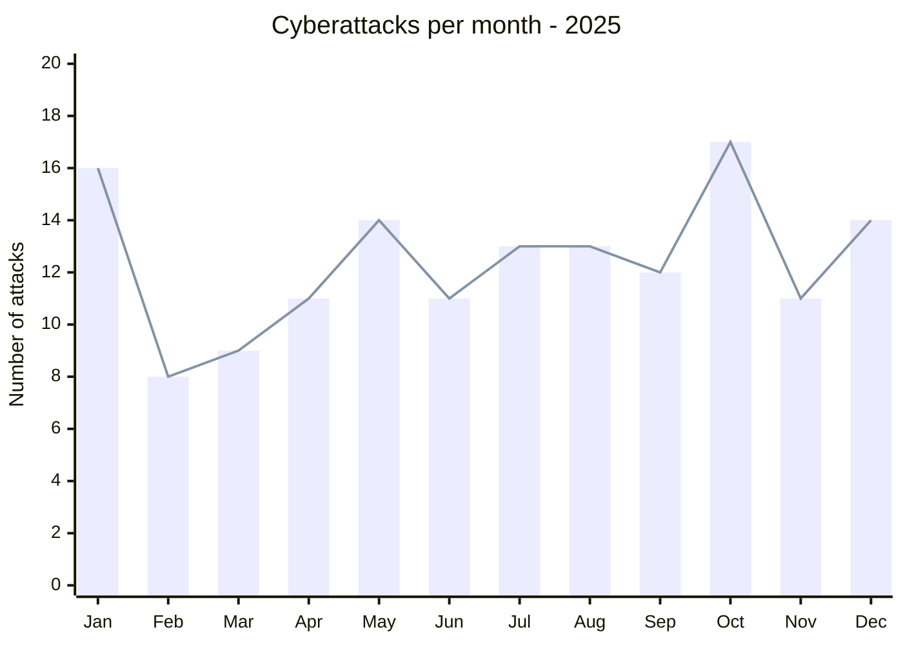
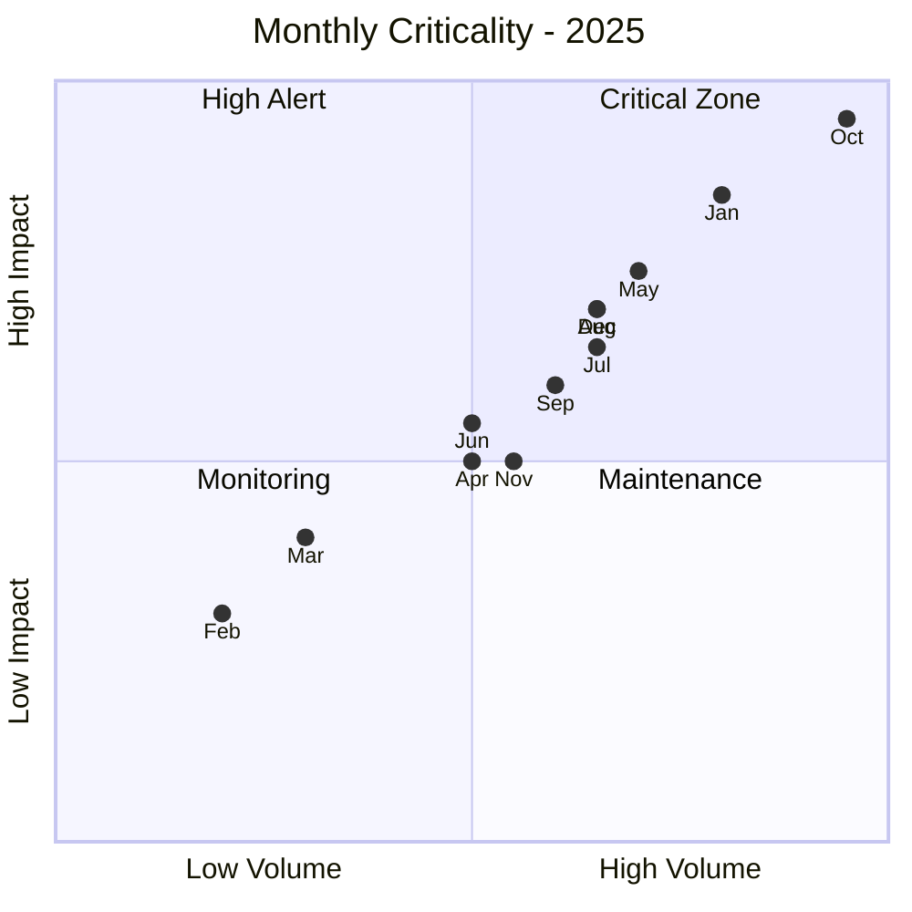
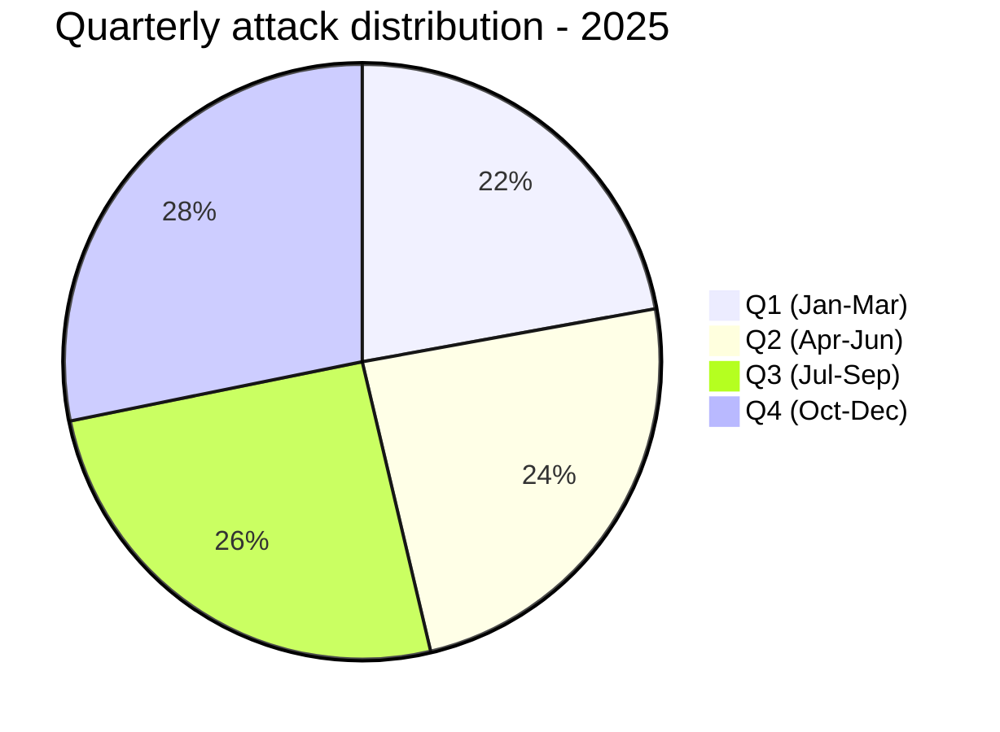
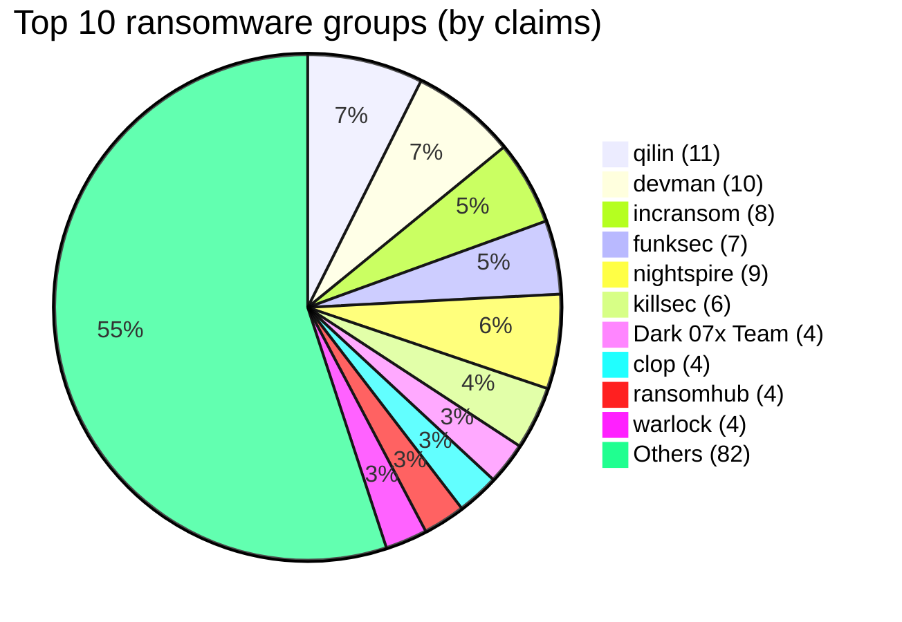
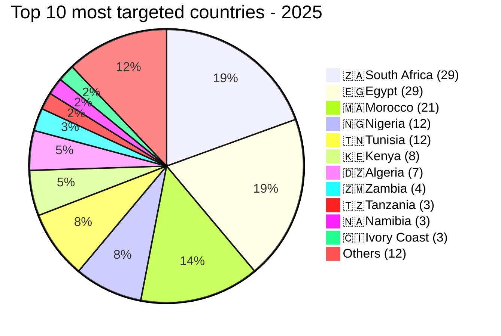
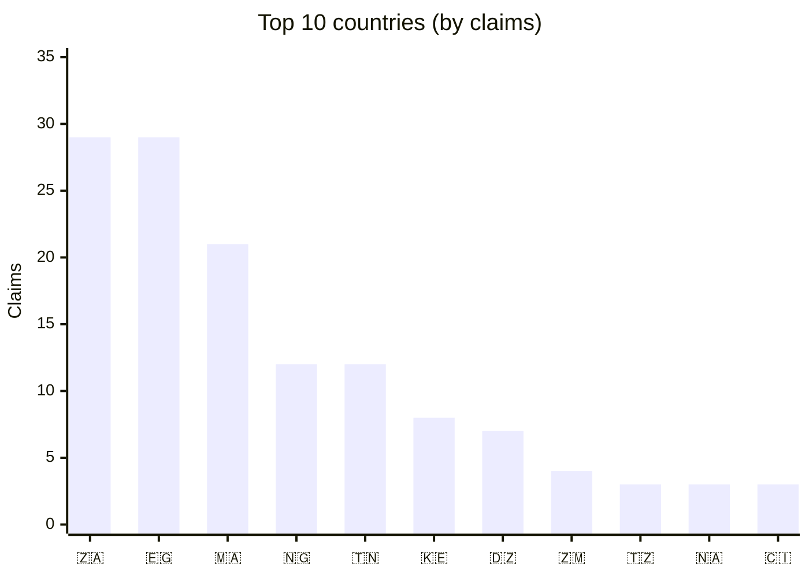
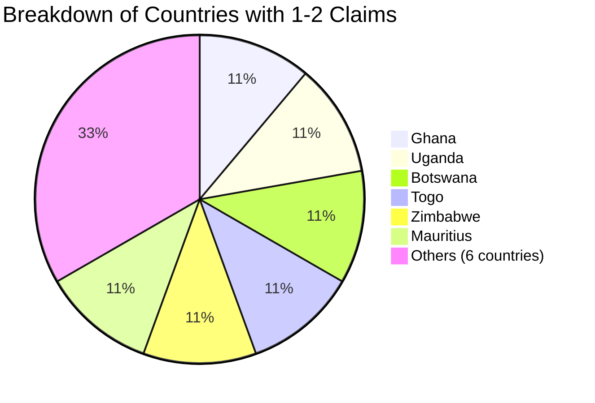
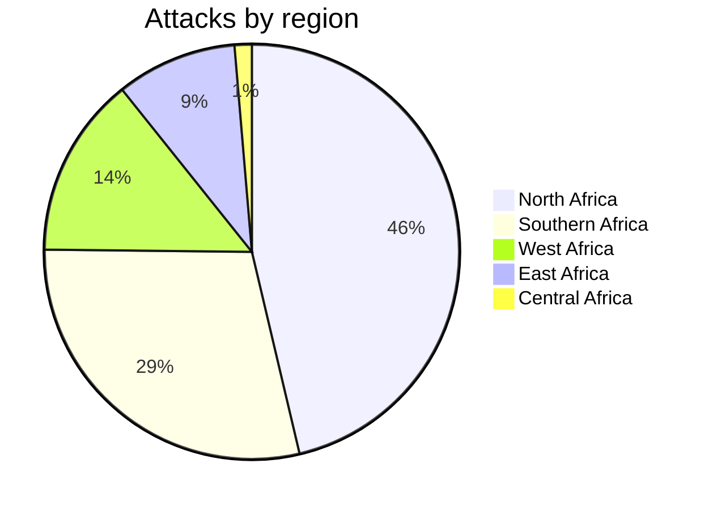
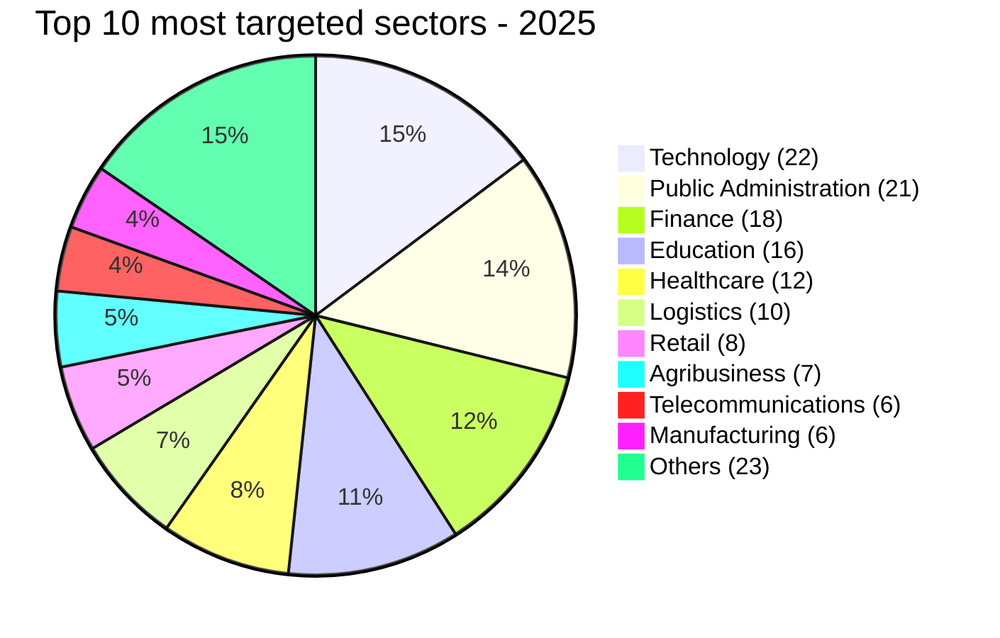
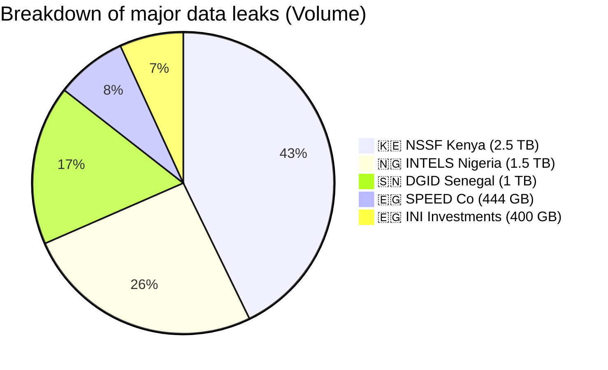

# AFRINTEL - Annual statistics 2025 (149 victims)

👉🏾 [**French version available here**](./README_FR.md)

## 📊 1. Global statistics
The **AFRINTEL** project recorded intense cybercriminal activity across the African continent during 2025, characterized by a diversification of targets and unprecedented volumes of exfiltrated data.

| Indicator | Value |
| :--- | :--- |
| **Total recorded attacks** | 149 |
| **Unique victims** | 146 |
| **Double claims** | 3 |
| **Identified threat groups** | 56 |
| **Impacted countries** | 23 |
| **Impacted sectors** | 24 |
| **Documented total exfiltrated volume** | +10 TB |

---

## 📅 2. Temporal analysis

### 2.1 Monthly breakdown
| Month | Jan | Feb | Mar | Apr | May | Jun | Jul | Aug | Sep | Oct | Nov | Dec | **Total** |
| :--- | :---: | :---: | :---: | :---: | :---: | :---: | :---: | :---: | :---: | :---: | :---: | :---: | :---: |
| **Cyberattacks** | 16 | 8 | 9 | 11 | 14 | 11 | 13 | 13 | 12 | 17 | 11 | 14 | **149** |

### 2.2 Quarterly evolution
| Quarter | Months | Attacks | Total |
| :--- | :--- | :---: | :---: |
| **Q1** | Jan-Mar | 16 + 8 + 9 | **33** |
| **Q2** | Apr-Jun | 11 + 14 + 11 | **36** |
| **Q3** | Jul-Sep | 13 + 13 + 12 | **38** |
| **Q4** | Oct-Dec | 17 + 11 + 14 | **42** |

---

## 🦠 3. Top 15 ransomware groups (2025)

The African threat landscape is characterized by the presence of major international RaaS (Ransomware-as-a-Service) players alongside emerging specialized groups.

| Rank | Group | Claims |
| :--- | :--- | :---: |
| 1 | **qilin** | 11 |
| 2 | **devman** | 10 |
| 3 | **incransom** | 8 |
| 4 | **funksec** | 7 |
| 4 | **nightspire** | 9 |
| 6 | **killsec** | 6 |
| 7 | **Dark 07x Team** | 4 |
| 8 | **clop** | 4 |
| 8 | **ransomhub** | 4 |
| 8 | **warlock** | 4 |
| 11 | **arcusmedia** | 3 |
| 11 | **babuk2** | 3 |
| 11 | **dragonforce** : 3 |
| 11 | **GDLockerSec** | 3 |
| 11 | **lockbit5** | 3 |
| 11 | **spacebears** | 3 |
| 11 | **thegentlemen** | 3 |
| - | *Other 30+ groups* | 61 |
| **Total** | | **149** |

### 📊 3.1 Market share - top 10 groups

---

## 🌍 4. Most targeted countries (Top 10 and others)

The 2025 landscape shows a high concentration of ransomware activity in a few key economic hubs. The top 3 countries (South Africa, Egypt, and Morocco) account for over **53%** of the total claims on the continent.

### 🏆 4.1. Top 10 countries

| Rank | Country | Claims |
| :--- | :--- | :---: |
| 1 | 🇿🇦 **South Africa** | 29 |
| 2 | 🇪🇬 **Egypt** | 29 |
| 3 | 🇲🇦 **Morocco** | 21 |
| 4 | 🇳🇬 **Nigeria** | 12 |
| 5 | 🇹🇳 **Tunisia** | 12 |
| 6 | 🇰🇪 **Kenya** | 8 |
| 7 | 🇩🇿 **Algeria** | 7 |
| 8 | 🇿🇲 **Zambia** | 4 |
| 9 | 🇹🇿 **Tanzania** | 3 |
| 10 | 🇳🇦 **Namibia** | 3 |
| 11 | 🇨🇮 **Ivory Coast** | 3 |
| - | *Others (12 countries)* | 18 |
| **Total** | | **149** |

*Note: countries with 3 claims share the 9th rank.*
### 📊 4.2 Geographical distribution

### 📍4.3 Other affected countries (1‑2 claims)

While the top hubs concentrate the majority of attacks, a wide range of other nations are increasingly appearing on ransomware leak sites, totaling **18 additional claims**.

| Country | Claims |
| :--- | :---: |
| 🇬🇭 **Ghana** | 2 |
| 🇺🇬 **Uganda** | 2 |
| 🇧🇼 **Botswana** | 2 |
| 🇹🇬 **Togo** | 2 |
| 🇿🇼 **Zimbabwe** | 2 |
| 🇲🇺 **Mauritius** | 2 |
| 🇲🇬 **Madagascar** | 1 |
| 🇨🇩 **Congo (DRC)** | 1 |
| 🇬🇦 **Gabon** | 1 |
| 🇨🇲 **Cameroon** | 1 |
| 🇸🇳 **Senegal** | 1 |
| 🇷🇼 **Rwanda** | 1 |

#### 📊4.3.1 Visualization of the long tail

### 4.4 Regional summary
This table summarizes the geographical distribution of the **149 cyberattacks** recorded by the **AFRINTEL** project across the African continent during 2025. 

Regional analysis reveals a major concentration of the threat in the northern part of the continent, driven by intense activity in **Egypt** and **Morocco**.

| Region | Number of attacks | Share |
| :--- | :---: | :---: |
| **North Africa** | 69 | 46.3% |
| **Southern Africa** | 43 | 28.9% |
| **West Africa** | 21 | 14.1% |
| **East Africa** | 14 | 9.4% |
| **Central Africa** | 2 | 1.3% |

---

## 🏢 5. Sectoral analysis

### 5.1 Top 15 most targeted sectors
| Rank | Industry Sector | Number of Attacks |
| :--- | :--- | :---: |
| 1 | 💻 **Technologies** | 22 |
| 2 | 🏛️ **Public Administration** | 21 |
| 3 | 💰 **Finance** | 18 |
| 4 | 🎓 **Education** | 16 |
| 5 | 🏥 **Healthcare** | 12 |
| 6 | 🚚 **Logistics** | 10 |
| 7 | 🛒 **Retail** | 8 |
| 8 | 🌾 **Agribusiness** | 7 |
| 9 | 🏗️ **Manufacturing** | 6 |
| 9 | 📞 **Telecommunications** | 6 |
| 11 | **Insurance** | 5 |
| 11 | **Banking** | 5 |
| 13 | **Construction** | 3 |
| 13 | **Energy** | 3 |
| 13 | **Business Services** | 3 |

---

## 💾 6. Major Incidents & double claims

### 6.1 Top 5 Data Exfiltrations
| Victim | Country | Group | Volume |
| :--- | :---: | :--- | :--- |
| **NSSF Kenya** | 🇰🇪 | devman | **2.5 TB** |
| **INTELS Nigeria** | 🇳🇬 | ransomhub | 1.5 TB |
| **DGID Senegal** | 🇸🇳 | BlackShrantac | 1 TB |
| **SPEED Co** | 🇪🇬 | hunter4 | 444.8 GB |
| **INI Investments** | 🇪🇬 | nightspire | 400 GB |

#### 📊 6.1.1 Data volume comparison

### 6.2 Double claim phenomenon (same victim, two different groups)
| Victim | Country | 1st Group | 2nd Group |
| :--- | :---: | :--- | :--- |
| **Hopital La Rabta** | 🇹🇳 | devman (12/12) | qilin (12/26) |
| **Netstar South Africa** | 🇿🇦 | devman (05/23) | incransom (08/20) |
| **Proplastics Limited** | 🇿🇼 | thegentlemen (09/09) | lockbit5 (12/26) |

---

## 📌 7. 2025 Highlights

The year 2025 was marked by a significant intensification of double-extortion operations across the continent. Key takeaways include:

* 🚀 **Peak activity**: October, with **17 recorded attacks**.
* 📉 **Least active Month**: February (**08 attacks**).
* 🏆 **Dominant actor**: `Qilin`, with **11 documented attacks**.
* 📍 **Most targeted countries**: South Africa & Egypt (**29 cyberattacks** each).
* 💻 **Most targeted sectors**: Technology (**22 attacks**), followed by Public Administration (**21**).
* 💾 **Largest exfiltration**: **2.5 TB** of data stolen from NSSF Kenya.
* 💰 **Record ransom**: **$4.5M** demanded from NSSF Kenya.

---
## 8. Key facts & figures
* **Total claims**: 149 → 146 unique victims (3 organisations hit twice).
* **Most prolific group**: qilin (11 claims).
* **Most active month**: October (17 claims).
* **Most targeted country**: South Africa and Egypt (29 cyberattacks each).
* **Largest data leak**: NSSF Kenya - 2.5 TB (devman).
* **Highest ransom demand**: NSSF Kenya - $4.5 million.
* **Sectors most under pressure**: Technology, public administration, finance.
* **North Africa** accounted for 46 % of all attacks (69 claims).

---
### ✍🏿 Author
**Adama ASSIONGBON** *SOC & Cyber Threat Intelligence Consultant* [LinkedIn Profile](https://www.linkedin.com/in/adama-assiongbon-9029893a/)

***AFRINTEL*** - *Open CTI Monitoring Initiative for Africa*
