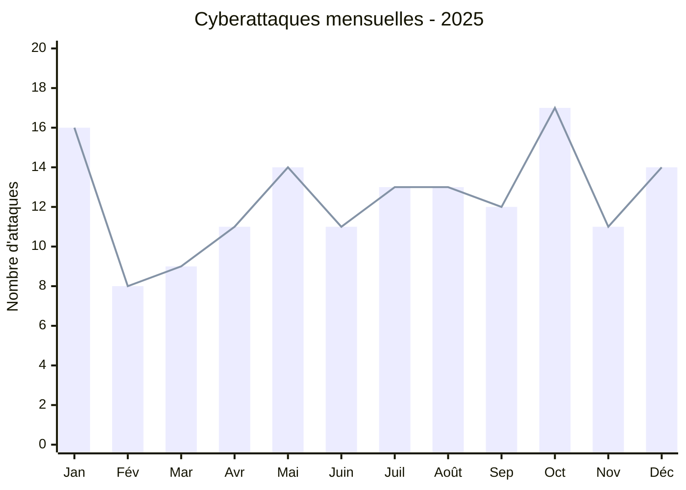
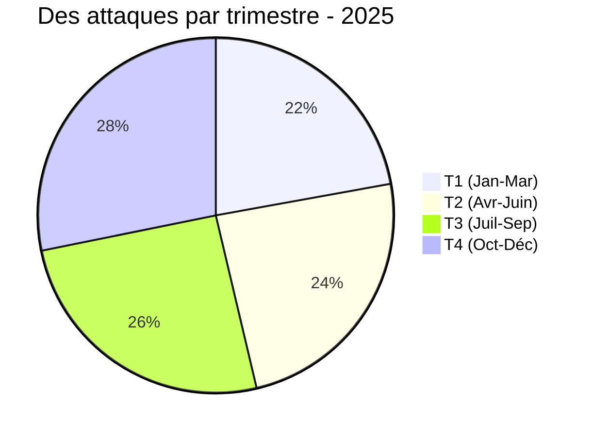
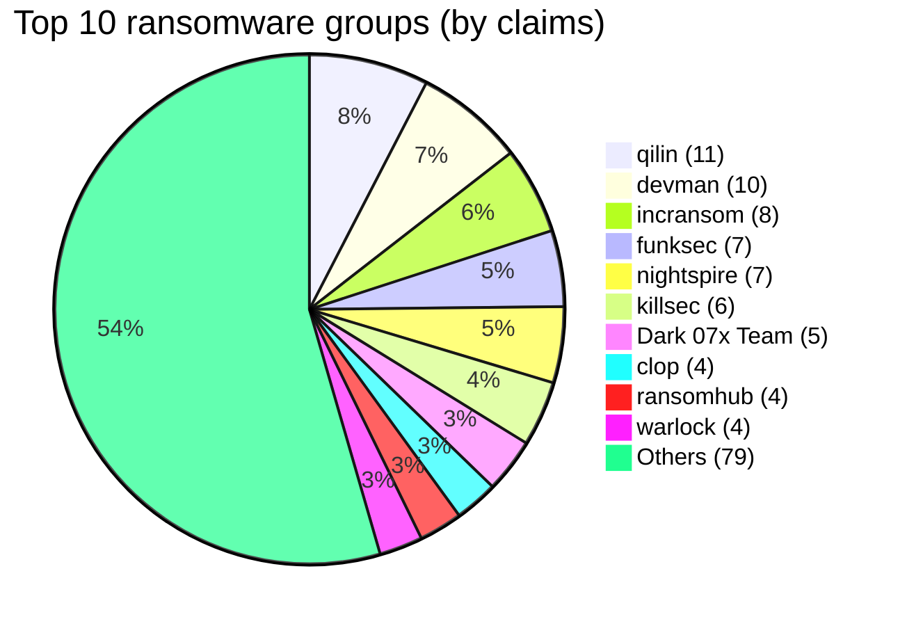
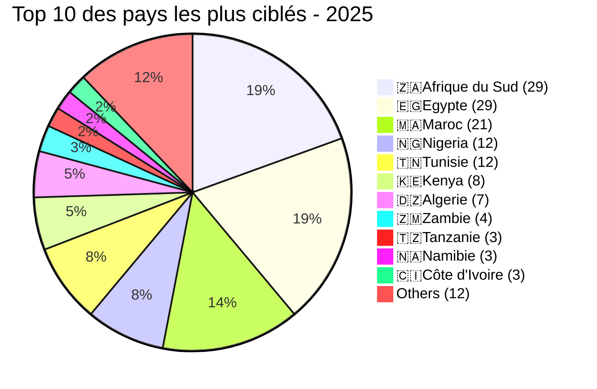
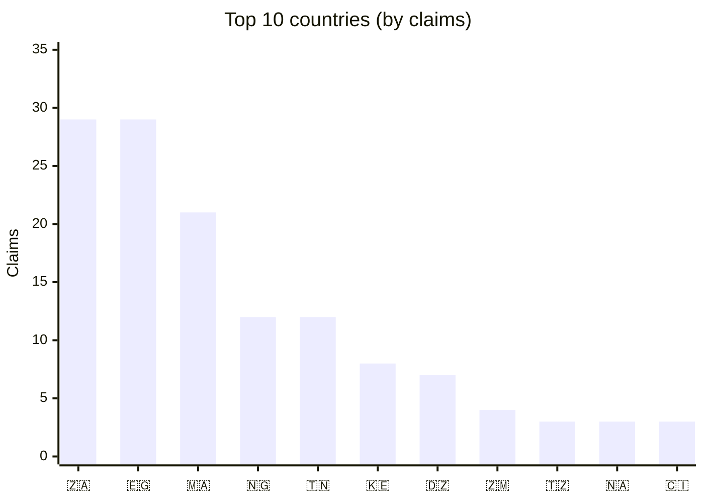
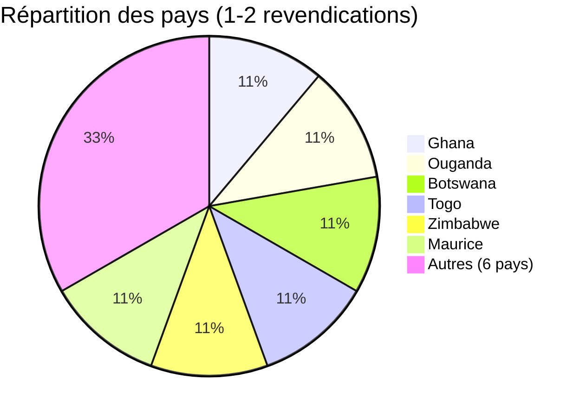
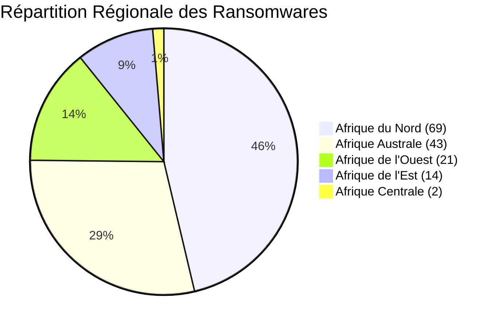
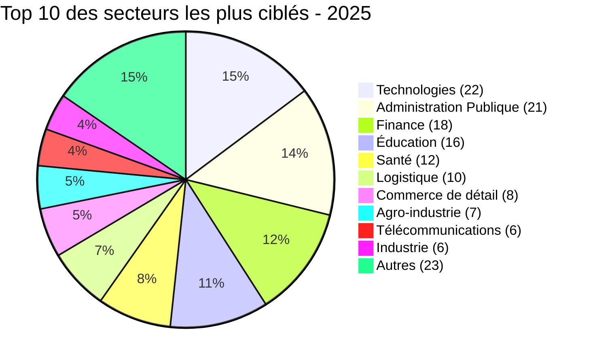
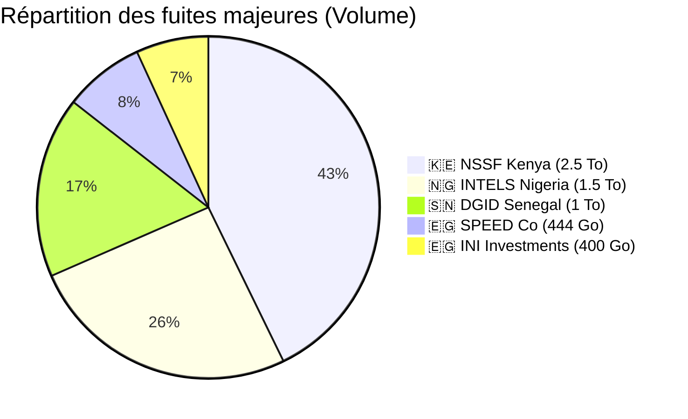

# AFRINTEL - Statistiques annuelles 2025 (149 victimes)

👉🏾 [**English version available here**](./README.md)

## 📊 1. Statistiques globales
Le projet **AFRINTEL** a recensé une activité cybercriminelle intense sur le continent africain durant l'année 2025, caractérisée par une diversification des cibles et des volumes de données exfiltrés sans précédent.

| Indicateur | Valeur |
| :--- | :--- |
| **Total des attaques recensées** | 149 |
| **Victimes uniques** | 146 |
| **Doubles revendications** | 3 |
| **Groupes distincts identifiés** | 56 |
| **Pays touchés** | 23 |
| **Secteurs impactés** | 24 |
| **Volume total exfiltré documenté** | +10 To |

---

## 📅 2. Analyse temporelle

### 2.1 Répartition mensuelle
L'activité a connu une croissance quasi constante, culminant au dernier trimestre.

| Mois | Jan | Fév | Mar | Avr | Mai | Juin | Juil | Août | Sep | Oct | Nov | Déc | **Total** |
| :--- | :---: | :---: | :---: | :---: | :---: | :---: | :---: | :---: | :---: | :---: | :---: | :---: | :---: |
| **Cyberattaques** | 16 | 8 | 9 | 11 | 14 | 11 | 13 | 13 | 12 | 17 | 11 | 14 | **149** |

### 2.2 Évolution trimestrielle
| Trimestre | Mois | Attaques | Cumul |
| :--- | :--- | :---: | :---: |
| **T1** | Jan-Mar | 16 + 8 + 9 | **33** |
| **T2** | Avr-Juin | 11 + 14 + 11 | **36** |
| **T3** | Juil-Sep | 13 + 13 + 12 | **38** |
| **T4** | Oct-Déc | 17 + 11 + 14 | **42** |

---

## 🦠 3. Top 15 des groupes de ransomware (2025)

Le paysage des menaces en Afrique se caractérise par la présence de grands acteurs internationaux du RaaS (Ransomware-as-a-Service) aux côtés de groupes émergents spécialisés.

| Rang | Groupe | Revendications |
| :--- | :--- | :---: |
| 1 | **qilin** | 11 |
| 2 | **devman** | 10 |
| 3 | **incransom** | 8 |
| 4 | **funksec** | 7 |
| 4 | **nightspire** | 7 |
| 6 | **killsec** | 6 |
| 7 | **Dark 07x Team** | 5 |
| 8 | **clop** | 4 |
| 8 | **ransomhub** | 4 |
| 8 | **warlock** | 4 |
| 11 | **arcusmedia** | 3 |
| 11 | **babuk2** | 3 |
| 11 | **dragonforce** : 3 |
| 11 | **GDLockerSec** | 3 |
| 11 | **lockbit5** | 3 |
| 11 | **spacebears** | 3 |
| 11 | **thegentlemen** | 3 |
| - | *Autres (30+ groupes)* | 61 |
| **Total** | | **149** |

### 📊 3.1. Répartition par groupe (Top 10)

---

## 🌍 4. Analyse géographique & régionale

### 🌍 4.1 Pays les plus touchés (Top 10 et autres)

Le paysage de l'année 2025 montre une forte concentration de l'activité des ransomwares sur quelques hubs économiques majeurs. Le trio de tête (Afrique du Sud, Égypte et Maroc) représente à lui seul plus de **53 %** du total des revendications sur le continent.

### 🏆 Top 10 des pays les plus touchés

| Rang | Pays | Revendications |
| :--- | :--- | :---: |
| 1 | 🇿🇦 **Afrique du Sud** | 29 |
| 1 | 🇪🇬 **Égypte** | 29 |
| 3 | 🇲🇦 **Maroc** | 21 |
| 4 | 🇳🇬 **Nigeria** | 12 |
| 4 | 🇹🇳 **Tunisie** | 12 |
| 6 | 🇰🇪 **Kenya** | 8 |
| 7 | 🇩🇿 **Algérie** | 7 |
| 8 | 🇿🇲 **Zambie** | 4 |
| 9 | 🇹🇿 **Tanzanie** | 3 |
| 9 | 🇳🇦 **Namibie** | 3 |
| 9 | 🇨🇮 **Côte d'Ivoire** | 3 |
| - | *Autres (12 pays)* | 18 |
| **Total** | | **149** |

### 📊 4.2 Répartition géographique

### 📍4.3 Autres pays touchés (1‑2 revendications)

Bien que les hubs principaux concentrent la majorité des attaques, une grande variété d'autres nations apparaît de plus en plus sur les sites de fuite des ransomwares, totalisant **18 revendications supplémentaires**.

| Pays | Revendications |
| :--- | :---: |
| 🇬🇭 **Ghana** | 2 |
| 🇺🇬 **Ouganda** | 2 |
| 🇧🇼 **Botswana** | 2 |
| 🇹🇬 **Togo** | 2 |
| 🇿🇼 **Zimbabwe** | 2 |
| 🇲🇺 **Maurice** | 2 |
| 🇲🇬 **Madagascar** | 1 |
| 🇨🇩 **Congo (RDC)** | 1 |
| 🇬🇦 **Gabon** | 1 |
| 🇨🇲 **Cameroun** | 1 |
| 🇸🇳 **Sénégal** | 1 |
| 🇷🇼 **Rwanda** | 1 |

#### 📊 4.3.1 Visualisation de la "longue traîne"

### 4.4 Synthèse par région
Ce tableau récapitule la distribution géographique des 149 cyberattaques recensées par le projet *AFRINTEL* sur le continent africain au cours de l'année 2025.

L'analyse par grandes zones géographiques révèle une concentration majeure de la menace sur la partie septentrionale du continent, portée par l'activité intense en **Égypte** et au **Maroc**.

| Région | Nombre d'attaques | Part (%) |
| :--- | :---: | :---: |
| **Afrique du Nord** | 69 | 46.3% |
| **Afrique Australe** | 43 | 28.9% |
| **Afrique de l'Ouest** | 21 | 14.1% |
| **Afrique de l'Est** | 14 | 9.4% |
| **Afrique Centrale** | 2 | 1.3% |
| **Total** | **149** | **100%** |

#### 📊 Répartition de la menace par région

---

## 🏢 5. Analyse sectorielle
Les secteurs technologiques et administratifs restent les cibles prioritaires pour l'extorsion de données.
### 5.1 Top 15 des secteurs les plus ciblés
| Rang | Secteur d'activité | Nombre d'attaques |
| :--- | :--- | :---: |
| 1 | 💻 **Technologies** | 22 |
| 2 | 🏛️ **Administrations publiques** | 21 |
| 3 | 💰 **Finance** | 18 |
| 4 | 🎓 **Éducation** | 16 |
| 5 | 🏥 **Santé** | 12 |
| 6 | 🚚 **Logistique** | 10 |
| 7 | 🛒 **Commerce de détail** | 8 |
| 8 | 🌾 **Agroalimentaire** | 7 |
| 9 | 🏗️ **Industrie manufacturière** | 6 |
| 9 | 📞 **Télécommunications** | 6 |
|11 |	**Assurances**	  | 5 |
|11 |	**Banque**	  | 5 |
|13 |	**Construction**	  | 3 |
|13 |	**Énergie**	  | 3 |
|13 |	**Services aux entreprises**	| 3 |

---

## 💾 6. Incidents majeurs & doubles revendications

### 6.1 Top 5 des exfiltrations de données
| Victime | Pays | Groupe | Volume |
| :--- | :---: | :--- | :--- |
| **NSSF Kenya** | 🇰🇪 | devman | **2,5 To** |
| **INTELS Nigeria** | 🇳🇬 | ransomhub | 1,5 To |
| **DGID Sénégal** | 🇸🇳 | BlackShrantac | 1 To |
| **SPEED Co** | 🇪🇬 | hunter4 | 444,8 Go |
| **INI Investments** | 🇪🇬 | nightspire | 400 Go |

#### 📊 6.1.1 Comparaison des volumes de données

### 6.2 Phénomène de double revendication
| Victime | Pays | 1er groupe | 2ème groupe |
| :--- | :---: | :--- | :--- |
| **Hopital La Rabta** | 🇹🇳 | devman (12/12) | qilin (26/12) |
| **Netstar South Africa** | 🇿🇦 | devman (23/05) | incransom (20/08) |
| **Proplastics Limited** | 🇿🇼 | thegentlemen (09/09) | lockbit5 (26/12) |

## 📌 7. Points saillants 2025

L'année 2025 a été marquée par une intensification des opérations de double extorsion. Voici les éléments majeurs à retenir :

* 🚀 **Pic d'activité** : Octobre, avec **17 attaques** recensées.
* 📉 **Mois le moins actif** : Février (**08 attaques**).
* 🏆 **Acteur dominant** : `Qilin` avec **11 attaques** documentées.
* 📍 **Pays le plus ciblé** : L'Afrique du Sud & Egypte (**29 cyberattaques** chacun).
* 💻 **Secteur le plus ciblé** : Technologies (**22 attaques**) puis Administrations publiques (**21**).
* 💾 **Plus grande exfiltration** : **2,5 To** de données dérobées à la NSSF Kenya.
* 💰 **Rançon record** : **4,5 M$** réclamés à la NSSF Kenya.

---

## 📊 8. Faits et chiffres clés

Cette section résume les données consolidées du projet *AFRINTEL* pour l'ensemble de l'exercice.

* **Total des revendications** : **149** (correspondant à **146 victimes uniques**, 3 organisations ayant été ciblées deux fois).
* **Groupe le plus prolifique** : `qilin` (**11 revendications**).
* **Mois le plus actif** : Octobre (**17 revendications** validées).
* **Pays les plus ciblés** : Afrique du Sud et Égypte (**29 chacun**).
* **Plus importante fuite de données** : NSSF Kenya - **2,5 To** (attribué à `devman`).
* **Demande de rançon la plus élevée** : NSSF Kenya - **4,5 millions de dollars**.
* **Secteurs sous pression** : Technologies, administration publique et finance.
* **Dominance régionale** : L'**Afrique du Nord** concentre **46 %** de toutes les attaques du continent (**69 revendications**).
---

### ✍🏿 Auteur
**Adama ASSIONGBON** *Consultant SOC & Cyber Threat Intelligence* [Profil LinkedIn](https://www.linkedin.com/in/adama-assiongbon-9029893a/)

***AFRINTEL*** - *Initiative ouverte de veille CTI sur l’Afrique*
