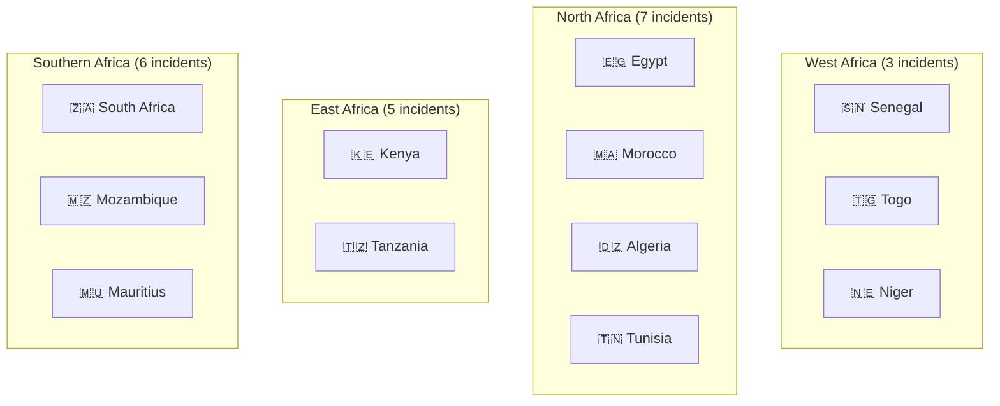
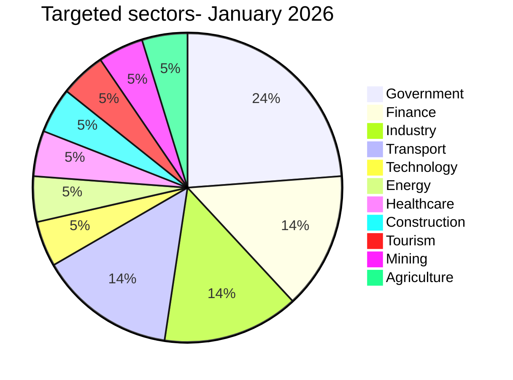

# # AFRINTEL - Cyberattack statistics in Africa by actor and country (January 2026)

👉🏾 [**French statistical intelligence report**](./README_FR.md)

January 2026 reflects a period of sustained cyber pressure across the African continent, characterized by increased activity from structured ransomware groups, the emergence of opportunistic actors, and persistent unattributed attacks targeting governmental entities and strategic sectors.  

This statistical intelligence report highlights the dynamics of threat actors, geographic exposure, targeted sectors, and operational trends observed during the month in order to support strategic decision‑making and threat anticipation.

---

# 📊 Overview

| Metric | Value |
|---|---|
| Documented incidents | **21** |
| Countries affected | **12** |
| Identified threat actors | **11** |
| Unattributed incidents | **1** *(Niger- Unknown)* |
| Ransomware incidents | **18** |
| Data leak incidents | **2** |
| Website defacement | **1** |

> Reliability note: entries on leak sites and underground forums are treated as **claims** unless independently confirmed.

---

# 🗺️ Country distribution

| Country | Incidents | Main actors |
|---|---|---|
| 🇿🇦 South Africa | 4 | thegentlemen, vect |
| 🇰🇪 Kenya | 4 | thegentlemen, tengu, blackshrantac, devman |
| 🇪🇬 Egypt | 3 | thegentlemen, tengu, direwolf |
| 🇲🇦 Morocco | 2 | tengu, skra1a |
| 🇩🇿 Algeria | 1 | tengu |
| 🇲🇺 Mauritius | 1 | thegentlemen |
| 🇲🇿 Mozambique | 1 | qilin |
| 🇸🇳 Senegal | 1 | breach3d |
| 🇹🇿 Tanzania | 1 | benzona |
| 🇹🇬 Togo | 1 | Bigbrother |
| 🇹🇳 Tunisia | 1 | tengu |
| 🇳🇪 Niger | 1 | Unknown |

---

# 🎯 Actor distribution

| Actor | Incidents |
|---|---|
| thegentlemen | **6** |
| tengu | **5** |
| Bigbrother | 1 |
| breach3d | 1 |
| skra1a | 1 |
| qilin | 1 |
| vect | 1 |
| direwolf | 1 |
| benzona | 1 |
| blackshrantac | 1 |
| devman | 1 |
| Unknown | 1 |

---

# 🧭 Sector Distribution

| Sector | Incidents |
|---|---|
| Government / Administration | 5 |
| Financial Services | 3 |
| Industry | 3 |
| Transport / Logistics | 3 |
| Technology | 1 |
| Energy | 1 |
| Healthcare | 1 |
| Construction | 1 |
| Tourism | 1 |
| Mining | 1 |
| Agriculture / Food | 1 |

---

# 📊 Visual Intelligence Layer

## Actor distribution

```mermaid
flowchart TB

classDef high fill:#ff4d4d,color:#ffffff
classDef medium fill:#ffa64d,color:#000000
classDef low fill:#ffe6b3,color:#000000

A1["thegentlemen (6)"]:::high
A2["tengu (5)"]:::high
A3["Bigbrother"]:::medium
A4["Unknown"]:::medium

A5["vect"]
A6["qilin"]
A7["skra1a"]
A8["breach3d"]
A9["direwolf"]
A10["benzona"]
A11["blackshrantac"]
A12["devman"]
```

---

## Regional Threat Heatmap

---

## Sector Distribution

---

# ⚠ Key incidents

### 🇳🇪 Niger - Government defacement (Unknown)
Large‑scale coordinated website defacement targeting multiple government portals.

### 🇸🇳 PixPay - Data breach (breach3d)
Exposure and sale of fintech‑related data.

### 🇲🇦 AOM Aviation - Data exposure (skra1a)
Leak involving aviation‑related operational or database records.

---

# 🛡 SOC & CTI recommendations

• Monitor dominant actors **thegentlemen** and **tengu**  
• Harden public‑facing government portals (WAF, patching, CMS security)  
• Monitor abnormal data exfiltration patterns  
• Prepare ransomware and data‑leak crisis playbooks  
---
## 🔗 Quick links

- [Full report (FR)](/reports/2026/01-january/README.md)
- [Full report (EN)](/reports/2026/01-january/README_EN.md)
---

*AFRINTEL - African Threat Intelligence Initiative*
*TLP:CLEAR*
